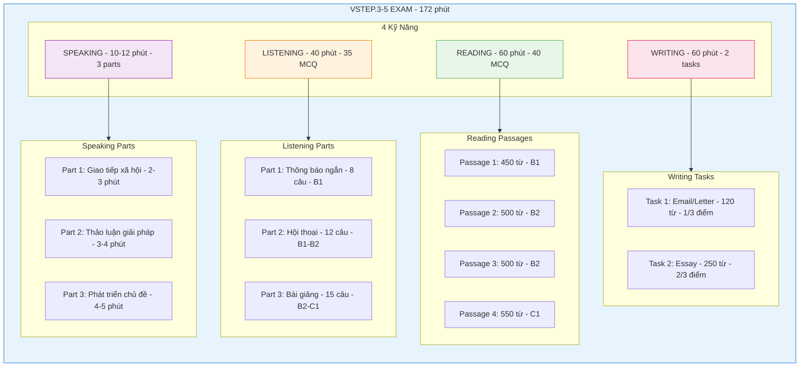

# VSTEP Exam Structure

## Tổng quan

| Thông tin | Chi tiết |
|-----------|----------|
| **Tên đầy đủ** | Vietnamese Standardized Test of English Proficiency |
| **Đơn vị** | Vietnam National University (VNU) |
| **Phiên bản** | VSTEP.3-5 |
| **Levels** | B1, B2, C1 (CEFR) |

---

## Căn Cứ Pháp Lý

| Văn bản | Nội dung |
|---------|----------|
| **Thông tư 01/2014/TT-BGDĐT** | Khung năng lực ngoại ngữ 6 bậc dùng cho Việt Nam (24/01/2014) |
| **Quyết định 729/QĐ-BGDĐT** | Quy định định dạng đề thi VSTEP B1-C1 (Bậc 3-5) |
| **Quyết định 1481/QĐ-BGDĐT** | Quy định định dạng đề thi VSTEP A2 (Bậc 2) |

**Nguồn chính thức**: [vstep.vnu.edu.vn](https://vstep.vnu.edu.vn) | [Thông tư 01/2014](https://english.luatvietnam.vn/circular-no-01-2014-tt-bgddt)

---

## Cấu trúc bài thi

| Kỹ năng | Thời gian | Số câu/task | Format |
|---------|-----------|-------------|--------|
| **Listening** | 40 phút | 35 MCQ | 3 parts |
| **Reading** | 60 phút | 40 MCQ | 4 passages |
| **Writing** | 60 phút | 2 tasks | Letter + Essay |
| **Speaking** | 10-12 phút | 3 parts | Face-to-face |

**Tổng thời gian**: ~172 phút

---

## Chi tiết từng phần

### Listening (40 phút)

| Part | Câu hỏi | Nội dung | Level |
|------|---------|----------|-------|
| **Part 1** | Q1-8 | 8 thông báo ngắn | B1 |
| **Part 2** | Q9-20 | 3 hội thoại dài | B1-B2 |
| **Part 3** | Q21-35 | 3 bài giảng/thuyết trình | B2-C1 |

**Lưu ý**: Audio chỉ phát **MỘT LẦN**

---

### Reading (60 phút)

| Passage | Câu hỏi | Độ dài | Level |
|---------|---------|--------|-------|
| **Passage 1** | Q1-10 | ~450 từ | B1 |
| **Passage 2** | Q11-20 | ~500 từ | B2 |
| **Passage 3** | Q21-30 | ~500 từ | B2 |
| **Passage 4** | Q31-40 | ~550 từ | C1 |

**Tổng**: 1,900-2,500 từ

---

### Writing (60 phút)

| Task | Dạng bài | Số từ | Thời gian | Trọng số |
|------|----------|-------|-----------|----------|
| **Task 1** | Email/Letter | ≥120 từ | ~20 phút | 1/3 |
| **Task 2** | Essay | ≥250 từ | ~40 phút | 2/3 |

---

### Speaking (10-12 phút)

| Part | Tên | Thời gian | Nội dung |
|------|-----|-----------|----------|
| **Part 1** | Social Interaction | 2-3 phút | 3-6 câu hỏi về 2 chủ đề |
| **Part 2** | Solution Discussion | 3-4 phút | Chọn 1 trong 3 giải pháp |
| **Part 3** | Topic Development | 4-5 phút | Trình bày + Follow-up |

---

## Visual Overview



```
┌─────────────────────────────────────────────────────────────┐
│                    VSTEP.3-5 EXAM                           │
├─────────────────────────────────────────────────────────────┤
│                                                             │
│  ┌─────────────┐  ┌─────────────┐  ┌─────────────┐         │
│  │  LISTENING  │  │   READING   │  │   WRITING   │         │
│  │   40 min    │  │   60 min    │  │   60 min    │         │
│  │   35 MCQ    │  │   40 MCQ    │  │  2 tasks    │         │
│  └─────────────┘  └─────────────┘  └─────────────┘         │
│                                                             │
│  ┌─────────────┐                                           │
│  │  SPEAKING   │     Total: ~172 minutes                   │
│  │  10-12 min  │                                           │
│  │  3 parts    │                                           │
│  └─────────────┘                                           │
│                                                             │
└─────────────────────────────────────────────────────────────┘
```
