# VSTEP Exam Structure

## Tổng quan

| Thông tin | Chi tiết |
|-----------|----------|
| **Tên đầy đủ** | Vietnamese Standardized Test of English Proficiency |
| **Đơn vị** | Vietnam National University (VNU) |
| **Phiên bản** | VSTEP.3-5 |
| **Levels** | B1, B2, C1 (CEFR) |

---

## Cấu trúc bài thi

| Kỹ năng | Thời gian | Số câu/task | Format |
|---------|-----------|-------------|--------|
| **Listening** | 40 phút | 35 MCQ | 3 parts |
| **Reading** | 60 phút | 40 MCQ | 4 passages |
| **Writing** | 60 phút | 2 tasks | Letter + Essay |
| **Speaking** | 12 phút | 3 parts | Face-to-face |

**Tổng thời gian**: ~172 phút

---

## Chi tiết từng phần

### 🎧 Listening (40 phút)

| Part | Câu hỏi | Nội dung | Level |
|------|---------|----------|-------|
| **Part 1** | Q1-8 | 8 thông báo ngắn | B1 |
| **Part 2** | Q9-20 | 3 hội thoại dài | B1-B2 |
| **Part 3** | Q21-35 | 3 bài giảng/thuyết trình | B2-C1 |

⚠️ **Lưu ý**: Audio chỉ phát **MỘT LẦN**

---

### 📖 Reading (60 phút)

| Passage | Câu hỏi | Độ dài | Level |
|---------|---------|--------|-------|
| **Passage 1** | Q1-10 | ~450 từ | B1 |
| **Passage 2** | Q11-20 | ~500 từ | B2 |
| **Passage 3** | Q21-30 | ~500 từ | B2 |
| **Passage 4** | Q31-40 | ~550 từ | C1 |

**Tổng**: 1,900-2,500 từ

---

### ✍️ Writing (60 phút)

| Task | Dạng bài | Số từ | Thời gian | Trọng số |
|------|----------|-------|-----------|----------|
| **Task 1** | Email/Letter | ≥120 từ | ~20 phút | 1/3 |
| **Task 2** | Essay | ≥250 từ | ~40 phút | 2/3 |

---

### 🎤 Speaking (12 phút)

| Part | Tên | Thời gian | Nội dung |
|------|-----|-----------|----------|
| **Part 1** | Social Interaction | 2-3 phút | 3-6 câu hỏi về 2 chủ đề |
| **Part 2** | Solution Discussion | 3-4 phút | Chọn 1 trong 3 giải pháp |
| **Part 3** | Topic Development | 4-5 phút | Trình bày + Follow-up |

---

## Visual Overview

```mermaid
flowchart TB
    subgraph VSTEP["🎓 VSTEP.3-5 EXAM (~172 phút)"]
        direction TB
        
        subgraph Skills["4 Kỹ Năng"]
            L["🎧 LISTENING<br/>40 phút | 35 MCQ"]
            R["📖 READING<br/>60 phút | 40 MCQ"]
            W["✍️ WRITING<br/>60 phút | 2 tasks"]
            S["🎤 SPEAKING<br/>12 phút | 3 parts"]
        end
        
        subgraph LParts["Listening Parts"]
            L1["Part 1: Thông báo ngắn<br/>8 câu | B1"]
            L2["Part 2: Hội thoại<br/>12 câu | B1-B2"]
            L3["Part 3: Bài giảng<br/>15 câu | B2-C1"]
        end
        
        subgraph RParts["Reading Passages"]
            R1["Passage 1: ~450 từ | B1"]
            R2["Passage 2: ~500 từ | B2"]
            R3["Passage 3: ~500 từ | B2"]
            R4["Passage 4: ~550 từ | C1"]
        end
        
        subgraph WTasks["Writing Tasks"]
            W1["Task 1: Email/Letter<br/>≥120 từ | 1/3 điểm"]
            W2["Task 2: Essay<br/>≥250 từ | 2/3 điểm"]
        end
        
        subgraph SParts["Speaking Parts"]
            S1["Part 1: Giao tiếp xã hội<br/>2-3 phút"]
            S2["Part 2: Thảo luận giải pháp<br/>3-4 phút"]
            S3["Part 3: Phát triển chủ đề<br/>4-5 phút"]
        end
        
        L --> LParts
        R --> RParts
        W --> WTasks
        S --> SParts
    end
    
    style VSTEP fill:#e8f4fd,stroke:#1976d2
    style L fill:#fff3e0,stroke:#f57c00
    style R fill:#e8f5e9,stroke:#4caf50
    style W fill:#fce4ec,stroke:#e91e63
    style S fill:#f3e5f5,stroke:#9c27b0
```



```
┌─────────────────────────────────────────────────────────────┐
│                    VSTEP.3-5 EXAM                           │
├─────────────────────────────────────────────────────────────┤
│                                                             │
│  ┌─────────────┐  ┌─────────────┐  ┌─────────────┐         │
│  │  LISTENING  │  │   READING   │  │   WRITING   │         │
│  │   40 min    │  │   60 min    │  │   60 min    │         │
│  │   35 MCQ    │  │   40 MCQ    │  │  2 tasks    │         │
│  └─────────────┘  └─────────────┘  └─────────────┘         │
│                                                             │
│  ┌─────────────┐                                           │
│  │  SPEAKING   │     Total: ~172 minutes                   │
│  │   12 min    │                                           │
│  │  3 parts    │                                           │
│  └─────────────┘                                           │
│                                                             │
└─────────────────────────────────────────────────────────────┘
```
