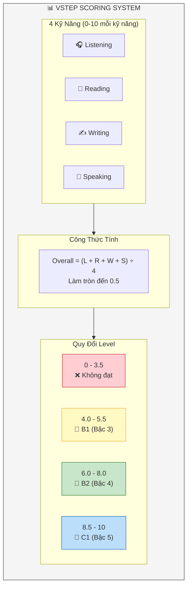

# Hệ thống tính điểm VSTEP

## Sơ Đồ Hệ Thống Điểm



## Thang điểm tổng

| Điểm | VSTEP Level | CEFR | Mô tả |
|------|-------------|------|-------|
| 0 – 3.5 | Không đạt | Below B1 | Chưa đạt yêu cầu |
| **4.0 – 5.5** | Level 3 | **B1** | Intermediate |
| **6.0 – 8.0** | Level 4 | **B2** | Upper-Intermediate |
| **8.5 – 10** | Level 5 | **C1** | Advanced |

---

## Công thức tính điểm

### Điểm tổng

```
Overall = (Listening + Reading + Writing + Speaking) ÷ 4
```

*Làm tròn đến 0.5 gần nhất*

---

### Điểm Writing

```
Writing = (Task 1 × 1/3) + (Task 2 × 2/3)
```

| Task | Trọng số | Ví dụ |
|------|----------|-------|
| Task 1 | 33.3% | 7.0 × 0.33 = 2.31 |
| Task 2 | 66.7% | 6.0 × 0.67 = 4.02 |
| **Tổng** | 100% | **6.33 → 6.5** |

---

### Điểm Speaking

```
Speaking = (Grammar + Vocabulary + Pronunciation + Fluency + Discourse) ÷ 5
```

| Tiêu chí | Trọng số |
|----------|----------|
| Grammar | 20% |
| Vocabulary | 20% |
| Pronunciation | 20% |
| Fluency | 20% |
| Discourse Management | 20% |

---

### Điểm Listening/Reading

| Kỹ năng | Số câu | Công thức |
|---------|--------|-----------|
| Listening | 35 | (Số đúng ÷ 35) × 10 |
| Reading | 40 | (Số đúng ÷ 40) × 10 |

#### Bảng quy đổi Reading

| Số đúng | Điểm | Level |
|---------|------|-------|
| 38-40 | 9.5-10 | C1 |
| 32-37 | 8.0-9.0 | B2-C1 |
| 24-31 | 6.0-7.5 | B2 |
| 16-23 | 4.0-5.5 | B1 |
| <16 | <4.0 | Không đạt |

#### Bảng quy đổi Listening

| Số đúng | Điểm | Level |
|---------|------|-------|
| 33-35 | 9.5-10 | C1 |
| 27-32 | 8.0-9.0 | B2-C1 |
| 20-26 | 6.0-7.5 | B2 |
| 14-19 | 4.0-5.5 | B1 |
| <14 | <4.0 | Không đạt |

---

## Tiêu chí chấm điểm

### Writing (4 tiêu chí)

| Tiêu chí | Mô tả | Trọng số |
|----------|-------|----------|
| **Task Fulfillment** | Hoàn thành yêu cầu đề | 25% |
| **Organization** | Tổ chức, mạch lạc | 25% |
| **Vocabulary** | Từ vựng, collocation | 25% |
| **Grammar** | Ngữ pháp, cấu trúc | 25% |

### Speaking (5 tiêu chí)

| Tiêu chí | Mô tả | Trọng số |
|----------|-------|----------|
| **Grammar** | Đa dạng, chính xác | 20% |
| **Vocabulary** | Phạm vi, kiểm soát | 20% |
| **Pronunciation** | Phát âm, ngữ điệu | 20% |
| **Fluency** | Trôi chảy, nhịp độ | 20% |
| **Discourse** | Tổ chức, mạch lạc | 20% |

---

## Ví dụ tính điểm

### Trường hợp 1: Đạt B2

| Kỹ năng | Điểm |
|---------|------|
| Listening | 7.0 |
| Reading | 6.5 |
| Writing | 6.5 |
| Speaking | 6.0 |
| **Overall** | **(7.0+6.5+6.5+6.0)÷4 = 6.5** |

→ **Level 4 (B2)**

### Trường hợp 2: Đạt B1

| Kỹ năng | Điểm |
|---------|------|
| Listening | 5.0 |
| Reading | 5.5 |
| Writing | 4.5 |
| Speaking | 5.0 |
| **Overall** | **(5.0+5.5+4.5+5.0)÷4 = 5.0** |

→ **Level 3 (B1)**
