# VSTEP - Tổng Quan Format Đề Thi

> **VSTEP**: Vietnamese Standardized Test of English Proficiency
> **Phiên bản**: VSTEP.3-5 (B1-C1)

---

## Lịch Trình Ngày Thi

```mermaid
gantt
    title 📅 VSTEP Test Day Timeline
    dateFormat HH:mm
    axisFormat %H:%M
    
    section Sáng
    Check-in & Hướng dẫn     :crit, checkin, 07:30, 30m
    Listening (40 phút)      :active, listening, 08:00, 40m
    Nghỉ ngắn               :break1, 08:40, 10m
    Reading (60 phút)        :active, reading, 08:50, 60m
    Nghỉ ngắn               :break2, 09:50, 10m
    Writing (60 phút)        :active, writing, 10:00, 60m
    
    section Chiều
    Speaking Check-in        :crit, spcheckin, 13:30, 15m
    Speaking (12 phút/người) :active, speaking, 13:45, 12m
```



## VSTEP Là Gì?

**VSTEP** (Vietnamese Standardized Test of English Proficiency) là bài thi đánh giá năng lực tiếng Anh theo Khung năng lực ngoại ngữ 6 bậc dùng cho Việt Nam.

| Thông tin | Chi tiết |
|-----------|----------|
| **Tên đầy đủ** | Vietnamese Standardized Test of English Proficiency |
| **Viết tắt** | VSTEP (VSTEP.3-5 cho levels B1-C1) |
| **Thành lập** | 2015 (Quyết định 729) |
| **Khung tham chiếu** | Khung năng lực ngoại ngữ 6 bậc Việt Nam |
| **Tương đương CEFR** | B1, B2, C1 (Bậc 3, 4, 5) |

---

## Đơn Vị Tổ Chức

VSTEP được phát triển và ban hành bởi **Bộ Giáo dục và Đào tạo**. Tính đến tháng 3/2025, có **38 cơ sở giáo dục đại học** được ủy quyền tổ chức thi.

> **Nguồn chính thức**: [Cục Quản lý chất lượng - Bộ GD&ĐT](https://vqa.moet.gov.vn) (VQA-MOET), cập nhật 31/03/2025

### Danh Sách 38 Trường Tổ Chức Thi VSTEP (Chính thức)

#### Miền Bắc (15 trường)

| STT | Trường | Ghi chú |
|-----|--------|---------|
| 1 | ĐH Ngoại ngữ - ĐHQGHN (ULIS-VNU) | Trung tâm chính |
| 2 | ĐH Sư phạm Hà Nội | |
| 3 | ĐH Hà Nội | |
| 4 | ĐH Thái Nguyên | |
| 5 | Học viện An ninh Nhân dân | |
| 6 | Học viện Báo chí và Tuyên truyền | |
| 7 | ĐH Thương mại | |
| 8 | ĐH Ngoại thương | |
| 9 | Học viện Khoa học Quân sự | |
| 10 | Học viện Cảnh sát Nhân dân | |
| 11 | ĐH Bách khoa Hà Nội | |
| 12 | ĐH Kinh tế Quốc dân | |
| 13 | ĐH Phenikaa | |
| 14 | Học viện Ngân hàng | |
| 15 | ĐH Thành Đông | Thêm 02/2025 |

#### Miền Trung - Tây Nguyên (6 trường)

| STT | Trường |
|-----|--------|
| 1 | ĐH Ngoại ngữ - ĐH Huế |
| 2 | ĐH Ngoại ngữ - ĐH Đà Nẵng |
| 3 | ĐH Vinh |
| 4 | ĐH Duy Tân |
| 5 | ĐH Quy Nhơn |
| 6 | ĐH Tây Nguyên |

#### Miền Nam (17 trường)

| STT | Trường | Ghi chú |
|-----|--------|---------|
| 1 | ĐH Sư phạm TP.HCM | |
| 2 | ĐH KHXH&NV - ĐHQG TP.HCM | |
| 3 | ĐH Ngân hàng TP.HCM | |
| 4 | ĐH Văn Lang | |
| 5 | ĐH Kinh tế TP.HCM | |
| 6 | ĐH Sài Gòn | |
| 7 | ĐH Cần Thơ | |
| 8 | ĐH Trà Vinh | |
| 9 | ĐH Đồng Tháp | |
| 10 | ĐH Công nghiệp TP.HCM | |
| 11 | ĐH Công Thương TP.HCM (HUIT) | |
| 12 | ĐH Kinh tế - Tài chính TP.HCM | |
| 13 | ĐH Nam Cần Thơ | |
| 14 | ĐH Lạc Hồng | |
| 15 | ĐH Tài chính - Marketing | |
| 16 | ĐH Mở TP.HCM | Thêm 03/2025 |
| 17 | ĐH Quốc tế Hồng Bàng | Thêm 03/2025 |

---

## Cấu Trúc Bài Thi VSTEP.3-5

### Tổng Quan

| Kỹ năng | Thời gian | Số câu/tasks | Chi tiết |
|---------|-----------|--------------|----------|
| **Listening** | ~40 phút | 35 MCQ | 3 parts: thông báo, hội thoại, bài giảng |
| **Reading** | 60 phút | 40 MCQ | 4 passages, 10 câu mỗi bài |
| **Writing** | 60 phút | 2 tasks | Task 1: Email/thư; Task 2: Essay |
| **Speaking** | 12 phút | 3 parts | Giao tiếp xã hội, thảo luận giải pháp, phát triển chủ đề |

### Tổng Thời Gian

- **Tổng cộng**: Khoảng **3 giờ (180 phút)** cho 4 kỹ năng
- **Hình thức thi**: 
  - Máy tính (phổ biến nhất hiện nay)
  - Giấy (một số trung tâm)

### Lịch Thi Điển Hình

| Hình thức | Buổi sáng | Buổi chiều |
|-----------|-----------|------------|
| Thi giấy | Listening → Reading → Writing | Speaking |
| Thi máy | Cả 4 kỹ năng trong một phiên | - |

---

## Hệ Thống Điểm

### Thang Điểm: 0-10

| Điểm cuối cùng | Level | CEFR | Mô tả |
|----------------|-------|------|-------|
| **0 – 3.5** | Không đạt | - | Không cấp chứng chỉ |
| **4.0 – 5.5** | Bậc 3 | **B1** | Hiểu ý chính về chủ đề quen thuộc; xử lý tình huống hàng ngày; viết văn bản cơ bản |
| **6.0 – 8.0** | Bậc 4 | **B2** | Hiểu ý chính về chủ đề cụ thể và trừu tượng; giao tiếp lưu loát với người bản xứ; viết bài về nhiều chủ đề |
| **8.5 – 10** | Bậc 5 | **C1** | Hiểu nhiều loại văn bản phức tạp; sử dụng ngôn ngữ tự phát và lưu loát; viết bài về vấn đề phức tạp |

### Cách Tính Điểm

- Mỗi kỹ năng (Listening, Reading, Writing, Speaking) được chấm 0-10
- **Điểm tổng = Trung bình 4 kỹ năng** (làm tròn đến 0.5)
- Điểm từng kỹ năng được ghi trên chứng chỉ

### Điểm Writing & Speaking

- Được chấm bởi giám khảo đã qua đào tạo sử dụng rubric
- Writing: Hoàn thành task, mạch lạc, từ vựng, ngữ pháp
- Speaking: Lưu loát, phát âm, phạm vi từ vựng, hoàn thành task

---

## Chi Tiết Từng Kỹ Năng

### Listening (40 phút - 35 câu)

| Part | Câu hỏi | Nội dung | Độ khó |
|------|---------|----------|--------|
| Part 1 | 1-8 | 8 thông báo/hướng dẫn ngắn | B1 |
| Part 2 | 9-20 | 3 hội thoại (4 câu/hội thoại) | B1-B2 |
| Part 3 | 21-35 | 3 bài giảng (5 câu/bài) | B2-C1 |

**Lưu ý**: Audio chỉ phát **1 LẦN**

### Reading (60 phút - 40 câu)

| Passage | Độ khó | Đặc điểm |
|---------|--------|----------|
| Passage 1 | B1 | Chủ đề quen thuộc, đời thường |
| Passage 2 | B2 | Khoa học/xã hội, thông tin rõ ràng |
| Passage 3 | B2 | Chủ đề chuyên môn |
| Passage 4 | C1 | Chủ đề phức tạp, học thuật |

### Writing (60 phút - 2 tasks)

| Task | Thời gian | Yêu cầu | Tỷ trọng điểm |
|------|-----------|---------|---------------|
| Task 1 | 20 phút | Email/Thư (tối thiểu 120 từ) | 1/3 |
| Task 2 | 40 phút | Essay (tối thiểu 250 từ) | 2/3 |

### Speaking (12 phút - 3 parts)

| Part | Thời gian | Nội dung |
|------|-----------|----------|
| Part 1 | 2-3 phút | Social Interaction (3-6 câu hỏi về 2 chủ đề) |
| Part 2 | 3-4 phút | Solution Discussion (1 phút chuẩn bị + chọn 1 trong 3 lựa chọn + 2-3 phút nói) |
| Part 3 | 4-5 phút | Topic Development (1 phút chuẩn bị + 3-4 phút nói + follow-up) |

---

## Tài Liệu Chính Thức

| Tài nguyên | Link |
|------------|------|
| **Trung tâm Khảo thí ULIS-VNU (Chính thức)** | https://vstep.vnu.edu.vn |
| **Format đề thi** | https://vstep.vnu.edu.vn/test-format/ |
| **Điểm và Level** | https://vstep.vnu.edu.vn/scores-levels/ |
| **Lịch thi 2025** | https://vstep.vnu.edu.vn/category/english-version/test-date-calendar/ |
| **Xác minh chứng chỉ** | https://vstep.vnu.edu.vn/certificate-verification/ |

---

## Tóm Tắt Nhanh

```
╔══════════════════════════════════════════════════════════════════╗
║                    VSTEP.3-5 TỔNG QUAN                           ║
╠══════════════════════════════════════════════════════════════════╣
║  KỸ NĂNG: Listening (40p) + Reading (60p) + Writing (60p)        ║
║           + Speaking (12p) = ~3 giờ tổng cộng                    ║
╠══════════════════════════════════════════════════════════════════╣
║  ĐIỂM:    0-3.5 = Không cấp chứng chỉ                           ║
║           4.0-5.5 = Bậc 3 (B1)                                   ║
║           6.0-8.0 = Bậc 4 (B2)                                   ║
║           8.5-10  = Bậc 5 (C1)                                   ║
╠══════════════════════════════════════════════════════════════════╣
║  TRUNG TÂM THI: 38 trường (03/2025 - VQA-MOET)                  ║
╚══════════════════════════════════════════════════════════════════╝
```
