# VSTEP - Tổng Quan Format Đề Thi

> **VSTEP**: Vietnamese Standardized Test of English Proficiency
> **Phiên bản**: VSTEP.3-5 (B1-C1)

---

## Lịch Trình Ngày Thi

```mermaid
gantt
    title 📅 VSTEP Test Day Timeline
    dateFormat HH:mm
    axisFormat %H:%M
    
    section Sáng
    Check-in & Hướng dẫn     :crit, checkin, 07:30, 30m
    Listening (40 phút)      :active, listening, 08:00, 40m
    Nghỉ ngắn               :break1, 08:40, 10m
    Reading (60 phút)        :active, reading, 08:50, 60m
    Nghỉ ngắn               :break2, 09:50, 10m
    Writing (60 phút)        :active, writing, 10:00, 60m
    
    section Chiều
    Speaking Check-in        :crit, spcheckin, 13:30, 15m
    Speaking (12 phút/người) :active, speaking, 13:45, 12m
```



## VSTEP Là Gì?

**VSTEP** (Vietnamese Standardized Test of English Proficiency) là bài thi đánh giá năng lực tiếng Anh theo Khung năng lực ngoại ngữ 6 bậc dùng cho Việt Nam.

| Thông tin | Chi tiết |
|-----------|----------|
| **Tên đầy đủ** | Vietnamese Standardized Test of English Proficiency |
| **Viết tắt** | VSTEP (VSTEP.3-5 cho levels B1-C1) |
| **Thành lập** | 2015 (Quyết định 729) |
| **Khung tham chiếu** | Khung năng lực ngoại ngữ 6 bậc Việt Nam |
| **Tương đương CEFR** | B1, B2, C1 (Bậc 3, 4, 5) |

---

## Đơn Vị Tổ Chức

VSTEP được phát triển và ban hành bởi **Bộ Giáo dục và Đào tạo**. Tính đến tháng 4/2024, có **34 cơ sở giáo dục đại học** được ủy quyền tổ chức thi.

### Các Trung Tâm Khảo Thí Chính

| Khu vực | Trung tâm chính |
|---------|-----------------|
| **Hà Nội** | ĐH Ngoại ngữ - ĐHQGHN (ULIS-VNU), ĐH Hà Nội, ĐH Sư phạm Hà Nội, ĐH Ngoại thương, ĐH Kinh tế Quốc dân, Học viện Ngân hàng |
| **TP.HCM** | ĐH Sư phạm TPHCM, ĐH Ngân hàng TPHCM, ĐH Văn Lang, ĐH Kinh tế TPHCM, ĐH KHXH&NV ĐHQG-HCM, ĐH Sài Gòn |
| **Các vùng khác** | ĐH Huế, ĐH Đà Nẵng, ĐH Thái Nguyên, ĐH Vinh, ĐH Trà Vinh, ĐH Cần Thơ, ĐH Duy Tân |

---

## Cấu Trúc Bài Thi VSTEP.3-5

### Tổng Quan

| Kỹ năng | Thời gian | Số câu/tasks | Chi tiết |
|---------|-----------|--------------|----------|
| **Listening** | ~40 phút | 35 MCQ | 3 parts: thông báo, hội thoại, bài giảng |
| **Reading** | 60 phút | 40 MCQ | 4 passages, 10 câu mỗi bài |
| **Writing** | 60 phút | 2 tasks | Task 1: Email/thư; Task 2: Essay |
| **Speaking** | 12 phút | 3 parts | Giao tiếp xã hội, xử lý tình huống, phát triển chủ đề |

### Tổng Thời Gian

- **Tổng cộng**: Khoảng **3 giờ (180 phút)** cho 4 kỹ năng
- **Hình thức thi**: 
  - Máy tính (phổ biến nhất hiện nay)
  - Giấy (một số trung tâm)

### Lịch Thi Điển Hình

| Hình thức | Buổi sáng | Buổi chiều |
|-----------|-----------|------------|
| Thi giấy | Listening → Reading → Writing | Speaking |
| Thi máy | Cả 4 kỹ năng trong một phiên | - |

---

## Hệ Thống Điểm

### Thang Điểm: 0-10

| Điểm cuối cùng | Level | CEFR | Mô tả |
|----------------|-------|------|-------|
| **0 – 3.5** | Không đạt | - | Không cấp chứng chỉ |
| **4.0 – 5.5** | Bậc 3 | **B1** | Hiểu ý chính về chủ đề quen thuộc; xử lý tình huống hàng ngày; viết văn bản cơ bản |
| **6.0 – 8.0** | Bậc 4 | **B2** | Hiểu ý chính về chủ đề cụ thể và trừu tượng; giao tiếp lưu loát với người bản xứ; viết bài về nhiều chủ đề |
| **8.5 – 10** | Bậc 5 | **C1** | Hiểu nhiều loại văn bản phức tạp; sử dụng ngôn ngữ tự phát và lưu loát; viết bài về vấn đề phức tạp |

### Cách Tính Điểm

- Mỗi kỹ năng (Listening, Reading, Writing, Speaking) được chấm 0-10
- **Điểm tổng = Trung bình 4 kỹ năng** (làm tròn đến 0.5)
- Điểm từng kỹ năng được ghi trên chứng chỉ

### Điểm Writing & Speaking

- Được chấm bởi giám khảo đã qua đào tạo sử dụng rubric
- Writing: Hoàn thành task, mạch lạc, từ vựng, ngữ pháp
- Speaking: Lưu loát, phát âm, phạm vi từ vựng, hoàn thành task

---

## So Sánh VSTEP với IELTS/TOEFL

### Bảng Quy Đổi Điểm (Ước Tính)

| Điểm VSTEP | Level VSTEP | CEFR | IELTS tương đương | TOEFL iBT tương đương |
|------------|-------------|------|-------------------|----------------------|
| 4.0 | Bậc 3 | B1 | 4.0 | 42-52 |
| 4.5 | Bậc 3 | B1 | 4.5 | 53-64 |
| 5.0-5.5 | Bậc 3 | B1 | 5.0-5.5 | 65-79 |
| 6.0 | Bậc 4 | B2 | 6.0 | 80-91 |
| 6.5-7.0 | Bậc 4 | B2 | 6.5 | 92-102 |
| 7.5-8.0 | Bậc 4 | B2+ | 7.0 | 103-110 |
| 8.5-10 | Bậc 5 | C1 | 7.5-8.0+ | 110-120 |

### So Sánh VSTEP vs IELTS

| Khía cạnh | VSTEP | IELTS |
|-----------|-------|-------|
| **Đơn vị phát triển** | Bộ GD&ĐT Việt Nam | British Council, IDP, Cambridge |
| **Công nhận** | Chỉ Việt Nam | Quốc tế |
| **Thang điểm** | 0-10 | 0-9 |
| **Thời gian Speaking** | 12 phút | 11-14 phút |
| **Thời gian Listening** | 40 phút | 30 phút |
| **Lệ phí thi** | ~$72-80 USD | ~$245-260 USD |
| **Thi máy tính** | Có | Có (một số trung tâm) |

---

## Chi Tiết Từng Kỹ Năng

### Listening (40 phút - 35 câu)

| Part | Câu hỏi | Nội dung | Độ khó |
|------|---------|----------|--------|
| Part 1 | 1-8 | 8 thông báo/hướng dẫn ngắn | B1 |
| Part 2 | 9-20 | 3 hội thoại (4 câu/hội thoại) | B1-B2 |
| Part 3 | 21-35 | 3 bài giảng (5 câu/bài) | B2-C1 |

**Lưu ý**: Audio chỉ phát **1 LẦN**

### Reading (60 phút - 40 câu)

| Passage | Độ khó | Đặc điểm |
|---------|--------|----------|
| Passage 1 | B1 | Chủ đề quen thuộc, đời thường |
| Passage 2 | B2 | Khoa học/xã hội, thông tin rõ ràng |
| Passage 3 | B2 | Chủ đề chuyên môn |
| Passage 4 | C1 | Chủ đề phức tạp, học thuật |

### Writing (60 phút - 2 tasks)

| Task | Thời gian | Yêu cầu | Tỷ trọng điểm |
|------|-----------|---------|---------------|
| Task 1 | 20 phút | Email/Thư (tối thiểu 120 từ) | 1/3 |
| Task 2 | 40 phút | Essay (tối thiểu 250 từ) | 2/3 |

### Speaking (12 phút - 3 parts)

| Part | Thời gian | Nội dung |
|------|-----------|----------|
| Part 1 | 3 phút | Giao tiếp xã hội (3-6 câu hỏi về 2 chủ đề) |
| Part 2 | 4 phút | Xử lý tình huống (role-play) |
| Part 3 | 5 phút | Phát triển chủ đề (có thời gian chuẩn bị) |

---

## Đăng Ký & Thông Tin Thực Tế

### Lệ Phí Thi (2025)

| Đối tượng | Lệ phí (VNĐ) | Lệ phí (USD ước tính) |
|-----------|--------------|----------------------|
| **Thí sinh tự do** | 1,800,000 | ~$72 |
| **Sinh viên nội bộ** | 1,100,000 - 1,400,000 | ~$44-56 |
| **Phúc khảo** | 800,000 | ~$32 |

### Tần Suất Thi

- **11+ kỳ thi mỗi năm** tại các trung tâm lớn (ULIS-VNU)
- Tổ chức hàng tháng hoặc 2 tháng/lần
- Nhiều trung tâm trên cả nước

### Quy Trình Đăng Ký

1. Chuẩn bị ảnh kỹ thuật số và scan CMND/CCCD
2. Đăng ký online trên website trung tâm thi
3. Chuyển khoản lệ phí
4. Nhận xác nhận và giấy báo dự thi

### Hiệu Lực Chứng Chỉ

| Khía cạnh | Chi tiết |
|-----------|----------|
| **Hiệu lực chính thức** | Không ghi ngày hết hạn trên chứng chỉ |
| **Thực tế** | 1.5-3 năm (tùy cơ sở chấp nhận) |
| **Tốt nghiệp đại học** | Thường yêu cầu chứng chỉ trong 2 năm |
| **Sau đại học/Học bổng** | Thường 2-3 năm |
| **Cơ sở pháp lý** | Công văn 3755/BGDĐT-GDTX 2016 |

---

## Tại Sao Chọn VSTEP?

### Ưu Điểm

| Lợi ích | Chi tiết |
|---------|----------|
| ✅ **Chi phí thấp** | ~$72 so với ~$250 của IELTS |
| ✅ **Công nhận trong nước** | Được Chính phủ, các trường ĐH công nhận đầy đủ |
| ✅ **Yêu cầu tốt nghiệp** | Được chấp nhận cho tốt nghiệp CN/ThS tại hầu hết các trường |
| ✅ **Công chức** | Hợp lệ cho đơn xin việc công |
| ✅ **Miễn thi THPT** | VSTEP B1 miễn thi ngoại ngữ THPT |
| ✅ **Nhiều kỳ thi** | Nhiều ngày thi trong năm |

### Hạn Chế

| Hạn chế | Chi tiết |
|---------|----------|
| ❌ **Không công nhận quốc tế** | Không được chấp nhận ở nước ngoài |
| ❌ **Một số trường ưu tiên IELTS** | Các trường top thường ưu tiên chứng chỉ quốc tế |
| ❌ **Không dùng cho du học** | Không thể dùng cho du học hoặc định cư |

---

## Tài Liệu Chính Thức

| Tài nguyên | Link |
|------------|------|
| **Trung tâm Khảo thí ULIS-VNU (Chính thức)** | https://vstep.vnu.edu.vn |
| **Format đề thi** | https://vstep.vnu.edu.vn/test-format/ |
| **Điểm và Level** | https://vstep.vnu.edu.vn/scores-levels/ |
| **Lịch thi 2025** | https://vstep.vnu.edu.vn/category/english-version/test-date-calendar/ |
| **Xác minh chứng chỉ** | https://vstep.vnu.edu.vn/certificate-verification/ |

---

## Tóm Tắt Nhanh

```
╔══════════════════════════════════════════════════════════════════╗
║                    VSTEP.3-5 TỔNG QUAN                           ║
╠══════════════════════════════════════════════════════════════════╣
║  KỸ NĂNG: Listening (40p) + Reading (60p) + Writing (60p)        ║
║           + Speaking (12p) = ~3 giờ tổng cộng                    ║
╠══════════════════════════════════════════════════════════════════╣
║  ĐIỂM:    0-3.5 = Không cấp chứng chỉ                           ║
║           4.0-5.5 = Bậc 3 (B1) ≈ IELTS 4.0-5.5                  ║
║           6.0-8.0 = Bậc 4 (B2) ≈ IELTS 6.0-7.0                  ║
║           8.5-10  = Bậc 5 (C1) ≈ IELTS 7.5-8.0+                 ║
╠══════════════════════════════════════════════════════════════════╣
║  LỆ PHÍ: 1,800,000 VNĐ (~$72 USD)                               ║
║  HIỆU LỰC: Không hết hạn (thực tế 2 năm cho hầu hết mục đích)   ║
║  TRUNG TÂM THI: 34+ trường đại học trên cả nước                 ║
╚══════════════════════════════════════════════════════════════════╝
```
