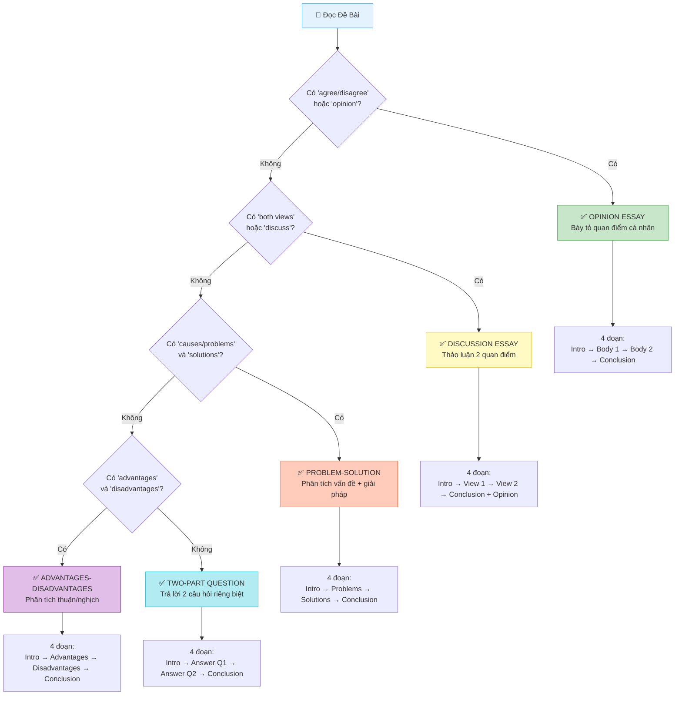

# VSTEP Writing Task 2 - Các Dạng Bài Luận

> **Thời gian**: 40 phút | **Số từ yêu cầu**: 250 từ | **Thang điểm**: 0-10

## Sơ Đồ Chọn Dạng Bài



## Tổng Quan

Task 2 yêu cầu viết một bài luận trình bày quan điểm hoặc thảo luận về một chủ đề cho sẵn. Đây là phần quan trọng nhất của Writing vì chiếm nhiều thời gian và đòi hỏi kỹ năng tư duy cao hơn.

### Tiêu Chí Đánh Giá
| Tiêu chí | Trọng số | Mô tả |
|----------|----------|-------|
| Task Response | 25% | Đáp ứng yêu cầu đề, quan điểm rõ ràng |
| Coherence & Cohesion | 25% | Tổ chức mạch lạc, liên kết logic |
| Lexical Resource | 25% | Từ vựng đa dạng, chính xác |
| Grammatical Range & Accuracy | 25% | Cấu trúc ngữ pháp đa dạng, ít lỗi |

---

## 1. Opinion Essay (Bài Luận Quan Điểm)

### Dấu Hiệu Nhận Biết
- "Do you agree or disagree?"
- "To what extent do you agree or disagree?"
- "What is your opinion?"
- "Do you think...?"

### Cấu Trúc Chuẩn

```
Đoạn 1: Introduction (Giới thiệu)
- Paraphrase đề bài
- Thesis statement (quan điểm rõ ràng)

Đoạn 2: Body 1 (Lý do 1 ủng hộ quan điểm)
- Topic sentence
- Explanation
- Example
- (Optional) Counter + Refutation

Đoạn 3: Body 2 (Lý do 2 ủng hộ quan điểm)
- Topic sentence
- Explanation
- Example

Đoạn 4: Conclusion (Kết luận)
- Restate quan điểm
- Tóm tắt lý do chính
```

### Useful Phrases

#### Introduction
| Phrase | Nghĩa/Cách dùng |
|--------|-----------------|
| It is often argued that... | Người ta thường tranh luận rằng... |
| There is a growing debate about whether... | Có một cuộc tranh luận ngày càng tăng về việc liệu... |
| In my opinion,... / I firmly believe that... | Theo quan điểm của tôi,... / Tôi tin chắc rằng... |
| This essay will argue that... | Bài luận này sẽ lập luận rằng... |
| I strongly agree/disagree with the view that... | Tôi hoàn toàn đồng ý/không đồng ý với quan điểm rằng... |

#### Body Paragraphs
| Phrase | Nghĩa/Cách dùng |
|--------|-----------------|
| The main reason why I believe this is... | Lý do chính tại sao tôi tin điều này là... |
| First and foremost,... | Trước hết và quan trọng nhất,... |
| Another compelling argument is that... | Một lập luận thuyết phục khác là... |
| For instance,... / For example,... | Ví dụ như,... |
| This is clearly illustrated by... | Điều này được minh họa rõ ràng bởi... |
| Furthermore,... / Moreover,... / In addition,... | Hơn nữa,... / Ngoài ra,... |

#### Conceding & Refuting
| Phrase | Nghĩa/Cách dùng |
|--------|-----------------|
| Admittedly,... / It is true that... | Phải thừa nhận rằng,... / Đúng là... |
| While some may argue that..., I believe... | Trong khi một số người có thể cho rằng..., tôi tin... |
| However, this argument fails to consider... | Tuy nhiên, lập luận này không xem xét đến... |
| Despite this, the benefits outweigh the drawbacks | Mặc dù vậy, lợi ích vượt trội hơn nhược điểm |

#### Conclusion
| Phrase | Nghĩa/Cách dùng |
|--------|-----------------|
| In conclusion,... | Kết luận lại,... |
| To sum up,... | Tóm lại,... |
| All things considered,... | Xem xét tất cả mọi thứ,... |
| For the reasons mentioned above,... | Vì những lý do đã nêu ở trên,... |

### Template Mẫu

```
[Introduction]
It is widely debated whether [topic - paraphrase]. While some people 
believe [opposing view], I strongly [agree/disagree] with this statement 
for the following reasons.

[Body 1]
The primary reason for my view is that [main argument]. [Explain why]. 
For example, [specific example to support]. This clearly demonstrates 
that [link back to thesis].

[Body 2]
Another compelling argument is that [second reason]. [Expand on this point]. 
Research has shown that [evidence or example]. Therefore, [mini-conclusion].

[Conclusion]
In conclusion, I firmly believe that [restate thesis]. Although [acknowledge 
opposing view briefly], the arguments presented above clearly show that 
[final statement supporting your view].
```

### Ví Dụ Hoàn Chỉnh

**Đề bài**: *Some people think that students should study only subjects they like. Do you agree or disagree?*

```
It is often suggested that students should be allowed to focus exclusively 
on subjects that interest them. However, I strongly disagree with this 
viewpoint, as I believe a well-rounded education is essential for personal 
and professional development.

The main reason for my position is that a diverse curriculum helps students 
develop a broad knowledge base. When students study various subjects, they 
gain different perspectives and skills that complement each other. For 
instance, studying history alongside science helps students understand how 
scientific discoveries have shaped society. This interdisciplinary approach 
creates more adaptable and informed individuals.

Furthermore, students may not fully understand their strengths and interests 
at a young age. By limiting their studies to preferred subjects only, they 
might miss opportunities to discover hidden talents or new passions. Many 
successful professionals have changed career paths after being exposed to 
unexpected subjects during their education. Therefore, a varied curriculum 
keeps future possibilities open.

In conclusion, while allowing students to pursue their interests has some 
merit, I firmly believe that a comprehensive education is far more beneficial. 
By studying diverse subjects, students develop critical thinking skills, 
discover new potential, and become well-prepared for an unpredictable future.
```

---

## 2. Discussion Essay (Bài Luận Thảo Luận)

### Dấu Hiệu Nhận Biết
- "Discuss both views and give your opinion"
- "Some people think... while others believe..."
- "What are the advantages and disadvantages?"
- "Discuss the arguments for and against"

### Cấu Trúc Chuẩn

```
Đoạn 1: Introduction
- Paraphrase đề bài
- Nêu rằng sẽ thảo luận cả hai quan điểm
- (Optional) Thesis - quan điểm của bạn

Đoạn 2: Body 1 (View 1)
- Topic sentence
- Reasons/Examples
- Explanation

Đoạn 3: Body 2 (View 2)
- Topic sentence
- Reasons/Examples
- Explanation

Đoạn 4: Conclusion
- Tóm tắt cả hai quan điểm
- Nêu rõ quan điểm cá nhân
```

### Useful Phrases

#### Introduction
| Phrase | Nghĩa/Cách dùng |
|--------|-----------------|
| People hold different views about... | Mọi người có quan điểm khác nhau về... |
| This essay will discuss both perspectives before concluding... | Bài luận này sẽ thảo luận cả hai góc nhìn trước khi kết luận... |
| While some advocate for..., others argue that... | Trong khi một số ủng hộ..., những người khác cho rằng... |
| This is a controversial issue with valid points on both sides | Đây là vấn đề gây tranh cãi với những điểm hợp lý ở cả hai phía |

#### Presenting View 1
| Phrase | Nghĩa/Cách dùng |
|--------|-----------------|
| On the one hand, supporters of [view] argue that... | Một mặt, những người ủng hộ [quan điểm] cho rằng... |
| Those who favor [view] point out that... | Những người ủng hộ [quan điểm] chỉ ra rằng... |
| Proponents of this view believe that... | Những người ủng hộ quan điểm này tin rằng... |
| The main argument in favor of... is that... | Lập luận chính ủng hộ... là... |

#### Presenting View 2
| Phrase | Nghĩa/Cách dùng |
|--------|-----------------|
| On the other hand, opponents argue that... | Mặt khác, những người phản đối cho rằng... |
| However, others hold the opposite view | Tuy nhiên, những người khác có quan điểm ngược lại |
| In contrast, critics of this idea suggest that... | Ngược lại, những người phê phán ý tưởng này cho rằng... |
| Conversely, it could be argued that... | Ngược lại, có thể lập luận rằng... |

#### Giving Your Opinion
| Phrase | Nghĩa/Cách dùng |
|--------|-----------------|
| From my perspective,... | Từ góc nhìn của tôi,... |
| Having considered both views, I believe... | Sau khi cân nhắc cả hai quan điểm, tôi tin... |
| While I understand both sides, I tend to support... | Dù tôi hiểu cả hai phía, tôi có xu hướng ủng hộ... |
| I am inclined to agree with [view] because... | Tôi nghiêng về đồng ý với [quan điểm] vì... |

### Template Mẫu

```
[Introduction]
[Topic] has become a subject of heated debate. While some people argue 
that [view 1], others believe that [view 2]. This essay will examine 
both perspectives before presenting my own opinion.

[Body 1 - View 1]
On the one hand, those who support [view 1] argue that [reason]. They 
believe that [explanation]. For example, [specific evidence]. This 
suggests that [link to argument].

[Body 2 - View 2]
On the other hand, opponents of this view contend that [reason for view 2]. 
They point out that [explanation]. A clear example of this is [evidence]. 
Therefore, [mini-conclusion].

[Conclusion]
In conclusion, both viewpoints have their merits. However, I personally 
believe that [your opinion] because [brief reason]. While [acknowledge 
other view], I am convinced that [final supporting statement].
```

---

## 3. Problem-Solution Essay (Bài Luận Vấn Đề-Giải Pháp)

### Dấu Hiệu Nhận Biết
- "What are the causes? What solutions can you suggest?"
- "What problems does this cause? How can these be solved?"
- "Why is this happening? What measures can be taken?"
- "What are the effects? What can be done to address this?"

### Cấu Trúc Chuẩn

```
Đoạn 1: Introduction
- Paraphrase vấn đề
- Nêu rằng sẽ phân tích nguyên nhân/vấn đề và đề xuất giải pháp

Đoạn 2: Body 1 (Problems/Causes)
- Nêu 2-3 nguyên nhân/vấn đề chính
- Giải thích và cho ví dụ

Đoạn 3: Body 2 (Solutions)
- Đề xuất 2-3 giải pháp tương ứng
- Giải thích cách thực hiện và hiệu quả

Đoạn 4: Conclusion
- Tóm tắt vấn đề và giải pháp
- Đưa ra khuyến nghị/hy vọng
```

### Useful Phrases

#### Describing Problems/Causes
| Phrase | Nghĩa/Cách dùng |
|--------|-----------------|
| One of the main causes of this problem is... | Một trong những nguyên nhân chính của vấn đề này là... |
| This issue stems from... | Vấn đề này bắt nguồn từ... |
| A major factor contributing to... is... | Một yếu tố chính góp phần vào... là... |
| This problem is largely due to... | Vấn đề này chủ yếu là do... |
| Another significant issue is... | Một vấn đề đáng kể khác là... |
| This leads to / results in... | Điều này dẫn đến / kết quả là... |

#### Proposing Solutions
| Phrase | Nghĩa/Cách dùng |
|--------|-----------------|
| One effective solution would be to... | Một giải pháp hiệu quả là... |
| To address this issue, [subject] should... | Để giải quyết vấn đề này, [chủ thể] nên... |
| The government/schools/individuals could... | Chính phủ/trường học/cá nhân có thể... |
| A possible remedy for this is... | Một cách khắc phục khả thi là... |
| This problem can be tackled by... | Vấn đề này có thể được giải quyết bằng... |
| Steps should be taken to... | Các bước nên được thực hiện để... |

#### Explaining Effects of Solutions
| Phrase | Nghĩa/Cách dùng |
|--------|-----------------|
| This would help to... | Điều này sẽ giúp... |
| As a result, [positive outcome]... | Kết quả là, [kết quả tích cực]... |
| By doing this, we can... | Bằng cách làm điều này, chúng ta có thể... |
| This approach would ensure that... | Cách tiếp cận này sẽ đảm bảo rằng... |

### Template Mẫu

```
[Introduction]
[Problem - paraphrased] has become a growing concern in modern society. 
This essay will examine the main causes of this issue and propose some 
practical solutions.

[Body 1 - Causes/Problems]
There are several reasons why [problem exists]. Firstly, [cause 1 + 
explanation]. For example, [evidence]. Secondly, [cause 2 + explanation]. 
This is evidenced by [example]. These factors have contributed significantly 
to [the problem].

[Body 2 - Solutions]
Several measures can be taken to address these issues. To tackle [cause 1], 
[solution 1 + how it works]. Additionally, [solution 2] would help to 
[expected outcome]. Furthermore, [solution 3] could be implemented to 
[benefit]. These combined efforts would significantly reduce [the problem].

[Conclusion]
In conclusion, while [problem] is a complex issue caused by [brief summary 
of causes], it can be effectively addressed through [summary of solutions]. 
It is essential that [stakeholders] work together to implement these 
measures for a better future.
```

---

## 4. Advantages-Disadvantages Essay (Bài Luận Thuận-Nghịch)

### Dấu Hiệu Nhận Biết
- "What are the advantages and disadvantages?"
- "Discuss the pros and cons"
- "What are the benefits and drawbacks?"
- "Outweigh": "Do the advantages outweigh the disadvantages?"

### Cấu Trúc Chuẩn (Dạng Cơ Bản)

```
Đoạn 1: Introduction
- Paraphrase đề bài
- Nêu sẽ phân tích cả thuận lợi và bất lợi

Đoạn 2: Body 1 (Advantages)
- 2-3 lợi ích chính
- Giải thích và ví dụ

Đoạn 3: Body 2 (Disadvantages)
- 2-3 bất lợi chính
- Giải thích và ví dụ

Đoạn 4: Conclusion
- Tóm tắt cả hai mặt
- Đưa ra quan điểm (nếu đề yêu cầu)
```

### Cấu Trúc Dạng "Outweigh"

```
Đoạn 1: Introduction
- Paraphrase + Thesis (advantages/disadvantages outweigh)

Đoạn 2: Body 1 (Mặt ít quan trọng hơn - viết ngắn)
- 1-2 điểm
- Thừa nhận nhưng giảm thiểu ý nghĩa

Đoạn 3: Body 2 (Mặt quan trọng hơn - viết dài)
- 2-3 điểm chi tiết
- Nhấn mạnh tầm quan trọng

Đoạn 4: Conclusion
- Khẳng định lại thesis
```

### Useful Phrases

#### Discussing Advantages
| Phrase | Nghĩa/Cách dùng |
|--------|-----------------|
| One of the main advantages is that... | Một trong những lợi thế chính là... |
| A significant benefit of... is... | Một lợi ích đáng kể của... là... |
| ... has the potential to... | ... có tiềm năng để... |
| This offers the advantage of... | Điều này mang lại lợi thế... |
| On the positive side,... | Về mặt tích cực,... |

#### Discussing Disadvantages
| Phrase | Nghĩa/Cách dùng |
|--------|-----------------|
| However, there are also drawbacks | Tuy nhiên, cũng có những nhược điểm |
| On the negative side,... | Về mặt tiêu cực,... |
| A major disadvantage is that... | Một bất lợi lớn là... |
| The downside of... is... | Mặt trái của... là... |
| Critics point out that... | Các nhà phê bình chỉ ra rằng... |

#### For "Outweigh" Questions
| Phrase | Nghĩa/Cách dùng |
|--------|-----------------|
| Although there are some drawbacks, the benefits clearly outweigh them | Mặc dù có một số nhược điểm, lợi ích rõ ràng vượt trội |
| The advantages far exceed any potential disadvantages | Những lợi thế vượt xa bất kỳ nhược điểm tiềm ẩn nào |
| While [disadvantages] exist, they are minimal compared to... | Trong khi [nhược điểm] tồn tại, chúng là nhỏ so với... |
| Despite certain limitations, the overall impact is positive | Mặc dù có những hạn chế nhất định, tác động tổng thể là tích cực |

### Template Mẫu (Dạng Cơ Bản)

```
[Introduction]
[Topic] has both positive and negative aspects. This essay will discuss 
the main advantages and disadvantages of [topic].

[Body 1 - Advantages]
There are several benefits of [topic]. Firstly, [advantage 1 + explanation]. 
For example, [evidence]. Additionally, [advantage 2 + explanation]. This 
means that [positive outcome].

[Body 2 - Disadvantages]
On the other hand, there are also significant drawbacks. One major 
disadvantage is that [disadvantage 1 + explanation]. Furthermore, 
[disadvantage 2 + explanation]. As a result, [negative consequence].

[Conclusion]
In conclusion, [topic] has both advantages and disadvantages. While it 
offers [key benefits], it also presents challenges such as [key drawbacks]. 
Overall, I believe that [your balanced view or recommendation].
```

---

## 5. Two-Part Question Essay (Bài Luận Hai Câu Hỏi)

### Dấu Hiệu Nhận Biết
Đề bài có **HAI câu hỏi riêng biệt** cần trả lời:
- "Why do you think this is? Do you think this is a positive or negative development?"
- "What are the reasons for this? What can be done about it?"
- "Is this a positive trend? What effects does it have on society?"

### Cấu Trúc Chuẩn

```
Đoạn 1: Introduction
- Paraphrase đề bài
- Nêu sẽ trả lời CẢ HAI câu hỏi

Đoạn 2: Body 1 (Trả lời câu hỏi 1)
- Topic sentence liên quan câu hỏi 1
- 2-3 điểm + giải thích + ví dụ

Đoạn 3: Body 2 (Trả lời câu hỏi 2)
- Topic sentence liên quan câu hỏi 2
- 2-3 điểm + giải thích + ví dụ

Đoạn 4: Conclusion
- Tóm tắt câu trả lời cho CẢ HAI câu hỏi
```

### Useful Phrases

#### Addressing Question 1
| Phrase | Nghĩa/Cách dùng |
|--------|-----------------|
| There are several reasons why... | Có một số lý do tại sao... |
| This phenomenon can be attributed to... | Hiện tượng này có thể được quy cho... |
| The main factors behind this are... | Các yếu tố chính đằng sau điều này là... |

#### Transitioning to Question 2
| Phrase | Nghĩa/Cách dùng |
|--------|-----------------|
| Turning to the second question,... | Chuyển sang câu hỏi thứ hai,... |
| As for whether this is positive or negative,... | Về việc liệu điều này tích cực hay tiêu cực,... |
| Regarding the effects of this trend,... | Về tác động của xu hướng này,... |

#### Conclusion
| Phrase | Nghĩa/Cách dùng |
|--------|-----------------|
| To summarize, [answer Q1] and [answer Q2] | Tóm lại, [câu trả lời Q1] và [câu trả lời Q2] |
| In conclusion, while [Q1 answer], it is clear that [Q2 answer] | Kết luận, trong khi [câu trả lời Q1], rõ ràng là [câu trả lời Q2] |

### Template Mẫu

```
[Introduction]
[Topic - paraphrased]. This essay will explore the reasons behind this 
trend and discuss whether it is a positive or negative development.

[Body 1 - Answer Question 1]
There are several factors that explain [phenomenon]. Firstly, [reason 1 + 
explanation]. For instance, [example]. Secondly, [reason 2 + explanation]. 
This shows that [link to question 1].

[Body 2 - Answer Question 2]
As for whether this is a positive or negative development, I believe 
[your view]. On the positive side, [benefit + explanation]. However, 
[drawback + explanation]. Overall, [balanced view or strong opinion].

[Conclusion]
In conclusion, [phenomenon] is primarily caused by [summary of reasons]. 
While this trend has both positive and negative aspects, I believe that 
[final judgment] because [brief justification].
```

---

## Bảng So Sánh 5 Dạng Bài

| Dạng Bài | Dấu Hiệu | Body 1 | Body 2 | Quan Điểm Cá Nhân |
|----------|----------|--------|--------|-------------------|
| Opinion | "agree/disagree" | Lý do 1 | Lý do 2 | Rõ ràng, xuyên suốt |
| Discussion | "both views" | View 1 | View 2 | Cuối bài |
| Problem-Solution | "causes/solutions" | Problems | Solutions | Không bắt buộc |
| Advantages-Disadvantages | "pros and cons" | Advantages | Disadvantages | Tùy đề (outweigh?) |
| Two-Part | 2 câu hỏi | Trả lời Q1 | Trả lời Q2 | Tùy câu hỏi |

---

## Checklist Trước Khi Nộp

### Task Response
- [ ] Đã trả lời đúng yêu cầu đề bài?
- [ ] Quan điểm rõ ràng và nhất quán?
- [ ] Đủ 250 từ trở lên?

### Coherence & Cohesion
- [ ] Có đủ 4 đoạn (Introduction, Body 1, Body 2, Conclusion)?
- [ ] Mỗi body paragraph có topic sentence?
- [ ] Sử dụng linking words hợp lý?

### Lexical Resource
- [ ] Paraphrase từ đề bài (không copy)?
- [ ] Sử dụng từ vựng đa dạng?
- [ ] Không lặp từ quá nhiều?

### Grammar
- [ ] Đa dạng cấu trúc câu (simple, compound, complex)?
- [ ] Kiểm tra lỗi subject-verb agreement?
- [ ] Kiểm tra articles (a/an/the)?
- [ ] Kiểm tra tense nhất quán?

---

## Mẹo Đạt Điểm Cao

### 1. Quản Lý Thời Gian
- Phân tích đề: 3 phút
- Lập dàn ý: 5 phút
- Viết bài: 27 phút
- Kiểm tra: 5 phút

### 2. Mở Bài Ấn Tượng
- Paraphrase, KHÔNG copy đề
- Nêu thesis rõ ràng ngay từ đầu
- Giữ ngắn gọn (2-3 câu)

### 3. Body Paragraph Hiệu Quả
```
PEEL Structure:
P - Point (Topic sentence)
E - Explain (Giải thích)
E - Example (Ví dụ cụ thể)
L - Link (Liên kết về thesis)
```

---

## Cấu Trúc P-E-E Chi Tiết (Nguồn: Edulife.com.vn)

> **P-E-E** (Point - Explain - Example) là cấu trúc chuẩn để viết body paragraph hiệu quả trong VSTEP Writing Task 2.

### Mô Hình P-E-E

```
┌─────────────────────────────────────────────────────────────┐
│  P - POINT (Topic Sentence) - 1 câu                        │
│  ─────────────────────────────────────────────────          │
│  → Nêu ý chính của đoạn văn                                │
│  → Liên kết với thesis statement                           │
│  → Sử dụng từ nối (Firstly, Another reason, Furthermore)   │
├─────────────────────────────────────────────────────────────┤
│  E - EXPLAIN (Giải thích) - 2-3 câu                        │
│  ─────────────────────────────────────────────────          │
│  → Giải thích TẠI SAO point của bạn đúng                   │
│  → Phát triển ý, đưa ra lý do                              │
│  → Sử dụng: This is because... / This means that...        │
├─────────────────────────────────────────────────────────────┤
│  E - EXAMPLE (Ví dụ) - 2-3 câu                             │
│  ─────────────────────────────────────────────────          │
│  → Đưa ví dụ cụ thể minh họa cho point                     │
│  → Có thể là: số liệu, nghiên cứu, kinh nghiệm cá nhân     │
│  → Sử dụng: For example... / For instance... / A case...   │
├─────────────────────────────────────────────────────────────┤
│  (Optional) LINK - Liên kết - 1 câu                        │
│  ─────────────────────────────────────────────────          │
│  → Quay lại thesis, tóm tắt ý đoạn                        │
│  → Sử dụng: Therefore... / This shows that... / Thus...    │
└─────────────────────────────────────────────────────────────┘
```

### Ví Dụ Áp Dụng P-E-E

**Đề bài:** *Some people believe that technology has made our lives more complicated. Do you agree?*

**Body Paragraph (P-E-E):**

```
[POINT]
Firstly, technology has actually simplified many daily tasks 
that used to consume significant time and effort.

[EXPLAIN]
This is because modern devices and applications allow us to 
complete activities in minutes that previously took hours. 
Tasks such as shopping, banking, and communication can now 
be done instantly from our smartphones, eliminating the need 
to travel or wait in queues.

[EXAMPLE]
For example, instead of visiting a bank branch to transfer 
money, we can now complete the transaction in seconds using 
mobile banking apps. Similarly, online shopping platforms 
allow us to purchase items from around the world without 
leaving our homes.

[LINK - Optional]
Therefore, it is clear that technology has streamlined our 
daily routines rather than complicated them.
```

### Các Cụm Từ Theo Từng Phần

| Phần | Cụm từ thường dùng |
|------|-------------------|
| **POINT** | Firstly, The main reason is, Another argument is, Furthermore, An important point to consider is |
| **EXPLAIN** | This is because, This means that, In other words, The reason for this is, What this means is |
| **EXAMPLE** | For example, For instance, A clear example of this is, Research has shown that, Take the case of |
| **LINK** | Therefore, Thus, Consequently, This demonstrates that, As a result |

### Lỗi Thường Gặp Với P-E-E

| Lỗi | Cách khắc phục |
|-----|----------------|
| Point không rõ ràng | Viết topic sentence ngắn gọn, trực tiếp nêu ý chính |
| Explain quá ngắn | Phát triển 2-3 câu giải thích, không nhảy ngay sang example |
| Example quá chung chung | Sử dụng ví dụ cụ thể, có số liệu hoặc tên cụ thể |
| Thiếu liên kết giữa các phần | Dùng từ nối để kết nối Point → Explain → Example |
| Lặp lại ý từ Point | Explain phải THÊM thông tin, không chỉ paraphrase Point |

### Template P-E-E Cho Từng Dạng Bài

**Opinion Essay:**
```
[P] The primary reason I [agree/disagree] is that [reason].
[E] This is because [explanation of why this reason is valid].
[E] For instance, [specific example supporting this reason].
[L] Therefore, [link back to thesis].
```

**Discussion Essay:**
```
[P] Supporters of [view] argue that [main argument].
[E] This means that [explanation and implications].
[E] A clear example is [specific evidence or case].
[L] Thus, [mini-conclusion for this view].
```

**Problem-Solution Essay:**
```
[P] One major cause of this problem is [cause].
[E] What this means is [explanation of how it causes the problem].
[E] For example, [specific instance or statistic].
[L] Consequently, [link to problem/need for solution].
```

### 4. Kết Bài Mạnh Mẽ
- Không thêm ý mới
- Restate thesis bằng từ khác
- Đưa ra khuyến nghị/dự đoán tương lai (nếu phù hợp)
