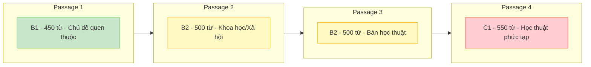

# VSTEP Reading Section - Phân Tích Chi Tiết

> **Thời gian**: 60 phút | **Số câu hỏi**: 40 MCQ | **Số bài đọc**: 4 passages

---

## Kỹ Năng Được Kiểm Tra (Theo VSTEP Official)

Theo [vstep.vnu.edu.vn](https://vstep.vnu.edu.vn/test-format/), phần Reading kiểm tra 5 kỹ năng:

| Kỹ năng | Mô tả |
|---------|-------|
| **Reading for details** | Tìm thông tin cụ thể trong bài |
| **Reading for main idea** | Xác định ý chính, chủ đề |
| **Reading for attitudes** | Hiểu thái độ, quan điểm tác giả |
| **Inferring meaning** | Suy luận từ thông tin ngụ ý |
| **Understanding vocabulary in context** | Hiểu nghĩa từ theo ngữ cảnh |

**Lưu ý**: Nguồn chính thức không công bố tỷ lệ % cụ thể cho từng dạng câu hỏi.

## Cấu Trúc Độ Khó Theo Passage



## Tổng Quan Cấu Trúc

| Thông tin | Chi tiết |
|-----------|----------|
| **Thời gian** | 60 phút (bao gồm thời gian chuyển đáp án) |
| **Số bài đọc** | 4 passages |
| **Tổng số câu hỏi** | 40 câu trắc nghiệm (MCQ) |
| **Số câu/bài** | 10 câu mỗi bài |
| **Tổng số từ** | 1,900 - 2,500 từ (tất cả 4 bài) |
| **Số từ/bài** | Khoảng 400-550 từ mỗi bài |
| **Dạng câu trả lời** | Trắc nghiệm A, B, C, D |

---

## Cấu Trúc Theo Độ Khó

| Passage | Level | Số từ | Đặc điểm nội dung |
|---------|-------|-------|-------------------|
| **Passage 1** | B1 (Level 3) | ~450 từ | Chủ đề quen thuộc, tình huống hàng ngày |
| **Passage 2** | B2 (Level 4) | ~500 từ | Khoa học/Xã hội, thông tin rõ ràng |
| **Passage 3** | B2 (Level 4) | ~500 từ | Chủ đề chuyên môn, bán học thuật |
| **Passage 4** | C1 (Level 5) | ~550 từ | Chủ đề phức tạp, nội dung học thuật |

---

## Các Dạng Câu Hỏi Chi Tiết

> Tỷ lệ % dưới đây là ước tính dựa trên phân tích đề thi thực tế, không phải số liệu chính thức.

### 1. Detail Questions (Câu hỏi chi tiết) - 30-35%

**Mục đích**: Tìm thông tin cụ thể được nêu trong bài

**Dấu hiệu nhận biết:**
- "According to paragraph X..."
- "It is stated/mentioned that..."
- "The author indicates that..."

**Ví dụ:**
```
According to paragraph 2, what is the most dangerous aspect of Liam's job?
A. Repairing pipelines
B. Encountering marine life
C. Incorrect decompression ✓
D. Investigating shipwrecks
```

**Chiến lược:**
1. Đọc câu hỏi, xác định keywords
2. Scan paragraph được đề cập
3. Tìm paraphrase của keywords trong bài
4. So sánh với các đáp án

---

### 2. Vocabulary in Context (Từ vựng theo ngữ cảnh) - 15-20%

**Mục đích**: Xác định nghĩa của từ dựa vào ngữ cảnh

**Dấu hiệu nhận biết:**
- "The word X in line Y could best be replaced by..."
- "The word X is closest in meaning to..."
- "The phrase X refers to..."

**Ví dụ:**
```
The word "isolation" in line 9 could best be replaced by:
A. separation
B. loneliness
C. remoteness ✓
D. boredom
```

**Chiến lược:**
1. Đọc câu chứa từ đó và 1-2 câu xung quanh
2. Đoán nghĩa từ ngữ cảnh
3. Thử thay từng đáp án vào câu
4. Chọn đáp án phù hợp nhất về nghĩa VÀ ngữ pháp

---

### 3. Inference Questions (Câu hỏi suy luận) - 15-20%

**Mục đích**: Rút ra kết luận từ thông tin ngụ ý

**Dấu hiệu nhận biết:**
- "Which can be inferred from the passage?"
- "It is probable that..."
- "The author implies/suggests that..."
- "It can be concluded that..."

**Ví dụ:**
```
Which of the following can be inferred from the passage?
A. The author supports the current policy ✓
B. Scientists disagree on all points
C. The problem has no solution
D. Politicians ignore the issue entirely
```

**Chiến lược:**
1. Đọc kỹ các câu liên quan
2. Tìm manh mối ngụ ý (không nêu trực tiếp)
3. Loại bỏ các đáp án quá cực đoan (all, never, always)
4. Chọn đáp án có logic dựa trên evidence trong bài

---

### 4. Main Idea Questions (Câu hỏi ý chính) - 10-15%

**Mục đích**: Xác định chủ đề hoặc mục đích chính

**Dấu hiệu nhận biết:**
- "What is the main purpose of this passage?"
- "Which would be the best title?"
- "What is the passage mainly about?"
- "What is the author's primary purpose?"

**Ví dụ:**
```
What is the main purpose of this passage?
A. To describe daily routines of professionals
B. To highlight challenges and rewards of working in extreme environments ✓
C. To compare different work environments
D. To explain training for harsh conditions
```

**Chiến lược:**
1. Đọc lướt introduction và conclusion
2. Xác định topic sentence của mỗi paragraph
3. Tìm ý bao quát nhất
4. Tránh đáp án quá hẹp (chỉ đề cập 1 phần) hoặc quá rộng

---

### 5. Reference Questions (Câu hỏi đại từ) - 10%

**Mục đích**: Xác định đại từ/cụm từ chỉ gì

**Dấu hiệu nhận biết:**
- "The word 'they/it/this' in line X refers to..."
- "What does 'which' in paragraph 2 refer to?"

**Ví dụ:**
```
The word "their" in line 25 refers to:
A. patients'
B. neurosurgeons'
C. children's ✓
D. adults'
```

**Chiến lược:**
1. Đọc câu chứa đại từ
2. Đọc ngược lên 1-2 câu trước
3. Tìm danh từ phù hợp về số (singular/plural) và nghĩa
4. Thử thay thế để kiểm tra logic

---

### 6. EXCEPT/NOT Questions (Câu hỏi phủ định) - 5-10%

**Mục đích**: Xác định thông tin KHÔNG được đề cập

**Dấu hiệu nhận biết:**
- "All of the following are true EXCEPT..."
- "It is NOT indicated..."
- "Which is NOT mentioned..."

**Ví dụ:**
```
All of the following are mentioned as benefits of coral reefs EXCEPT:
A. protecting coastlines
B. supporting marine biodiversity
C. contributing to medical research
D. providing freshwater resources ✓
```

**Chiến lược:**
1. Đọc từng đáp án
2. Tìm evidence cho mỗi đáp án trong bài
3. Đáp án KHÔNG có evidence = đáp án đúng
4. Cẩn thận: có thể paraphrase khác

---

### 7. Sentence Insertion (Chèn câu) - 2.5-5%

**Mục đích**: Đặt câu vào vị trí phù hợp

**Dấu hiệu nhận biết:**
- "In which space (marked A, B, C, D) will the following sentence fit?"

**Ví dụ:**
```
In which space will the following sentence fit?
"The military build-up in the region has made neighboring countries 
increasingly nervous."
A. A   B. B   C. C ✓   D. D
```

**Chiến lược:**
1. Đọc câu cần chèn, xác định topic
2. Tìm reference words (this, these, such, however)
3. Đọc các câu xung quanh mỗi vị trí
4. Kiểm tra logic và flow

---

### 8. Tone/Attitude Questions (Câu hỏi thái độ) - 5%

**Mục đích**: Xác định giọng điệu hoặc quan điểm của tác giả

**Dấu hiệu nhận biết:**
- "Which best describes the tone of the passage?"
- "The author's attitude toward X is..."
- "How does the author feel about...?"

**Ví dụ:**
```
Which of the following best describes the tone of the author?
A. Hopeful
B. Pessimistic
C. Critical
D. Neutral ✓
```

**Chiến lược:**
1. Chú ý đến word choice của tác giả
2. Tìm adjectives và adverbs thể hiện opinion
3. Neutral = không có opinion words rõ ràng
4. Cẩn thận với mixed tone (vừa positive vừa negative)

---

## Chủ Đề Theo Level

### B1 (Level 3) - Quen thuộc/Hàng ngày

| Lĩnh vực | Chủ đề ví dụ |
|----------|--------------|
| Đời sống | Thói quen, mua sắm, sắp xếp chuyến đi |
| Công việc | Kinh nghiệm nghề nghiệp, tình huống công sở |
| Giáo dục | Đời sống học đường, trải nghiệm học tập |
| Giải trí | Sở thích, giải trí, thể thao |
| Con người | Câu chuyện cá nhân, tiểu sử |

### B2 (Level 4) - Chuyên môn/Bán học thuật

| Lĩnh vực | Chủ đề ví dụ |
|----------|--------------|
| Khoa học | Địa chất, sinh học, khoa học môi trường |
| Xã hội | Kinh tế, xã hội học, văn hóa |
| Thời sự | Chính trị khu vực, quan hệ quốc tế |
| Công nghệ | Phát triển khoa học, đổi mới |
| Môi trường | Biến đổi khí hậu, bảo tồn, sinh thái |

### C1 (Level 5) - Học thuật/Trừu tượng

| Lĩnh vực | Chủ đề ví dụ |
|----------|--------------|
| Nghiên cứu | Nguồn gốc ngôn ngữ, khoa học nhận thức |
| Khoa học phức tạp | RNA/DNA, mô hình khí hậu, sinh vật biển |
| Triết học | Khái niệm trừu tượng, thảo luận lý thuyết |
| Lịch sử | Phân tích lịch sử, khám phá khảo cổ |
| Xã hội nâng cao | Quản trị toàn cầu, chính sách phức tạp |

### Chủ Đề Thực Tế Từ Đề Thi

- Làm việc trong môi trường khắc nghiệt
- Rạn san hô và hệ sinh thái biển
- Xung đột chính trị giữa các quốc gia
- Nguồn gốc ngôn ngữ loài người
- Nóng lên toàn cầu và chính sách khí hậu
- Văn hóa hàng hải của người Mỹ bản địa
- Thị trường bất động sản
- Khả năng đọc hiểu kém ở trẻ em
- Chu trình carbon trong hệ sinh thái

---

## Đặc Điểm Bài Đọc Theo Level

| Đặc điểm | B1 | B2 | C1 |
|----------|----|----|-----|
| **Số từ** | ~400-450 | ~450-500 | ~500-550 |
| **Từ vựng** | Phổ biến, đời thường | Hỗn hợp phổ biến + chuyên môn | Học thuật, chuyên ngành |
| **Cấu trúc câu** | Đơn/ghép | Phức tạp, một số bị động | Nhiều bị động, mệnh đề nhúng |
| **Thông tin** | Hầu hết rõ ràng | Hỗn hợp rõ ràng/ngụ ý | Nhiều thông tin ngụ ý |
| **Độ trừu tượng** | Cụ thể | Bán trừu tượng | Trừu tượng/lý thuyết |
| **Lĩnh vực** | Đời sống chung | Bán chuyên môn | Học thuật/chuyên ngành |

---

## Kỹ Năng Đọc Được Kiểm Tra

1. **Đọc chi tiết** - Tìm thông tin cụ thể
2. **Đọc ý chính** - Xác định chủ đề trung tâm
3. **Đọc thái độ** - Hiểu quan điểm tác giả
4. **Suy luận** - Rút ra kết luận từ thông tin ngụ ý
5. **Hiểu từ vựng trong ngữ cảnh** - Xác định nghĩa từ

### Kỹ năng phụ

- **Scanning**: Tìm, so sánh thông tin cụ thể
- **Skimming**: Xác định ý chính và kết luận
- **Paraphrasing**: Hiểu cách diễn đạt khác
- **Nhận biết loại văn bản**: Phân biệt thể loại

---

## Chiến Lược Làm Bài

### Quản Lý Thời Gian

| Passage | Thời gian đề xuất |
|---------|-------------------|
| Passage 1 (B1) | 12-13 phút |
| Passage 2 (B2) | 14-15 phút |
| Passage 3 (B2) | 14-15 phút |
| Passage 4 (C1) | 15-17 phút |
| **Kiểm tra** | 2-3 phút |

### Thứ Tự Làm Bài

**Phương pháp 1: Theo thứ tự**
- Làm từ Passage 1 → 4
- Phù hợp với đa số thí sinh

**Phương pháp 2: Dễ trước khó sau**
- Làm Passage 1, 2 trước (dễ hơn)
- Dành nhiều thời gian cho Passage 3, 4
- Phù hợp nếu cần điểm B1-B2

### Mẹo Đọc Hiệu Quả

1. **Đọc câu hỏi trước** - Biết cần tìm gì
2. **Skim bài đọc** - Nắm cấu trúc và ý chính (2-3 phút)
3. **Scan tìm đáp án** - Xác định vị trí thông tin
4. **Đọc kỹ phần liên quan** - Không cần đọc toàn bộ
5. **Loại trừ đáp án sai** - Nếu không chắc, loại bỏ dần
6. **Không bỏ trống** - Luôn chọn đáp án, không trừ điểm

---

## Lỗi Thường Gặp

| Lỗi | Cách khắc phục |
|-----|----------------|
| Đọc cả bài trước khi xem câu hỏi | Đọc câu hỏi trước |
| Mất quá nhiều thời gian cho 1 câu | Đánh dấu, quay lại sau |
| Chọn đáp án vì có từ giống bài đọc | Cẩn thận với bẫy paraphrase |
| Không đọc kỹ đáp án EXCEPT | Chú ý từ NOT, EXCEPT |
| Đoán không dựa vào evidence | Luôn tìm bằng chứng trong bài |

---

## Tài Liệu Tham Khảo

| Nguồn | Link |
|-------|------|
| VSTEP Official (VNU-ULIS) | https://vstep.vnu.edu.vn/test-format/ |
| Điểm và Level | https://vstep.vnu.edu.vn/scores-levels/ |
| Đề thi mẫu | https://zim.vn/de-thi-vstep |
| Practice Tests | https://englishteststore.net |
