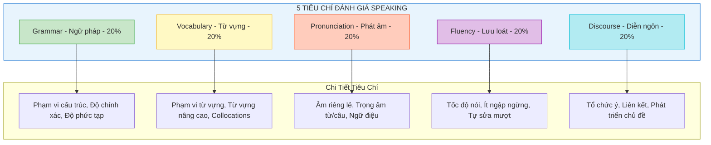
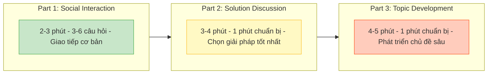

# VSTEP Speaking Section - Phân Tích Chi Tiết

> **Thời gian**: 12 phút | **Số phần**: 3 parts | **Hình thức**: Phỏng vấn trực tiếp

---

## Sơ Đồ Tiêu Chí Đánh Giá



## Cấu Trúc 3 Parts



## Tổng Quan Cấu Trúc

| Thông tin | Chi tiết |
|-----------|----------|
| **Tổng thời gian** | 12 phút |
| **Số phần** | 3 parts |
| **Hình thức** | Phỏng vấn 1-1 với giám khảo |
| **Thang điểm** | 0-10 |
| **Levels** | B1, B2, C1 (Bậc 3, 4, 5) |

---

## Chi Tiết Từng Phần

### Part 1: Social Interaction (Giao Tiếp Xã Hội)

| Thông tin | Chi tiết |
|-----------|----------|
| **Thời gian** | 2-3 phút |
| **Hình thức** | Giám khảo hỏi 3-6 câu về 2 chủ đề quen thuộc |
| **Thời gian chuẩn bị** | Không có |
| **Mục tiêu** | Kiểm tra kỹ năng giao tiếp cơ bản |

**Chủ đề thường gặp:**
- Sở thích và thời gian rảnh
- Gia đình và bạn bè
- Công việc/Học tập
- Quê hương và nơi ở
- Du lịch và kỳ nghỉ
- Ẩm thực và nấu ăn
- Thể thao và giải trí

---

### Part 2: Solution Discussion (Thảo Luận Giải Pháp)

| Thông tin | Chi tiết |
|-----------|----------|
| **Tổng thời gian** | ~4 phút |
| **Thời gian chuẩn bị** | 1 phút |
| **Thời gian nói** | 2-3 phút |
| **Hình thức** | Được cho tình huống với 3 lựa chọn, chọn lựa chọn tốt nhất và giải thích |
| **Mục tiêu** | Kiểm tra khả năng thảo luận, lập luận, thuyết phục |

**Format đề bài:**
```
TÌNH HUỐNG: [Mô tả vấn đề/tình huống]
Bạn có 3 lựa chọn:
   1. [Lựa chọn A]
   2. [Lựa chọn B]  
   3. [Lựa chọn C]
Bạn sẽ chọn lựa chọn nào? Tại sao?
```

**Cấu trúc trả lời:**
```
MỞ ĐẦU: Nêu lựa chọn của bạn
THÂN BÀI:
  - Giải thích 2-3 lý do cho lựa chọn
  - So sánh với các lựa chọn khác và giải thích tại sao chúng kém hơn
KẾT LUẬN: Tóm tắt khuyến nghị
```

---

### Part 3: Topic Development (Phát Triển Chủ Đề)

| Thông tin | Chi tiết |
|-----------|----------|
| **Tổng thời gian** | ~5 phút |
| **Thời gian chuẩn bị** | 1 phút |
| **Thời gian nói** | 3-4 phút |
| **Hình thức** | Phát triển chủ đề theo gợi ý + câu hỏi mở rộng |
| **Tài liệu** | Thẻ chủ đề với các điểm gợi ý |
| **Mục tiêu** | Kiểm tra khả năng trình bày, phát triển ý, trả lời câu hỏi sâu |

**Format thẻ chủ đề:**
```
CHỦ ĐỀ: [Tuyên bố cần thảo luận]

Bạn nên nói về:
• [Điểm 1]
• [Điểm 2]
• [Điểm 3]
• (Ý kiến của bạn)

Bạn có 1 phút để chuẩn bị. Nói trong khoảng 3 phút.
```

---

## Tiêu Chí Đánh Giá

VSTEP Speaking sử dụng **thang đánh giá phân tích** với **5 tiêu chí**:

| Tiêu chí | Mô tả chi tiết |
|----------|----------------|
| **Ngữ pháp (Grammar)** | Phạm vi cấu trúc, độ chính xác, độ phức tạp |
| **Từ vựng (Vocabulary)** | Phạm vi, sự phù hợp, sử dụng từ vựng nâng cao |
| **Phát âm (Pronunciation)** | Âm riêng lẻ, trọng âm từ, trọng âm câu, ngữ điệu |
| **Lưu loát (Fluency)** | Độ ngập ngừng, tốc độ, xử lý lỗi/tự sửa |
| **Quản lý diễn ngôn (Discourse)** | Tổ chức ý, mạch lạc, liên kết, phát triển chủ đề |

---

## Band Descriptors Theo Level

### Band 9-10 (C1 Level)

| Tiêu chí | Mô tả |
|----------|-------|
| **Ngữ pháp** | Sử dụng **phạm vi rộng cấu trúc** với **độ linh hoạt đầy đủ**; **chính xác nhất quán** chỉ lỗi hiếm |
| **Từ vựng** | **Linh hoạt hoàn toàn** và **sử dụng chính xác** trong mọi ngữ cảnh; **ngôn ngữ thành ngữ chính xác** |
| **Phát âm** | Sử dụng **đầy đủ các đặc điểm ngữ âm** để truyền đạt ý nghĩa tinh tế; **dễ hiểu hoàn toàn** |
| **Lưu loát** | Nói **lưu loát chỉ hiếm khi tự sửa**; ngập ngừng chỉ để **chuẩn bị nội dung, không tìm từ** |
| **Diễn ngôn** | **Hoàn toàn mạch lạc** và phát triển chủ đề phù hợp; hoàn thành **TẤT CẢ mục đích giao tiếp** |

### Band 7-8 (C1 Level)

| Tiêu chí | Mô tả |
|----------|-------|
| **Ngữ pháp** | Sử dụng **phạm vi rộng cấu trúc linh hoạt**; hầu hết câu chính xác; **lỗi nhỏ thỉnh thoảng** |
| **Từ vựng** | Sử dụng từ vựng **sẵn sàng và linh hoạt**; bao gồm **từ vựng ít phổ biến/thành ngữ** |
| **Phát âm** | Sử dụng **phạm vi rộng đặc điểm phát âm**; **dễ hiểu xuyên suốt** |
| **Lưu loát** | Nói dài **không cần nỗ lực đáng kể**; chỉ **thỉnh thoảng lặp lại hoặc tự sửa** |
| **Diễn ngôn** | Phát triển chủ đề **mạch lạc và phù hợp**; sử dụng liên từ hiệu quả |

### Band 5-6 (B2 Level)

| Tiêu chí | Mô tả |
|----------|-------|
| **Ngữ pháp** | Sử dụng **kết hợp cấu trúc đơn và phức**; chính xác với **một số lỗi hiếm khi ảnh hưởng giao tiếp** |
| **Từ vựng** | Có **đủ từ vựng** cho thảo luận mở rộng; cố gắng từ vựng nâng cao nhưng **đôi khi có lỗi** |
| **Phát âm** | **Nhìn chung dễ hiểu**; kiểm soát phát âm nhưng có **ảnh hưởng L1**; một số lỗi trọng âm |
| **Lưu loát** | Nói với **một số ngập ngừng** hoặc lặp lại; có thể duy trì dòng chảy nhưng **đôi khi dừng tìm từ** |
| **Diễn ngôn** | Phát triển ý **đầy đủ** dù có thể **đôi khi lặp lại**; sử dụng liên từ cơ bản |

### Band 3-4 (B1 Level)

| Tiêu chí | Mô tả |
|----------|-------|
| **Ngữ pháp** | Sử dụng **phạm vi hạn chế cấu trúc**; cố gắng câu phức nhưng **lỗi thường xuyên** |
| **Từ vựng** | Có **đủ từ vựng cho chủ đề quen thuộc**; **phạm vi hạn chế** cho chủ đề ít quen |
| **Phát âm** | **Nhìn chung dễ hiểu** nhưng có **ảnh hưởng L1 đáng kể**; lỗi trọng âm đôi khi ảnh hưởng nghĩa |
| **Lưu loát** | **Dừng và ngập ngừng thường xuyên**; **tự sửa đáng kể**; khó duy trì nói dài |
| **Diễn ngôn** | Có thể phát triển chủ đề đơn giản nhưng có thể **không rõ ràng hoặc không nhất quán** |

### Band 1-2 (Dưới B1)

| Tiêu chí | Mô tả |
|----------|-------|
| **Ngữ pháp** | Chỉ **kiểm soát rất hạn chế**; chủ yếu câu đơn với lỗi nghiêm trọng |
| **Từ vựng** | **Từ vựng rất hạn chế**; tìm từ thường xuyên; dựa vào cụm từ thuộc lòng |
| **Phát âm** | **Thường không thể hiểu**; can thiệp L1 nghiêm trọng |
| **Lưu loát** | Nói **rất chậm và rời rạc**; dừng dài; không thể duy trì dòng chảy |
| **Diễn ngôn** | Không thể phát triển ý; thiếu mạch lạc; **không đáp ứng task** |

---

## Lỗi Phát Âm Thường Gặp Của Người Việt

### Vấn Đề Phổ Biến

| Vấn đề | Mô tả | Ví dụ |
|--------|-------|-------|
| **Âm cuối** | Bỏ hoặc phát sai /z/, /s/, /t/, /v/, /d/, /ks/, /st/ | "strive" → "stri" |
| **Trọng âm từ** | Trọng âm đều các âm tiết (tiếng Việt là syllable-timed) | "bí-cy-cle" thay vì "BI-cy-cle" |
| **Âm /θ/ /ð/** | Thay bằng /t/, /d/, /s/, /z/ | "think" → "tink" |
| **Cụm phụ âm** | Đơn giản hóa cụm CC/CCC bằng cách bỏ âm | "strength" → "streng" |
| **Âm giữa từ** | Bỏ âm trong từ dài | "Wednesday" → "Wenday" |
| **Nối âm** | Không nối từ trong connected speech | Phát âm rời rạc |
| **Đuôi -ed** | Phát sai hoặc bỏ âm quá khứ | "walked" → "walk" |
| **Phân biệt nguyên âm** | Nhầm giữa nguyên âm tương tự | /ɪ/ vs /iː/, /e/ vs /æ/ |

---

## Chiến Lược Theo Từng Part

### Part 1 Tips

- Trả lời **đầy đủ nhưng không quá dài** (2-4 câu)
- Thêm **chi tiết và lý do**
- Sử dụng **các thì khác nhau** khi phù hợp
- **Mở rộng** câu trả lời, không chỉ trả lời "yes/no"

#### Công Thức A.R.E.A (Nguồn: Edulife.com.vn)

> **A.R.E.A** là công thức giúp trả lời Part 1 một cách có cấu trúc và đầy đủ:

| Bước | Ý nghĩa | Ví dụ |
|------|---------|-------|
| **A - Answer** | Trả lời trực tiếp câu hỏi | "Yes, I really enjoy traveling." |
| **R - Reason** | Đưa ra lý do | "Because it allows me to experience new cultures and meet interesting people." |
| **E - Example** | Cho ví dụ cụ thể | "Last year, I visited Da Nang with my family." |
| **A - And more** | Thêm chi tiết/so sánh | "We had a wonderful time exploring the beaches and local cuisine." |

**Ví dụ hoàn chỉnh với A.R.E.A:**

```
Question: Do you like traveling?

❌ Sai: "Yes, I like traveling."

✓ Đúng (A.R.E.A):
"Yes, I really enjoy traveling. (Answer)
I love it because it helps me relax and discover new places. (Reason)
Last summer, I went to Da Lat with my friends for a week. (Example)
We visited many beautiful gardens and tried lots of delicious food there." (And more)
```

**Ví dụ:**
```
❌ Sai: "Yes, I like traveling."
✓ Đúng: "Yes, I really enjoy traveling. Last year I visited Da Nang 
with my family, and we had a wonderful time exploring the beaches 
and local cuisine."
```

### Part 2 Tips

- Dùng 1 phút chuẩn bị để **lập dàn ý nhanh**
- **Nêu rõ lựa chọn** ngay từ đầu
- Đưa ra **2-3 lý do mạnh**
- **So sánh** với các lựa chọn khác
- **Kết luận** lại lựa chọn của bạn

#### Template So Sánh 3 Options (Nguồn: Edulife.com.vn)

> Template giúp cấu trúc câu trả lời khi phải chọn 1 trong 3 lựa chọn:

**Bước 1: Mở đầu - Nêu lựa chọn (15 giây)**
```
"After considering all three options, I would choose [Option X] 
for several important reasons."
```

**Bước 2: So sánh nhanh 2 options không chọn (30-40 giây)**
```
"While [Option A] might seem attractive because [reason], 
I don't think it's the best choice since [drawback].

Similarly, [Option B] has some advantages like [advantage], 
but [drawback] makes it less suitable."
```

**Bước 3: Giải thích chi tiết lựa chọn (60-80 giây)**
```
"I believe [Option X] is the best choice for the following reasons:

Firstly, [main reason + explanation].
For example, [specific example].

Secondly, [second reason + explanation].
This would help to [benefit]."
```

**Bước 4: Kết luận (10-15 giây)**
```
"Therefore, I firmly believe that [Option X] is the most 
effective/practical/beneficial solution in this situation."
```

**Ví dụ hoàn chỉnh:**

```
Situation: Your company needs to improve employee satisfaction. 
Options: A) Increase salary, B) Flexible working hours, C) Team building activities

"After considering all three options, I would choose flexible working 
hours for several important reasons.

While increasing salary might seem attractive because everyone wants 
more money, I don't think it's the best long-term solution since 
satisfaction often returns to normal levels after a pay raise.

Similarly, team building activities have advantages like improving 
relationships, but they only happen occasionally and don't address 
daily work-life balance issues.

I believe flexible working hours is the best choice for two main reasons:

Firstly, it allows employees to manage their personal responsibilities 
better. For example, parents can pick up their children from school 
without feeling stressed about work.

Secondly, people work more productively when they can choose their 
most effective working times. This would help both the employees 
and the company benefit.

Therefore, I firmly believe flexible working hours is the most 
practical solution for improving employee satisfaction."
```

**Cấu trúc gợi ý:**
```
"In my opinion, I would choose [option] for several reasons.

Firstly, [reason 1 + explanation].

Secondly, [reason 2 + explanation].

While [option 2] might seem attractive, I think [reason why not].
Similarly, [option 3] has drawbacks because [reason].

Therefore, I firmly believe [option] is the best choice."
```

### Part 3 Tips

- Dùng 1 phút để **ghi chú ngắn** cho mỗi điểm
- **Bao quát TẤT CẢ** các điểm gợi ý
- Thêm **ý kiến và ví dụ cá nhân**
- Sẵn sàng cho **câu hỏi mở rộng**
- Nói **có tổ chức** với mở bài, thân bài, kết bài

#### Khung 3 Luận Điểm (Nguồn: Edulife.com.vn)

> Sử dụng khung 3 luận điểm để phát triển chủ đề một cách mạch lạc và đầy đủ:

**Cấu trúc tổng thể (3-4 phút nói):**

```
┌─────────────────────────────────────────────────────────┐
│  OPENING (15-20 giây)                                   │
│  → Giới thiệu chủ đề, nêu 3 điểm sẽ nói                │
├─────────────────────────────────────────────────────────┤
│  POINT 1 (45-60 giây)                                   │
│  → Topic sentence + Explanation + Example               │
├─────────────────────────────────────────────────────────┤
│  POINT 2 (45-60 giây)                                   │
│  → Topic sentence + Explanation + Example               │
├─────────────────────────────────────────────────────────┤
│  POINT 3 (45-60 giây)                                   │
│  → Topic sentence + Explanation + Personal opinion      │
├─────────────────────────────────────────────────────────┤
│  CONCLUSION (15-20 giây)                                │
│  → Tóm tắt, đưa ra ý kiến cá nhân tổng kết             │
└─────────────────────────────────────────────────────────┘
```

**Template chi tiết:**

```
OPENING:
"I'd like to talk about [topic]. There are three main aspects 
I want to discuss: [point 1], [point 2], and [point 3]."

POINT 1:
"First of all, let me talk about [point 1].
[Explanation of this point].
For instance, [specific example from experience or knowledge].
This shows that [mini-conclusion]."

POINT 2:
"Moving on to [point 2], I think it's important to consider that...
[Explanation].
A good example of this is [example].
So we can see that [link back to topic]."

POINT 3:
"Finally, regarding [point 3]...
[Explanation with personal opinion].
In my experience, [personal example or observation].
I believe that [your view on this point]."

CONCLUSION:
"In conclusion, [topic] involves [summarize 3 points briefly].
Personally, I think [overall opinion/recommendation]."
```

**Ví dụ hoàn chỉnh:**

```
Topic: The importance of learning foreign languages

"I'd like to talk about the importance of learning foreign languages. 
There are three main aspects I want to discuss: career opportunities, 
cultural understanding, and personal development.

First of all, learning a foreign language opens up many career 
opportunities. In today's globalized world, companies prefer employees 
who can communicate with international clients. For instance, my 
cousin got promoted to regional manager because she speaks fluent 
English and basic Chinese. This shows that language skills can 
significantly boost your career.

Moving on to cultural understanding, knowing another language helps 
us appreciate different cultures better. When you learn a language, 
you also learn about the history, traditions, and values of that 
culture. A good example is when I learned some Japanese - I started 
to understand why Japanese people are so polite and formal.

Finally, regarding personal development, learning languages exercises 
our brain and improves memory. Research shows that bilingual people 
have better cognitive abilities. In my experience, since I started 
learning English seriously, I've become better at problem-solving 
and multitasking.

In conclusion, learning foreign languages is important for career 
growth, cultural appreciation, and brain development. Personally, 
I think everyone should try to learn at least one foreign language."
```

---

## Cụm Từ Hữu Ích Theo Level

### B1 Level

| Chức năng | Cụm từ |
|-----------|--------|
| Mở đầu | "I would like to talk about..." |
| Quan điểm | "In my opinion...", "I think..." |
| Liệt kê | "First... Second... In addition..." |
| Kết luận | "In short, I believe that..." |

### B2 Level

| Chức năng | Cụm từ |
|-----------|--------|
| Mở đầu | "I would like to discuss whether..." |
| Quan điểm | "From my point of view...", "I strongly believe..." |
| Liệt kê | "Firstly... Secondly... Moreover..." |
| Tương phản | "However... Nevertheless... On the other hand..." |
| Kết luận | "Overall, I believe...", "Taking everything into account..." |

### C1 Level

| Chức năng | Cụm từ |
|-----------|--------|
| Mở đầu | "It is often argued that...", "There is a growing debate about..." |
| Quan điểm | "While some may contend that... I would argue..." |
| Nhấn mạnh | "It is worth noting that...", "Significantly,..." |
| Nhượng bộ | "Admittedly...", "I acknowledge that..., however..." |
| Kết luận | "Nevertheless, the evidence suggests...", "All things considered..." |

---

## Điểm Cộng & Điểm Trừ

### Những Gì Mất Điểm

| Vấn đề | Mức độ ảnh hưởng |
|--------|------------------|
| **Câu trả lời thuộc lòng/chuẩn bị sẵn** | Trừ điểm nghiêm trọng |
| **Trả lời lạc đề** | Không đáp ứng yêu cầu task |
| **Im lặng dài** | Cho thấy không thể tạo ngôn ngữ |
| **Phát âm không thể hiểu** | Ngăn cản giao tiếp |
| **Lỗi ngữ pháp nghiêm trọng ảnh hưởng nghĩa** | Phá vỡ giao tiếp |
| **Từ vựng rất hạn chế** | Không thể diễn đạt ý |
| **Không phát triển chủ đề** | Câu trả lời ngắn, không phát triển |

### Những Gì Được Điểm

| Tiêu chí | Yếu tố tăng điểm |
|----------|------------------|
| **Ngữ pháp** | Cấu trúc phức tạp chính xác (conditionals, passives, relative clauses) |
| **Từ vựng** | Thành ngữ, collocations, từ chuyên ngành, paraphrasing |
| **Phát âm** | Ngữ điệu tự nhiên, trọng âm đúng, âm rõ ràng |
| **Lưu loát** | Nói dài, tốc độ tự nhiên, ít ngập ngừng, tự sửa mượt |
| **Diễn ngôn** | Tổ chức logic, liên từ đa dạng, ví dụ phù hợp, phát triển đầy đủ |

---

## Mẹo Cải Thiện

### Ngữ Pháp
- Luyện sử dụng đa dạng thì và cấu trúc
- Học câu điều kiện, bị động, mệnh đề quan hệ
- Tập trung vào độ chính xác trong cấu trúc phức tạp

### Từ Vựng
- Xây dựng từ vựng theo chủ đề VSTEP phổ biến
- Học collocations và thành ngữ
- Luyện paraphrasing để tránh lặp từ

### Phát Âm
- Luyện âm cuối: /z/, /s/, /t/, /d/, /v/
- Làm việc với patterns trọng âm từ đa âm tiết
- Luyện âm /θ/ và /ð/
- Ghi âm và so sánh với người bản xứ
- Tập trung vào nối âm trong connected speech

### Lưu Loát
- Sử dụng fillers chiến lược ("Well...", "I think...")
- Luyện nói dài về nhiều chủ đề
- Phát triển ý với ví dụ và giải thích
- Chấp nhận lỗi nhỏ và duy trì dòng chảy

### Diễn Ngôn
- Sử dụng discourse markers (firstly, however, in addition)
- Luyện format VSTEP: Part 1, 2, 3 structures
- Phát triển ý với lý do, ví dụ, và kết luận
- Giữ đúng chủ đề và đáp ứng tất cả phần của câu hỏi

---

## Tài Liệu Tham Khảo

| Nguồn | Link |
|-------|------|
| VSTEP Official (VNU-ULIS) | https://vstep.vnu.edu.vn/test-format/ |
| Điểm và Level | https://vstep.vnu.edu.vn/scores-levels/ |
| Practice Tests | https://englishteststore.net |
| **Mẹo thi Speaking VSTEP** | https://edulife.com.vn |
