# VSTEP Speaking Section - Phân Tích Chi Tiết

> **Thời gian**: 12 phút | **Số phần**: 3 parts | **Hình thức**: Phỏng vấn trực tiếp

---

## Sơ Đồ Tiêu Chí Đánh Giá

```mermaid
flowchart TB
    subgraph Criteria["🎯 5 TIÊU CHÍ ĐÁNH GIÁ SPEAKING"]
        direction TB
        
        G["📝 Grammar<br/>Ngữ pháp<br/>20%"]
        V["📚 Vocabulary<br/>Từ vựng<br/>20%"]
        P["🗣️ Pronunciation<br/>Phát âm<br/>20%"]
        F["💨 Fluency<br/>Lưu loát<br/>20%"]
        D["🔗 Discourse<br/>Diễn ngôn<br/>20%"]
    end
    
    subgraph Details["Chi Tiết Tiêu Chí"]
        G1["• Phạm vi cấu trúc<br/>• Độ chính xác<br/>• Độ phức tạp"]
        V1["• Phạm vi từ vựng<br/>• Từ vựng nâng cao<br/>• Collocations"]
        P1["• Âm riêng lẻ<br/>• Trọng âm từ/câu<br/>• Ngữ điệu"]
        F1["• Tốc độ nói<br/>• Ít ngập ngừng<br/>• Tự sửa mượt"]
        D1["• Tổ chức ý<br/>• Liên kết<br/>• Phát triển chủ đề"]
    end
    
    G --> G1
    V --> V1
    P --> P1
    F --> F1
    D --> D1
    
    style Criteria fill:#e8f4fd,stroke:#1976d2
    style G fill:#c8e6c9,stroke:#4caf50
    style V fill:#fff9c4,stroke:#fbc02d
    style P fill:#ffccbc,stroke:#ff5722
    style F fill:#e1bee7,stroke:#9c27b0
    style D fill:#b2ebf2,stroke:#00bcd4
```



## Cấu Trúc 3 Parts

```mermaid
flowchart LR
    subgraph Part1["Part 1: Social Interaction"]
        P1T["⏱️ 2-3 phút<br/>📋 3-6 câu hỏi<br/>🎯 Giao tiếp cơ bản"]
    end
    
    subgraph Part2["Part 2: Solution Discussion"]
        P2T["⏱️ 3-4 phút<br/>📋 1 phút chuẩn bị<br/>🎯 Chọn giải pháp tốt nhất"]
    end
    
    subgraph Part3["Part 3: Topic Development"]
        P3T["⏱️ 4-5 phút<br/>📋 1 phút chuẩn bị<br/>🎯 Phát triển chủ đề sâu"]
    end
    
    Part1 --> Part2 --> Part3
    
    style P1T fill:#c8e6c9,stroke:#4caf50
    style P2T fill:#fff9c4,stroke:#fbc02d
    style P3T fill:#ffccbc,stroke:#ff5722
```



## Tổng Quan Cấu Trúc

| Thông tin | Chi tiết |
|-----------|----------|
| **Tổng thời gian** | 12 phút |
| **Số phần** | 3 parts |
| **Hình thức** | Phỏng vấn 1-1 với giám khảo |
| **Thang điểm** | 0-10 |
| **Levels** | B1, B2, C1 (Bậc 3, 4, 5) |

---

## Chi Tiết Từng Phần

### Part 1: Social Interaction (Giao Tiếp Xã Hội)

| Thông tin | Chi tiết |
|-----------|----------|
| **Thời gian** | 2-3 phút |
| **Hình thức** | Giám khảo hỏi 3-6 câu về 2 chủ đề quen thuộc |
| **Thời gian chuẩn bị** | Không có |
| **Mục tiêu** | Kiểm tra kỹ năng giao tiếp cơ bản |

**Chủ đề thường gặp:**
- Sở thích và thời gian rảnh
- Gia đình và bạn bè
- Công việc/Học tập
- Quê hương và nơi ở
- Du lịch và kỳ nghỉ
- Ẩm thực và nấu ăn
- Thể thao và giải trí

---

### Part 2: Solution Discussion (Thảo Luận Giải Pháp)

| Thông tin | Chi tiết |
|-----------|----------|
| **Tổng thời gian** | ~4 phút |
| **Thời gian chuẩn bị** | 1 phút |
| **Thời gian nói** | 2-3 phút |
| **Hình thức** | Được cho tình huống với 3 lựa chọn, chọn lựa chọn tốt nhất và giải thích |
| **Mục tiêu** | Kiểm tra khả năng thảo luận, lập luận, thuyết phục |

**Format đề bài:**
```
TÌNH HUỐNG: [Mô tả vấn đề/tình huống]
Bạn có 3 lựa chọn:
   1. [Lựa chọn A]
   2. [Lựa chọn B]  
   3. [Lựa chọn C]
Bạn sẽ chọn lựa chọn nào? Tại sao?
```

**Cấu trúc trả lời:**
```
MỞ ĐẦU: Nêu lựa chọn của bạn
THÂN BÀI:
  - Giải thích 2-3 lý do cho lựa chọn
  - So sánh với các lựa chọn khác và giải thích tại sao chúng kém hơn
KẾT LUẬN: Tóm tắt khuyến nghị
```

---

### Part 3: Topic Development (Phát Triển Chủ Đề)

| Thông tin | Chi tiết |
|-----------|----------|
| **Tổng thời gian** | ~5 phút |
| **Thời gian chuẩn bị** | 1 phút |
| **Thời gian nói** | 3-4 phút |
| **Hình thức** | Phát triển chủ đề theo gợi ý + câu hỏi mở rộng |
| **Tài liệu** | Thẻ chủ đề với các điểm gợi ý |
| **Mục tiêu** | Kiểm tra khả năng trình bày, phát triển ý, trả lời câu hỏi sâu |

**Format thẻ chủ đề:**
```
CHỦ ĐỀ: [Tuyên bố cần thảo luận]

Bạn nên nói về:
• [Điểm 1]
• [Điểm 2]
• [Điểm 3]
• (Ý kiến của bạn)

Bạn có 1 phút để chuẩn bị. Nói trong khoảng 3 phút.
```

---

## Tiêu Chí Đánh Giá

VSTEP Speaking sử dụng **thang đánh giá phân tích** với **5 tiêu chí**:

| Tiêu chí | Mô tả chi tiết |
|----------|----------------|
| **Ngữ pháp (Grammar)** | Phạm vi cấu trúc, độ chính xác, độ phức tạp |
| **Từ vựng (Vocabulary)** | Phạm vi, sự phù hợp, sử dụng từ vựng nâng cao |
| **Phát âm (Pronunciation)** | Âm riêng lẻ, trọng âm từ, trọng âm câu, ngữ điệu |
| **Lưu loát (Fluency)** | Độ ngập ngừng, tốc độ, xử lý lỗi/tự sửa |
| **Quản lý diễn ngôn (Discourse)** | Tổ chức ý, mạch lạc, liên kết, phát triển chủ đề |

---

## Band Descriptors Theo Level

### Band 9-10 (C1 Level)

| Tiêu chí | Mô tả |
|----------|-------|
| **Ngữ pháp** | Sử dụng **phạm vi rộng cấu trúc** với **độ linh hoạt đầy đủ**; **chính xác nhất quán** chỉ lỗi hiếm |
| **Từ vựng** | **Linh hoạt hoàn toàn** và **sử dụng chính xác** trong mọi ngữ cảnh; **ngôn ngữ thành ngữ chính xác** |
| **Phát âm** | Sử dụng **đầy đủ các đặc điểm ngữ âm** để truyền đạt ý nghĩa tinh tế; **dễ hiểu hoàn toàn** |
| **Lưu loát** | Nói **lưu loát chỉ hiếm khi tự sửa**; ngập ngừng chỉ để **chuẩn bị nội dung, không tìm từ** |
| **Diễn ngôn** | **Hoàn toàn mạch lạc** và phát triển chủ đề phù hợp; hoàn thành **TẤT CẢ mục đích giao tiếp** |

### Band 7-8 (C1 Level)

| Tiêu chí | Mô tả |
|----------|-------|
| **Ngữ pháp** | Sử dụng **phạm vi rộng cấu trúc linh hoạt**; hầu hết câu chính xác; **lỗi nhỏ thỉnh thoảng** |
| **Từ vựng** | Sử dụng từ vựng **sẵn sàng và linh hoạt**; bao gồm **từ vựng ít phổ biến/thành ngữ** |
| **Phát âm** | Sử dụng **phạm vi rộng đặc điểm phát âm**; **dễ hiểu xuyên suốt** |
| **Lưu loát** | Nói dài **không cần nỗ lực đáng kể**; chỉ **thỉnh thoảng lặp lại hoặc tự sửa** |
| **Diễn ngôn** | Phát triển chủ đề **mạch lạc và phù hợp**; sử dụng liên từ hiệu quả |

### Band 5-6 (B2 Level)

| Tiêu chí | Mô tả |
|----------|-------|
| **Ngữ pháp** | Sử dụng **kết hợp cấu trúc đơn và phức**; chính xác với **một số lỗi hiếm khi ảnh hưởng giao tiếp** |
| **Từ vựng** | Có **đủ từ vựng** cho thảo luận mở rộng; cố gắng từ vựng nâng cao nhưng **đôi khi có lỗi** |
| **Phát âm** | **Nhìn chung dễ hiểu**; kiểm soát phát âm nhưng có **ảnh hưởng L1**; một số lỗi trọng âm |
| **Lưu loát** | Nói với **một số ngập ngừng** hoặc lặp lại; có thể duy trì dòng chảy nhưng **đôi khi dừng tìm từ** |
| **Diễn ngôn** | Phát triển ý **đầy đủ** dù có thể **đôi khi lặp lại**; sử dụng liên từ cơ bản |

### Band 3-4 (B1 Level)

| Tiêu chí | Mô tả |
|----------|-------|
| **Ngữ pháp** | Sử dụng **phạm vi hạn chế cấu trúc**; cố gắng câu phức nhưng **lỗi thường xuyên** |
| **Từ vựng** | Có **đủ từ vựng cho chủ đề quen thuộc**; **phạm vi hạn chế** cho chủ đề ít quen |
| **Phát âm** | **Nhìn chung dễ hiểu** nhưng có **ảnh hưởng L1 đáng kể**; lỗi trọng âm đôi khi ảnh hưởng nghĩa |
| **Lưu loát** | **Dừng và ngập ngừng thường xuyên**; **tự sửa đáng kể**; khó duy trì nói dài |
| **Diễn ngôn** | Có thể phát triển chủ đề đơn giản nhưng có thể **không rõ ràng hoặc không nhất quán** |

### Band 1-2 (Dưới B1)

| Tiêu chí | Mô tả |
|----------|-------|
| **Ngữ pháp** | Chỉ **kiểm soát rất hạn chế**; chủ yếu câu đơn với lỗi nghiêm trọng |
| **Từ vựng** | **Từ vựng rất hạn chế**; tìm từ thường xuyên; dựa vào cụm từ thuộc lòng |
| **Phát âm** | **Thường không thể hiểu**; can thiệp L1 nghiêm trọng |
| **Lưu loát** | Nói **rất chậm và rời rạc**; dừng dài; không thể duy trì dòng chảy |
| **Diễn ngôn** | Không thể phát triển ý; thiếu mạch lạc; **không đáp ứng task** |

---

## Lỗi Phát Âm Thường Gặp Của Người Việt

### Vấn Đề Phổ Biến

| Vấn đề | Mô tả | Ví dụ |
|--------|-------|-------|
| **Âm cuối** | Bỏ hoặc phát sai /z/, /s/, /t/, /v/, /d/, /ks/, /st/ | "strive" → "stri" |
| **Trọng âm từ** | Trọng âm đều các âm tiết (tiếng Việt là syllable-timed) | "bí-cy-cle" thay vì "BI-cy-cle" |
| **Âm /θ/ /ð/** | Thay bằng /t/, /d/, /s/, /z/ | "think" → "tink" |
| **Cụm phụ âm** | Đơn giản hóa cụm CC/CCC bằng cách bỏ âm | "strength" → "streng" |
| **Âm giữa từ** | Bỏ âm trong từ dài | "Wednesday" → "Wenday" |
| **Nối âm** | Không nối từ trong connected speech | Phát âm rời rạc |
| **Đuôi -ed** | Phát sai hoặc bỏ âm quá khứ | "walked" → "walk" |
| **Phân biệt nguyên âm** | Nhầm giữa nguyên âm tương tự | /ɪ/ vs /iː/, /e/ vs /æ/ |

---

## Chiến Lược Theo Từng Part

### Part 1 Tips

- Trả lời **đầy đủ nhưng không quá dài** (2-4 câu)
- Thêm **chi tiết và lý do**
- Sử dụng **các thì khác nhau** khi phù hợp
- **Mở rộng** câu trả lời, không chỉ trả lời "yes/no"

**Ví dụ:**
```
❌ Sai: "Yes, I like traveling."
✓ Đúng: "Yes, I really enjoy traveling. Last year I visited Da Nang 
with my family, and we had a wonderful time exploring the beaches 
and local cuisine."
```

### Part 2 Tips

- Dùng 1 phút chuẩn bị để **lập dàn ý nhanh**
- **Nêu rõ lựa chọn** ngay từ đầu
- Đưa ra **2-3 lý do mạnh**
- **So sánh** với các lựa chọn khác
- **Kết luận** lại lựa chọn của bạn

**Cấu trúc gợi ý:**
```
"In my opinion, I would choose [option] for several reasons.

Firstly, [reason 1 + explanation].

Secondly, [reason 2 + explanation].

While [option 2] might seem attractive, I think [reason why not].
Similarly, [option 3] has drawbacks because [reason].

Therefore, I firmly believe [option] is the best choice."
```

### Part 3 Tips

- Dùng 1 phút để **ghi chú ngắn** cho mỗi điểm
- **Bao quát TẤT CẢ** các điểm gợi ý
- Thêm **ý kiến và ví dụ cá nhân**
- Sẵn sàng cho **câu hỏi mở rộng**
- Nói **có tổ chức** với mở bài, thân bài, kết bài

---

## Cụm Từ Hữu Ích Theo Level

### B1 Level

| Chức năng | Cụm từ |
|-----------|--------|
| Mở đầu | "I would like to talk about..." |
| Quan điểm | "In my opinion...", "I think..." |
| Liệt kê | "First... Second... In addition..." |
| Kết luận | "In short, I believe that..." |

### B2 Level

| Chức năng | Cụm từ |
|-----------|--------|
| Mở đầu | "I would like to discuss whether..." |
| Quan điểm | "From my point of view...", "I strongly believe..." |
| Liệt kê | "Firstly... Secondly... Moreover..." |
| Tương phản | "However... Nevertheless... On the other hand..." |
| Kết luận | "Overall, I believe...", "Taking everything into account..." |

### C1 Level

| Chức năng | Cụm từ |
|-----------|--------|
| Mở đầu | "It is often argued that...", "There is a growing debate about..." |
| Quan điểm | "While some may contend that... I would argue..." |
| Nhấn mạnh | "It is worth noting that...", "Significantly,..." |
| Nhượng bộ | "Admittedly...", "I acknowledge that..., however..." |
| Kết luận | "Nevertheless, the evidence suggests...", "All things considered..." |

---

## Điểm Cộng & Điểm Trừ

### Những Gì Mất Điểm

| Vấn đề | Mức độ ảnh hưởng |
|--------|------------------|
| **Câu trả lời thuộc lòng/chuẩn bị sẵn** | Trừ điểm nghiêm trọng |
| **Trả lời lạc đề** | Không đáp ứng yêu cầu task |
| **Im lặng dài** | Cho thấy không thể tạo ngôn ngữ |
| **Phát âm không thể hiểu** | Ngăn cản giao tiếp |
| **Lỗi ngữ pháp nghiêm trọng ảnh hưởng nghĩa** | Phá vỡ giao tiếp |
| **Từ vựng rất hạn chế** | Không thể diễn đạt ý |
| **Không phát triển chủ đề** | Câu trả lời ngắn, không phát triển |

### Những Gì Được Điểm

| Tiêu chí | Yếu tố tăng điểm |
|----------|------------------|
| **Ngữ pháp** | Cấu trúc phức tạp chính xác (conditionals, passives, relative clauses) |
| **Từ vựng** | Thành ngữ, collocations, từ chuyên ngành, paraphrasing |
| **Phát âm** | Ngữ điệu tự nhiên, trọng âm đúng, âm rõ ràng |
| **Lưu loát** | Nói dài, tốc độ tự nhiên, ít ngập ngừng, tự sửa mượt |
| **Diễn ngôn** | Tổ chức logic, liên từ đa dạng, ví dụ phù hợp, phát triển đầy đủ |

---

## Mẹo Cải Thiện

### Ngữ Pháp
- Luyện sử dụng đa dạng thì và cấu trúc
- Học câu điều kiện, bị động, mệnh đề quan hệ
- Tập trung vào độ chính xác trong cấu trúc phức tạp

### Từ Vựng
- Xây dựng từ vựng theo chủ đề VSTEP phổ biến
- Học collocations và thành ngữ
- Luyện paraphrasing để tránh lặp từ

### Phát Âm
- Luyện âm cuối: /z/, /s/, /t/, /d/, /v/
- Làm việc với patterns trọng âm từ đa âm tiết
- Luyện âm /θ/ và /ð/
- Ghi âm và so sánh với người bản xứ
- Tập trung vào nối âm trong connected speech

### Lưu Loát
- Sử dụng fillers chiến lược ("Well...", "I think...")
- Luyện nói dài về nhiều chủ đề
- Phát triển ý với ví dụ và giải thích
- Chấp nhận lỗi nhỏ và duy trì dòng chảy

### Diễn Ngôn
- Sử dụng discourse markers (firstly, however, in addition)
- Luyện format VSTEP: Part 1, 2, 3 structures
- Phát triển ý với lý do, ví dụ, và kết luận
- Giữ đúng chủ đề và đáp ứng tất cả phần của câu hỏi

---

## Tài Liệu Tham Khảo

| Nguồn | Link |
|-------|------|
| VSTEP Official (VNU-ULIS) | https://vstep.vnu.edu.vn/test-format/ |
| Điểm và Level | https://vstep.vnu.edu.vn/scores-levels/ |
| Practice Tests | https://englishteststore.net |
