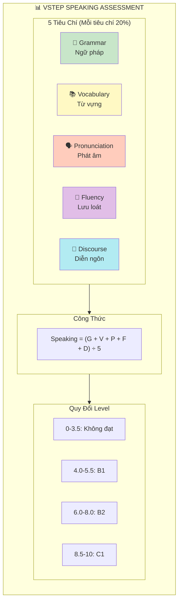

# VSTEP Speaking Rubric - Band Descriptors

> **Thang điểm**: 0-10 | **Bước điểm**: 0.5 | **Quy đổi**: B1 (4.0-5.5), B2 (6.0-8.0), C1 (8.5-10)

---

## Sơ Đồ Tiêu Chí Đánh Giá

---

## Tổng Quan 5 Tiêu Chí

| Tiêu chí | Trọng số | Mô tả chi tiết |
|----------|----------|----------------|
| **Grammar** | 20% | Phạm vi cấu trúc, độ chính xác, độ phức tạp |
| **Vocabulary** | 20% | Phạm vi từ vựng, sự phù hợp, từ vựng nâng cao |
| **Pronunciation** | 20% | Âm riêng lẻ, trọng âm từ/câu, ngữ điệu |
| **Fluency** | 20% | Tốc độ, độ ngập ngừng, khả năng tự sửa |
| **Discourse** | 20% | Tổ chức ý, mạch lạc, liên kết, phát triển chủ đề |

---

## Band 9.0-10 (C1 Advanced)

### Grammar (Ngữ pháp)
- Sử dụng **phạm vi rộng cấu trúc** với **độ linh hoạt đầy đủ**
- **Chính xác nhất quán** với chỉ lỗi rất hiếm
- Kiểm soát xuất sắc các cấu trúc phức tạp (conditionals, passives, relative clauses)
- Lỗi cực kỳ hiếm và chỉ là slips

### Vocabulary (Từ vựng)
- **Linh hoạt hoàn toàn** và **sử dụng chính xác** trong mọi ngữ cảnh
- **Ngôn ngữ thành ngữ chính xác** (idioms, collocations)
- Paraphrase xuất sắc, không lặp từ
- Sử dụng từ vựng học thuật và chuyên ngành tự nhiên

### Pronunciation (Phát âm)
- Sử dụng **đầy đủ các đặc điểm ngữ âm** để truyền đạt ý nghĩa tinh tế
- **Dễ hiểu hoàn toàn** trong mọi tình huống
- Ngữ điệu và trọng âm tự nhiên như người bản xứ
- Connected speech mượt mà

### Fluency (Lưu loát)
- Nói **lưu loát với chỉ hiếm khi tự sửa**
- Ngập ngừng chỉ để **chuẩn bị nội dung, không tìm từ**
- Duy trì tốc độ nói tự nhiên xuyên suốt
- Nói dài mà không mất mạch

### Discourse Management (Diễn ngôn)
- **Hoàn toàn mạch lạc** và phát triển chủ đề phù hợp
- Hoàn thành **TẤT CẢ mục đích giao tiếp**
- Tổ chức ý logic hoàn hảo
- Sử dụng liên từ đa dạng, tự nhiên

---

## Band 7.0-8.5 (C1)

### Grammar
- Sử dụng **phạm vi rộng cấu trúc linh hoạt**
- Hầu hết câu chính xác; **lỗi nhỏ thỉnh thoảng**
- Cấu trúc phức tạp được sử dụng tự tin
- Lỗi không ảnh hưởng communication

### Vocabulary
- Sử dụng từ vựng **sẵn sàng và linh hoạt**
- Bao gồm **từ vựng ít phổ biến/thành ngữ**
- Less common vocabulary được sử dụng phù hợp
- Kiểm soát tốt register và style

### Pronunciation
- Sử dụng **phạm vi rộng đặc điểm phát âm**
- **Dễ hiểu xuyên suốt**
- Trọng âm và ngữ điệu nhìn chung chính xác
- Một vài lỗi nhỏ không ảnh hưởng nghĩa

### Fluency
- Nói dài **không cần nỗ lực đáng kể**
- Chỉ **thỉnh thoảng lặp lại hoặc tự sửa**
- Duy trì dòng chảy tốt
- Ngập ngừng hiếm và ngắn

### Discourse Management
- Phát triển chủ đề **mạch lạc và phù hợp**
- Sử dụng liên từ hiệu quả
- Ví dụ và lý do được phát triển đầy đủ
- Đáp ứng tất cả phần của câu hỏi

---

## Band 5.5-6.5 (B2)

### Grammar
- Sử dụng **kết hợp cấu trúc đơn và phức**
- Chính xác với **một số lỗi hiếm khi ảnh hưởng giao tiếp**
- Cố gắng cấu trúc phức tạp với thành công vừa phải
- Kiểm soát tốt cấu trúc cơ bản

### Vocabulary
- Có **đủ từ vựng** cho thảo luận mở rộng
- Cố gắng từ vựng nâng cao nhưng **đôi khi có lỗi**
- Có awareness về collocation
- Một số lỗi word choice không ảnh hưởng nghĩa chính

### Pronunciation
- **Nhìn chung dễ hiểu**
- Kiểm soát phát âm nhưng có **ảnh hưởng L1**
- Một số lỗi trọng âm từ
- Ngữ điệu có thể đôi khi không tự nhiên

### Fluency
- Nói với **một số ngập ngừng** hoặc lặp lại
- Có thể duy trì dòng chảy nhưng **đôi khi dừng tìm từ**
- Tự sửa thỉnh thoảng
- Có thể nói dài với chủ đề quen thuộc

### Discourse Management
- Phát triển ý **đầy đủ** dù có thể **đôi khi lặp lại**
- Sử dụng liên từ cơ bản hiệu quả
- Tổ chức nhìn chung rõ ràng
- Có thể thiếu chi tiết ở một số điểm

**Ví dụ lỗi ở B2:**
- Word choice không hoàn hảo: "make a research" thay vì "conduct research"
- Một vài lỗi trọng âm: phát âm "photograph" với trọng âm sai
- Đôi khi dùng dừng "um" hoặc "uh" khi tìm từ

---

## Band 4.0-5.0 (B1)

### Grammar
- Sử dụng **phạm vi hạn chế cấu trúc**
- Cố gắng câu phức nhưng **lỗi thường xuyên**
- Kiểm soát tốt hơn với cấu trúc đơn giản
- Lỗi ngữ pháp có thể gây hiểu lầm đôi khi

### Vocabulary
- Có **đủ từ vựng cho chủ đề quen thuộc**
- **Phạm vi hạn chế** cho chủ đề ít quen
- Từ vựng có thể lặp lại
- Meaning nhìn chung clear mặc dù có lỗi

### Pronunciation
- **Nhìn chung dễ hiểu** nhưng có **ảnh hưởng L1 đáng kể**
- Lỗi trọng âm đôi khi ảnh hưởng nghĩa
- Một số âm khó có thể không chính xác
- Ngữ điệu có thể flat hoặc không tự nhiên

### Fluency
- **Dừng và ngập ngừng thường xuyên**
- **Tự sửa đáng kể**
- Khó duy trì nói dài
- Có thể cần pausing để tìm từ

### Discourse Management
- Có thể phát triển chủ đề đơn giản nhưng có thể **không rõ ràng hoặc không nhất quán**
- Sử dụng liên từ cơ bản (First, Second, However)
- Ý tưởng có thể không được kết nối tốt
- Có thể không bao quát hết các điểm yêu cầu

**Ví dụ lỗi ở B1:**
- Subject-verb agreement: "Everyone have..."
- Missing articles: "I bought laptop"
- Simple vocabulary lặp lại: "good" nhiều lần
- Dừng dài khi tìm từ
- Ngữ điệu phẳng

---

## Band 2.0-3.5 (Pre-B1)

### Grammar
- Chỉ **kiểm soát rất hạn chế**
- Chủ yếu câu đơn với lỗi nghiêm trọng
- Cấu trúc phức tạp hầu như không thể
- Lỗi thường xuyên gây khó hiểu

### Vocabulary
- **Từ vựng rất hạn chế**
- Tìm từ thường xuyên
- Dựa vào cụm từ thuộc lòng
- Không thể paraphrase

### Pronunciation
- **Thường không thể hiểu**
- Can thiệp L1 nghiêm trọng
- Nhiều âm không chính xác
- Trọng âm và ngữ điệu rất yếu

### Fluency
- Nói **rất chậm và rời rạc**
- Dừng dài thường xuyên
- Không thể duy trì dòng chảy
- Cần nhiều thời gian để tạo câu

### Discourse Management
- Không thể phát triển ý
- Thiếu mạch lạc
- **Không đáp ứng task**
- Câu trả lời rất ngắn hoặc không liên quan

---

## Band 0-1.5

### Đặc điểm
- Không thể giao tiếp hiệu quả
- Im lặng dài hoặc không phản hồi
- Không hiểu câu hỏi
- Chỉ phát ra từ rời rạc không liên quan
- Hoàn toàn không thể hiểu được

---

## Bảng Chi Tiết Theo Điểm

| Score | Level | Grammar | Vocabulary | Pronunciation | Fluency | Discourse |
|-------|-------|---------|------------|---------------|---------|-----------|
| 9-10 | C1+ | Excellent range, rare errors | Sophisticated, idiomatic | Native-like | Effortless | Fully coherent |
| 8-8.5 | C1 | Wide range, accurate | Flexible, advanced | Clear throughout | Smooth flow | Well-developed |
| 7-7.5 | B2+ | Complex structures | Good range | Generally clear | Minor hesitation | Organized |
| 6-6.5 | B2 | Mix simple/complex | Adequate | Understandable | Some pauses | Adequate |
| 5-5.5 | B1+ | Limited range | Basic adequate | L1 influence | Noticeable pauses | Basic organization |
| 4-4.5 | B1 | Simple only | Limited | Significant L1 | Frequent pauses | Simple development |
| 3-3.5 | Pre-B1 | Very limited | Very basic | Often unclear | Very slow | Lacks coherence |
| 0-2.5 | Below | Cannot assess | Inadequate | Cannot understand | Cannot communicate | No organization |

---

## Tiêu Chí Chi Tiết Theo Part

### Part 1: Social Interaction (2-3 phút)

| Điểm | Mô tả |
|------|-------|
| 9-10 | Trả lời tự nhiên, mở rộng với chi tiết phong phú, hoàn toàn tự tin |
| 7-8 | Trả lời đầy đủ với ví dụ, ít ngập ngừng |
| 5-6 | Trả lời phù hợp nhưng đôi khi ngắn, một số ngập ngừng |
| 3-4 | Trả lời cơ bản, thường ngắn gọn, ngập ngừng đáng kể |
| 1-2 | Chỉ trả lời rất ngắn hoặc không đầy đủ |

### Part 2: Solution Discussion (3-4 phút)

| Điểm | Mô tả |
|------|-------|
| 9-10 | Lập luận xuất sắc, so sánh sâu sắc, kết luận mạnh mẽ |
| 7-8 | Lý do tốt cho lựa chọn, so sánh với các option khác |
| 5-6 | Nêu được lựa chọn và lý do cơ bản, so sánh hạn chế |
| 3-4 | Chọn nhưng giải thích yếu, thiếu so sánh |
| 1-2 | Không thể giải thích lựa chọn hoặc không chọn được |

### Part 3: Topic Development (4-5 phút)

| Điểm | Mô tả |
|------|-------|
| 9-10 | Phát triển đầy đủ tất cả điểm, ý kiến sâu sắc, trả lời follow-up xuất sắc |
| 7-8 | Bao quát các điểm với chi tiết, ý kiến rõ ràng |
| 5-6 | Đề cập các điểm nhưng phát triển không đồng đều |
| 3-4 | Chỉ đề cập một số điểm, phát triển hạn chế |
| 1-2 | Không thể phát triển chủ đề, bỏ nhiều điểm |

---

## Những Yếu Tố Mất Điểm

| Vấn đề | Mức độ ảnh hưởng |
|--------|------------------|
| **Câu trả lời thuộc lòng/chuẩn bị sẵn** | Trừ điểm nghiêm trọng |
| **Trả lời lạc đề** | Không đáp ứng task |
| **Im lặng dài (>5 giây)** | Ảnh hưởng Fluency |
| **Phát âm không thể hiểu** | Ngăn cản giao tiếp |
| **Lỗi ngữ pháp nghiêm trọng ảnh hưởng nghĩa** | Phá vỡ communication |
| **Từ vựng rất hạn chế** | Không thể diễn đạt ý |
| **Không phát triển chủ đề** | Câu trả lời quá ngắn |
| **Không bao quát tất cả điểm yêu cầu (Part 2, 3)** | Không hoàn thành task |

---

## Những Yếu Tố Tăng Điểm

| Tiêu chí | Yếu tố tăng điểm |
|----------|------------------|
| **Grammar** | Conditionals, passives, relative clauses, inversions chính xác |
| **Vocabulary** | Idioms, collocations, từ chuyên ngành, paraphrasing hiệu quả |
| **Pronunciation** | Ngữ điệu tự nhiên, trọng âm đúng, connected speech mượt |
| **Fluency** | Nói dài tự tin, tốc độ tự nhiên, tự sửa mượt mà |
| **Discourse** | Tổ chức logic, liên từ đa dạng, ví dụ cụ thể, phát triển đầy đủ |

---

## Lỗi Phát Âm Thường Gặp Của Người Việt

| Vấn đề | Ví dụ | Cách sửa |
|--------|-------|----------|
| **Bỏ âm cuối** | "strive" → "stri" | Luyện /v/, /z/, /s/, /t/, /d/ |
| **Trọng âm đều** | "bí-cy-cle" thay vì "BI-cy-cle" | Học stress patterns |
| **Âm /θ/ /ð/** | "think" → "tink" | Luyện đặt lưỡi giữa răng |
| **Cụm phụ âm** | "strength" → "streng" | Luyện consonant clusters |
| **Đuôi -ed** | "walked" → "walk" | Luyện 3 cách phát âm -ed |
| **Không nối âm** | Phát âm rời rạc | Luyện connected speech |

---

## Self-Assessment Checklist

### Trước Khi Thi

**Grammar:**
- [ ] Có thể sử dụng đa dạng thì?
- [ ] Có thể dùng conditional sentences?
- [ ] Có thể dùng passive voice khi phù hợp?
- [ ] Kiểm soát tốt subject-verb agreement?

**Vocabulary:**
- [ ] Có từ vựng cho các chủ đề VSTEP phổ biến?
- [ ] Có thể paraphrase để tránh lặp từ?
- [ ] Biết một số idioms và collocations?

**Pronunciation:**
- [ ] Phát âm rõ ràng, dễ hiểu?
- [ ] Trọng âm từ nhìn chung đúng?
- [ ] Ngữ điệu tự nhiên?

**Fluency:**
- [ ] Có thể nói liên tục 2-3 phút?
- [ ] Ít dừng dài?
- [ ] Tự sửa mượt mà?

**Discourse:**
- [ ] Sử dụng được linking words?
- [ ] Có thể tổ chức ý theo structure?
- [ ] Có thể phát triển ý với ví dụ?

### Ước Tính Điểm

| Số criteria tự tin | Target Score |
|--------------------|--------------|
| 5/5 areas strong | 7+ |
| 4/5 areas strong | 6-7 |
| 3/5 areas strong | 5-6 |
| 2/5 areas strong | 4-5 |
| <2 areas strong | Below 4 |

---

## Tài Liệu Tham Khảo

| Nguồn | Link |
|-------|------|
| **VSTEP Official (VNU-ULIS)** | https://vstep.vnu.edu.vn |
| **Format đề thi** | https://vstep.vnu.edu.vn/test-format/ |
| **Điểm và Level** | https://vstep.vnu.edu.vn/scores-levels/ |
