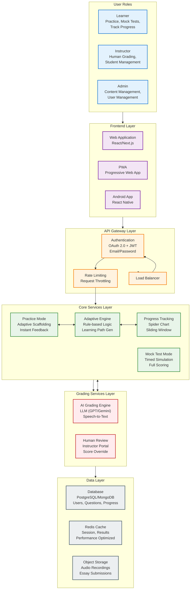
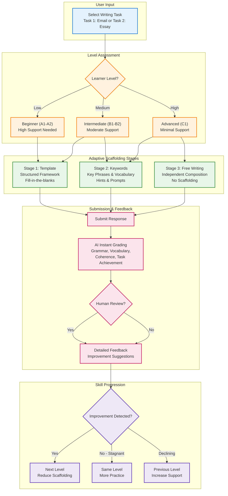
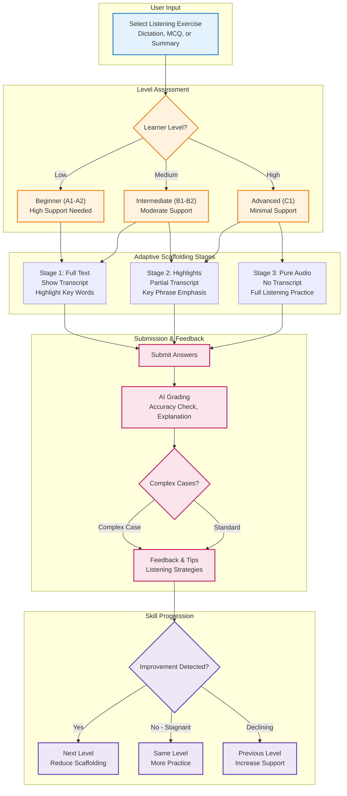
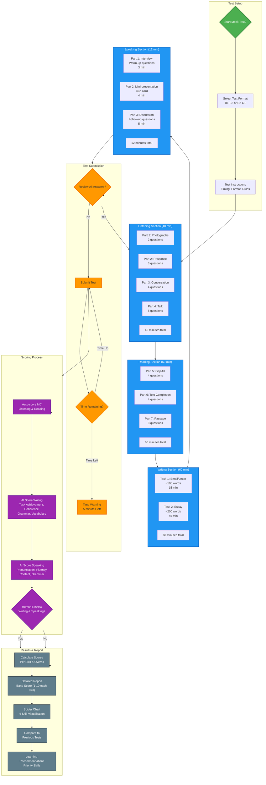
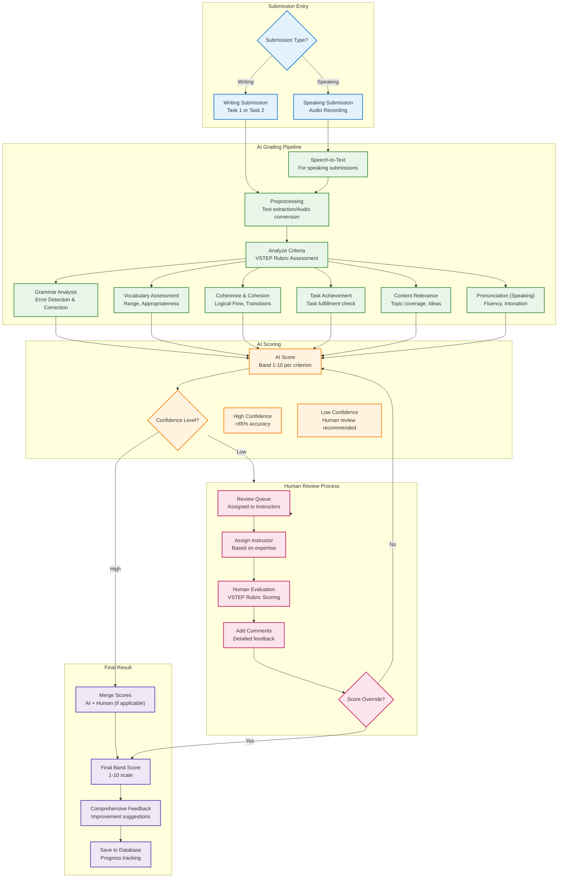
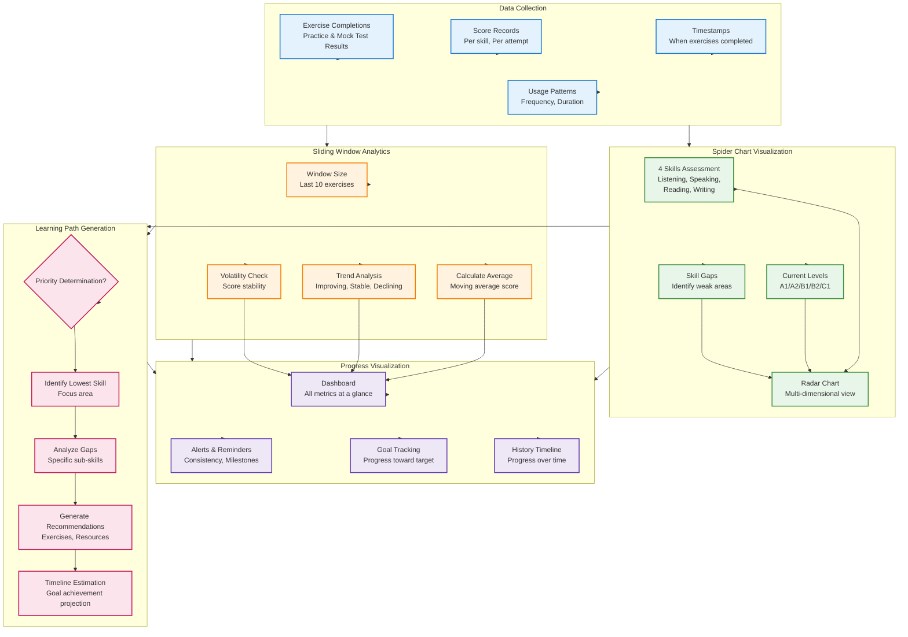
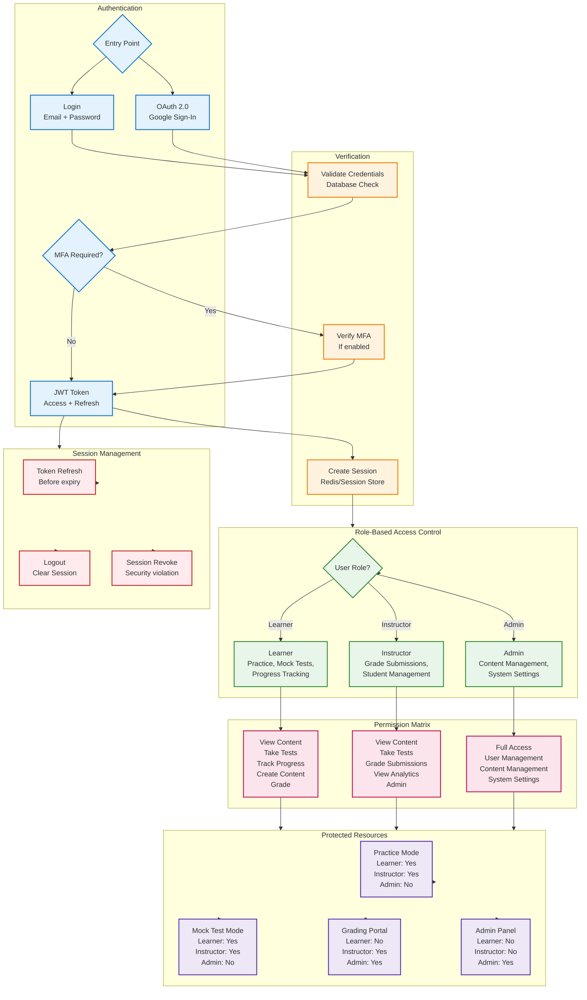

# VSTEP Adaptive Learning System - Flow Diagrams

This document contains comprehensive Mermaid diagrams illustrating the core flows and architecture of the VSTEP Adaptive Learning System.

---

## 1. System Architecture Overview

This diagram shows the dual-module architecture (Practice Mode + Mock Test Mode) with AI grading, Human grading, and user roles.

---

## 2. User Journey Flow

High-level flow from registration → placement test → practice/mock test → progress tracking.

```mermaid
flowchart LR
    subgraph Registration["Account Creation"]
        start(("Start"))
        register["Register<br/>Email/Password or Google OAuth"]
        login["Login<br/>JWT Token Generation"]
    end

    subgraph Onboarding["Onboarding Process"]
        profile["Profile Setup<br/>Name, Target Level, Timeline"]
        placement["Placement Test<br/>4-Skills Assessment"]
        initialize["Initialize Spider Chart<br/>Set Learning Goals"]
    end

    subgraph Learning["Learning Journey"]
        choice{"Choose Mode"}
        practice["Practice Mode<br/>Skill-focused, Adaptive"]
        mocktest["Mock Test Mode<br/>Full Simulation"]
        feedback["View Results<br/>AI + Human Feedback"]
    end

    subgraph Progress["Progress Tracking"]
        track["Track Progress<br/>Spider Chart, Sliding Window"]
        path["Learning Path<br/>Rule-based Recommendations"]
        adjust{"Adjust Learning?"}
    end

    subgraph Completion["Goal Completion"]
        achieve["Goal Achieved<br/>B1/B2/C1 Target"]
        continue["Continue Learning<br/>Set New Goals"]
    end

    %% Flow connections
    start --> register
    register --> login
    login --> profile
    profile --> placement
    placement --> initialize
    initialize --> choice
    choice --> practice
    choice --> mocktest
    practice --> feedback
    mocktest --> feedback
    feedback --> track
    track --> path
    path --> adjust
    adjust -->|Yes| choice
    adjust -->|Goal Met| achieve
    achieve --> continue
    continue --> choice

    %% Styling
    classDef start fill:#4caf50,stroke:#2e7d32,stroke-width:3px,color:#fff
    classDef process fill:#2196f3,stroke:#1565c0,stroke-width:2px
    classDef decision fill:#ff9800,stroke:#ef6c00,stroke-width:2px
    classDef outcome fill:#9c27b0,stroke:#6a1b9a,stroke-width:2px

    class start,achieve start
    class register,login,profile,placement,initialize,practice,mocktest,feedback,track,path,continue process
    class choice,adjust decision
    class achieve outcome
```

---

## 3. Practice Mode Flow with Adaptive Scaffolding

Shows how adaptive scaffolding works for Writing and Listening skills.

### 3A. Writing Adaptive Scaffolding Flow

### 3B. Listening Adaptive Scaffolding Flow

---

## 4. Mock Test Flow

Complete mock test flow with timer, 4 skills assessment, scoring, and detailed results.

---

## 5. Hybrid Grading Flow

AI grading (instant) → Human grading (optional override) for Writing and Speaking.

---

## 6. Progress Tracking & Learning Path Flow

Spider Chart, Sliding Window, and rule-based learning path generation.

---

## 7. User Authentication & Role-based Access

Authentication flow with roles (Learner, Instructor, Admin).

---

## Diagram Summary

| Diagram | Purpose | Key Components |
|---------|---------|----------------|
| **System Architecture** | High-level system design | Frontend, API Gateway, Core Services, Grading, Data Layer |
| **User Journey** | Learner lifecycle | Registration → Placement → Practice/Mock Test → Progress |
| **Practice Mode - Writing** | Writing skill scaffolding | Template → Keywords → Free Writing |
| **Practice Mode - Listening** | Listening skill scaffolding | Full Text → Highlights → Pure Audio |
| **Mock Test Flow** | Full exam simulation | 4 Sections, Timer, Scoring, Results Report |
| **Hybrid Grading** | AI + Human evaluation | AI Instant → Human Override → Final Score |
| **Progress Tracking** | Analytics & visualization | Spider Chart, Sliding Window, Learning Path |
| **Authentication & RBAC** | Security & access control | JWT, OAuth, Role-based permissions |

---

*Document generated for VSTEP Adaptive Learning System (SP26SE145)*
