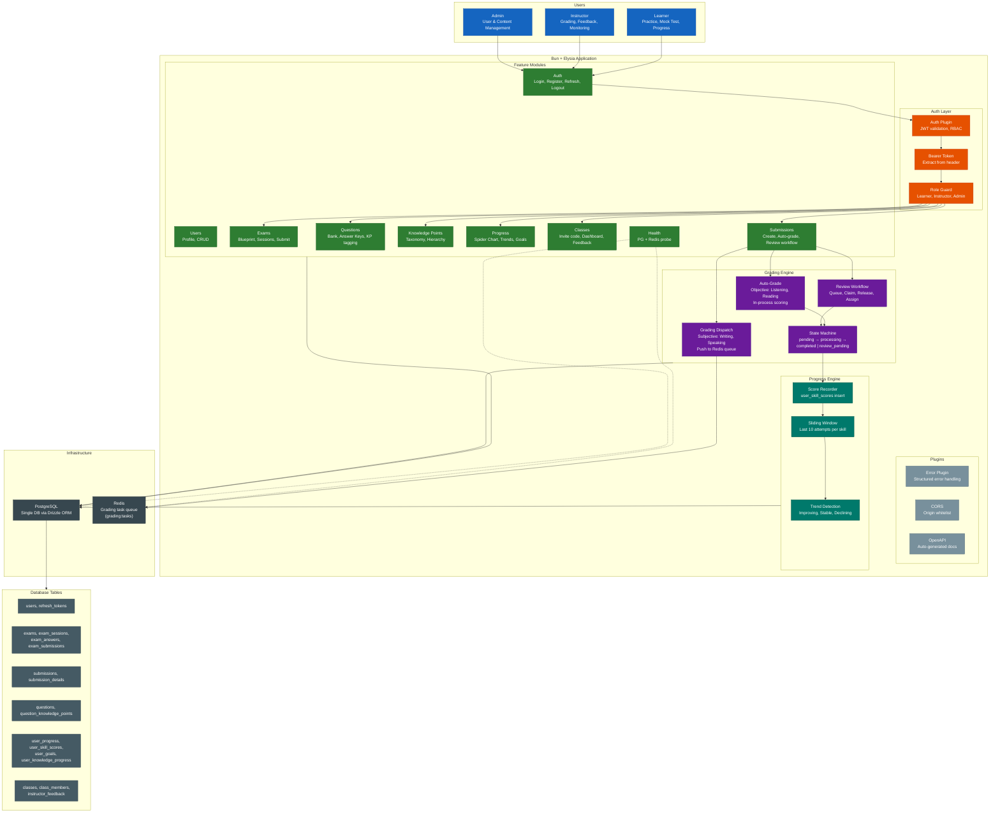
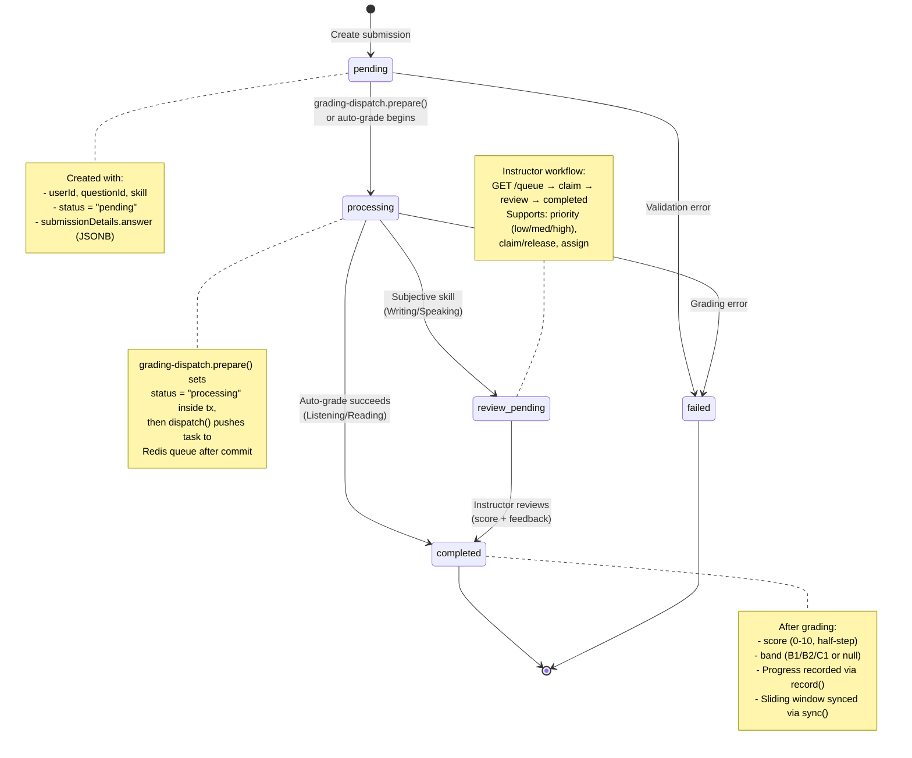
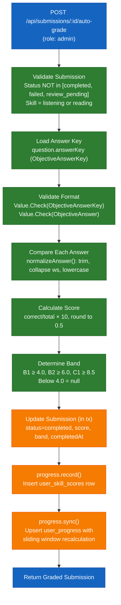
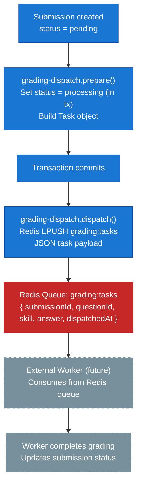
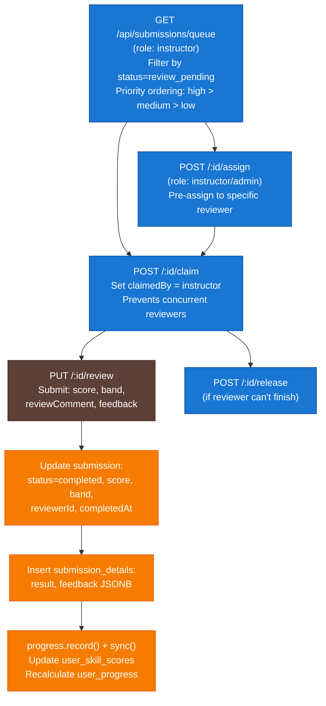
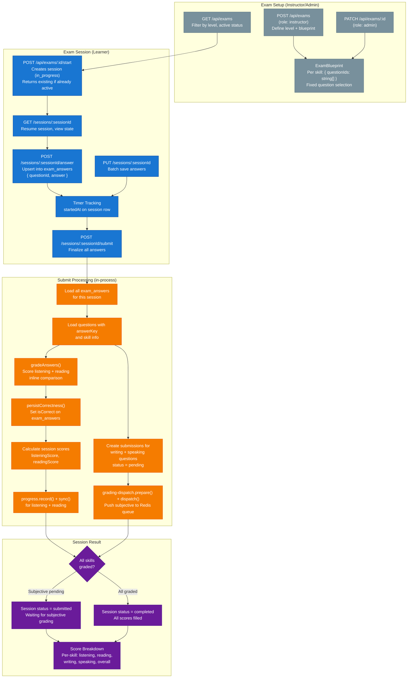
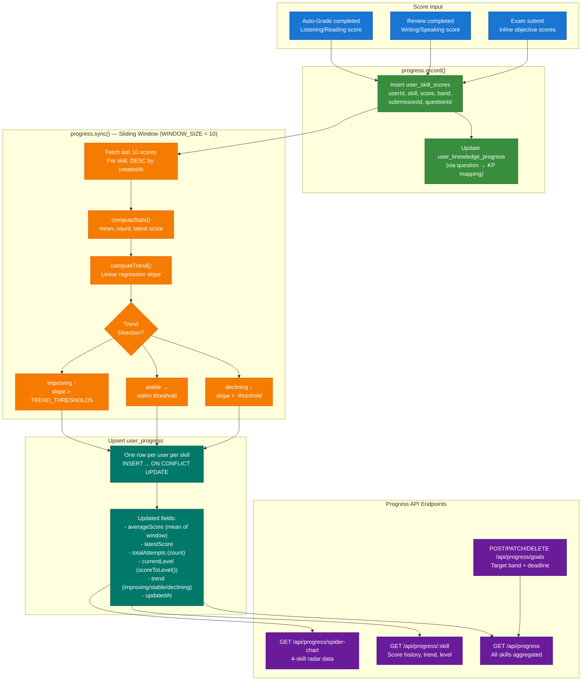
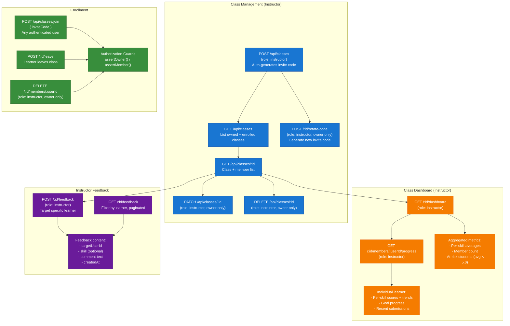
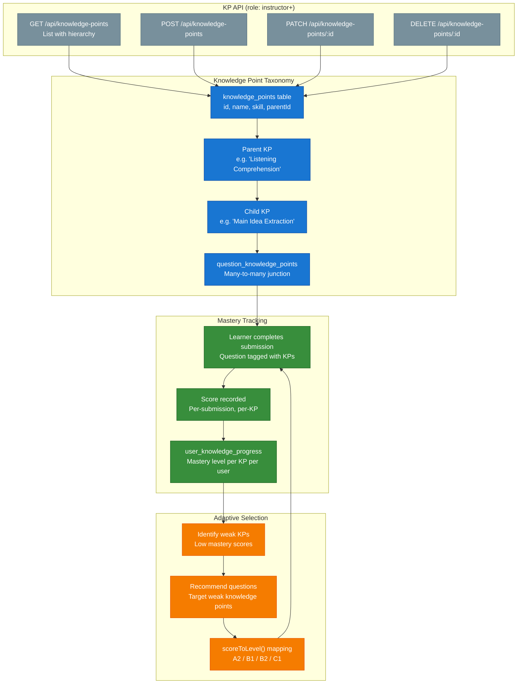

# VSTEP Adaptive Learning System - Flow Diagrams

## 1. System Architecture


```mermaid
flowchart TB
    subgraph Users ["Users"]
        L["Learner<br/>Practice, Mock Test, Progress"]
        I["Instructor<br/>Grading, Feedback, Monitoring"]
        A["Admin<br/>User & Content Management"]
    end

    subgraph BunApp ["Bun + Elysia Application"]
        subgraph Plugins ["Plugins"]
            ErrorPlugin["Error Plugin<br/>Structured error handling"]
            CORS["CORS<br/>Origin whitelist"]
            OpenAPI["OpenAPI<br/>Auto-generated docs"]
        end

        subgraph AuthLayer ["Auth Layer"]
            AuthPlugin["Auth Plugin<br/>JWT validation, RBAC"]
            Bearer["Bearer Token<br/>Extract from header"]
            RoleCheck["Role Guard<br/>Learner, Instructor, Admin"]
        end

        subgraph Modules ["Feature Modules"]
            Auth["Auth<br/>Login, Register, Refresh, Logout"]
            UsersMod["Users<br/>Profile, CRUD"]
            ExamsMod["Exams<br/>Blueprint, Sessions, Submit"]
            SubsMod["Submissions<br/>Create, Auto-grade, Review workflow"]
            QuestionsMod["Questions<br/>Bank, Answer Keys, KP tagging"]
            KPMod["Knowledge Points<br/>Taxonomy, Hierarchy"]
            ProgressMod["Progress<br/>Spider Chart, Trends, Goals"]
            ClassesMod["Classes<br/>Invite code, Dashboard, Feedback"]
            HealthMod["Health<br/>PG + Redis probe"]
        end

        subgraph Grading ["Grading Engine"]
            AutoGrade["Auto-Grade<br/>Objective: Listening, Reading<br/>In-process scoring"]
            GradingDispatch["Grading Dispatch<br/>Subjective: Writing, Speaking<br/>Push to Redis queue"]
            ReviewWorkflow["Review Workflow<br/>Queue, Claim, Release, Assign"]
            StateMachine["State Machine<br/>pending → processing →<br/>completed | review_pending"]
        end

        subgraph ProgressEngine ["Progress Engine"]
            SlidingWindow["Sliding Window<br/>Last 10 attempts per skill"]
            TrendDetect["Trend Detection<br/>Improving, Stable, Declining"]
            ScoreRecord["Score Recorder<br/>user_skill_scores insert"]
        end
    end

    subgraph Infrastructure ["Infrastructure"]
        PG["PostgreSQL<br/>Single DB via Drizzle ORM"]
        Redis["Redis<br/>Grading task queue<br/>(grading:tasks)"]
    end

    subgraph Tables ["Database Tables"]
        UsersT["users, refresh_tokens"]
        ExamsT["exams, exam_sessions,<br/>exam_answers, exam_submissions"]
        SubsT["submissions, submission_details"]
        QuestionsT["questions, question_knowledge_points"]
        ProgressT["user_progress, user_skill_scores,<br/>user_goals, user_knowledge_progress"]
        ClassesT["classes, class_members,<br/>instructor_feedback"]
    end

    %% User flows
    L --> Auth
    I --> Auth
    A --> Auth
    Auth --> AuthPlugin
    AuthPlugin --> Bearer
    Bearer --> RoleCheck

    RoleCheck --> ExamsMod
    RoleCheck --> SubsMod
    RoleCheck --> ProgressMod
    RoleCheck --> ClassesMod
    RoleCheck --> QuestionsMod
    RoleCheck --> KPMod

    %% Grading flow
    SubsMod --> AutoGrade
    SubsMod --> GradingDispatch
    SubsMod --> ReviewWorkflow
    AutoGrade --> StateMachine
    GradingDispatch --> Redis
    ReviewWorkflow --> StateMachine

    %% Progress flow
    StateMachine --> ScoreRecord
    ScoreRecord --> SlidingWindow
    SlidingWindow --> TrendDetect

    %% Data access
    Modules --> PG
    Grading --> PG
    ProgressEngine --> PG
    PG --> Tables
    HealthMod -.-> PG
    HealthMod -.-> Redis

    %% Styling
    classDef users fill:#1565c0,stroke:#0d47a1,color:#fff
    classDef plugins fill:#78909c,stroke:#546e7a,color:#fff
    classDef auth fill:#e65100,stroke:#bf360c,color:#fff
    classDef modules fill:#2e7d32,stroke:#1b5e20,color:#fff
    classDef grading fill:#6a1b9a,stroke:#4a148c,color:#fff
    classDef progress fill:#00796b,stroke:#004d40,color:#fff
    classDef infra fill:#37474f,stroke:#263238,color:#fff
    classDef tables fill:#455a64,stroke:#37474f,color:#fff

    class L,I,A users
    class ErrorPlugin,CORS,OpenAPI plugins
    class AuthPlugin,Bearer,RoleCheck auth
    class Auth,UsersMod,ExamsMod,SubsMod,QuestionsMod,KPMod,ProgressMod,ClassesMod,HealthMod modules
    class AutoGrade,GradingDispatch,ReviewWorkflow,StateMachine grading
    class SlidingWindow,TrendDetect,ScoreRecord progress
    class PG,Redis infra
    class UsersT,ExamsT,SubsT,QuestionsT,ProgressT,ClassesT tables
```

> **Architecture Notes:**
> - **Monolithic**: Single Bun + Elysia application — all modules in one process
> - **PostgreSQL**: Single database, all tables, managed via Drizzle ORM
> - **Redis**: Used for grading task dispatch queue (`grading:tasks` via `LPUSH`), health-checked via TCP probe
> - **JWT Auth**: Access token (short-lived) + Refresh token (long-lived, rotated) via `jose`
> - **Password hashing**: Argon2id via `Bun.password.hash()`
> - **State machine**: Reusable FSM (`createStateMachine`) for submission lifecycle
> - **Elysia plugins**: CORS, OpenAPI (auto-docs), error handling, auth guard with role levels

## 2. User Journey Flow


```mermaid
flowchart LR
    Start(["Start"])
    Reg["Registration<br/>Email + Password<br/>(role = learner)"]
    Login["Login<br/>JWT Access + Refresh"]
    Select["Select Mode<br/>Practice or Exam"]

    subgraph PracticeFlow ["Practice Mode"]
        PickQ["Pick Question<br/>By skill, level, KP"]
        Submit["Create Submission<br/>POST /api/submissions"]
        Processing{"Skill<br/>Type?"}
        AutoResult["Auto-Graded<br/>pending → processing → completed"]
        DispatchQ["Dispatched to Redis<br/>pending → processing"]
        ReviewQ["Review Queue<br/>processing → review_pending"]
        InstructorGrade["Instructor Review<br/>Claim → Grade → completed"]
    end

    subgraph ExamFlow ["Exam Mode"]
        StartExam["Start Session<br/>POST /api/exams/:id/start"]
        Answer["Save Answers<br/>POST /sessions/:id/answer"]
        SubmitExam["Submit Session<br/>Inline-grade objective<br/>Dispatch subjective to Redis"]
        ExamResult["Exam Result<br/>Per-skill scores on session"]
    end

    Progress["Progress Dashboard<br/>Spider chart, trends, goals"]
    ClassJoin["Join Class<br/>POST /api/classes/join<br/>(invite code)"]
    GoalCheck{"Goal<br/>Achieved?"}
    End(["End"])

    Start --> Reg
    Reg --> Login
    Login --> Select
    Select --> PickQ
    Select --> StartExam

    PickQ --> Submit
    Submit --> Processing
    Processing -->|"Listening / Reading"| AutoResult
    Processing -->|"Writing / Speaking"| DispatchQ
    DispatchQ --> ReviewQ
    ReviewQ --> InstructorGrade
    AutoResult --> Progress
    InstructorGrade --> Progress

    StartExam --> Answer
    Answer --> SubmitExam
    SubmitExam --> ExamResult
    ExamResult --> Progress

    Progress --> GoalCheck
    Progress --> ClassJoin
    GoalCheck -->|No| Select
    GoalCheck -->|Yes| End

    classDef start fill:#1565c0,stroke:#0d47a1,color:#fff
    classDef process fill:#1976d2,stroke:#0d47a1,color:#fff
    classDef decision fill:#f57c00,stroke:#e65100,color:#fff
    classDef practice fill:#388e3c,stroke:#1b5e20,color:#fff
    classDef exam fill:#6a1b9a,stroke:#4a148c,color:#fff

    class Start,End start
    class Reg,Login,Select,Progress,ClassJoin process
    class Processing,GoalCheck decision
    class PickQ,Submit,AutoResult,DispatchQ,ReviewQ,InstructorGrade practice
    class StartExam,Answer,SubmitExam,ExamResult exam
```

## 3. Submission State Machine


```mermaid
stateDiagram-v2
    [*] --> pending: Create submission

    pending --> processing: grading-dispatch.prepare()<br/>or auto-grade begins
    pending --> failed: Validation error

    processing --> completed: Auto-grade succeeds<br/>(Listening/Reading)
    processing --> review_pending: Subjective skill<br/>(Writing/Speaking)
    processing --> failed: Grading error

    review_pending --> completed: Instructor reviews<br/>(score + feedback)

    completed --> [*]
    failed --> [*]

    note right of pending
        Created with:
        - userId, questionId, skill
        - status = "pending"
        - submissionDetails.answer (JSONB)
    end note

    note right of processing
        grading-dispatch.prepare() sets
        status = "processing" inside tx,
        then dispatch() pushes task to
        Redis queue after commit
    end note

    note left of review_pending
        Instructor workflow:
        GET /queue → claim → review → completed
        Supports: priority (low/med/high),
        claim/release, assign
    end note

    note right of completed
        After grading:
        - score (0-10, half-step)
        - band (B1/B2/C1 or null)
        - Progress recorded via record()
        - Sliding window synced via sync()
    end note
```

> **State transitions (from `shared.ts`):**
> ```
> pending     → [processing, failed]
> processing  → [completed, review_pending, failed]
> review_pending → [completed]
> completed   → [] (terminal)
> failed      → [] (terminal)
> ```
>
> **GRADABLE_STATUSES:** `pending`, `review_pending`, `processing`
> **MUTABLE_STATUSES:** `pending` (only pending submissions can be updated by learner)

### 3A. Auto-Grade Flow (Listening & Reading)


```mermaid
flowchart TB
    Start["POST /api/submissions/:id/auto-grade<br/>(role: admin)"]
    Validate["Validate Submission<br/>Status NOT in [completed, failed, review_pending]<br/>Skill = listening or reading"]
    LoadKey["Load Answer Key<br/>question.answerKey (ObjectiveAnswerKey)"]
    CheckFormat["Validate Format<br/>Value.Check(ObjectiveAnswerKey)<br/>Value.Check(ObjectiveAnswer)"]
    Compare["Compare Each Answer<br/>normalizeAnswer(): trim, collapse ws, lowercase"]
    Calculate["Calculate Score<br/>correct/total × 10, round to 0.5"]
    Band["Determine Band<br/>B1 ≥ 4.0, B2 ≥ 6.0, C1 ≥ 8.5<br/>Below 4.0 = null"]
    Update["Update Submission (in tx)<br/>status=completed, score, band, completedAt"]
    RecordProgress["progress.record()<br/>Insert user_skill_scores row"]
    SyncWindow["progress.sync()<br/>Upsert user_progress with<br/>sliding window recalculation"]
    Done["Return Graded Submission"]

    Start --> Validate
    Validate --> LoadKey
    LoadKey --> CheckFormat
    CheckFormat --> Compare
    Compare --> Calculate
    Calculate --> Band
    Band --> Update
    Update --> RecordProgress
    RecordProgress --> SyncWindow
    SyncWindow --> Done

    classDef endpoint fill:#1565c0,stroke:#0d47a1,color:#fff
    classDef logic fill:#2e7d32,stroke:#1b5e20,color:#fff
    classDef data fill:#f57c00,stroke:#e65100,color:#fff

    class Start,Done endpoint
    class Validate,LoadKey,CheckFormat,Compare,Calculate,Band logic
    class Update,RecordProgress,SyncWindow data
```

### 3B. Grading Dispatch Flow (Writing & Speaking)


```mermaid
flowchart TB
    Create["Submission created<br/>status = pending"]
    Prepare["grading-dispatch.prepare()<br/>Set status = processing (in tx)<br/>Build Task object"]
    Commit["Transaction commits"]
    Dispatch["grading-dispatch.dispatch()<br/>Redis LPUSH grading:tasks<br/>JSON task payload"]
    Queue["Redis Queue: grading:tasks<br/>{ submissionId, questionId, skill, answer, dispatchedAt }"]
    Worker["External Worker (future)<br/>Consumes from Redis queue"]
    Callback["Worker completes grading<br/>Updates submission status"]

    Create --> Prepare
    Prepare --> Commit
    Commit --> Dispatch
    Dispatch --> Queue
    Queue --> Worker
    Worker --> Callback

    classDef app fill:#1976d2,stroke:#0d47a1,color:#fff
    classDef redis fill:#c62828,stroke:#b71c1c,color:#fff
    classDef future fill:#78909c,stroke:#546e7a,color:#fff,stroke-dasharray: 5 5

    class Create,Prepare,Commit,Dispatch app
    class Queue redis
    class Worker,Callback future
```

### 3C. Review Workflow (Instructor)


```mermaid
flowchart TB
    Queue["GET /api/submissions/queue<br/>(role: instructor)<br/>Filter by status=review_pending<br/>Priority ordering: high > medium > low"]
    Claim["POST /:id/claim<br/>Set claimedBy = instructor<br/>Prevents concurrent reviewers"]
    Review["PUT /:id/review<br/>Submit: score, band,<br/>reviewComment, feedback"]
    Record["Update submission:<br/>status=completed, score, band,<br/>reviewerId, completedAt"]
    InsertReview["Insert submission_details:<br/>result, feedback JSONB"]
    Progress["progress.record() + sync()<br/>Update user_skill_scores<br/>Recalculate user_progress"]
    Release["POST /:id/release<br/>(if reviewer can't finish)"]
    Assign["POST /:id/assign<br/>(role: instructor/admin)<br/>Pre-assign to specific reviewer"]

    Queue --> Claim
    Claim --> Review
    Review --> Record
    Record --> InsertReview
    InsertReview --> Progress

    Claim --> Release
    Queue --> Assign
    Assign --> Claim

    classDef route fill:#1976d2,stroke:#0d47a1,color:#fff
    classDef action fill:#5d4037,stroke:#3e2723,color:#fff
    classDef data fill:#f57c00,stroke:#e65100,color:#fff

    class Queue,Claim,Release,Assign route
    class Review action
    class Record,InsertReview,Progress data
```

## 4. Exam Session Flow


```mermaid
flowchart TB
    subgraph Setup ["Exam Setup (Instructor/Admin)"]
        CreateExam["POST /api/exams<br/>(role: instructor)<br/>Define level + blueprint"]
        Blueprint["ExamBlueprint<br/>Per skill: { questionIds: string[] }<br/>Fixed question selection"]
        ListExams["GET /api/exams<br/>Filter by level, active status"]
        UpdateExam["PATCH /api/exams/:id<br/>(role: admin)"]
    end

    subgraph Session ["Exam Session (Learner)"]
        Start["POST /api/exams/:id/start<br/>Creates session (in_progress)<br/>Returns existing if already active"]
        FindSession["GET /sessions/:sessionId<br/>Resume session, view state"]
        SaveAnswer["POST /sessions/:sessionId/answer<br/>Upsert into exam_answers<br/>{ questionId, answer }"]
        UpdateSession["PUT /sessions/:sessionId<br/>Batch save answers"]
        Timer["Timer Tracking<br/>startedAt on session row"]
        Submit["POST /sessions/:sessionId/submit<br/>Finalize all answers"]
    end

    subgraph SubmitLogic ["Submit Processing (in-process)"]
        LoadAnswers["Load all exam_answers<br/>for this session"]
        LoadQuestions["Load questions with answerKey<br/>and skill info"]
        GradeObjective["gradeAnswers()<br/>Score listening + reading<br/>inline comparison"]
        PersistCorrectness["persistCorrectness()<br/>Set isCorrect on exam_answers"]
        CreateSubjective["Create submissions for<br/>writing + speaking questions<br/>status = pending"]
        DispatchRedis["grading-dispatch.prepare() + dispatch()<br/>Push subjective to Redis queue"]
        CalcScores["Calculate session scores<br/>listeningScore, readingScore"]
        RecordObjective["progress.record() + sync()<br/>for listening + reading"]
    end

    subgraph Result ["Session Result"]
        SessionStatus{"All skills<br/>graded?"}
        Submitted["Session status = submitted<br/>Waiting for subjective grading"]
        Completed["Session status = completed<br/>All scores filled"]
        Breakdown["Score Breakdown<br/>Per-skill: listening, reading,<br/>writing, speaking, overall"]
    end

    CreateExam --> Blueprint
    ListExams --> Start
    UpdateExam --> Blueprint
    Start --> FindSession
    FindSession --> SaveAnswer
    SaveAnswer --> Timer
    UpdateSession --> Timer
    Timer --> Submit

    Submit --> LoadAnswers
    LoadAnswers --> LoadQuestions
    LoadQuestions --> GradeObjective
    GradeObjective --> PersistCorrectness
    PersistCorrectness --> CalcScores
    CalcScores --> RecordObjective
    LoadQuestions --> CreateSubjective
    CreateSubjective --> DispatchRedis

    RecordObjective --> SessionStatus
    DispatchRedis --> SessionStatus
    SessionStatus -->|"Subjective pending"| Submitted
    SessionStatus -->|"All graded"| Completed
    Submitted --> Breakdown
    Completed --> Breakdown

    classDef setup fill:#78909c,stroke:#546e7a,color:#fff
    classDef session fill:#1976d2,stroke:#0d47a1,color:#fff
    classDef submit fill:#f57c00,stroke:#e65100,color:#fff
    classDef result fill:#6a1b9a,stroke:#4a148c,color:#fff

    class CreateExam,Blueprint,ListExams,UpdateExam setup
    class Start,FindSession,SaveAnswer,UpdateSession,Timer,Submit session
    class LoadAnswers,LoadQuestions,GradeObjective,PersistCorrectness,CreateSubjective,DispatchRedis,CalcScores,RecordObjective submit
    class SessionStatus,Submitted,Completed,Breakdown result
```

> **Exam Session States:** `in_progress` → `submitted` → `completed` | `abandoned`
>
> **Session columns:** listeningScore, readingScore, writingScore, speakingScore, overallScore, overallBand
>
> **Submit process:**
> 1. Grade objective (listening/reading) inline via `gradeAnswers()` — compare answers, calculate score
> 2. Set `isCorrect` on each `exam_answer` via `persistCorrectness()`
> 3. Create `submissions` + `submission_details` for subjective questions (writing/speaking)
> 4. Link via `exam_submissions` junction table
> 5. Dispatch subjective tasks to Redis via `grading-dispatch`
> 6. Record objective scores in progress
> 7. Set session status: `submitted` (if subjective pending) or `completed` (if all done)

## 5. Progress Tracking & Sliding Window


```mermaid
flowchart TB
    subgraph Input ["Score Input"]
        AutoScore["Auto-Grade completed<br/>Listening/Reading score"]
        ManualScore["Review completed<br/>Writing/Speaking score"]
        ExamScore["Exam submit<br/>Inline objective scores"]
    end

    subgraph Record ["progress.record()"]
        InsertScore["Insert user_skill_scores<br/>userId, skill, score, band,<br/>submissionId, questionId"]
        UpdateKP["Update user_knowledge_progress<br/>(via question → KP mapping)"]
    end

    subgraph SlidingWindow ["progress.sync() — Sliding Window (WINDOW_SIZE = 10)"]
        Fetch["Fetch last 10 scores<br/>Per skill, DESC by createdAt"]
        ComputeStats["computeStats()<br/>mean, count, latest score"]
        ComputeTrend["computeTrend()<br/>Linear regression slope"]
        Direction{"Trend<br/>Direction?"}
        Improving["improving ↑<br/>slope > TREND_THRESHOLDS"]
        Stable["stable →<br/>within threshold"]
        Declining["declining ↓<br/>slope < -threshold"]
    end

    subgraph Sync ["Upsert user_progress"]
        Upsert["One row per user per skill<br/>INSERT ... ON CONFLICT UPDATE"]
        Fields["Updated fields:<br/>- averageScore (mean of window)<br/>- latestScore<br/>- totalAttempts (count)<br/>- currentLevel (scoreToLevel())<br/>- trend (improving/stable/declining)<br/>- updatedAt"]
    end

    subgraph API ["Progress API Endpoints"]
        SpiderChart["GET /api/progress/spider-chart<br/>4-skill radar data"]
        SkillDetail["GET /api/progress/:skill<br/>Score history, trend, level"]
        Overview["GET /api/progress<br/>All skills aggregated"]
        Goals["POST/PATCH/DELETE /api/progress/goals<br/>Target band + deadline"]
    end

    AutoScore --> InsertScore
    ManualScore --> InsertScore
    ExamScore --> InsertScore
    InsertScore --> UpdateKP
    InsertScore --> Fetch
    Fetch --> ComputeStats
    ComputeStats --> ComputeTrend
    ComputeTrend --> Direction
    Direction --> Improving
    Direction --> Stable
    Direction --> Declining
    Improving --> Upsert
    Stable --> Upsert
    Declining --> Upsert
    Upsert --> Fields

    Fields --> SpiderChart
    Fields --> SkillDetail
    Fields --> Overview
    Goals --> Overview

    classDef input fill:#1976d2,stroke:#0d47a1,color:#fff
    classDef record fill:#388e3c,stroke:#1b5e20,color:#fff
    classDef window fill:#f57c00,stroke:#e65100,color:#fff
    classDef sync fill:#00796b,stroke:#004d40,color:#fff
    classDef api fill:#6a1b9a,stroke:#4a148c,color:#fff

    class AutoScore,ManualScore,ExamScore input
    class InsertScore,UpdateKP record
    class Fetch,ComputeStats,ComputeTrend,Direction,Improving,Stable,Declining window
    class Upsert,Fields sync
    class SpiderChart,SkillDetail,Overview,Goals api
```

> **Scoring rules:**
> - Score range: 0–10 (half-step: `precision: 3, scale: 1`)
> - Band thresholds: B1 ≥ 4.0, B2 ≥ 6.0, C1 ≥ 8.5 (below 4.0 = null)
> - `scoreToLevel()`: C1 ≥ 8.5, B2 ≥ 6.0, B1 ≥ 4.0, else A2
> - `calculateScore(correct, total)`: `Math.round(ratio × 10 × 2) / 2` — linear, half-step rounding
> - Trend computed via linear regression slope on sliding window scores
>
> **Instructor progress view:** `progress/instructor.ts` → `forUsers()` aggregates per-user per-skill data with at-risk detection (`avg < 5.0`), used by class dashboard

## 6. Authentication & Token Lifecycle


```mermaid
flowchart TB
    subgraph Login ["Login Flow"]
        Creds["POST /api/auth/login<br/>email + password"]
        Verify["Bun.password.verify()<br/>Against stored argon2id hash"]
        GenAccess["SignJWT (jose)<br/>Claims: sub, role, iat<br/>Expiry: env.JWT_EXPIRES_IN"]
        GenRefresh["crypto.randomUUID()<br/>Store SHA-256 hash in DB"]
        DeviceInfo["Record User-Agent<br/>On refresh_tokens row"]
        MaxCheck["Count active tokens<br/>for this user"]
        Prune["Prune oldest if ><br/>MAX_REFRESH_TOKENS_PER_USER (3)"]
    end

    subgraph Register ["Registration"]
        RegInput["POST /api/auth/register<br/>email, password, fullName"]
        NormEmail["normalizeEmail()<br/>Lowercase, trim"]
        DupCheck["Email unique constraint<br/>409 if duplicate"]
        HashPwd["Bun.password.hash(pw, 'argon2id')"]
        CreateUser["Insert user<br/>role = learner (default)"]
    end

    subgraph Refresh ["Token Refresh (Rotation)"]
        RefreshReq["POST /api/auth/refresh<br/>{ refreshToken }"]
        HashLookup["hashToken(refreshToken)<br/>SHA-256 → find by tokenHash"]
        CheckValid["Check: not revoked,<br/>not expired, not replaced"]
        FamilyDetect{"Token already<br/>replaced?"}
        RevokeFamily["REPLAY DETECTED<br/>Revoke ALL tokens in family<br/>(security breach response)"]
        RevokeOld["Revoke old token<br/>Set revokedAt + replacedByJti"]
        IssueNew["Issue new access + refresh pair<br/>New JTI links to old"]
    end

    subgraph Logout ["Logout"]
        LogoutReq["POST /api/auth/logout<br/>(auth required)<br/>{ refreshToken }"]
        Revoke["Set revokedAt on token"]
    end

    subgraph Me ["Current User"]
        MeReq["GET /api/auth/me<br/>(auth required)"]
        MeResult["Return full user profile"]
    end

    subgraph RBAC ["Role-Based Access"]
        Roles["Roles: learner (0), instructor (1), admin (2)"]
        LevelCheck["ROLE_LEVEL comparison<br/>admin > instructor > learner"]
        Resources["Protected resources:<br/>- Exam create → instructor<br/>- Manual grade → instructor<br/>- Review queue → instructor<br/>- Exam update → admin<br/>- Auto-grade trigger → admin<br/>- User management → admin"]
    end

    Creds --> Verify
    Verify --> GenAccess
    Verify --> GenRefresh
    GenRefresh --> DeviceInfo
    DeviceInfo --> MaxCheck
    MaxCheck --> Prune

    RegInput --> NormEmail
    NormEmail --> DupCheck
    DupCheck --> HashPwd
    HashPwd --> CreateUser

    RefreshReq --> HashLookup
    HashLookup --> CheckValid
    CheckValid --> FamilyDetect
    FamilyDetect -->|"replacedByJti exists"| RevokeFamily
    FamilyDetect -->|"Valid, not replaced"| RevokeOld
    RevokeOld --> IssueNew

    LogoutReq --> Revoke
    MeReq --> MeResult

    Roles --> LevelCheck
    LevelCheck --> Resources

    classDef login fill:#1565c0,stroke:#0d47a1,color:#fff
    classDef register fill:#388e3c,stroke:#1b5e20,color:#fff
    classDef refresh fill:#f57c00,stroke:#e65100,color:#fff
    classDef logout fill:#c62828,stroke:#b71c1c,color:#fff
    classDef me fill:#00796b,stroke:#004d40,color:#fff
    classDef rbac fill:#6a1b9a,stroke:#4a148c,color:#fff

    class Creds,Verify,GenAccess,GenRefresh,DeviceInfo,MaxCheck,Prune login
    class RegInput,NormEmail,DupCheck,HashPwd,CreateUser register
    class RefreshReq,HashLookup,CheckValid,FamilyDetect,RevokeFamily,RevokeOld,IssueNew refresh
    class LogoutReq,Revoke logout
    class MeReq,MeResult me
    class Roles,LevelCheck,Resources rbac
```

> **Token security details:**
> - Refresh tokens stored as SHA-256 hashes via `hashToken()` — never plaintext
> - Token family rotation: if a refresh token with `replacedByJti` is reused → revoke ALL tokens for that user (replay detection)
> - `MAX_REFRESH_TOKENS_PER_USER = 3` — limits concurrent sessions, prunes oldest
> - Access token: signed JWT via `jose` (`SignJWT`), claims: `{ sub, role, iat }`
> - No OAuth/SSO — email + password only

## 7. Classes & Instructor Feedback Flow


```mermaid
flowchart TB
    subgraph ClassMgmt ["Class Management (Instructor)"]
        Create["POST /api/classes<br/>(role: instructor)<br/>Auto-generates invite code"]
        List["GET /api/classes<br/>List owned + enrolled classes"]
        Detail["GET /api/classes/:id<br/>Class + member list"]
        Update["PATCH /api/classes/:id<br/>(role: instructor, owner only)"]
        Delete["DELETE /api/classes/:id<br/>(role: instructor, owner only)"]
        RotateCode["POST /:id/rotate-code<br/>(role: instructor, owner only)<br/>Generate new invite code"]
    end

    subgraph Members ["Enrollment"]
        Join["POST /api/classes/join<br/>{ inviteCode }<br/>Any authenticated user"]
        Leave["POST /:id/leave<br/>Learner leaves class"]
        RemoveMember["DELETE /:id/members/:userId<br/>(role: instructor, owner only)"]
        Guards["Authorization Guards<br/>assertOwner() / assertMember()"]
    end

    subgraph Dashboard ["Class Dashboard (Instructor)"]
        DashboardEndpoint["GET /:id/dashboard<br/>(role: instructor)"]
        MemberProgressEndpoint["GET /:id/members/:userId/progress<br/>(role: instructor)"]
        ClassStats["Aggregated metrics:<br/>- Per-skill averages<br/>- Member count<br/>- At-risk students (avg < 5.0)"]
        IndividualProgress["Individual learner:<br/>- Per-skill scores + trends<br/>- Goal progress<br/>- Recent submissions"]
    end

    subgraph Feedback ["Instructor Feedback"]
        GiveFeedback["POST /:id/feedback<br/>(role: instructor)<br/>Target specific learner"]
        ListFeedback["GET /:id/feedback<br/>Filter by learner, paginated"]
        FeedbackData["Feedback content:<br/>- targetUserId<br/>- skill (optional)<br/>- comment text<br/>- createdAt"]
    end

    Create --> List
    List --> Detail
    Detail --> Update
    Detail --> Delete
    Create --> RotateCode

    Join --> Guards
    Leave --> Guards
    RemoveMember --> Guards

    Detail --> DashboardEndpoint
    DashboardEndpoint --> ClassStats
    DashboardEndpoint --> MemberProgressEndpoint
    MemberProgressEndpoint --> IndividualProgress

    Detail --> GiveFeedback
    GiveFeedback --> FeedbackData
    ListFeedback --> FeedbackData

    classDef mgmt fill:#1976d2,stroke:#0d47a1,color:#fff
    classDef members fill:#388e3c,stroke:#1b5e20,color:#fff
    classDef dashboard fill:#f57c00,stroke:#e65100,color:#fff
    classDef feedback fill:#6a1b9a,stroke:#4a148c,color:#fff

    class Create,List,Detail,Update,Delete,RotateCode mgmt
    class Join,Leave,RemoveMember,Guards members
    class DashboardEndpoint,MemberProgressEndpoint,ClassStats,IndividualProgress dashboard
    class GiveFeedback,ListFeedback,FeedbackData feedback
```

## 8. Knowledge Points & Adaptive Learning


```mermaid
flowchart TB
    subgraph Taxonomy ["Knowledge Point Taxonomy"]
        KP["knowledge_points table<br/>id, name, skill, parentId"]
        Parent["Parent KP<br/>e.g. 'Listening Comprehension'"]
        Child["Child KP<br/>e.g. 'Main Idea Extraction'"]
        Junction["question_knowledge_points<br/>Many-to-many junction"]
    end

    subgraph API ["KP API (role: instructor+)"]
        ListKP["GET /api/knowledge-points<br/>List with hierarchy"]
        CreateKP["POST /api/knowledge-points"]
        UpdateKP["PATCH /api/knowledge-points/:id"]
        DeleteKP["DELETE /api/knowledge-points/:id"]
    end

    subgraph Tracking ["Mastery Tracking"]
        Attempt["Learner completes submission<br/>Question tagged with KPs"]
        Score["Score recorded<br/>Per-submission, per-KP"]
        Mastery["user_knowledge_progress<br/>Mastery level per KP per user"]
    end

    subgraph Adaptive ["Adaptive Selection"]
        Weak["Identify weak KPs<br/>Low mastery scores"]
        Recommend["Recommend questions<br/>Target weak knowledge points"]
        Level["scoreToLevel() mapping<br/>A2 / B1 / B2 / C1"]
    end

    KP --> Parent
    Parent --> Child
    Child --> Junction
    Junction --> Attempt

    ListKP --> KP
    CreateKP --> KP
    UpdateKP --> KP
    DeleteKP --> KP

    Attempt --> Score
    Score --> Mastery
    Mastery --> Weak
    Weak --> Recommend
    Recommend --> Level
    Level --> Attempt

    classDef taxonomy fill:#1976d2,stroke:#0d47a1,color:#fff
    classDef api fill:#78909c,stroke:#546e7a,color:#fff
    classDef tracking fill:#388e3c,stroke:#1b5e20,color:#fff
    classDef adaptive fill:#f57c00,stroke:#e65100,color:#fff

    class KP,Parent,Child,Junction taxonomy
    class ListKP,CreateKP,UpdateKP,DeleteKP api
    class Attempt,Score,Mastery tracking
    class Weak,Recommend,Level adaptive
```

## 9. Database Entity Relationship


```mermaid
erDiagram
    users ||--o{ refresh_tokens : "has"
    users ||--o{ submissions : "creates"
    users ||--o{ user_progress : "tracks"
    users ||--o{ user_skill_scores : "records"
    users ||--o{ user_goals : "sets"
    users ||--o{ user_knowledge_progress : "learns"
    users ||--o{ exam_sessions : "takes"
    users ||--o{ classes : "owns"
    users ||--o{ class_members : "joins"
    users ||--o{ instructor_feedback : "gives/receives"

    questions ||--o{ submissions : "answered_in"
    questions ||--o{ question_knowledge_points : "tagged_with"
    questions ||--o{ exam_answers : "included_in"

    knowledge_points ||--o{ question_knowledge_points : "maps_to"
    knowledge_points ||--o{ user_knowledge_progress : "tracked_by"
    knowledge_points ||--o{ knowledge_points : "parent_child"

    exams ||--o{ exam_sessions : "has"
    exam_sessions ||--o{ exam_answers : "contains"
    exam_sessions ||--o{ exam_submissions : "produces"

    submissions ||--o{ submission_details : "has_detail"
    submissions ||--o{ exam_submissions : "linked_from"

    classes ||--o{ class_members : "enrolls"
    classes ||--o{ instructor_feedback : "contains"

    users {
        uuid id PK
        varchar email UK
        varchar password_hash
        varchar full_name
        enum role "learner | instructor | admin"
        timestamp created_at
        timestamp updated_at
    }

    refresh_tokens {
        uuid id PK
        uuid user_id FK
        varchar token_hash
        varchar jti UK
        varchar replaced_by_jti
        text device_info
        timestamp revoked_at
        timestamp expires_at
    }

    submissions {
        uuid id PK
        uuid user_id FK
        uuid question_id FK
        enum skill "listening | reading | writing | speaking"
        enum status "pending | processing | review_pending | completed | failed"
        numeric score "0-10 precision 3.1"
        enum band "B1 | B2 | C1 | null"
        enum review_priority "low | medium | high"
        enum grading_mode "auto | human | hybrid"
        uuid reviewer_id FK
        uuid claimed_by FK
        boolean audit_flag
        timestamp completed_at
    }

    submission_details {
        uuid id PK
        uuid submission_id FK
        jsonb answer "SubmissionAnswer"
        jsonb result "Result"
        jsonb feedback "string or structured"
    }

    exams {
        uuid id PK
        enum level "A2 | B1 | B2 | C1"
        jsonb blueprint "ExamBlueprint"
        boolean is_active
        uuid created_by FK
    }

    exam_sessions {
        uuid id PK
        uuid exam_id FK
        uuid user_id FK
        enum status "in_progress | submitted | completed | abandoned"
        numeric listening_score
        numeric reading_score
        numeric writing_score
        numeric speaking_score
        numeric overall_score
        timestamp started_at
        timestamp completed_at
    }

    exam_answers {
        uuid id PK
        uuid session_id FK
        uuid question_id FK
        jsonb answer "SubmissionAnswer"
        boolean is_correct
    }

    exam_submissions {
        uuid id PK
        uuid session_id FK
        uuid submission_id FK
        enum skill
    }

    classes {
        uuid id PK
        varchar name
        varchar invite_code UK
        uuid owner_id FK
    }

    class_members {
        uuid id PK
        uuid class_id FK
        uuid user_id FK
    }

    user_progress {
        uuid id PK
        uuid user_id FK
        enum skill
        numeric average_score
        numeric latest_score
        integer total_attempts
        enum current_level "A2 | B1 | B2 | C1"
        varchar trend "improving | stable | declining"
    }
```

## Diagram Summary

| Diagram | Purpose | Key Components |
|---------|---------|----------------|
| **System Architecture** | Monolithic Bun + Elysia | Single process, PostgreSQL + Redis, Drizzle ORM |
| **User Journey** | Learner lifecycle | Register → Practice/Exam → Grade → Progress → Goals |
| **State Machine** | Submission lifecycle (5 states) | pending → processing → completed/review_pending → completed |
| **Auto-Grade** | Objective scoring | Listening/Reading: normalize + compare → score → band → progress |
| **Grading Dispatch** | Subjective task queue | Write to Redis via `grading-dispatch.ts` after tx commit |
| **Review Workflow** | Instructor grading | Queue → Claim → Review → Complete (with priority + assign) |
| **Exam Session** | Full exam flow | Start → Answer → Submit (inline-grade obj + dispatch subj) |
| **Progress Tracking** | Sliding window analytics | record() + sync(): last 10 scores, trend, level |
| **Authentication** | JWT token lifecycle | Access + Refresh, rotation, replay detection, family revocation |
| **Classes** | Instructor-learner | Invite code join, dashboard, member progress, feedback |
| **Knowledge Points** | Adaptive learning | Hierarchical taxonomy, question tagging, mastery tracking |
| **Database ER** | Data model | 15+ tables with full column detail |

## API Route Map

| Module | Prefix | Endpoints |
|--------|--------|-----------|
| **Health** | `/health` | `GET /` — PG + Redis health probe |
| **Auth** | `/api/auth` | `POST /login`, `POST /register`, `POST /refresh`, `POST /logout`, `GET /me` |
| **Users** | `/api/users` | `GET /`, `GET /:id`, `PATCH /:id`, `DELETE /:id` |
| **Questions** | `/api/questions` | `GET /`, `POST /`, `GET /:id`, `PATCH /:id`, `DELETE /:id` |
| **Knowledge Points** | `/api/knowledge-points` | `GET /`, `POST /`, `GET /:id`, `PATCH /:id`, `DELETE /:id` |
| **Submissions** | `/api/submissions` | `GET /`, `GET /:id`, `POST /`, `PATCH /:id`, `DELETE /:id`, `POST /:id/auto-grade` (admin), `POST /:id/grade` (instructor), `GET /queue` (instructor), `POST /:id/claim` (instructor), `POST /:id/release` (instructor), `PUT /:id/review` (instructor), `POST /:id/assign` (instructor) |
| **Exams** | `/api/exams` | `GET /`, `GET /:id`, `POST /` (instructor), `PATCH /:id` (admin), `POST /:id/start`, `GET /sessions/:sessionId`, `PUT /sessions/:sessionId`, `POST /sessions/:sessionId/answer`, `POST /sessions/:sessionId/submit` |
| **Progress** | `/api/progress` | `GET /`, `GET /spider-chart`, `GET /:skill`, `POST /goals`, `PATCH /goals/:id`, `DELETE /goals/:id` |
| **Classes** | `/api/classes` | `POST /` (instructor), `GET /`, `GET /:id`, `PATCH /:id` (instructor), `DELETE /:id` (instructor), `POST /:id/rotate-code` (instructor), `POST /join`, `POST /:id/leave`, `DELETE /:id/members/:userId` (instructor), `GET /:id/dashboard` (instructor), `GET /:id/members/:userId/progress` (instructor), `POST /:id/feedback` (instructor), `GET /:id/feedback` |
