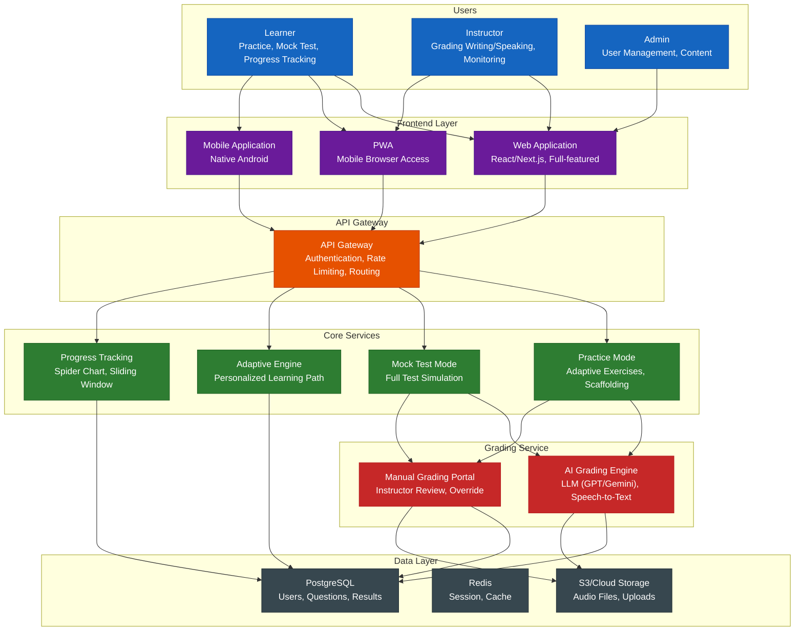
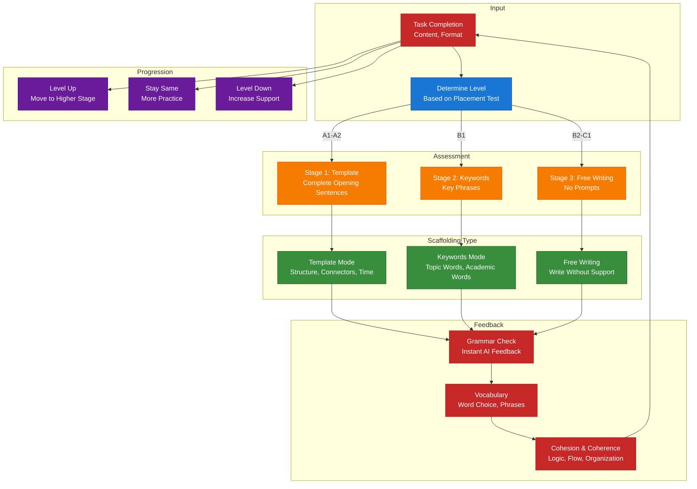
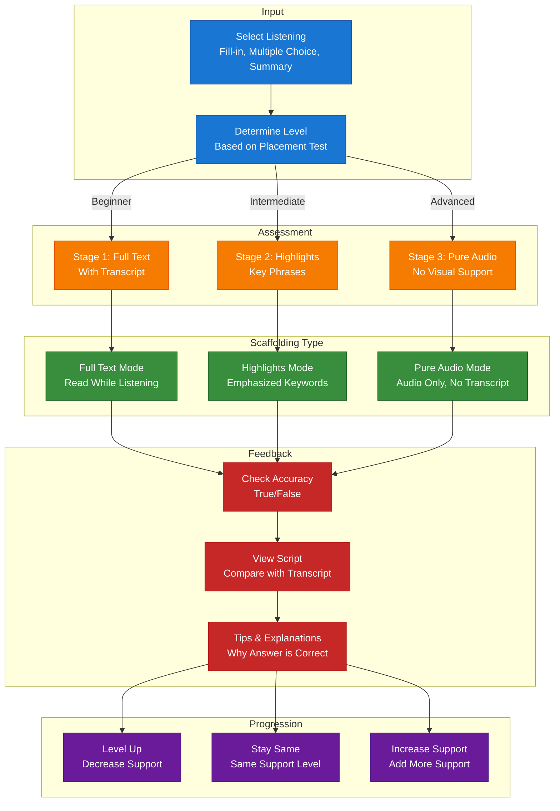
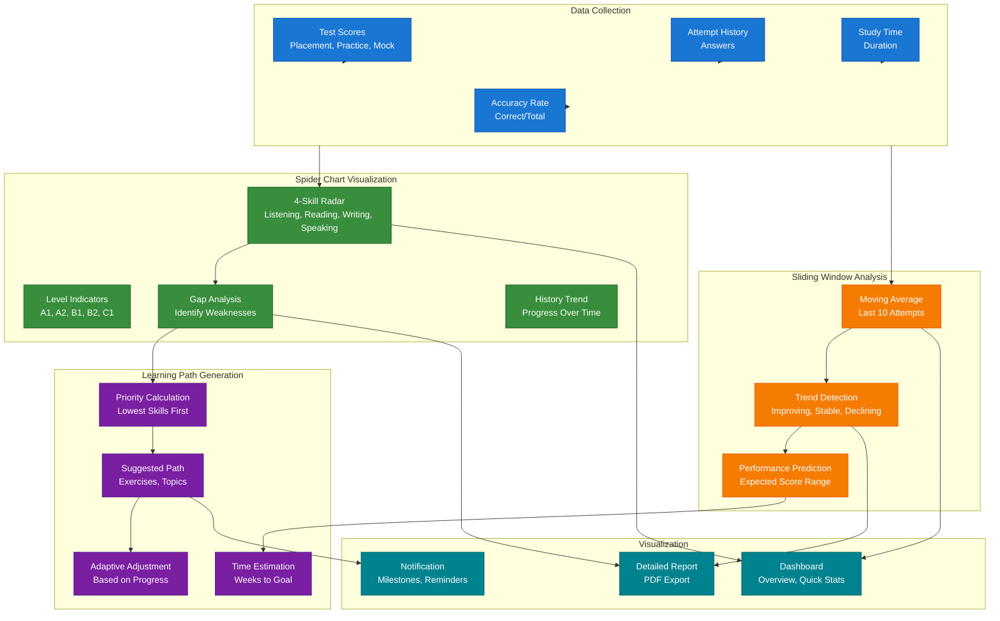
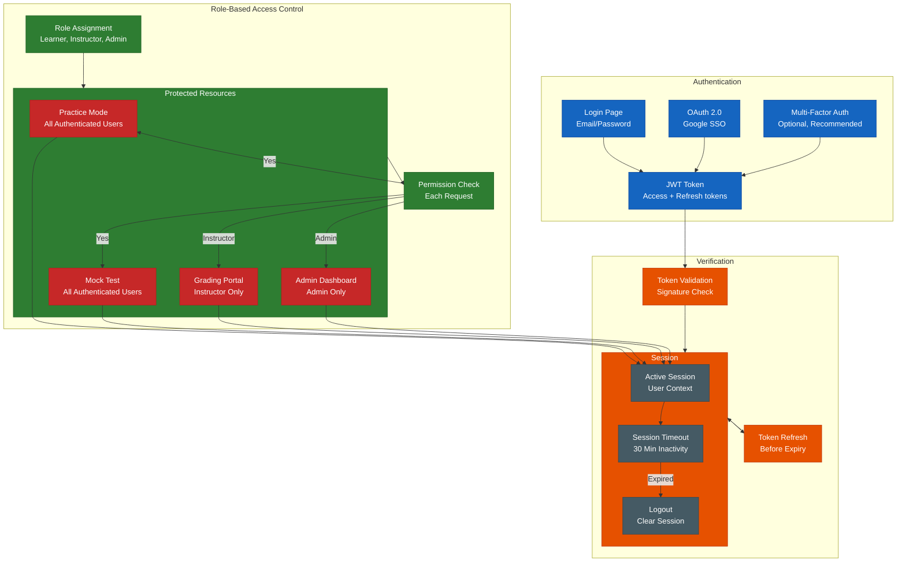

# Flow Diagrams for Adaptive VSTEP Training System

## 1. System Architecture

## 2. User Journey

```mermaid
flowchart LR
    Start(["Start"])
    Reg["Register<br/>Email, OAuth (Google)"]
    Profile["Profile Setup<br/>Role, Goals, Proficiency"]
    Placement["Placement Test<br/>4-Skill Assessment"]
    Select["Select Mode<br/>Practice or Mock Test"]
    Practice["Practice Mode<br/>Adaptive Scaffolding"]
    Mock["Mock Test<br/>Full Test"]
    Feedback["Feedback & Results<br/>AI + Human Grading"]
    Progress["Progress Tracking<br/>Spider Chart, Sliding Window"]
    GoalCheck{"Goals<br/>Achieved?"}
    GoalSet["Set Goals<br/>Target Level, Deadline"]
    End(["End"])

    Start --> Reg
    Reg --> Profile
    Profile --> Placement
    Placement --> GoalSet
    GoalSet --> Select
    Select --> Practice
    Select --> Mock
    Practice --> Feedback
    Mock --> Feedback
    Feedback --> Progress
    Progress --> GoalCheck
    GoalSet --> GoalCheck
    GoalCheck -->|No| Select
    GoalCheck -->|Yes| End

    classDef start fill:#1565c0,stroke:#0d47a1,color:#fff
    classDef process fill:#1976d2,stroke:#0d47a1,color:#fff
    classDef decision fill:#f57c0,stroke:#e65100,color:#fff
    classDef outcome fill:#7b1fa2,stroke:#4a148c,color:#fff

    class Start,End start
    class Reg,Profile,Placement,Practice,Mock,Feedback,Progress,GoalSet process
    class GoalCheck decision
```

## 3. Practice Flow with Adaptive Scaffolding

### 3A. Writing Skill Scaffolding

### 3B. Listening Skill Scaffolding

## 4. Mock Test Flow

```mermaid
flowchart TB
    subgraph Start ["Start"]
        Intro["Test Introduction<br/>Structure, Time, Instructions"]
        Auth["Identity Verification<br/>Login, Session Token"]
    end

    subgraph Section1 ["Section 1: Listening (40 minutes)"]
        L1["Part 1: Pictures<br/>Question-Response"]
        L2["Part 2: Q&A<br/>Short Conversations"]
        L3["Part 3: Reading<br/>Passage, Questions"]
    end

    subgraph Section2 ["Section 2: Reading (60 minutes)"]
        R1["True/False/Not Given<br/>Statement Identification"]
        R2["Multiple Choice<br/>Select Correct Answer"]
        R3["Matching/Fill<br/>Headings, Gaps"]
    end

    subgraph Section3 ["Section 3: Writing (60 minutes)"]
        W1["Task 1: Letter<br/>150-180 words"]
        W2["Task 2: Essay<br/>300-350 words"]
    end

    subgraph Section4 ["Section 4: Speaking (12 minutes)"]
        S1["Part 1: Introduction<br/>Personal Questions"]
        S2["Part 2: Presentation<br/>Speak 1-2 minutes"]
        S3["Part 3: Discussion<br/>Follow-up Questions"]
    end

    subgraph Submission ["Submission"]
        Submit["Submit Test<br/>Confirm Completion"]
        Verify["Verify Answers<br/>Check Unanswered Items"]
    end

    subgraph Scoring ["Scoring"]
        ListeningScore["Listening Score<br/>Multiple Choice Auto"]
        ReadingScore["Reading Score<br/>Multiple Choice Auto"]
        WritingScore["Writing Score<br/>AI + Human Grading"]
        SpeakingScore["Speaking Score<br/>AI + Human Grading"]
    end

    subgraph Results ["Results"]
        Total["Total Score<br/>Average of 4 Skills"]
        Breakdown["Skill Breakdown<br/>Score Per Skill"]
        Report["Detailed Report<br/>Spider Chart, Recommendations"]
    end

    Intro --> Auth
    Auth --> L1
    L1 --> L2
    L2 --> L3
    L3 --> R1
    R1 --> R2
    R2 --> R3
    R3 --> W1
    W1 --> W2
    W2 --> S1
    S1 --> S2
    S2 --> S3
    S3 --> Submit
    Submit --> Verify
    Verify -->|Complete| ListeningScore
    Verify -->|Incomplete| S3
    ListeningScore --> ReadingScore
    ReadingScore --> WritingScore
    WritingScore --> SpeakingScore
    SpeakingScore --> Total
    Total --> Breakdown
    Breakdown --> Report

    classDef start fill:#1565c0,stroke:#0d47a1,color:#fff
    classDef section fill:#f57c00,stroke:#e65100,color:#fff
    classDef submission fill:#e65100,stroke:#bf360c,color:#fff
    classDef scoring fill:#7b1fa2,stroke:#4a148c,color:#fff
    classDef results fill:#37474f,stroke:#263238,color:#fff

    class Intro,Auth start
    class L1,L2,L3,R1,R2,R3,W1,W2,S1,S2,S3 section
    class Submit,Verify submission
    class ListeningScore,ReadingScore,WritingScore,SpeakingScore scoring
    class Total,Breakdown,Report results
```

## 5. Hybrid Grading Flow

```mermaid
flowchart TB
    subgraph Submission ["Submission"]
        WritingSubmit["Writing<br/>Essay, Letter"]
        SpeakingSubmit["Speaking<br/>Recording"]
    end

    subgraph AI ["AI Process"]
        Transcribe["Speech-to-Text<br/>Convert Audio to Text"]
        Grammar["Grammar Analysis<br/>Errors, Complexity"]
        Vocab["Vocabulary Analysis<br/>Range, Accuracy"]
        Content["Content Analysis<br/>Relevance, Coverage"]
        Fluency["Fluency Assessment<br/>Speed, Pauses (Speaking)"]
        Pronunciation["Pronunciation<br/>Acoustic Accuracy (Speaking)"]
        ScoreAI["AI Score<br/>Calculated Confidence Level"]
    end

    subgraph Scoring ["Scoring"]
        Confidence{"Confidence<br/>Score > 85?"}
        AutoPass["Auto Pass<br/>High Confidence"]
        HumanReview["Manual Review<br/>Low Confidence, Flagged"]
    end

    subgraph Human ["Human Grading"]
        Instructor["Instructor Portal<br/>Review, Comment"]
        Rubric["Rubric Scoring<br/>VSTEP Criteria"]
        Override["Override AI<br/>If Necessary"]
        ScoreFinal["Final Score<br/>AI + Human Combined"]
    end

    subgraph Final ["Final Results"]
        Feedback["Detailed Feedback<br/>Strengths, Weaknesses"]
        Suggestion["Suggestions<br/>Improvement"]
        Certificate["Certificate<br/>If Passing Score"]
    end

    WritingSubmit --> Transcribe
    SpeakingSubmit --> Transcribe
    Transcribe --> Grammar
    Grammar --> Vocab
    Vocab --> Content
    Content --> Fluency
    Fluency --> Pronunciation
    Pronunciation --> ScoreAI
    ScoreAI --> Confidence
    Confidence -->|Yes| AutoPass
    Confidence -->|No| HumanReview
    AutoPass --> Feedback
    HumanReview --> Instructor
    Instructor --> Rubric
    Rubric --> Override
    Override --> ScoreFinal
    ScoreFinal --> Suggestion
    Suggestion --> Certificate

    classDef submission fill:#1976d2,stroke:#0d47a1,color:#fff
    classDef ai fill:#00796b,stroke:#004d40,color:#fff
    classDef scoring fill:#fbc02d,stroke:#f57f17,color:#000
    classDef human fill:#5d4037,stroke:#3e2723,color:#fff
    classDef final fill:#303f9f,stroke:#1a237e,color:#fff

    class WritingSubmit,SpeakingSubmit submission
    class Transcribe,Grammar,Vocab,Content,Fluency,Pronunciation,ScoreAI ai
    class Confidence,AutoPass,HumanReview scoring
    class Instructor,Rubric,Override,ScoreFinal human
    class Feedback,Suggestion,Certificate final
```

## 6. Progress Tracking & Learning Path

## 7. Authentication & Role-Based Access Control

## Diagram Summary

| Diagram | Purpose | Key Components |
|---------|---------|----------------|
| **System Architecture** | Overall Design | Frontend, API Gateway, Core Services, Grading, Data Layer |
| **User Journey** | Learner Lifecycle | Register → Placement → Practice/Mock Test → Progress |
| **Practice - Writing** | Writing Skill Support | Template → Keywords → Free Writing |
| **Practice - Listening** | Listening Skill Support | Full Text → Highlights → Pure Audio |
| **Mock Test** | Full Test Experience | 4 Sections, Timer, Grading, Report |
| **Hybrid Grading** | AI + Human Evaluation | AI Instant → Human Override → Final Score |
| **Progress Tracking** | Analytics & Visualization | Spider Chart, Sliding Window, Learning Path |
| **Authentication & RBAC** | Security & Permissions | JWT, OAuth, Role-based Permissions |

---

*Document created for Adaptive VSTEP Training System (SP26SE145)*
