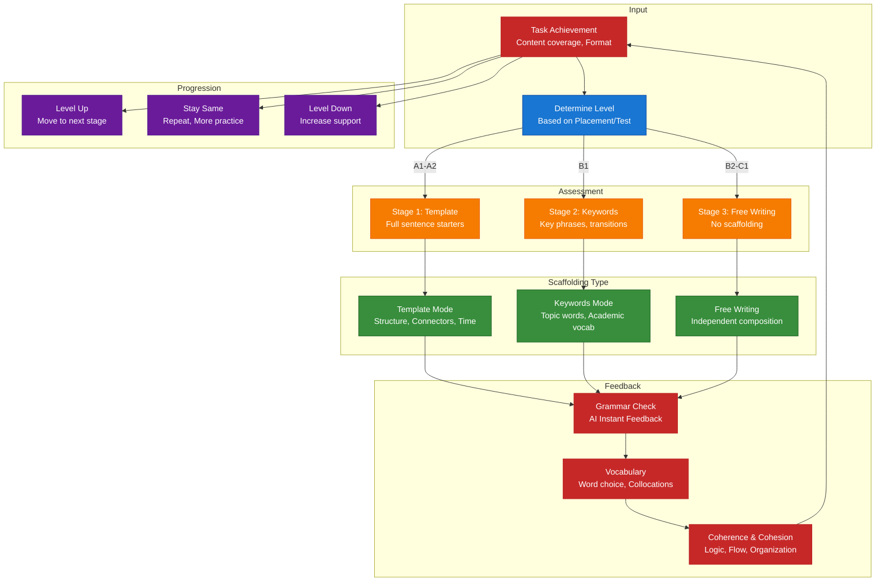
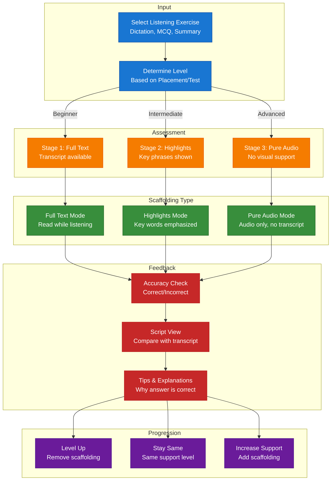
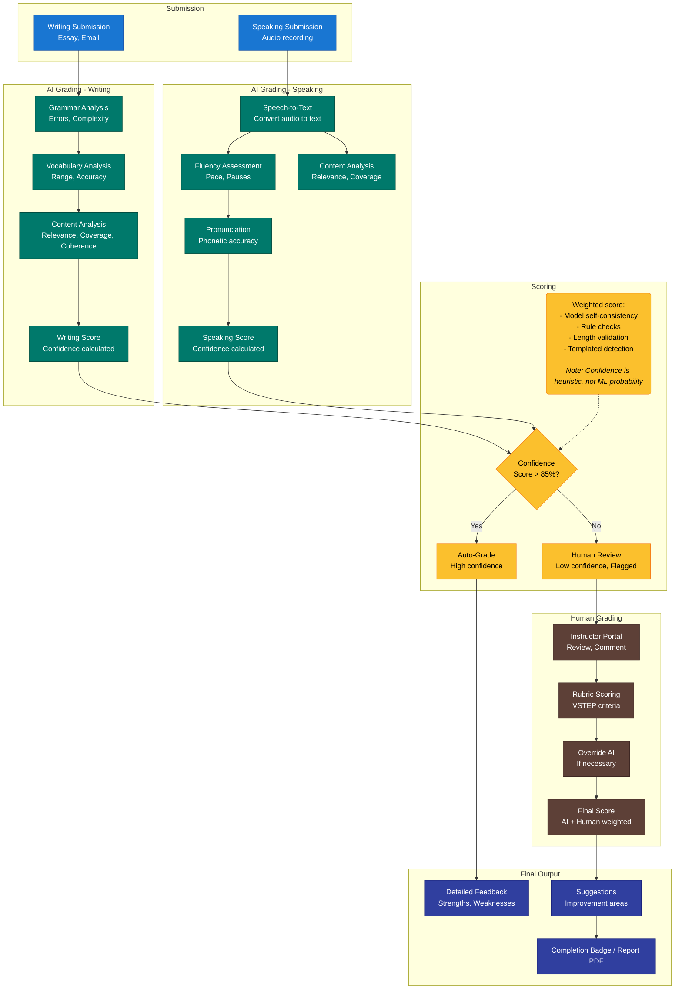
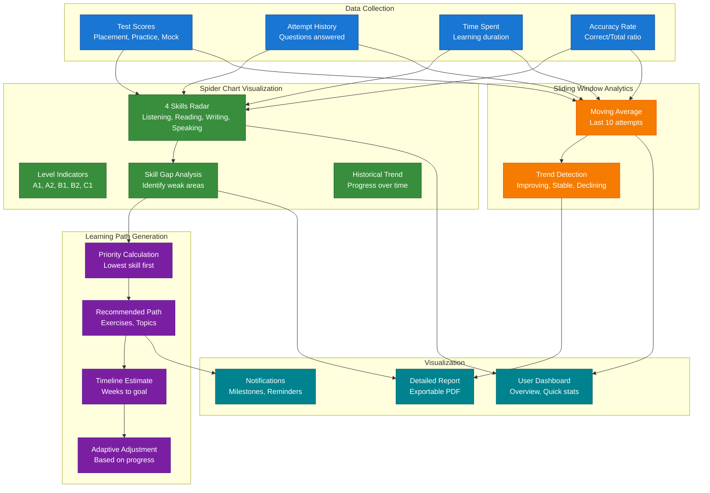
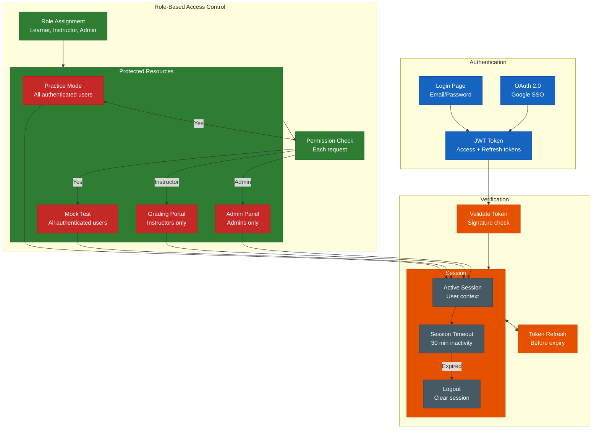

# Sơ Đồ Luồng Hệ Thống Luyện Thi VSTEP Thích Ứng

## 1. Kiến Trúc Hệ Thống (Multi-Language)

```mermaid
flowchart TB
    subgraph Users ["Users"]
        L["Learner<br/>Practice, Mock Test, Progress"]
        I["Instructor<br/>Grading, Monitoring"]
        A["Admin<br/>User & Content Management"]
    end

    subgraph BunApp ["Bun Main Application"]
        subgraph API ["API Layer"]
            Auth["Authentication<br/>JWT, OAuth 2.0"]
            Validate["Request Validation<br/>Input sanitization"]
            Route["REST API<br/>Resource-oriented endpoints"]
        end

        subgraph Core ["Core Modules"]
            Assessment["Assessment<br/>Practice, Mock, Submission"]
            Progress["Progress<br/>Spider Chart, Sliding Window"]
            Content["Content<br/>Question Bank, Recommender"]
        end

        subgraph QueueClient ["Queue Client"]
            Enqueue["Job Publisher<br/>Redis Streams/RabbitMQ"]
            Poller["Status Poller<br/>Job completion check"]
        end
    end

    subgraph QueueInfra ["Message Queue"]
        Stream["Redis Streams<br/>Consumer groups"]
        Topics["Topics:<br/>grading.request, grading.callback"]
    end

    subgraph GradingService ["Grading Service (Python/Rust/Go)"]
        subgraph GradingAPI ["Grading API"]
            Receive["Job Receiver<br/>Validate, idempotency check"]
            Router["Task Router<br/>Essay → LLM, Speech → STT"]
        end

        subgraph GradingCore ["Grading Core"]
            LLMGrader["LLM Grader<br/>GPT/Gemini (Writing)"]
            STTGrader["STT Grader<br/>Whisper/API (Speaking)"]
            Scorer["Scorer Engine<br/>Rubric, confidence calc"]
        end

        subgraph GradingDB ["Grading Storage"]
            JobDB["Job State<br/>Pending, Processing, Done"]
            ResultDB["Results<br/>Scores, Feedback, Diagnostics"]
        end
    end

    subgraph External ["External Services"]
        LLMs["LLM APIs<br/>GPT-4, Gemini Pro"]
        STT APIs["Speech-to-Text<br/>Whisper, Azure"]
    end

    subgraph Observability ["Observability"]
        Logs["Structured Logs<br/>JSON, level-based"]
        Metrics["Metrics<br/>Prometheus format"]
        Traces["Distributed Traces<br/>OpenTelemetry"]
    end

    subgraph Data ["Data Layer"]
        MainDB["PostgreSQL<br/>Users, Content, Progress (Main App)"]
        GradingDB["PostgreSQL<br/>Grading Jobs, Results (Grading Service)"]
        Redis["Redis<br/>Session, Cache, Queue metadata"]
    end

    %% Styling
    classDef users fill:#1565c0,stroke:#0d47a1,color:#fff
    classDef api fill:#e65100,stroke:#bf360c,color:#fff
    classDef core fill:#2e7d32,stroke:#1b5e20,color:#fff
    classDef queue fill:#ff8f00,stroke:#ff6f00,color:#fff
    classDef service fill:#6a1b9a,stroke:#4a148c,color:#fff
    classDef external fill:#00796b,stroke:#004d40,color:#fff
    classDef observability fill:#455a64,stroke:#37474f,color:#fff
    classDef data fill:#37474f,stroke:#263238,color:#fff

    class L,I,A users
    class Auth,Validate,Route,Enqueue,Poller api
    class Assessment,Progress,Content core
    class Stream,Topics queue
    class Receive,Router,LLMGrader,STTGrader,Scorer,JobDB,ResultDB service
    class LLMs,STT APIs external
    class Logs,Metrics,Traces observability
    class MainDB,GradingDB,Redis data

    %% User flows
    L --> Web["Web/PWA"]
    L --> Mobile["Mobile App"]
    Web --> Auth
    Mobile --> Auth
    Auth --> Route
    Route --> Assessment
    Route --> Progress
    Route --> Content

    %% Submission flow
    Assessment --> Enqueue
    Enqueue --> Stream
    Stream --> Topics
    Topics --> Receive
    Receive --> Router
    Router --> LLMGrader
    Router --> STTGrader
    LLMGrader --> LLMs
    STTGrader --> STT APIs
    LLMs --> Scorer
    STT APIs --> Scorer
    Scorer --> JobDB
    Scorer --> ResultDB
    JobDB --> Poller
    ResultDB --> Poller

    %% Results return
    Poller --> Progress
    Progress --> MainDB
    Content --> MainDB
    Assessment --> MainDB

    %% Observability
    Route --> Logs
    Assessment --> Traces
    Receive --> Traces
    Scorer --> Traces
    Traces --> Metrics
    Metrics --> Redis
```

> **Kiến trúc Multi-Language:**
> - **Main App (Bun)**: API, Auth, Assessment, Progress, Content - TypeScript
> - **Grading Service (Python/Rust/Go)**: AI Grading, STT, Scoring - ML-optimized language
> - **Giao tiếp**: REST + Queue (Redis Streams/RabbitMQ) với idempotency
> - **Database**: Tách biệt hoàn toàn - Main DB vs Grading DB
>
> **Nguyên tắc:**
> - Grading request → enqueue → async processing → poll callback → update progress
> - Strict API contract với `requestId` cho idempotency
> - Separate schemas, no cross-service writes

## 2. Hành Trình Người Dùng


## 3. Practice Mode với Adaptive Scaffolding

### 3A. Writing Adaptive Scaffolding



### 3B. Listening Adaptive Scaffolding



## 4. Luồng Mock Test

```mermaid
flowchart TB
    subgraph Start ["Bắt đầu"]
        Intro["Test Introduction<br/>Format, Duration, Instructions"]
        Auth["Identity Verification<br/>Login, Session Token"]
    end

    subgraph Section1 ["Section 1: Listening (40 min)"]
        L1["Part 1: Pictures<br/>Question-Response"]
        L2["Part 2: Q&A<br/>Short Conversations"]
        L3["Part 3: Reading<br/>Passages, Questions"]
    end

    subgraph Section2 ["Section 2: Reading (60 min)"]
        R1["True/False/Not Given<br/>Identify statements"]
        R2["Multiple Choice<br/>Select correct answer"]
        R3["Matching/Fill-in<br/>Headings, Blanks"]
    end

    subgraph Section3 ["Section 3: Writing (60 min)"]
        W1["Task 1: Email/Letter<br/>150-180 words"]
        W2["Task 2: Essay<br/>300-350 words"]
    end

    subgraph Section4 ["Section 4: Speaking (12 min)"]
        S1["Part 1: Introduction<br/>Personal questions"]
        S2["Part 2: Cue Card<br/>1-2 min talk"]
        S3["Part 3: Discussion<br/>Follow-up questions"]
    end

    subgraph Submission ["Nộp bài"]
        Submit["Submit Test<br/>Confirm completion"]
        Verify["Verify Responses<br/>Check incomplete items"]
    end

    subgraph Scoring ["Chấm điểm"]
        ListeningScore["Listening Score<br/>Auto-graded MCQ"]
        ReadingScore["Reading Score<br/>Auto-graded MCQ"]
        WritingScore["Writing Score<br/>AI + Human Grading"]
        SpeakingScore["Speaking Score<br/>AI + Human Grading"]
    end

    subgraph Results ["Kết quả"]
        Total["Total Score<br/>4-Skill Average"]
        Breakdown["Skill Breakdown<br/>Each skill score"]
        Report["Detailed Report<br/>Spider Chart, Recommendations"]
    end

    Intro --> Auth
    Auth --> L1
    L1 --> L2
    L2 --> L3
    L3 --> R1
    R1 --> R2
    R2 --> R3
    R3 --> W1
    W1 --> W2
    W2 --> S1
    S1 --> S2
    S2 --> S3
    S3 --> Submit
    Submit --> Verify
    Verify -->|Complete| ListeningScore
    Verify -->|Incomplete| S3
    ListeningScore --> ReadingScore
    ReadingScore --> WritingScore
    WritingScore --> SpeakingScore
    SpeakingScore --> Total
    Total --> Breakdown
    Breakdown --> Report

    classDef start fill:#1565c0,stroke:#0d47a1,color:#fff
    classDef section fill:#f57c00,stroke:#e65100,color:#fff
    classDef submission fill:#e65100,stroke:#bf360c,content:#fff
    classDef scoring fill:#7b1fa2,stroke:#4a148c,color:#fff
    classDef results fill:#37474f,stroke:#263238,color:#fff

    class Intro,Auth start
    class L1,L2,L3,R1,R2,R3,W1,W2,S1,S2,S3 section
    class Submit,Verify submission
    class ListeningScore,ReadingScore,WritingScore,SpeakingScore scoring
    class Total,Breakdown,Report results
```



## 5. Luồng Hybrid Grading



## 6. Luồng Progress Tracking & Learning Path



## 7. Authentication & RBAC



## Tóm Tắt Sơ Đồ

| Sơ đồ | Mục đích | Thành phần chính |
|-------|----------|------------------|
| **Kiến trúc Hệ thống** | Multi-Language Services | Bun (API/Core) + Python/Rust/Go (Grading) - Separate DB, Queue-based communication |
| **Hành trình Người dùng** | Vòng đời người học | Registration → Goal → Self-Assessment → Practice/Mock Test |
| **Practice Mode - Writing** | Adaptive Scaffolding Viết | Template → Keywords → Free Writing |
| **Practice Mode - Listening** | Adaptive Scaffolding Nghe | Full Text → Highlights → Pure Audio |
| **Mock Test Flow** | Thi thử giả lập | 4 Sections, Timer, Scoring, Results Report |
| **Hybrid Grading** | Đánh giá AI + Human | AI Instant → Human Override → Final Score |
| **Progress Tracking** | Analytics & visualization | Spider Chart, Sliding Window, Learning Path |
| **Authentication & RBAC** | Bảo mật & phân quyền | JWT, OAuth, Role-based permissions |

---

**Tóm tắt hệ thống:** Hệ thống ưu tiên giảm friction cho người học bằng cách cho phép chọn mục tiêu trước, sau đó sử dụng self-assessment và dữ liệu hành vi ban đầu để hiệu chỉnh mức độ học tập dần theo thời gian, thay vì phụ thuộc vào một bài placement test duy nhất.

*Tài liệu được tạo cho Hệ thống Luyện Thi VSTEP Thích Ứng (SP26SE145)*
