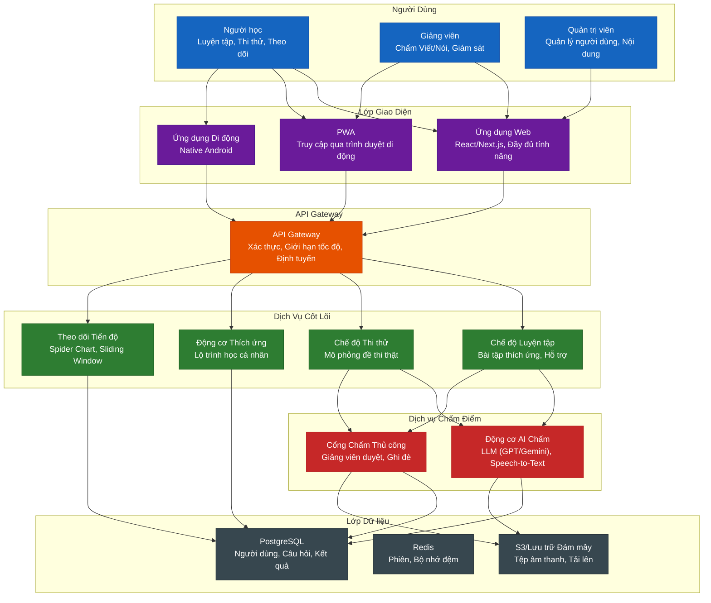
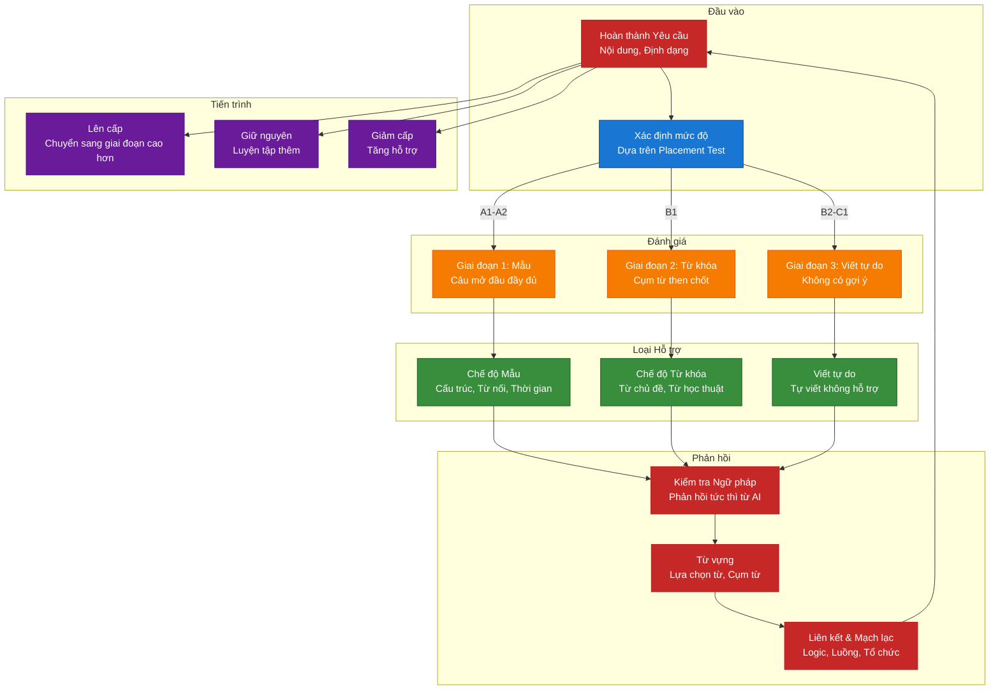
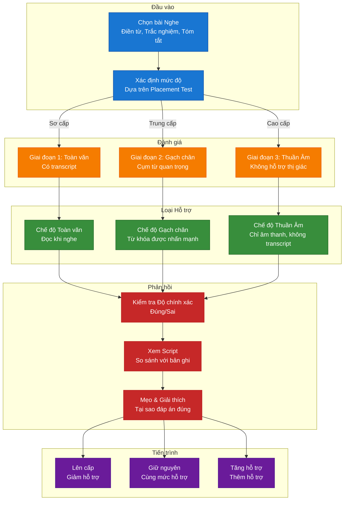
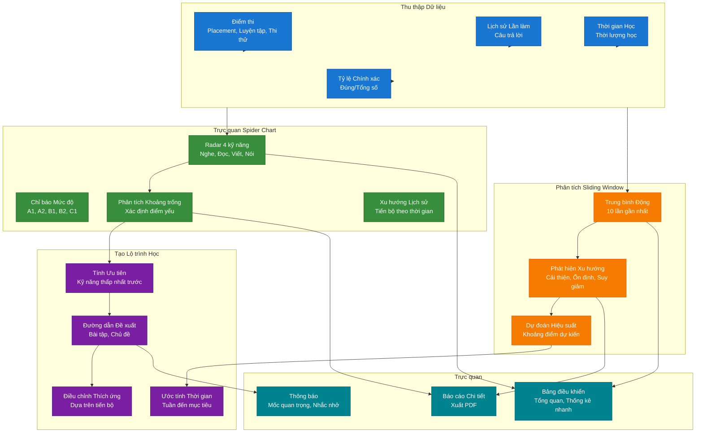
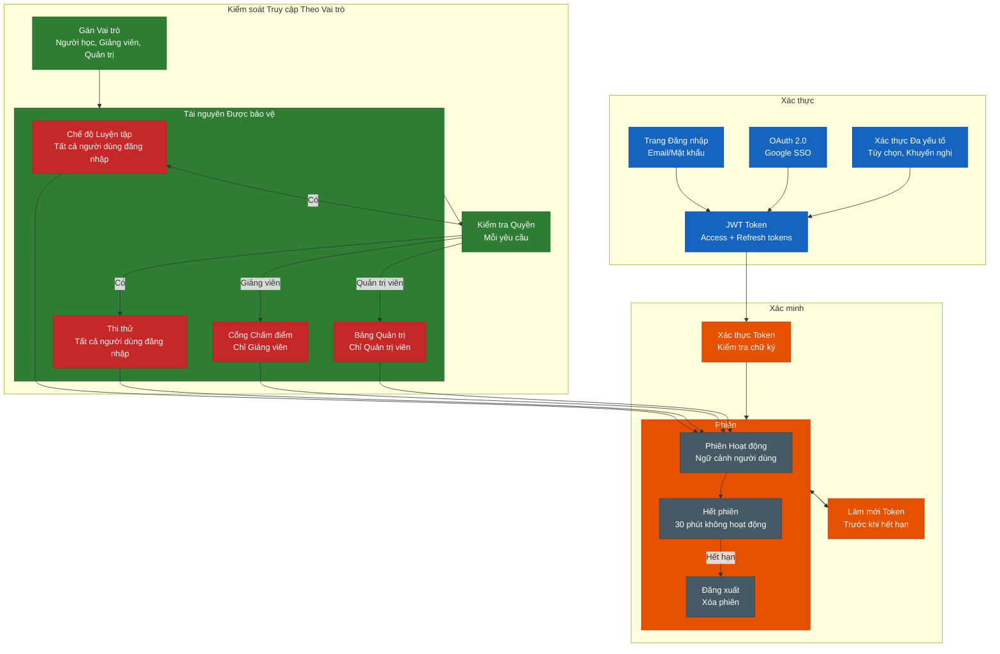

# Sơ Đồ Luồng Hệ Thống Luyện Thi VSTEP Thích Ứng

## 1. Kiến Trúc Hệ Thống

## 2. Hành Trình Người Dùng

```mermaid
flowchart LR
    Start(["Bắt đầu"])
    Reg["Đăng ký<br/>Email, OAuth (Google)"]
    Profile["Thiết lập Hồ sơ<br/>Vai trò, Mục tiêu, Trình độ"]
    Placement["Bài kiểm tra Đầu vào<br/>Đánh giá 4 kỹ năng"]
    Select["Chọn Chế độ<br/>Luyện tập hoặc Thi thử"]
    Practice["Chế độ Luyện tập<br/>Hỗ trợ thích ứng"]
    Mock["Thi thử Giả lập<br/>Đề thi đầy đủ"]
    Feedback["Phản hồi & Kết quả<br/>AI + Chấm thủ công"]
    Progress["Theo dõi Tiến độ<br/>Spider Chart, Sliding Window"]
    GoalCheck{"Mục tiêu<br/>Đã đạt?"}
    GoalSet["Thiết lập Mục tiêu<br/>Mức độ, Thời hạn"]
    End(["Kết thúc"])

    Start --> Reg
    Reg --> Profile
    Profile --> Placement
    Placement --> GoalSet
    GoalSet --> Select
    Select --> Practice
    Select --> Mock
    Practice --> Feedback
    Mock --> Feedback
    Feedback --> Progress
    Progress --> GoalCheck
    GoalSet --> GoalCheck
    GoalCheck -->|Không| Select
    GoalCheck -->|Có| End

    classDef start fill:#1565c0,stroke:#0d47a1,color:#fff
    classDef process fill:#1976d2,stroke:#0d47a1,color:#fff
    classDef decision fill:#f57c0,stroke:#e65100,color:#fff
    classDef outcome fill:#7b1fa2,stroke:#4a148c,color:#fff

    class Start,End start
    class Reg,Profile,Placement,Practice,Mock,Feedback,Progress,GoalSet process
    class GoalCheck decision
```

## 3. Luồng Luyện Tập với Hỗ Trợ Thích Ứng

### 3A. Hỗ Trợ Kỹ Năng Viết

### 3B. Hỗ Trợ Kỹ Năng Nghe

## 4. Luồng Thi Thử Giả Lập

```mermaid
flowchart TB
    subgraph Start ["Bắt đầu"]
        Intro["Giới thiệu Đề thi<br/>Cấu trúc, Thời gian, Hướng dẫn"]
        Auth["Xác minh Danh tính<br/>Đăng nhập, Token phiên"]
    end

    subgraph Section1 ["Phần 1: Nghe (40 phút)"]
        L1["Phần 1: Hình ảnh<br/>Câu hỏi - Phản hồi"]
        L2["Phần 2: Hỏi đáp<br/>Đoạn hội thoại ngắn"]
        L3["Phần 3: Đọc<br/>Bài đọc, Câu hỏi"]
    end

    subgraph Section2 ["Phần 2: Đọc (60 phút)"]
        R1["True/False/Not Given<br/>Xác định mệnh đề"]
        R2["Trắc nghiệm<br/>Chọn đáp án đúng"]
        R3["Nối/Điền<br/>Tiêu đề, Chỗ trống"]
    end

    subgraph Section3 ["Phần 3: Viết (60 phút)"]
        W1["Task 1: Thư<br/>150-180 từ"]
        W2["Task 2: Bài luận<br/>300-350 từ"]
    end

    subgraph Section4 ["Phần 4: Nói (12 phút)"]
        S1["Phần 1: Giới thiệu<br/>Câu hỏi cá nhân"]
        S2["Phần 2: Bài thuyết trình<br/>Nói 1-2 phút"]
        S3["Phần 3: Thảo luận<br/>Câu hỏi tiếp theo"]
    end

    subgraph Submission ["Nộp bài"]
        Submit["Nộp Đề thi<br/>Xác nhận hoàn thành"]
        Verify["Xác minh Câu trả lời<br/>Kiểm tra mục chưa trả lời"]
    end

    subgraph Scoring ["Chấm điểm"]
        ListeningScore["Điểm Nghe<br/>Trắc nghiệm tự động"]
        ReadingScore["Điểm Đọc<br/>Trắc nghiệm tự động"]
        WritingScore["Điểm Viết<br/>AI + Chấm thủ công"]
        SpeakingScore["Điểm Nói<br/>AI + Chấm thủ công"]
    end

    subgraph Results ["Kết quả"]
        Total["Tổng điểm<br/>Trung bình 4 kỹ năng"]
        Breakdown["Chi tiết Kỹ năng<br/>Điểm từng kỹ năng"]
        Report["Báo cáo Chi tiết<br/>Spider Chart, Đề xuất"]
    end

    Intro --> Auth
    Auth --> L1
    L1 --> L2
    L2 --> L3
    L3 --> R1
    R1 --> R2
    R2 --> R3
    R3 --> W1
    W1 --> W2
    W2 --> S1
    S1 --> S2
    S2 --> S3
    S3 --> Submit
    Submit --> Verify
    Verify -->|Hoàn thành| ListeningScore
    Verify -->|Chưa hoàn thành| S3
    ListeningScore --> ReadingScore
    ReadingScore --> WritingScore
    WritingScore --> SpeakingScore
    SpeakingScore --> Total
    Total --> Breakdown
    Breakdown --> Report

    classDef start fill:#1565c0,stroke:#0d47a1,color:#fff
    classDef section fill:#f57c00,stroke:#e65100,color:#fff
    classDef submission fill:#e65100,stroke:#bf360c,color:#fff
    classDef scoring fill:#7b1fa2,stroke:#4a148c,color:#fff
    classDef results fill:#37474f,stroke:#263238,color:#fff

    class Intro,Auth start
    class L1,L2,L3,R1,R2,R3,W1,W2,S1,S2,S3 section
    class Submit,Verify submission
    class ListeningScore,ReadingScore,WritingScore,SpeakingScore scoring
    class Total,Breakdown,Report results
```

## 5. Luồng Chấm Điểm Kết Hợp (Hybrid Grading)

```mermaid
flowchart TB
    subgraph Submission ["Nộp bài"]
        WritingSubmit["Bài Viết<br/>Bài luận, Thư"]
        SpeakingSubmit["Bài Nói<br/>Ghi âm"]
    end

    subgraph AI ["Quy trình AI"]
        Transcribe["Speech-to-Text<br/>Chuyển âm thanh thành văn bản"]
        Grammar["Phân tích Ngữ pháp<br/>Lỗi, Độ phức tạp"]
        Vocab["Phân tích Từ vựng<br/>Phạm vi, Độ chính xác"]
        Content["Phân tích Nội dung<br/>Mức độ liên quan, Bao phủ"]
        Fluency["Đánh giá Trôi chảy<br/>Tốc độ, Dừng (Nói)"]
        Pronunciation["Phát âm<br/>Độ chính xác âm học (Nói)"]
        ScoreAI["Điểm AI<br/>Mức độ tin cậy tính toán"]
    end

    subgraph Scoring ["Chấm điểm"]
        Confidence{"Độ tin cậy<br/>Điểm > 85?"}
        AutoPass["Chấm tự động<br/>Độ tin cậy cao"]
        HumanReview["Duyệt thủ công<br/>Độ tin cậy thấp, Đánh dấu"]
    end

    subgraph Human ["Chấm thủ công"]
        Instructor["Cổng Giảng viên<br/>Duyệt, Bình luận"]
        Rubric["Chấm theo Rubric<br/>Tiêu chí VSTEP"]
        Override["Ghi đè AI<br/>Nếu cần thiết"]
        ScoreFinal["Điểm cuối<br/>Kết hợp AI + Người"]
    end

    subgraph Final ["Kết quả cuối"]
        Feedback["Phản hồi Chi tiết<br/>Điểm mạnh, Điểm yếu"]
        Suggestion["Đề xuất<br/>Cải thiện"]
        Certificate["Chứng chỉ<br/>Nếu đạt điểm"]
    end

    WritingSubmit --> Transcribe
    SpeakingSubmit --> Transcribe
    Transcribe --> Grammar
    Grammar --> Vocab
    Vocab --> Content
    Content --> Fluency
    Fluency --> Pronunciation
    Pronunciation --> ScoreAI
    ScoreAI --> Confidence
    Confidence -->|Có| AutoPass
    Confidence -->|Không| HumanReview
    AutoPass --> Feedback
    HumanReview --> Instructor
    Instructor --> Rubric
    Rubric --> Override
    Override --> ScoreFinal
    ScoreFinal --> Suggestion
    Suggestion --> Certificate

    classDef submission fill:#1976d2,stroke:#0d47a1,color:#fff
    classDef ai fill:#00796b,stroke:#004d40,color:#fff
    classDef scoring fill:#fbc02d,stroke:#f57f17,color:#000
    classDef human fill:#5d4037,stroke:#3e2723,color:#fff
    classDef final fill:#303f9f,stroke:#1a237e,color:#fff

    class WritingSubmit,SpeakingSubmit submission
    class Transcribe,Grammar,Vocab,Content,Fluency,Pronunciation,ScoreAI ai
    class Confidence,AutoPass,HumanReview scoring
    class Instructor,Rubric,Override,ScoreFinal human
    class Feedback,Suggestion,Certificate final
```

## 6. Luồng Theo Dõi Tiến Độ & Lộ Trình Học

## 7. Xác Thực & Kiểm Soát Truy Cập Theo Vai Trò

## Tóm Tắt Sơ Đồ

| Sơ đồ | Mục đích | Thành phần chính |
|-------|----------|------------------|
| **Kiến trúc Hệ thống** | Thiết kế tổng thể | Frontend, API Gateway, Core Services, Grading, Data Layer |
| **Hành trình Người dùng** | Vòng đời người học | Đăng ký → Placement → Luyện tập/Thi thử → Tiến độ |
| **Luyện tập - Viết** | Hỗ trợ kỹ năng Viết | Template → Keywords → Viết tự do |
| **Luyện tập - Nghe** | Hỗ trợ kỹ năng Nghe | Full Text → Highlights → Pure Audio |
| **Thi thử Giả lập** | Thi thử đầy đủ | 4 phần, Timer, Chấm điểm, Báo cáo |
| **Hybrid Grading** | Đánh giá AI + Người | AI tức thì → Ghi đè người → Điểm cuối |
| **Theo dõi Tiến độ** | Analytics & trực quan | Spider Chart, Sliding Window, Learning Path |
| **Xác thực & RBAC** | Bảo mật & phân quyền | JWT, OAuth, Role-based permissions |

---

*Tài liệu được tạo cho Hệ thống Luyện Thi VSTEP Thích Ứng (SP26SE145)*
