# Sơ Đồ Luồng Hệ Thống Luyện Thi VSTEP Thích Ứng

## 1. Kiến Trúc Hệ Thống (Multi-Language)

```mermaid
flowchart TB
    subgraph Users ["Users"]
        L["Learner<br/>Practice, Mock Test, Progress"]
        I["Instructor<br/>Grading, Monitoring"]
        A["Admin<br/>User & Content Management"]
    end

    subgraph BunApp ["Bun Main Application"]
        subgraph API ["API Layer"]
            Auth["Authentication<br/>JWT, OAuth 2.0"]
            Validate["Request Validation<br/>Input sanitization"]
            Route["REST API<br/>Resource-oriented endpoints"]
        end

        subgraph Core ["Core Modules"]
            Assessment["Assessment<br/>Practice, Mock, Submission"]
            Progress["Progress<br/>Spider Chart, Sliding Window"]
            Content["Content<br/>Question Bank, Recommender"]
        end

        subgraph QueueClient ["Queue Client"]
            Enqueue["Job Publisher<br/>Redis Streams/RabbitMQ"]
            Poller["Status Poller<br/>Job completion check"]
            Realtime["Real-time Notifier<br/>WebSocket/SSE"]
        end
    end

    subgraph QueueInfra ["Message Queue"]
        Stream["Redis Streams<br/>Consumer groups"]
        Topics["Topics:<br/>grading.request, grading.callback"]
        DeadLetter["Dead Letter Queue<br/>Failed jobs"]
    end

    subgraph GradingService ["Grading Service (Python/Rust/Go)"]
        subgraph GradingAPI ["Grading API"]
            Receive["Job Receiver<br/>Validate, idempotency check"]
            Router["Task Router<br/>Essay → LLM, Speech → STT"]
        end

        subgraph GradingCore ["Grading Core"]
            LLMGrader["LLM Grader<br/>GPT/Gemini (Writing)"]
            STTGrader["STT Grader<br/>Whisper/API (Speaking)"]
            Scorer["Scorer Engine<br/>Rubric, confidence calc"]
        end

        subgraph GradingDB ["Grading Storage"]
            JobDB["Job State<br/>Pending, Processing, Done"]
            ResultDB["Results<br/>Scores, Feedback, Diagnostics"]
        end
    end

    subgraph External ["External Services"]
        LLMs["LLM APIs<br/>GPT-4, Gemini Pro"]
        STT APIs["Speech-to-Text<br/>Whisper, Azure"]
    end

    subgraph Observability ["Observability"]
        Logs["Structured Logs<br/>JSON, level-based"]
        Metrics["Metrics<br/>Prometheus format"]
        Traces["Distributed Traces<br/>OpenTelemetry"]
    end

    subgraph Data ["Data Layer"]
        MainDB["PostgreSQL<br/>Users, Content, Progress (Main App)"]
        GradingDB["PostgreSQL<br/>Grading Jobs, Results (Grading Service)"]
        Redis["Redis<br/>Session, Cache, Queue metadata"]
    end

    %% Styling
    classDef users fill:#1565c0,stroke:#0d47a1,color:#fff
    classDef api fill:#e65100,stroke:#bf360c,color:#fff
    classDef core fill:#2e7d32,stroke:#1b5e20,color:#fff
    classDef queue fill:#ff8f00,stroke:#ff6f00,color:#fff
    classDef service fill:#6a1b9a,stroke:#4a148c,color:#fff
    classDef external fill:#00796b,stroke:#004d40,color:#fff
    classDef observability fill:#455a64,stroke:#37474f,color:#fff
    classDef data fill:#37474f,stroke:#263238,color:#fff
    classDef error fill:#c62828,stroke:#b71c1c,color:#fff

    class L,I,A users
    class Auth,Validate,Route,Enqueue,Poller,Realtime api
    class Assessment,Progress,Content core
    class Stream,Topics,DeadLetter queue
    class Receive,Router,LLMGrader,STTGrader,Scorer,JobDB,ResultDB service
    class LLMs,STT APIs external
    class Logs,Metrics,Traces observability
    class MainDB,GradingDB,Redis data

    %% User flows
    L --> Web["Web/PWA"]
    L --> Mobile["Mobile App"]
    Web --> Auth
    Mobile --> Auth
    Auth --> Route
    Route --> Assessment
    Route --> Progress
    Route --> Content

    %% Submission flow
    Assessment --> Enqueue
    Enqueue --> Stream
    Stream --> Topics
    Topics --> Receive
    Receive --> Router
    Router --> LLMGrader
    Router --> STTGrader
    LLMGrader --> LLMs
    STTGrader --> STT APIs
    LLMs --> Scorer
    STT APIs --> Scorer
    Scorer --> JobDB
    Scorer --> ResultDB
    JobDB --> Poller
    ResultDB --> Poller

    %% Real-time updates
    JobDB --> Realtime
    ResultDB --> Realtime
    Realtime --> Web
    Realtime --> Mobile

    %% Error handling
    Receive -.->|"Invalid job"| DeadLetter
    Scorer -.->|"Processing fail"| DeadLetter
    DeadLetter --> Retry["Retry Logic<br/>Exponential backoff"]
    Retry -->|"Max retries"| Alert["Alert Admin"]

    %% Results return
    Poller --> Progress
    Progress --> MainDB
    Content --> MainDB
    Assessment --> MainDB

    %% Observability
    Route --> Logs
    Assessment --> Traces
    Receive --> Traces
    Scorer --> Traces
    Traces --> Metrics
    Metrics --> Redis
```

> **Kiến trúc Multi-Language:**
> - **Main App (Bun)**: API, Auth, Assessment, Progress, Content - TypeScript
> - **Grading Service (Python/Rust/Go)**: AI Grading, STT, Scoring - ML-optimized language
> - **Giao tiếp**: REST + Queue (Redis Streams/RabbitMQ) với idempotency
> - **Database**: Tách biệt hoàn toàn - Main DB vs Grading DB
> - **Real-time**: WebSocket/SSE cho status updates
> - **Error Handling**: Dead Letter Queue + Exponential backoff
>
> **Nguyên tắc:**
> - Grading request → enqueue → async processing → poll callback → update progress
> - Strict API contract với `requestId` cho idempotency
> - Separate schemas, no cross-service writes
> - Real-time notifications cho job status changes
> - Automatic retry với dead letter queue cho failed jobs

---

## 2. Error Handling & Failure Recovery Flow

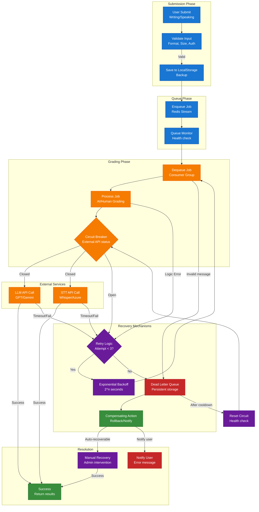

### 2.1 Retry Strategy

| Failure Type | Retry Count | Backoff Strategy | Action After Max Retries |
|--------------|-------------|------------------|--------------------------|
| LLM API Timeout | 3 | Exponential: 2s, 4s, 8s | Dead Letter → Manual review |
| STT API Fail | 3 | Exponential: 1s, 2s, 4s | Dead Letter → Retry with backup provider |
| Queue Processing Error | 3 | Linear: 5s, 10s, 15s | Dead Letter → Alert admin |
| Invalid Message Format | 0 | N/A | Immediate Dead Letter |
| Circuit Breaker Open | Until closed | 30s cooldown | Queue pause → Health check |

### 2.2 Circuit Breaker States

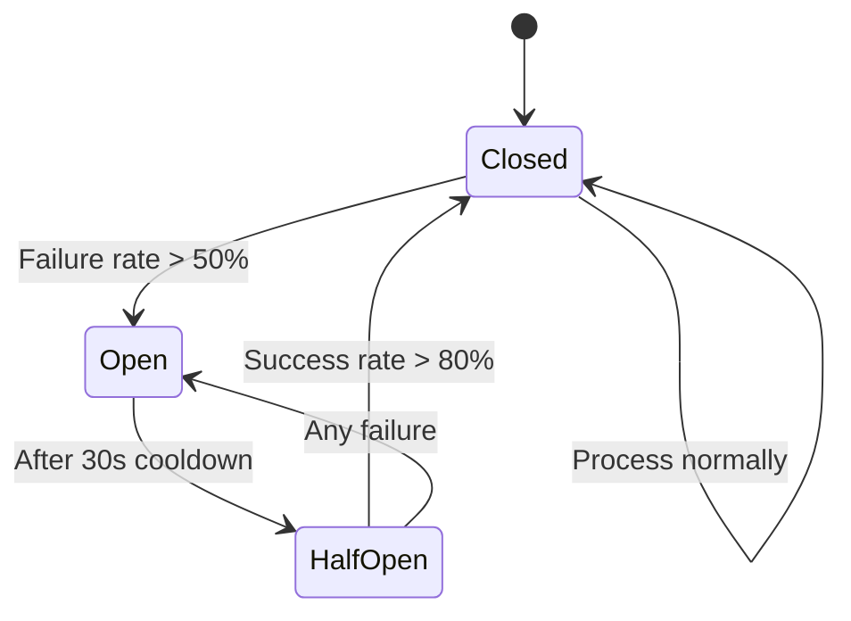

---

## 3. Data Consistency & Saga Pattern

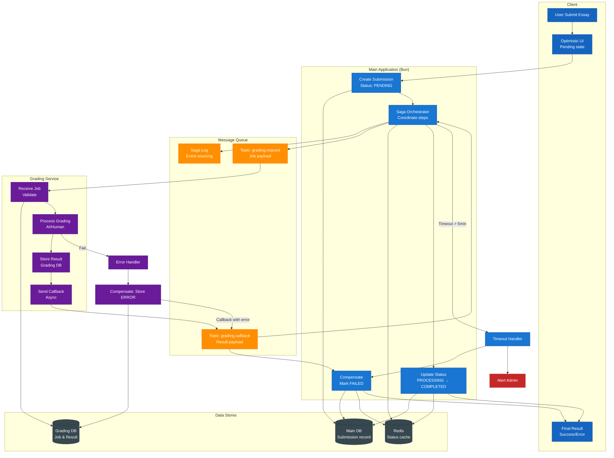

### 3.1 Saga Steps

| Step | Action | Compensation | Timeout |
|------|--------|--------------|---------|
 1 | Create submission (PENDING) | Delete submission | 10s |
| 2 | Publish grading job | Mark submission FAILED | 5s |
| 3 | Grading service processes | N/A (async) | 5min |
| 4 | Receive callback | Retry callback | 30s |
| 5 | Update submission (COMPLETED) | Mark submission ERROR | 10s |

### 3.2 Consistency Guarantees

- **Main DB**: Source of truth for submission status
- **Grading DB**: Source of truth for grading results
- **Redis**: Cache for real-time status (eventual consistency)
- **Saga Log**: Audit trail for all saga events

---

## 4. Real-time Status Updates Flow

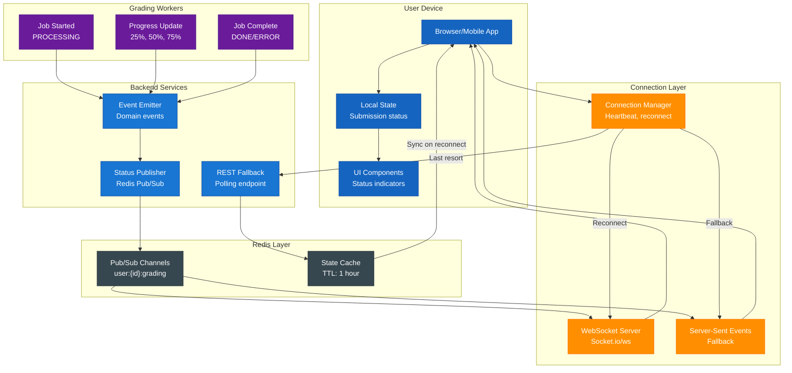

### 4.1 Status States

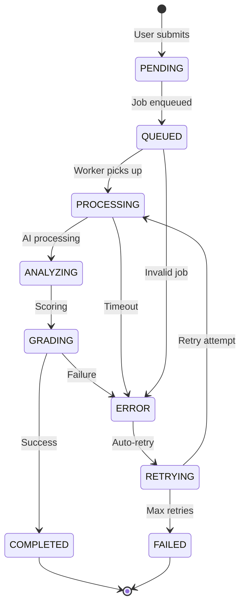

### 4.2 Update Frequency

| Status | Update Type | Latency |
|--------|-------------|---------|
| PENDING → QUEUED | Real-time | < 100ms |
| QUEUED → PROCESSING | Real-time | < 500ms |
| PROCESSING progress | Batch | Every 25% or 10s |
| ANALYZING details | Real-time | Streaming tokens |
| Final result | Real-time | < 100ms |
| ERROR | Real-time | Immediate |

---

## 5. Hybrid Grading với Confidence Score

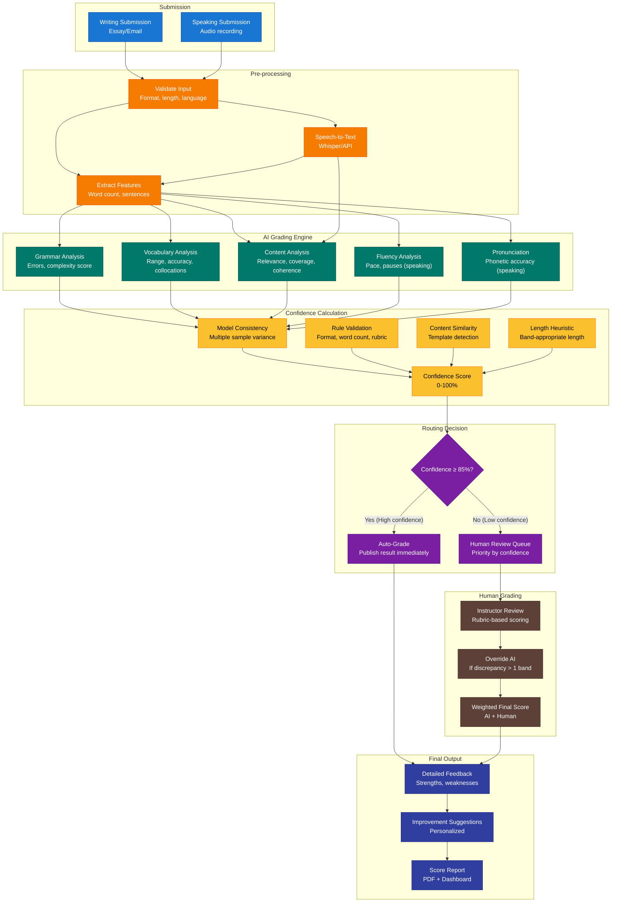

### 5.1 Confidence Score Formula

```
Confidence Score = Σ(Factor_i × Weight_i)

Factors:
├── Model Consistency (30%)
│   └── Calculate std dev across 3 LLM samples
│   └── Score = 100 - (std_dev × 20)
│
├── Rule Validation (25%)
│   ├── Word count within band range (+20)
│   ├── Format compliance (+20)
│   ├── Rubric coverage (+20)
│   └── Time limit compliance (+20)
│
├── Content Similarity (25%)
│   └── Cosine similarity vs template essays
│   └── Score = (1 - similarity) × 100
│   └── Lower similarity = higher confidence
│
└── Length Heuristic (20%)
    ├── Sentence count appropriate (+25)
    ├── Paragraph structure valid (+25)
    ├── Vocabulary density ok (+25)
    └── Complexity score appropriate (+25)
```

### 5.2 Confidence Thresholds

| Confidence | Action | Human Review Priority |
|------------|--------|----------------------|
| 90-100% | Auto-grade | None |
| 85-89% | Auto-grade + flag for audit | Low |
| 70-84% | Human review | Medium |
| 50-69% | Human review | High |
| < 50% | Human review + AI warning | Critical |

### 5.3 Weighted Final Score (AI + Human)

```
If Human and AI agree (within 0.5 band):
    Final = (AI_score × 0.4) + (Human_score × 0.6)

If Human and AI disagree (> 0.5 band):
    Final = Human_score (Human overrides)
    Flag for model retraining
```

---

## 6. Hành Trình Người Dùng

```mermaid
flowchart LR
    Start(["Bắt đầu"])
    Reg["Đăng ký<br/>Email, OAuth (Google)"]
    Profile["Thiết lập Hồ sơ<br/>Role, Goals"]
    GoalSet["Thiết lập Goal<br/>Target Level, Timeline"]
    SelfAssess["Self-Assessment (Optional)<br/>3-5 phút, ước lượng level"]
    Select["Chọn Mode<br/>Practice hoặc Mock Test"]
    Practice["Practice Mode<br/>Adaptive Scaffolding"]
    Mock["Mock Test<br/>Full Exam Simulation"]
    Feedback["Feedback & Results<br/>AI + Human Grading"]
    Progress["Progress Tracking<br/>Spider Chart, Sliding Window"]
    GoalCheck{"Goal<br/>Đã đạt?"}
    Placement["Placement Test (Optional)<br/>Đánh giá đầy đủ 4 kỹ năng"]
    End(["Kết thúc"])

    Start --> Reg
    Reg --> Profile
    Profile --> GoalSet
    GoalSet --> SelfAssess
    SelfAssess --> Select
    Select --> Practice
    Select --> Mock
    Practice --> Feedback
    Mock --> Feedback
    Feedback --> Progress
    Progress --> GoalCheck
    GoalSet --> GoalCheck
    GoalCheck -->|"Không"| Select
    GoalCheck -->|"Có"| End
    SelfAssess -.->|"Sau này"| Placement

    classDef start fill:#1565c0,stroke:#0d47a1,color:#fff
    classDef process fill:#1976d2,stroke:#0d47a1,color:#fff
    classDef decision fill:#f57c00,stroke:#e65100,color:#fff
    classDef outcome fill:#7b1fa2,stroke:#4a148c,color:#fff
    classDef optional fill:#78909c,stroke:#546e7a,color:#fff,stroke-dasharray: 5 5

    class Start,End start
    class Reg,Profile,GoalSet,SelfAssess,Practice,Mock,Feedback,Progress,Select process
    class GoalCheck decision
    class Placement optional
```

---

## 7. Practice Mode - Adaptive Scaffolding

### 7A. Writing Adaptive Scaffolding

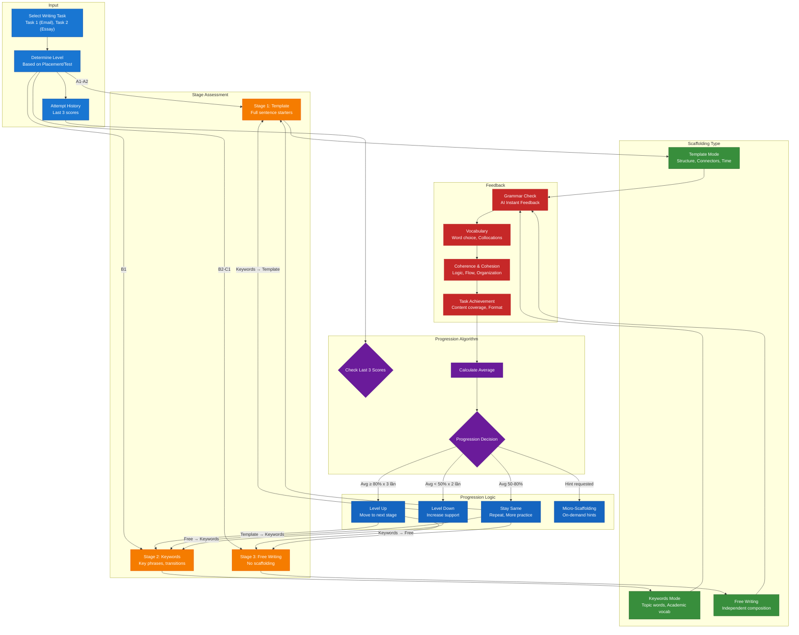

#### Progression Rules

| Current Stage | Condition | Action | Next Stage |
|---------------|-----------|--------|------------|
| Template | Avg ≥ 80% across 3 attempts | Level Up | Keywords |
| Template | Avg < 50% across 2 attempts | Stay + More support | Template (add hints) |
| Keywords | Avg ≥ 75% across 3 attempts | Level Up | Free |
| Keywords | Avg < 60% across 2 attempts | Level Down | Template |
| Keywords | 60-75% range | Stay | Keywords |
| Free | Avg ≥ 70% across 3 attempts | Maintain | Free (increase difficulty) |
| Free | Avg < 65% across 2 attempts | Level Down | Keywords |

### 7B. Listening Adaptive Scaffolding

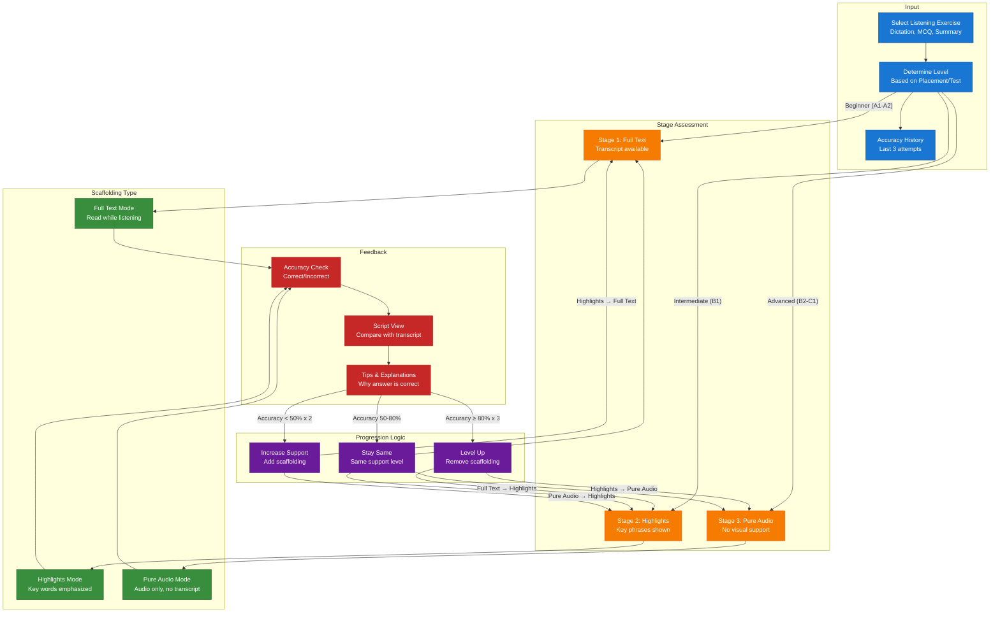

---

## 8. Luồng Mock Test

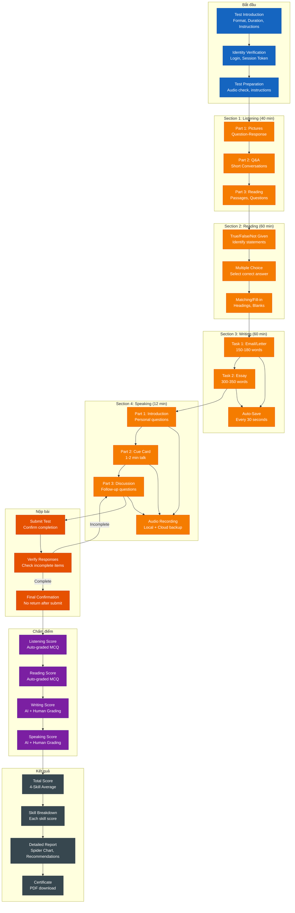

---

## 9. Luồng Progress Tracking & Learning Path

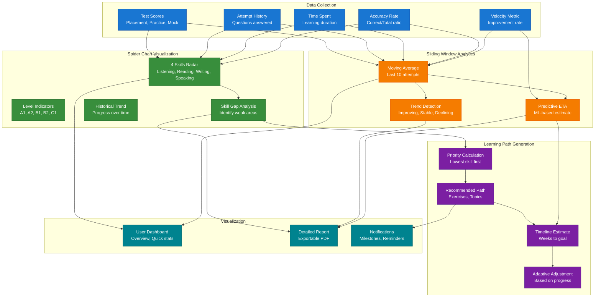

---

## 10. Authentication & RBAC

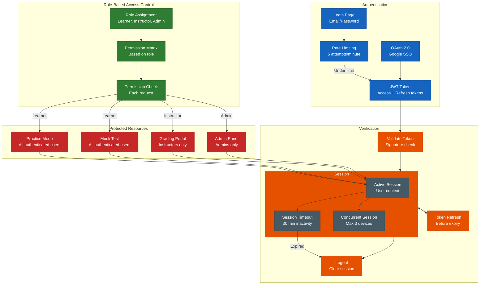

---

## 11. Design System & Style Guide

### 11.1 Tổng Quan Thiết Kế

**Phong cách:** Editorial × Modern SaaS

Kết hợp sự tinh tế của ấn phẩm chất lượng cao với độ chính xác kỹ thuật của dashboard hiện đại. Phong cách này truyền tải sự uy tín học thuật trong khi vẫn giữ giao diện thân thiện, dễ tiếp cận cho người học.

**Nguyên tắc ngôn ngữ:** Sử dụng tiếng Việt cho toàn bộ giao diện người dùng, đảm bảo sự nhất quán và thân thiện với người học Việt Nam.

### 11.2 Hệ Thống Màu Sắc

```css
/* Primary Colors */
--primary-teal: #0D6E6E;
--primary-orange: #E07B54;

/* Backgrounds */
--bg-page: #FAFAFA;
--bg-surface: #FFFFFF;
--bg-muted: #F8F8F8;
--bg-control: #F0F0F0;

/* Text Hierarchy */
--text-primary: #1A1A1A;
--text-secondary: #666666;
--text-tertiary: #888888;
--text-muted: #AAAAAA;

/* Borders */
--border-primary: #E5E5E5;
--border-divider: #F0F0F0;

/* Status Colors */
--status-success: #0D6E6E;  /* Teal */
--status-progress: #E07B54; /* Orange */
--status-pending: #DDDDDD;
--status-error: #C62828;    /* Red */
```

### 11.3 Typography

| Font | Usage | Weight |
|------|-------|--------|
| **Newsreader** (Serif) | Tiêu đề, headings | 500 |
| **JetBrains Mono** | Labels, data, kỹ thuật | 500-600 |
| **Inter** | Body text, UI elements | 400-600 |

**Ví dụ UI Labels:**
- "Chào mừng trở lại" (Welcome back)
- "Nền tảng luyện thi VSTEP thông minh" (Tagline)
- "Email", "Mật khẩu", "Đăng nhập" (Form fields)

**Type Scale:**
- Display: 40px (Large titles)
- H1: 32px (Metrics)
- H2: 24px (Section headings)
- H3: 18px (Card titles)
- Body: 14-15px
- Caption: 11px (uppercase monospace labels)

### 11.4 Component Patterns

**Buttons:**
- Corner radius: 8px
- Primary: Fill #0D6E6E, Text white - "Đăng nhập"
- Secondary: Fill white, Stroke #E5E5E5 - "Google", "GitHub"

**Input Fields:**
- Corner radius: 8px
- Fill: #FAFAFA
- Stroke: 1px #E5E5E5
- Height: 48px
- Labels: "Email", "Mật khẩu"

**Cards:**
- Corner radius: 12px
- Fill: #FFFFFF
- Stroke: 1px #E5E5E5
- Padding: 24px internal

**Status Indicators:**
- PENDING: Gray dot + "Đang chờ..."
- PROCESSING: Orange pulse + "Đang chấm..."
- COMPLETED: Green check + "Hoàn thành"
- ERROR: Red alert + "Có lỗi xảy ra"

**Section Labels:**
- Font: JetBrains Mono
- Size: 11px
- Transform: uppercase
- Letter-spacing: 2px
- Color: #888888

### 11.5 Spacing System

| Scale | Value | Usage |
|-------|-------|-------|
| xs | 2-4px | Tight stacks |
| sm | 8px | Badges, buttons |
| md | 12-16px | Card internals |
| lg | 24px | Section padding |
| xl | 32px | Section gaps |

### 11.6 Design Assets

Thiết kế UI được lưu trong thư mục `.claude/pencil/` với định dạng `.pen`.

---

## Tóm Tắt Sơ Đồ

| Sơ đồ | Mục đích | Thành phần chính |
|-------|----------|------------------|
| **1. Kiến trúc Hệ thống** | Multi-Language Services | Bun (API/Core) + Python/Rust/Go (Grading) - Separate DB, Queue-based, Real-time updates |
| **2. Error Handling** | Failure Recovery | Retry logic, Circuit breaker, Dead Letter Queue, Compensation |
| **3. Data Consistency** | Saga Pattern | Saga orchestrator, Event sourcing, Compensation actions |
| **4. Real-time Updates** | Status Notifications | WebSocket/SSE, Connection management, State sync |
| **5. Hybrid Grading** | AI + Human với Confidence | Confidence formula, Routing logic, Weighted scoring |
| **6. Hành trình Người dùng** | Vòng đời người học | Registration → Goal → Self-Assessment → Practice/Mock Test |
| **7A. Practice - Writing** | Adaptive Scaffolding Viết | Template → Keywords → Free với progression algorithm |
| **7B. Practice - Listening** | Adaptive Scaffolding Nghe | Full Text → Highlights → Pure Audio |
| **8. Mock Test Flow** | Thi thử giả lập | 4 Sections, Timer, Auto-save, Scoring, Results Report |
| **9. Progress Tracking** | Analytics & visualization | Spider Chart, Sliding Window, Predictive ETA, Learning Path |
| **10. Authentication & RBAC** | Bảo mật & phân quyền | JWT, OAuth, Rate limiting, Session management |
| **11. Design System** | UI/UX Guidelines | Editorial style, color system, typography, status indicators |

---

**Tóm tắt hệ thống:** Hệ thống ưu tiên giảm friction cho người học bằng cách cho phép chọn mục tiêu trước, sau đó sử dụng self-assessment và dữ liệu hành vi ban đầu để hiệu chỉnh mức độ học tập dần theo thời gian. Kiến trúc multi-language với queue-based communication đảm bảo scalability, trong khi hybrid grading với confidence score cân bằng automation và accuracy. Real-time updates và comprehensive error handling đảm bảo trải nghiệm người dùng mượt mà.

*Cập nhật cho Hệ thống Luyện Thi VSTEP Thích Ứng (SP26SE145)*
