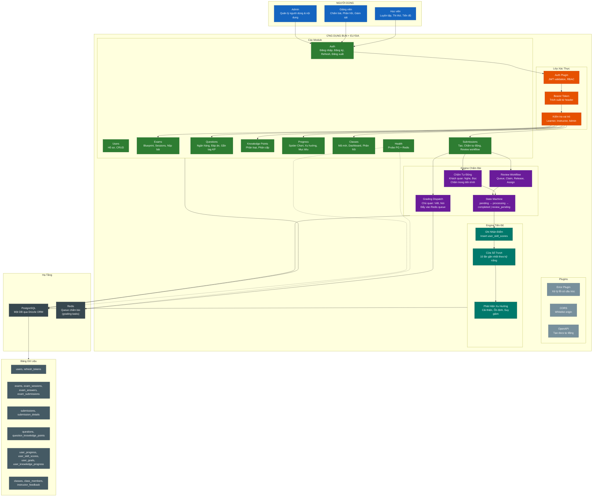
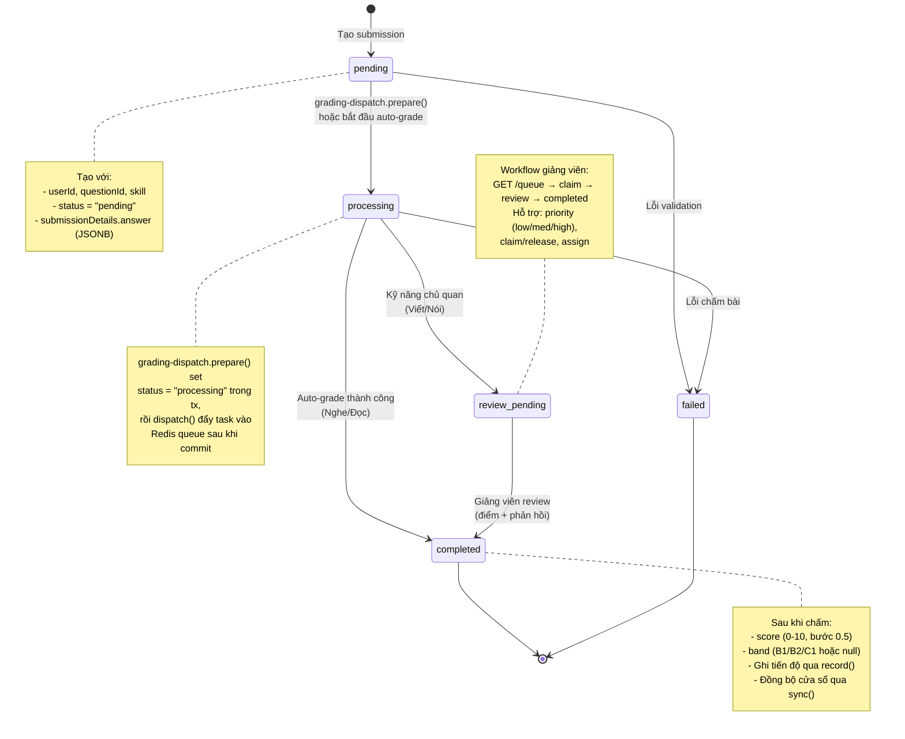
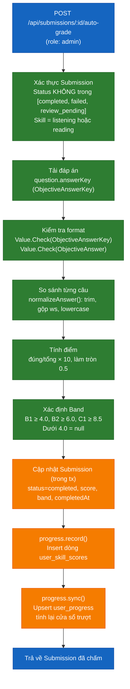
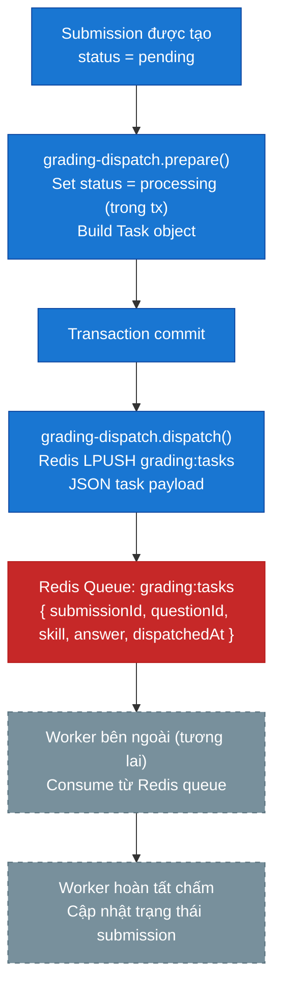
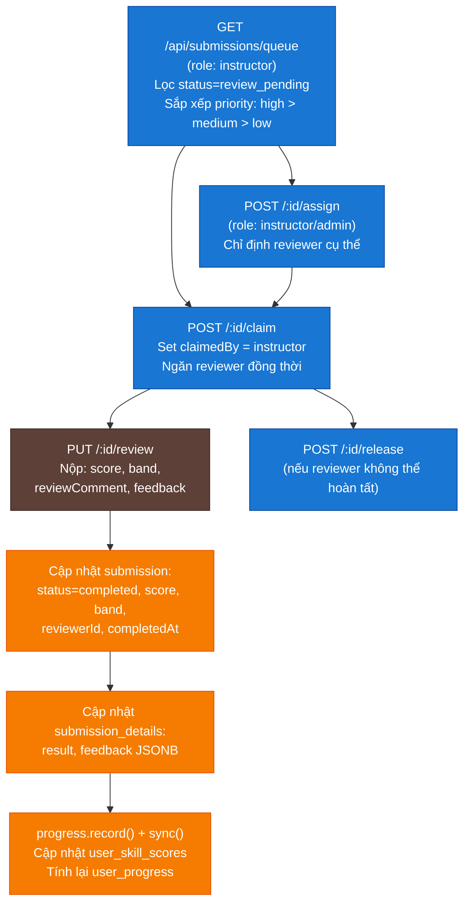
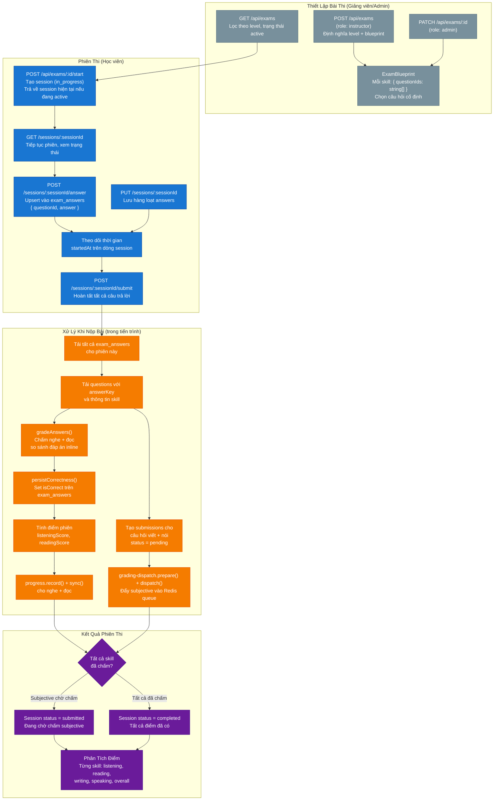
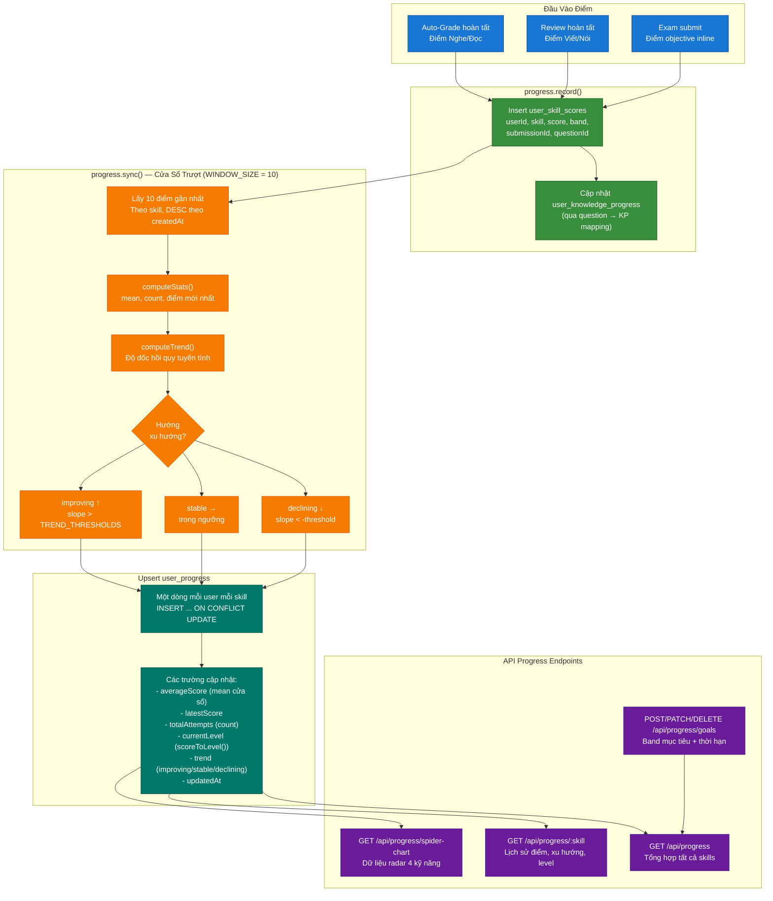
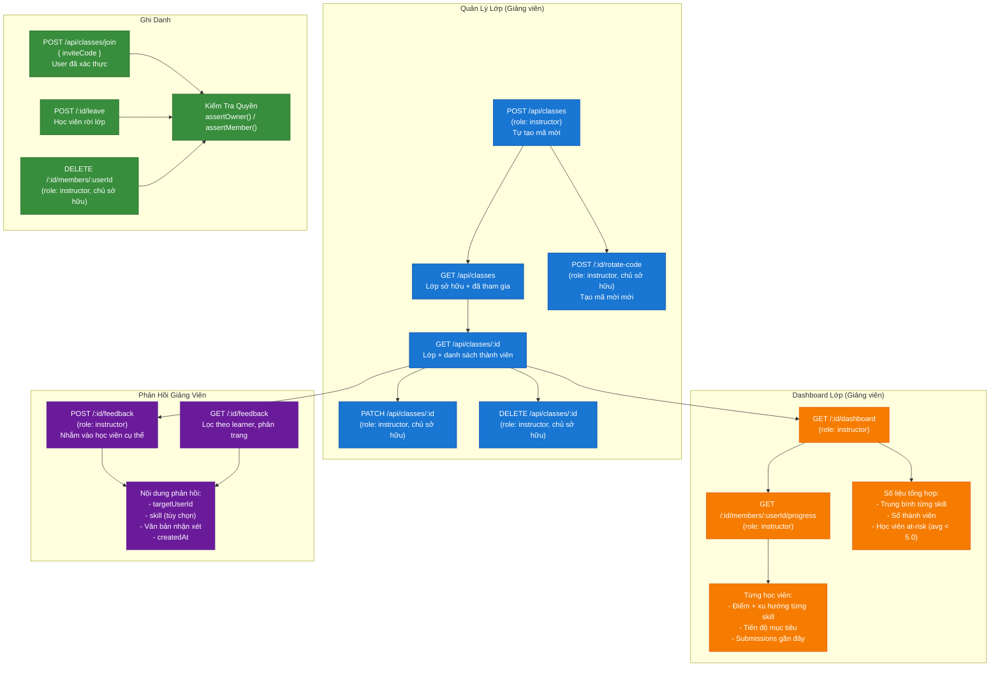
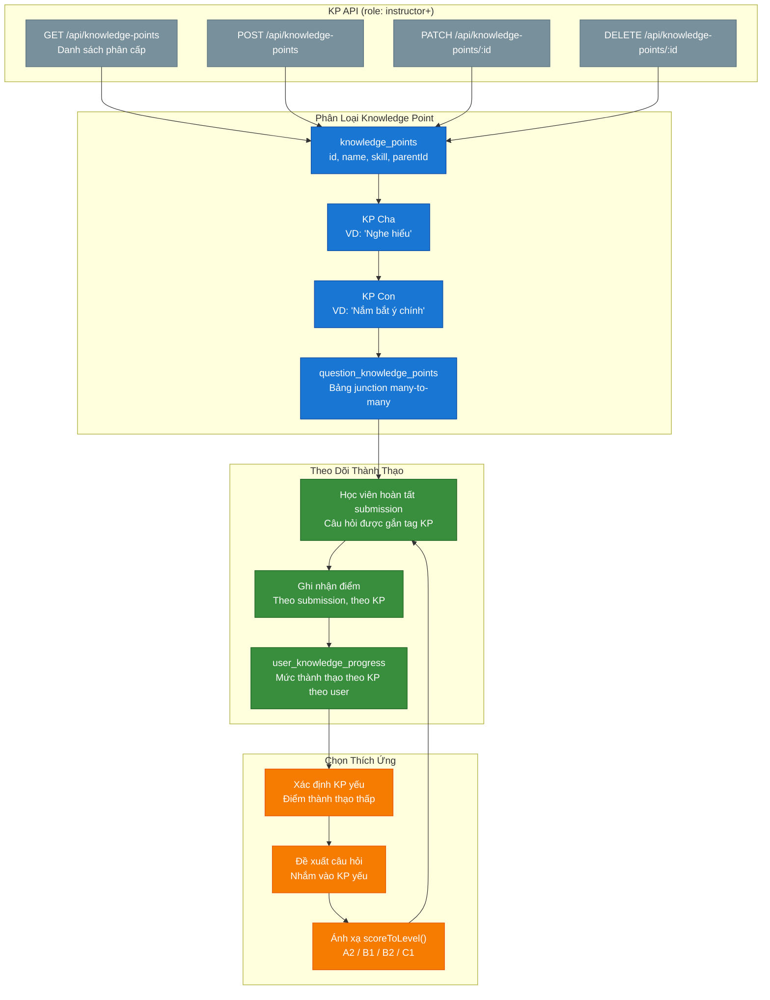

# Sơ Đồ Luồng Hệ Thống Luyện Thi VSTEP Thích Ứng

---

## 1. Kiến Trúc Tổng Quan


```mermaid
flowchart TB
    subgraph Users ["NGƯỜI DÙNG"]
        L["Học viên<br/>Luyện tập, Thi thử, Tiến độ"]
        I["Giảng viên<br/>Chấm bài, Phản hồi, Giám sát"]
        A["Admin<br/>Quản lý người dùng & nội dung"]
    end

    subgraph BunApp ["ỨNG DỤNG BUN + ELYSIA"]
        subgraph Plugins ["Plugins"]
            ErrorPlugin["Error Plugin<br/>Xử lý lỗi có cấu trúc"]
            CORS["CORS<br/>Whitelist origin"]
            OpenAPI["OpenAPI<br/>Tạo docs tự động"]
        end

        subgraph AuthLayer ["Lớp Xác Thực"]
            AuthPlugin["Auth Plugin<br/>JWT validation, RBAC"]
            Bearer["Bearer Token<br/>Trích xuất từ header"]
            RoleCheck["Kiểm tra vai trò<br/>Learner, Instructor, Admin"]
        end

        subgraph Modules ["Các Module"]
            Auth["Auth<br/>Đăng nhập, Đăng ký, Refresh, Đăng xuất"]
            UsersMod["Users<br/>Hồ sơ, CRUD"]
            ExamsMod["Exams<br/>Blueprint, Sessions, Nộp bài"]
            SubsMod["Submissions<br/>Tạo, Chấm tự động, Review workflow"]
            QuestionsMod["Questions<br/>Ngân hàng, Đáp án, Gắn tag KP"]
            KPMod["Knowledge Points<br/>Phân loại, Phân cấp"]
            ProgressMod["Progress<br/>Spider Chart, Xu hướng, Mục tiêu"]
            ClassesMod["Classes<br/>Mã mời, Dashboard, Phản hồi"]
            HealthMod["Health<br/>Probe PG + Redis"]
        end

        subgraph Grading ["Engine Chấm Bài"]
            AutoGrade["Chấm Tự Động<br/>Khách quan: Nghe, Đọc<br/>Chấm trong tiến trình"]
            GradingDispatch["Grading Dispatch<br/>Chủ quan: Viết, Nói<br/>Đẩy vào Redis queue"]
            ReviewWorkflow["Review Workflow<br/>Queue, Claim, Release, Assign"]
            StateMachine["State Machine<br/>pending → processing →<br/>completed | review_pending"]
        end

        subgraph ProgressEngine ["Engine Tiến Độ"]
            SlidingWindow["Cửa Sổ Trượt<br/>10 lần gần nhất theo kỹ năng"]
            TrendDetect["Phát Hiện Xu Hướng<br/>Cải thiện, Ổn định, Suy giảm"]
            ScoreRecord["Ghi Nhận Điểm<br/>Insert user_skill_scores"]
        end
    end

    subgraph Infrastructure ["Hạ Tầng"]
        PG["PostgreSQL<br/>Một DB qua Drizzle ORM"]
        Redis["Redis<br/>Queue chấm bài<br/>(grading:tasks)"]
    end

    subgraph Tables ["Bảng Dữ Liệu"]
        UsersT["users, refresh_tokens"]
        ExamsT["exams, exam_sessions,<br/>exam_answers, exam_submissions"]
        SubsT["submissions, submission_details"]
        QuestionsT["questions, question_knowledge_points"]
        ProgressT["user_progress, user_skill_scores,<br/>user_goals, user_knowledge_progress"]
        ClassesT["classes, class_members,<br/>instructor_feedback"]
    end

    L --> Auth
    I --> Auth
    A --> Auth
    Auth --> AuthPlugin
    AuthPlugin --> Bearer
    Bearer --> RoleCheck

    RoleCheck --> ExamsMod
    RoleCheck --> SubsMod
    RoleCheck --> ProgressMod
    RoleCheck --> ClassesMod
    RoleCheck --> QuestionsMod
    RoleCheck --> KPMod

    SubsMod --> AutoGrade
    SubsMod --> GradingDispatch
    SubsMod --> ReviewWorkflow
    AutoGrade --> StateMachine
    GradingDispatch --> Redis
    ReviewWorkflow --> StateMachine

    StateMachine --> ScoreRecord
    ScoreRecord --> SlidingWindow
    SlidingWindow --> TrendDetect

    Modules --> PG
    Grading --> PG
    ProgressEngine --> PG
    PG --> Tables
    HealthMod -.-> PG
    HealthMod -.-> Redis

    classDef users fill:#1565c0,stroke:#0d47a1,color:#fff
    classDef plugins fill:#78909c,stroke:#546e7a,color:#fff
    classDef auth fill:#e65100,stroke:#bf360c,color:#fff
    classDef modules fill:#2e7d32,stroke:#1b5e20,color:#fff
    classDef grading fill:#6a1b9a,stroke:#4a148c,color:#fff
    classDef progress fill:#00796b,stroke:#004d40,color:#fff
    classDef infra fill:#37474f,stroke:#263238,color:#fff
    classDef tables fill:#455a64,stroke:#37474f,color:#fff

    class L,I,A users
    class ErrorPlugin,CORS,OpenAPI plugins
    class AuthPlugin,Bearer,RoleCheck auth
    class Auth,UsersMod,ExamsMod,SubsMod,QuestionsMod,KPMod,ProgressMod,ClassesMod,HealthMod modules
    class AutoGrade,GradingDispatch,ReviewWorkflow,StateMachine grading
    class SlidingWindow,TrendDetect,ScoreRecord progress
    class PG,Redis infra
    class UsersT,ExamsT,SubsT,QuestionsT,ProgressT,ClassesT tables
```

> **Ghi chú kiến trúc:**
> - **Monolithic**: Một ứng dụng Bun + Elysia — tất cả module trong một process
> - **PostgreSQL**: Một database duy nhất, quản lý qua Drizzle ORM
> - **Redis**: Dùng cho queue dispatch chấm bài (`grading:tasks` qua `LPUSH`), health-check qua TCP probe
> - **JWT Auth**: Access token (ngắn hạn) + Refresh token (dài hạn, xoay vòng) qua `jose`
> - **Hash mật khẩu**: Argon2id qua `Bun.password.hash()`
> - **State machine**: FSM tái sử dụng (`createStateMachine`) cho vòng đời submission
> - **Elysia plugins**: CORS, OpenAPI (auto-docs), xử lý lỗi, auth guard với role levels

---

## 2. Luồng Hành Trình Người Dùng


```mermaid
flowchart LR
    Start(["Bắt đầu"])
    Reg["Đăng ký<br/>Email + Mật khẩu<br/>(role = learner)"]
    Login["Đăng nhập<br/>JWT Access + Refresh"]
    Select["Chọn Chế Độ<br/>Luyện tập hoặc Thi"]

    subgraph PracticeFlow ["Chế Độ Luyện Tập"]
        PickQ["Chọn Câu Hỏi<br/>Theo skill, level, KP"]
        Submit["Tạo Submission<br/>POST /api/submissions"]
        Processing{"Loại<br/>kỹ năng?"}
        AutoResult["Chấm Tự Động<br/>pending → processing → completed"]
        DispatchQ["Dispatch lên Redis<br/>pending → processing"]
        ReviewQ["Hàng Đợi Review<br/>processing → review_pending"]
        InstructorGrade["Giảng Viên Chấm<br/>Claim → Grade → completed"]
    end

    subgraph ExamFlow ["Chế Độ Thi"]
        StartExam["Bắt Đầu Phiên<br/>POST /api/exams/:id/start"]
        Answer["Lưu Câu Trả Lời<br/>POST /sessions/:id/answer"]
        SubmitExam["Nộp Bài Thi<br/>Chấm obj inline<br/>Dispatch subj lên Redis"]
        ExamResult["Kết Quả Thi<br/>Điểm từng skill trên session"]
    end

    Progress["Dashboard Tiến Độ<br/>Spider chart, xu hướng, mục tiêu"]
    ClassJoin["Tham Gia Lớp<br/>POST /api/classes/join<br/>(mã mời)"]
    GoalCheck{"Đạt<br/>mục tiêu?"}
    End(["Kết thúc"])

    Start --> Reg
    Reg --> Login
    Login --> Select
    Select --> PickQ
    Select --> StartExam

    PickQ --> Submit
    Submit --> Processing
    Processing -->|"Nghe / Đọc"| AutoResult
    Processing -->|"Viết / Nói"| DispatchQ
    DispatchQ --> ReviewQ
    ReviewQ --> InstructorGrade
    AutoResult --> Progress
    InstructorGrade --> Progress

    StartExam --> Answer
    Answer --> SubmitExam
    SubmitExam --> ExamResult
    ExamResult --> Progress

    Progress --> GoalCheck
    Progress --> ClassJoin
    GoalCheck -->|Chưa| Select
    GoalCheck -->|Rồi| End

    classDef start fill:#1565c0,stroke:#0d47a1,color:#fff
    classDef process fill:#1976d2,stroke:#0d47a1,color:#fff
    classDef decision fill:#f57c00,stroke:#e65100,color:#fff
    classDef practice fill:#388e3c,stroke:#1b5e20,color:#fff
    classDef exam fill:#6a1b9a,stroke:#4a148c,color:#fff

    class Start,End start
    class Reg,Login,Select,Progress,ClassJoin process
    class Processing,GoalCheck decision
    class PickQ,Submit,AutoResult,DispatchQ,ReviewQ,InstructorGrade practice
    class StartExam,Answer,SubmitExam,ExamResult exam
```

---

## 3. State Machine Submission


```mermaid
stateDiagram-v2
    [*] --> pending: Tạo submission

    pending --> processing: grading-dispatch.prepare()<br/>hoặc bắt đầu auto-grade
    pending --> failed: Lỗi validation

    processing --> completed: Auto-grade thành công<br/>(Nghe/Đọc)
    processing --> review_pending: Kỹ năng chủ quan<br/>(Viết/Nói)
    processing --> failed: Lỗi chấm bài

    review_pending --> completed: Giảng viên review<br/>(điểm + phản hồi)

    completed --> [*]
    failed --> [*]

    note right of pending
        Tạo với:
        - userId, questionId, skill
        - status = "pending"
        - submissionDetails.answer (JSONB)
    end note

    note right of processing
        grading-dispatch.prepare() set
        status = "processing" trong tx,
        rồi dispatch() đẩy task vào
        Redis queue sau khi commit
    end note

    note left of review_pending
        Workflow giảng viên:
        GET /queue → claim → review → completed
        Hỗ trợ: priority (low/med/high),
        claim/release, assign
    end note

    note right of completed
        Sau khi chấm:
        - score (0-10, bước 0.5)
        - band (B1/B2/C1 hoặc null)
        - Ghi tiến độ qua record()
        - Đồng bộ cửa sổ qua sync()
    end note
```

> **Chuyển trạng thái (từ `shared.ts`):**
> ```
> pending     → [processing, failed]
> processing  → [completed, review_pending, failed]
> review_pending → [completed]
> completed   → [] (terminal)
> failed      → [] (terminal)
> ```
>
> **GRADABLE_STATUSES:** `pending`, `review_pending`, `processing`
> **MUTABLE_STATUSES:** `pending` (chỉ submission pending mới được learner cập nhật)

### 3A. Luồng Chấm Tự Động (Nghe & Đọc)


```mermaid
flowchart TB
    Start["POST /api/submissions/:id/auto-grade<br/>(role: admin)"]
    Validate["Xác thực Submission<br/>Status KHÔNG trong [completed, failed, review_pending]<br/>Skill = listening hoặc reading"]
    LoadKey["Tải đáp án<br/>question.answerKey (ObjectiveAnswerKey)"]
    CheckFormat["Kiểm tra format<br/>Value.Check(ObjectiveAnswerKey)<br/>Value.Check(ObjectiveAnswer)"]
    Compare["So sánh từng câu<br/>normalizeAnswer(): trim, gộp ws, lowercase"]
    Calculate["Tính điểm<br/>đúng/tổng × 10, làm tròn 0.5"]
    Band["Xác định Band<br/>B1 ≥ 4.0, B2 ≥ 6.0, C1 ≥ 8.5<br/>Dưới 4.0 = null"]
    Update["Cập nhật Submission (trong tx)<br/>status=completed, score, band, completedAt"]
    RecordProgress["progress.record()<br/>Insert dòng user_skill_scores"]
    SyncWindow["progress.sync()<br/>Upsert user_progress<br/>tính lại cửa sổ trượt"]
    Done["Trả về Submission đã chấm"]

    Start --> Validate
    Validate --> LoadKey
    LoadKey --> CheckFormat
    CheckFormat --> Compare
    Compare --> Calculate
    Calculate --> Band
    Band --> Update
    Update --> RecordProgress
    RecordProgress --> SyncWindow
    SyncWindow --> Done

    classDef endpoint fill:#1565c0,stroke:#0d47a1,color:#fff
    classDef logic fill:#2e7d32,stroke:#1b5e20,color:#fff
    classDef data fill:#f57c00,stroke:#e65100,color:#fff

    class Start,Done endpoint
    class Validate,LoadKey,CheckFormat,Compare,Calculate,Band logic
    class Update,RecordProgress,SyncWindow data
```

### 3B. Luồng Grading Dispatch (Viết & Nói)


```mermaid
flowchart TB
    Create["Submission được tạo<br/>status = pending"]
    Prepare["grading-dispatch.prepare()<br/>Set status = processing (trong tx)<br/>Build Task object"]
    Commit["Transaction commit"]
    Dispatch["grading-dispatch.dispatch()<br/>Redis LPUSH grading:tasks<br/>JSON task payload"]
    Queue["Redis Queue: grading:tasks<br/>{ submissionId, questionId, skill, answer, dispatchedAt }"]
    Worker["Worker bên ngoài (tương lai)<br/>Consume từ Redis queue"]
    Callback["Worker hoàn tất chấm<br/>Cập nhật trạng thái submission"]

    Create --> Prepare
    Prepare --> Commit
    Commit --> Dispatch
    Dispatch --> Queue
    Queue --> Worker
    Worker --> Callback

    classDef app fill:#1976d2,stroke:#0d47a1,color:#fff
    classDef redis fill:#c62828,stroke:#b71c1c,color:#fff
    classDef future fill:#78909c,stroke:#546e7a,color:#fff,stroke-dasharray: 5 5

    class Create,Prepare,Commit,Dispatch app
    class Queue redis
    class Worker,Callback future
```

### 3C. Review Workflow (Giảng Viên)


```mermaid
flowchart TB
    Queue["GET /api/submissions/queue<br/>(role: instructor)<br/>Lọc status=review_pending<br/>Sắp xếp priority: high > medium > low"]
    Claim["POST /:id/claim<br/>Set claimedBy = instructor<br/>Ngăn reviewer đồng thời"]
    Review["PUT /:id/review<br/>Nộp: score, band,<br/>reviewComment, feedback"]
    Record["Cập nhật submission:<br/>status=completed, score, band,<br/>reviewerId, completedAt"]
    InsertReview["Cập nhật submission_details:<br/>result, feedback JSONB"]
    Progress["progress.record() + sync()<br/>Cập nhật user_skill_scores<br/>Tính lại user_progress"]
    Release["POST /:id/release<br/>(nếu reviewer không thể hoàn tất)"]
    Assign["POST /:id/assign<br/>(role: instructor/admin)<br/>Chỉ định reviewer cụ thể"]

    Queue --> Claim
    Claim --> Review
    Review --> Record
    Record --> InsertReview
    InsertReview --> Progress

    Claim --> Release
    Queue --> Assign
    Assign --> Claim

    classDef route fill:#1976d2,stroke:#0d47a1,color:#fff
    classDef action fill:#5d4037,stroke:#3e2723,color:#fff
    classDef data fill:#f57c00,stroke:#e65100,color:#fff

    class Queue,Claim,Release,Assign route
    class Review action
    class Record,InsertReview,Progress data
```

---

## 4. Luồng Phiên Thi (Exam Session)


```mermaid
flowchart TB
    subgraph Setup ["Thiết Lập Bài Thi (Giảng viên/Admin)"]
        CreateExam["POST /api/exams<br/>(role: instructor)<br/>Định nghĩa level + blueprint"]
        Blueprint["ExamBlueprint<br/>Mỗi skill: { questionIds: string[] }<br/>Chọn câu hỏi cố định"]
        ListExams["GET /api/exams<br/>Lọc theo level, trạng thái active"]
        UpdateExam["PATCH /api/exams/:id<br/>(role: admin)"]
    end

    subgraph Session ["Phiên Thi (Học viên)"]
        Start["POST /api/exams/:id/start<br/>Tạo session (in_progress)<br/>Trả về session hiện tại nếu đang active"]
        FindSession["GET /sessions/:sessionId<br/>Tiếp tục phiên, xem trạng thái"]
        SaveAnswer["POST /sessions/:sessionId/answer<br/>Upsert vào exam_answers<br/>{ questionId, answer }"]
        UpdateSession["PUT /sessions/:sessionId<br/>Lưu hàng loạt answers"]
        Timer["Theo dõi thời gian<br/>startedAt trên dòng session"]
        Submit["POST /sessions/:sessionId/submit<br/>Hoàn tất tất cả câu trả lời"]
    end

    subgraph SubmitLogic ["Xử Lý Khi Nộp Bài (trong tiến trình)"]
        LoadAnswers["Tải tất cả exam_answers<br/>cho phiên này"]
        LoadQuestions["Tải questions với answerKey<br/>và thông tin skill"]
        GradeObjective["gradeAnswers()<br/>Chấm nghe + đọc<br/>so sánh đáp án inline"]
        PersistCorrectness["persistCorrectness()<br/>Set isCorrect trên exam_answers"]
        CreateSubjective["Tạo submissions cho<br/>câu hỏi viết + nói<br/>status = pending"]
        DispatchRedis["grading-dispatch.prepare() + dispatch()<br/>Đẩy subjective vào Redis queue"]
        CalcScores["Tính điểm phiên<br/>listeningScore, readingScore"]
        RecordObjective["progress.record() + sync()<br/>cho nghe + đọc"]
    end

    subgraph Result ["Kết Quả Phiên Thi"]
        SessionStatus{"Tất cả skill<br/>đã chấm?"}
        Submitted["Session status = submitted<br/>Đang chờ chấm subjective"]
        Completed["Session status = completed<br/>Tất cả điểm đã có"]
        Breakdown["Phân Tích Điểm<br/>Từng skill: listening, reading,<br/>writing, speaking, overall"]
    end

    CreateExam --> Blueprint
    ListExams --> Start
    UpdateExam --> Blueprint
    Start --> FindSession
    FindSession --> SaveAnswer
    SaveAnswer --> Timer
    UpdateSession --> Timer
    Timer --> Submit

    Submit --> LoadAnswers
    LoadAnswers --> LoadQuestions
    LoadQuestions --> GradeObjective
    GradeObjective --> PersistCorrectness
    PersistCorrectness --> CalcScores
    CalcScores --> RecordObjective
    LoadQuestions --> CreateSubjective
    CreateSubjective --> DispatchRedis

    RecordObjective --> SessionStatus
    DispatchRedis --> SessionStatus
    SessionStatus -->|"Subjective chờ chấm"| Submitted
    SessionStatus -->|"Tất cả đã chấm"| Completed
    Submitted --> Breakdown
    Completed --> Breakdown

    classDef setup fill:#78909c,stroke:#546e7a,color:#fff
    classDef session fill:#1976d2,stroke:#0d47a1,color:#fff
    classDef submit fill:#f57c00,stroke:#e65100,color:#fff
    classDef result fill:#6a1b9a,stroke:#4a148c,color:#fff

    class CreateExam,Blueprint,ListExams,UpdateExam setup
    class Start,FindSession,SaveAnswer,UpdateSession,Timer,Submit session
    class LoadAnswers,LoadQuestions,GradeObjective,PersistCorrectness,CreateSubjective,DispatchRedis,CalcScores,RecordObjective submit
    class SessionStatus,Submitted,Completed,Breakdown result
```

> **Trạng thái Exam Session:** `in_progress` → `submitted` → `completed` | `abandoned`
>
> **Cột trên session:** listeningScore, readingScore, writingScore, speakingScore, overallScore, overallBand
>
> **Luồng submit:**
> 1. Chấm objective (nghe/đọc) inline qua `gradeAnswers()` — so sánh đáp án, tính điểm
> 2. Set `isCorrect` trên mỗi `exam_answer` qua `persistCorrectness()`
> 3. Tạo `submissions` + `submission_details` cho câu hỏi subjective (viết/nói)
> 4. Liên kết qua bảng junction `exam_submissions`
> 5. Dispatch subjective tasks vào Redis qua `grading-dispatch`
> 6. Ghi điểm objective vào progress
> 7. Set trạng thái session: `submitted` (nếu subjective chờ) hoặc `completed` (nếu tất cả xong)

---

## 5. Theo Dõi Tiến Độ & Cửa Sổ Trượt


```mermaid
flowchart TB
    subgraph Input ["Đầu Vào Điểm"]
        AutoScore["Auto-Grade hoàn tất<br/>Điểm Nghe/Đọc"]
        ManualScore["Review hoàn tất<br/>Điểm Viết/Nói"]
        ExamScore["Exam submit<br/>Điểm objective inline"]
    end

    subgraph Record ["progress.record()"]
        InsertScore["Insert user_skill_scores<br/>userId, skill, score, band,<br/>submissionId, questionId"]
        UpdateKP["Cập nhật user_knowledge_progress<br/>(qua question → KP mapping)"]
    end

    subgraph SlidingWindow ["progress.sync() — Cửa Sổ Trượt (WINDOW_SIZE = 10)"]
        Fetch["Lấy 10 điểm gần nhất<br/>Theo skill, DESC theo createdAt"]
        ComputeStats["computeStats()<br/>mean, count, điểm mới nhất"]
        ComputeTrend["computeTrend()<br/>Độ dốc hồi quy tuyến tính"]
        Direction{"Hướng<br/>xu hướng?"}
        Improving["improving ↑<br/>slope > TREND_THRESHOLDS"]
        Stable["stable →<br/>trong ngưỡng"]
        Declining["declining ↓<br/>slope < -threshold"]
    end

    subgraph Sync ["Upsert user_progress"]
        Upsert["Một dòng mỗi user mỗi skill<br/>INSERT ... ON CONFLICT UPDATE"]
        Fields["Các trường cập nhật:<br/>- averageScore (mean cửa sổ)<br/>- latestScore<br/>- totalAttempts (count)<br/>- currentLevel (scoreToLevel())<br/>- trend (improving/stable/declining)<br/>- updatedAt"]
    end

    subgraph API ["API Progress Endpoints"]
        SpiderChart["GET /api/progress/spider-chart<br/>Dữ liệu radar 4 kỹ năng"]
        SkillDetail["GET /api/progress/:skill<br/>Lịch sử điểm, xu hướng, level"]
        Overview["GET /api/progress<br/>Tổng hợp tất cả skills"]
        Goals["POST/PATCH/DELETE /api/progress/goals<br/>Band mục tiêu + thời hạn"]
    end

    AutoScore --> InsertScore
    ManualScore --> InsertScore
    ExamScore --> InsertScore
    InsertScore --> UpdateKP
    InsertScore --> Fetch
    Fetch --> ComputeStats
    ComputeStats --> ComputeTrend
    ComputeTrend --> Direction
    Direction --> Improving
    Direction --> Stable
    Direction --> Declining
    Improving --> Upsert
    Stable --> Upsert
    Declining --> Upsert
    Upsert --> Fields

    Fields --> SpiderChart
    Fields --> SkillDetail
    Fields --> Overview
    Goals --> Overview

    classDef input fill:#1976d2,stroke:#0d47a1,color:#fff
    classDef record fill:#388e3c,stroke:#1b5e20,color:#fff
    classDef window fill:#f57c00,stroke:#e65100,color:#fff
    classDef sync fill:#00796b,stroke:#004d40,color:#fff
    classDef api fill:#6a1b9a,stroke:#4a148c,color:#fff

    class AutoScore,ManualScore,ExamScore input
    class InsertScore,UpdateKP record
    class Fetch,ComputeStats,ComputeTrend,Direction,Improving,Stable,Declining window
    class Upsert,Fields sync
    class SpiderChart,SkillDetail,Overview,Goals api
```

> **Quy tắc tính điểm:**
> - Phạm vi: 0–10 (bước 0.5: `precision: 3, scale: 1`)
> - Ngưỡng band: B1 ≥ 4.0, B2 ≥ 6.0, C1 ≥ 8.5 (dưới 4.0 = null)
> - `scoreToLevel()`: C1 ≥ 8.5, B2 ≥ 6.0, B1 ≥ 4.0, còn lại A2
> - `calculateScore(correct, total)`: `Math.round(ratio × 10 × 2) / 2` — tuyến tính, làm tròn nửa
> - Xu hướng tính qua độ dốc hồi quy tuyến tính trên cửa sổ điểm
>
> **Instructor progress view:** `progress/instructor.ts` → `forUsers()` tổng hợp dữ liệu từng user từng skill với phát hiện at-risk (`avg < 5.0`), dùng bởi class dashboard

---

## 6. Xác Thực & Vòng Đời Token


```mermaid
flowchart TB
    subgraph Login ["Luồng Đăng Nhập"]
        Creds["POST /api/auth/login<br/>email + mật khẩu"]
        Verify["Bun.password.verify()<br/>So sánh với hash argon2id"]
        GenAccess["SignJWT (jose)<br/>Claims: sub, role, iat<br/>Hạn: env.JWT_EXPIRES_IN"]
        GenRefresh["crypto.randomUUID()<br/>Lưu hash SHA-256 vào DB"]
        DeviceInfo["Ghi User-Agent<br/>Trên dòng refresh_tokens"]
        MaxCheck["Đếm token đang active<br/>cho user này"]
        Prune["Xóa cũ nhất nếu ><br/>MAX_REFRESH_TOKENS_PER_USER (3)"]
    end

    subgraph Register ["Đăng Ký"]
        RegInput["POST /api/auth/register<br/>email, password, fullName"]
        NormEmail["normalizeEmail()<br/>Lowercase, trim"]
        DupCheck["Ràng buộc email unique<br/>409 nếu trùng"]
        HashPwd["Bun.password.hash(pw, 'argon2id')"]
        CreateUser["Insert user<br/>role = learner (mặc định)"]
    end

    subgraph Refresh ["Làm Mới Token (Xoay Vòng)"]
        RefreshReq["POST /api/auth/refresh<br/>{ refreshToken }"]
        HashLookup["hashToken(refreshToken)<br/>SHA-256 → tìm theo tokenHash"]
        CheckValid["Kiểm tra: chưa thu hồi,<br/>chưa hết hạn, chưa bị thay"]
        FamilyDetect{"Token đã<br/>bị thay?"}
        RevokeFamily["PHÁT HIỆN REPLAY<br/>Thu hồi TẤT CẢ token trong family<br/>(phản ứng vi phạm bảo mật)"]
        RevokeOld["Thu hồi token cũ<br/>Set revokedAt + replacedByJti"]
        IssueNew["Cấp cặp mới<br/>Access + refresh tokens mới<br/>JTI mới liên kết với cũ"]
    end

    subgraph Logout ["Đăng Xuất"]
        LogoutReq["POST /api/auth/logout<br/>(cần xác thực)<br/>{ refreshToken }"]
        Revoke["Set revokedAt trên token"]
    end

    subgraph Me ["Người Dùng Hiện Tại"]
        MeReq["GET /api/auth/me<br/>(cần xác thực)"]
        MeResult["Trả về hồ sơ đầy đủ"]
    end

    subgraph RBAC ["Kiểm Soát Truy Cập"]
        Roles["Roles: learner (0), instructor (1), admin (2)"]
        LevelCheck["So sánh ROLE_LEVEL<br/>admin > instructor > learner"]
        Resources["Tài nguyên bảo vệ:<br/>- Tạo bài thi → instructor<br/>- Chấm thủ công → instructor<br/>- Queue review → instructor<br/>- Cập nhật bài thi → admin<br/>- Trigger auto-grade → admin<br/>- Quản lý user → admin"]
    end

    Creds --> Verify
    Verify --> GenAccess
    Verify --> GenRefresh
    GenRefresh --> DeviceInfo
    DeviceInfo --> MaxCheck
    MaxCheck --> Prune

    RegInput --> NormEmail
    NormEmail --> DupCheck
    DupCheck --> HashPwd
    HashPwd --> CreateUser

    RefreshReq --> HashLookup
    HashLookup --> CheckValid
    CheckValid --> FamilyDetect
    FamilyDetect -->|"replacedByJti tồn tại"| RevokeFamily
    FamilyDetect -->|"Hợp lệ, chưa thay"| RevokeOld
    RevokeOld --> IssueNew

    LogoutReq --> Revoke
    MeReq --> MeResult

    Roles --> LevelCheck
    LevelCheck --> Resources

    classDef login fill:#1565c0,stroke:#0d47a1,color:#fff
    classDef register fill:#388e3c,stroke:#1b5e20,color:#fff
    classDef refresh fill:#f57c00,stroke:#e65100,color:#fff
    classDef logout fill:#c62828,stroke:#b71c1c,color:#fff
    classDef me fill:#00796b,stroke:#004d40,color:#fff
    classDef rbac fill:#6a1b9a,stroke:#4a148c,color:#fff

    class Creds,Verify,GenAccess,GenRefresh,DeviceInfo,MaxCheck,Prune login
    class RegInput,NormEmail,DupCheck,HashPwd,CreateUser register
    class RefreshReq,HashLookup,CheckValid,FamilyDetect,RevokeFamily,RevokeOld,IssueNew refresh
    class LogoutReq,Revoke logout
    class MeReq,MeResult me
    class Roles,LevelCheck,Resources rbac
```

> **Chi tiết bảo mật token:**
> - Refresh token lưu dạng hash SHA-256 qua `hashToken()` — không bao giờ plaintext
> - Xoay vòng token family: nếu refresh token có `replacedByJti` được dùng lại → thu hồi TẤT CẢ token của user (phát hiện replay)
> - `MAX_REFRESH_TOKENS_PER_USER = 3` — giới hạn phiên đồng thời, xóa cũ nhất
> - Access token: JWT ký qua `jose` (`SignJWT`), claims: `{ sub, role, iat }`
> - Không có OAuth/SSO — chỉ email + mật khẩu

---

## 7. Lớp Học & Phản Hồi Giảng Viên


```mermaid
flowchart TB
    subgraph ClassMgmt ["Quản Lý Lớp (Giảng viên)"]
        Create["POST /api/classes<br/>(role: instructor)<br/>Tự tạo mã mời"]
        List["GET /api/classes<br/>Lớp sở hữu + đã tham gia"]
        Detail["GET /api/classes/:id<br/>Lớp + danh sách thành viên"]
        Update["PATCH /api/classes/:id<br/>(role: instructor, chủ sở hữu)"]
        Delete["DELETE /api/classes/:id<br/>(role: instructor, chủ sở hữu)"]
        RotateCode["POST /:id/rotate-code<br/>(role: instructor, chủ sở hữu)<br/>Tạo mã mời mới"]
    end

    subgraph Members ["Ghi Danh"]
        Join["POST /api/classes/join<br/>{ inviteCode }<br/>User đã xác thực"]
        Leave["POST /:id/leave<br/>Học viên rời lớp"]
        RemoveMember["DELETE /:id/members/:userId<br/>(role: instructor, chủ sở hữu)"]
        Guards["Kiểm Tra Quyền<br/>assertOwner() / assertMember()"]
    end

    subgraph Dashboard ["Dashboard Lớp (Giảng viên)"]
        DashboardEndpoint["GET /:id/dashboard<br/>(role: instructor)"]
        MemberProgressEndpoint["GET /:id/members/:userId/progress<br/>(role: instructor)"]
        ClassStats["Số liệu tổng hợp:<br/>- Trung bình từng skill<br/>- Số thành viên<br/>- Học viên at-risk (avg < 5.0)"]
        IndividualProgress["Từng học viên:<br/>- Điểm + xu hướng từng skill<br/>- Tiến độ mục tiêu<br/>- Submissions gần đây"]
    end

    subgraph Feedback ["Phản Hồi Giảng Viên"]
        GiveFeedback["POST /:id/feedback<br/>(role: instructor)<br/>Nhắm vào học viên cụ thể"]
        ListFeedback["GET /:id/feedback<br/>Lọc theo learner, phân trang"]
        FeedbackData["Nội dung phản hồi:<br/>- targetUserId<br/>- skill (tùy chọn)<br/>- Văn bản nhận xét<br/>- createdAt"]
    end

    Create --> List
    List --> Detail
    Detail --> Update
    Detail --> Delete
    Create --> RotateCode

    Join --> Guards
    Leave --> Guards
    RemoveMember --> Guards

    Detail --> DashboardEndpoint
    DashboardEndpoint --> ClassStats
    DashboardEndpoint --> MemberProgressEndpoint
    MemberProgressEndpoint --> IndividualProgress

    Detail --> GiveFeedback
    GiveFeedback --> FeedbackData
    ListFeedback --> FeedbackData

    classDef mgmt fill:#1976d2,stroke:#0d47a1,color:#fff
    classDef members fill:#388e3c,stroke:#1b5e20,color:#fff
    classDef dashboard fill:#f57c00,stroke:#e65100,color:#fff
    classDef feedback fill:#6a1b9a,stroke:#4a148c,color:#fff

    class Create,List,Detail,Update,Delete,RotateCode mgmt
    class Join,Leave,RemoveMember,Guards members
    class DashboardEndpoint,MemberProgressEndpoint,ClassStats,IndividualProgress dashboard
    class GiveFeedback,ListFeedback,FeedbackData feedback
```

---

## 8. Knowledge Points & Học Thích Ứng


```mermaid
flowchart TB
    subgraph Taxonomy ["Phân Loại Knowledge Point"]
        KP["knowledge_points<br/>id, name, skill, parentId"]
        Parent["KP Cha<br/>VD: 'Nghe hiểu'"]
        Child["KP Con<br/>VD: 'Nắm bắt ý chính'"]
        Junction["question_knowledge_points<br/>Bảng junction many-to-many"]
    end

    subgraph API ["KP API (role: instructor+)"]
        ListKP["GET /api/knowledge-points<br/>Danh sách phân cấp"]
        CreateKP["POST /api/knowledge-points"]
        UpdateKP["PATCH /api/knowledge-points/:id"]
        DeleteKP["DELETE /api/knowledge-points/:id"]
    end

    subgraph Tracking ["Theo Dõi Thành Thạo"]
        Attempt["Học viên hoàn tất submission<br/>Câu hỏi được gắn tag KP"]
        Score["Ghi nhận điểm<br/>Theo submission, theo KP"]
        Mastery["user_knowledge_progress<br/>Mức thành thạo theo KP theo user"]
    end

    subgraph Adaptive ["Chọn Thích Ứng"]
        Weak["Xác định KP yếu<br/>Điểm thành thạo thấp"]
        Recommend["Đề xuất câu hỏi<br/>Nhắm vào KP yếu"]
        Level["Ánh xạ scoreToLevel()<br/>A2 / B1 / B2 / C1"]
    end

    KP --> Parent
    Parent --> Child
    Child --> Junction
    Junction --> Attempt

    ListKP --> KP
    CreateKP --> KP
    UpdateKP --> KP
    DeleteKP --> KP

    Attempt --> Score
    Score --> Mastery
    Mastery --> Weak
    Weak --> Recommend
    Recommend --> Level
    Level --> Attempt

    classDef taxonomy fill:#1976d2,stroke:#0d47a1,color:#fff
    classDef api fill:#78909c,stroke:#546e7a,color:#fff
    classDef tracking fill:#388e3c,stroke:#1b5e20,color:#fff
    classDef adaptive fill:#f57c00,stroke:#e65100,color:#fff

    class KP,Parent,Child,Junction taxonomy
    class ListKP,CreateKP,UpdateKP,DeleteKP api
    class Attempt,Score,Mastery tracking
    class Weak,Recommend,Level adaptive
```

---

## 9. Quan Hệ Thực Thể Database


```mermaid
erDiagram
    users ||--o{ refresh_tokens : "có"
    users ||--o{ submissions : "tạo"
    users ||--o{ user_progress : "theo dõi"
    users ||--o{ user_skill_scores : "ghi nhận"
    users ||--o{ user_goals : "đặt"
    users ||--o{ user_knowledge_progress : "học"
    users ||--o{ exam_sessions : "thi"
    users ||--o{ classes : "sở hữu"
    users ||--o{ class_members : "tham gia"
    users ||--o{ instructor_feedback : "cho/nhận"

    questions ||--o{ submissions : "trả lời"
    questions ||--o{ question_knowledge_points : "gắn tag"
    questions ||--o{ exam_answers : "nằm trong"

    knowledge_points ||--o{ question_knowledge_points : "ánh xạ"
    knowledge_points ||--o{ user_knowledge_progress : "theo dõi"
    knowledge_points ||--o{ knowledge_points : "cha_con"

    exams ||--o{ exam_sessions : "có"
    exam_sessions ||--o{ exam_answers : "chứa"
    exam_sessions ||--o{ exam_submissions : "tạo ra"

    submissions ||--o{ submission_details : "chi tiết"
    submissions ||--o{ exam_submissions : "liên kết"

    classes ||--o{ class_members : "ghi danh"
    classes ||--o{ instructor_feedback : "chứa"

    users {
        uuid id PK
        varchar email UK
        varchar password_hash
        varchar full_name
        enum role "learner | instructor | admin"
        timestamp created_at
        timestamp updated_at
    }

    refresh_tokens {
        uuid id PK
        uuid user_id FK
        varchar token_hash
        varchar jti UK
        varchar replaced_by_jti
        text device_info
        timestamp revoked_at
        timestamp expires_at
    }

    submissions {
        uuid id PK
        uuid user_id FK
        uuid question_id FK
        enum skill "listening | reading | writing | speaking"
        enum status "pending | processing | review_pending | completed | failed"
        numeric score "0-10 precision 3.1"
        enum band "B1 | B2 | C1 | null"
        enum review_priority "low | medium | high"
        enum grading_mode "auto | human | hybrid"
        uuid reviewer_id FK
        uuid claimed_by FK
        boolean audit_flag
        timestamp completed_at
    }

    submission_details {
        uuid id PK
        uuid submission_id FK
        jsonb answer "SubmissionAnswer"
        jsonb result "Result"
        jsonb feedback "string or structured"
    }

    exams {
        uuid id PK
        enum level "A2 | B1 | B2 | C1"
        jsonb blueprint "ExamBlueprint"
        boolean is_active
        uuid created_by FK
    }

    exam_sessions {
        uuid id PK
        uuid exam_id FK
        uuid user_id FK
        enum status "in_progress | submitted | completed | abandoned"
        numeric listening_score
        numeric reading_score
        numeric writing_score
        numeric speaking_score
        numeric overall_score
        timestamp started_at
        timestamp completed_at
    }

    exam_answers {
        uuid id PK
        uuid session_id FK
        uuid question_id FK
        jsonb answer "SubmissionAnswer"
        boolean is_correct
    }

    exam_submissions {
        uuid id PK
        uuid session_id FK
        uuid submission_id FK
        enum skill
    }

    classes {
        uuid id PK
        varchar name
        varchar invite_code UK
        uuid owner_id FK
    }

    class_members {
        uuid id PK
        uuid class_id FK
        uuid user_id FK
    }

    user_progress {
        uuid id PK
        uuid user_id FK
        enum skill
        numeric average_score
        numeric latest_score
        integer total_attempts
        enum current_level "A2 | B1 | B2 | C1"
        varchar trend "improving | stable | declining"
    }
```

---

## Tóm Tắt Sơ Đồ

| Sơ đồ | Mục đích | Thành phần chính |
|-------|----------|-----------------|
| **Kiến Trúc** | Monolithic Bun + Elysia | Một process, PostgreSQL + Redis, Drizzle ORM |
| **Hành Trình** | Vòng đời học viên | Đăng ký → Luyện/Thi → Chấm → Tiến độ → Mục tiêu |
| **State Machine** | Vòng đời submission (5 trạng thái) | pending → processing → completed/review_pending → completed |
| **Chấm Tự Động** | Chấm khách quan | Nghe/Đọc: normalize + so sánh → điểm → band → progress |
| **Grading Dispatch** | Queue chấm chủ quan | Ghi vào Redis qua `grading-dispatch.ts` sau tx commit |
| **Review Workflow** | Chấm bởi giảng viên | Queue → Claim → Review → Complete (priority + assign) |
| **Phiên Thi** | Luồng thi đầy đủ | Start → Answer → Submit (chấm obj inline + dispatch subj) |
| **Tiến Độ** | Phân tích cửa sổ trượt | record() + sync(): 10 điểm gần nhất, xu hướng, level |
| **Xác Thực** | Vòng đời JWT token | Access + Refresh, xoay vòng, phát hiện replay, thu hồi family |
| **Lớp Học** | Giảng viên - học viên | Mã mời, dashboard, tiến độ thành viên, phản hồi |
| **Knowledge Points** | Học thích ứng | Phân cấp, gắn tag câu hỏi, theo dõi thành thạo |
| **Database ER** | Mô hình dữ liệu | 15+ bảng với chi tiết cột đầy đủ |

## Bản Đồ API Routes

| Module | Prefix | Endpoints |
|--------|--------|-----------|
| **Health** | `/health` | `GET /` — Probe PG + Redis |
| **Auth** | `/api/auth` | `POST /login`, `POST /register`, `POST /refresh`, `POST /logout`, `GET /me` |
| **Users** | `/api/users` | `GET /`, `GET /:id`, `PATCH /:id`, `DELETE /:id` |
| **Questions** | `/api/questions` | `GET /`, `POST /`, `GET /:id`, `PATCH /:id`, `DELETE /:id` |
| **Knowledge Points** | `/api/knowledge-points` | `GET /`, `POST /`, `GET /:id`, `PATCH /:id`, `DELETE /:id` |
| **Submissions** | `/api/submissions` | `GET /`, `GET /:id`, `POST /`, `PATCH /:id`, `DELETE /:id`, `POST /:id/auto-grade` (admin), `POST /:id/grade` (instructor), `GET /queue` (instructor), `POST /:id/claim` (instructor), `POST /:id/release` (instructor), `PUT /:id/review` (instructor), `POST /:id/assign` (instructor) |
| **Exams** | `/api/exams` | `GET /`, `GET /:id`, `POST /` (instructor), `PATCH /:id` (admin), `POST /:id/start`, `GET /sessions/:sessionId`, `PUT /sessions/:sessionId`, `POST /sessions/:sessionId/answer`, `POST /sessions/:sessionId/submit` |
| **Progress** | `/api/progress` | `GET /`, `GET /spider-chart`, `GET /:skill`, `POST /goals`, `PATCH /goals/:id`, `DELETE /goals/:id` |
| **Classes** | `/api/classes` | `POST /` (instructor), `GET /`, `GET /:id`, `PATCH /:id` (instructor), `DELETE /:id` (instructor), `POST /:id/rotate-code` (instructor), `POST /join`, `POST /:id/leave`, `DELETE /:id/members/:userId` (instructor), `GET /:id/dashboard` (instructor), `GET /:id/members/:userId/progress` (instructor), `POST /:id/feedback` (instructor), `GET /:id/feedback` |
