# Sơ Đồ Luồng Hệ Thống Luyện Thi VSTEP Thích Ứng

> **Phiên bản Mermaid:** v11+ với ELK layout, new shapes, professional styling

---

## 1. Kiến Trúc Tổng Quan (High-Level)

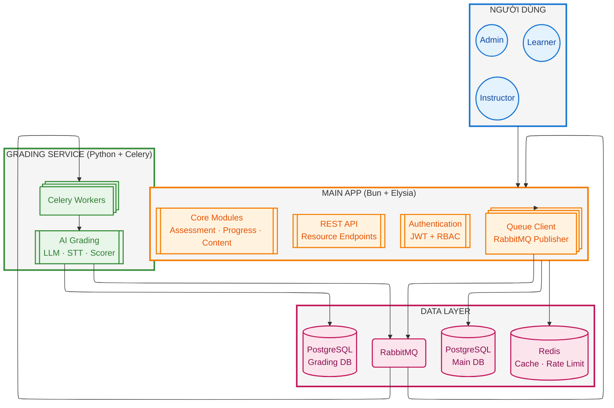

> **Kiến trúc Multi-Language:**
> - **Main App (Bun + Elysia)**: API, Auth, Assessment, Progress, Content — TypeScript
> - **Grading Service (Python + Celery)**: AI Grading, STT, Scoring — Celery workers
> - **Giao tiếp**: Queue-based (RabbitMQ) với idempotency qua `requestId`
> - **Database**: Tách biệt hoàn toàn — Main App chỉ connect MainDB, Grading Service chỉ connect GradingDB
> - **Real-time**: SSE (Server-Sent Events) cho status updates
>
> **Nguyên tắc quan trọng:**
> - **Main App chỉ connect MainDB** — Không bao giờ truy cập GradingDB
> - **Grading Service chỉ connect GradingDB** — Không bao giờ truy cập MainDB
> - **Giao tiếp duy nhất**: RabbitMQ (AMQP)

---

## 2. Luồng Xử Lý Submission (Chi tiết)

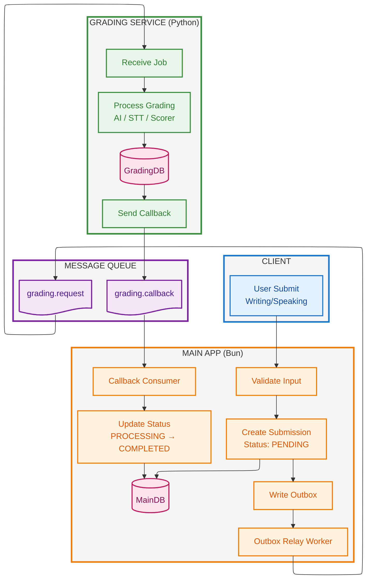

---

## 3. Error Handling & Recovery

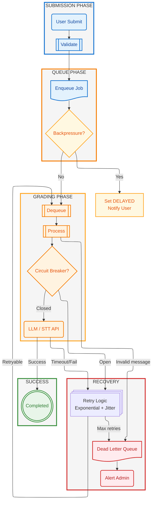

### 3.1 Retry Strategy

| Failure Type | Retry Count | Backoff | Max Retries Action |
|--------------|-------------|---------|-------------------|
| LLM API Timeout | 3 | Exponential: 2s, 4s, 8s | DLQ → Manual review |
| STT API Fail | 3 | Exponential: 1s, 2s, 4s | DLQ → Backup provider |
| Queue Error | 3 | Linear: 5s, 10s, 15s | DLQ → Alert admin |
| Invalid Format | 0 | N/A | Immediate DLQ |
| Circuit Open | Until closed | 30s cooldown | Queue pause |

### 3.2 Circuit Breaker States


---

## 4. State Machine & Data Consistency

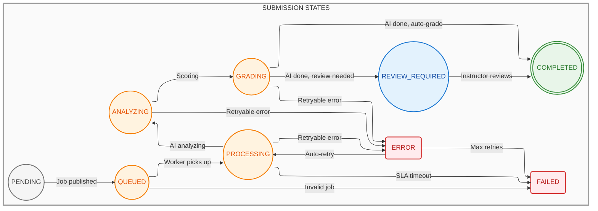

### 4.1 State Machine Transitions

| Event | From | To | Action |
|-------|------|-----|--------|
| User submits | — | PENDING | Create record |
| Job published | PENDING | QUEUED | Enqueue to RabbitMQ |
| Worker picks up | QUEUED | PROCESSING | Start grading |
| AI analyzing | PROCESSING | ANALYZING | LLM/STT processing |
| Scoring | ANALYZING | GRADING | Calculate scores |
| AI done, auto-grade | GRADING | COMPLETED | Save result |
| AI done, review needed | GRADING | REVIEW_REQUIRED | Queue for instructor |
| Instructor reviews | REVIEW_REQUIRED | COMPLETED | Save final result |
| Retryable error | any AI state | ERROR | Log error |
| Max retries exceeded | ERROR | FAILED | DLQ, notify user |
| SLA timeout | any AI state | FAILED | Timeout scheduler |

### 4.2 Outbox Pattern

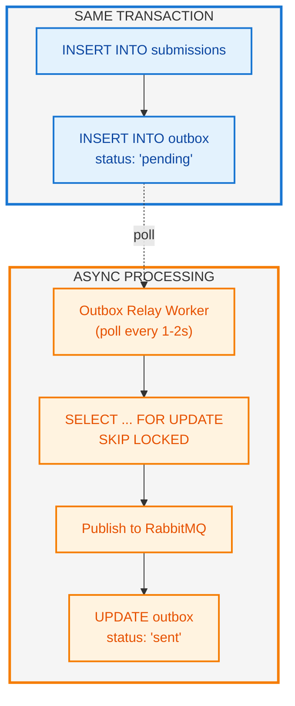

---

## 5. Real-time Updates (SSE)

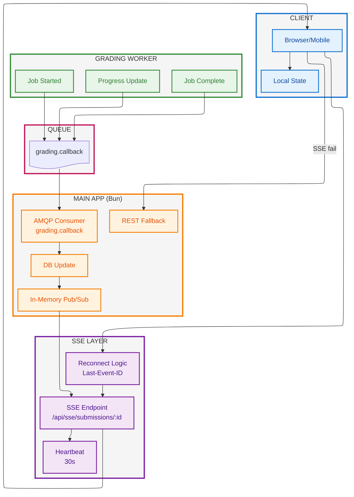

### 5.1 Status Mapping

| Status | Meaning | Update Type |
|--------|---------|-------------|
| PENDING | Chờ enqueue | Real-time < 100ms |
| QUEUED | Job trong RabbitMQ | Real-time < 500ms |
| PROCESSING | Worker đang xử lý | Batch 25% / 10s |
| ANALYZING | AI đang analyze | Streaming tokens |
| COMPLETED | Done | Real-time < 100ms |
| ERROR | Processing fail | Immediate |
| FAILED | Timeout / Max retries | Immediate |

---

## 6. Hybrid Grading với Confidence Score

```mermaid
---
config:
  layout: elk
---
flowchart TB
    subgraph Input["INPUT"]
        Writing@{ shape: doc, label: "Writing Submission" }
        Speaking@{ shape: doc, label: "Speaking Submission" }
    end

    subgraph Preprocess["PRE-PROCESSING"]
        Validate@{ shape: fr-rect, label: "Validate Input" }
        Transcribe@{ shape: fr-rect, label: "Speech-to-Text" }
        Extract@{ shape: fr-rect, label: "Extract Features" }
    end

    subgraph AIGrading["AI GRADING"]
        direction TB
        Grammar@{ shape: fr-rect, label: "Grammar Analysis" }
        Vocab@{ shape: fr-rect, label: "Vocabulary Analysis" }
        Content@{ shape: fr-rect, label: "Content Analysis" }
        Fluency@{ shape: fr-rect, label: "Fluency Analysis" }
    end

    subgraph Confidence["CONFIDENCE CALCULATION"]
        ModelCons@{ shape: fr-rect, label: "Model Consistency\n30%" }
        RuleVal@{ shape: fr-rect, label: "Rule Validation\n25%" }
        ContentSim@{ shape: fr-rect, label: "Content Similarity\n25%" }
        LengthHeur@{ shape: fr-rect, label: "Length Heuristic\n20%" }
        Score@{ shape: diam, label: "Confidence Score\n0-100%" }
    end

    subgraph Routing["ROUTING"]
        Threshold@{ shape: diam, label: "Confidence ≥ 85%?" }
        SpotCheck@{ shape: diam, label: "Spot Check\n5-10%?" }
        Auto@{ shape: rounded, label: "Auto-Grade" }
        Human@{ shape: rounded, label: "Human Review Queue" }
    end

    subgraph HumanGrading["HUMAN GRADING"]
        Claim@{ shape: fr-rect, label: "Claim Submission\nRedis Lock 15m" }
        Review@{ shape: fr-rect, label: "Instructor Review" }
        Override@{ shape: diam, label: "Override AI?" }
        Weighted@{ shape: fr-rect, label: "Weighted Final Score" }
    end

    Writing --> Validate --> Extract
    Speaking --> Validate --> Transcribe --> Extract
    
    Extract --> Grammar --> ModelCons
    Extract --> Vocab --> RuleVal
    Extract --> Content --> ContentSim
    Extract --> Fluency --> LengthHeur
    
    ModelCons --> Score
    RuleVal --> Score
    ContentSim --> Score
    LengthHeur --> Score
    
    Score --> Threshold
    Threshold -->|"Yes"| SpotCheck
    SpotCheck -->|"No"| Auto
    SpotCheck -->|"Yes"| Human
    Threshold -->|"No"| Human
    
    Human --> Claim --> Review --> Override --> Weighted

    %% Nodes - soft pastel fill with dark text
    classDef input fill:#e3f2fd,stroke:#1976d2,stroke-width:2px,color:#0d47a1
    classDef process fill:#fff3e0,stroke:#f57c00,stroke-width:2px,color:#e65100
    classDef ai fill:#e8f5e9,stroke:#388e3c,stroke-width:2px,color:#2e7d32
    classDef conf fill:#fff8e1,stroke:#fbc02d,stroke-width:2px,color:#f57f17
    classDef route fill:#f3e5f5,stroke:#7b1fa2,stroke-width:2px,color:#4a148c
    classDef human fill:#efebe9,stroke:#5d4037,stroke-width:2px,color:#3e2723

    %% Boxes - light tint
    classDef inputBox fill:#f5f5f5,stroke:#1976d2,stroke-width:3px,color:#333
    classDef processBox fill:#f5f5f5,stroke:#f57c00,stroke-width:3px,color:#333
    classDef aiBox fill:#f5f5f5,stroke:#388e3c,stroke-width:3px,color:#333
    classDef confBox fill:#f5f5f5,stroke:#fbc02d,stroke-width:3px,color:#333
    classDef routeBox fill:#f5f5f5,stroke:#7b1fa2,stroke-width:3px,color:#333
    classDef humanBox fill:#f5f5f5,stroke:#5d4037,stroke-width:3px,color:#333

    class Input inputBox
    class Preprocess processBox
    class AIGrading aiBox
    class Confidence confBox
    class Routing routeBox
    class HumanGrading humanBox

    class Writing,Speaking input
    class Validate,Transcribe,Extract process
    class Grammar,Vocab,Content,Fluency ai
    class ModelCons,RuleVal,ContentSim,LengthHeur,Score conf
    class Threshold,Auto,Human route
    class Claim,Review,Override,Weighted human
```

### 6.1 Confidence Score Formula

```
Confidence Score = clamp(0, 100, Σ(Factor_i × Weight_i))

Factors:
├── Model Consistency (30%)
│   └── std dev across 3 LLM samples
│   └── Score = 100 - (std_dev × 20)
├── Rule Validation (25%)
│   ├── Word count within band range
│   ├── Format compliance
│   ├── Rubric coverage
│   └── Time limit compliance
├── Content Similarity (25%)
│   └── Cosine similarity vs template essays
│   └── Lower similarity = higher confidence
└── Length Heuristic (20%)
    ├── Sentence count appropriate
    ├── Paragraph structure valid
    ├── Vocabulary density ok
    └── Complexity score appropriate
```

### 6.2 Confidence Thresholds

| Confidence | Action | Human Priority |
|------------|--------|----------------|
| 90-100% | Auto-grade | None |
| 85-89% | Auto-grade + audit flag | Low |
| 70-84% | Human review | Medium |
| 50-69% | Human review | High |
| < 50% | Human review + AI warning | Critical |

### 6.3 Weighted Final Score

```
If scoreDiff <= 0.5 AND bandStepDiff <= 1:
    Final = (AI_score × 0.4) + (Human_score × 0.6)
Else:
    Final = Human_score (Human overrides)
    Flag for audit + model tuning
```

---

## 7. Hành Trình Ngườii Dùng

```mermaid
---
config:
  layout: elk
---
flowchart LR
    Start@{ shape: circle, label: "Bắt đầu" }
    Reg@{ shape: fr-rect, label: "Đăng ký\nEmail/Password" }
    Profile@{ shape: fr-rect, label: "Thiết lập\nHồ sơ" }
    Goal@{ shape: fr-rect, label: "Thiết lập Goal\nTarget Level" }
    SelfAssess@{ shape: rounded, label: "Self-Assessment\n(Optional)" }
    Select@{ shape: diam, label: "Chọn Mode" }
    Practice@{ shape: fr-rect, label: "Practice Mode\nAdaptive" }
    Mock@{ shape: fr-rect, label: "Mock Test\nFull Exam" }
    Feedback@{ shape: fr-rect, label: "Feedback & Results" }
    Progress@{ shape: fr-rect, label: "Progress Tracking" }
    GoalCheck@{ shape: diam, label: "Goal đạt?" }
    End@{ shape: dbl-circ, label: "Kết thúc" }

    Start --> Reg --> Profile --> Goal --> SelfAssess --> Select
    Select -->|"Practice"| Practice
    Select -->|"Mock"| Mock
    Practice --> Feedback
    Mock --> Feedback
    Feedback --> Progress --> GoalCheck
    GoalCheck -->|"Không"| Select
    GoalCheck -->|"Có"| End

    %% Nodes - soft pastel fill with dark text
    classDef start fill:#e3f2fd,stroke:#1976d2,stroke-width:2px,color:#0d47a1
    classDef process fill:#fff3e0,stroke:#f57c00,stroke-width:2px,color:#e65100
    classDef decision fill:#f3e5f5,stroke:#7b1fa2,stroke-width:2px,color:#4a148c
    classDef success fill:#e8f5e9,stroke:#388e3c,stroke-width:2px,color:#2e7d32
    classDef optional fill:#f5f5f5,stroke:#757575,stroke-width:2px,color:#424242

    %% No subgraphs in this diagram
    class Start start
    class Reg,Profile,Goal,Practice,Mock,Feedback,Progress process
    class Select,GoalCheck decision
    class End success
    class SelfAssess optional
```

---

## 8. Practice Mode — Adaptive Scaffolding

### 8A. Writing Scaffolding

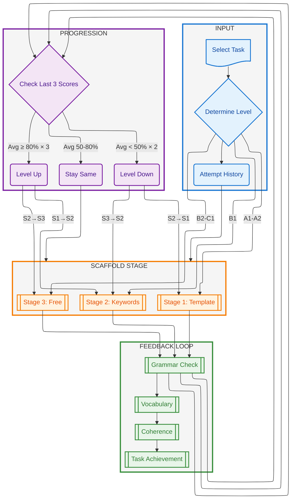

### 8B. Writing Progression Rules

| Current | Condition | Action | Next |
|---------|-----------|--------|------|
| Template | Avg ≥ 80% × 3 | Level Up | Keywords |
| Template | Avg < 50% × 2 | Stay + hints | Template |
| Keywords | Avg ≥ 75% × 3 | Level Up | Free |
| Keywords | Avg < 60% × 2 | Level Down | Template |
| Keywords | 60-75% | Stay | Keywords |
| Free | Avg ≥ 70% × 3 | Maintain | Free |
| Free | Avg < 65% × 2 | Level Down | Keywords |

---

## 9. Authentication & RBAC

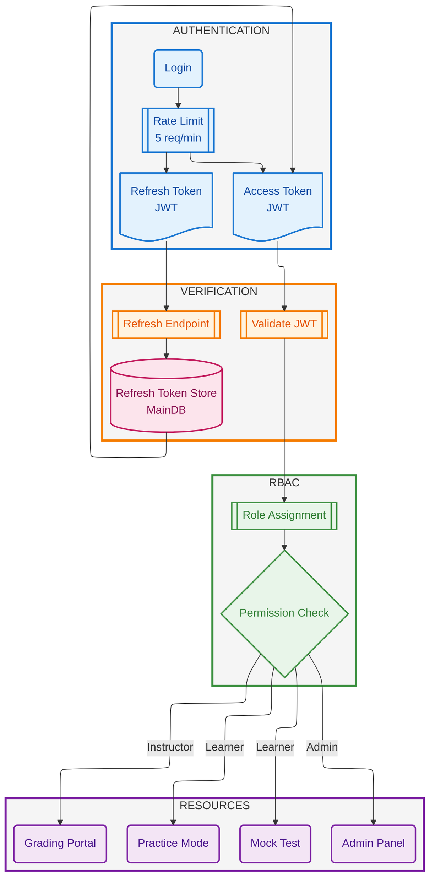

### 9.1 Refresh Token Enforcement

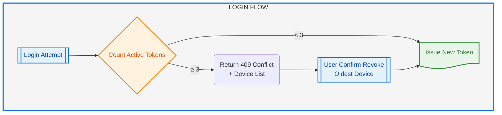

### 9.2 Role Permissions

| Role | Permissions |
|------|-------------|
| **Learner** | Practice, Mock Test, Progress, View Results |
| **Instructor** | Learner permissions + Grading Portal, Review |
| **Admin** | All permissions + User/Content Management |

---

## Style Guide

### Color Convention

| Type | Fill | Stroke | Text | Usage |
|------|------|--------|------|-------|
| **Nodes** | Light pastel tint | Darker matching color | Dark | Individual elements |
| **Subgraphs** | Very light gray | Matching category color | Dark | Container boxes |

### Color Scheme (Easy on Eyes)

| Category | Node Fill | Node Stroke | Node Text | Box Fill | Box Stroke |
|----------|-----------|-------------|-----------|----------|------------|
| **Client/Users** | `#e3f2fd` | `#1976d2` | `#0d47a1` | `#f5f5f5` | `#1976d2` |
| **Bun/API** | `#fff3e0` | `#f57c00` | `#e65100` | `#f5f5f5` | `#f57c00` |
| **Python** | `#e8f5e9` | `#388e3c` | `#2e7d32` | `#f5f5f5` | `#388e3c` |
| **Queue** | `#f3e5f5` | `#7b1fa2` | `#4a148c` | `#f5f5f5` | `#7b1fa2` |
| **Database** | `#fce4ec` | `#c2185b` | `#880e4f` | `#f5f5f5` | `#c2185b` |
| **Success** | `#e8f5e9` | `#388e3c` | `#2e7d32` | `#f5f5f5` | `#388e3c` |
| **Error** | `#ffebee` | `#d32f2f` | `#b71c1c` | `#f5f5f5` | `#d32f2f` |
| **Warning** | `#fff8e1` | `#ffa726` | `#e65100` | `#f5f5f5` | `#ffa726` |
| **Info/Normal** | `#e3f2fd` | `#1976d2` | `#0d47a1` | `#f5f5f5` | `#1976d2` |
| **Optional** | `#f5f5f5` | `#757575` | `#424242` | `#fafafa` | `#9e9e9e` |

> **Note**: Mới đổi sang color scheme pastel - dễ nhìn hơn, không bị chói, text đen đọc dễ hơn trên nền sáng.

### Shapes

| Shape | Syntax | Usage |
|-------|--------|-------|
| Circle | `@{ shape: circle }` | Users, states |
| Double Circle | `@{ shape: dbl-circ }` | End states |
| Cylinder | `@{ shape: cyl }` | Databases |
| Document | `@{ shape: doc }` | Queues, tokens |
| Rectangle | `@{ shape: rect }` (default) | Processes |
| Framed Rect | `@{ shape: fr-rect }` | Core modules |
| Stacked Rect | `@{ shape: st-rect }` | Multi-process |
| Diamond | `@{ shape: diam }` | Decisions |
| Rounded | `@{ shape: rounded }` | Soft edges |

---

*Cập nhật với Mermaid v11 ELK layout · SP26SE145*  
*Style fix: Pastel color scheme for better readability*
