# Capstone Project Report

## Report 3 — Software Requirement Specification

**Project**: An Adaptive VSTEP Preparation System with Comprehensive Skill Assessment and Personalized Learning Support

**Project Code**: SP26SE145 · Group: GSP26SE63

**Duration**: 01/01/2026 – 30/04/2026

— Hanoi, March 2026 —

---

# I. Record of Changes

*A — Added · M — Modified · D — Deleted

| Date | A/M/D | In Charge | Change Description |
|------|-------|-----------|-------------------|
| 15/03/2026 | A | Nghĩa (Leader) | Initial SRS document — functional & non-functional requirements |
| 02/03/2026 | M | Nghĩa (Leader) | Added Use Case diagrams, Actors, Screens Flow, Screen Authorization, ERD, Activity diagrams |

---

# II. Software Requirement Specification

## 1. Overall Description

### 1.1 Product Overview

This Software Requirement Specification (SRS) document describes all functional and non-functional requirements for the **Adaptive VSTEP Preparation System** — a web and mobile platform that helps Vietnamese learners prepare for the VSTEP (Vietnamese Standardized Test of English Proficiency) examination through adaptive learning, AI-powered grading, and personalized progress tracking.

The intended audience includes:

- **Development team** — for implementation guidance
- **Academic & Industry supervisors** — for project evaluation
- **QA testers** — for test case derivation
- **Stakeholders** — for feature validation and acceptance

#### 1.1.1 Scope

The system covers:

- **Practice Mode** for four English skills (Listening, Reading, Writing, Speaking) with adaptive scaffolding
- **Mock Test Mode** simulating full VSTEP examinations (VSTEP.3-5: B1–C1)
- **AI Grading** for Writing and Speaking using LLM (Groq Llama 3.3 70B) and Speech-to-Text (Groq Whisper Large V3 Turbo)
- **Human Review Workflow** for instructor verification of AI-graded submissions
- **Progress Tracking** with Spider Chart visualization, Sliding Window analytics, trend classification, and ETA estimation
- **Goal Setting** with target band, deadline, and achievement tracking
- **Class Management** for instructors to monitor and provide feedback to learners
- **Admin tools** for user management, content management, and analytics

The system does **not** cover:

- Other English proficiency tests (IELTS, TOEFL, TOEIC)
- Online payment integration (MVP phase)
- iOS native app (Android-first; iOS via PWA)
- Multi-language UI (Vietnamese only in MVP)

#### 1.1.2 System Context Diagram

The context diagram below illustrates the external entities and system interfaces for the Adaptive VSTEP Preparation System. The system boundary encompasses the Web/Mobile clients, the Main API Server, the Grading Worker, PostgreSQL, and Redis. External entities include the three user roles (Learner, Instructor, Admin) and the AI provider APIs (Groq LLM and Groq Whisper).

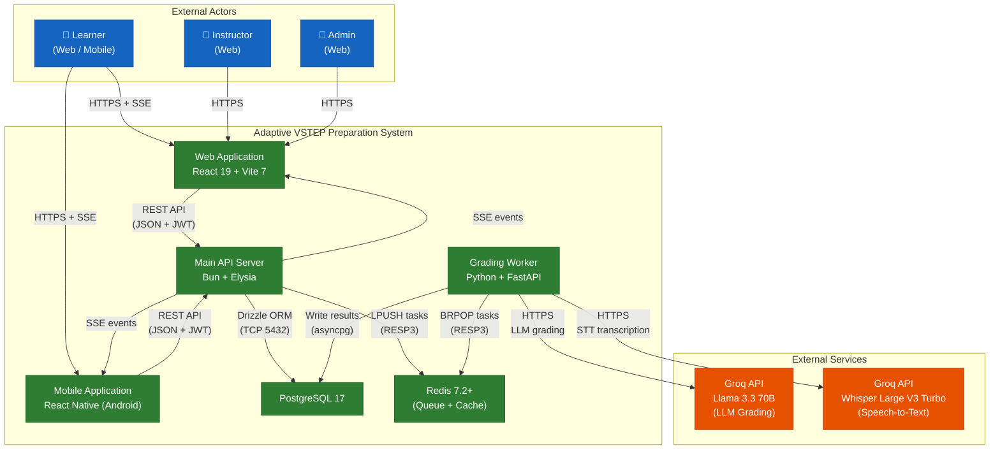

Key architectural decisions:

- **Shared-DB**: Both Main App and Grading Worker connect to the same PostgreSQL database. Worker writes grading results directly — no callback queue or outbox pattern needed.
- **Redis Queue**: Redis list with LPUSH/BRPOP replaces RabbitMQ. Simpler, fewer moving parts.
- **SSE Real-time**: Server-Sent Events for unidirectional grading status updates to clients.
- **JWT Auth**: Access/refresh token pair with rotation and reuse detection.

#### 1.1.3 System Interfaces

| Interface | Protocol | Description |
|-----------|----------|-------------|
| Client ↔ Main App | REST (HTTPS) + SSE | All user interactions via REST API; real-time grading updates via SSE |
| Main App ↔ PostgreSQL | TCP (PostgreSQL wire protocol) | Drizzle ORM for data access |
| Main App ↔ Redis | RESP3 (Bun built-in) | Queue enqueue, cache, rate limiting, review claim locks |
| Grading Worker ↔ Redis | RESP3 | BRPOP for job dequeue |
| Grading Worker ↔ PostgreSQL | TCP (psycopg/asyncpg) | Direct write of grading results |
| Grading Worker ↔ AI Providers | HTTPS | LLM (Groq Llama 3.3) for grading, Whisper (Groq) for STT |

### 1.2 Business Rules

See [Section 5.1 — Business Rules](#51-business-rules) for the complete list. Key rules include:

- Score range 0–10 in half-steps (numeric 3,1)
- Band derivation: C1 ≥ 8.5, B2 ≥ 6.0, B1 ≥ 4.0, below 4.0 = null
- Overall band = min(band per skill)
- AI confidence routing: high → completed, medium/low → review_pending
- Sliding window N=10, minimum 3 attempts for trend computation
- Max 3 active refresh tokens per user (FIFO)

### 1.3 Product Functions

The system provides 16 features organized in two delivery phases:

**Phase 1 — MVP (Months 1–3): 11 Core Features**

| ID | Feature | Description |
|----|---------|-------------|
| FE-01 | User Authentication | Registration, login, JWT lifecycle, RBAC (learner/instructor/admin), max 3 devices |
| FE-02 | Placement Test | Initial four-skill proficiency assessment to initialize Spider Chart and learning pathway |
| FE-03 | Practice Mode — Listening | Adaptive Scaffolding (Full Text → Highlights → Pure Audio), MCQ exercises |
| FE-04 | Practice Mode — Reading | VSTEP question types: True/False/Not Given, MCQ, Matching Headings, Fill-in-the-Blanks |
| FE-05 | Practice Mode — Writing + AI Grading | AI feedback using LLM (4 VSTEP criteria), SLA timeout 20 minutes |
| FE-06 | Practice Mode — Speaking + AI Grading | STT transcription + LLM assessment (4 criteria), SLA timeout 60 minutes |
| FE-07 | Mock Test Mode | Full four-skill timed exam following VSTEP format with detailed scoring report |
| FE-08 | Human Grading | Instructor review of AI-graded Writing/Speaking submissions with claim/release and merge rules |
| FE-09 | Progress Tracking | Spider Chart, Sliding Window (N=10), trend classification, ETA estimation |
| FE-10 | Learning Path | Personalized pathway based on weakest skill prioritization (rule-based) |
| FE-11 | Goal Setting | Target band, deadline, daily study time, achievement/on-track status |
| FE-11b | Vocabulary Learning | Vocabulary topics and word learning with flashcard-style interface, progress tracking per word |

**Phase 2 — Enhancement (Month 4): 5 Admin Features**

| ID | Feature | Description |
|----|---------|-------------|
| FE-12 | Content Management | Question bank CRUD, import/export (Excel, JSON) |
| FE-13 | User Management | Bulk account creation, lock/unlock, password reset, role assignment |
| FE-14 | Analytics Dashboard | Active users, completion rates, average scores, time-based filtering |
| FE-15 | Notification System | Push notifications (mobile), email, in-app notifications |
| FE-16 | Advanced Admin Features | Activity history, automatic assignment distribution |

### 1.4 User Characteristics

| User Role | Characteristics | Technical Proficiency |
|-----------|----------------|----------------------|
| **Learner** | University students (final year) or working professionals preparing for VSTEP certification. Age range 18–35. Primary device: smartphone (Android 70%+). May have limited internet bandwidth. | Basic to intermediate. Familiar with mobile apps and web browsing. |
| **Instructor** | English language instructors at universities or language centers. Responsible for reviewing AI-graded Writing/Speaking submissions and providing feedback. | Intermediate. Comfortable with web applications and basic data interpretation. |
| **Admin** | System administrators managing users, question banks, and platform configuration. | Advanced. Familiar with content management systems and data administration. |

### 1.5 Constraints

| # | Constraint | Description |
|---|-----------|-------------|
| C-01 | VSTEP Format Only | System supports only VSTEP.3-5 (B1–C1) format, not IELTS/TOEFL/TOEIC |
| C-02 | AI Grading Limitation | AI grading for Writing/Speaking is supplementary; official scores require instructor confirmation |
| C-03 | Vietnamese UI Only | MVP supports Vietnamese interface only |
| C-04 | Android Priority | Mobile app targets Android first; iOS users access via PWA |
| C-05 | No Payment Integration | MVP uses freemium model; no online payment gateway |
| C-06 | LLM Provider Dependency | AI grading depends on external LLM/STT providers (Groq, OpenAI) with rate limits |
| C-07 | Capstone Timeline | 4-month development window (14 weeks, 7 sprints) |
| C-08 | Team Size | 4 developers (1 BE+AI, 1 Mobile, 2 FE) |

### 1.6 Assumptions and Dependencies

**Assumptions:**

- A-01: Learners have access to a stable internet connection (minimum 1 Mbps for audio streaming)
- A-02: Learners have a device with a microphone for Speaking practice
- A-03: VSTEP exam format and rubric remain stable during the project duration
- A-04: AI providers (Groq, OpenAI) maintain service availability and API compatibility
- A-05: PostgreSQL and Redis are available and operational in the deployment environment

**Dependencies:**

- D-01: Groq API (Llama 3.3 70B) for LLM-based Writing/Speaking grading
- D-02: Groq API (Whisper Large V3 Turbo) for Speech-to-Text transcription
- D-03: PostgreSQL 17 for data persistence
- D-04: Redis 7.2+ for task queue, caching, and distributed locks
- D-05: Docker Compose for local development environment orchestration

### 1.7 Definitions and Acronyms

#### Acronyms

| Acronym | Definition |
|---------|------------|
| AI | Artificial Intelligence |
| API | Application Programming Interface |
| CEFR | Common European Framework of Reference for Languages |
| JWT | JSON Web Token |
| LLM | Large Language Model |
| MCQ | Multiple Choice Question |
| MVP | Minimum Viable Product |
| NPS | Net Promoter Score |
| RBAC | Role-Based Access Control |
| REST | Representational State Transfer |
| SLA | Service Level Agreement |
| SRS | Software Requirements Specification |
| SSE | Server-Sent Events |
| STT | Speech-to-Text |
| VSTEP | Vietnamese Standardized Test of English Proficiency |

#### Terms

| Term | Definition |
|------|------------|
| Adaptive Scaffolding | Flexible support that adjusts the level of assistance based on learner competency (Template → Keywords → Free for Writing; Full Text → Highlights → Pure Audio for Listening) |
| Band | Proficiency level classification: A1, A2, B1, B2, C1 |
| Hybrid Grading | Combined AI and human evaluator scoring system |
| Sliding Window | Method of calculating averages from the N most recent exercises (N=10) |
| Spider Chart | Multi-dimensional competency visualization across four skills |
| Submission | A learner's answer to a single question, tracked from creation to final score |
| Exam Session | A timed mock test session covering all four skills |
| Scaffold Level | Current support level for a skill (1=Template/FullText, 2=Keywords/Highlights, 3=Free/PureAudio) |
| Confidence | AI self-assessed reliability of grading result (high, medium, low) |
| Review Priority | Urgency level for instructor review (low, medium, high) |

### 1.8 References

| # | Document | Description |
|---|----------|-------------|
| 1 | Report 1 — Project Introduction | Project background, existing systems, business opportunity, vision |
| 2 | Report 2 — Project Management Plan | WBS, estimation, risk register, responsibility matrix |
| 3 | Technical Specifications (20 files) | Domain rules, API contracts, data schemas, platform concerns |
| 4 | `specs/00-overview/solution-decisions.md` | Architecture decisions and tech stack |
| 5 | `specs/10-contracts/api-endpoints.md` | REST API endpoint catalog |
| 6 | `specs/10-contracts/api-conventions.md` | HTTP conventions, pagination, idempotency |
| 7 | `specs/20-domain/vstep-exam-format.md` | VSTEP format mapping to domain model |
| 8 | `specs/20-domain/submission-lifecycle.md` | Submission state machine and grading flow |
| 9 | `specs/20-domain/hybrid-grading.md` | AI grading pipeline and confidence routing |
| 10 | `specs/20-domain/progress-tracking.md` | Progress metrics, trend, ETA computation |
| 11 | `specs/20-domain/adaptive-scaffolding.md` | Scaffolding stages and progression rules |
| 12 | `specs/30-data/database-schema.md` | Database entities, indexes, enums |
| 13 | `specs/40-platform/authentication.md` | JWT flow, rotation, device limits |
| 14 | `specs/50-ops/deployment.md` | Docker Compose and environment variables |

---

## 2. User Requirements

### 2.1 Actors

| # | Actor | Description |
|---|-------|-------------|
| 1 | **Learner** | A registered user (role = `learner`) who practices English skills, takes mock tests, views progress, sets goals, and joins classes. Primary consumer of adaptive scaffolding and AI grading feedback. |
| 2 | **Instructor** | A user (role = `instructor`) who creates exams and questions, reviews AI-graded Writing/Speaking submissions, manages classes, monitors learner progress, and provides feedback. Inherits all Learner capabilities. |
| 3 | **Admin** | A user (role = `admin`) who manages users, question bank, system configuration, and views analytics dashboards. Inherits all Instructor capabilities. |
| 4 | **Grading Worker** | An automated system actor (Python + FastAPI) that consumes grading tasks from Redis, performs AI grading via external LLM/STT APIs, and writes results to the database. |
| 5 | **AI Provider (Groq)** | External service providing LLM inference (Llama 3.3 70B) for Writing/Speaking grading and STT transcription (Whisper Large V3 Turbo) for Speaking submissions. |

### 2.2 Use Cases

#### 2.2.1 Use Case Diagram — Learner

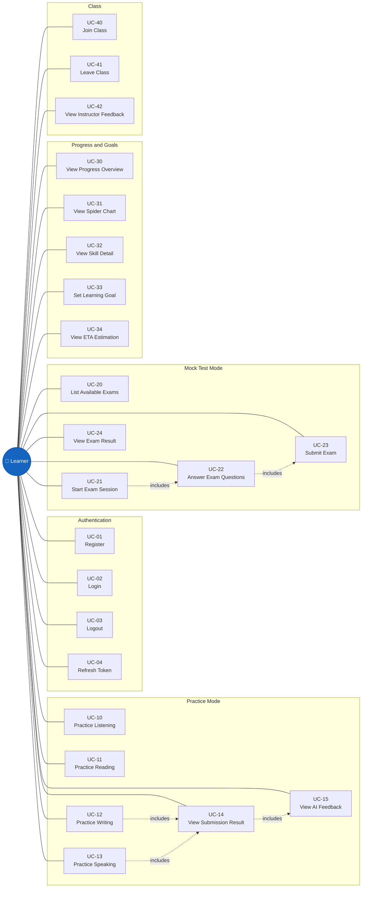

#### 2.2.2 Use Case Diagram — Instructor

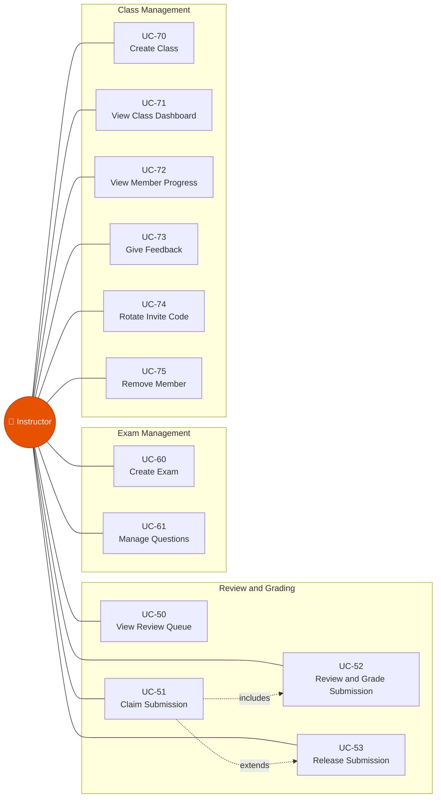

#### 2.2.3 Use Case Diagram — Admin

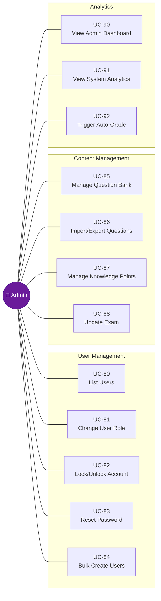

#### 2.2.4 Use Case Descriptions

| ID | Use Case | Actor(s) | Description |
|----|----------|----------|-------------|
| UC-01 | Register | Learner | Create account with email, password, fullName. Role defaults to `learner`. |
| UC-02 | Login | Learner, Instructor, Admin | Authenticate with email + password. Receive JWT access + refresh token pair. Max 3 devices (FIFO). |
| UC-03 | Logout | Learner, Instructor, Admin | Revoke current refresh token. |
| UC-04 | Refresh Token | Learner, Instructor, Admin | Rotate refresh token — revoke old, issue new pair. Replay detection triggers full revocation. |
| UC-10 | Practice Listening | Learner | Retrieve listening question with adaptive scaffolding (Full Text → Highlights → Pure Audio). Auto-graded immediately. |
| UC-11 | Practice Reading | Learner | Retrieve reading question (MCQ, T/F/NG, Matching, Gap Fill). Auto-graded immediately. |
| UC-12 | Practice Writing | Learner | Submit written response. AI grading async via Redis queue + LLM. Includes UC-14. |
| UC-13 | Practice Speaking | Learner | Submit audio recording. STT + AI grading async via Redis queue. Includes UC-14. |
| UC-14 | View Submission Result | Learner | View score, band, criteria breakdown for a completed submission. |
| UC-15 | View AI Feedback | Learner | View detailed AI feedback text, grammar errors (writing), pronunciation notes (speaking). |
| UC-20 | List Available Exams | Learner | Browse mock test exams filtered by level (B1/B2/C1). |
| UC-21 | Start Exam Session | Learner | Begin a timed 4-skill exam session. Creates `exam_session` with `in_progress` status. |
| UC-22 | Answer Exam Questions | Learner | Answer questions during exam. Auto-saved every 30 seconds. |
| UC-23 | Submit Exam | Learner | Finalize exam. L/R auto-graded inline; W/S dispatched to Redis for AI grading. |
| UC-24 | View Exam Result | Learner | View per-skill scores, bands, and overall score when all skills graded. |
| UC-30 | View Progress Overview | Learner | See all 4 skills: current level, average score, trend, attempt count. |
| UC-31 | View Spider Chart | Learner | 4-axis radar chart showing current scores + goal target per skill. |
| UC-32 | View Skill Detail | Learner | Score history (last 10), trend classification, scaffold level for one skill. |
| UC-33 | Set Learning Goal | Learner | Set target band (B1/B2/C1), optional deadline, daily study time. |
| UC-34 | View ETA Estimation | Learner | Estimated weeks to reach goal per skill via linear regression on sliding window. |
| UC-40 | Join Class | Learner | Join a class using instructor-provided invite code. |
| UC-41 | Leave Class | Learner | Leave a joined class. |
| UC-42 | View Instructor Feedback | Learner | View feedback comments from instructor for a specific class. |
| UC-50 | View Review Queue | Instructor | List `review_pending` submissions sorted by priority (high → medium → low), then FIFO. |
| UC-51 | Claim Submission | Instructor | Lock a submission for exclusive review (15 min TTL). |
| UC-52 | Review & Grade Submission | Instructor | Submit final score, band, criteria scores, feedback. Instructor score is always final. |
| UC-53 | Release Submission | Instructor | Release a claimed submission back to queue if unable to finish. |
| UC-60 | Create Exam | Instructor | Define exam with level and blueprint (per-skill question selection). |
| UC-61 | Manage Questions | Instructor | Create and update questions in the question bank. |
| UC-70 | Create Class | Instructor | Create a class with auto-generated invite code. |
| UC-71 | View Class Dashboard | Instructor | Aggregated class stats: per-skill averages, at-risk students (avg < 5.0). |
| UC-72 | View Member Progress | Instructor | Individual learner progress: per-skill scores, trends, goal status. |
| UC-73 | Give Feedback | Instructor | Post feedback comment targeting a specific learner in the class. |
| UC-74 | Rotate Invite Code | Instructor | Generate new invite code for a class (invalidates old code). |
| UC-75 | Remove Member | Instructor | Remove a learner from the class. |
| UC-80 | List Users | Admin | Paginated user list with filters (role, email/name search). |
| UC-81 | Change User Role | Admin | Change user role between learner/instructor/admin. |
| UC-82 | Lock/Unlock Account | Admin | Disable/enable user account access. |
| UC-83 | Reset Password | Admin | Admin-initiated password reset for a user. |
| UC-84 | Bulk Create Users | Admin | Create multiple accounts from CSV/Excel upload. |
| UC-85 | Manage Question Bank | Admin | Full CRUD on questions. Soft-delete via `is_active = false`. |
| UC-86 | Import/Export Questions | Admin | Bulk import from JSON/Excel; export for backup. |
| UC-87 | Manage Knowledge Points | Admin | CRUD on knowledge point taxonomy (grammar, vocabulary, strategy). |
| UC-88 | Update Exam | Admin | Modify exam blueprint and level. |
| UC-90 | View Admin Dashboard | Admin | System-wide analytics: total users, submission distribution, queue size. |
| UC-91 | View System Analytics | Admin | Daily active users, average grading time, completion rates. |
| UC-92 | Trigger Auto-Grade | Admin | Manually trigger auto-grading for pending Listening/Reading submissions. |

---

## 3. Functional Requirements

### 3.1 System Functional Overview

#### 3.1.1 Screens Flow — Learner

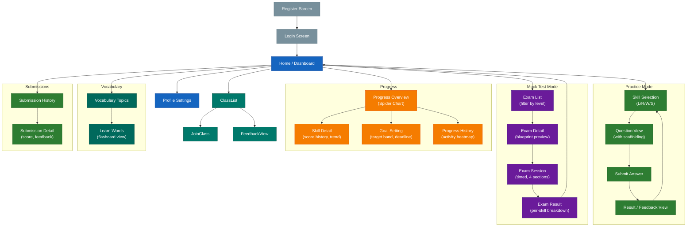

#### 3.1.2 Screens Flow — Instructor

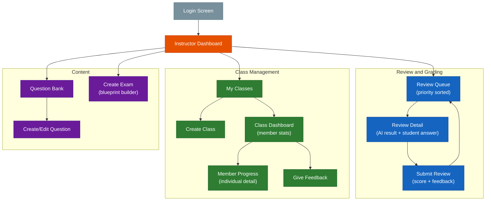

#### 3.1.3 Screen Descriptions

| # | Feature | Screen | Description |
|---|---------|--------|-------------|
| 1 | Authentication | Login | Email + password form. Links to Register. Returns JWT token pair on success. |
| 2 | Authentication | Register | Email, password (min 8 chars), full name form. Redirects to Login on success. |
| 3 | Home | Dashboard | Landing page showing quick-start links to Practice, Exam, Progress. Summary widgets. |
| 4 | Practice | Skill Selection | Grid of 4 skills (Listening, Reading, Writing, Speaking) with current level badges. |
| 5 | Practice | Question View | Displays question content with scaffolding applied. Audio player for Listening/Speaking. Text editor for Writing. |
| 6 | Practice | Submit Answer | Confirmation before submission. Word count check for Writing (min 120/250 words). |
| 7 | Practice | Result / Feedback | Score (0–10), band, per-criteria breakdown. AI feedback text. Grammar errors (Writing). |
| 8 | Exam | Exam List | Card list of available exams. Filter by level (B1/B2/C1). Shows question count per section. |
| 9 | Exam | Exam Detail | Blueprint preview: 4 sections with question counts and time limits. Start button. |
| 10 | Exam | Exam Session | Timed exam with section tabs. Auto-save every 30s. Timer with 5min/1min warnings. |
| 11 | Exam | Exam Result | Per-skill score breakdown. Overall score and band. Pending indicator for W/S grading. |
| 12 | Progress | Overview | Spider Chart (4-axis radar). Per-skill trend indicators. Overall band estimate. |
| 13 | Progress | Skill Detail | Last 10 scores chart. Trend classification. Scaffold level indicator. ETA to goal. |
| 14 | Progress | Goal Setting | Target band selector (B1/B2/C1). Deadline date picker. Daily study time input. |
| 15 | Class | My Classes | List of joined + owned classes. Join button with invite code input. |
| 16 | Class | Class Dashboard | Instructor view: member count, per-skill averages, at-risk students (avg < 5.0). |
| 17 | Class | Member Progress | Individual learner detail: per-skill scores, trends, goal status, recent submissions. |
| 18 | Review | Review Queue | Table of `review_pending` submissions. Priority badge (high/medium/low). Claim button. |
| 19 | Review | Review Detail | Side-by-side: student answer (left) + AI grading result (right). Score input form. |
| 20 | Content | Question Bank | Paginated table with filters (skill, level, format, active). Create/Edit/Delete actions. |
| 21 | Content | Create/Edit Question | Form with skill, level, content JSONB editor, answer key, rubric fields. |
| 22 | Vocabulary | Topics List | Grid of vocabulary topics with word count per topic and learning progress indicator. |
| 23 | Vocabulary | Learn Words | Flashcard-style word learning view. Shows word, phonetic, definition, examples. Mark as known/unknown. |
| 24 | Submissions | History | Paginated list of past submissions with skill filter, score, band, and status badges. |
| 25 | Submissions | Detail | Full submission detail: question, student answer, score breakdown, AI/human feedback. |
| 26 | Progress | History | Activity heatmap showing daily practice frequency. Doughnut chart of skill distribution. |

#### 3.1.4 Screen Authorization

| Screen | Learner | Instructor | Admin |
|--------|---------|------------|-------|
| Login / Register | X | X | X |
| Dashboard (Home) | X | X | X |
| Practice — Skill Selection | X | X | X |
| Practice — Question View | X | X | X |
| Practice — Result / Feedback | X (own) | X (own) | X (all) |
| Exam — List | X | X | X |
| Exam — Start Session | X | X | X |
| Exam — Session (timed) | X | X | X |
| Exam — Result | X (own) | X (own) | X (all) |
| Progress — Overview | X (own) | X (own) | X (all) |
| Progress — Skill Detail | X (own) | X (own) | X (all) |
| Progress — Goal Setting | X | X | X |
| Class — My Classes | X | X | X |
| Class — Join (invite code) | X | X | X |
| Class — Dashboard | | X (owner) | X |
| Class — Member Progress | | X (owner) | X |
| Class — Give Feedback | | X (owner) | X |
| Review — Queue | | X | X |
| Review — Detail + Grade | | X | X |
| Content — Question Bank | | X | X |
| Content — Create/Edit Question | | X | X |
| Content — Delete Question | | | X |
| Content — Create Exam | | X | X |
| Content — Update Exam | | | X |
| Admin — User List | | | X |
| Admin — Change Role | | | X |
| Admin — Lock/Unlock | | | X |
| Admin — Analytics Dashboard | | | X |
| Admin — Trigger Auto-Grade | | | X |
| Vocabulary — Topics | X | X | X |
| Vocabulary — Learn Words | X | X | X |
| Submissions — History | X (own) | X (own) | X (all) |
| Submissions — Detail | X (own) | X (own) | X (all) |
| Progress — History | X (own) | X (own) | X (all) |

#### 3.1.5 Non-Screen Functions

| # | Feature | System Function | Description |
|---|---------|----------------|-------------|
| 1 | AI Grading | Grading Worker (BRPOP) | Async worker polls Redis `grading:tasks` queue. Routes to Writing or Speaking grading pipeline. Writes results to PostgreSQL. |
| 2 | AI Grading | Confidence Routing | After AI grading: high → `completed`, medium → `review_pending` (priority medium), low → `review_pending` (priority high). |
| 3 | AI Grading | Dead Letter Queue | Failed tasks after max retries → `LPUSH grading:dlq` for manual inspection. |
| 4 | Auth | Token Rotation | On refresh: revoke old token, issue new pair. If reused rotated token detected → revoke ALL user tokens. |
| 5 | Auth | Device Pruning | On login: if active refresh tokens ≥ 3, revoke oldest (FIFO). |
| 6 | Progress | Sliding Window Sync | After every score recorded: fetch last 10 scores per skill → compute mean, trend, scaffold adjustment → upsert `user_progress`. |
| 7 | Exam | Auto-Save | Client sends answer snapshot every 30s → upsert `exam_answers`. Rejected if session already submitted. |
| 8 | Exam | Submit Processing | On exam submit: auto-grade L/R inline → create W/S submissions → dispatch to Redis → update session scores. |
| 9 | Health | Health Check | `GET /health` probes PostgreSQL and Redis connectivity. Returns service status. |
| 10 | API | OpenAPI Generation | Auto-generated OpenAPI spec at `GET /openapi.json` via Elysia plugin. |

#### 3.1.6 Entity Relationship Diagram

```mermaid
erDiagram
    users ||--o{ refresh_tokens : "has sessions"
    users ||--o{ submissions : "creates"
    users ||--o{ user_progress : "tracks (1 per skill)"
    users ||--o{ user_skill_scores : "records scores"
    users ||--o{ user_goals : "sets goals"
    users ||--o{ user_knowledge_progress : "learns KPs"
    users ||--o{ exam_sessions : "takes exams"
    users ||--o{ classes : "owns (instructor)"
    users ||--o{ class_members : "enrolls in"
    users ||--o{ instructor_feedback : "gives/receives"
    users ||--o{ notifications : "receives"
    users ||--o{ device_tokens : "registers devices"
    users ||--o{ user_placements : "has placements"

    vocabulary_topics ||--o{ vocabulary_words : "contains"
    vocabulary_words ||--o{ user_vocabulary_progress : "tracked by"
    users ||--o{ user_vocabulary_progress : "learns words"

    questions ||--o{ submissions : "answered in"
    questions ||--o{ question_knowledge_points : "tagged with"
    questions ||--o{ exam_answers : "included in"

    knowledge_points ||--o{ question_knowledge_points : "mapped to"
    knowledge_points ||--o{ user_knowledge_progress : "tracked by"

    exams ||--o{ exam_sessions : "has sessions"
    exam_sessions ||--o{ exam_answers : "contains answers"
    exam_sessions ||--o{ exam_submissions : "produces submissions"

    submissions ||--|| submission_details : "has detail (1:1)"
    submissions ||--o{ exam_submissions : "linked from exam"
    submissions ||--o{ user_skill_scores : "records score"

    classes ||--o{ class_members : "enrolls members"
    classes ||--o{ instructor_feedback : "contains feedback"

    users {
        uuid id PK
        varchar email UK "unique, not null"
        varchar password_hash "argon2id"
        varchar full_name
        enum role "learner | instructor | admin"
        timestamp created_at
        timestamp updated_at
    }

    refresh_tokens {
        uuid id PK
        uuid user_id FK
        varchar token_hash "SHA-256"
        varchar jti UK "JWT ID"
        varchar replaced_by_jti "rotation tracking"
        text device_info
        timestamp revoked_at "nullable"
        timestamp expires_at
    }

    questions {
        uuid id PK
        enum skill "listening | reading | writing | speaking"
        smallint part "L:1-3 R:1-4 W:1-2 S:1-3"
        jsonb content "QuestionContent (8 types)"
        jsonb answer_key "ObjectiveAnswerKey (L/R only)"
        text explanation
        boolean is_active "soft delete"
        uuid created_by FK
    }

    submissions {
        uuid id PK
        uuid user_id FK
        uuid question_id FK
        enum skill "listening | reading | writing | speaking"
        enum status "pending | processing | completed | review_pending | failed"
        numeric score "0.0-10.0 step 0.5"
        enum band "A1 | A2 | B1 | B2 | C1"
        enum review_priority "low | medium | high"
        enum grading_mode "auto | human | hybrid"
        uuid reviewer_id FK "nullable"
        uuid claimed_by FK "nullable"
        timestamp claimed_at
        boolean audit_flag "AI vs human diff > 0.5"
        timestamp completed_at
    }

    submission_details {
        uuid submission_id PK "FK to submissions"
        jsonb answer "Objective | Writing | Speaking"
        jsonb result "Auto | AI | Human Result"
        varchar feedback "max 10000 chars"
    }

    exams {
        uuid id PK
        enum level "A2 | B1 | B2 | C1"
        jsonb blueprint "per-skill questionIds"
        boolean is_active
        uuid created_by FK
    }

    exam_sessions {
        uuid id PK
        uuid user_id FK
        uuid exam_id FK
        enum status "in_progress | submitted | completed | abandoned"
        numeric listening_score
        numeric reading_score
        numeric writing_score
        numeric speaking_score
        numeric overall_score
        timestamp started_at
        timestamp completed_at
    }

    exam_answers {
        uuid id PK
        uuid session_id FK
        uuid question_id FK
        jsonb answer "SubmissionAnswer"
        boolean is_correct "set on submit"
    }

    exam_submissions {
        uuid id PK
        uuid session_id FK
        uuid submission_id FK
        enum skill
    }

    knowledge_points {
        uuid id PK
        enum category "grammar | vocabulary | strategy"
        varchar name UK
    }

    question_knowledge_points {
        uuid question_id PK "FK to questions"
        uuid knowledge_point_id PK "FK to knowledge_points"
    }

    user_progress {
        uuid id PK
        uuid user_id FK
        enum skill
        enum current_level "A2 | B1 | B2 | C1"
        enum target_level "nullable"
        integer scaffold_level "1-5"
        integer streak_count
        enum streak_direction "up | down | neutral"
        integer attempt_count
    }

    user_skill_scores {
        uuid id PK
        uuid user_id FK
        enum skill
        uuid submission_id FK
        numeric score "0.0-10.0"
        varchar scaffolding_type
    }

    user_goals {
        uuid id PK
        uuid user_id FK
        enum target_band "A1-C1"
        varchar current_estimated_band
        timestamp deadline
        integer daily_study_time_minutes "default 30"
    }

    user_knowledge_progress {
        uuid id PK
        uuid user_id FK
        uuid knowledge_point_id FK
        numeric mastery_score "0-100"
        integer total_attempted
        integer total_correct
    }

    classes {
        uuid id PK
        text name
        text description
        uuid instructor_id FK
        text invite_code UK
    }

    class_members {
        uuid id PK
        uuid class_id FK
        uuid user_id FK
        timestamp joined_at
        timestamp removed_at "nullable"
    }

    instructor_feedback {
        uuid id PK
        uuid class_id FK
        uuid from_user_id FK
        uuid to_user_id FK
        text content
        enum skill "nullable"
        uuid submission_id FK "nullable"
    }

    vocabulary_topics {
        uuid id PK
        varchar name UK "unique max 200"
        text description
        varchar icon_key "nullable"
        integer sort_order "default 0"
        timestamp created_at
        timestamp updated_at
    }

    vocabulary_words {
        uuid id PK
        uuid topic_id FK
        varchar word "max 100"
        varchar phonetic "nullable"
        varchar audio_url "nullable"
        varchar part_of_speech "max 20"
        text definition
        text explanation
        jsonb examples "string array"
        integer sort_order "default 0"
        timestamp created_at
        timestamp updated_at
    }

    user_vocabulary_progress {
        uuid user_id PK "FK to users"
        uuid word_id PK "FK to vocabulary_words"
        boolean known "default false"
        timestamp last_reviewed_at "nullable"
        timestamp created_at
        timestamp updated_at
    }

    notifications {
        uuid id PK
        uuid user_id FK
        enum type "grading_completed | feedback_received | class_invite | goal_achieved | system"
        varchar title "max 255"
        text body "nullable"
        jsonb data "nullable"
        timestamp read_at "nullable"
        timestamp created_at
    }

    device_tokens {
        uuid id PK
        uuid user_id FK
        text token UK "unique"
        varchar platform "ios | android | web"
        timestamp created_at
    }
```

**Entity Descriptions:**

| # | Entity | Description |
|---|--------|-------------|
| 1 | `users` | Registered users with role-based access (learner, instructor, admin). Argon2id password hashing. |
| 2 | `refresh_tokens` | JWT refresh tokens stored as SHA-256 hashes. Supports rotation, replay detection, and device tracking. Max 3 per user. |
| 3 | `questions` | Question bank with JSONB content supporting 8 format types across 4 skills. Answer keys for objective questions (L/R). |
| 4 | `submissions` | A learner's answer to a question. Tracks lifecycle via state machine (pending → processing → completed/review_pending/failed). |
| 5 | `submission_details` | 1:1 with submissions. Stores answer JSONB, grading result JSONB (auto/AI/human), and feedback text. |
| 6 | `exams` | Mock test definitions with level and blueprint (per-skill question selection). |
| 7 | `exam_sessions` | Timed exam session tracking. Stores per-skill scores and overall score. |
| 8 | `exam_answers` | Individual answers within an exam session. `is_correct` set during submit processing. |
| 9 | `exam_submissions` | Junction table linking exam sessions to submissions (for subjective W/S questions). |
| 10 | `knowledge_points` | Taxonomy of knowledge points (grammar, vocabulary, strategy) for adaptive learning. |
| 11 | `question_knowledge_points` | Many-to-many junction between questions and knowledge points. |
| 12 | `user_progress` | One row per user per skill. Sliding window aggregates: average score, trend, scaffold level. |
| 13 | `user_skill_scores` | Individual score records feeding into the sliding window (last 10 per skill). |
| 14 | `user_goals` | Learning goals with target band, deadline, daily study time. |
| 15 | `user_knowledge_progress` | Per-user per-knowledge-point mastery tracking. |
| 16 | `classes` | Instructor-owned classes with auto-generated invite codes. |
| 17 | `class_members` | Class enrollment records with join/remove timestamps. |
| 18 | `instructor_feedback` | Feedback comments from instructor to learner within a class context. |
| 19 | `vocabulary_topics` | Vocabulary learning topics with name, description, and ordering. |
| 20 | `vocabulary_words` | Individual vocabulary words within topics. Includes phonetic, audio, part of speech, definition, examples. |
| 21 | `user_vocabulary_progress` | Per-user per-word learning progress tracking. Composite PK (user_id, word_id). |
| 22 | `notifications` | User notifications for grading completion, feedback, goals, system messages. |
| 23 | `device_tokens` | Push notification device tokens for mobile/web platforms. |
| 24 | `user_placements` | Initial placement test results recording skill levels and source. |

### 3.2 FE-01: User Authentication

#### 3.2.1 Register

- **Description**: A new user creates an account by providing email, password, and display name.
- **Input**: `email` (unique), `password` (min 8 characters), `fullName`
- **Processing**: Validate input → check email uniqueness → hash password (Argon2id via `Bun.password`) → create user record with role `learner`
- **Output**: User profile (id, email, fullName, role). No tokens returned — user must login separately.
- **Error Cases**:
  - Email already exists → 409 CONFLICT
  - Invalid email format → 400 VALIDATION_ERROR
  - Password too short → 400 VALIDATION_ERROR

#### 3.2.2 Login

- **Description**: User authenticates with email and password, receives JWT token pair.
- **Input**: `email`, `password`
- **Processing**: Validate credentials → check max 3 active refresh tokens per user (FIFO — revoke oldest if >= 3) → issue access token (short-lived) + refresh token (long-lived) → store refresh token hash in DB
- **Output**: `{ accessToken, refreshToken, user: { id, email, fullName, role } }`
- **Error Cases**:
  - Invalid credentials → 401 UNAUTHORIZED
  - Account not found → 401 UNAUTHORIZED

#### 3.2.3 Refresh Token

- **Description**: Rotate refresh token — revoke old, issue new pair.
- **Input**: `refreshToken` (in request body)
- **Processing**: Validate token hash against DB → check not revoked → check not expired → rotate (revoke old, create new) → issue new access + refresh tokens
- **Output**: New `{ accessToken, refreshToken }`
- **Error Cases**:
  - Token expired → 401 TOKEN_EXPIRED
  - Token already revoked (reuse detection) → revoke ALL user tokens → 401 UNAUTHORIZED (force re-login)

#### 3.2.4 Logout

- **Description**: Revoke current refresh token.
- **Input**: `refreshToken`
- **Processing**: Find token by hash → set `revokedAt` timestamp
- **Output**: `{ success: true }`

#### 3.2.5 Get Current User

- **Description**: Return user profile from access token claims.
- **Input**: Bearer access token (Authorization header)
- **Output**: `{ id, email, fullName, role }`
- **Error Cases**:
  - Missing/invalid token → 401 UNAUTHORIZED
  - Expired token → 401 TOKEN_EXPIRED

#### 3.2.6 Authentication & Token Lifecycle Diagram

```mermaid
flowchart TB
    subgraph Registration ["Registration Flow"]
        RegStart(["User submits<br/>registration form"])
        Validate["Validate input<br/>email, password min 8, fullName"]
        NormEmail["normalizeEmail()<br/>lowercase + trim"]
        CheckDup{"Email<br/>exists?"}
        DupError["409 CONFLICT<br/>Email already exists"]
        HashPw["Bun.password.hash()<br/>Argon2id"]
        CreateUser["INSERT users<br/>role = learner"]
        RegDone(["Return user profile<br/>(no tokens — must login)"])
    end

    subgraph Login ["Login Flow"]
        LoginStart(["User submits<br/>email + password"])
        FindUser["Find user by email"]
        VerifyPw["Bun.password.verify()<br/>Argon2id comparison"]
        PwFail["401 UNAUTHORIZED<br/>Invalid credentials"]
        GenAccess["SignJWT (jose)<br/>claims: sub, role, iat<br/>expiry: JWT_EXPIRES_IN"]
        GenRefresh["crypto.randomUUID()<br/>SHA-256 hash, store in DB"]
        DeviceInfo["Record User-Agent<br/>on refresh_tokens row"]
        CountTokens{"Active tokens<br/>ge 3?"}
        PruneOldest["Revoke oldest<br/>refresh token (FIFO)"]
        LoginDone(["Return<br/>accessToken, refreshToken, user"])
    end

    subgraph Refresh ["Token Refresh (Rotation)"]
        RefreshStart(["Client sends<br/>refresh token"])
        HashToken["hashToken()<br/>SHA-256 lookup"]
        CheckValid{"Token valid?<br/>not revoked,<br/>not expired"}
        InvalidToken["401 UNAUTHORIZED"]
        CheckReplaced{"Already<br/>replaced?"}
        ReplayDetect["REPLAY DETECTED!<br/>Revoke ALL user tokens<br/>Force re-login"]
        RevokeOld["Revoke old token<br/>Set replacedByJti"]
        IssueNew["Issue new pair<br/>access + refresh tokens"]
        RefreshDone(["Return new<br/>accessToken, refreshToken"])
    end

    RegStart --> Validate --> NormEmail --> CheckDup
    CheckDup -->|"Yes"| DupError
    CheckDup -->|"No"| HashPw --> CreateUser --> RegDone

    LoginStart --> FindUser --> VerifyPw
    VerifyPw -->|"Fail"| PwFail
    VerifyPw -->|"Pass"| GenAccess
    GenAccess --> GenRefresh --> DeviceInfo --> CountTokens
    CountTokens -->|"Yes"| PruneOldest --> LoginDone
    CountTokens -->|"No"| LoginDone

    RefreshStart --> HashToken --> CheckValid
    CheckValid -->|"Invalid"| InvalidToken
    CheckValid -->|"Valid"| CheckReplaced
    CheckReplaced -->|"Yes (reuse!)"| ReplayDetect
    CheckReplaced -->|"No"| RevokeOld --> IssueNew --> RefreshDone

    classDef start fill:#1565c0,stroke:#0d47a1,color:#fff
    classDef error fill:#c62828,stroke:#b71c1c,color:#fff
    classDef action fill:#2e7d32,stroke:#1b5e20,color:#fff

    class RegStart,LoginStart,RefreshStart,RegDone,LoginDone,RefreshDone start
    class DupError,PwFail,InvalidToken,ReplayDetect error
```

### 3.3 FE-02: Placement Test

#### 3.3.1 Start Placement Test

- **Description**: Initialize a placement assessment covering all four skills to determine initial proficiency level.
- **Input**: Authenticated learner request
- **Processing**: Select a balanced set of questions across skills and difficulty levels → create placement session
- **Output**: Session ID, question set organized by skill

#### 3.3.2 Submit Placement Test

- **Description**: Submit placement test answers and receive initial proficiency assessment.
- **Input**: Session ID, answers for all four skills
- **Processing**: Auto-grade Listening/Reading via answer key → create Writing/Speaking submissions for AI grading → compute initial per-skill bands → initialize `user_progress` records → initialize Spider Chart
- **Output**: Per-skill band (A1–C1), recommended initial scaffold levels, suggested learning pathway

#### 3.3.3 Placement Test Flow Diagram

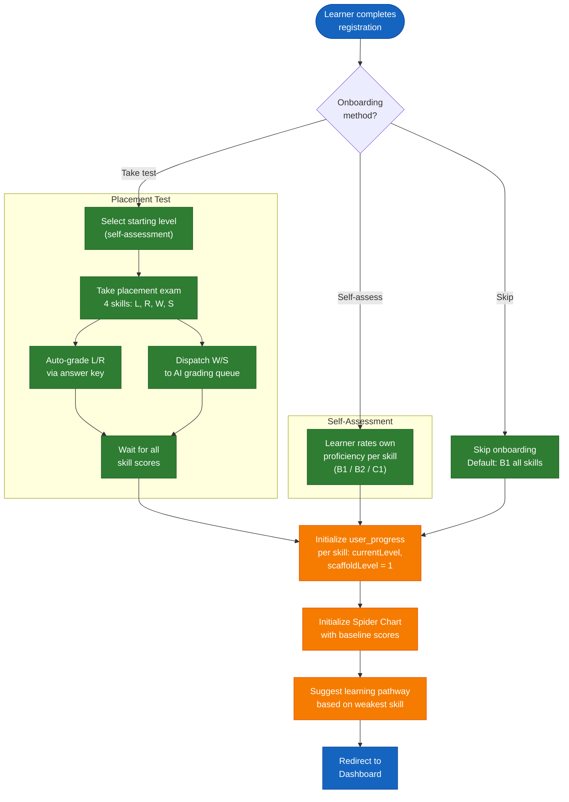

### 3.4 FE-03: Practice Mode — Listening

#### 3.4.1 Get Listening Practice Question

- **Description**: Retrieve a listening practice question with adaptive scaffolding applied.
- **Input**: Authenticated learner request, optional filters (level, format)
- **Processing**: Select question matching learner's current level and scaffold stage → apply scaffolding:
  - Stage 1 (Full Text): Full transcript displayed alongside audio
  - Stage 2 (Highlights): Only key phrases highlighted, partial transcript
  - Stage 3 (Pure Audio): Audio only, no transcript
- **Output**: Question content with appropriate scaffolding applied, audio URL

#### 3.4.2 Submit Listening Practice Answer

- **Description**: Submit answer to a listening practice question and receive immediate score.
- **Input**: `questionId`, `answer` (map of questionId → selected answer)
- **Processing**: Compare answers against answer key → calculate score (`correct/total × 10`, round to 0.5) → derive band → update `user_progress` (attempt count, scaffold level evaluation) → check scaffold progression rules
- **Output**: Score (0–10), band, correct/incorrect per item, updated scaffold level
- **Scaffold Progression Rules** (using `accuracyPct` = score × 10):
  - Level up (reduce scaffold): avg of last 3 attempts ≥ 80
  - Keep stage: avg in [50, 80)
  - Level down (increase scaffold): avg < 50 for 2 consecutive attempts

### 3.5 FE-04: Practice Mode — Reading

#### 3.5.1 Get Reading Practice Question

- **Description**: Retrieve a reading practice question in VSTEP format.
- **Input**: Authenticated learner request, optional filters (level, format type)
- **Processing**: Select question matching learner's current level → return passage with items
- **Output**: Passage text, question items (MCQ, True/False/Not Given, Matching Headings, Fill-in-the-Blanks)
- **Supported Formats**: `reading_mcq`, `reading_tng`, `reading_matching_headings`, `reading_gap_fill`

#### 3.5.2 Submit Reading Practice Answer

- **Description**: Submit answers and receive immediate auto-graded result.
- **Input**: `questionId`, `answer` (map of questionId → selected answer)
- **Processing**: Compare against answer key → calculate score → derive band → update progress
- **Output**: Score (0–10), band, correct/incorrect per item

#### 3.5.3 Learner Practice Flow Diagram

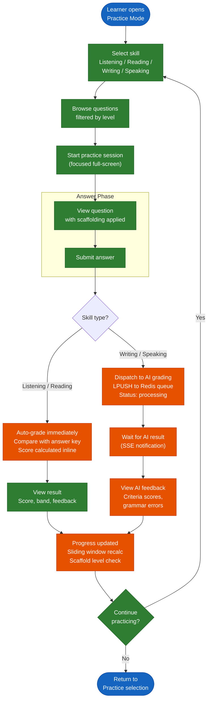

### 3.6 FE-05: Practice Mode — Writing + AI Grading

#### 3.6.1 Get Writing Practice Question

- **Description**: Retrieve a writing practice question with adaptive scaffolding.
- **Input**: Authenticated learner request, optional filters (level, task type)
- **Processing**: Select question → apply scaffolding:
  - Stage 1 (Template): Full template with sentence starters, connectors, checklist
  - Stage 2 (Keywords): Key phrases, transitions, topic vocabulary
  - Stage 3 (Free): No scaffold; micro-hints available on request
- **Output**: Question content (prompt, instructions, minWords), scaffolding materials
- **Supported Formats**: `writing_task_1` (Letter/Email, ≥120 words), `writing_task_2` (Essay, ≥250 words)

#### 3.6.2 Submit Writing Practice Answer

- **Description**: Submit written response for AI grading (asynchronous).
- **Input**: `questionId`, `skill: "writing"`, `answer: { text, wordCount }`
- **Processing**:
  1. Validate input (text not empty, skill matches question)
  2. Create submission record (status = `pending`)
  3. Create submission_details record (answer JSONB)
  4. LPUSH grading task to Redis list `grading:tasks`
  5. Return submission ID with SSE URL for status tracking
- **Output**: `{ submissionId, status: "pending", sseUrl: "/api/sse/submissions/{id}" }`
- **AI Grading Pipeline** (async in worker):
  - LLM evaluates against 4 VSTEP criteria: Task Achievement, Coherence & Cohesion, Lexical Resource, Grammatical Range & Accuracy (each 0–10)
  - Grammar model runs in parallel for detailed error detection
  - Results merged into `AIGradeResult` with overall score, band, criteria scores, feedback, grammar errors, confidence level
- **Confidence Routing**:
  - High confidence → status = `completed` (auto-accept)
  - Medium confidence → status = `review_pending`, priority = `medium`
  - Low confidence → status = `review_pending`, priority = `high`
- **Scaffold Progression Rules** (using `scorePct` = score × 10):
  - Stage 1 → Stage 2: avg of last 3 ≥ 80
  - Stage 2 → Stage 3: avg of last 3 ≥ 75
  - Stage 2 → Stage 1: avg < 60 for 2 consecutive attempts
  - Stage 3 → Stage 2: avg < 65 for 2 consecutive attempts
  - Hint usage > 50% in window of 3 → blocks level up

#### 3.6.3 Get Submission Status (Polling Fallback)

- **Description**: Polling endpoint for clients that cannot use SSE.
- **Input**: Submission ID
- **Output**: `{ status, progress (if processing), result (if completed) }`

#### 3.6.4 Writing/Speaking AI Grading Pipeline Diagram

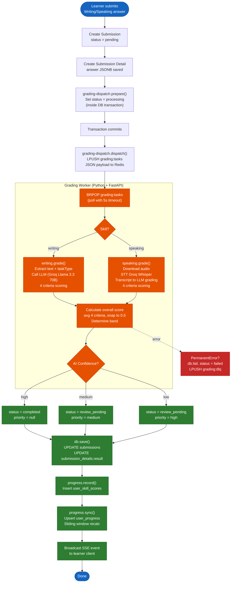

### 3.7 FE-06: Practice Mode — Speaking + AI Grading

#### 3.7.1 Get Speaking Practice Question

- **Description**: Retrieve a speaking practice question.
- **Input**: Authenticated learner request, optional filters (level, part number)
- **Output**: Question content (prompt, preparationSeconds), part number (1/2/3)
- **Supported Formats**: `speaking_part_1` (Social Interaction), `speaking_part_2` (Solution Discussion), `speaking_part_3` (Topic Development)

#### 3.7.2 Submit Speaking Practice Answer

- **Description**: Submit audio recording for AI grading (asynchronous).
- **Input**: `questionId`, `skill: "speaking"`, `answer: { audioUrl, durationSeconds }`
- **Processing**: Same flow as Writing (validate → create submission → enqueue to Redis → return SSE URL). See [Section 3.6.4 — AI Grading Pipeline Diagram](#364-writingspeaking-ai-grading-pipeline-diagram).
- **AI Grading Pipeline** (async in worker):
  - Whisper transcribes audio to text
  - LLM grades transcript against 4 VSTEP criteria: Fluency & Coherence, Pronunciation, Content & Relevance, Vocabulary & Grammar (each 0–10)
  - Confidence routing same as Writing
- **Output**: `{ submissionId, status: "pending", sseUrl: "/api/sse/submissions/{id}" }`

### 3.8 FE-07: Mock Test Mode

#### 3.8.1 List Available Exams

- **Description**: List mock test exams available for the learner.
- **Input**: Optional filter by level (B1/B2/C1)
- **Output**: List of exams with level, section count, time limits

#### 3.8.2 Get Exam Detail

- **Description**: View exam blueprint — 4 sections, question counts, time limits.
- **Input**: Exam ID
- **Output**: Exam details with sections (listening, reading, writing, speaking), question count per section, time limits

#### 3.8.3 Start Exam Session

- **Description**: Begin a timed mock test session.
- **Input**: Exam ID
- **Processing**: Create `exam_session` record (status = `in_progress`), record `started_at`
- **Output**: Session ID, questions organized by section, time limits per section

#### 3.8.4 Auto-Save Answers

- **Description**: Periodically save exam answers (client sends every 30 seconds).
- **Input**: Session ID, answers JSON (full snapshot)
- **Processing**: Update `exam_answers` records. Reject if session already submitted.
- **Output**: `{ saved: true }`

#### 3.8.5 Submit Exam Session

- **Description**: Submit the completed exam for grading.
- **Input**: Session ID
- **Processing**:
  1. Auto-grade Listening answers: compare with answer key → `listening_score = (correct/35) × 10` (round to 0.5)
  2. Auto-grade Reading answers: `reading_score = (correct/40) × 10` (round to 0.5)
  3. Create Writing submissions (status = `pending`) → link via `exam_submissions` → enqueue to Redis
  4. Create Speaking submissions (status = `pending`) → link via `exam_submissions` → enqueue to Redis
  5. Update session status to `submitted`
  6. When all 4 skill scores available → `overall_score = average(4 skills)` → status = `completed`
- **Output**: Session status, immediate L/R scores, pending W/S submissions

#### 3.8.6 Get Exam Session Result

- **Description**: View exam session status and results.
- **Input**: Session ID (owner only)
- **Output**: Status (`in_progress`/`submitted`/`completed`/`abandoned`), per-skill scores and bands, overall score (when completed)

#### 3.8.7 Exam Session Flow Diagram

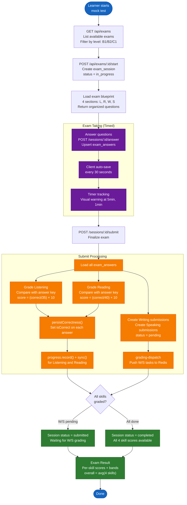

### 3.9 FE-08: Human Grading (Instructor Review)

#### 3.9.1 View Review Queue

- **Description**: List submissions awaiting instructor review.
- **Input**: Instructor/Admin authentication
- **Processing**: Query submissions with `status = 'review_pending'`, sorted by `review_priority` (high > medium > low) then FIFO
- **Output**: Paginated list with submission info, AI result, question content

#### 3.9.2 Claim Submission for Review

- **Description**: Lock a submission for exclusive review by the current instructor.
- **Input**: Submission ID
- **Processing**: Acquire Redis distributed lock `lock:review:{submissionId}` (TTL 15 min) → set `claimed_by` and `claimed_at`
- **Output**: Submission details with AI result for review
- **Error Cases**:
  - Already claimed by another instructor → 409 CONFLICT with claimant info

#### 3.9.3 Release Submission

- **Description**: Release a claimed submission back to the review queue.
- **Input**: Submission ID
- **Processing**: Delete Redis lock → clear `claimed_by` and `claimed_at`
- **Output**: `{ released: true }`

#### 3.9.4 Submit Review

- **Description**: Submit instructor's final score and feedback.
- **Input**: `{ overallScore, band, criteriaScores, feedback, reviewComment }`
- **Processing**:
  1. Instructor score is always final → `gradingMode = 'human'`
  2. Both AI result and human result preserved in `submissionDetails.result` for audit
  3. Set `auditFlag = true` when `|aiScore - humanScore| > 0.5`
  4. Update submission status → `completed`
  5. Record `submissionEvent` (kind = `reviewed`)
  6. Release Redis lock
  7. Broadcast SSE `completed` event
  8. Trigger progress recompute for the learner
- **Output**: Updated submission with final scores

#### 3.9.5 Instructor Review Workflow Diagram

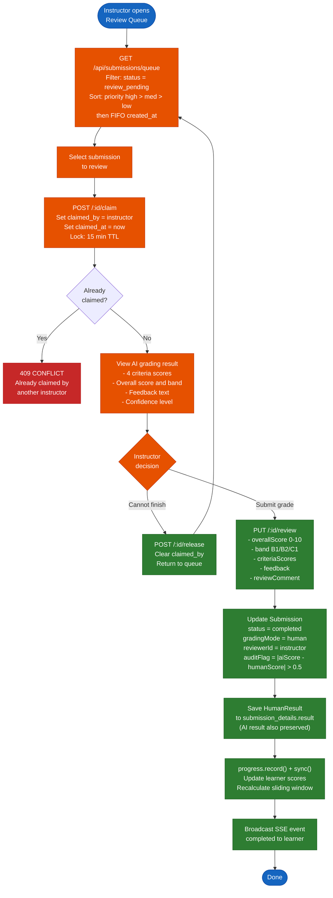

#### 3.9.6 Submission State Machine Diagram

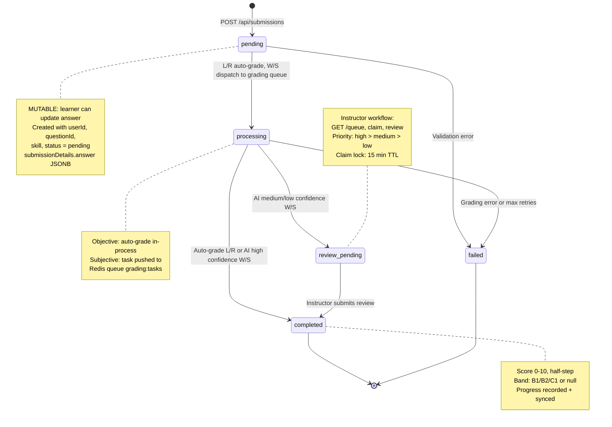

### 3.10 FE-09: Progress Tracking

#### 3.10.1 Get Progress Overview

- **Description**: Overall progress across all four skills.
- **Input**: Authenticated learner request
- **Output**: Per-skill summary (current level, target level, scaffold stage, average score, attempt count, trend)

#### 3.10.2 Get Progress by Skill

- **Description**: Detailed progress for a specific skill.
- **Input**: Skill name (listening/reading/writing/speaking)
- **Processing**: Query 10 most recent completed submissions for the skill → compute sliding window metrics
- **Output**: `{ windowAvg, windowStdDev, trend, scores[], scaffoldLevel, bandEstimate, attemptCount }`
- **Trend Classification** (requires ≥ 3 attempts):
  - `inconsistent`: windowStdDev ≥ 1.5
  - `improving`: delta (avg last 3 − avg previous 3) ≥ +0.5
  - `declining`: delta ≤ −0.5
  - `stable`: otherwise
  - `insufficient_data`: < 3 attempts

#### 3.10.3 Get Spider Chart Data

- **Description**: Data for four-skill Spider Chart visualization.
- **Input**: Authenticated learner request
- **Output**:
  ```json
  {
    "skills": {
      "listening": { "current": 7.5, "trend": "improving" },
      "reading":   { "current": 8.2, "trend": "stable" },
      "writing":   { "current": 6.0, "trend": "improving" },
      "speaking":  { "current": 5.5, "trend": "declining" }
    },
    "goal": { "targetBand": "B2", "deadline": "2026-06-01" },
    "eta": { "weeks": 12, "perSkill": { "listening": 8, "reading": null, "writing": 12, "speaking": 10 } }
  }
  ```

#### 3.10.4 Overall Band Derivation

- **Rule**: `overallBand = min(bandListening, bandReading, bandWriting, bandSpeaking)`
- If any skill has insufficient data → overall band marked as `low_confidence`
- Prevents displaying an inflated overall band when one skill is significantly weaker

#### 3.10.5 ETA (Time-to-Goal) Heuristic

- **Prerequisites**: User has a goal (targetBand), each skill has ≥ 3 attempts
- **Method**: Linear regression on sliding window (max 10 scores per skill)
  - X = days since first attempt, Y = score
  - Slope = rate of improvement per day
  - `etaDays = gap / slope`, `etaWeeks = ceil(etaDays / 7)`
- **Returns null** when: slope ≤ 0, insufficient data, or etaWeeks > 52
- **Returns 0** when: average already meets or exceeds target
- **Overall ETA**: `max(ETA per skill)` — slowest skill determines timeline

#### 3.10.6 Progress Tracking & Sliding Window Diagram

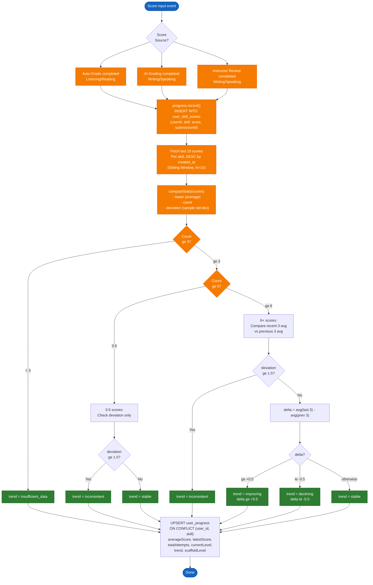

### 3.11 FE-10: Learning Path

#### 3.11.1 Get Personalized Learning Path

- **Description**: Generate a weekly learning plan based on current progress.
- **Input**: Authenticated learner request
- **Processing**:
  1. Identify `weakestSkill` = skill with lowest windowAvg
  2. If two skills differ by ≤ 0.3, prioritize both
  3. Allocate minimum 1 session/week per skill
  4. Remaining sessions distributed proportionally to `gapToTarget`
  5. Content selection: Writing/Speaking → prioritize weakest criteria; Listening/Reading → prioritize most-failed question types
- **Output**: Weekly plan with recommended exercises per skill, difficulty level, and estimated duration

#### 3.11.2 Class Management Flow Diagram

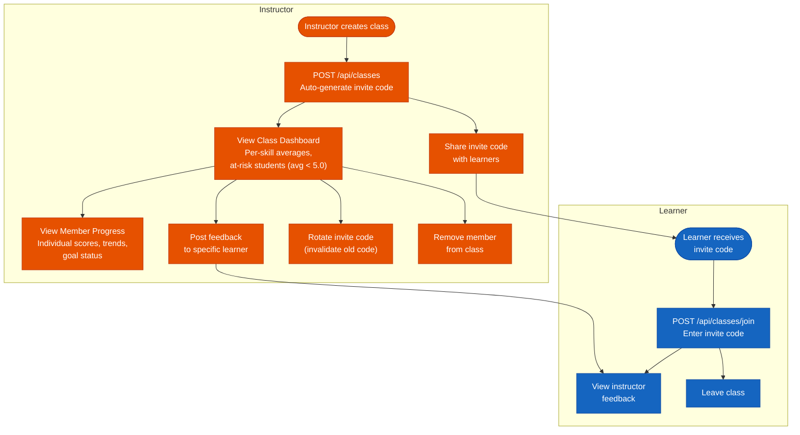

### 3.12 FE-11: Goal Setting

#### 3.12.1 Create Goal

- **Description**: Set a learning goal with target band and optional deadline.
- **Input**: `{ targetBand (B1/B2/C1), deadline? (date), dailyStudyTimeMinutes? (default 30) }`
- **Output**: Created goal with status computation

#### 3.12.2 Get Current Goal

- **Description**: Retrieve the learner's current active goal with status.
- **Output**: `{ targetBand, deadline, dailyStudyTimeMinutes, achieved, onTrack, daysRemaining }`
- **Status Computation**:
  - `achieved`: true if `currentEstimatedBand >= targetBand`
  - `onTrack`: true if ETA ≤ deadline
  - `daysRemaining`: deadline − now

#### 3.12.3 Update Goal

- **Description**: Modify goal parameters (owner only).
- **Input**: Goal ID, updated fields
- **Output**: Updated goal with recomputed status

### 3.13 FE-12: Content Management

#### 3.13.1 Question CRUD

- **Description**: Admin/Instructor manages the question bank.
- **Create**: Provide skill, level, format, content (JSONB), answer_key (JSONB for L/R), rubric (for W/S)
- **Read**: List with filters (skill, level, format, is_active). Detail view includes content and answer_key.
- **Update**: Modify question content. Creates a new version snapshot in `question_versions`.
- **Delete**: Admin soft-deletes by setting `is_active = false`.

#### 3.13.2 Import/Export

- **Description**: Bulk import questions from JSON/Excel format, export for backup.
- **Import**: Validate against skill-specific Zod schemas → insert with version 1
- **Export**: Generate JSON/Excel with all question data

### 3.14 FE-13: User Management

#### 3.14.1 Admin User Operations

- **List Users**: Paginated list with filters (role, email/name search)
- **Change Role**: `PUT /api/admin/users/:id/role` — change between learner/instructor/admin
- **Bulk Create**: Create multiple user accounts from CSV/Excel
- **Lock/Unlock**: Disable/enable user account access
- **Reset Password**: Admin-initiated password reset

### 3.15 FE-14: Analytics Dashboard

#### 3.15.1 Instructor Dashboard

- **Description**: View class statistics and learner progress.
- **Output**: Active learner count, assignment completion rates, average scores by skill, per-learner progress summary

#### 3.15.2 Admin Dashboard

- **Description**: System-wide analytics.
- **Output**: Total users by role, submission distribution by status, average grading time, review queue size, daily active users

### 3.16 FE-15: Notification System

#### 3.16.1 Notification Types

| Type | Trigger | Channel |
|------|---------|---------|
| Grading Complete | Submission status → completed | In-app, Push (mobile) |
| Review Required | New review_pending submission | In-app (instructor) |
| Goal Reminder | Daily study time not met | Push (mobile), In-app |
| Exam Result Ready | Exam session → completed | In-app, Push (mobile) |
| Account Activity | Login from new device | Email |

### 3.17 FE-16: Advanced Admin Features

#### 3.17.1 Activity History

- **Description**: View user activity logs (logins, submissions, reviews).

#### 3.17.2 Auto-Assignment Distribution

- **Description**: Automatically distribute review_pending submissions to available instructors based on workload.

---

## 4. Non-Functional Requirements

### 4.1 External Interfaces

#### 4.1.1 User Interface

- **Web Application**: React 19 + Vite 7, responsive design supporting desktop (1024px+) and tablet (768px+)
- **Mobile Application**: React Native (Android), minimum Android 8.0 (API 26)
- **Language**: Vietnamese (primary), English UI planned for future version
- **Accessibility**: WCAG 2.1 Level AA compliance for core navigation

#### 4.1.2 Hardware Interfaces

- **Microphone**: Required for Speaking practice (audio recording)
- **Speakers/Headphones**: Required for Listening practice (audio playback)
- **Camera**: Not required

#### 4.1.3 Software Interfaces

| External System | Interface | Purpose |
|----------------|-----------|---------|
| Groq API (Llama 3.3 70B) | HTTPS REST | LLM-based Writing/Speaking grading |
| Groq API (Whisper Large V3 Turbo) | HTTPS REST | Speech-to-Text transcription |
| PostgreSQL 17 | TCP 5432 | Primary data store |
| Redis 7.2+ | TCP 6379 | Queue, cache, distributed locks |

#### 4.1.4 Communication Interfaces

- **Protocol**: HTTPS (TLS 1.2+) for all client-server communication
- **API Format**: REST, JSON (UTF-8), ISO 8601 UTC timestamps
- **Real-time**: SSE for grading status updates (unidirectional server → client)
- **Authentication**: JWT Bearer tokens in `Authorization` header

### 4.2 Quality Attributes

#### 4.2.1 Usability

| Requirement | Specification |
|-------------|---------------|
| REQ-U01 | New learner should be able to start first practice exercise within 5 minutes of registration |
| REQ-U02 | Spider Chart and progress data must be understandable without additional explanation |
| REQ-U03 | Practice mode UI provides clear visual indication of current scaffold level |
| REQ-U04 | Error messages displayed in Vietnamese with actionable guidance |
| REQ-U05 | Mobile app supports offline question caching for areas with limited connectivity |
| REQ-U06 | Exam timer prominently displayed during mock test with visual warnings at 5 and 1 minute remaining |

#### 4.2.2 Reliability

| Requirement | Specification |
|-------------|---------------|
| REQ-R01 | System availability: ≥ 99% during business hours (8:00–22:00 ICT) |
| REQ-R02 | Grading worker retry: max 3 attempts with exponential backoff (arq handles internally) |
| REQ-R03 | After max retries exhausted, submission status set to `failed` — no silent data loss |
| REQ-R04 | Exam auto-save every 30 seconds — maximum data loss of 30 seconds of work on connection failure |
| REQ-R05 | Refresh token reuse detection — compromised token triggers revocation of all user tokens |
| REQ-R06 | Database uses `ON DELETE CASCADE` — referential integrity maintained on all deletions |
| REQ-R07 | SSE reconnection with `Last-Event-ID` replay — no missed grading events |

#### 4.2.3 Performance

| Requirement | Specification |
|-------------|---------------|
| REQ-P01 | API response time for CRUD operations: < 200ms (p95) |
| REQ-P02 | Listening/Reading auto-grading: < 500ms (synchronous, in same request) |
| REQ-P03 | Writing AI grading SLA: typically < 5 minutes, timeout 20 minutes |
| REQ-P04 | Speaking AI grading SLA: typically < 10 minutes, timeout 60 minutes |
| REQ-P05 | Spider chart data computation: < 1 second |
| REQ-P06 | Concurrent users supported: ≥ 100 simultaneous learners |
| REQ-P07 | SSE heartbeat: every 30 seconds, max connection lifetime 30 minutes |
| REQ-P08 | Database query for progress (sliding window): bounded to max 10 rows per skill via window function |

#### 4.2.4 Security

| Requirement | Specification |
|-------------|---------------|
| REQ-S01 | Passwords hashed with Argon2id (`Bun.password`) — no plaintext storage |
| REQ-S02 | Refresh tokens stored as SHA-256 hash in database — no plaintext |
| REQ-S03 | JWT access tokens are short-lived; refresh tokens support rotation and reuse detection |
| REQ-S04 | Maximum 3 active refresh tokens per user (device limit) |
| REQ-S05 | RBAC enforced on all API endpoints — learner/instructor/admin role gates |
| REQ-S06 | Submission data access restricted to owner (Row Level Security + Secure Views) |
| REQ-S07 | No secrets in code or logs — environment variables via `.env` files |
| REQ-S08 | Request correlation: `X-Request-Id` header on all responses for audit trail |
| REQ-S09 | Idempotency-Key support on `POST /submissions` to prevent duplicate submissions on retry |

#### 4.2.5 Scalability

| Requirement | Specification |
|-------------|---------------|
| REQ-SC01 | Grading worker can scale horizontally — multiple arq workers consuming from same Redis queue |
| REQ-SC02 | Database indexes optimized for common query patterns (user history, review queue, active questions) |
| REQ-SC03 | SSE hub uses in-memory pub/sub with bounded buffer (100 events) and backpressure |
| REQ-SC04 | Question bank supports 10,000+ questions without performance degradation |

---

## 5. Requirement Appendix

### 5.1 Business Rules

| ID | Rule Definition |
|----|-----------------|
| BR-01 | Listening score = `(correct / 35) × 10`, rounded to nearest 0.5 |
| BR-02 | Reading score = `(correct / 40) × 10`, rounded to nearest 0.5 |
| BR-03 | Writing score = weighted average of 4 criteria (equal weights), rounded to nearest 0.5. For exam: `writing = task1 × (1/3) + task2 × (2/3)` |
| BR-04 | Speaking score = average of 4 criteria, rounded to nearest 0.5 |
| BR-05 | Overall exam score = average of 4 skill scores, rounded to nearest 0.5 |
| BR-06 | Band derivation: 8.5–10.0 → C1, 6.0–8.4 → B2, 4.0–5.9 → B1, below 4.0 → null (no certificate) |
| BR-07 | Overall band = min(band per skill). Missing skill data → low_confidence |
| BR-08 | Submission state machine: only valid transitions allowed. Invalid transition → 409 CONFLICT |
| BR-09 | Valid transitions: pending → processing, processing → completed \| review_pending \| failed, review_pending → completed, pending → failed |
| BR-10 | AI confidence routing: high → completed, medium → review_pending (priority: medium), low → review_pending (priority: high) |
| BR-11 | Instructor score is always final. No weighted blending (AI/human merge removed for simplicity) |
| BR-12 | Audit flag: set when `|aiScore - humanScore| > 0.5` |
| BR-13 | Sliding window: N=10 most recent completed submissions per skill. Minimum 3 for trend computation |
| BR-14 | Scaffold level down requires 2 consecutive attempts below threshold |
| BR-15 | Hint usage > 50% in window of 3 attempts → blocks scaffold level up |
| BR-16 | Max 3 active refresh tokens per user (FIFO — oldest revoked when 4th created) |
| BR-17 | Refresh token reuse (rotated token reused) → revoke ALL user tokens → force re-login |
| BR-18 | Exam session auto-save does not overwrite once session is submitted |
| BR-19 | Review claim lock: Redis TTL 15 minutes. Auto-release after expiry |
| BR-20 | ETA returns null when: slope ≤ 0, insufficient data (< 3 attempts), or estimated > 52 weeks |
| BR-21 | Hard delete with `ON DELETE CASCADE` — no soft delete (except questions: `is_active = false`) |
| BR-22 | All scores use `numeric(3,1)` — range 0.0 to 10.0, step 0.5 |

### 5.2 Common Requirements

| ID | Requirement |
|----|-------------|
| CR-01 | All API endpoints under `/api` prefix (except `GET /health`) |
| CR-02 | All responses use JSON format (UTF-8) with ISO 8601 UTC timestamps |
| CR-03 | All list endpoints support offset pagination: `page` (≥ 1), `limit` (1–100, default 20) |
| CR-04 | All list responses return `{ data: [...], meta: { page, limit, total, totalPages } }` |
| CR-05 | All error responses follow standard envelope: `{ error: { code, message, requestId, details? } }` |
| CR-06 | All responses include `X-Request-Id` header (generated or echoed from client) |
| CR-07 | Authentication via `Authorization: Bearer <jwt>` header on protected endpoints |
| CR-08 | Idempotency supported via `Idempotency-Key` header on POST endpoints with side effects |
| CR-09 | Health check endpoint: `GET /health` returns `{ status: "ok", services: { db, redis } }` |
| CR-10 | OpenAPI specification auto-generated and available at `GET /openapi.json` |

### 5.3 Application Messages List

| # | Message Code | Message Type | Context | Content |
|---|-------------|--------------|---------|---------|
| 1 | MSG01 | Inline | No search results | Không tìm thấy kết quả. |
| 2 | MSG02 | Inline (red) | Required field empty | Trường {field} là bắt buộc. |
| 3 | MSG03 | Toast | Login successful | Đăng nhập thành công. |
| 4 | MSG04 | Toast | Registration successful | Đăng ký thành công. Vui lòng đăng nhập. |
| 5 | MSG05 | Toast | Submission created | Bài làm đã được gửi. Đang chấm điểm... |
| 6 | MSG06 | Toast | Grading completed | Kết quả chấm điểm đã sẵn sàng. |
| 7 | MSG07 | Toast | Review submitted | Đã gửi kết quả chấm bài thành công. |
| 8 | MSG08 | Inline (red) | Input exceeds max length | Vượt quá độ dài tối đa {max_length} ký tự. |
| 9 | MSG09 | Inline | Invalid credentials | Sai email hoặc mật khẩu. Vui lòng thử lại. |
| 10 | MSG10 | Toast | Goal created | Đã thiết lập mục tiêu học tập. |
| 11 | MSG11 | Toast | Goal achieved | Chúc mừng! Bạn đã đạt mục tiêu {targetBand}. |
| 12 | MSG12 | Notification | Grading failed | Chấm điểm thất bại. Vui lòng thử lại sau. |
| 13 | MSG13 | Toast | Exam submitted | Bài thi đã được nộp. Đang chấm điểm... |
| 14 | MSG14 | Toast | Exam completed | Kết quả bài thi đã sẵn sàng. Xem chi tiết. |
| 15 | MSG15 | Notification | Review pending | Bài làm của bạn đang chờ giảng viên chấm. |
| 16 | MSG16 | Inline | Session expired | Phiên đăng nhập đã hết hạn. Vui lòng đăng nhập lại. |
| 17 | MSG17 | Confirmation | Claim submission | Bạn có muốn nhận chấm bài này không? |
| 18 | MSG18 | Toast | Claim successful | Đã nhận bài chấm. Bạn có 15 phút để hoàn thành. |
| 19 | MSG19 | Inline (red) | Already claimed | Bài này đã được giảng viên khác nhận chấm. |
| 20 | MSG20 | Toast | Scaffold level up | Bạn đã lên cấp hỗ trợ! Tiếp tục phát huy nhé. |
| 21 | MSG21 | Toast | Auto-save success | Đã tự động lưu bài thi. |
| 22 | MSG22 | Warning | Exam time warning | Còn {minutes} phút để hoàn thành bài thi. |
| 23 | MSG23 | Inline (red) | Word count insufficient | Bài viết cần tối thiểu {minWords} từ. Hiện tại: {currentWords} từ. |
| 24 | MSG24 | Toast | Password reset | Mật khẩu đã được đặt lại thành công. |
| 25 | MSG25 | Confirmation | Device limit | Bạn đã đăng nhập trên 3 thiết bị. Thiết bị cũ nhất sẽ bị đăng xuất. Tiếp tục? |

---

*Document version: 2.0 — Last updated: SP26SE145*
