# Capstone Project Report

## Report 4 — Software Design Document

**Project**: An Adaptive VSTEP Preparation System with Comprehensive Skill Assessment and Personalized Learning Support
**Project Code**: SP26SE145 · Group: GSP26SE63
**Duration**: 01/01/2026 – 30/04/2026

— Hanoi, March 2026 —

---

# I. Record of Changes

*A — Added · M — Modified · D — Deleted*

| Date | A/M/D | In Charge | Change Description |
|------|-------|-----------|--------------------|
| 02/03/2026 | A | Nghĩa (Leader) | Initial SDD draft |
| 09/03/2026 | M | AI-assisted revision | Rewrote the document to match the current codebase and removed flows that are not complete end-to-end |

---

# II. Software Design Document

## 1. System Design

### 1.1 Scope reflected by this document

This document **only describes functions that already have both web frontend code and backend code actively used in the current monorepo**.

**Included in this document:**
- User authentication: register, login, refresh token, logout
- User profile: view/update profile, change password, upload avatar
- Onboarding through **self-assessment** and goal initialization
- Mock exam flow: exam list, exam detail, session start, auto-save, submit
- Post-submit Writing grading through the AI worker
- Learning progress: overview, spider chart, activity, skill detail, history from exam sessions
- Submission history and submission detail pages
- Admin screens that are already used in the web app: users, questions, knowledge points, exams, submissions

**Not described as complete flows in this document:**
- `classes`, `notifications`, `ai`, `practice/next`, and `vocabulary` API because the current web frontend does not use them as complete integrated flows
- Instructor review queue on the web because there is no corresponding frontend screen yet
- End-to-end Speaking AI grading: the frontend currently records audio as local blob URLs and does not upload them to object storage before worker processing

### 1.2 System architecture

The current system consists of 3 main applications inside the monorepo:

| Component | Technology | Current role |
|-----------|------------|--------------|
| Web Frontend | React 19 + Vite 7 + TanStack Router + React Query | SPA interface for learners and admins |
| Backend API | Bun + Elysia + Drizzle ORM | REST API, authentication, business logic, content administration, grading orchestration |
| Grading Worker | Python + Redis Streams + LiteLLM | Consumes Writing grading tasks and sends results back to backend through Redis streams |

### 1.3 High-level architecture diagram

```mermaid
flowchart LR
    subgraph FE[Web SPA]
        AuthPages[Login / Register]
        OnboardingPage[Onboarding]
        ExamPages[Exams / Exam Session]
        ProgressPages[Progress / History]
        SubmissionPages[Submissions]
        ProfilePage[Profile]
        AdminPages[Admin Users / Questions / KPs / Exams / Submissions]
    end

    subgraph BE[Backend API - Bun + Elysia]
        AuthMod[/auth]
        UsersMod[/users]
        OnboardingMod[/onboarding]
        ExamsMod[/exams]
        ProgressMod[/progress]
        SubmissionsMod[/submissions]
        QuestionsMod[/questions]
        KPMod[/knowledge-points]
    end

    subgraph DATA[Data Layer]
        PG[(PostgreSQL 17)]
        Redis[(Redis Streams)]
        MinIO[(MinIO / S3)]
    end

    subgraph GRADING[AI Grading Service]
        Worker[worker.py]
        WritingPipeline[writing.py]
        LLM[LiteLLM]
    end

    FE -->|REST JSON + JWT| BE
    UsersMod -->|avatar storage| MinIO
    BE --> PG
    SubmissionsMod -->|XADD grading:tasks| Redis
    Worker -->|XREADGROUP grading:tasks| Redis
    Worker --> WritingPipeline --> LLM
    Worker -->|XADD grading:results| Redis
    BE -->|XREADGROUP grading:results| Redis
    BE -->|persist final result| PG
```

### 1.4 Key design decisions

| Decision | Current design | Rationale |
|----------|----------------|-----------|
| Frontend-backend communication | REST API under `/api` | Simple, explicit, fits SPA architecture |
| Authentication | JWT access token + refresh token rotation | Supports multi-session login and frontend integration |
| Grading queue | **Redis Streams** (`grading:tasks`, `grading:results`) | Decouples backend and worker with consumer groups |
| Database writes after AI grading | **Backend** performs the final PostgreSQL write | Keeps state transitions centralized in backend |
| Progress tracking | `user_skill_scores` + `user_progress` | Separates raw score events from aggregated metrics |
| User file storage | MinIO through storage abstraction | Used for avatar storage; web speaking upload is not fully integrated yet |
| UI separation | Route groups by auth / learner / admin | Clear separation of user journeys |

### 1.5 Package Diagram

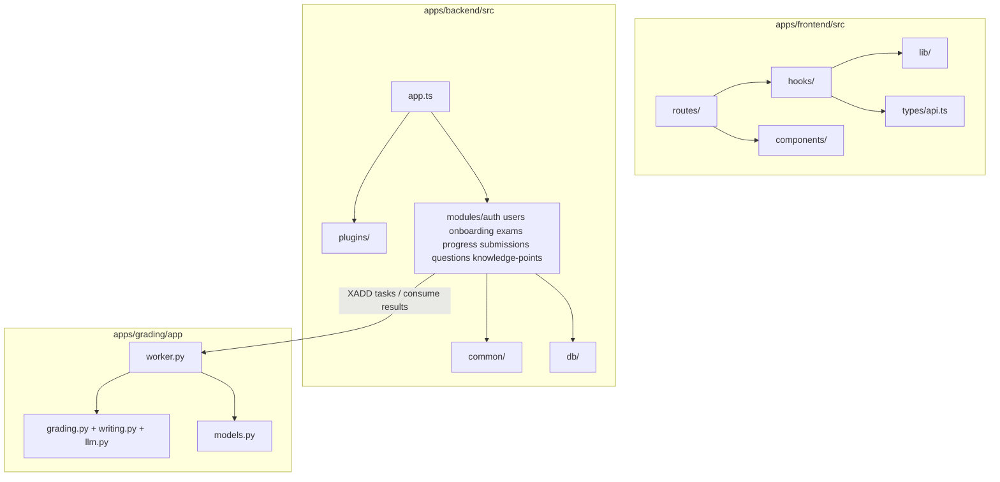

### 1.6 Package descriptions

| No. | Package | Description |
|-----|---------|-------------|
| 1 | `apps/frontend/src/routes/_auth` | Login and registration screens |
| 2 | `apps/frontend/src/routes/_focused` | Onboarding and session-based exam workspace |
| 3 | `apps/frontend/src/routes/_learner` | Profile, exams, progress, submissions |
| 4 | `apps/frontend/src/routes/admin` | Admin screens that already have real UI |
| 5 | `apps/frontend/src/hooks` | React Query hooks that call backend APIs |
| 6 | `apps/frontend/src/lib` | API client, auth storage, query client |
| 7 | `apps/backend/src/modules/auth` | Register, login, refresh, logout |
| 8 | `apps/backend/src/modules/users` | Profile, password change, avatar, admin user management |
| 9 | `apps/backend/src/modules/onboarding` | Self-assess, placement start, skip |
| 10 | `apps/backend/src/modules/exams` | Exam CRUD, sessions, auto-save, submit |
| 11 | `apps/backend/src/modules/submissions` | Submissions, objective auto-grade, grading dispatch, admin assignment |
| 12 | `apps/backend/src/modules/progress` | Progress overview, spider chart, activity, goals |
| 13 | `apps/backend/src/modules/questions` | Question bank management |
| 14 | `apps/backend/src/modules/knowledge-points` | Knowledge point management |
| 15 | `apps/grading/app/worker.py` | Redis Streams worker for Writing grading |
| 16 | `apps/grading/app/writing.py` | Pipeline that calls the LLM and normalizes grading output |

---

## 2. Database Design

### 2.1 ERD for currently integrated end-to-end flows

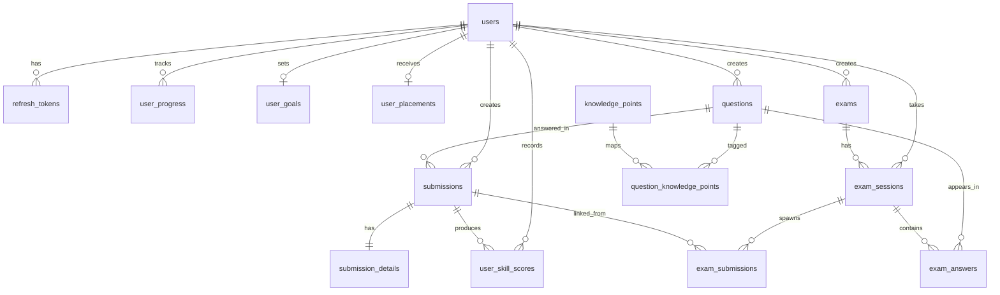

### 2.2 Main table descriptions

| No. | Table | Description |
|-----|-------|-------------|
| 1 | `users` | User accounts, roles, avatar |
| 2 | `refresh_tokens` | Refresh-token sessions with rotation and revocation |
| 3 | `questions` | Question bank used by exams and submissions |
| 4 | `knowledge_points` | Knowledge-point taxonomy managed by admins |
| 5 | `question_knowledge_points` | Many-to-many mapping between questions and knowledge points |
| 6 | `exams` | Exams with `title`, `level`, `type`, `durationMinutes`, `blueprint` |
| 7 | `exam_sessions` | Learner exam sessions and per-skill scores |
| 8 | `exam_answers` | Saved answers within an exam session |
| 9 | `exam_submissions` | Links exam sessions to generated Writing submissions after submit |
| 10 | `submissions` | Independent submissions and submissions spawned from exam submit |
| 11 | `submission_details` | Answer payload and grading result payload for a submission |
| 12 | `user_skill_scores` | Time-series score events used for trend calculation |
| 13 | `user_progress` | Aggregated progress row per user per skill |
| 14 | `user_goals` | Target band, deadline, daily study time |
| 15 | `user_placements` | Onboarding/self-assessment/placement result |

### 2.3 Important data attributes

| Table | Primary key | Main foreign keys | Notes |
|-------|-------------|-------------------|-------|
| `users` | `id` | — | `role` = learner/instructor/admin |
| `refresh_tokens` | `id` | `user_id -> users.id` | Stores hashes, not plaintext tokens |
| `questions` | `id` | `created_by -> users.id` | Includes `skill`, `level`, `part`, `content`, `answer_key` |
| `exams` | `id` | `created_by -> users.id` | `blueprint` is JSONB |
| `exam_sessions` | `id` | `user_id`, `exam_id` | Includes `listening_score`, `reading_score`, `writing_score`, `speaking_score`, `overall_score`, `overall_band` |
| `exam_answers` | `id` | `session_id`, `question_id` | Unique `(session_id, question_id)` |
| `submissions` | `id` | `user_id`, `question_id`, `reviewer_id`, `claimed_by` | State machine `pending -> processing -> completed/review_pending/failed` |
| `submission_details` | `submission_id` | `submission_id -> submissions.id` | One-to-one with submissions |
| `user_skill_scores` | `id` | `user_id`, `submission_id?`, `session_id?` | Used for sliding-window analytics |
| `user_progress` | `id` | `user_id` | Unique `(user_id, skill)` |
| `user_goals` | `id` | `user_id` | One goal per user |
| `user_placements` | `id` | `user_id`, `session_id?` | Self-assessment / placement / skip result |

### 2.4 Enums and indexes in use

**Main enums in the current codebase**

| Enum | Values |
|------|--------|
| `user_role` | `learner`, `instructor`, `admin` |
| `skill` | `listening`, `reading`, `writing`, `speaking` |
| `question_level` | `A2`, `B1`, `B2`, `C1` |
| `vstep_band` | `B1`, `B2`, `C1` |
| `submission_status` | `pending`, `processing`, `completed`, `review_pending`, `failed` |
| `grading_mode` | `auto`, `human`, `hybrid` |
| `exam_status` | `in_progress`, `submitted`, `completed`, `abandoned` |
| `exam_type` | `practice`, `placement`, `mock` |
| `knowledge_point_category` | `grammar`, `vocabulary`, `strategy`, `topic` |

**Important hot-path indexes**

| Index | Purpose |
|------|---------|
| `users_email_unique` | Login lookup by email |
| `refresh_tokens_active_idx` | Limits active refresh tokens per user |
| `submissions_review_queue_idx` | Review/grading queue queries |
| `submissions_user_history_idx` | Submission history by time |
| `exam_answers_session_question_idx` | One answer per question per session |
| `exams_active_idx` | Active exam listing |
| `user_progress_user_skill_idx` | One progress row per skill |
| `user_skill_scores_user_skill_idx` | Last-10 score retrieval for trend calculation |

### 2.5 JSONB structures used in the implementation

| Column | Role |
|--------|------|
| `questions.content` | Question content by skill/part |
| `questions.answer_key` | Objective answer key |
| `exams.blueprint` | Question ID lists by skill |
| `exam_answers.answer` | Answer payload saved inside a session |
| `submission_details.answer` | Submission payload created by the learner |
| `submission_details.result` | Grading result payload: `auto`, `ai`, or `human` |

---

## 3. Detailed Design

## 3.1 Authentication and session management

### 3.1.1 Processing structure

```mermaid
flowchart LR
    LoginPage[Login/Register Page] --> ApiClient[api.ts]
    ApiClient --> AuthRoutes[/api/auth/*]
    AuthRoutes --> AuthService[auth/service.ts]
    AuthService --> Users[(users)]
    AuthService --> Tokens[(refresh_tokens)]
```

### 3.1.2 Sequence Diagram — Login

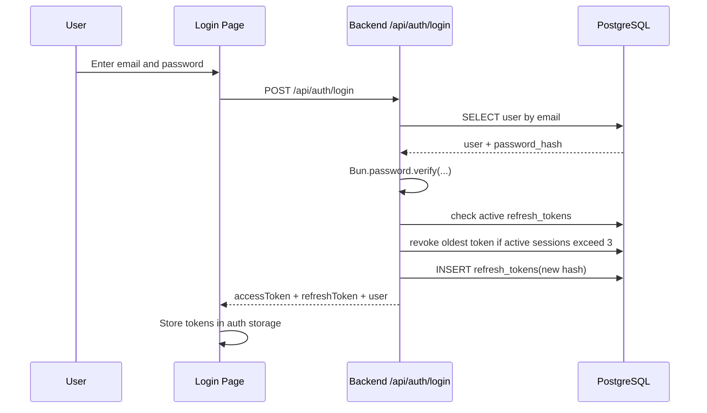

### 3.1.3 Sequence Diagram — Token refresh

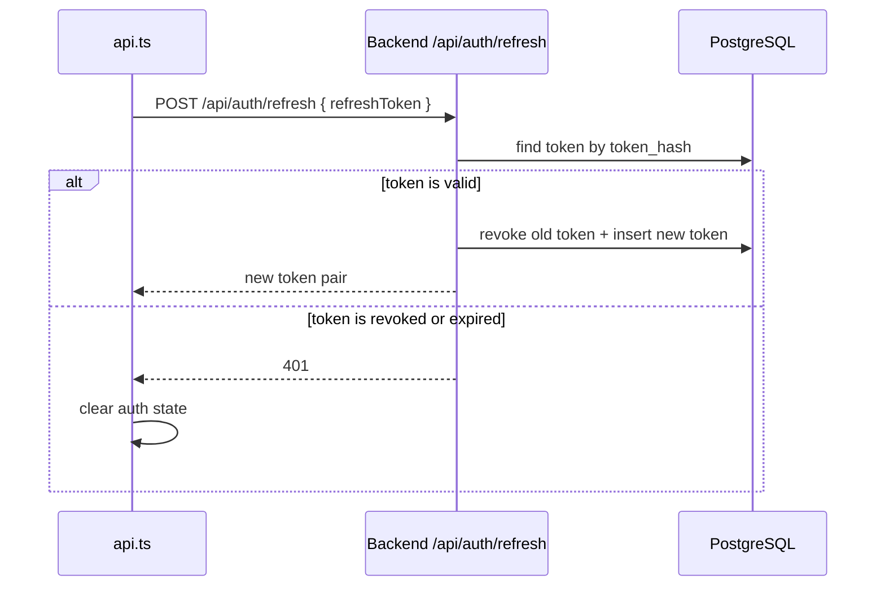

## 3.2 Onboarding through self-assessment and goal initialization

### 3.2.1 Processing structure

```mermaid
flowchart LR
    OnboardingPage[Onboarding Page] --> QuizLogic[Quiz/self-assess UI]
    QuizLogic --> ApiClient[api.post /api/onboarding/self-assess]
    ApiClient --> OnboardingRoute[/api/onboarding/self-assess]
    OnboardingRoute --> OnboardingService[onboarding/service.ts]
    OnboardingService --> Placements[(user_placements)]
    OnboardingService --> Goals[(user_goals)]
    OnboardingService --> Progress[(user_progress)]
```

### 3.2.2 Sequence Diagram — Self-assessment

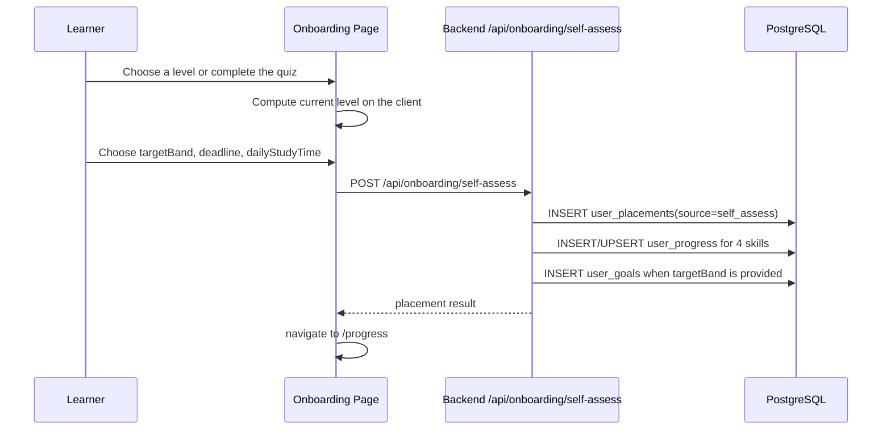

## 3.3 User profile

### 3.3.1 Processing structure

```mermaid
flowchart LR
    ProfilePage[Profile Page] --> UserHooks[useUser / useUpdateUser / useChangePassword / useUploadAvatar]
    UserHooks --> UserRoutes[/api/users/:id, /password, /avatar]
    UserRoutes --> UserService[users/service.ts]
    UserService --> Users[(users)]
    UserService --> Storage[(MinIO via storage.ts)]
```

### 3.3.2 Sequence Diagram — Profile and avatar update

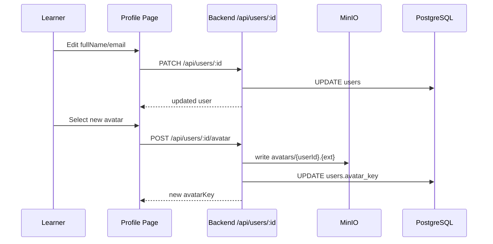

## 3.4 Exam session: start, auto-save, submit

### 3.4.1 Processing structure

```mermaid
flowchart LR
    ExamList[Exam List Page] --> StartExam[POST /api/exams/:id/start]
    ExamWorkspace[/practice/:sessionId] --> SaveAnswers[PUT /api/exams/sessions/:sessionId]
    ExamWorkspace --> SubmitExam[POST /api/exams/sessions/:sessionId/submit]
    StartExam --> ExamsRoute[/api/exams]
    SaveAnswers --> ExamsRoute
    SubmitExam --> ExamsRoute
    ExamsRoute --> SessionService[session.ts + submit.ts]
    SessionService --> ExamsDB[(exams / exam_sessions / exam_answers)]
    SessionService --> SubmissionsDB[(submissions / submission_details / exam_submissions)]
```

### 3.4.2 Sequence Diagram — Start exam and auto-save

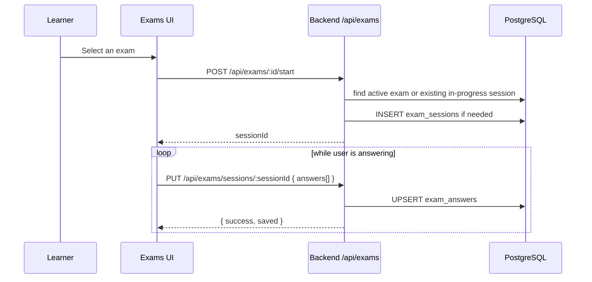

### 3.4.3 Sequence Diagram — Submit exam

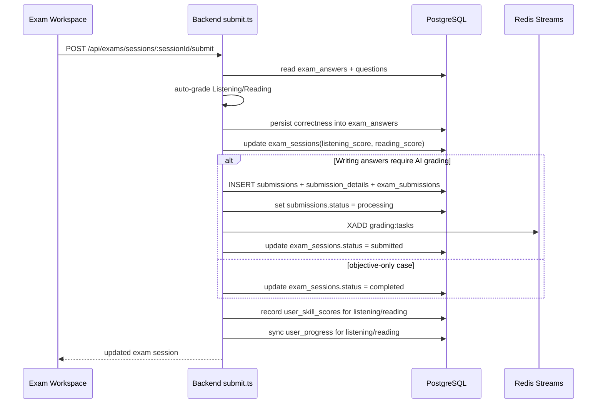

## 3.5 Writing grading through the AI worker

> This is the AI-grading flow that is currently complete in the web application. Speaking is intentionally excluded here because the web frontend does not yet upload audio to object storage before worker processing.

### 3.5.1 Processing structure

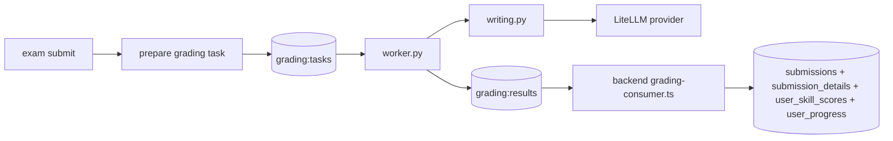

### 3.5.2 Sequence Diagram — Writing grading pipeline

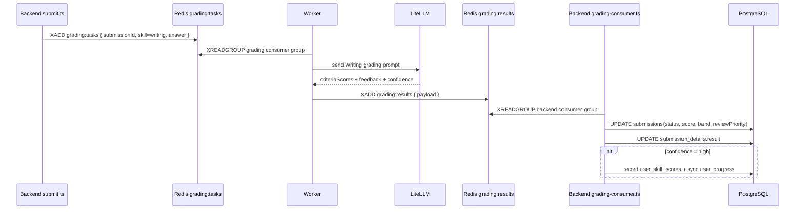

## 3.6 Learning progress and submission history

### 3.6.1 Processing structure

```mermaid
flowchart LR
    ProgressPage[Progress Pages] --> ProgressHooks[useProgress / useSpiderChart / useActivity / useSkillDetail]
    SubmissionPages[Submission Pages] --> SubmissionHooks[useSubmissions / useSubmission]
    ProgressHooks --> ProgressRoutes[/api/progress/*]
    SubmissionHooks --> SubmissionRoutes[/api/submissions/*]
    ProgressRoutes --> ProgressService[progress/service.ts + overview.ts]
    SubmissionRoutes --> SubmissionService[submissions/service.ts]
    ProgressService --> Scores[(user_skill_scores)]
    ProgressService --> Progress[(user_progress)]
    SubmissionService --> SubmissionTables[(submissions + submission_details)]
```

### 3.6.2 Sequence Diagram — Progress sync after scoring

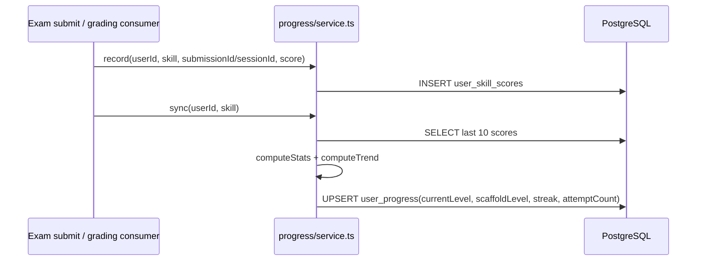

### 3.6.3 Learner screens that consume these data

| Web route | Backend data |
|-----------|--------------|
| `/progress` | overview + spider chart + activity |
| `/progress/:skill` | skill detail + recent scores + trend |
| `/progress/history` | completed exam sessions |
| `/submissions` | learner submission list |
| `/submissions/:id` | answer, result, feedback, criteria scores |

## 3.7 Administration

### 3.7.1 Admin scope that already has real UI

| Admin screen | Operations currently available |
|--------------|--------------------------------|
| `/admin/users` | List, filter, create, delete user |
| `/admin/questions` | List, filter, view JSON content, delete question |
| `/admin/knowledge-points` | List, filter, create, delete knowledge point |
| `/admin/exams` | List, create exam, toggle active state |
| `/admin/submissions` | List/filter submissions, auto-grade objective submissions, assign reviewer |

### 3.7.2 Sequence Diagram — Admin creates an exam

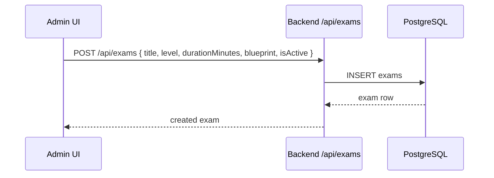

### 3.7.3 Sequence Diagram — Admin auto-grades an objective submission

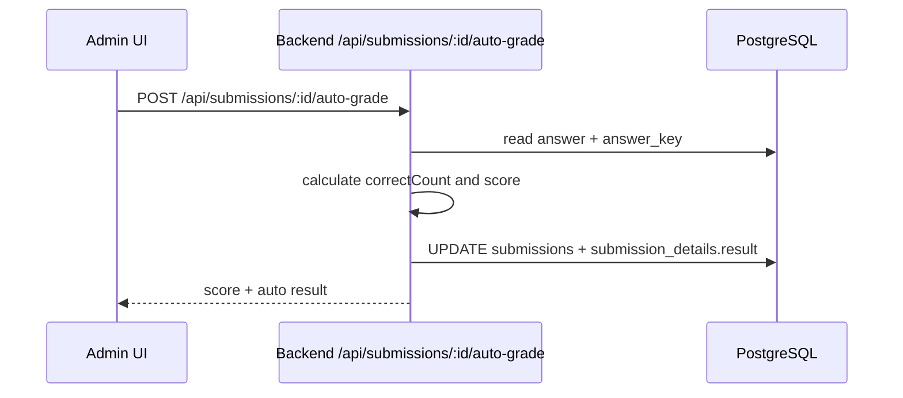

---

## 4. Interface Design

### 4.1 Frontend routes actively used in the web application

| Group | Route | Purpose |
|------|-------|---------|
| Auth | `/login`, `/register` | Login and registration |
| Focused flow | `/onboarding` | Self-assessment and goal initialization |
| Exams | `/exams`, `/exams/:examId`, `/practice/:sessionId`, `/exams/sessions/:sessionId` | Select exam, take exam, view session result |
| Progress | `/progress`, `/progress/:skill`, `/progress/history` | Progress dashboard and exam history |
| Submissions | `/submissions`, `/submissions/:id` | Submission history and detail |
| Profile | `/profile` | Profile, avatar, password change |
| Admin | `/admin/users`, `/admin/questions`, `/admin/knowledge-points`, `/admin/exams`, `/admin/submissions` | System administration |

### 4.2 Backend endpoints currently consumed by the frontend

| Group | Method | Path |
|------|--------|------|
| Auth | POST | `/api/auth/login` |
| Auth | POST | `/api/auth/register` |
| Auth | POST | `/api/auth/refresh` |
| Auth | POST | `/api/auth/logout` |
| Users/Profile | GET | `/api/users/:id` |
| Users/Profile | PATCH | `/api/users/:id` |
| Users/Profile | POST | `/api/users/:id/password` |
| Users/Profile | POST | `/api/users/:id/avatar` |
| Onboarding | POST | `/api/onboarding/self-assess` |
| Exams | GET | `/api/exams` |
| Exams | GET | `/api/exams/:id` |
| Exams | POST | `/api/exams/:id/start` |
| Exams | GET | `/api/exams/sessions` |
| Exams | GET | `/api/exams/sessions/:sessionId` |
| Exams | PUT | `/api/exams/sessions/:sessionId` |
| Exams | POST | `/api/exams/sessions/:sessionId/submit` |
| Progress | GET | `/api/progress` |
| Progress | GET | `/api/progress/spider-chart` |
| Progress | GET | `/api/progress/activity` |
| Progress | GET | `/api/progress/:skill` |
| Submissions | GET | `/api/submissions` |
| Submissions | GET | `/api/submissions/:id` |
| Admin Users | GET | `/api/users` |
| Admin Users | POST | `/api/users` |
| Admin Users | DELETE | `/api/users/:id` |
| Admin Questions | GET | `/api/questions` |
| Admin Questions | DELETE | `/api/questions/:id` |
| Admin Knowledge Points | GET | `/api/knowledge-points` |
| Admin Knowledge Points | POST | `/api/knowledge-points` |
| Admin Knowledge Points | DELETE | `/api/knowledge-points/:id` |
| Admin Exams | POST | `/api/exams` |
| Admin Exams | PATCH | `/api/exams/:id` |
| Admin Submissions | POST | `/api/submissions/:id/auto-grade` |
| Admin Submissions | POST | `/api/submissions/:id/assign` |

### 4.3 Deliberately excluded parts

The following parts **may already have code on one side or may exist as route skeletons**, but they are **not treated as complete web end-to-end functions** and are therefore excluded from the main design scope of this report:

- `classes`
- `notifications`
- `ai`
- `practice/next`
- `vocabulary` API
- Instructor review queue on the frontend
- Speaking audio upload and end-to-end Speaking AI grading from the web

---

## 5. Design Decisions and Constraints

### 5.1 Security

| Topic | Current design |
|------|----------------|
| Password hashing | `Bun.password.hash(..., "argon2id")` |
| Access control | JWT Bearer + role macros in `plugins/auth.ts` |
| Refresh token | SHA-256 hash in DB, rotation, reuse detection |
| Max active sessions | 3 active refresh tokens per user |
| Row-level access | Users can only access their own data unless they are admins |

### 5.2 Data consistency

| Topic | Current design |
|------|----------------|
| Multi-step mutations | Implemented with `db.transaction(...)` |
| Exam submit | Objective grading and Writing-submission creation happen in the same transaction |
| AI grading dispatch | `prepare()` inside the transaction, `dispatch()` after commit |
| Progress synchronization | `record()` followed by `sync()` after each score event |
| Final DB write after AI grading | Backend consumer writes DB from `grading:results` |

### 5.3 Implementation constraints

- Frontend is a client-side SPA, not SSR
- Backend is the source of truth for schema and state transitions
- Grading queue uses Redis Streams, **not LPUSH/BRPOP**
- The worker **does not write directly to PostgreSQL** in the current grading flow
- This report prioritizes implementation accuracy over documenting every module present in the repository

---

## 6. References

| # | Document | Description |
|---|----------|-------------|
| 1 | `apps/frontend/src/` | Current web frontend source code |
| 2 | `apps/backend/src/` | Current backend source code |
| 3 | `apps/grading/app/` | Current Writing grading worker source code |
| 4 | `docs/capstone/specs/architecture.md` | Current technical architecture |
| 5 | `docs/capstone/specs/api-contracts.md` | Current API contracts |
| 6 | `docs/capstone/specs/database.md` | Current schema summary |
| 7 | `docs/capstone/specs/domain-logic.md` | Lifecycle, grading, and progress logic |

---

*Document version: 2.0 — Synchronized with the monorepo implementation in March 2026*
