# Capstone Project Report

## Report 4 — Software Design Document

**Project**: An Adaptive VSTEP Preparation System with Comprehensive Skill Assessment and Personalized Learning Support

**Project Code**: SP26SE145 · Group: GSP26SE63

**Duration**: 01/01/2026 – 30/04/2026

— Hanoi, March 2026 —

---

# I. Record of Changes

*A — Added · M — Modified · D — Deleted

| Date | A/M/D | In Charge | Change Description |
|------|-------|-----------|-------------------|
| 02/03/2026 | A | Nghĩa (Leader) | Initial SDD — architecture design, component diagrams, sequence diagrams, database design, interface design |

---

# II. Software Design Document

## 1. Architecture Design

### 1.1 Architecture Overview

The Adaptive VSTEP Preparation System follows a **modular monorepo** architecture with three independently deployable applications sharing a single Git repository:

| Application | Runtime | Role |
|-------------|---------|------|
| **Backend** (Main API) | Bun + Elysia | REST API server handling all client requests, authentication, business logic, and auto-grading for objective skills |
| **Grading** (AI Worker) | Python + FastAPI | Async worker consuming Redis Stream tasks for AI-powered Writing/Speaking grading via LLM and STT |
| **Frontend** (Web SPA) | React 19 + Vite 7 | Single-page application serving the learner, instructor, and admin interfaces |

**Key architectural decisions:**

- **Shared-DB pattern**: Backend connects to PostgreSQL via Drizzle ORM. The Grading Worker communicates only through Redis Streams — it does not connect to PostgreSQL directly. The backend grading consumer reads results from the `grading:results` stream and performs all database writes.
- **Redis Streams**: Redis Streams with `XADD`/`XREADGROUP` and consumer groups for reliable task dispatch and result consumption.
- **JWT Auth**: Access/refresh token pair with rotation and reuse detection.
- **Parse, Don't Validate**: All inputs validated at API boundaries via Zod/TypeBox schemas. Internal code assumes valid data.
- **Throw, Don't Return**: All apps use typed error hierarchies. Errors are thrown, never returned as values.

### 1.2 System Architecture Diagram

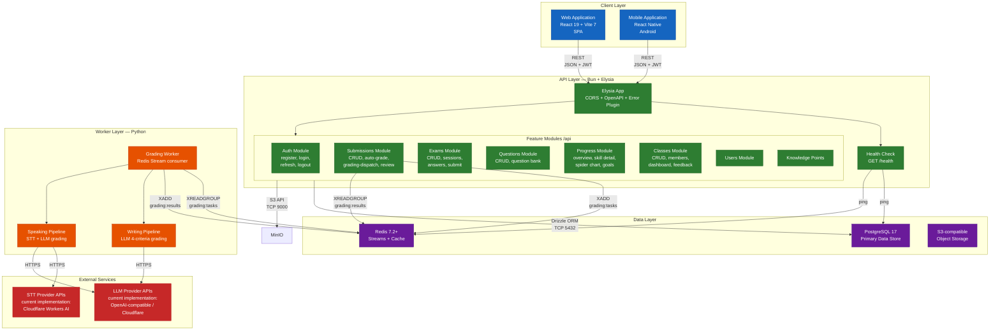

### 1.3 Deployment Diagram

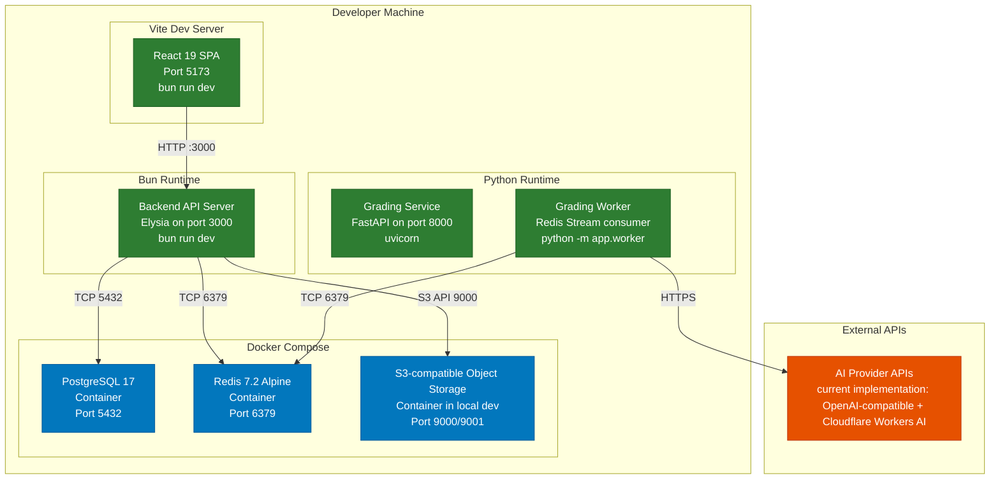

### 1.4 Technology Stack

| Layer | Technology | Version | Purpose |
|-------|-----------|---------|---------|
| Runtime (Backend) | Bun | latest | High-performance JavaScript/TypeScript runtime |
| Framework (Backend) | Elysia | 1.x | Type-safe REST API framework with OpenAPI generation |
| ORM | Drizzle ORM | latest | Type-safe SQL query builder with migration support |
| Schema Validation | Zod / TypeBox | latest | Input validation at API boundaries |
| JWT | Jose | latest | JWT signing, verification, and token management |
| Database | PostgreSQL | 17 | Primary relational data store with JSONB support |
| Cache / Queue | Redis | 7.2+ | Task queue (Streams XADD/XREADGROUP), caching |
| Frontend | React | 19 | UI component library |
| Build Tool | Vite | 7 | Frontend build, dev server, HMR |
| Frontend Language | TypeScript | 5.x | Type-safe frontend development |
| Grading Runtime | Python | 3.11+ | AI grading microservice runtime |
| Grading Framework | FastAPI | latest | Health check and admin API for grading service |
| LLM Provider | Provider-configurable LLM APIs | — | Writing/Speaking AI grading via LLM; current implementation uses OpenAI-compatible and Cloudflare providers |
| STT Provider | Provider-configurable STT APIs | — | Speech-to-Text transcription for Speaking; current implementation uses Cloudflare Workers AI |
| Linting | Biome | latest | Code formatting and linting enforcement |
| Testing (Backend) | bun:test | — | Unit and integration testing |
| Testing (Grading) | pytest | — | Grading service unit tests |
| Containerization | Docker Compose | — | Local development PostgreSQL + Redis + S3-compatible object storage |

---

## 2. Component Design

### 2.1 Backend Component Diagram

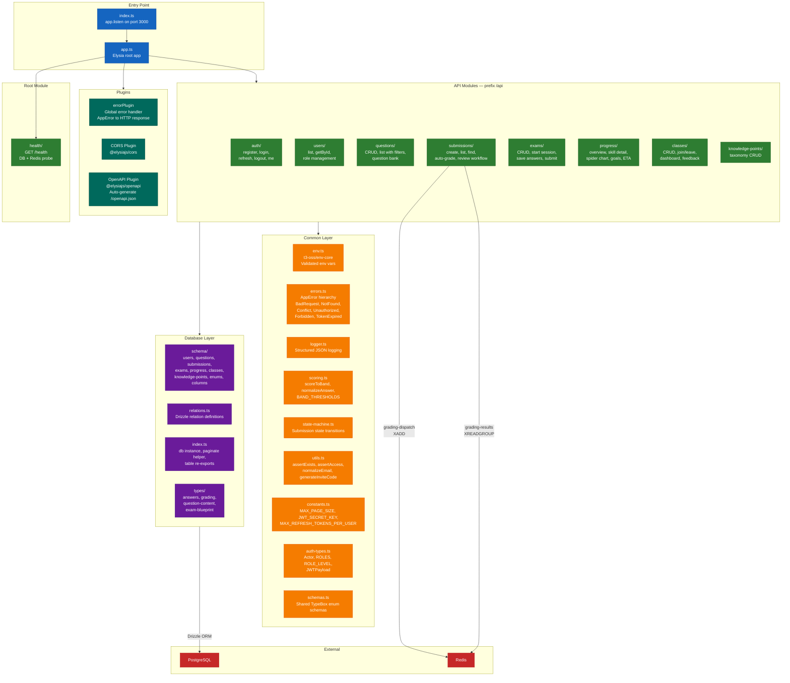

### 2.2 Grading Service Component Diagram

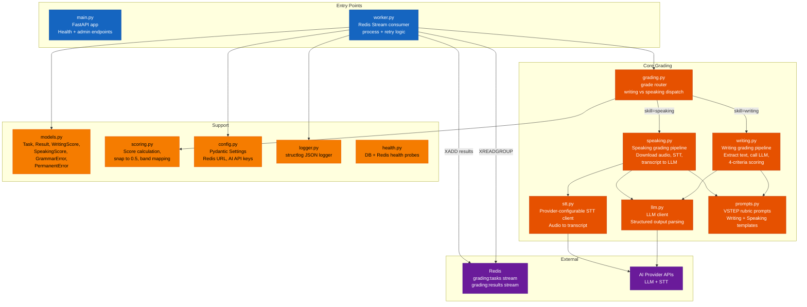

### 2.3 Frontend Component Structure (Planned)

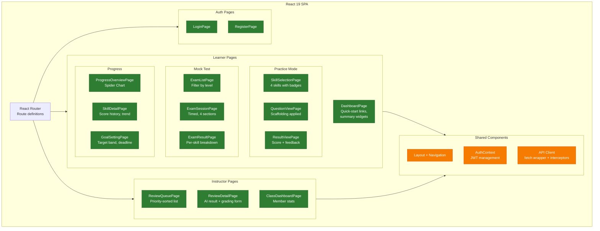

---

## 3. Detailed Design

### 3.1 Package Diagram

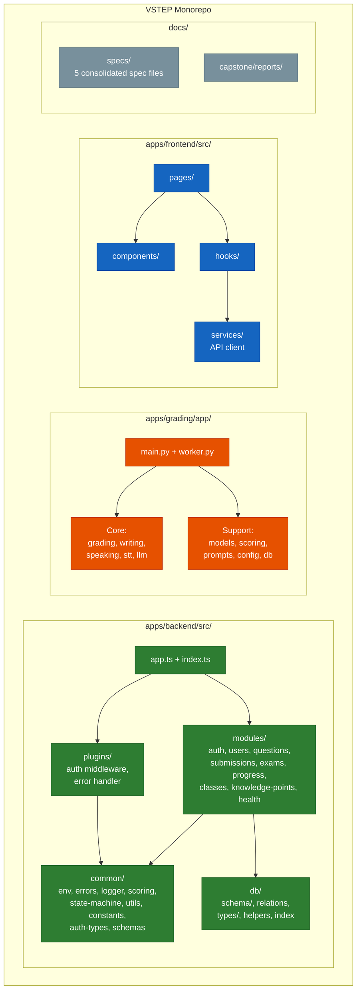

### 3.2 Sequence Diagram — User Authentication (Login)

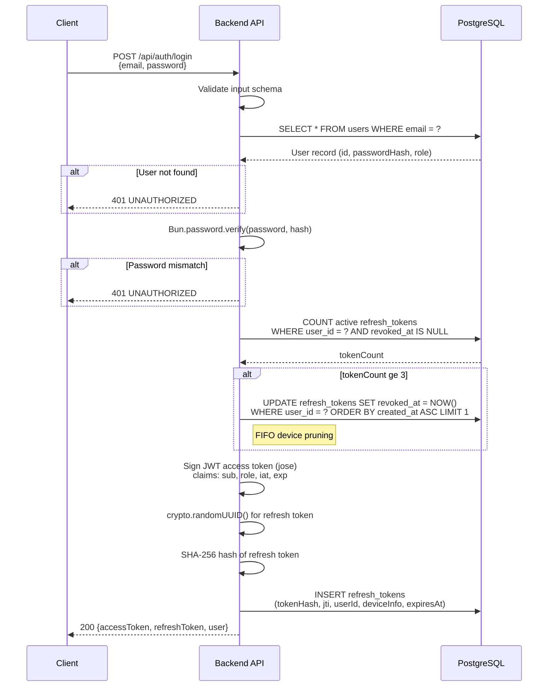

### 3.3 Sequence Diagram — Submit Writing Practice (AI Grading)

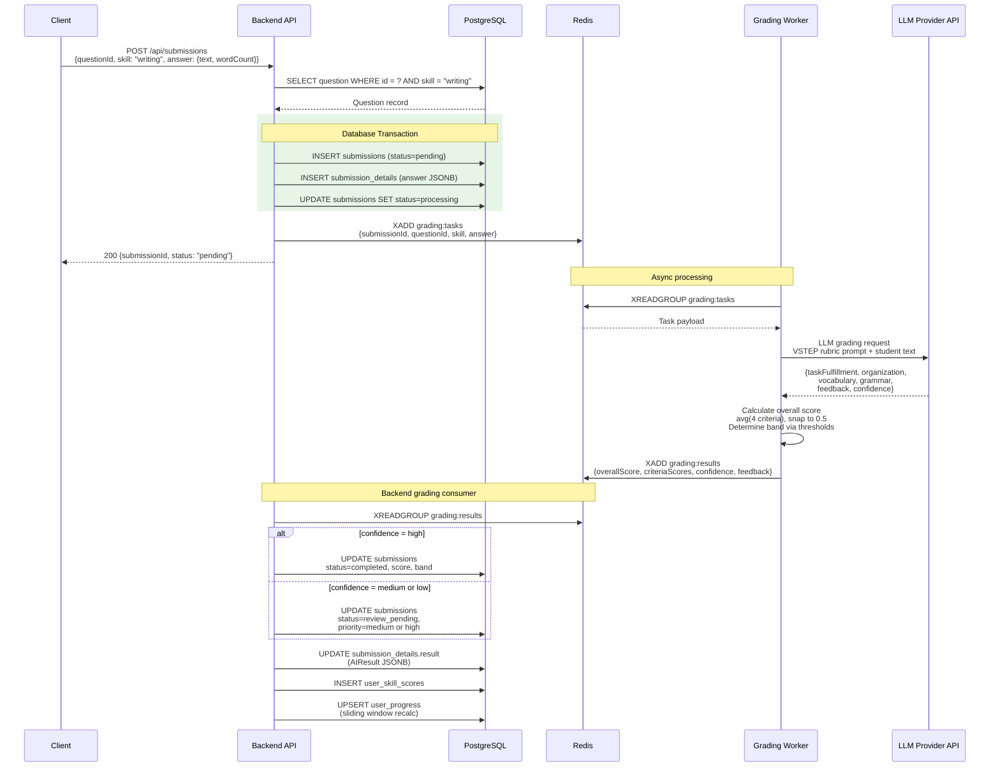

### 3.4 Sequence Diagram — Exam Session Flow

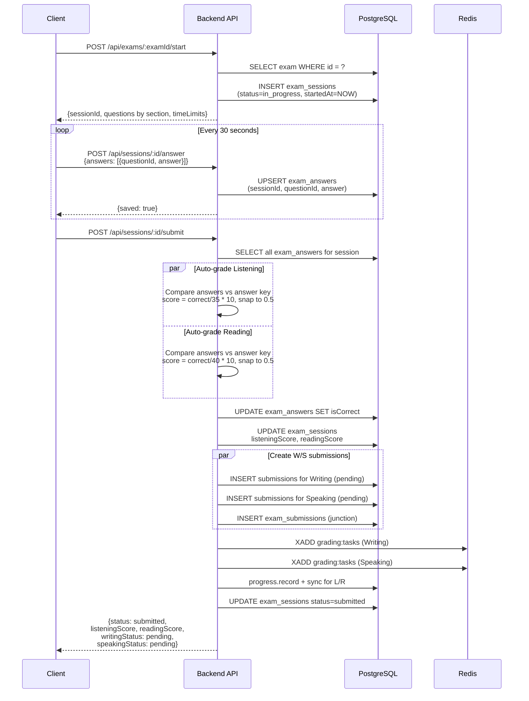

### 3.5 Sequence Diagram — Instructor Review Workflow

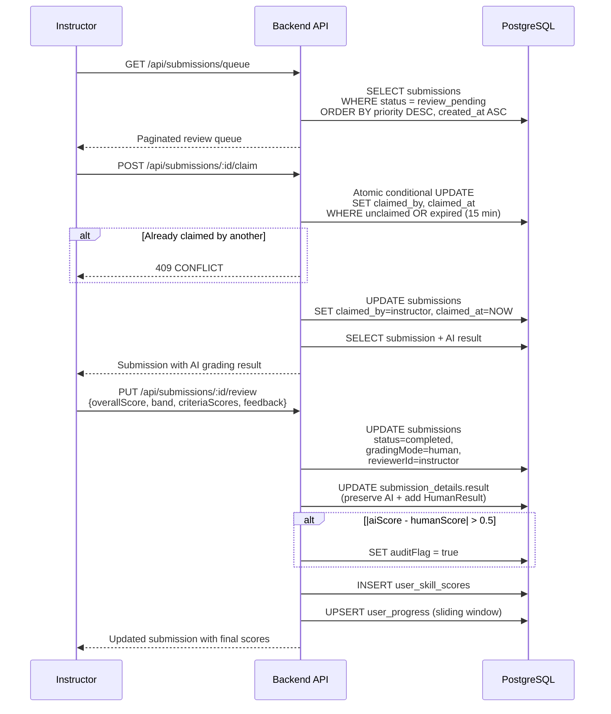

### 3.6 Sequence Diagram — Token Refresh with Replay Detection

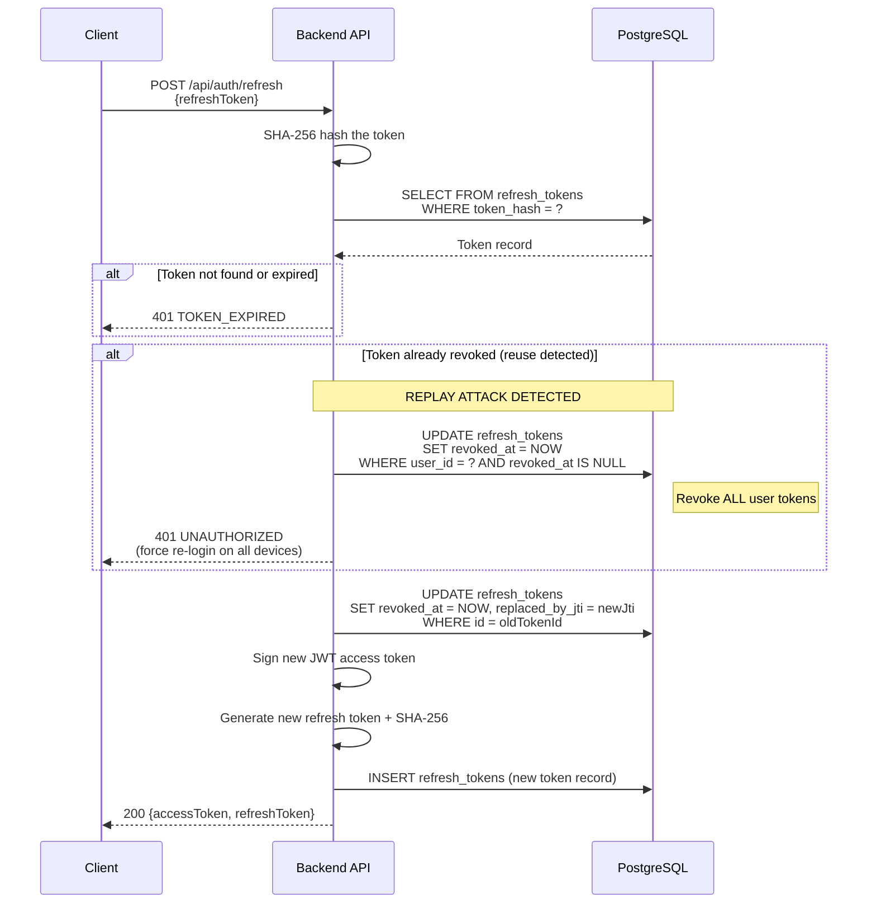

### 3.7 Sequence Diagram — Progress Tracking (Sliding Window)

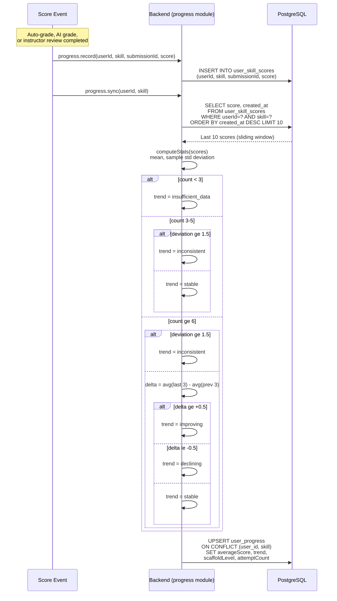

### 3.8 State Machine — Submission Lifecycle

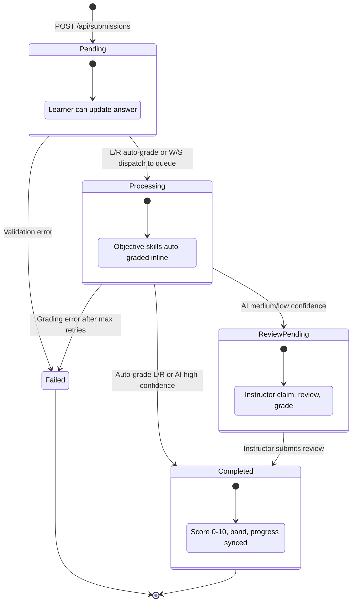

### 3.9 State Machine — Exam Session Lifecycle

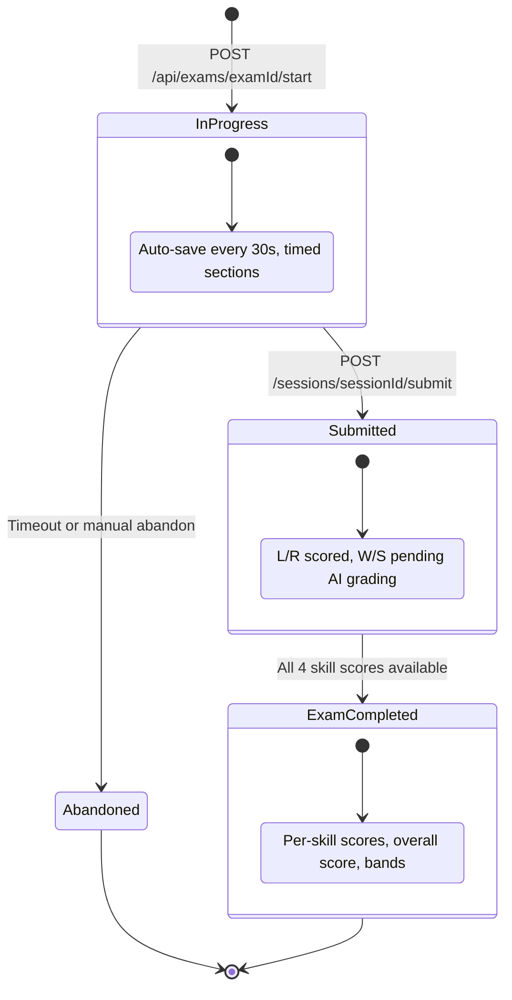

---

## 4. Database Design

### 4.1 Physical Entity-Relationship Diagram

```mermaid
erDiagram
    users ||--o{ refresh_tokens : "has sessions"
    users ||--o{ submissions : "creates"
    users ||--o{ user_progress : "tracks per skill"
    users ||--o{ user_skill_scores : "records scores"
    users ||--o{ user_goals : "sets goals"
    users ||--o{ user_knowledge_progress : "learns KPs"
    users ||--o{ exam_sessions : "takes exams"
    users ||--o{ classes : "owns as instructor"
    users ||--o{ class_members : "enrolls in"
    users ||--o{ instructor_feedback : "gives feedback"
    users ||--o{ instructor_feedback : "receives feedback"
    users ||--o{ notifications : "receives"
    users ||--o{ device_tokens : "registers devices"
    users ||--o{ user_placements : "has placements"
    users ||--o{ questions : "creates"
    users ||--o{ exams : "creates"

    questions ||--o{ submissions : "answered in"
    questions ||--o{ question_knowledge_points : "tagged with"
    questions ||--o{ exam_answers : "included in"

    knowledge_points ||--o{ question_knowledge_points : "mapped to"
    knowledge_points ||--o{ user_knowledge_progress : "tracked by"

    exams ||--o{ exam_sessions : "has sessions"
    exam_sessions ||--o{ exam_answers : "contains answers"
    exam_sessions ||--o{ exam_submissions : "produces submissions"

    submissions ||--|| submission_details : "has detail 1-to-1"
    submissions ||--o{ exam_submissions : "linked from exam"
    submissions ||--o{ user_skill_scores : "records score"

    classes ||--o{ class_members : "enrolls members"
    classes ||--o{ instructor_feedback : "contains feedback"
    vocabulary_topics ||--o{ vocabulary_words : "contains"
    vocabulary_words ||--o{ user_vocabulary_progress : "tracked by"
    users ||--o{ user_vocabulary_progress : "learns words"

    users {
        uuid id PK
        varchar email UK "unique not null"
        varchar password_hash "argon2id"
        varchar full_name "nullable"
        enum role "learner | instructor | admin"
        timestamp created_at
        timestamp updated_at
    }

    refresh_tokens {
        uuid id PK
        uuid user_id FK
        varchar token_hash "SHA-256 64 chars"
        varchar jti UK "JWT ID unique"
        varchar replaced_by_jti "rotation tracking"
        text device_info "User-Agent"
        timestamp revoked_at "nullable"
        timestamp expires_at "not null"
        timestamp created_at
    }

    questions {
        uuid id PK
        enum skill "listening | reading | writing | speaking"
        smallint part "L:1-3 R:1-4 W:1-2 S:1-3"
        jsonb content "QuestionContent 8 types"
        jsonb answer_key "ObjectiveAnswerKey nullable"
        text explanation "nullable"
        boolean is_active "soft delete"
        uuid created_by FK
        timestamp created_at
        timestamp updated_at
    }

    submissions {
        uuid id PK
        uuid user_id FK
        uuid question_id FK
        enum skill "listening | reading | writing | speaking"
        enum status "pending | processing | completed | review_pending | failed"
        numeric score "0.0-10.0 step 0.5"
        enum band "B1 | B2 | C1 nullable"
        enum review_priority "low | medium | high nullable"
        enum grading_mode "auto | human | hybrid nullable"
        uuid reviewer_id FK "nullable"
        boolean audit_flag "AI vs human diff > 0.5"
        uuid claimed_by FK "nullable"
        timestamp claimed_at "nullable"
        timestamp completed_at "nullable"
        timestamp created_at
        timestamp updated_at
    }

    submission_details {
        uuid submission_id PK "FK to submissions"
        jsonb answer "ObjectiveAnswer | WritingAnswer | SpeakingAnswer"
        jsonb result "AutoResult | AIResult | HumanResult nullable"
        varchar feedback "max 10000 chars"
        timestamp created_at
        timestamp updated_at
    }

    exams {
        uuid id PK
        varchar title "max 255 not null"
        text description "nullable"
        enum type "practice | placement | mock"
        enum skill "nullable"
        enum level "A2 | B1 | B2 | C1"
        integer duration_minutes "nullable"
        jsonb blueprint "ExamBlueprint per-skill questionIds"
        boolean is_active "default true"
        uuid created_by FK
        timestamp created_at
        timestamp updated_at
    }

    exam_sessions {
        uuid id PK
        uuid user_id FK
        uuid exam_id FK
        enum status "in_progress | submitted | completed | abandoned"
        numeric listening_score "nullable"
        numeric reading_score "nullable"
        numeric writing_score "nullable"
        numeric speaking_score "nullable"
        numeric overall_score "nullable"
        enum overall_band "B1 | B2 | C1 nullable"
        timestamp started_at "not null"
        timestamp completed_at "nullable"
        timestamp created_at
        timestamp updated_at
    }

    exam_answers {
        uuid id PK
        uuid session_id FK
        uuid question_id FK
        jsonb answer "SubmissionAnswer"
        boolean is_correct "set on submit"
        timestamp created_at
        timestamp updated_at
    }

    exam_submissions {
        uuid id PK
        uuid session_id FK
        uuid submission_id FK
        enum skill "writing | speaking"
        timestamp created_at
    }

    knowledge_points {
        uuid id PK
        enum category "grammar | vocabulary | strategy | topic"
        varchar name UK "unique max 200"
        timestamp created_at
        timestamp updated_at
    }

    question_knowledge_points {
        uuid question_id PK "FK to questions"
        uuid knowledge_point_id PK "FK to knowledge_points"
    }

    user_progress {
        uuid id PK
        uuid user_id FK
        enum skill "listening | reading | writing | speaking"
        enum current_level "A2 | B1 | B2 | C1"
        enum target_level "nullable"
        integer scaffold_level "1-5 default 1"
        integer streak_count "default 0"
        enum streak_direction "up | down | neutral"
        integer attempt_count "default 0"
        timestamp created_at
        timestamp updated_at
    }

    user_skill_scores {
        uuid id PK
        uuid user_id FK
        enum skill "listening | reading | writing | speaking"
        uuid submission_id FK "nullable"
        uuid session_id FK "nullable"
        numeric score "0.0-10.0 not null"
        varchar scaffolding_type "max 20 nullable"
        timestamp created_at
    }

    user_goals {
        uuid id PK
        uuid user_id FK
        enum target_band "B1 | B2 | C1"
        enum current_estimated_band "B1 | B2 | C1 nullable"
        timestamp deadline "nullable"
        integer daily_study_time_minutes "default 30"
        timestamp created_at
        timestamp updated_at
    }

    user_knowledge_progress {
        uuid id PK
        uuid user_id FK
        uuid knowledge_point_id FK
        numeric mastery_score "0-100 default 0"
        integer total_attempted "default 0"
        integer total_correct "default 0"
        timestamp created_at
        timestamp updated_at
    }

    classes {
        uuid id PK
        text name "not null"
        text description "nullable"
        uuid instructor_id FK "not null"
        text invite_code UK "unique not null"
        timestamp created_at
        timestamp updated_at
    }

    class_members {
        uuid id PK
        uuid class_id FK
        uuid user_id FK
        timestamp joined_at "not null"
        timestamp removed_at "nullable"
    }

    instructor_feedback {
        uuid id PK
        uuid class_id FK
        uuid from_user_id FK
        uuid to_user_id FK
        text content "not null"
        enum skill "nullable"
        uuid submission_id FK "nullable"
        timestamp created_at
    }

    vocabulary_topics {
        uuid id PK
        varchar name UK "unique max 200"
        text description "not null"
        varchar icon_key "nullable"
        integer sort_order "default 0"
        timestamp created_at
        timestamp updated_at
    }

    vocabulary_words {
        uuid id PK
        uuid topic_id FK "not null"
        varchar word "max 100 not null"
        varchar phonetic "max 100 nullable"
        varchar audio_url "max 500 nullable"
        varchar part_of_speech "max 20 not null"
        text definition "not null"
        text explanation "not null"
        jsonb examples "string array default []"
        integer sort_order "default 0"
        timestamp created_at
        timestamp updated_at
    }

    user_vocabulary_progress {
        uuid user_id PK "FK to users"
        uuid word_id PK "FK to vocabulary_words"
        boolean known "default false"
        timestamp last_reviewed_at "nullable"
        timestamp created_at
        timestamp updated_at
    }

    notifications {
        uuid id PK
        uuid user_id FK "not null"
        enum type "notification_type enum"
        varchar title "max 255 not null"
        text body "nullable"
        jsonb data "nullable"
        timestamp read_at "nullable"
        timestamp created_at
    }

    device_tokens {
        uuid id PK
        uuid user_id FK "not null"
        text token UK "unique not null"
        varchar platform "max 10 not null"
        timestamp created_at
    }
```

### 4.2 Index Strategy

| Index Name | Table | Column(s) | Type | Purpose |
|-----------|-------|-----------|------|---------|
| `users_email_unique` | users | email | Unique | O(1) login lookup by email |
| `users_role_idx` | users | role | B-Tree | Filter users by role (admin listing) |
| `refresh_tokens_hash_idx` | refresh_tokens | token_hash | B-Tree | O(1) token verification on refresh |
| `refresh_tokens_jti_unique` | refresh_tokens | jti | Unique | Ensure JWT ID uniqueness |
| `refresh_tokens_active_idx` | refresh_tokens | user_id | Partial (revoked_at IS NULL) | Count active devices for FIFO pruning |
| `submissions_user_status_idx` | submissions | (user_id, status) | Composite | User submission history with status filter |
| `submissions_review_queue_idx` | submissions | status | Partial (status = 'review_pending') | Fast review queue retrieval |
| `submissions_user_history_idx` | submissions | (user_id, created_at) | Composite | Chronological submission history |
| `exam_sessions_user_status_idx` | exam_sessions | (user_id, status) | Composite | User exam history filtering |
| `exams_active_idx` | exams | level | Partial (is_active = true) | Active exam listing by level |
| `user_progress_user_skill_idx` | user_progress | (user_id, skill) | Unique | One progress row per user per skill |
| `user_skill_scores_user_skill_idx` | user_skill_scores | (user_id, skill, created_at) | Composite | Sliding window query (last 10 scores) |
| `class_members_class_user_idx` | class_members | (class_id, user_id) | Unique | Prevent duplicate enrollment |
| `exam_answers_session_question_idx` | exam_answers | (session_id, question_id) | Unique | One answer per question per session |
| `feedback_class_to_idx` | instructor_feedback | (class_id, to_user_id) | Composite | Feedback lookup for learner in class |
| `vocabulary_words_topic_idx` | vocabulary_words | topic_id | B-Tree | Fast word lookup by topic |
| `notifications_user_idx` | notifications | (user_id, created_at) | Composite | User notification timeline |
| `notifications_unread_idx` | notifications | user_id | Partial (read_at IS NULL) | Fast unread notification count |
| `device_tokens_user_idx` | device_tokens | user_id | B-Tree | Device lookup for push notifications |

### 4.3 JSONB Schema Design

The system uses PostgreSQL JSONB columns for flexible, schema-variant data. All JSONB payloads are validated at the application boundary via TypeBox/Zod schemas.

#### 4.3.1 Question Content (`questions.content`)

Discriminated union on question `skill` and `part`. Supports 10 content types:

| Skill | Content Type | Content Structure |
|-------|-----------|-------------------|
| Listening | `ListeningContent` | `{ audioUrl, transcript?, items: [{ stem, options: [A,B,C,D] }] }` |
| Listening | `ListeningDictationContent` | `{ audioUrl, transcript, transcriptWithGaps, items: [{ correctText }] }` |
| Reading | `ReadingContent` | `{ passage, title?, items: [{ stem, options: [A,B,C,D] }] }` |
| Reading | `ReadingTNGContent` | `{ passage, title?, items: [{ stem, options: [T,F,NG] }] }` (True/False/Not Given) |
| Reading | `ReadingMatchingContent` | `{ title?, paragraphs: [{ label, text }], headings: [] }` |
| Reading | `ReadingGapFillContent` | `{ title?, textWithGaps, items: [{ options: [A,B,C,D] }] }` |
| Writing | `WritingContent` | `{ prompt, taskType: "letter" \| "essay", instructions?, minWords, requiredPoints? }` |
| Speaking | `SpeakingPart1Content` | `{ topics: [{ name, questions: [3] }] }` (2 topics, social interaction) |
| Speaking | `SpeakingPart2Content` | `{ situation, options: [3], preparationSeconds, speakingSeconds }` |
| Speaking | `SpeakingPart3Content` | `{ centralIdea, suggestions: [3], followUpQuestion, preparationSeconds, speakingSeconds }` |

#### 4.3.2 Submission Answer (`submission_details.answer`)

| Type | Structure | Used For |
|------|-----------|----------|
| `ObjectiveAnswer` | `{ answers: Record<string, string> }` | Listening, Reading |
| `WritingAnswer` | `{ text }` | Writing |
| `SpeakingAnswer` | `{ audioUrl, durationSeconds, transcript? }` | Speaking |

#### 4.3.3 Grading Result (`submission_details.result`)

Discriminated union on `type` field:

| Type | Key Fields | Used When |
|------|-----------|-----------|
| `AutoResult` | `{ type: "auto", correctCount, totalCount, score, band, gradedAt }` | L/R auto-grading |
| `AIResult` | `{ type: "ai", overallScore, band, criteriaScores, feedback, grammarErrors?, confidence, gradedAt }` | W/S AI grading |
| `HumanResult` | `{ type: "human", overallScore, band, criteriaScores?, feedback?, reviewerId, reviewedAt, reviewComment? }` | Instructor review |

#### 4.3.4 Exam Blueprint (`exams.blueprint`)

```
ExamBlueprint = {
  listening?: { questionIds: string[] },
  reading?:   { questionIds: string[] },
  writing?:   { questionIds: string[] },
  speaking?:  { questionIds: string[] },
  durationMinutes?: number
}
```

### 4.4 Enum Definitions

| Enum Name | Values | Used In |
|----------|--------|---------|
| `user_role` | `learner`, `instructor`, `admin` | `users.role` |
| `skill` | `listening`, `reading`, `writing`, `speaking` | `questions`, `submissions`, `user_progress`, `user_skill_scores`, `exam_submissions`, `instructor_feedback` |
| `question_level` | `A2`, `B1`, `B2`, `C1` | `exams.level`, `user_progress.current_level`, `user_progress.target_level` |
| `vstep_band` | `B1`, `B2`, `C1` | `submissions.band`, `user_goals.target_band`, `user_goals.current_estimated_band`, `exam_sessions.overall_band` |
| `submission_status` | `pending`, `processing`, `completed`, `review_pending`, `failed` | `submissions.status` |
| `review_priority` | `low`, `medium`, `high` | `submissions.review_priority` |
| `grading_mode` | `auto`, `human`, `hybrid` | `submissions.grading_mode` |
| `exam_status` | `in_progress`, `submitted`, `completed`, `abandoned` | `exam_sessions.status` |
| `streak_direction` | `up`, `down`, `neutral` | `user_progress.streak_direction` |
| `knowledge_point_category` | `grammar`, `vocabulary`, `strategy`, `topic` | `knowledge_points.category` |
| `notification_type` | `grading_completed`, `feedback_received`, `class_invite`, `goal_achieved`, `system` | `notifications.type` |
| `exam_type` | `practice`, `placement`, `mock` | `exams.type` |
| `exam_skill` | `listening`, `reading`, `writing`, `speaking`, `mixed` | `exams.skill` |
| `placement_status` | `completed`, `skipped` | `user_placements.status` |
| `placement_source` | `self_assess`, `placement`, `skipped` | `user_placements.source` |
| `placement_confidence` | `high`, `medium`, `low` | `user_placements.confidence` |

---

## 5. Interface Design

### 5.1 API Architecture

| Aspect | Specification |
|--------|---------------|
| Base URL | `/api` prefix for all feature endpoints; `/health` at root level |
| Auth | JWT Bearer token in `Authorization` header. Access token (short-lived) + Refresh token (long-lived, rotated). |
| Pagination | Offset-based: `page` (min 1), `limit` (1–100, default 20) |
| List Response | `{ data: [...], meta: { page, limit, total, totalPages } }` |
| Error Response | `{ error: { code, message, requestId, details? } }` |
| Request ID | `X-Request-Id` header on all responses (generated or echoed) |
| Idempotency | `Idempotency-Key` header on `POST` endpoints with side effects |
| Timestamps | ISO 8601 UTC format (e.g., `2026-03-02T12:00:00.000Z`) |
| Content Type | `application/json` (UTF-8) |
| OpenAPI | Auto-generated spec at `GET /openapi.json` |

### 5.2 API Endpoint Catalog

#### 5.2.1 Health

| Method | Path | Auth | Description |
|--------|------|------|-------------|
| GET | `/health` | No | Health check — probes PostgreSQL and Redis connectivity |

#### 5.2.2 Auth

| Method | Path | Auth | Description |
|--------|------|------|-------------|
| POST | `/api/auth/register` | No | Register new user (email, password, fullName). Role defaults to `learner`. |
| POST | `/api/auth/login` | No | Authenticate with email + password. Returns JWT pair + user profile. |
| POST | `/api/auth/refresh` | No | Rotate refresh token. Replay detection triggers full revocation. |
| POST | `/api/auth/logout` | Yes | Revoke current refresh token. |
| GET | `/api/auth/me` | Yes | Return current user profile from access token claims. |

#### 5.2.3 Users

| Method | Path | Auth | Description |
|--------|------|------|-------------|
| GET | `/api/users` | Admin | Paginated user list with filters (role, search). |
| GET | `/api/users/:id` | Admin | Get user by ID. |
| PUT | `/api/users/:id/role` | Admin | Change user role (learner/instructor/admin). |

#### 5.2.4 Questions

| Method | Path | Auth | Description |
|--------|------|------|-------------|
| GET | `/api/questions` | Learner+ | List questions with filters (skill, level, format, is_active). |
| GET | `/api/questions/:id` | Learner+ | Get question detail (content, answer_key for instructors). |
| POST | `/api/questions` | Instructor+ | Create question (skill, part, content JSONB, answer_key). |
| PUT | `/api/questions/:id` | Instructor+ | Update question content. |
| DELETE | `/api/questions/:id` | Admin | Soft delete — set `is_active = false`. |

#### 5.2.5 Submissions

| Method | Path | Auth | Description |
|--------|------|------|-------------|
| POST | `/api/submissions` | Learner+ | Create submission. L/R auto-graded inline; W/S dispatched to Redis. |
| GET | `/api/submissions` | Learner+ | List own submissions (Admin sees all). Filters: skill, status. |
| GET | `/api/submissions/:id` | Learner+ | Get submission detail with answer, result, feedback. |
| POST | `/api/submissions/:id/auto-grade` | System | Trigger auto-grading for objective submissions (L/R). |
| GET | `/api/submissions/queue` | Instructor+ | Review queue — `review_pending` sorted by priority then FIFO. |
| POST | `/api/submissions/:id/claim` | Instructor+ | Claim submission for exclusive review (atomic DB lock, 15 min TTL). |
| POST | `/api/submissions/:id/release` | Instructor+ | Release claimed submission back to queue. |
| PUT | `/api/submissions/:id/review` | Instructor+ | Submit instructor review (score, band, criteria, feedback). |

#### 5.2.6 Exams

| Method | Path | Auth | Description |
|--------|------|------|-------------|
| GET | `/api/exams` | Learner+ | List active exams with optional level filter. |
| GET | `/api/exams/:id` | Learner+ | Get exam detail (blueprint preview, section info). |
| POST | `/api/exams` | Instructor+ | Create exam with level and blueprint. |
| POST | `/api/exams/:id/start` | Learner+ | Start timed exam session. |
| POST | `/api/sessions/:id/answer` | Learner+ | Upsert exam answers (auto-save every 30s). |
| POST | `/api/sessions/:id/submit` | Learner+ | Submit exam — grade L/R, dispatch W/S. |
| GET | `/api/sessions/:id` | Learner+ | Get exam session result (scores, status). |

#### 5.2.7 Progress

| Method | Path | Auth | Description |
|--------|------|------|-------------|
| GET | `/api/progress` | Learner+ | Progress overview — all 4 skills summary. |
| GET | `/api/progress/:skill` | Learner+ | Skill detail — last 10 scores, trend, ETA. |
| GET | `/api/progress/spider-chart` | Learner+ | Spider chart data — per-skill current + trend. |
| GET | `/api/progress/goals` | Learner+ | Get user's learning goals. |
| POST | `/api/progress/goals` | Learner+ | Create goal (target band, deadline, daily study time). |
| PUT | `/api/progress/goals/:id` | Learner+ | Update goal parameters. |

#### 5.2.8 Classes

| Method | Path | Auth | Description |
|--------|------|------|-------------|
| GET | `/api/classes` | Learner+ | List own classes (enrolled + owned). |
| POST | `/api/classes` | Instructor+ | Create class with auto-generated invite code. |
| POST | `/api/classes/join` | Learner+ | Join class by invite code. |
| POST | `/api/classes/:id/leave` | Learner+ | Leave a class. |
| GET | `/api/classes/:id` | Instructor+ | Class dashboard — member stats, averages. |
| GET | `/api/classes/:id/members` | Instructor+ | List class members with progress. |
| POST | `/api/classes/:id/feedback` | Instructor+ | Post feedback to a learner. |
| GET | `/api/classes/:id/feedback` | Learner+ | View feedback received in a class. |
| POST | `/api/classes/:id/rotate-code` | Instructor+ | Rotate invite code. |
| DELETE | `/api/classes/:id/members/:userId` | Instructor+ | Remove member from class. |

#### 5.2.9 Knowledge Points

| Method | Path | Auth | Description |
|--------|------|------|-------------|
| GET | `/api/knowledge-points` | Learner+ | List knowledge points with optional category filter. |
| POST | `/api/knowledge-points` | Admin | Create knowledge point. |
| PUT | `/api/knowledge-points/:id` | Admin | Update knowledge point. |
| DELETE | `/api/knowledge-points/:id` | Admin | Delete knowledge point. |

---

## 6. Design Patterns and Principles

### 6.1 Patterns Used

| Pattern | Where Applied | Description |
|---------|--------------|-------------|
| **Repository Pattern** | `db/index.ts`, module `service.ts` | Data access abstracted through Drizzle ORM queries. Modules call `db.query.*` or `db.select().from()` — never raw SQL. |
| **State Machine** | `common/state-machine.ts`, `submissions/shared.ts` | Submission lifecycle enforced via explicit state transition map. Invalid transitions throw `ConflictError`. |
| **Discriminated Union** | `db/types/grading.ts`, `db/types/answers.ts` | JSONB payloads use a `type` field to distinguish variants (AutoResult vs AIResult vs HumanResult). TypeBox schemas validate at boundary. |
| **Plugin Architecture** | `plugins/error.ts`, `plugins/auth.ts` | Cross-cutting concerns (error handling, auth middleware) implemented as Elysia plugins mounted on the app. |
| **Producer-Consumer Stream** | `grading-dispatch.ts` (producer), `worker.py` (consumer) | Decouples submission creation from AI grading. Redis Streams with consumer groups for reliable task dispatch and result consumption. |
| **Sliding Window** | `progress/trends.ts`, `progress/service.ts` | Progress metrics computed over the N=10 most recent scores per skill. Bounded query, predictable performance. |
| **Prepare-then-Dispatch** | `grading-dispatch.ts` | Database state updated inside transaction (`prepare`), Redis push happens after commit (`dispatch`). Prevents orphaned queue messages. |
| **Guard-Compute-Write** | All module `service.ts` files | Function structure: validate preconditions (guard) → compute result → persist to DB (write). No interleaving of reads and writes. |
| **Shared-DB** | Backend + Grading Worker | Backend connects to PostgreSQL directly. Worker communicates via Redis Streams only — backend consumer handles all DB writes for grading results. |
| **Partial Index** | Database schema | PostgreSQL partial indexes (e.g., `WHERE status = 'review_pending'`, `WHERE is_active = true`) optimize hot query paths. |

### 6.2 Error Handling Strategy

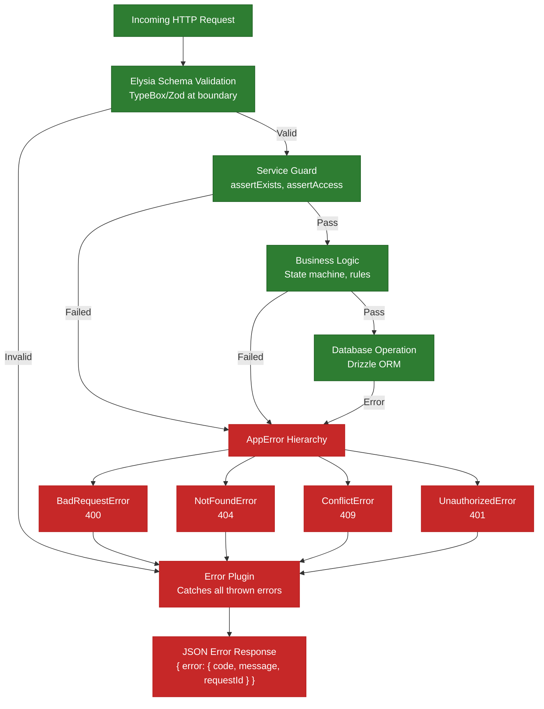

### 6.3 Security Design

| Concern | Implementation |
|---------|---------------|
| **Password Storage** | Argon2id via `Bun.password.hash()` — no plaintext storage |
| **Token Storage** | Refresh tokens stored as SHA-256 hash — never plaintext in DB |
| **Token Lifecycle** | Short-lived access token + long-lived refresh token with rotation. Reuse detection triggers full revocation. |
| **Device Limit** | Max 3 active refresh tokens per user. FIFO — oldest revoked when 4th created. |
| **RBAC** | Three roles: `learner`, `instructor` (inherits learner), `admin` (inherits all). Enforced on every endpoint via auth plugin. |
| **Row-Level Access** | Non-admin users can only access their own submissions, progress, and exam sessions. Enforced in service layer via `assertAccess`. |
| **Input Validation** | All inputs validated at API boundary via TypeBox schemas. Internal code assumes valid data. |
| **No Secrets in Code** | Environment variables via `.env` files (git-ignored). Validated at startup via `t3-oss/env-core`. |
| **Request Correlation** | `X-Request-Id` header on all responses for audit trail. |
| **Atomic Claim** | Review claim uses atomic conditional `UPDATE ... WHERE unclaimed OR expired` to prevent concurrent review of same submission (15 min expiry). |

---

## 8. Product & Technology Summary

### 8.1 Third-Party Services

| Service | Provider | Purpose | Integration |
|---------|----------|---------|-------------|
| LLM Grading | Provider-configurable LLM APIs | AI-powered Writing/Speaking assessment against VSTEP rubric | Current implementation uses OpenAI-compatible HTTP APIs and Cloudflare Workers AI |
| Speech-to-Text | Provider-configurable STT APIs | Audio transcription for Speaking submissions | Current implementation uses Cloudflare Workers AI via HTTPS REST |
| Object Storage | S3-compatible object storage | Audio file storage (Speaking recordings), user avatars | Bun `S3Client`; local development may use MinIO |
| Authentication | Self-hosted (JWT) | Access/refresh token pair with rotation, reuse detection | Jose library (HS256) |
| Password Hashing | Bun built-in | Argon2id password hashing | Bun.password API |

### 8.2 Development Technology Stack

| Layer | Technology | Version | Language | Purpose |
|-------|-----------|---------|----------|---------|
| **Frontend** | React | 19 | TypeScript | UI component library (SPA) |
| | Vite | 7 | — | Build tool, dev server, HMR |
| | TanStack Router | latest | TypeScript | File-based routing with type safety |
| | TanStack Query | latest | TypeScript | Server state management, caching |
| | Tailwind CSS | 4 | — | Utility-first CSS framework |
| | shadcn/ui | — | TypeScript | UI component primitives |
| | Recharts | latest | TypeScript | Charts (Spider Chart, Activity Heatmap) |
| **Backend** | Bun | latest | TypeScript | High-performance JS/TS runtime |
| | Elysia | 1.x | TypeScript | Type-safe REST API framework with OpenAPI |
| | Drizzle ORM | latest | TypeScript | Type-safe SQL query builder with migrations |
| | Jose | latest | TypeScript | JWT signing and verification |
| | TypeBox / Zod | latest | TypeScript | Schema validation at API boundaries |
| **Mobile** | React Native | latest | TypeScript | Cross-platform mobile (Android-first) |
| **AI/Grading** | Python | 3.11+ | Python | Grading microservice runtime |
| | FastAPI | latest | Python | Health check and admin API |
| | httpx + provider SDKs | latest | Python | HTTP client layer for AI provider APIs |
| | Redis (Streams) | — | — | Task queue consumer (XREADGROUP) |
| **Database** | PostgreSQL | 17 | SQL | Primary relational data store (JSONB) |
| | Redis | 7.2+ | — | Streams, cache |
| **Linting** | Biome | latest | — | Code formatting and lint enforcement |
| **Testing** | bun:test | — | TypeScript | Backend unit + integration tests |
| | pytest | — | Python | Grading service tests |

### 8.3 Source Code Management & DevOps

| Tool | Purpose | Details |
|------|---------|---------|
| GitHub | Source code hosting | Single monorepo (`VSTEP/`) containing all 3 apps |
| Git | Version control | Feature branches, PR-based review, conventional commits |
| GitHub Issues | Task tracking | Sprint backlog, bug tracking |
| GitHub Projects | Project management | Kanban board for sprint planning |
| Docker / Docker Compose | Containerization | Local dev: PostgreSQL, Redis, S3-compatible object storage. Production deployment remains environment-dependent |
| Biome CI | Code quality gate | `bun run check` on all PRs (lint + format) |

### 8.4 Deployment Environments

| Environment | Purpose | Infrastructure | URL |
|-------------|---------|---------------|-----|
| **Local Development** | Individual developer setup | Docker Compose (PostgreSQL, Redis, local S3-compatible object storage) + Bun dev server + Vite dev server | `localhost:3000` (API), `localhost:5173` (Web) |
| **Docker Compose (Full)** | Integration testing, demo | Containerized backend, grading, PostgreSQL, Redis, and local object storage; exact composition may evolve with the deployment setup | `localhost:4000` (API), `localhost:8000` (Grading) |
| **Production** | Live deployment (planned) | Cloud VM or container orchestration (to be determined post-capstone) with provider-configurable object storage and AI integrations | TBD |

*Note: Production deployment infrastructure will be finalized based on scaling requirements after the capstone pilot phase.*

---

## 9. References

| # | Document | Description |
|---|----------|-------------|
| 1 | Report 1 — Project Introduction | Project background, existing systems, business opportunity, vision |
| 2 | Report 2 — Project Management Plan | WBS, estimation, risk register, responsibility matrix |
| 3 | Report 3 — Software Requirement Specification | Functional and non-functional requirements, use cases, ERD, activity diagrams |
| 4 | `apps/backend/src/` | Backend source code — Bun + Elysia + Drizzle ORM |
| 5 | `apps/grading/app/` | Grading service source code — Python + FastAPI + Redis worker |
| 6 | `apps/backend/drizzle/` | Database migrations (Drizzle Kit) |
| 7 | `docs/specs/` | Technical specifications (5 consolidated files covering architecture, domain, API contracts, database, README) |

---

*Document version: 1.0 — Last updated: SP26SE145*
