# I. Lịch Sử Thay Đổi

*A — Thêm mới · M — Chỉnh sửa · D — Xóa

| Ngày | A/M/D | Người phụ trách | Mô tả thay đổi |
|------|-------|-----------|-------------------|
| 15/03/2026 | A | Nghĩa (Leader) | Tài liệu SRS ban đầu — yêu cầu chức năng & phi chức năng |
| 02/03/2026 | M | Nghĩa (Leader) | Thêm biểu đồ Use Case, Tác nhân, Luồng Màn Hình, Phân Quyền Màn Hình, ERD, Biểu đồ Hoạt Động |

---

# II. Đặc Tả Yêu Cầu Phần Mềm

## 1. Mô Tả Tổng Quan

### 1.1 Tổng Quan Sản Phẩm

Tài liệu Đặc Tả Yêu Cầu Phần Mềm (SRS) này mô tả tất cả các yêu cầu chức năng và phi chức năng cho **Hệ Thống Luyện Thi VSTEP Thích Ứng** — một nền tảng web và di động giúp người học Việt Nam chuẩn bị cho kỳ thi VSTEP (Vietnamese Standardized Test of English Proficiency) thông qua học tập thích ứng, chấm điểm bằng AI và theo dõi tiến độ cá nhân hóa.

Đối tượng đọc bao gồm:

- **Đội phát triển** — hướng dẫn triển khai
- **Giảng viên hướng dẫn Học thuật & Doanh nghiệp** — đánh giá dự án
- **Kiểm thử viên** — xây dựng test case
- **Các bên liên quan** — xác nhận và nghiệm thu tính năng

#### 1.1.1 Phạm vi

Hệ thống bao gồm:

- **Chế Độ Luyện Tập** cho bốn kỹ năng tiếng Anh (Nghe, Đọc, Viết, Nói) với hỗ trợ thích ứng
- **Chế Độ Thi Thử** mô phỏng kỳ thi VSTEP đầy đủ (VSTEP.3-5: B1–C1)
- **Chấm Điểm AI** cho Viết và Nói sử dụng tích hợp LLM/STT có thể cấu hình nhà cung cấp thông qua dịch vụ chấm điểm
- **Quy Trình Đánh Giá Thủ Công** để giảng viên xác minh các bài nộp đã được AI chấm điểm
- **Theo Dõi Tiến Độ** với trực quan hóa Biểu đồ Spider, phân tích Sliding Window, phân loại xu hướng và ước tính ETA
- **Đặt Mục Tiêu** với band mục tiêu, thời hạn và theo dõi thành tích
- **Quản Lý Lớp Học** để giảng viên giám sát và cung cấp phản hồi cho học viên
- **Công cụ Quản trị viên** cho quản lý người dùng và quản lý nội dung
- **Học Từ Vựng** để học từ theo chủ đề và theo dõi tiến độ
Hệ thống **không** bao gồm:

- Các bài thi năng lực tiếng Anh khác (IELTS, TOEFL, TOEIC)
- Tích hợp thanh toán trực tuyến (giai đoạn MVP)
- Ứng dụng gốc iOS (ưu tiên Android; iOS qua PWA)
- Giao diện đa ngôn ngữ (chỉ tiếng Việt trong MVP)

#### 1.1.2 Biểu Đồ Ngữ Cảnh Hệ Thống

Biểu đồ ngữ cảnh bên dưới minh họa các giao diện hệ thống hiện được triển khai cho Hệ Thống Luyện Thi VSTEP Thích Ứng. Ranh giới hệ thống bao gồm client Web, client Di động, Máy chủ API Chính, Dịch vụ Chấm Điểm, PostgreSQL, Redis và object storage dùng cho âm thanh được tải lên. Các thực thể bên ngoài bao gồm ba vai trò người dùng (Học viên, Giảng viên, Quản trị viên) và các API AI có thể cấu hình nhà cung cấp mà dịch vụ chấm điểm sử dụng.


Các quyết định kiến trúc chính:

- **Backend sở hữu tầng lưu trữ**: dịch vụ chấm điểm không ghi trực tiếp vào PostgreSQL; nó publish kết quả chấm điểm trở lại Redis và backend consumer sẽ cập nhật cơ sở dữ liệu.
- **Redis Streams**: tác vụ/kết quả chấm điểm dùng Redis Streams (`XADD`, `XREADGROUP`) thay vì Redis lists (`LPUSH`, `BRPOP`).
- **JWT Auth**: Cặp access/refresh token với rotation và phát hiện tái sử dụng.
- **Luồng tải lên tương thích S3**: âm thanh bài Nói được tải lên trước, sau đó được chấm bất đồng bộ bởi dịch vụ chấm điểm.

#### 1.1.3 Giao Diện Hệ Thống

| Giao diện | Giao thức | Mô tả |
|-----------|----------|-------------|
| Client ↔ Main App | REST (HTTPS) | Mọi tương tác người dùng dùng REST API JSON với xác thực JWT |
| Main App ↔ PostgreSQL | TCP (PostgreSQL wire protocol) | Drizzle ORM cho truy cập dữ liệu |
| Main App ↔ Redis | RESP / Redis Streams | Phân phối tác vụ chấm điểm, nhận kết quả chấm điểm và caching |
| Main App ↔ Object Storage | API tương thích S3 | Tải lên/lưu trữ file âm thanh cho bài nộp Nói |
| Grading Service ↔ Redis | RESP / Redis Streams | Tiêu thụ tác vụ chấm điểm và publish kết quả chấm điểm |
| Grading Service ↔ Nhà cung cấp AI | HTTPS | Gọi LLM/STT có thể cấu hình nhà cung cấp cho chấm điểm và phiên âm |

### 1.2 Đặc Điểm Người Dùng

| Vai trò | Đặc điểm | Trình độ kỹ thuật |
|-----------|----------------|----------------------|
| **Học viên** | Sinh viên đại học (năm cuối) hoặc người đi làm chuẩn bị cho chứng chỉ VSTEP. Độ tuổi 18–35. Thiết bị chính: điện thoại thông minh (Android 70%+). Có thể có băng thông internet hạn chế. | Cơ bản đến trung bình. Quen thuộc với ứng dụng di động và duyệt web. |
| **Giảng viên** | Giảng viên tiếng Anh tại các trường đại học hoặc trung tâm ngôn ngữ. Chịu trách nhiệm đánh giá các bài nộp Viết/Nói đã được AI chấm điểm, cung cấp phản hồi và tham gia quản lý câu hỏi/bài thi trong phạm vi giảng viên. | Trung bình. Thoải mái với ứng dụng web và phân tích dữ liệu cơ bản. |
| **Quản trị viên** | Quản trị hệ thống quản lý người dùng, ngân hàng câu hỏi, cấu hình nền tảng và phân tích/báo cáo trong phạm vi quản trị đã hoạch định. Một số năng lực vận hành có thể được triển khai ở các increment sau. | Nâng cao. Quen thuộc với hệ thống quản lý nội dung và quản trị dữ liệu. |

### 1.3 Ràng Buộc

| # | Ràng buộc | Mô tả |
|---|-----------|-------------|
| C-01 | Chỉ Định Dạng VSTEP | Hệ thống chỉ hỗ trợ định dạng VSTEP.3-5 (B1–C1), không hỗ trợ IELTS/TOEFL/TOEIC |
| C-02 | Giới Hạn Chấm Điểm AI | Chấm điểm AI cho Viết/Nói mang tính bổ trợ; điểm chính thức yêu cầu xác nhận của giảng viên |
| C-03 | Chỉ Giao Diện Tiếng Việt | MVP chỉ hỗ trợ giao diện tiếng Việt |
| C-04 | Ưu Tiên Android | Ứng dụng di động ưu tiên Android; người dùng iOS truy cập qua PWA |
| C-05 | Không Tích Hợp Thanh Toán | MVP sử dụng mô hình freemium; không có cổng thanh toán trực tuyến |
| C-06 | Phụ Thuộc Nhà Cung Cấp LLM | Chấm điểm AI phụ thuộc vào các nhà cung cấp LLM/STT bên ngoài có hỗ trợ cấu hình với giới hạn tốc độ |
| C-07 | Thời Hạn Capstone | Thời gian phát triển 4 tháng (14 tuần, 7 sprint) |
| C-08 | Quy Mô Nhóm | 4 lập trình viên (1 BE+AI, 1 Mobile, 2 FE) |

### 1.4 Giả Định và Phụ Thuộc

**Giả định:**

- A-01: Học viên có kết nối internet ổn định (tối thiểu 1 Mbps cho phát trực tuyến âm thanh và tải file lên)
- A-02: Học viên có thiết bị có micro cho luyện Nói
- A-03: Định dạng và rubric thi VSTEP giữ ổn định trong suốt thời gian dự án
- A-04: (Các) nhà cung cấp AI được cấu hình duy trì khả dụng dịch vụ và tương thích API
- A-05: PostgreSQL, Redis và object storage sẵn sàng trong môi trường triển khai

**Phụ thuộc:**

- D-01: API LLM tương thích nhà cung cấp cho chấm điểm Viết/Nói
- D-02: API STT tương thích nhà cung cấp cho phiên âm bài Nói
- D-03: PostgreSQL 17 cho lưu trữ dữ liệu
- D-04: Redis 7.2+ cho streams và caching
- D-05: Object storage tương thích S3 cho âm thanh tải lên
- D-06: Docker Compose cho điều phối môi trường phát triển cục bộ

## 2. Yêu Cầu Người Dùng

### 2.1 Tác Nhân

| # | Tác nhân | Mô tả |
|---|-------|-------------|
| 1 | **Học viên** | Người dùng đã đăng ký (role = `learner`) luyện tập kỹ năng tiếng Anh, làm bài thi thử, xem tiến độ, đặt mục tiêu và tham gia lớp học. Là đối tượng chính sử dụng hỗ trợ thích ứng và phản hồi chấm điểm AI. |
| 2 | **Giảng viên** | Người dùng (role = `instructor`) đánh giá các bài nộp Viết/Nói đã được AI chấm, quản lý lớp học, giám sát tiến độ học viên, cung cấp phản hồi và tham gia quản lý câu hỏi/bài thi. Một số năng lực quản lý có thể được dời khỏi increment hiện tại. Kế thừa tất cả quyền của Học viên. |
| 3 | **Quản trị viên** | Người dùng (role = `admin`) quản lý người dùng, câu hỏi, bài thi, điểm kiến thức, bài nộp, thông báo và phân tích/báo cáo trong phạm vi quản trị theo kế hoạch. Một số công cụ vận hành được định nghĩa trong SRS nhưng có thể được triển khai ở các increment sau thay vì bản hiện tại. |
| 4 | **Grading Service** | Tác nhân hệ thống tự động (Python + FastAPI) tiêu thụ tác vụ chấm điểm từ Redis Streams, thực hiện chấm điểm AI qua API LLM/STT bên ngoài và publish kết quả chấm điểm trở lại Redis để backend lưu trữ. |
| 5 | **Nhà cung cấp AI** | API bên ngoài tương thích nhà cung cấp dùng cho suy luận LLM và phiên âm STT. Triển khai không bị khóa cứng vào một nhà cung cấp duy nhất. |

### 2.2 Use Case

#### 2.2.1 Biểu Đồ Use Case

**Learner Use Cases**

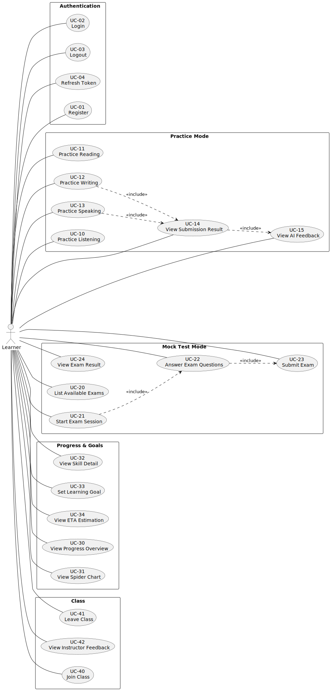

**Instructor Use Cases**

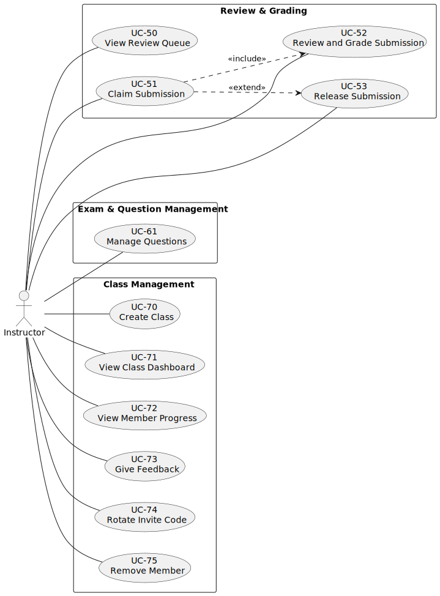

**Admin Use Cases**

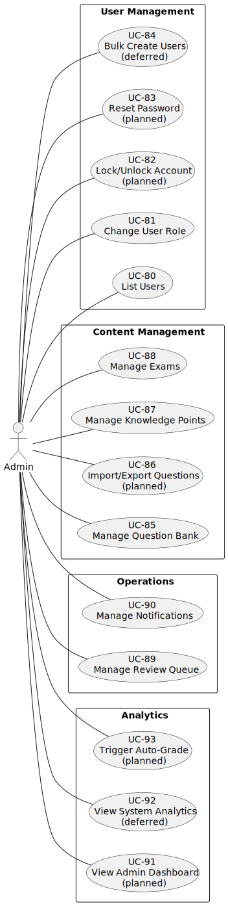

> Source: [`docs/capstone/diagrams/usecase/`](../../diagrams/usecase/) — render bằng `plantuml -tsvg`

#### 2.2.2 Mô Tả Use Case

| ID | Use Case | Tác nhân | Mô tả |
|----|----------|----------|-------------|
| UC-01 | Đăng Ký | Học viên | Tạo tài khoản với email, password, fullName. Vai trò mặc định là `learner`. |
| UC-02 | Đăng Nhập | Học viên, Giảng viên, Quản trị viên | Xác thực bằng email + password. Nhận cặp JWT access + refresh token. Tối đa 3 thiết bị (FIFO). |
| UC-03 | Đăng Xuất | Học viên, Giảng viên, Quản trị viên | Thu hồi refresh token hiện tại. |
| UC-04 | Làm Mới Token | Học viên, Giảng viên, Quản trị viên | Xoay vòng refresh token — thu hồi cũ, phát hành cặp mới. Phát hiện phát lại sẽ kích hoạt thu hồi toàn bộ. |
| UC-10 | Luyện Nghe | Học viên | Lấy câu hỏi luyện nghe với hỗ trợ thích ứng (Full Text → Highlights → Pure Audio). Chấm tự động ngay lập tức. |
| UC-11 | Luyện Đọc | Học viên | Lấy câu hỏi đọc (MCQ, T/F/NG, Matching, Gap Fill). Chấm tự động ngay lập tức. |
| UC-12 | Luyện Viết | Học viên | Nộp bài viết. Chấm điểm AI bất đồng bộ qua Redis Streams + LLM. Bao gồm UC-14. |
| UC-13 | Luyện Nói | Học viên | Nộp bản ghi âm. STT + chấm điểm AI bất đồng bộ qua Redis Streams. Bao gồm UC-14. |
| UC-14 | Xem Kết Quả Bài Nộp | Học viên | Xem điểm, band, chi tiết từng tiêu chí cho bài nộp đã hoàn thành. |
| UC-15 | Xem Phản Hồi AI | Học viên | Xem chi tiết phản hồi AI/giảng viên gắn với kết quả bài nộp. |
| UC-20 | Xem Danh Sách Bài Thi | Học viên | Duyệt các bài thi thử lọc theo cấp độ (B1/B2/C1). |
| UC-21 | Bắt Đầu Phiên Thi | Học viên | Bắt đầu phiên thi có giới hạn thời gian. Tạo `exam_session` với trạng thái `in_progress`. |
| UC-22 | Trả Lời Câu Hỏi Thi | Học viên | Trả lời câu hỏi trong kỳ thi. Tự động lưu định kỳ. |
| UC-23 | Nộp Bài Thi | Học viên | Hoàn tất bài thi. L/R chấm tự động inline; bài nộp W/S được tạo và phân phối để chấm bất đồng bộ. |
| UC-24 | Xem Kết Quả Thi | Học viên | Xem điểm từng kỹ năng, band và điểm tổng khi phiên thi được hoàn tất. |
| UC-30 | Xem Tổng Quan Tiến Độ | Học viên | Xem cả 4 kỹ năng: trình độ hiện tại, điểm trung bình, xu hướng, số lần thử. |
| UC-31 | Xem Biểu Đồ Spider | Học viên | Biểu đồ radar 4 trục hiển thị điểm hiện tại + mục tiêu mỗi kỹ năng. |
| UC-32 | Xem Chi Tiết Kỹ Năng | Học viên | Lịch sử điểm (10 lần gần nhất), phân loại xu hướng, mức hỗ trợ cho một kỹ năng. |
| UC-33 | Đặt Mục Tiêu Học Tập | Học viên | Đặt band mục tiêu (B1/B2/C1), thời hạn tùy chọn, thời gian học hàng ngày. |
| UC-34 | Xem Ước Tính ETA | Học viên | Ước tính số tuần để đạt mục tiêu mỗi kỹ năng qua hồi quy tuyến tính trên sliding window. |
| UC-40 | Tham Gia Lớp Học | Học viên | Tham gia lớp bằng mã mời do giảng viên cung cấp. |
| UC-41 | Rời Lớp Học | Học viên | Rời khỏi lớp đã tham gia. |
| UC-42 | Xem Phản Hồi Giảng Viên | Học viên | Xem nhận xét phản hồi từ giảng viên cho lớp cụ thể. |
| UC-50 | Xem Hàng Đợi Đánh Giá | Giảng viên | Danh sách bài nộp `review_pending` sắp xếp theo ưu tiên (high → medium → low), sau đó FIFO. |
| UC-51 | Nhận Bài Chấm | Giảng viên | Nhận một bài nộp để đánh giá với timeout 15 phút dựa trên `claimedAt`. |
| UC-52 | Đánh Giá & Chấm Bài | Giảng viên | Nộp điểm cuối cùng, band, điểm từng tiêu chí, phản hồi. Điểm giảng viên luôn là cuối cùng. |
| UC-53 | Trả Lại Bài Nộp | Giảng viên | Trả lại bài đã nhận vào hàng đợi nếu không thể hoàn thành. |
| UC-61 | Quản Lý Câu Hỏi | Giảng viên | Tạo và cập nhật câu hỏi trong ngân hàng câu hỏi. |
| UC-70 | Tạo Lớp Học | Giảng viên | Tạo lớp với mã mời được tạo tự động. |
| UC-71 | Xem Bảng Điều Khiển Lớp | Giảng viên | Xem thành viên lớp và dữ liệu tiến độ/phản hồi liên quan đến lớp. |
| UC-72 | Xem Tiến Độ Thành Viên | Giảng viên | Tiến độ học viên cá nhân trong ngữ cảnh lớp học. |
| UC-73 | Gửi Phản Hồi | Giảng viên | Đăng nhận xét phản hồi nhắm tới học viên cụ thể trong lớp. |
| UC-74 | Xoay Mã Mời | Giảng viên | Tạo mã mời mới cho lớp (vô hiệu mã cũ). |
| UC-75 | Xóa Thành Viên | Giảng viên | Xóa học viên khỏi lớp. |
| UC-80 | Danh Sách Người Dùng | Quản trị viên | Xem danh sách người dùng phân trang với bộ lọc. |
| UC-81 | Đổi Vai Trò | Quản trị viên | Thay đổi vai trò người dùng giữa learner/instructor/admin. |
| UC-82 | Khóa/Mở Khóa Tài Khoản | Quản trị viên | Năng lực nằm trong phạm vi quản trị theo kế hoạch; có thể được triển khai sau increment hiện tại. |
| UC-83 | Đặt Lại Mật Khẩu | Quản trị viên | Năng lực quản trị hỗ trợ đặt lại mật khẩu theo kế hoạch; luồng tự phục vụ có thể được ưu tiên trước trong MVP. |
| UC-84 | Tạo Hàng Loạt Người Dùng | Quản trị viên | Năng lực cấp phát tài khoản hàng loạt được hoãn cho giai đoạn sau. |
| UC-85 | Quản Lý Ngân Hàng Câu Hỏi | Quản trị viên | CRUD đầy đủ trên câu hỏi. Hỗ trợ nhập/xuất được định nghĩa riêng và có thể bàn giao sau. |
| UC-86 | Nhập/Xuất Câu Hỏi | Quản trị viên | Năng lực quản trị nội dung theo kế hoạch cho nhập/xuất hàng loạt có cấu trúc. Có thể được dời khỏi increment hiện tại nếu cần. |
| UC-87 | Quản Lý Điểm Kiến Thức | Quản trị viên | CRUD trên phân loại điểm kiến thức. |
| UC-88 | Quản Lý Bài Thi | Quản trị viên | Tạo, cập nhật và xóa bài thi. |
| UC-89 | Quản Lý Hàng Đợi Đánh Giá | Quản trị viên | Xem và thao tác trên quy trình đánh giá với quyền nâng cao. |
| UC-90 | Quản Lý Thông Báo | Quản trị viên | Xem thông báo/token thiết bị và dữ liệu vận hành liên quan do backend cung cấp. Phần quản trị push/email vẫn nằm trong kế hoạch. |
| UC-91 | Xem Bảng Điều Khiển Quản Trị | Quản trị viên | Bảng điều khiển quản trị theo kế hoạch để tóm tắt các chỉ số nền tảng và trạng thái vận hành. |
| UC-92 | Xem Phân Tích Hệ Thống | Quản trị viên | Năng lực phân tích/báo cáo về mức sử dụng, tỷ lệ hoàn thành và xu hướng điểm số được dời sang giai đoạn sau. |
| UC-93 | Kích Hoạt Chấm Tự Động | Quản trị viên | Công cụ vận hành theo kế hoạch để kích hoạt hoặc chạy lại luồng chấm điểm khi chính sách cho phép. |

---

## 3. Yêu Cầu Chức Năng

### 3.1 Tổng Quan Chức Năng Hệ Thống

#### 3.1.1 Luồng Màn Hình

**Luồng Đăng Ký (người dùng mới)**


**Luồng Đăng Nhập (người dùng hiện tại)**



#### 3.1.2 Mô Tả Màn Hình

| # | Tính năng | Màn hình | Mô tả |
|---|---------|--------|-------------|
| 1 | Xác Thực | Đăng Nhập | Form email + mật khẩu. Liên kết tới Đăng Ký. Trả về cặp JWT token khi thành công. |
| 2 | Xác Thực | Đăng Ký | Form email, mật khẩu (tối thiểu 8 ký tự), họ tên. Tự động đăng nhập và chuyển hướng tới Onboarding khi thành công. |
| 2a | Onboarding | Chào Mừng | Màn hình chào mừng cho người dùng mới. Hai lựa chọn: "Tự xác định trình độ" (chọn level) hoặc "Làm bài kiểm tra" (quiz đánh giá năng lực). |
| 2b | Onboarding | Tự Đánh Giá | Chọn trình độ hiện tại từ 4 mức (A2/B1/B2/C1) với mô tả chi tiết từng mức. Chuyển sang Thiết Lập Mục Tiêu. |
| 2c | Onboarding | Bài Kiểm Tra Đầu Vào | 10 câu trắc nghiệm ngữ pháp (A2→C1), khoảng 3 phút. Thanh tiến độ, phản hồi đúng/sai từng câu. Tự động xác định trình độ khi hoàn thành. |
| 2d | Onboarding | Kết Quả Đánh Giá | Hiển thị trình độ ước tính (A2–C1) dựa trên kết quả quiz. Nút "Làm lại" hoặc "Tiếp tục thiết lập mục tiêu". |
| 2e | Onboarding | Thiết Lập Mục Tiêu | Chọn band mục tiêu (B1/B2/C1), thời hạn (1–12 tháng/không giới hạn), thời gian học mỗi ngày (15p–2h/tuỳ). POST `/api/onboarding/self-assess` → chuyển hướng tới Tiến Độ. |
| 3 | Trang Chủ | Bảng Điều Khiển | Trang đích hiển thị liên kết nhanh tới Luyện Tập, Thi Thử, Tiến Độ. Các widget tóm tắt. |
| 4 | Luyện Tập | Chọn Kỹ Năng | Lưới 4 kỹ năng (Nghe, Đọc, Viết, Nói) với huy hiệu trình độ hiện tại. |
| 5 | Luyện Tập | Xem Câu Hỏi | Hiển thị nội dung câu hỏi với hỗ trợ đã áp dụng. Trình phát âm thanh cho Nghe/Nói. Trình soạn thảo văn bản cho Viết. |
| 6 | Luyện Tập | Nộp Bài | Xác nhận trước khi nộp. Kiểm tra số từ cho Viết (tối thiểu 120/250 từ). |
| 7 | Luyện Tập | Kết Quả / Phản Hồi | Điểm (0–10), band, chi tiết từng tiêu chí. Phản hồi AI. Lỗi ngữ pháp (Viết). |
| 8 | Thi Thử | Danh Sách Bài Thi | Danh sách thẻ các bài thi có sẵn. Lọc theo cấp độ (B1/B2/C1). Hiển thị số câu hỏi mỗi phần. |
| 9 | Thi Thử | Chi Tiết Bài Thi | Xem trước blueprint: 4 phần với số câu hỏi và giới hạn thời gian. Nút bắt đầu. |
| 10 | Thi Thử | Phiên Thi | Bài thi có giới hạn thời gian với tab phần. Tự động lưu mỗi 30 giây. Bộ đếm thời gian với cảnh báo 5 phút/1 phút. |
| 11 | Thi Thử | Kết Quả Thi | Chi tiết điểm từng kỹ năng. Điểm tổng và band. Chỉ báo chờ cho chấm điểm W/S. |
| 12 | Tiến Độ | Tổng Quan | Biểu đồ Spider (radar 4 trục). Chỉ báo xu hướng từng kỹ năng. Ước tính band tổng thể. |
| 13 | Tiến Độ | Chi Tiết Kỹ Năng | Biểu đồ 10 điểm gần nhất. Phân loại xu hướng. Chỉ báo mức hỗ trợ. ETA tới mục tiêu. |
| 14 | Tiến Độ | Đặt Mục Tiêu | Bộ chọn band mục tiêu (B1/B2/C1). Chọn ngày thời hạn. Nhập thời gian học hàng ngày. |
| 15 | Lớp Học | Lớp Của Tôi | Danh sách lớp đã tham gia + sở hữu. Nút tham gia với ô nhập mã mời. |
| 16 | Lớp Học | Bảng Điều Khiển Lớp | Góc nhìn giảng viên: số thành viên, trung bình từng kỹ năng, học viên có nguy cơ (trung bình < 5.0). |
| 17 | Lớp Học | Tiến Độ Thành Viên | Chi tiết học viên cá nhân: điểm từng kỹ năng, xu hướng, trạng thái mục tiêu, bài nộp gần đây. |
| 18 | Đánh Giá | Hàng Đợi Đánh Giá | Bảng các bài nộp `review_pending`. Huy hiệu ưu tiên (high/medium/low). Nút nhận chấm. |
| 19 | Đánh Giá | Chi Tiết Đánh Giá | Hiển thị song song: câu trả lời học viên (trái) + kết quả chấm AI (phải). Form nhập điểm. |
| 20 | Nội Dung | Ngân Hàng Câu Hỏi | Bảng phân trang với bộ lọc (kỹ năng, cấp độ, định dạng, hoạt động). Hành động Tạo/Sửa/Xóa. |
| 21 | Nội Dung | Tạo/Sửa Câu Hỏi | Form với kỹ năng, cấp độ, trình soạn thảo nội dung JSONB, đáp án, trường rubric. |
| 22 | Từ Vựng | Danh Sách Chủ Đề | Lưới chủ đề từ vựng với số từ mỗi chủ đề và chỉ báo tiến độ học tập. |
| 23 | Từ Vựng | Học Từ | Giao diện học từ kiểu flashcard. Hiển thị từ, phiên âm, định nghĩa, ví dụ. Đánh dấu đã biết/chưa biết. |
| 24 | Bài Nộp | Lịch Sử | Danh sách phân trang các bài nộp trước đó với bộ lọc kỹ năng, điểm, band và huy hiệu trạng thái. |
| 25 | Bài Nộp | Chi Tiết | Chi tiết đầy đủ bài nộp: câu hỏi, câu trả lời học viên, chi tiết điểm, phản hồi AI/giảng viên. |
| 26 | Tiến Độ | Lịch Sử | Biểu đồ nhiệt hoạt động hiển thị tần suất luyện tập hàng ngày. Biểu đồ tròn phân bố kỹ năng. |

#### 3.1.3 Phân Quyền Màn Hình

| Màn hình | Học viên | Giảng viên | Quản trị viên |
|--------|---------|------------|-------|
| Đăng Nhập / Đăng Ký | X | X | X |
| Onboarding — Chào Mừng / Tự Đánh Giá / Quiz | X (lần đầu) | | |
| Onboarding — Thiết Lập Mục Tiêu | X (lần đầu) | | |
| Bảng Điều Khiển (Trang Chủ) | X | X | X |
| Luyện Tập — Chọn Kỹ Năng | X | X | X |
| Luyện Tập — Xem Câu Hỏi | X | X | X |
| Luyện Tập — Kết Quả / Phản Hồi | X (của mình) | X (của mình) | X (tất cả) |
| Thi Thử — Danh Sách | X | X | X |
| Thi Thử — Bắt Đầu Phiên | X | X | X |
| Thi Thử — Phiên Thi (có giờ) | X | X | X |
| Thi Thử — Kết Quả | X (của mình) | X (của mình) | X (tất cả) |
| Tiến Độ — Tổng Quan | X (của mình) | X (của mình) | X (tất cả) |
| Tiến Độ — Chi Tiết Kỹ Năng | X (của mình) | X (của mình) | X (tất cả) |
| Tiến Độ — Đặt Mục Tiêu | X | X | X |
| Lớp Học — Lớp Của Tôi | X | X | X |
| Lớp Học — Tham Gia (mã mời) | X | X | X |
| Lớp Học — Bảng Điều Khiển | | X (chủ lớp) | X |
| Lớp Học — Tiến Độ Thành Viên | | X (chủ lớp) | X |
| Lớp Học — Gửi Phản Hồi | | X (chủ lớp) | X |
| Đánh Giá — Hàng Đợi | | X | X |
| Đánh Giá — Chi Tiết + Chấm | | X | X |
| Nội Dung — Ngân Hàng Câu Hỏi | | X | X |
| Nội Dung — Tạo/Sửa Câu Hỏi | | X | X |
| Nội Dung — Xóa Câu Hỏi | | | X |
| Nội Dung — Tạo Bài Thi | | X | X |
| Nội Dung — Cập Nhật Bài Thi | | | X |
| Quản Trị — Danh Sách Người Dùng | | | X |
| Quản Trị — Đổi Vai Trò | | | X |
| Từ Vựng — Chủ Đề | X | X | X |
| Từ Vựng — Học Từ | X | X | X |
| Bài Nộp — Lịch Sử | X (của mình) | X (của mình) | X (tất cả) |
| Bài Nộp — Chi Tiết | X (của mình) | X (của mình) | X (tất cả) |
| Tiến Độ — Lịch Sử | X (của mình) | X (của mình) | X (tất cả) |

#### 3.1.4 Chức Năng Phi Màn Hình

| # | Tính năng | Chức năng hệ thống | Mô tả |
|---|---------|----------------|-------------|
| 1 | Chấm Điểm AI | Dịch vụ Chấm Điểm (Redis Streams) | Worker bất đồng bộ đọc tác vụ từ Redis Stream `grading:tasks` qua `XREADGROUP`. Định tuyến tới pipeline chấm Viết hoặc Nói. Publish kết quả lên stream `grading:results` để backend consumer lưu trữ. |
| 2 | Chấm Điểm AI | Định Tuyến Theo Độ Tin Cậy | Sau khi AI chấm: high → `completed`, medium → `review_pending` (ưu tiên medium), low → `review_pending` (ưu tiên high). |
| 3 | Chấm Điểm AI | Xử Lý Thất Bại | Tác vụ thất bại sau số lần thử tối đa → publish failure marker lên stream `grading:results` → backend đặt trạng thái bài nộp thành `failed`. |
| 4 | Xác Thực | Xoay Vòng Token | Khi làm mới: thu hồi token cũ, phát hành cặp mới. Nếu phát hiện token đã xoay được tái sử dụng → thu hồi TẤT CẢ token của người dùng. |
| 5 | Xác Thực | Cắt Bớt Thiết Bị | Khi đăng nhập: nếu refresh token hoạt động ≥ 3, thu hồi cái cũ nhất (FIFO). |
| 6 | Tiến Độ | Đồng Bộ Sliding Window | Sau mỗi điểm được ghi: lấy 10 điểm gần nhất mỗi kỹ năng → tính trung bình, xu hướng, điều chỉnh mức hỗ trợ → upsert `user_progress`. |
| 7 | Thi Thử | Tự Động Lưu | Client gửi snapshot câu trả lời định kỳ mỗi 30 giây → upsert `exam_answers`. Từ chối nếu phiên đã nộp. |
| 8 | Thi Thử | Xử Lý Nộp Bài | Khi nộp bài thi: chấm tự động L/R inline → tạo bài nộp W/S → phân phối tới Redis Streams → cập nhật điểm phiên. |
| 9 | Sức Khỏe | Kiểm Tra Sức Khỏe | `GET /health` kiểm tra kết nối PostgreSQL và Redis. Trả về trạng thái dịch vụ. |
| 10 | API | Tạo OpenAPI | Tự động tạo đặc tả OpenAPI tại `GET /openapi.json` qua plugin Elysia. |

#### 3.1.5 Biểu Đồ Quan Hệ Thực Thể


**Mô Tả Thực Thể:**

| # | Thực thể | Mô tả |
|---|--------|-------------|
| 1 | `users` | Người dùng đã đăng ký với phân quyền theo vai trò (learner, instructor, admin). Mã hóa mật khẩu Argon2id. |
| 2 | `refresh_tokens` | JWT refresh token được lưu dưới dạng hash SHA-256. Hỗ trợ rotation, phát hiện phát lại và theo dõi thiết bị. Tối đa 3 mỗi người dùng. |
| 3 | `questions` | Ngân hàng câu hỏi với nội dung JSONB hỗ trợ 8 loại định dạng trên 4 kỹ năng. Đáp án cho câu hỏi khách quan (L/R). |
| 4 | `submissions` | Câu trả lời của học viên cho một câu hỏi. Theo dõi vòng đời qua máy trạng thái (pending → processing → completed/review_pending/failed). |
| 5 | `submission_details` | Quan hệ 1:1 với submissions. Lưu trữ answer JSONB, result JSONB (auto/AI/human) và phản hồi. |
| 6 | `exams` | Định nghĩa bài thi thử với cấp độ và blueprint (chọn câu hỏi theo kỹ năng). |
| 7 | `exam_sessions` | Theo dõi phiên thi có giới hạn thời gian. Lưu điểm từng kỹ năng và điểm tổng. |
| 8 | `exam_answers` | Câu trả lời riêng lẻ trong phiên thi. `is_correct` được thiết lập khi xử lý nộp bài. |
| 9 | `exam_submissions` | Bảng liên kết phiên thi với bài nộp (cho câu hỏi chủ quan W/S). |
| 10 | `knowledge_points` | Phân loại điểm kiến thức (grammar, vocabulary, strategy, topic) cho học tập thích ứng. |
| 11 | `question_knowledge_points` | Bảng liên kết nhiều-nhiều giữa câu hỏi và điểm kiến thức. |
| 12 | `user_progress` | Một dòng mỗi người dùng mỗi kỹ năng. Tổng hợp sliding window: điểm trung bình, xu hướng, mức hỗ trợ. |
| 13 | `user_skill_scores` | Bản ghi điểm riêng lẻ cung cấp cho sliding window (10 gần nhất mỗi kỹ năng). |
| 14 | `user_goals` | Mục tiêu học tập với band mục tiêu, thời hạn, thời gian học hàng ngày. |
| 15 | `user_knowledge_progress` | Theo dõi mức thành thạo mỗi điểm kiến thức mỗi người dùng. |
| 16 | `classes` | Lớp học do giảng viên sở hữu với mã mời tự động tạo. |
| 17 | `class_members` | Bản ghi đăng ký lớp với timestamp tham gia/xóa. |
| 18 | `instructor_feedback` | Nhận xét phản hồi từ giảng viên tới học viên trong ngữ cảnh lớp học. |
| 19 | `vocabulary_topics` | Chủ đề học từ vựng với tên, mô tả và thứ tự sắp xếp. |
| 20 | `vocabulary_words` | Từ vựng riêng lẻ trong chủ đề. Bao gồm phiên âm, âm thanh, từ loại, định nghĩa, ví dụ. |
| 21 | `user_vocabulary_progress` | Theo dõi tiến độ học từ mỗi người dùng mỗi từ. PK tổ hợp (user_id, word_id). |
| 22 | `notifications` | Thông báo người dùng cho hoàn thành chấm điểm, phản hồi, mục tiêu, tin hệ thống. |
| 23 | `device_tokens` | Token thiết bị thông báo đẩy cho nền tảng di động/web. |
| 24 | `user_placements` | Kết quả bài kiểm tra xếp lớp ban đầu ghi nhận trình độ kỹ năng và nguồn. |

### 3.2 FE-01: Xác Thực Người Dùng

#### 3.2.1 Đăng Ký

- **Mô tả**: Người dùng mới tạo tài khoản bằng cách cung cấp email, mật khẩu và tên hiển thị.
- **Đầu vào**: `email` (duy nhất), `password` (tối thiểu 8 ký tự), `fullName`
- **Xử lý**: Xác thực đầu vào → kiểm tra tính duy nhất email → mã hóa mật khẩu (Argon2id qua `Bun.password`) → tạo bản ghi người dùng với vai trò `learner`
- **Đầu ra**: Hồ sơ người dùng (id, email, fullName, role). Không trả token — người dùng phải đăng nhập riêng.
- **Trường hợp lỗi**:
  - Email đã tồn tại → 409 CONFLICT
  - Định dạng email không hợp lệ → 400 VALIDATION_ERROR
  - Mật khẩu quá ngắn → 400 VALIDATION_ERROR

#### 3.2.2 Đăng Nhập

- **Mô tả**: Người dùng xác thực bằng email và mật khẩu, nhận cặp JWT token.
- **Đầu vào**: `email`, `password`
- **Xử lý**: Xác thực thông tin đăng nhập → kiểm tra tối đa 3 refresh token hoạt động mỗi người dùng (FIFO — thu hồi cũ nhất nếu >= 3) → phát hành access token (ngắn hạn) + refresh token (dài hạn) → lưu hash refresh token trong DB
- **Đầu ra**: `{ accessToken, refreshToken, user: { id, email, fullName, role } }`
- **Trường hợp lỗi**:
  - Thông tin đăng nhập không hợp lệ → 401 UNAUTHORIZED
  - Tài khoản không tìm thấy → 401 UNAUTHORIZED

#### 3.2.3 Làm Mới Token

- **Mô tả**: Xoay vòng refresh token — thu hồi cũ, phát hành cặp mới.
- **Đầu vào**: `refreshToken` (trong body yêu cầu)
- **Xử lý**: Xác thực hash token đối chiếu DB → kiểm tra chưa thu hồi → kiểm tra chưa hết hạn → xoay vòng (thu hồi cũ, tạo mới) → phát hành access + refresh token mới
- **Đầu ra**: `{ accessToken, refreshToken }` mới
- **Trường hợp lỗi**:
  - Token hết hạn → 401 TOKEN_EXPIRED
  - Token đã bị thu hồi (phát hiện tái sử dụng) → thu hồi TẤT CẢ token của người dùng → 401 UNAUTHORIZED (buộc đăng nhập lại)

#### 3.2.4 Đăng Xuất

- **Mô tả**: Thu hồi refresh token hiện tại.
- **Đầu vào**: `refreshToken`
- **Xử lý**: Tìm token theo hash → thiết lập timestamp `revokedAt`
- **Đầu ra**: `{ success: true }`

#### 3.2.5 Lấy Thông Tin Người Dùng Hiện Tại

- **Mô tả**: Trả về hồ sơ người dùng từ claims của access token.
- **Đầu vào**: Bearer access token (header Authorization)
- **Đầu ra**: `{ id, email, fullName, role }`
- **Trường hợp lỗi**:
  - Thiếu/token không hợp lệ → 401 UNAUTHORIZED
  - Token hết hạn → 401 TOKEN_EXPIRED

#### 3.2.6 Biểu Đồ Vòng Đời Xác Thực & Token


### 3.3 FE-02: Bài Kiểm Tra Xếp Lớp

#### 3.3.1 Bắt Đầu Bài Kiểm Tra Xếp Lớp

- **Mô tả**: Khởi tạo bài đánh giá xếp lớp bao gồm kỹ năng Nghe và Đọc để xác định trình độ năng lực ban đầu. Triển khai hiện tại chỉ kiểm tra hai kỹ năng khách quan; trình độ Viết và Nói được đặt qua tự đánh giá hoặc bỏ qua.
- **Đầu vào**: Yêu cầu học viên đã xác thực
- **Xử lý**: Tạo bài thi xếp lớp động cho listening + reading → tạo phiên xếp lớp
- **Đầu ra**: ID phiên, bộ câu hỏi được tổ chức theo kỹ năng

#### 3.3.2 Nộp Bài Kiểm Tra Xếp Lớp

- **Mô tả**: Nộp câu trả lời bài kiểm tra xếp lớp và nhận đánh giá năng lực ban đầu.
- **Đầu vào**: ID phiên, câu trả lời cho listening và reading
- **Xử lý**: Chấm tự động Nghe/Đọc qua đáp án → tính band ban đầu mỗi kỹ năng → khởi tạo bản ghi `user_progress` → khởi tạo Biểu đồ Spider
- **Đầu ra**: Band mỗi kỹ năng, mức hỗ trợ ban đầu được đề xuất, lộ trình học tập gợi ý

#### 3.3.3 Biểu Đồ Luồng Bài Kiểm Tra Xếp Lớp

```

### 3.4 FE-03: Chế Độ Luyện Tập — Nghe

#### 3.4.1 Lấy Câu Hỏi Luyện Nghe

- **Mô tả**: Lấy câu hỏi luyện nghe với hỗ trợ thích ứng đã áp dụng.
- **Đầu vào**: Yêu cầu học viên đã xác thực, bộ lọc tùy chọn (cấp độ, định dạng)
- **Xử lý**: Chọn câu hỏi phù hợp với trình độ hiện tại và giai đoạn hỗ trợ của học viên → áp dụng hỗ trợ:
  - Giai đoạn 1 (Full Text): Hiển thị toàn bộ bản phiên âm cùng với âm thanh
  - Giai đoạn 2 (Highlights): Chỉ đánh dấu cụm từ khóa, bản phiên âm một phần
  - Giai đoạn 3 (Pure Audio): Chỉ âm thanh, không có bản phiên âm
- **Đầu ra**: Nội dung câu hỏi với hỗ trợ phù hợp đã áp dụng, URL âm thanh

#### 3.4.2 Nộp Câu Trả Lời Luyện Nghe

- **Mô tả**: Nộp câu trả lời cho câu hỏi luyện nghe và nhận điểm ngay lập tức.
- **Đầu vào**: `questionId`, `answer` (bản đồ questionId → câu trả lời đã chọn)
- **Xử lý**: So sánh câu trả lời với đáp án → tính điểm (`correct/total × 10`, làm tròn tới 0.5) → xác định band → cập nhật `user_progress` (số lần thử, đánh giá mức hỗ trợ) → kiểm tra quy tắc tiến trình hỗ trợ
- **Đầu ra**: Điểm (0–10), band, đúng/sai mỗi item, mức hỗ trợ đã cập nhật
- **Quy Tắc Tiến Trình Hỗ Trợ** (sử dụng `accuracyPct` = score × 10):
  - Lên cấp (giảm hỗ trợ): trung bình 3 lần gần nhất ≥ 80
  - Giữ nguyên: trung bình trong [50, 80)
  - Xuống cấp (tăng hỗ trợ): trung bình < 50 trong 2 lần liên tiếp

### 3.5 FE-04: Chế Độ Luyện Tập — Đọc

#### 3.5.1 Lấy Câu Hỏi Luyện Đọc

- **Mô tả**: Lấy câu hỏi luyện đọc theo định dạng VSTEP.
- **Đầu vào**: Yêu cầu học viên đã xác thực, bộ lọc tùy chọn (cấp độ, loại định dạng)
- **Xử lý**: Chọn câu hỏi phù hợp trình độ hiện tại của học viên → trả về đoạn văn với các item
- **Đầu ra**: Văn bản đoạn văn, item câu hỏi (MCQ, True/False/Not Given, Matching Headings, Fill-in-the-Blanks)
- **Định dạng hỗ trợ**: `reading_mcq`, `reading_tng`, `reading_matching_headings`, `reading_gap_fill`

#### 3.5.2 Nộp Câu Trả Lời Luyện Đọc

- **Mô tả**: Nộp câu trả lời và nhận kết quả chấm tự động ngay lập tức.
- **Đầu vào**: `questionId`, `answer` (bản đồ questionId → câu trả lời đã chọn)
- **Xử lý**: So sánh với đáp án → tính điểm → xác định band → cập nhật tiến độ
- **Đầu ra**: Điểm (0–10), band, đúng/sai mỗi item

#### 3.5.3 Biểu Đồ Luồng Luyện Tập Của Học Viên

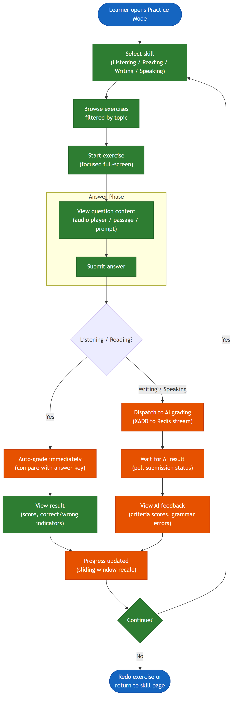

### 3.6 FE-05: Chế Độ Luyện Tập — Viết + Chấm Điểm AI

#### 3.6.1 Lấy Câu Hỏi Luyện Viết

- **Mô tả**: Lấy câu hỏi luyện viết với hỗ trợ thích ứng.
- **Đầu vào**: Yêu cầu học viên đã xác thực, bộ lọc tùy chọn (cấp độ, loại bài)
- **Xử lý**: Chọn câu hỏi → áp dụng hỗ trợ:
  - Giai đoạn 1 (Template): Template đầy đủ với câu mở đầu, liên từ, danh sách kiểm tra
  - Giai đoạn 2 (Keywords): Cụm từ khóa, từ nối, từ vựng chủ đề
  - Giai đoạn 3 (Free): Không hỗ trợ; gợi ý nhỏ có sẵn theo yêu cầu
- **Đầu ra**: Nội dung câu hỏi (đề bài, hướng dẫn, minWords), tài liệu hỗ trợ
- **Định dạng hỗ trợ**: `writing_task_1` (Thư/Email, ≥120 từ), `writing_task_2` (Bài luận, ≥250 từ)

#### 3.6.2 Nộp Câu Trả Lời Luyện Viết

- **Mô tả**: Nộp bài viết để chấm điểm AI (bất đồng bộ).
- **Đầu vào**: `questionId`, `skill: "writing"`, `answer: { text, wordCount }`
- **Xử lý**:
  1. Xác thực đầu vào (văn bản không trống, kỹ năng khớp câu hỏi)
  2. Tạo bản ghi bài nộp (status = `pending`)
  3. Tạo bản ghi submission_details (answer JSONB)
  4. `XADD` tác vụ chấm điểm vào Redis Stream `grading:tasks`
  5. Trả về ID bài nộp để client theo dõi trạng thái qua polling
- **Đầu ra**: `{ submissionId, status: "pending" }`
- **Pipeline Chấm Điểm AI** (bất đồng bộ trong worker):
  - LLM đánh giá theo 4 tiêu chí VSTEP: Task Achievement, Coherence & Cohesion, Lexical Resource, Grammatical Range & Accuracy (mỗi tiêu chí 0–10)
  - Kết quả được hợp nhất thành `AIGradeResult` với điểm tổng, band, điểm tiêu chí, phản hồi, lỗi ngữ pháp, mức độ tin cậy
- **Định Tuyến Theo Độ Tin Cậy**:
  - Độ tin cậy cao → status = `completed` (tự động chấp nhận)
  - Độ tin cậy trung bình → status = `review_pending`, priority = `medium`
  - Độ tin cậy thấp → status = `review_pending`, priority = `high`
- **Quy Tắc Tiến Trình Hỗ Trợ** (sử dụng `scorePct` = score × 10):
  - Giai đoạn 1 → Giai đoạn 2: trung bình 3 lần gần nhất ≥ 80
  - Giai đoạn 2 → Giai đoạn 3: trung bình 3 lần gần nhất ≥ 75
  - Giai đoạn 2 → Giai đoạn 1: trung bình < 60 trong 2 lần liên tiếp
  - Giai đoạn 3 → Giai đoạn 2: trung bình < 65 trong 2 lần liên tiếp
  - Sử dụng gợi ý > 50% trong cửa sổ 3 lần → chặn lên cấp

#### 3.6.3 Lấy Trạng Thái Bài Nộp (Phương Án Polling Dự Phòng)

- **Mô tả**: Endpoint polling cho các client theo dõi trạng thái bài nộp.
- **Đầu vào**: ID bài nộp
- **Đầu ra**: `{ status, progress (nếu đang xử lý), result (nếu hoàn thành) }`

#### 3.6.4 Biểu Đồ Pipeline Chấm Điểm AI Viết/Nói

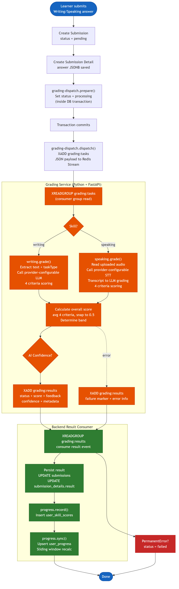

### 3.7 FE-06: Chế Độ Luyện Tập — Nói + Chấm Điểm AI

#### 3.7.1 Lấy Câu Hỏi Luyện Nói

- **Mô tả**: Lấy câu hỏi luyện nói.
- **Đầu vào**: Yêu cầu học viên đã xác thực, bộ lọc tùy chọn (cấp độ, số phần)
- **Đầu ra**: Nội dung câu hỏi (đề bài, preparationSeconds), số phần (1/2/3)
- **Định dạng hỗ trợ**: `speaking_part_1` (Tương Tác Xã Hội), `speaking_part_2` (Thảo Luận Giải Pháp), `speaking_part_3` (Phát Triển Chủ Đề)

#### 3.7.2 Nộp Câu Trả Lời Luyện Nói

- **Mô tả**: Nộp bản ghi âm để chấm điểm AI (bất đồng bộ).
- **Đầu vào**: `questionId`, `skill: "speaking"`, `answer: { audioUrl, durationSeconds }`
- **Xử lý**: Luồng tương tự như Viết (xác thực → tạo bài nộp → đẩy vào Redis Stream → trả về trạng thái ban đầu). Xem [Phần 3.6.4 — Biểu Đồ Pipeline Chấm Điểm AI](#364-biểu-đồ-pipeline-chấm-điểm-ai-viếtnói).
- **Pipeline Chấm Điểm AI** (bất đồng bộ trong worker):
  - Dịch vụ STT phiên âm âm thanh thành văn bản
  - LLM chấm bản phiên âm theo 4 tiêu chí VSTEP: Fluency & Coherence, Pronunciation, Content & Relevance, Vocabulary & Grammar (mỗi tiêu chí 0–10)
  - Định tuyến theo độ tin cậy tương tự như Viết
- **Đầu ra**: `{ submissionId, status: "pending" }`

### 3.8 FE-07: Chế Độ Thi Thử

#### 3.8.1 Danh Sách Bài Thi Có Sẵn

- **Mô tả**: Liệt kê các bài thi thử có sẵn cho học viên.
- **Đầu vào**: Bộ lọc tùy chọn theo cấp độ (B1/B2/C1)
- **Đầu ra**: Danh sách bài thi với cấp độ, số phần, giới hạn thời gian

#### 3.8.2 Chi Tiết Bài Thi

- **Mô tả**: Xem blueprint bài thi — 4 phần, số câu hỏi, giới hạn thời gian.
- **Đầu vào**: ID bài thi
- **Đầu ra**: Chi tiết bài thi với các phần (listening, reading, writing, speaking), số câu hỏi mỗi phần, giới hạn thời gian

#### 3.8.3 Bắt Đầu Phiên Thi

- **Mô tả**: Bắt đầu phiên thi thử có giới hạn thời gian.
- **Đầu vào**: ID bài thi
- **Xử lý**: Tạo bản ghi `exam_session` (status = `in_progress`), ghi nhận `started_at`
- **Đầu ra**: ID phiên, câu hỏi tổ chức theo phần, giới hạn thời gian mỗi phần

#### 3.8.4 Tự Động Lưu Câu Trả Lời

- **Mô tả**: Định kỳ lưu câu trả lời thi (client gửi mỗi 30 giây).
- **Đầu vào**: ID phiên, JSON câu trả lời (snapshot đầy đủ)
- **Xử lý**: Cập nhật bản ghi `exam_answers`. Từ chối nếu phiên đã được nộp.
- **Đầu ra**: `{ saved: true }`

#### 3.8.5 Nộp Phiên Thi

- **Mô tả**: Nộp bài thi đã hoàn thành để chấm điểm.
- **Đầu vào**: ID phiên
- **Xử lý**:
  1. Chấm tự động câu trả lời Nghe: so sánh với đáp án → `listening_score = (correct/total) × 10` (làm tròn tới 0.5)
  2. Chấm tự động câu trả lời Đọc: `reading_score = (correct/total) × 10` (làm tròn tới 0.5)
  3. Tạo bài nộp Viết (status = `pending`) → liên kết qua `exam_submissions` → đẩy vào Redis
  4. Tạo bài nộp Nói (status = `pending`) → liên kết qua `exam_submissions` → đẩy vào Redis
  5. Cập nhật trạng thái phiên thành `submitted`
  6. Khi tất cả 4 kỹ năng có điểm → `overall_score = average(4 skills)` → status = `completed`
- **Đầu ra**: Trạng thái phiên, điểm L/R ngay lập tức, bài nộp W/S đang chờ

#### 3.8.6 Lấy Kết Quả Phiên Thi

- **Mô tả**: Xem trạng thái và kết quả phiên thi.
- **Đầu vào**: ID phiên (chỉ chủ sở hữu)
- **Đầu ra**: Trạng thái (`in_progress`/`submitted`/`completed`/`abandoned`), điểm và band mỗi kỹ năng, điểm tổng (khi hoàn thành)

#### 3.8.7 Biểu Đồ Luồng Phiên Thi

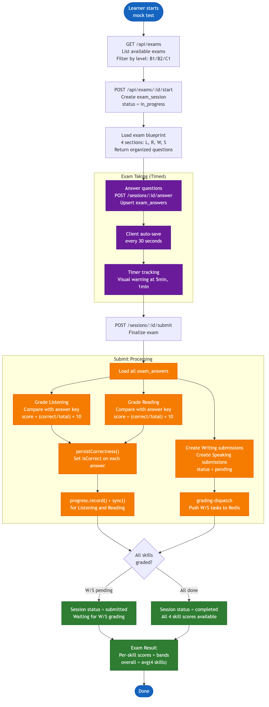

### 3.9 FE-08: Đánh Giá Thủ Công (Giảng Viên Đánh Giá)

#### 3.9.1 Xem Hàng Đợi Đánh Giá

- **Mô tả**: Liệt kê các bài nộp đang chờ giảng viên đánh giá.
- **Đầu vào**: Xác thực Giảng viên/Quản trị viên
- **Xử lý**: Truy vấn bài nộp với `status = 'review_pending'`, sắp xếp theo `review_priority` (high > medium > low) sau đó FIFO
- **Đầu ra**: Danh sách phân trang với thông tin bài nộp, kết quả AI, nội dung câu hỏi

#### 3.9.2 Nhận Bài Nộp Để Đánh Giá

- **Mô tả**: Nhận một bài nộp để giảng viên hiện tại đánh giá độc quyền.
- **Đầu vào**: ID bài nộp
- **Xử lý**: Cập nhật có điều kiện trong DB để thiết lập `claimed_by` và `claimed_at`; timeout nhận bài là 15 phút dựa trên `claimed_at`
- **Đầu ra**: Chi tiết bài nộp với kết quả AI để đánh giá
- **Trường hợp lỗi**:
  - Đã được giảng viên khác nhận → 409 CONFLICT với thông tin người nhận

#### 3.9.3 Trả Lại Bài Nộp

- **Mô tả**: Trả lại bài đã nhận vào hàng đợi đánh giá.
- **Đầu vào**: ID bài nộp
- **Xử lý**: Xóa `claimed_by` và `claimed_at`
- **Đầu ra**: `{ released: true }`

#### 3.9.4 Nộp Đánh Giá

- **Mô tả**: Nộp điểm cuối cùng và phản hồi của giảng viên.
- **Đầu vào**: `{ overallScore, band, criteriaScores, feedback, reviewComment }`
- **Xử lý**:
  1. Điểm giảng viên luôn là cuối cùng → `gradingMode = 'human'`
  2. Cả kết quả AI và kết quả giảng viên đều được lưu giữ trong `submissionDetails.result` để kiểm tra
  3. Thiết lập `auditFlag = true` khi `|aiScore - humanScore| > 0.5`
  4. Cập nhật trạng thái bài nộp → `completed`
  5. Ghi nhận `submissionEvent` (kind = `reviewed`)
  6. Kích hoạt tính lại tiến độ cho học viên

#### 3.9.5 Biểu Đồ Quy Trình Đánh Giá Của Giảng Viên

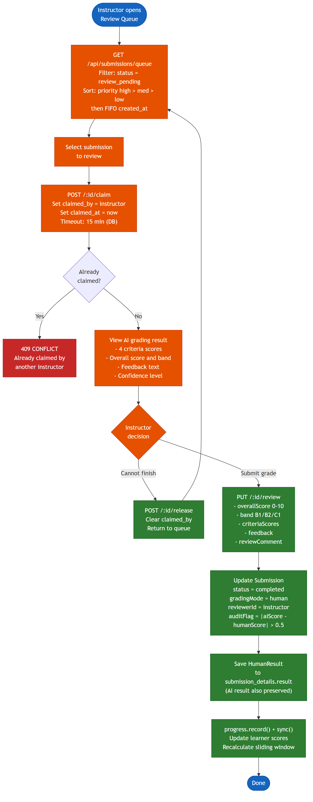

#### 3.9.6 Biểu Đồ Máy Trạng Thái Bài Nộp

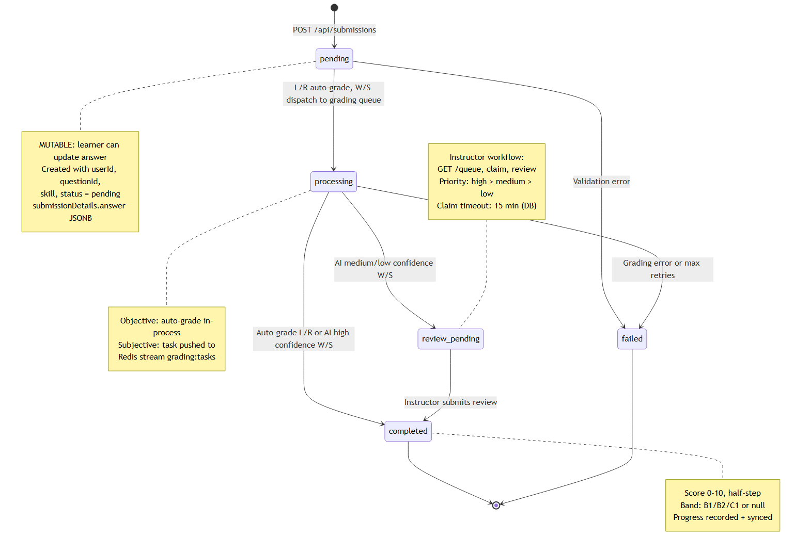

### 3.10 FE-09: Theo Dõi Tiến Độ

#### 3.10.1 Lấy Tổng Quan Tiến Độ

- **Mô tả**: Tiến độ tổng thể trên tất cả bốn kỹ năng.
- **Đầu vào**: Yêu cầu học viên đã xác thực
- **Đầu ra**: Tóm tắt mỗi kỹ năng (trình độ hiện tại, trình độ mục tiêu, giai đoạn hỗ trợ, điểm trung bình, số lần thử, xu hướng)

#### 3.10.2 Lấy Tiến Độ Theo Kỹ Năng

- **Mô tả**: Tiến độ chi tiết cho một kỹ năng cụ thể.
- **Đầu vào**: Tên kỹ năng (listening/reading/writing/speaking)
- **Xử lý**: Truy vấn 10 bài nộp hoàn thành gần nhất cho kỹ năng → tính các chỉ số sliding window
- **Đầu ra**: `{ windowAvg, windowStdDev, trend, scores[], scaffoldLevel, bandEstimate, attemptCount }`
- **Phân Loại Xu Hướng** (yêu cầu ≥ 3 lần thử):
  - `inconsistent`: windowStdDev ≥ 1.5
  - `improving`: delta (trung bình 3 lần gần nhất − trung bình 3 lần trước) ≥ +0.5
  - `declining`: delta ≤ −0.5
  - `stable`: còn lại
  - `insufficient_data`: < 3 lần thử

#### 3.10.3 Lấy Dữ Liệu Biểu Đồ Spider

- **Mô tả**: Dữ liệu cho trực quan hóa Biểu đồ Spider bốn kỹ năng.
- **Đầu vào**: Yêu cầu học viên đã xác thực
- **Đầu ra**:
  ```json
  {
    "skills": {
      "listening": { "current": 7.5, "trend": "improving" },
      "reading":   { "current": 8.2, "trend": "stable" },
      "writing":   { "current": 6.0, "trend": "improving" },
      "speaking":  { "current": 5.5, "trend": "declining" }
    },
    "goal": { "targetBand": "B2", "deadline": "2026-06-01" },
    "eta": { "weeks": 12, "perSkill": { "listening": 8, "reading": null, "writing": 12, "speaking": 10 } }
  }
  ```

#### 3.10.4 Xác Định Band Tổng Thể

- **Quy tắc**: `overallBand = min(bandListening, bandReading, bandWriting, bandSpeaking)`
- Nếu bất kỳ kỹ năng nào có dữ liệu không đủ → band tổng thể đánh dấu `low_confidence`
- Ngăn hiển thị band tổng thể bị phóng đại khi một kỹ năng yếu hơn đáng kể

#### 3.10.5 Phương Pháp Ước Tính ETA (Thời Gian Đạt Mục Tiêu)

- **Điều kiện**: Người dùng có mục tiêu (targetBand), mỗi kỹ năng có ≥ 3 lần thử
- **Phương pháp**: Hồi quy tuyến tính trên sliding window (tối đa 10 điểm mỗi kỹ năng)
  - X = số ngày kể từ lần thử đầu, Y = điểm
  - Slope = tốc độ cải thiện mỗi ngày
  - `etaDays = gap / slope`, `etaWeeks = ceil(etaDays / 7)`
- **Trả về null** khi: slope ≤ 0, dữ liệu không đủ, hoặc etaWeeks > 52
- **Trả về 0** khi: trung bình đã đạt hoặc vượt mục tiêu
- **ETA Tổng thể**: `max(ETA mỗi kỹ năng)` — kỹ năng chậm nhất quyết định tiến độ

#### 3.10.6 Biểu Đồ Theo Dõi Tiến Độ & Sliding Window


### 3.11 FE-10: Lộ Trình Học Tập

#### 3.11.1 Lấy Lộ Trình Học Tập Cá Nhân Hóa

- **Mô tả**: Tạo kế hoạch học tập hàng tuần dựa trên tiến độ hiện tại.
- **Đầu vào**: Yêu cầu học viên đã xác thực
- **Xử lý**:
  1. Xác định `weakestSkill` = kỹ năng có windowAvg thấp nhất
  2. Nếu hai kỹ năng chênh lệch ≤ 0.3, ưu tiên cả hai
  3. Phân bổ tối thiểu 1 buổi/tuần mỗi kỹ năng
  4. Các buổi còn lại phân bổ tỷ lệ theo `gapToTarget`
  5. Chọn nội dung: Viết/Nói → ưu tiên tiêu chí yếu nhất; Nghe/Đọc → ưu tiên loại câu hỏi sai nhiều nhất
- **Đầu ra**: Kế hoạch tuần với bài tập đề xuất mỗi kỹ năng, mức độ khó và thời gian ước tính

#### 3.11.2 Biểu Đồ Luồng Quản Lý Lớp Học


### 3.12 FE-11: Đặt Mục Tiêu

#### 3.12.1 Tạo Mục Tiêu

- **Mô tả**: Đặt mục tiêu học tập với band mục tiêu và thời hạn tùy chọn.
- **Đầu vào**: `{ targetBand (B1/B2/C1), deadline? (date), dailyStudyTimeMinutes? (mặc định 30) }`
- **Đầu ra**: Mục tiêu đã tạo với tính toán trạng thái

#### 3.12.2 Lấy Mục Tiêu Hiện Tại

- **Mô tả**: Lấy mục tiêu đang hoạt động hiện tại của học viên với trạng thái.
- **Đầu ra**: `{ targetBand, deadline, dailyStudyTimeMinutes, achieved, onTrack, daysRemaining }`
- **Tính Toán Trạng Thái**:
  - `achieved`: true nếu `currentEstimatedBand >= targetBand`
  - `onTrack`: true nếu ETA ≤ deadline
  - `daysRemaining`: deadline − now

#### 3.12.3 Cập Nhật Mục Tiêu

- **Mô tả**: Chỉnh sửa tham số mục tiêu (chỉ chủ sở hữu).
- **Đầu vào**: ID mục tiêu, các trường đã cập nhật
- **Đầu ra**: Mục tiêu đã cập nhật với trạng thái tính lại

### 3.13 FE-12: Quản Lý Nội Dung

#### 3.13.1 CRUD Câu Hỏi

- **Mô tả**: Quản trị viên/Giảng viên quản lý ngân hàng câu hỏi.
- **Tạo**: Cung cấp kỹ năng, cấp độ, định dạng, nội dung (JSONB), answer_key (JSONB cho L/R), rubric (cho W/S)
- **Đọc**: Danh sách với bộ lọc (kỹ năng, cấp độ, định dạng, is_active). Xem chi tiết bao gồm nội dung và answer_key.
- **Cập nhật**: Chỉnh sửa nội dung câu hỏi.
- **Xóa**: Quản trị viên xóa cứng câu hỏi.


### 3.14 FE-13: Quản Lý Người Dùng

#### 3.14.1 Thao Tác Người Dùng Của Quản Trị Viên

- **Danh Sách Người Dùng**: Danh sách phân trang với bộ lọc (vai trò, tìm kiếm email/tên)
- **Đổi Vai Trò**: `PUT /api/admin/users/:id/role` — thay đổi giữa learner/instructor/admin
- **Đổi Mật Khẩu Tự Phục Vụ**: Người dùng tự đổi mật khẩu từ màn hình hồ sơ sau khi xác thực


### 3.15 FE-14: Thông Báo Trong Ứng Dụng

#### 3.15.1 Loại Thông Báo

| Loại | Sự kiện kích hoạt | Kênh |
|------|---------|---------|
| Chấm Điểm Hoàn Thành | Trạng thái bài nộp → completed | Trong ứng dụng, Đẩy (di động) |
| Yêu Cầu Đánh Giá | Bài nộp `review_pending` mới | Trong ứng dụng (giảng viên) |
| Nhắc Nhở Mục Tiêu | Chưa đạt thời gian học hàng ngày | Đẩy (di động), Trong ứng dụng |
| Kết Quả Thi Sẵn Sàng | Phiên thi → completed | Trong ứng dụng, Đẩy (di động) |
| Hoạt Động Tài Khoản | Đăng nhập từ thiết bị mới | Email |

### 3.16 FE-15: Đăng Ký Thiết Bị Thông Báo

#### 3.16.1 Quản Lý Token Thiết Bị

- **Mô tả**: Người dùng đăng ký token thiết bị để nhận thông báo đẩy trên nền tảng di động/web hỗ trợ.
- **Đầu vào**: `{ token, platform }`
- **Đầu ra**: Token thiết bị đã được liên kết với người dùng hiện tại

### 3.17 FE-16: Vận Hành Thông Báo

#### 3.17.1 Dữ Liệu Vận Hành Thông Báo

- **Mô tả**: Quản trị viên xem thông báo đã gửi, token thiết bị và dữ liệu vận hành liên quan do backend cung cấp.

---

## 4. Yêu Cầu Phi Chức Năng

### 4.1 Giao Diện Bên Ngoài

#### 4.1.1 Giao Diện Người Dùng

- **Ứng dụng Web**: React 19 + Vite 7, thiết kế responsive hỗ trợ desktop (1024px+) và tablet (768px+)
- **Ứng dụng Di Động**: React Native (Android), tối thiểu Android 8.0 (API 26)
- **Ngôn ngữ**: Tiếng Việt (chính), giao diện tiếng Anh dự kiến cho phiên bản tương lai
- **Trợ năng**: Tuân thủ WCAG 2.1 Level AA cho điều hướng cốt lõi

#### 4.1.2 Giao Diện Phần Cứng

- **Micro**: Yêu cầu cho luyện Nói (ghi âm)
- **Loa/Tai nghe**: Yêu cầu cho luyện Nghe (phát âm thanh)
- **Camera**: Không yêu cầu

#### 4.1.3 Giao Diện Phần Mềm

| Hệ thống bên ngoài | Giao diện | Mục đích |
|----------------|-----------|---------|
| API LLM tương thích nhà cung cấp | HTTPS REST | Chấm điểm Viết/Nói dựa trên LLM |
| API STT tương thích nhà cung cấp | HTTPS REST | Phiên âm Speech-to-Text |
| PostgreSQL 17 | TCP 5432 | Kho dữ liệu chính |
| Redis 7.2+ | TCP 6379 | Streams và bộ nhớ đệm |
| Object Storage tương thích S3 | API S3-compatible | Lưu trữ âm thanh bài Nói |

#### 4.1.4 Giao Diện Truyền Thông

- **Giao thức**: HTTPS (TLS 1.2+) cho mọi giao tiếp client-server
- **Định dạng API**: REST, JSON (UTF-8), timestamp ISO 8601 UTC
- **Cập nhật trạng thái**: Client polling để theo dõi trạng thái chấm điểm bất đồng bộ
- **Xác thực**: JWT Bearer token trong header `Authorization`

### 4.2 Thuộc Tính Chất Lượng

#### 4.2.1 Khả Năng Sử Dụng

| Yêu cầu | Đặc tả |
|-------------|---------------|
| REQ-U01 | Học viên mới có thể bắt đầu bài luyện tập đầu tiên trong vòng 5 phút sau đăng ký |
| REQ-U02 | Biểu đồ Spider và dữ liệu tiến độ phải dễ hiểu mà không cần giải thích thêm |
| REQ-U03 | Giao diện chế độ luyện tập cung cấp chỉ báo trực quan rõ ràng về mức hỗ trợ hiện tại |
| REQ-U04 | Thông báo lỗi hiển thị bằng tiếng Việt với hướng dẫn có thể hành động |
| REQ-U05 | Ứng dụng di động hỗ trợ lưu câu hỏi offline cho khu vực kết nối hạn chế |
| REQ-U06 | Bộ đếm thời gian thi hiển thị nổi bật trong bài thi thử với cảnh báo trực quan tại 5 và 1 phút còn lại |

#### 4.2.2 Độ Tin Cậy

| Yêu cầu | Đặc tả |
|-------------|---------------|
| REQ-R01 | Khả dụng hệ thống: ≥ 99% trong giờ làm việc (8:00–22:00 ICT) |
| REQ-R02 | Dịch vụ chấm điểm thử lại: tối đa 3 lần với exponential backoff |
| REQ-R03 | Sau khi hết lần thử, trạng thái bài nộp thiết lập `failed` — không mất dữ liệu âm thầm |
| REQ-R04 | Tự động lưu bài thi mỗi 30 giây — mất dữ liệu tối đa 30 giây khi mất kết nối |
| REQ-R05 | Phát hiện tái sử dụng refresh token — token bị xâm phạm kích hoạt thu hồi tất cả token người dùng |
| REQ-R06 | Cơ sở dữ liệu sử dụng `ON DELETE CASCADE` — toàn vẹn tham chiếu được duy trì khi xóa |
| REQ-R07 | Kết quả chấm điểm bất đồng bộ luôn có thể truy xuất qua polling trạng thái bài nộp |

#### 4.2.3 Hiệu Năng

| Yêu cầu | Đặc tả |
|-------------|---------------|
| REQ-P01 | Thời gian phản hồi API cho thao tác CRUD: < 200ms (p95) |
| REQ-P02 | Chấm tự động Nghe/Đọc: < 500ms (đồng bộ, trong cùng request) |
| REQ-P03 | SLA chấm điểm AI Viết: thường < 5 phút, timeout 20 phút |
| REQ-P04 | SLA chấm điểm AI Nói: thường < 10 phút, timeout 60 phút |
| REQ-P05 | Tính toán dữ liệu Biểu đồ Spider: < 1 giây |
| REQ-P06 | Số người dùng đồng thời hỗ trợ: ≥ 100 học viên đồng thời |
| REQ-P07 | Polling trạng thái bài nộp nên phản hồi < 200ms (p95) |
| REQ-P08 | Truy vấn cơ sở dữ liệu cho tiến độ (sliding window): giới hạn tối đa 10 dòng mỗi kỹ năng qua window function |

#### 4.2.4 Bảo Mật

| Yêu cầu | Đặc tả |
|-------------|---------------|
| REQ-S01 | Mật khẩu được mã hóa bằng Argon2id (`Bun.password`) — không lưu văn bản rõ |
| REQ-S02 | Refresh token lưu dưới dạng hash SHA-256 trong cơ sở dữ liệu — không lưu văn bản rõ |
| REQ-S03 | JWT access token có thời hạn ngắn; refresh token hỗ trợ rotation và phát hiện tái sử dụng |
| REQ-S04 | Tối đa 3 refresh token hoạt động mỗi người dùng (giới hạn thiết bị) |
| REQ-S05 | RBAC được thực thi trên tất cả API endpoint — phân quyền vai trò learner/instructor/admin |
| REQ-S06 | Quyền truy cập dữ liệu bài nộp giới hạn cho chủ sở hữu hoặc người đánh giá được cấp quyền qua `assertAccess` ở tầng ứng dụng |
| REQ-S07 | Không có secret trong mã nguồn hoặc log — biến môi trường qua tệp `.env` |
| REQ-S08 | Tương quan request: header `X-Request-Id` trên tất cả response để theo dõi kiểm tra |

#### 4.2.5 Khả Năng Mở Rộng

| Yêu cầu | Đặc tả |
|-------------|---------------|
| REQ-SC01 | Dịch vụ chấm điểm có thể mở rộng ngang — nhiều worker tiêu thụ từ cùng Redis Streams |
| REQ-SC02 | Index cơ sở dữ liệu tối ưu cho các mẫu truy vấn phổ biến (lịch sử người dùng, hàng đợi đánh giá, câu hỏi hoạt động) |
| REQ-SC03 | Redis hỗ trợ mở rộng cho cả luồng chấm điểm bất đồng bộ và caching |
| REQ-SC04 | Ngân hàng câu hỏi hỗ trợ 10,000+ câu hỏi mà không giảm hiệu năng |

---

## 5. Phụ Lục Yêu Cầu

### 5.1 Quy Tắc Nghiệp Vụ

| ID | Định nghĩa quy tắc |
|----|-----------------|
| BR-01 | Điểm Nghe = `(correct / total) × 10`, làm tròn tới 0.5 gần nhất |
| BR-02 | Điểm Đọc = `(correct / total) × 10`, làm tròn tới 0.5 gần nhất |
| BR-03 | Điểm Viết = trung bình có trọng số của 4 tiêu chí (trọng số bằng nhau), làm tròn tới 0.5 gần nhất. Cho bài thi: `writing = task1 × (1/3) + task2 × (2/3)` |
| BR-04 | Điểm Nói = trung bình của 4 tiêu chí, làm tròn tới 0.5 gần nhất |
| BR-05 | Điểm tổng bài thi = trung bình của 4 điểm kỹ năng, làm tròn tới 0.5 gần nhất |
| BR-06 | Xác định band: 8.5–10.0 → C1, 6.0–8.4 → B2, 4.0–5.9 → B1, dưới 4.0 → null (không chứng chỉ) |
| BR-07 | Band tổng thể = min(band mỗi kỹ năng). Thiếu dữ liệu kỹ năng → low_confidence |
| BR-08 | Máy trạng thái bài nộp: chỉ cho phép chuyển trạng thái hợp lệ. Chuyển không hợp lệ → 409 CONFLICT |
| BR-09 | Chuyển trạng thái hợp lệ: pending → processing, processing → completed \| review_pending \| failed, review_pending → completed, pending → failed |
| BR-10 | Định tuyến theo độ tin cậy AI: high → completed, medium → review_pending (ưu tiên: medium), low → review_pending (ưu tiên: high) |
| BR-11 | Điểm giảng viên luôn là cuối cùng. Không pha trộn có trọng số (loại bỏ merge AI/giảng viên để đơn giản hóa) |
| BR-12 | Cờ kiểm tra: thiết lập khi `|aiScore - humanScore| > 0.5` |
| BR-13 | Sliding window: N=10 bài nộp hoàn thành gần nhất mỗi kỹ năng. Tối thiểu 3 để tính xu hướng |
| BR-14 | Xuống cấp hỗ trợ yêu cầu 2 lần liên tiếp dưới ngưỡng |
| BR-15 | Sử dụng gợi ý > 50% trong cửa sổ 3 lần thử → chặn lên cấp hỗ trợ |
| BR-16 | Tối đa 3 refresh token hoạt động mỗi người dùng (FIFO — cũ nhất bị thu hồi khi tạo thứ 4) |
| BR-17 | Tái sử dụng refresh token (token đã xoay được sử dụng lại) → thu hồi TẤT CẢ token người dùng → buộc đăng nhập lại |
| BR-18 | Tự động lưu phiên thi không ghi đè khi phiên đã được nộp |
| BR-19 | Claim bài đánh giá dùng timeout 15 phút dựa trên cập nhật có điều kiện trong DB |
| BR-20 | ETA trả về null khi: slope ≤ 0, dữ liệu không đủ (< 3 lần thử), hoặc ước tính > 52 tuần |
| BR-21 | Xóa cứng với `ON DELETE CASCADE` — không xóa mềm (ngoại trừ câu hỏi: `is_active = false`) |
| BR-22 | Tất cả điểm sử dụng `numeric(3,1)` — phạm vi 0.0 đến 10.0, bước 0.5 |

### 5.2 Yêu Cầu Chung

| ID | Yêu cầu |
|----|-------------|
| CR-01 | Tất cả API endpoint dưới tiền tố `/api` (ngoại trừ `GET /health`) |
| CR-02 | Tất cả response sử dụng định dạng JSON (UTF-8) với timestamp ISO 8601 UTC |
| CR-03 | Tất cả endpoint danh sách hỗ trợ phân trang offset: `page` (≥ 1), `limit` (1–100, mặc định 20) |
| CR-04 | Tất cả response danh sách trả về `{ data: [...], meta: { page, limit, total, totalPages } }` |
| CR-05 | Tất cả response lỗi theo envelope chuẩn: `{ error: { code, message, requestId, details? } }` |
| CR-06 | Tất cả response bao gồm header `X-Request-Id` (tạo mới hoặc phản hồi từ client) |
| CR-07 | Xác thực qua header `Authorization: Bearer <jwt>` trên endpoint được bảo vệ |
| CR-09 | Endpoint kiểm tra sức khỏe: `GET /health` trả về `{ status: "ok", services: { db, redis } }` |
| CR-10 | Đặc tả OpenAPI tự động tạo và có sẵn tại `GET /openapi.json` |
| CR-09 | Endpoint kiểm tra sức khỏe: `GET /health` trả về `{ status: "ok", services: { db, redis } }` |
| CR-10 | Đặc tả OpenAPI tự động tạo và có sẵn tại `GET /openapi.json` |

### 5.3 Danh Sách Thông Báo Ứng Dụng

| # | Mã thông báo | Loại thông báo | Ngữ cảnh | Nội dung |
|---|-------------|--------------|---------|---------|
| 1 | MSG01 | Inline | Không có kết quả tìm kiếm | Không tìm thấy kết quả. |
| 2 | MSG02 | Inline (đỏ) | Trường bắt buộc trống | Trường {field} là bắt buộc. |
| 3 | MSG03 | Toast | Đăng nhập thành công | Đăng nhập thành công. |
| 4 | MSG04 | Toast | Đăng ký thành công | Đăng ký thành công. Vui lòng đăng nhập. |
| 5 | MSG05 | Toast | Bài nộp đã tạo | Bài làm đã được gửi. Đang chấm điểm... |
| 6 | MSG06 | Toast | Chấm điểm hoàn thành | Kết quả chấm điểm đã sẵn sàng. |
| 7 | MSG07 | Toast | Đánh giá đã nộp | Đã gửi kết quả chấm bài thành công. |
| 8 | MSG08 | Inline (đỏ) | Đầu vào vượt độ dài tối đa | Vượt quá độ dài tối đa {max_length} ký tự. |
| 9 | MSG09 | Inline | Thông tin đăng nhập không hợp lệ | Sai email hoặc mật khẩu. Vui lòng thử lại. |
| 10 | MSG10 | Toast | Mục tiêu đã tạo | Đã thiết lập mục tiêu học tập. |
| 11 | MSG11 | Toast | Đạt mục tiêu | Chúc mừng! Bạn đã đạt mục tiêu {targetBand}. |
| 12 | MSG12 | Thông báo | Chấm điểm thất bại | Chấm điểm thất bại. Vui lòng thử lại sau. |
| 13 | MSG13 | Toast | Bài thi đã nộp | Bài thi đã được nộp. Đang chấm điểm... |
| 14 | MSG14 | Toast | Bài thi hoàn thành | Kết quả bài thi đã sẵn sàng. Xem chi tiết. |
| 15 | MSG15 | Thông báo | Đang chờ đánh giá | Bài làm của bạn đang chờ giảng viên chấm. |
| 16 | MSG16 | Inline | Phiên hết hạn | Phiên đăng nhập đã hết hạn. Vui lòng đăng nhập lại. |
| 17 | MSG17 | Xác nhận | Nhận bài nộp | Bạn có muốn nhận chấm bài này không? |
| 18 | MSG18 | Toast | Nhận bài thành công | Đã nhận bài chấm. Bạn có 15 phút để hoàn thành. |
| 19 | MSG19 | Inline (đỏ) | Đã được nhận | Bài này đã được giảng viên khác nhận chấm. |
| 20 | MSG20 | Toast | Lên cấp hỗ trợ | Bạn đã lên cấp hỗ trợ! Tiếp tục phát huy nhé. |
| 21 | MSG21 | Toast | Tự động lưu thành công | Đã tự động lưu bài thi. |
| 22 | MSG22 | Cảnh báo | Cảnh báo thời gian thi | Còn {minutes} phút để hoàn thành bài thi. |
| 23 | MSG23 | Inline (đỏ) | Số từ không đủ | Bài viết cần tối thiểu {minWords} từ. Hiện tại: {currentWords} từ. |
| 24 | MSG24 | Toast | Đặt lại mật khẩu | Mật khẩu đã được đặt lại thành công. |
| 25 | MSG25 | Xác nhận | Giới hạn thiết bị | Bạn đã đăng nhập trên 3 thiết bị. Thiết bị cũ nhất sẽ bị đăng xuất. Tiếp tục? |

### 5.4 Định Nghĩa và Từ Viết Tắt

#### Từ viết tắt

| Từ viết tắt | Định nghĩa |
|---------|------------|
| AI | Artificial Intelligence |
| API | Application Programming Interface |
| CEFR | Common European Framework of Reference for Languages |
| JWT | JSON Web Token |
| LLM | Large Language Model |
| MCQ | Multiple Choice Question |
| MVP | Minimum Viable Product |
| NPS | Net Promoter Score |
| RBAC | Role-Based Access Control |
| REST | Representational State Transfer |
| SLA | Service Level Agreement |
| SRS | Software Requirements Specification |
| SSE | Server-Sent Events |
| STT | Speech-to-Text |
| VSTEP | Vietnamese Standardized Test of English Proficiency |

#### Thuật ngữ

| Thuật ngữ | Định nghĩa |
|------|------------|
| Adaptive Scaffolding | Hỗ trợ linh hoạt điều chỉnh mức độ trợ giúp dựa trên năng lực người học (Template → Keywords → Free cho Viết; Full Text → Highlights → Pure Audio cho Nghe) |
| Band | Phân loại trình độ năng lực: A1, A2, B1, B2, C1 |
| Hybrid Grading | Hệ thống chấm điểm kết hợp AI và giám khảo con người |
| Sliding Window | Phương pháp tính trung bình từ N bài tập gần nhất (N=10) |
| Spider Chart | Biểu đồ Spider trực quan hóa năng lực đa chiều trên bốn kỹ năng |
| Submission | Câu trả lời của học viên cho một câu hỏi đơn lẻ, được theo dõi từ khi tạo đến điểm cuối cùng |
| Exam Session | Phiên thi thử có giới hạn thời gian bao gồm tất cả bốn kỹ năng |
| Scaffold Level | Mức hỗ trợ hiện tại cho một kỹ năng (1=Template/FullText, 2=Keywords/Highlights, 3=Free/PureAudio) |
| Confidence | Độ tin cậy tự đánh giá của AI về kết quả chấm điểm (high, medium, low) |
| Review Priority | Mức độ ưu tiên cho giảng viên đánh giá (low, medium, high) |

### 5.5 Tài Liệu Tham Chiếu

| # | Tài liệu | Mô tả |
|---|----------|-------------|
| 1 | Report 1 — Giới Thiệu Dự Án | Bối cảnh dự án, hệ thống hiện có, cơ hội kinh doanh, tầm nhìn |
| 2 | Report 2 — Kế Hoạch Quản Lý Dự Án | WBS, ước tính, sổ đăng ký rủi ro, ma trận trách nhiệm |
| 3 | Đặc Tả Kỹ Thuật (20 tệp) | Quy tắc miền, hợp đồng API, lược đồ dữ liệu, các mối quan tâm nền tảng |
| 4 | `specs/00-overview/solution-decisions.md` | Quyết định kiến trúc và tech stack |
| 5 | `specs/10-contracts/api-endpoints.md` | Danh mục endpoint REST API |
| 6 | `specs/10-contracts/api-conventions.md` | Quy ước HTTP, phân trang, idempotency |
| 7 | `specs/20-domain/vstep-exam-format.md` | Ánh xạ định dạng VSTEP tới domain model |
| 8 | `specs/20-domain/submission-lifecycle.md` | Máy trạng thái bài nộp và luồng chấm điểm |
| 9 | `specs/20-domain/hybrid-grading.md` | Pipeline chấm điểm AI và định tuyến theo độ tin cậy |
| 10 | `specs/20-domain/progress-tracking.md` | Chỉ số tiến độ, xu hướng, tính toán ETA |
| 11 | `specs/20-domain/adaptive-scaffolding.md` | Các giai đoạn hỗ trợ và quy tắc tiến trình |
| 12 | `specs/30-data/database-schema.md` | Thực thể cơ sở dữ liệu, index, enum |
| 13 | `specs/40-platform/authentication.md` | Luồng JWT, rotation, giới hạn thiết bị |
| 14 | `specs/50-ops/deployment.md` | Docker Compose và biến môi trường |

---

*Phiên bản tài liệu: 2.0 — Cập nhật lần cuối: SP26SE145*