# Báo Cáo Đồ Án Capstone

## Report 4 — Tài Liệu Thiết Kế Phần Mềm

**Tên dự án**: Hệ Thống Luyện Thi VSTEP Thích Ứng Với Đánh Giá Toàn Diện Kỹ Năng Và Hỗ Trợ Học Tập Cá Nhân Hóa
**Mã dự án**: SP26SE145 · Nhóm: GSP26SE63
**Thời gian**: 01/01/2026 – 30/04/2026

— Hà Nội, tháng 03/2026 —

---

# I. Lịch Sử Thay Đổi

*A — Thêm mới · M — Chỉnh sửa · D — Xóa*

| Ngày | A/M/D | Người phụ trách | Mô tả thay đổi |
|------|-------|------------------|----------------|
| 02/03/2026 | A | Nghĩa (Trưởng nhóm) | Bản SDD ban đầu |
| 09/03/2026 | M | AI-assisted revision | Viết lại tài liệu để khớp với code hiện tại, loại bỏ các flow chưa hoàn thiện end-to-end |

---

# II. Tài Liệu Thiết Kế Phần Mềm

## 1. System Design

### 1.1 Phạm vi phản ánh của tài liệu

Tài liệu này **chỉ mô tả các chức năng đã có cả mã frontend web và backend đang được sử dụng thực tế** trong monorepo hiện tại.

**Được đưa vào tài liệu:**
- Xác thực người dùng: đăng ký, đăng nhập, refresh token, đăng xuất
- Hồ sơ cá nhân: xem/cập nhật hồ sơ, đổi mật khẩu, cập nhật avatar
- Onboarding bằng **self-assessment** và khởi tạo mục tiêu học tập
- Thi thử: danh sách đề, xem chi tiết, bắt đầu phiên thi, auto-save, nộp bài
- Chấm điểm hậu nộp cho Writing qua worker AI
- Tiến trình học tập: overview, spider chart, activity, skill detail, history từ exam sessions
- Lịch sử bài nộp và chi tiết bài nộp
- Các màn hình quản trị đang dùng thật: users, questions, knowledge points, exams, submissions

**Không được mô tả như flow hoàn chỉnh trong tài liệu này:**
- `classes`, `notifications`, `ai`, `practice/next`, `vocabulary` API vì web frontend hiện chưa gọi trực tiếp như một luồng hoàn chỉnh
- Instructor review queue trên web vì chưa có màn hình frontend tương ứng
- Speaking AI grading end-to-end: frontend hiện ghi âm bằng blob URL cục bộ, chưa upload audio lên object storage trước khi worker chấm

### 1.2 Kiến trúc hệ thống

Hệ thống hiện tại gồm 3 ứng dụng chính trong monorepo:

| Thành phần | Công nghệ | Vai trò hiện tại |
|-----------|-----------|------------------|
| Web Frontend | React 19 + Vite 7 + TanStack Router + React Query | Giao diện SPA cho learner và admin |
| Backend API | Bun + Elysia + Drizzle ORM | Cung cấp REST API, xác thực, nghiệp vụ, quản trị nội dung, điều phối chấm điểm |
| Grading Worker | Python + Redis Streams + LiteLLM | Tiêu thụ tác vụ chấm Writing, trả kết quả lại cho backend qua Redis stream |

### 1.3 Biểu đồ kiến trúc tổng thể

```mermaid
flowchart LR
    subgraph FE[Web SPA]
        AuthPages[Login / Register]
        OnboardingPage[Onboarding]
        ExamPages[Exams / Exam Session]
        ProgressPages[Progress / History]
        SubmissionPages[Submissions]
        ProfilePage[Profile]
        AdminPages[Admin Users / Questions / KPs / Exams / Submissions]
    end

    subgraph BE[Backend API - Bun + Elysia]
        AuthMod[/auth]
        UsersMod[/users]
        OnboardingMod[/onboarding]
        ExamsMod[/exams]
        ProgressMod[/progress]
        SubmissionsMod[/submissions]
        QuestionsMod[/questions]
        KPMod[/knowledge-points]
    end

    subgraph DATA[Data Layer]
        PG[(PostgreSQL 17)]
        Redis[(Redis Streams)]
        MinIO[(MinIO / S3)]
    end

    subgraph GRADING[AI Grading Service]
        Worker[worker.py]
        WritingPipeline[writing.py]
        LLM[LiteLLM]
    end

    FE -->|REST JSON + JWT| BE
    UsersMod -->|avatar storage| MinIO
    BE --> PG
    SubmissionsMod -->|XADD grading:tasks| Redis
    Worker -->|XREADGROUP grading:tasks| Redis
    Worker --> WritingPipeline --> LLM
    Worker -->|XADD grading:results| Redis
    BE -->|XREADGROUP grading:results| Redis
    BE -->|persist final result| PG
```

### 1.4 Các quyết định thiết kế chính

| Quyết định | Thiết kế đang dùng | Lý do |
|-----------|--------------------|------|
| Giao tiếp frontend-backend | REST API dưới `/api` | Đơn giản, rõ ràng, phù hợp SPA |
| Auth | JWT access token + refresh token rotation | Hỗ trợ đa phiên, dễ tích hợp frontend |
| Queue chấm điểm | **Redis Streams** (`grading:tasks`, `grading:results`) | Tách backend và worker, có consumer group |
| Ghi DB sau chấm AI | **Backend** là thành phần ghi PostgreSQL cuối cùng | Giữ state transition tập trung ở backend |
| Theo dõi tiến trình | `user_skill_scores` + `user_progress` | Tách raw events và số liệu tổng hợp |
| Lưu file người dùng | MinIO qua storage abstraction | Dùng cho avatar; speaking upload từ web chưa nối hoàn chỉnh |
| Phân quyền UI | Route groups theo auth / learner / admin | Tách rõ luồng người dùng |

### 1.5 Package Diagram

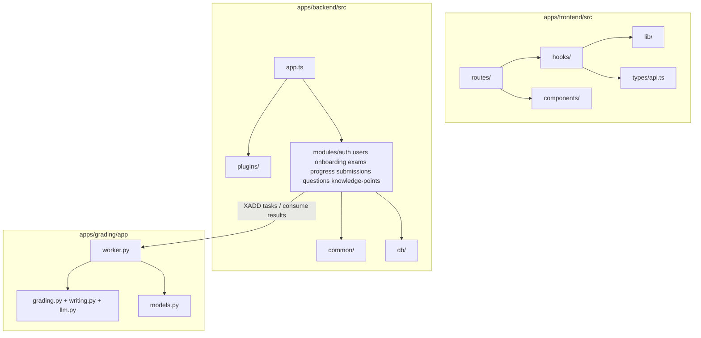

### 1.6 Mô tả package

| STT | Package | Mô tả |
|-----|---------|-------|
| 1 | `apps/frontend/src/routes/_auth` | Màn hình đăng nhập, đăng ký |
| 2 | `apps/frontend/src/routes/_focused` | Onboarding và không gian làm bài thi theo session |
| 3 | `apps/frontend/src/routes/_learner` | Profile, exams, progress, submissions |
| 4 | `apps/frontend/src/routes/admin` | Các màn hình quản trị đã có UI thật |
| 5 | `apps/frontend/src/hooks` | Hook React Query gọi backend API |
| 6 | `apps/frontend/src/lib` | API client, auth storage, query client |
| 7 | `apps/backend/src/modules/auth` | Đăng ký, đăng nhập, refresh, logout |
| 8 | `apps/backend/src/modules/users` | Hồ sơ cá nhân, đổi mật khẩu, avatar, admin users |
| 9 | `apps/backend/src/modules/onboarding` | Self-assess, placement start, skip |
| 10 | `apps/backend/src/modules/exams` | CRUD đề thi, phiên thi, auto-save, submit |
| 11 | `apps/backend/src/modules/submissions` | Bài nộp, chấm objective, điều phối grading, admin assign |
| 12 | `apps/backend/src/modules/progress` | Tổng hợp tiến trình, spider chart, activity, goals |
| 13 | `apps/backend/src/modules/questions` | Quản lý question bank |
| 14 | `apps/backend/src/modules/knowledge-points` | Quản lý knowledge points |
| 15 | `apps/grading/app/worker.py` | Worker Redis Streams tiêu thụ task chấm Writing |
| 16 | `apps/grading/app/writing.py` | Pipeline gọi LLM và chuẩn hóa kết quả chấm |

---

## 2. Database Design

### 2.1 ERD cho các flow đang được dùng end-to-end

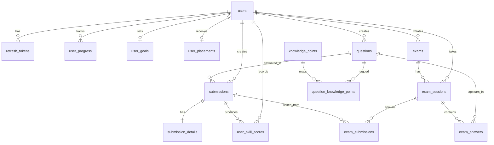

### 2.2 Mô tả bảng chính

| STT | Bảng | Mô tả |
|-----|------|-------|
| 1 | `users` | Tài khoản người dùng, vai trò, avatar |
| 2 | `refresh_tokens` | Phiên refresh token với rotation và revoke |
| 3 | `questions` | Ngân hàng câu hỏi dùng cho exams và submissions |
| 4 | `knowledge_points` | Danh mục điểm kiến thức do admin quản lý |
| 5 | `question_knowledge_points` | Liên kết nhiều-nhiều giữa câu hỏi và điểm kiến thức |
| 6 | `exams` | Đề thi có `title`, `level`, `type`, `durationMinutes`, `blueprint` |
| 7 | `exam_sessions` | Phiên làm bài của learner, lưu trạng thái và điểm theo skill |
| 8 | `exam_answers` | Câu trả lời đã lưu trong phiên thi |
| 9 | `exam_submissions` | Liên kết từ phiên thi sang các bài nộp Writing phát sinh sau submit |
| 10 | `submissions` | Bài nộp độc lập và bài nộp phát sinh từ exam submit |
| 11 | `submission_details` | Payload trả lời và kết quả chấm của submission |
| 12 | `user_skill_scores` | Sự kiện điểm theo thời gian, nguồn để tính trend |
| 13 | `user_progress` | Bản tổng hợp tiến trình mỗi user mỗi skill |
| 14 | `user_goals` | Mục tiêu band, deadline, daily study time |
| 15 | `user_placements` | Kết quả onboarding/self-assessment/placement |

### 2.3 Thuộc tính dữ liệu quan trọng

| Bảng | Khóa chính | Khóa ngoại chính | Ghi chú |
|------|------------|------------------|---------|
| `users` | `id` | — | `role` = learner/instructor/admin |
| `refresh_tokens` | `id` | `user_id -> users.id` | Lưu hash, không lưu plaintext token |
| `questions` | `id` | `created_by -> users.id` | Có `skill`, `level`, `part`, `content`, `answer_key` |
| `exams` | `id` | `created_by -> users.id` | `blueprint` là JSONB |
| `exam_sessions` | `id` | `user_id`, `exam_id` | Có `listening_score`, `reading_score`, `writing_score`, `speaking_score`, `overall_score`, `overall_band` |
| `exam_answers` | `id` | `session_id`, `question_id` | Unique `(session_id, question_id)` |
| `submissions` | `id` | `user_id`, `question_id`, `reviewer_id`, `claimed_by` | Có state machine `pending -> processing -> completed/review_pending/failed` |
| `submission_details` | `submission_id` | `submission_id -> submissions.id` | 1-1 với submissions |
| `user_skill_scores` | `id` | `user_id`, `submission_id?`, `session_id?` | Dùng cho sliding window |
| `user_progress` | `id` | `user_id` | Unique `(user_id, skill)` |
| `user_goals` | `id` | `user_id` | Unique goal theo user |
| `user_placements` | `id` | `user_id`, `session_id?` | Kết quả self-assess/placement/skip |

### 2.4 Enum và index đang dùng

**Enum chính trong code hiện tại**

| Enum | Giá trị |
|------|---------|
| `user_role` | `learner`, `instructor`, `admin` |
| `skill` | `listening`, `reading`, `writing`, `speaking` |
| `question_level` | `A2`, `B1`, `B2`, `C1` |
| `vstep_band` | `B1`, `B2`, `C1` |
| `submission_status` | `pending`, `processing`, `completed`, `review_pending`, `failed` |
| `grading_mode` | `auto`, `human`, `hybrid` |
| `exam_status` | `in_progress`, `submitted`, `completed`, `abandoned` |
| `exam_type` | `practice`, `placement`, `mock` |
| `knowledge_point_category` | `grammar`, `vocabulary`, `strategy`, `topic` |

**Index nóng quan trọng**

| Index | Mục đích |
|------|----------|
| `users_email_unique` | Tra cứu đăng nhập theo email |
| `refresh_tokens_active_idx` | Giới hạn số refresh token active |
| `submissions_review_queue_idx` | Truy vấn hàng đợi chấm/review |
| `submissions_user_history_idx` | Lịch sử bài nộp theo thời gian |
| `exam_answers_session_question_idx` | Một câu trả lời cho mỗi câu hỏi trong một session |
| `exams_active_idx` | Danh sách đề thi đang active |
| `user_progress_user_skill_idx` | Một bản tiến trình cho mỗi kỹ năng |
| `user_skill_scores_user_skill_idx` | Lấy 10 điểm gần nhất cho trend |

### 2.5 JSONB đang dùng trong implementation

| Cột | Vai trò |
|-----|---------|
| `questions.content` | Nội dung câu hỏi theo skill/part |
| `questions.answer_key` | Đáp án objective |
| `exams.blueprint` | Danh sách question IDs theo từng skill |
| `exam_answers.answer` | Câu trả lời trong phiên thi |
| `submission_details.answer` | Payload learner nộp cho submission |
| `submission_details.result` | Kết quả chấm `auto` hoặc `ai` hoặc `human` |

---

## 3. Detailed Design

## 3.1 Xác thực và quản lý phiên đăng nhập

### 3.1.1 Cấu trúc xử lý

```mermaid
flowchart LR
    LoginPage[Login/Register Page] --> ApiClient[api.ts]
    ApiClient --> AuthRoutes[/api/auth/*]
    AuthRoutes --> AuthService[auth/service.ts]
    AuthService --> Users[(users)]
    AuthService --> Tokens[(refresh_tokens)]
```

### 3.1.2 Sequence Diagram — Đăng nhập

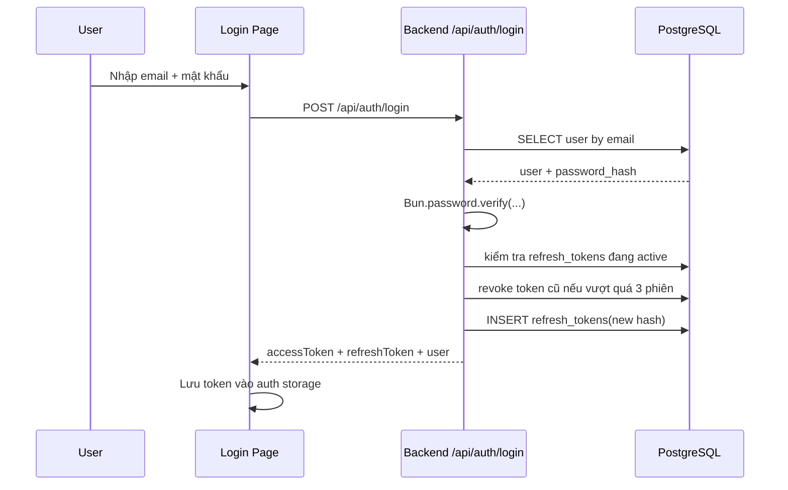

### 3.1.3 Sequence Diagram — Refresh token

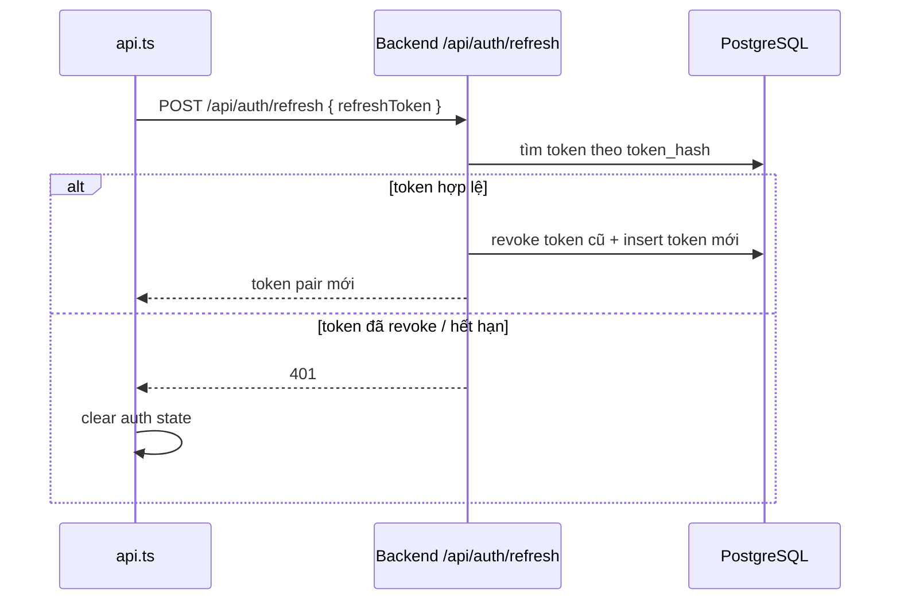

## 3.2 Onboarding bằng self-assessment và khởi tạo mục tiêu

### 3.2.1 Cấu trúc xử lý

```mermaid
flowchart LR
    OnboardingPage[Onboarding Page] --> QuizLogic[Quiz/self-assess UI]
    QuizLogic --> ApiClient[api.post /api/onboarding/self-assess]
    ApiClient --> OnboardingRoute[/api/onboarding/self-assess]
    OnboardingRoute --> OnboardingService[onboarding/service.ts]
    OnboardingService --> Placements[(user_placements)]
    OnboardingService --> Goals[(user_goals)]
    OnboardingService --> Progress[(user_progress)]
```

### 3.2.2 Sequence Diagram — Self-assessment

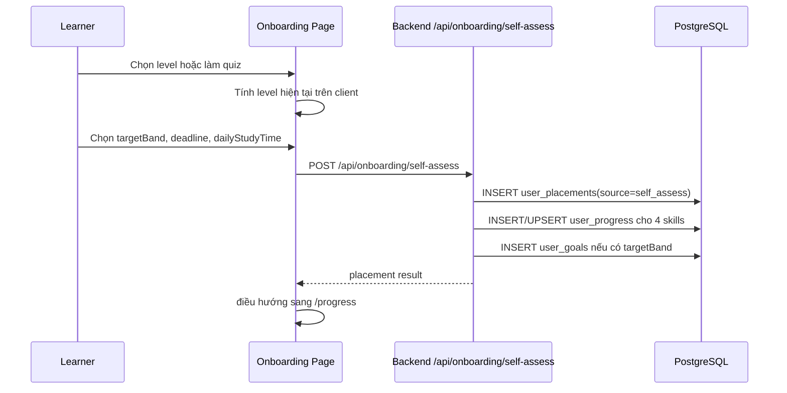

## 3.3 Hồ sơ cá nhân

### 3.3.1 Cấu trúc xử lý

```mermaid
flowchart LR
    ProfilePage[Profile Page] --> UserHooks[useUser / useUpdateUser / useChangePassword / useUploadAvatar]
    UserHooks --> UserRoutes[/api/users/:id, /password, /avatar]
    UserRoutes --> UserService[users/service.ts]
    UserService --> Users[(users)]
    UserService --> Storage[(MinIO via storage.ts)]
```

### 3.3.2 Sequence Diagram — Cập nhật hồ sơ và avatar

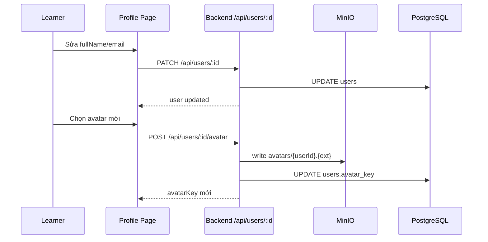

## 3.4 Phiên thi: bắt đầu, auto-save, nộp bài

### 3.4.1 Cấu trúc xử lý

```mermaid
flowchart LR
    ExamList[Exam List Page] --> StartExam[POST /api/exams/:id/start]
    ExamWorkspace[/practice/:sessionId] --> SaveAnswers[PUT /api/exams/sessions/:sessionId]
    ExamWorkspace --> SubmitExam[POST /api/exams/sessions/:sessionId/submit]
    StartExam --> ExamsRoute[/api/exams]
    SaveAnswers --> ExamsRoute
    SubmitExam --> ExamsRoute
    ExamsRoute --> SessionService[session.ts + submit.ts]
    SessionService --> ExamsDB[(exams / exam_sessions / exam_answers)]
    SessionService --> SubmissionsDB[(submissions / submission_details / exam_submissions)]
```

### 3.4.2 Sequence Diagram — Bắt đầu phiên thi và auto-save

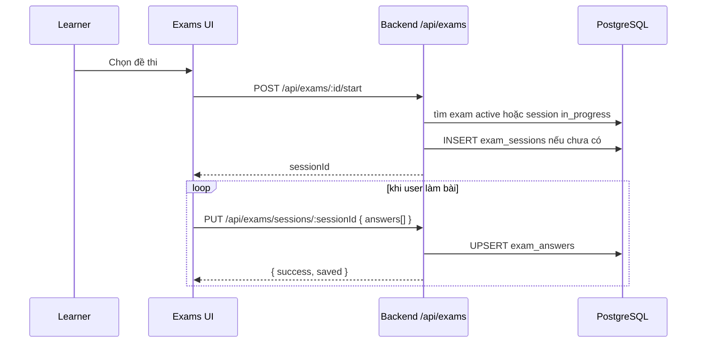

### 3.4.3 Sequence Diagram — Nộp bài thi

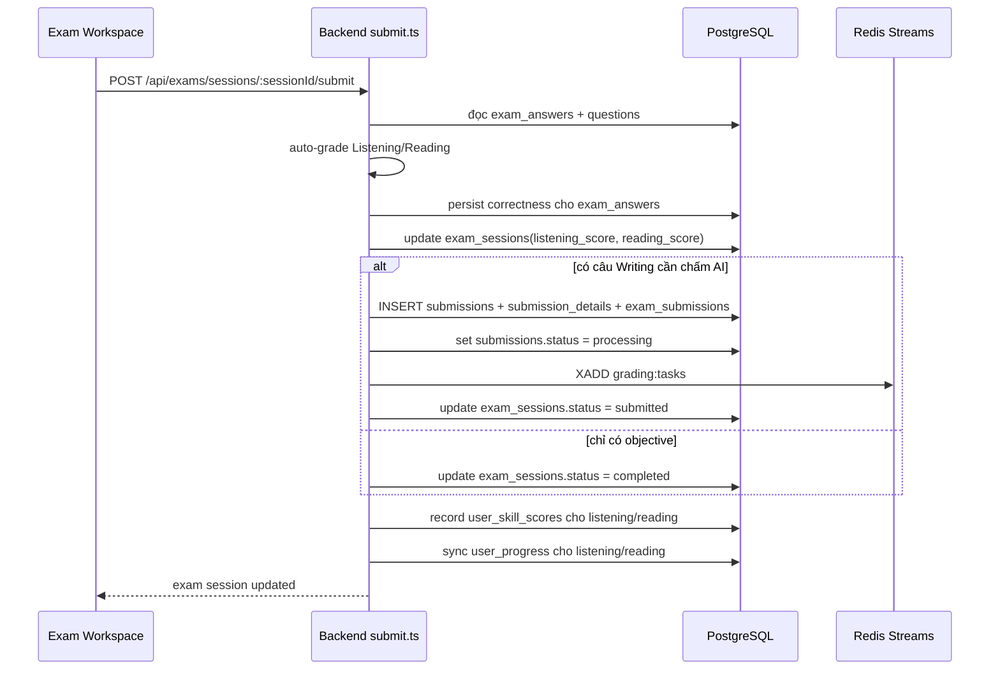

## 3.5 Chấm Writing qua worker AI

> Luồng này hiện là luồng AI grading hoàn chỉnh trong web application. Speaking chưa được đưa vào đây vì frontend web chưa upload audio lên object storage trước khi worker xử lý.

### 3.5.1 Cấu trúc xử lý

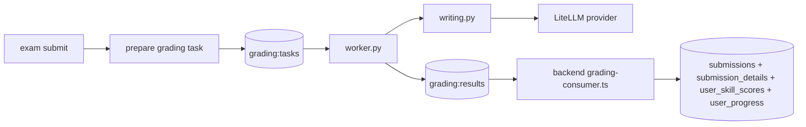

### 3.5.2 Sequence Diagram — Writing grading pipeline

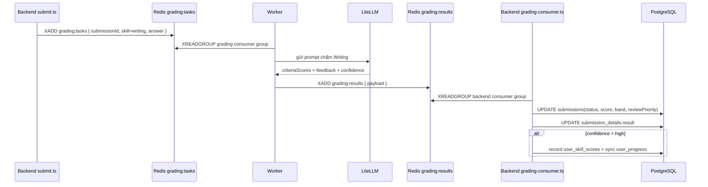

## 3.6 Tiến trình học tập và lịch sử bài nộp

### 3.6.1 Cấu trúc xử lý

```mermaid
flowchart LR
    ProgressPage[Progress Pages] --> ProgressHooks[useProgress / useSpiderChart / useActivity / useSkillDetail]
    SubmissionPages[Submissions Pages] --> SubmissionHooks[useSubmissions / useSubmission]
    ProgressHooks --> ProgressRoutes[/api/progress/*]
    SubmissionHooks --> SubmissionRoutes[/api/submissions/*]
    ProgressRoutes --> ProgressService[progress/service.ts + overview.ts]
    SubmissionRoutes --> SubmissionService[submissions/service.ts]
    ProgressService --> Scores[(user_skill_scores)]
    ProgressService --> Progress[(user_progress)]
    SubmissionService --> SubmissionTables[(submissions + submission_details)]
```

### 3.6.2 Sequence Diagram — Đồng bộ tiến trình sau khi có điểm

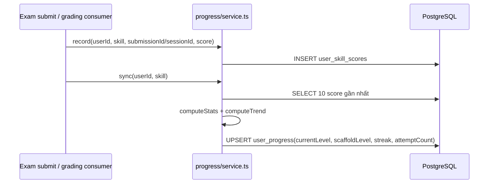

### 3.6.3 Giao diện learner dùng dữ liệu này

| Route web | Dữ liệu backend |
|----------|-----------------|
| `/progress` | overview + spider chart + activity |
| `/progress/:skill` | skill detail + recent scores + trend |
| `/progress/history` | exam sessions completed |
| `/submissions` | danh sách submissions của learner |
| `/submissions/:id` | answer, result, feedback, criteria scores |

## 3.7 Quản trị hệ thống

### 3.7.1 Phạm vi admin đã có UI thật

| Màn hình admin | Thao tác thực hiện được hiện tại |
|----------------|----------------------------------|
| `/admin/users` | List, filter, create, delete user |
| `/admin/questions` | List, filter, xem JSON content, delete question |
| `/admin/knowledge-points` | List, filter, create, delete knowledge point |
| `/admin/exams` | List, create exam, bật/tắt active |
| `/admin/submissions` | List/filter submissions, auto-grade objective, assign reviewer |

### 3.7.2 Sequence Diagram — Admin tạo đề thi

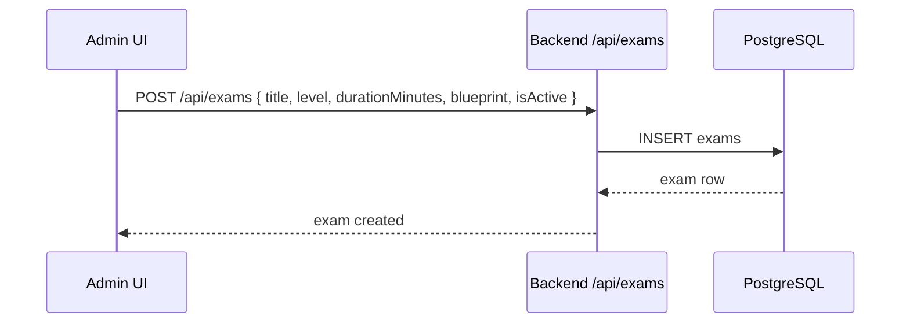

### 3.7.3 Sequence Diagram — Admin auto-grade objective submission

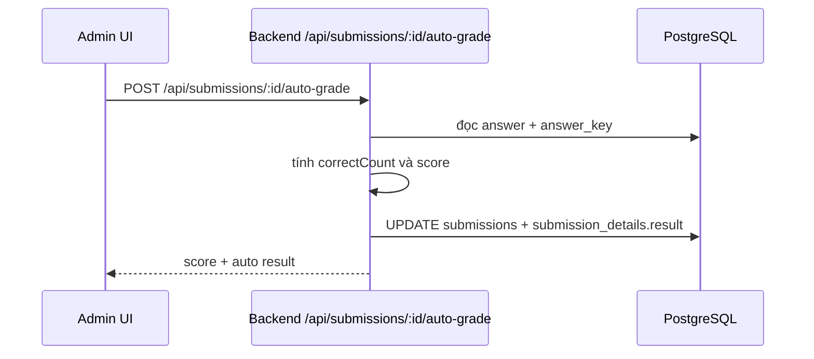

---

## 4. Interface Design

### 4.1 Các route frontend đang dùng thật trong web app

| Nhóm | Route | Mục đích |
|------|-------|----------|
| Auth | `/login`, `/register` | Đăng nhập, đăng ký |
| Focused flow | `/onboarding` | Self-assessment và goal initialization |
| Exams | `/exams`, `/exams/:examId`, `/practice/:sessionId`, `/exams/sessions/:sessionId` | Chọn đề, làm bài, xem kết quả session |
| Progress | `/progress`, `/progress/:skill`, `/progress/history` | Dashboard tiến trình và lịch sử bài thi |
| Submissions | `/submissions`, `/submissions/:id` | Xem lịch sử bài nộp và chi tiết |
| Profile | `/profile` | Hồ sơ, avatar, đổi mật khẩu |
| Admin | `/admin/users`, `/admin/questions`, `/admin/knowledge-points`, `/admin/exams`, `/admin/submissions` | Quản trị dữ liệu hệ thống |

### 4.2 Backend endpoints hiện đang được frontend sử dụng

| Nhóm | Method | Path |
|------|--------|------|
| Auth | POST | `/api/auth/login` |
| Auth | POST | `/api/auth/register` |
| Auth | POST | `/api/auth/refresh` |
| Auth | POST | `/api/auth/logout` |
| Users/Profile | GET | `/api/users/:id` |
| Users/Profile | PATCH | `/api/users/:id` |
| Users/Profile | POST | `/api/users/:id/password` |
| Users/Profile | POST | `/api/users/:id/avatar` |
| Onboarding | POST | `/api/onboarding/self-assess` |
| Exams | GET | `/api/exams` |
| Exams | GET | `/api/exams/:id` |
| Exams | POST | `/api/exams/:id/start` |
| Exams | GET | `/api/exams/sessions` |
| Exams | GET | `/api/exams/sessions/:sessionId` |
| Exams | PUT | `/api/exams/sessions/:sessionId` |
| Exams | POST | `/api/exams/sessions/:sessionId/submit` |
| Progress | GET | `/api/progress` |
| Progress | GET | `/api/progress/spider-chart` |
| Progress | GET | `/api/progress/activity` |
| Progress | GET | `/api/progress/:skill` |
| Submissions | GET | `/api/submissions` |
| Submissions | GET | `/api/submissions/:id` |
| Admin Users | GET | `/api/users` |
| Admin Users | POST | `/api/users` |
| Admin Users | DELETE | `/api/users/:id` |
| Admin Questions | GET | `/api/questions` |
| Admin Questions | DELETE | `/api/questions/:id` |
| Admin Knowledge Points | GET | `/api/knowledge-points` |
| Admin Knowledge Points | POST | `/api/knowledge-points` |
| Admin Knowledge Points | DELETE | `/api/knowledge-points/:id` |
| Admin Exams | POST | `/api/exams` |
| Admin Exams | PATCH | `/api/exams/:id` |
| Admin Submissions | POST | `/api/submissions/:id/auto-grade` |
| Admin Submissions | POST | `/api/submissions/:id/assign` |

### 4.3 Các phần cố ý không đưa vào report này

Những phần dưới đây **có thể đã có mã ở một phía hoặc có route skeleton**, nhưng **không được xem là chức năng web end-to-end hoàn chỉnh** nên không mô tả như phần chính của thiết kế hiện tại:

- `classes`
- `notifications`
- `ai`
- `practice/next`
- `vocabulary` API
- Instructor review queue trên frontend
- Speaking audio upload và speaking AI grading end-to-end từ web

---

## 5. Design Decisions and Constraints

### 5.1 Bảo mật

| Chủ đề | Thiết kế hiện tại |
|--------|-------------------|
| Password hashing | `Bun.password.hash(..., "argon2id")` |
| Access control | JWT Bearer + role macros trong `plugins/auth.ts` |
| Refresh token | Hash SHA-256 trong DB, rotation, reuse detection |
| Phiên active tối đa | 3 refresh token active mỗi user |
| Row-level access | User chỉ xem/sửa dữ liệu của chính mình, trừ admin |

### 5.2 Tính nhất quán dữ liệu

| Chủ đề | Thiết kế hiện tại |
|--------|-------------------|
| Multi-step mutations | Dùng `db.transaction(...)` |
| Exam submit | Chấm objective và tạo writing submissions trong cùng transaction |
| Dispatch AI grading | `prepare()` trong transaction, `dispatch()` sau commit |
| Progress sync | `record()` rồi `sync()` sau khi có điểm |
| Final DB write sau AI grading | Backend consumer ghi DB từ `grading:results` |

### 5.3 Ràng buộc implementation

- Frontend là SPA client-side, không dùng SSR
- Backend là nguồn sự thật cho schema và state transitions
- Queue grading dùng Redis Streams, **không dùng LPUSH/BRPOP**
- Worker **không ghi PostgreSQL trực tiếp** trong flow grading hiện tại
- Report này ưu tiên tính đúng của implementation hơn là mô tả tất cả module có trong repo

---

## 6. Tài Liệu Tham Khảo

| # | Tài liệu | Mô tả |
|---|----------|-------|
| 1 | `apps/frontend/src/` | Mã nguồn web frontend hiện tại |
| 2 | `apps/backend/src/` | Mã nguồn backend hiện tại |
| 3 | `apps/grading/app/` | Mã nguồn worker chấm Writing |
| 4 | `docs/capstone/specs/architecture.md` | Kiến trúc kỹ thuật hiện tại |
| 5 | `docs/capstone/specs/api-contracts.md` | API contracts hiện tại |
| 6 | `docs/capstone/specs/database.md` | Tóm tắt schema hiện tại |
| 7 | `docs/capstone/specs/domain-logic.md` | Logic lifecycle, grading, progress |

---

*Phiên bản tài liệu: 2.0 — Đồng bộ với implementation monorepo tháng 03/2026*
