# Báo Cáo Đồ Án Capstone

## Report 4 — Tài Liệu Thiết Kế Phần Mềm

**Tên dự án**: Hệ Thống Luyện Thi VSTEP Thích Ứng Với Đánh Giá Toàn Diện Kỹ Năng Và Hỗ Trợ Học Tập Cá Nhân Hóa

**Mã dự án**: SP26SE145 · Nhóm: GSP26SE63

— Hà Nội, tháng 03/2026 —

---

# I. Lịch Sử Thay Đổi

*A — Thêm mới · M — Chỉnh sửa · D — Xóa

| Ngày | A/M/D | Người phụ trách | Mô tả thay đổi |
|------|-------|-----------|-------------------|
| 02/03/2026 | A | Nghĩa (Trưởng nhóm) | SDD ban đầu — thiết kế kiến trúc, biểu đồ thành phần, biểu đồ tuần tự, thiết kế cơ sở dữ liệu, thiết kế giao diện |

---

# II. Tài Liệu Thiết Kế Phần Mềm

## 1. Thiết Kế Kiến Trúc

### 1.1 Tổng Quan Kiến Trúc

Hệ thống Luyện thi VSTEP Thích ứng tuân theo kiến trúc **monorepo dạng module** với ba ứng dụng triển khai độc lập dùng chung một Git repository:

| Ứng dụng | Runtime | Vai trò |
|-------------|---------|------|
| **Backend** (API chính) | Bun + Elysia | Máy chủ REST API xử lý tất cả yêu cầu từ client, xác thực, logic nghiệp vụ, và chấm điểm tự động cho các kỹ năng trắc nghiệm |
| **Grading** (Worker AI) | Python + FastAPI | Worker bất đồng bộ tiêu thụ tác vụ từ hàng đợi Redis cho việc chấm Writing/Speaking bằng AI thông qua LLM và STT |
| **Frontend** (Web SPA) | React 19 + Vite 7 | Ứng dụng trang đơn phục vụ giao diện cho người học, giảng viên và quản trị viên |

**Các quyết định kiến trúc chính:**

- **Mô hình Shared-DB**: Backend kết nối tới PostgreSQL qua Drizzle ORM. Grading Worker chỉ giao tiếp qua Redis Streams — không kết nối trực tiếp tới PostgreSQL. Backend grading consumer đọc kết quả từ stream `grading:results` và thực hiện tất cả các thao tác ghi DB.
- **Redis Streams**: Redis Streams với `XADD`/`XREADGROUP` và consumer group cho việc dispatch tác vụ và tiêu thụ kết quả đáng tin cậy.
- **JWT Auth**: Cặp access/refresh token với rotation và phát hiện tái sử dụng.
- **Parse, Don't Validate**: Tất cả đầu vào được xác thực tại biên API qua Zod/TypeBox schema. Code nội bộ mặc định dữ liệu hợp lệ.
- **Throw, Don't Return**: Tất cả ứng dụng sử dụng hệ thống phân cấp lỗi có kiểu. Lỗi được throw, không bao giờ trả về dưới dạng giá trị.

### 1.2 Biểu Đồ Kiến Trúc Hệ Thống

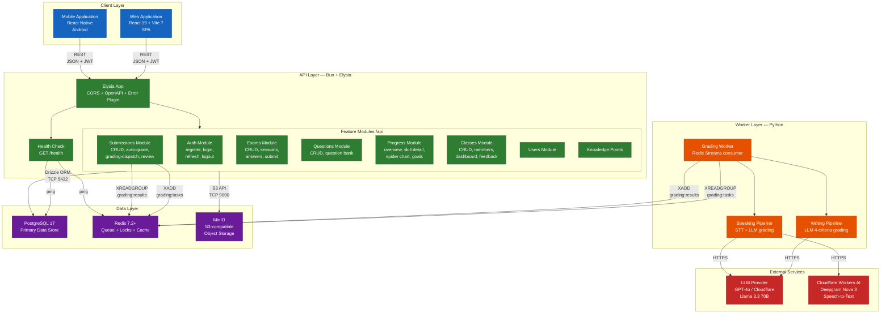

### 1.3 Biểu Đồ Triển Khai

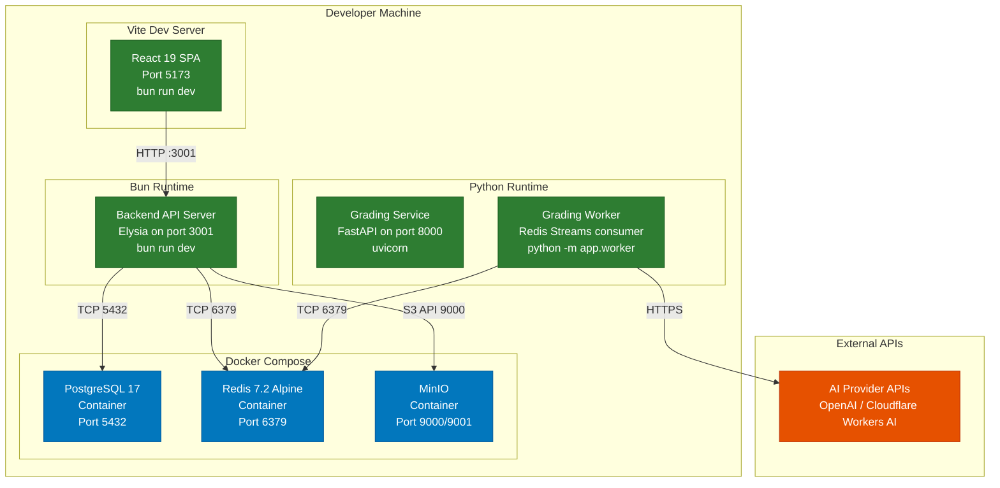

### 1.4 Công Nghệ Sử Dụng

| Tầng | Công nghệ | Phiên bản | Mục đích |
|-------|-----------|---------|---------|
| Runtime (Backend) | Bun | latest | Runtime JavaScript/TypeScript hiệu năng cao |
| Framework (Backend) | Elysia | 1.x | Framework REST API an toàn kiểu với tự động sinh OpenAPI |
| ORM | Drizzle ORM | latest | Trình xây dựng truy vấn SQL an toàn kiểu với hỗ trợ migration |
| Xác thực Schema | Zod / TypeBox | latest | Xác thực đầu vào tại biên API |
| JWT | Jose | latest | Ký, xác minh JWT và quản lý token |
| Cơ sở dữ liệu | PostgreSQL | 17 | Kho dữ liệu quan hệ chính với hỗ trợ JSONB |
| Cache / Hàng đợi | Redis | 7.2+ | Hàng đợi tác vụ (Streams XADD/XREADGROUP), khóa phân tán, caching |
| Frontend | React | 19 | Thư viện thành phần UI |
| Công cụ build | Vite | 7 | Build frontend, dev server, HMR |
| Ngôn ngữ Frontend | TypeScript | 5.x | Phát triển frontend an toàn kiểu |
| Runtime chấm điểm | Python | 3.11+ | Runtime dịch vụ chấm điểm AI |
| Framework chấm điểm | FastAPI | latest | Health check và API quản trị cho dịch vụ chấm điểm |
| Nhà cung cấp LLM | OpenAI GPT-4o + Cloudflare Llama 3.3 70B | — | Chấm điểm Writing/Speaking bằng AI qua LLM (primary + fallback) |
| Nhà cung cấp STT | Cloudflare Workers AI (Deepgram Nova 3) | — | Chuyển đổi giọng nói thành văn bản cho Speaking |
| Linting | Biome | latest | Định dạng code và thực thi lint |
| Kiểm thử (Backend) | bun:test | — | Kiểm thử đơn vị và tích hợp |
| Kiểm thử (Grading) | pytest | — | Kiểm thử đơn vị dịch vụ chấm điểm |
| Container hóa | Docker Compose | — | PostgreSQL + Redis + MinIO cho phát triển cục bộ |

---

## 2. Thiết Kế Thành Phần

### 2.1 Biểu Đồ Thành Phần Backend

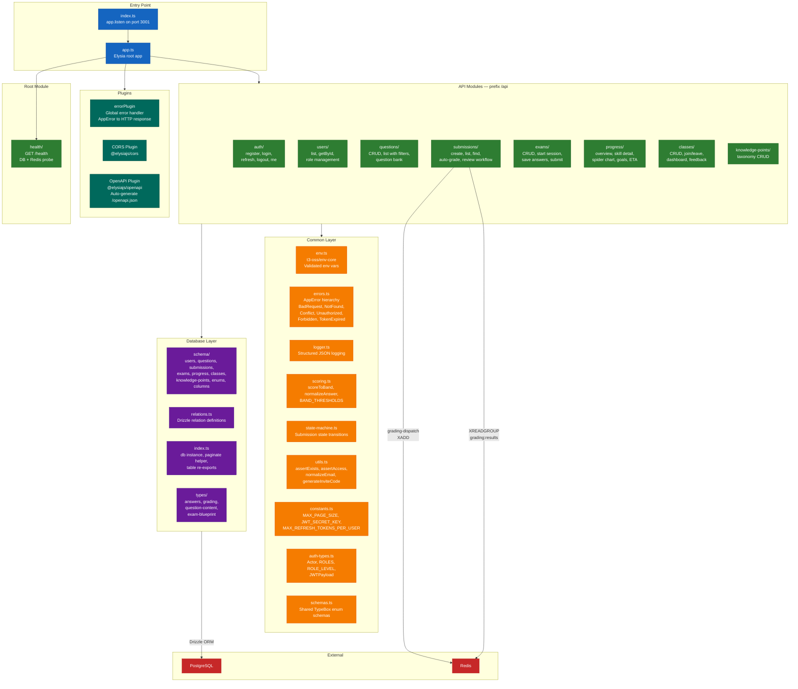

### 2.2 Biểu Đồ Thành Phần Dịch Vụ Chấm Điểm

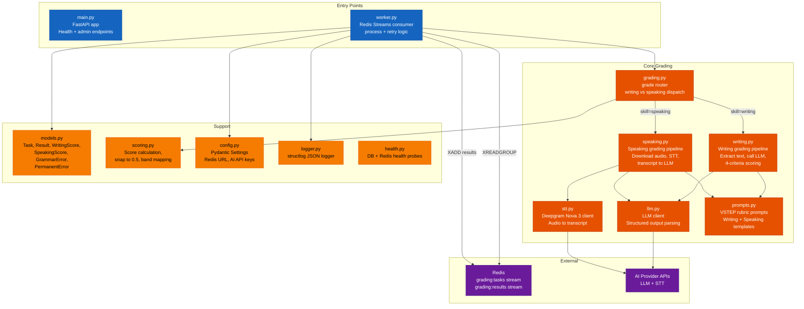

### 2.3 Cấu Trúc Thành Phần Frontend (Dự kiến)

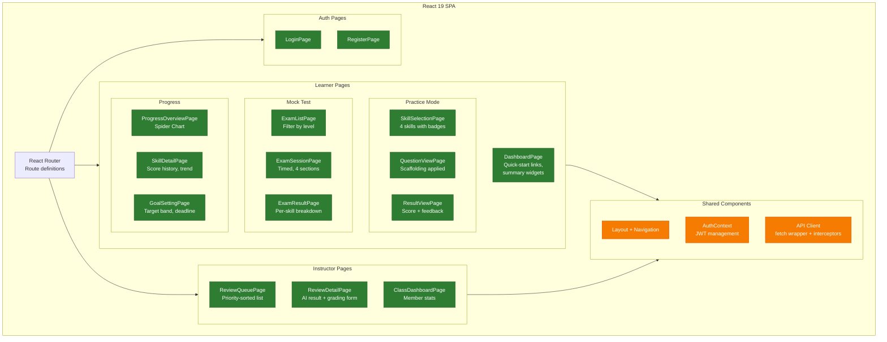

---

## 3. Thiết Kế Chi Tiết

### 3.1 Biểu Đồ Gói (Package Diagram)

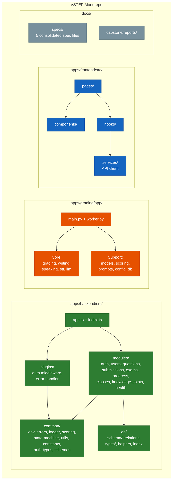

### 3.2 Biểu Đồ Tuần Tự — Xác Thực Người Dùng (Đăng Nhập)

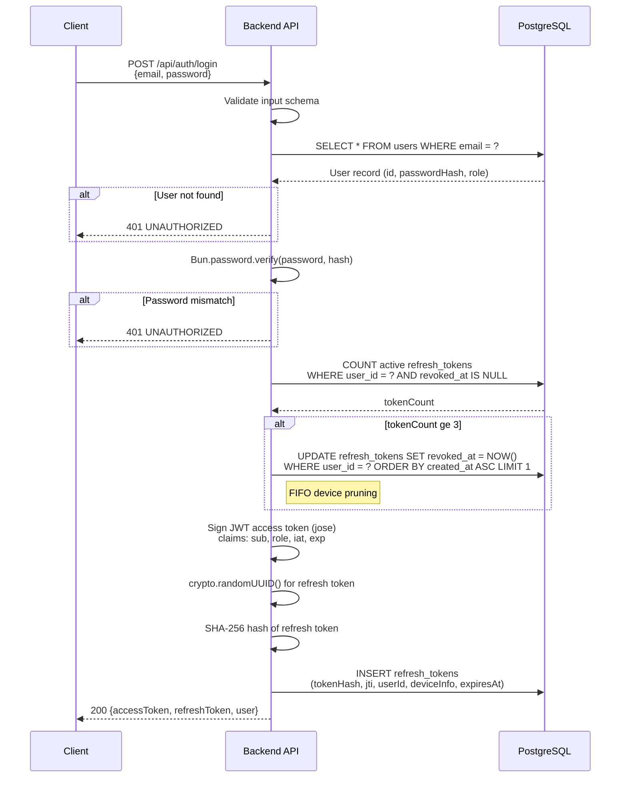

### 3.3 Biểu Đồ Tuần Tự — Nộp Bài Luyện Tập Writing (Chấm Điểm AI)

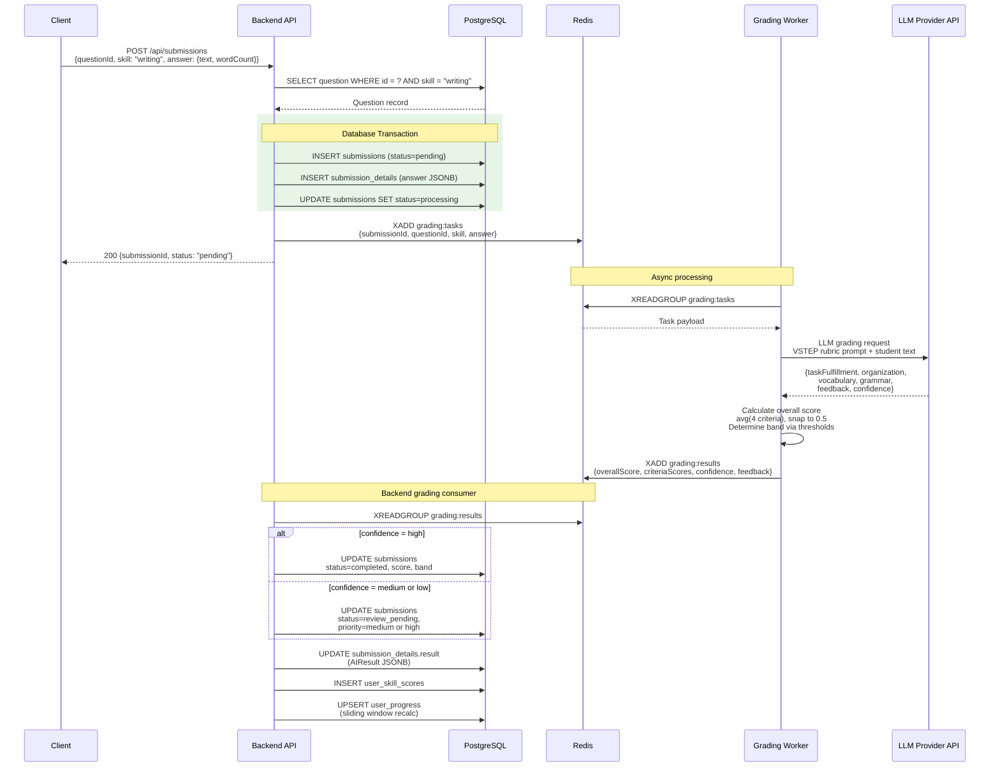

### 3.4 Biểu Đồ Tuần Tự — Luồng Phiên Thi

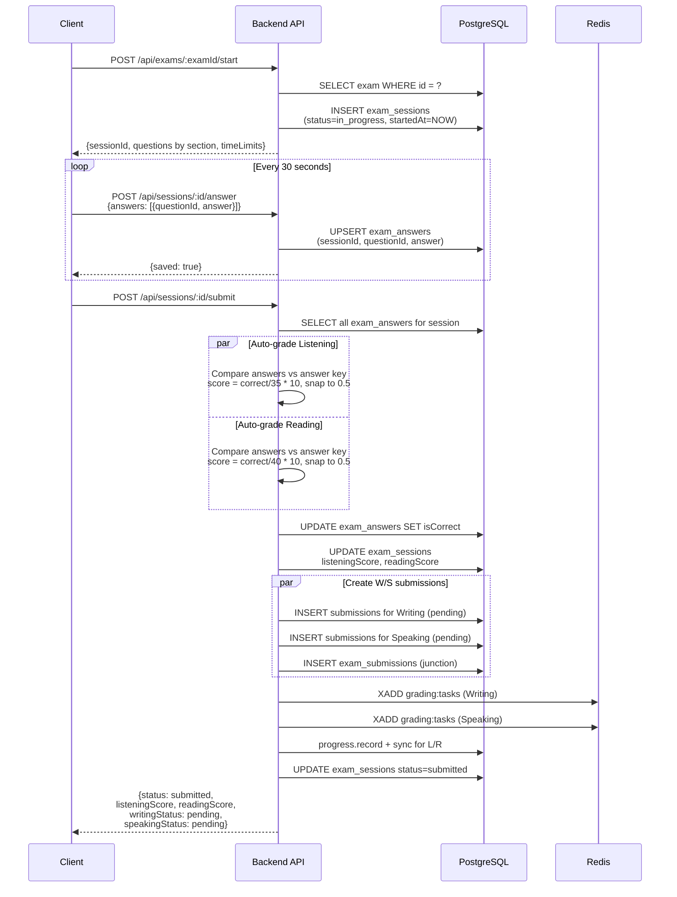

### 3.5 Biểu Đồ Tuần Tự — Quy Trình Đánh Giá Của Giảng Viên

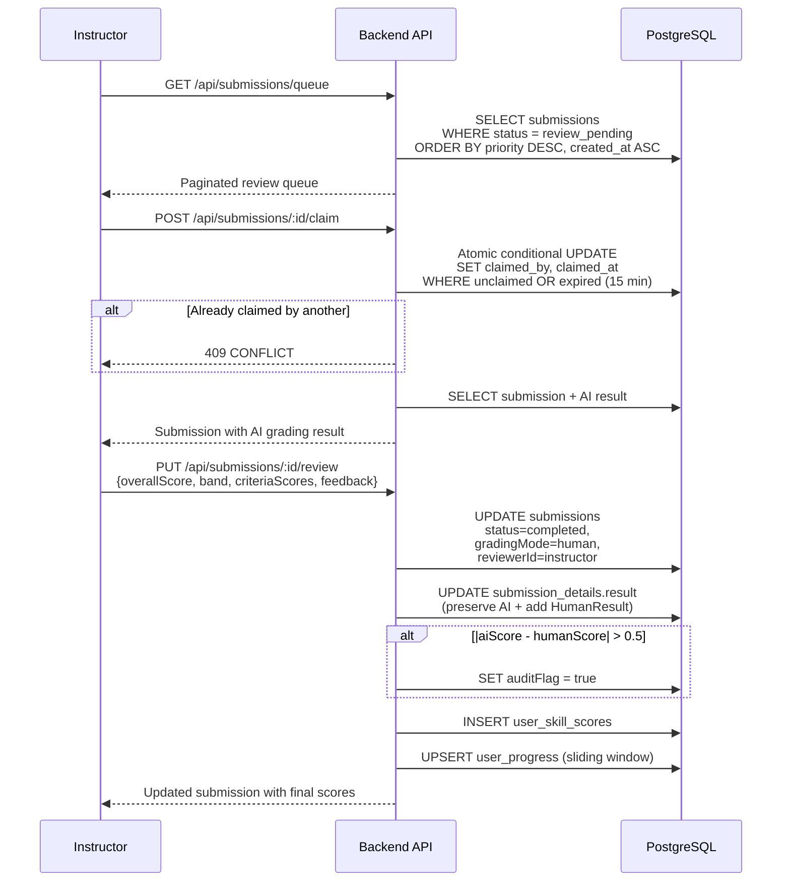

### 3.6 Biểu Đồ Tuần Tự — Làm Mới Token Với Phát Hiện Phát Lại

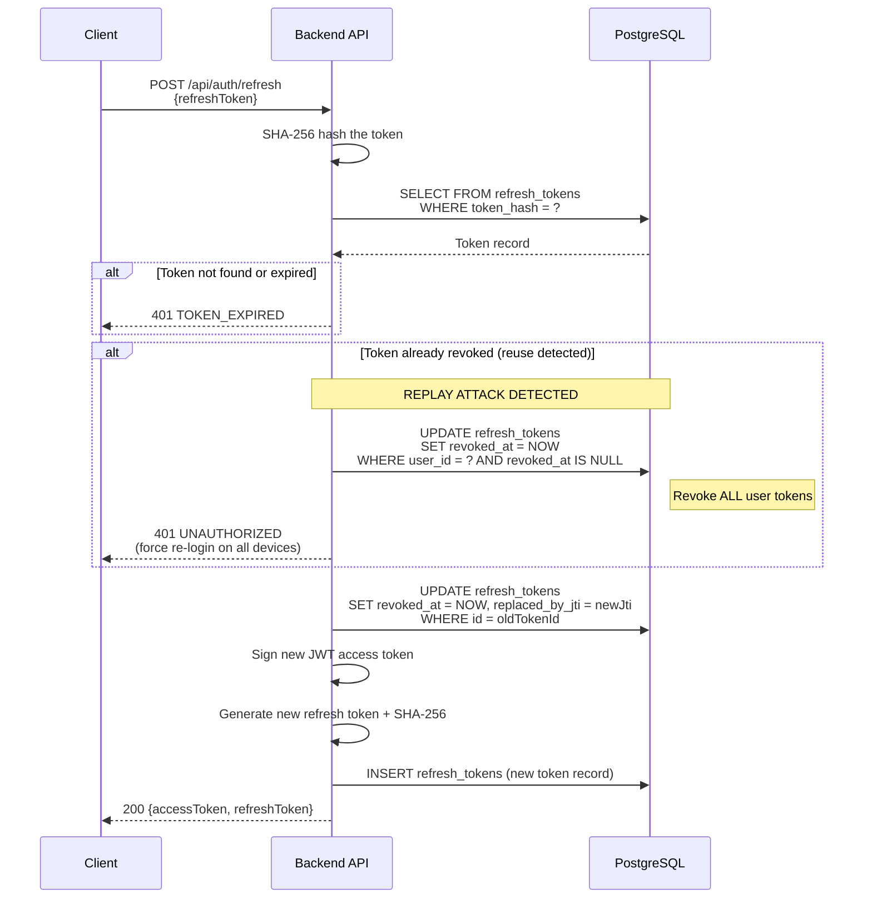

### 3.7 Biểu Đồ Tuần Tự — Theo Dõi Tiến Trình (Cửa Sổ Trượt)

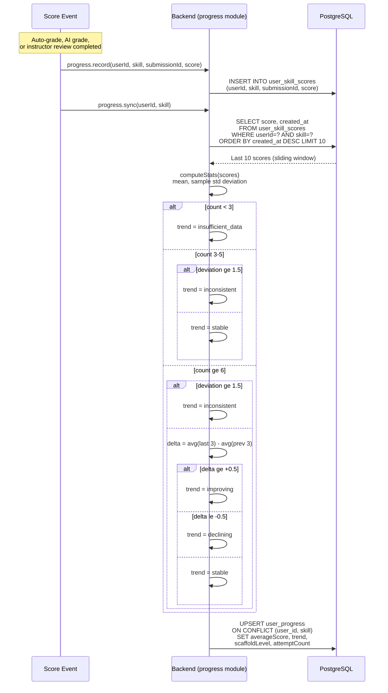

### 3.8 Máy Trạng Thái — Vòng Đời Bài Nộp

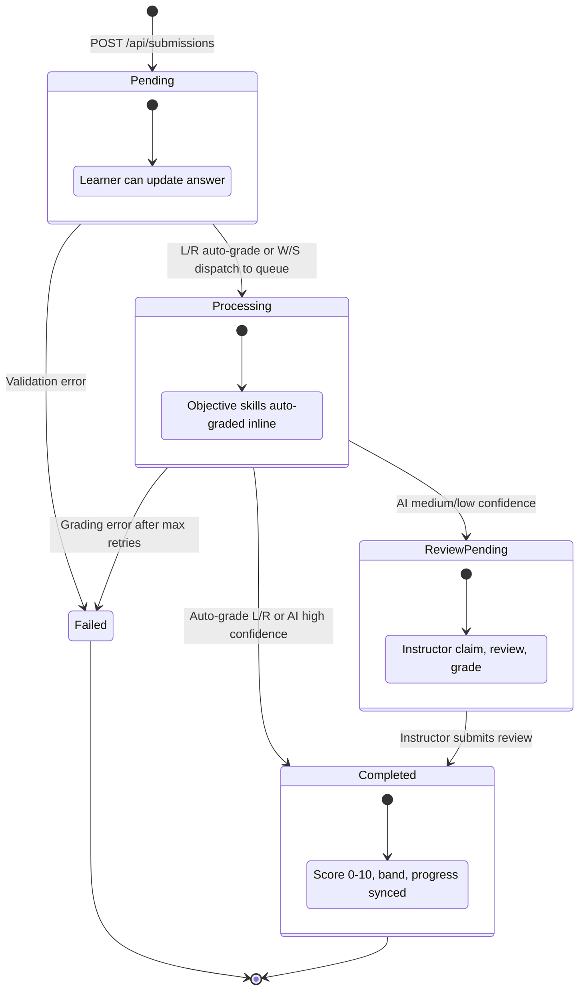

### 3.9 Máy Trạng Thái — Vòng Đời Phiên Thi

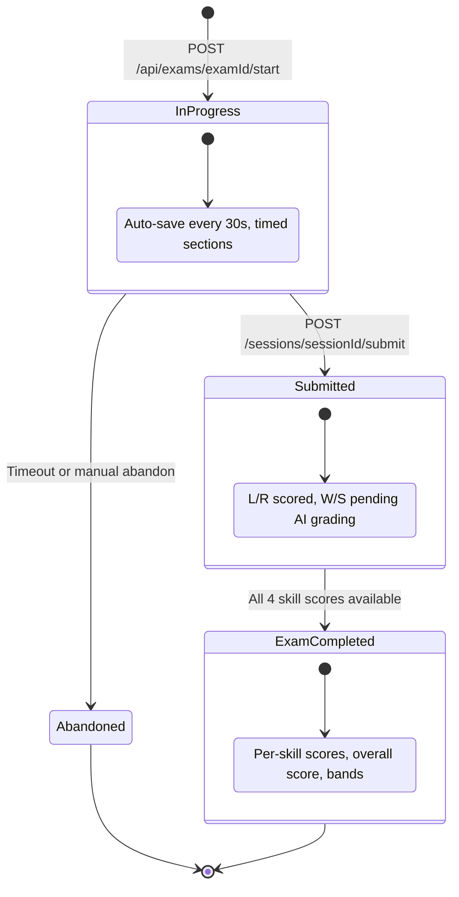

---

## 4. Thiết Kế Cơ Sở Dữ Liệu

### 4.1 ERD Vật Lý (Biểu Đồ Thực Thể - Quan Hệ)

```mermaid
erDiagram
    users ||--o{ refresh_tokens : "has sessions"
    users ||--o{ submissions : "creates"
    users ||--o{ user_progress : "tracks per skill"
    users ||--o{ user_skill_scores : "records scores"
    users ||--o{ user_goals : "sets goals"
    users ||--o{ user_knowledge_progress : "learns KPs"
    users ||--o{ exam_sessions : "takes exams"
    users ||--o{ classes : "owns as instructor"
    users ||--o{ class_members : "enrolls in"
    users ||--o{ instructor_feedback : "gives feedback"
    users ||--o{ instructor_feedback : "receives feedback"
    users ||--o{ notifications : "receives"
    users ||--o{ device_tokens : "registers devices"
    users ||--o{ user_placements : "has placements"
    users ||--o{ questions : "creates"
    users ||--o{ exams : "creates"

    questions ||--o{ submissions : "answered in"
    questions ||--o{ question_knowledge_points : "tagged with"
    questions ||--o{ exam_answers : "included in"

    knowledge_points ||--o{ question_knowledge_points : "mapped to"
    knowledge_points ||--o{ user_knowledge_progress : "tracked by"

    exams ||--o{ exam_sessions : "has sessions"
    exam_sessions ||--o{ exam_answers : "contains answers"
    exam_sessions ||--o{ exam_submissions : "produces submissions"

    submissions ||--|| submission_details : "has detail 1-to-1"
    submissions ||--o{ exam_submissions : "linked from exam"
    submissions ||--o{ user_skill_scores : "records score"

    classes ||--o{ class_members : "enrolls members"
    classes ||--o{ instructor_feedback : "contains feedback"
    vocabulary_topics ||--o{ vocabulary_words : "contains"
    vocabulary_words ||--o{ user_vocabulary_progress : "tracked by"
    users ||--o{ user_vocabulary_progress : "learns words"

    users {
        uuid id PK
        varchar email UK "unique not null"
        varchar password_hash "argon2id"
        varchar full_name "nullable"
        enum role "learner | instructor | admin"
        timestamp created_at
        timestamp updated_at
    }

    refresh_tokens {
        uuid id PK
        uuid user_id FK
        varchar token_hash "SHA-256 64 chars"
        varchar jti UK "JWT ID unique"
        varchar replaced_by_jti "rotation tracking"
        text device_info "User-Agent"
        timestamp revoked_at "nullable"
        timestamp expires_at "not null"
        timestamp created_at
    }

    questions {
        uuid id PK
        enum skill "listening | reading | writing | speaking"
        smallint part "L:1-3 R:1-4 W:1-2 S:1-3"
        jsonb content "QuestionContent 8 types"
        jsonb answer_key "ObjectiveAnswerKey nullable"
        text explanation "nullable"
        boolean is_active "soft delete"
        uuid created_by FK
        timestamp created_at
        timestamp updated_at
    }

    submissions {
        uuid id PK
        uuid user_id FK
        uuid question_id FK
        enum skill "listening | reading | writing | speaking"
        enum status "pending | processing | completed | review_pending | failed"
        numeric score "0.0-10.0 step 0.5"
        enum band "B1 | B2 | C1 nullable"
        enum review_priority "low | medium | high nullable"
        enum grading_mode "auto | human | hybrid nullable"
        uuid reviewer_id FK "nullable"
        boolean audit_flag "AI vs human diff > 0.5"
        uuid claimed_by FK "nullable"
        timestamp claimed_at "nullable"
        timestamp completed_at "nullable"
        timestamp created_at
        timestamp updated_at
    }

    submission_details {
        uuid submission_id PK "FK to submissions"
        jsonb answer "ObjectiveAnswer | WritingAnswer | SpeakingAnswer"
        jsonb result "AutoResult | AIResult | HumanResult nullable"
        varchar feedback "max 10000 chars"
        timestamp created_at
        timestamp updated_at
    }

    exams {
        uuid id PK
        varchar title "max 255 not null"
        text description "nullable"
        enum type "practice | placement | mock"
        enum skill "nullable"
        enum level "A2 | B1 | B2 | C1"
        integer duration_minutes "nullable"
        jsonb blueprint "ExamBlueprint per-skill questionIds"
        boolean is_active "default true"
        uuid created_by FK
        timestamp created_at
        timestamp updated_at
    }

    exam_sessions {
        uuid id PK
        uuid user_id FK
        uuid exam_id FK
        enum status "in_progress | submitted | completed | abandoned"
        numeric listening_score "nullable"
        numeric reading_score "nullable"
        numeric writing_score "nullable"
        numeric speaking_score "nullable"
        numeric overall_score "nullable"
        enum overall_band "B1 | B2 | C1 nullable"
        timestamp started_at "not null"
        timestamp completed_at "nullable"
        timestamp created_at
        timestamp updated_at
    }

    exam_answers {
        uuid id PK
        uuid session_id FK
        uuid question_id FK
        jsonb answer "SubmissionAnswer"
        boolean is_correct "set on submit"
        timestamp created_at
        timestamp updated_at
    }

    exam_submissions {
        uuid id PK
        uuid session_id FK
        uuid submission_id FK
        enum skill "writing | speaking"
        timestamp created_at
    }

    knowledge_points {
        uuid id PK
        enum category "grammar | vocabulary | strategy | topic"
        varchar name UK "unique max 200"
        timestamp created_at
        timestamp updated_at
    }

    question_knowledge_points {
        uuid question_id PK "FK to questions"
        uuid knowledge_point_id PK "FK to knowledge_points"
    }

    user_progress {
        uuid id PK
        uuid user_id FK
        enum skill "listening | reading | writing | speaking"
        enum current_level "A2 | B1 | B2 | C1"
        enum target_level "nullable"
        integer scaffold_level "1-5 default 1"
        integer streak_count "default 0"
        enum streak_direction "up | down | neutral"
        integer attempt_count "default 0"
        timestamp created_at
        timestamp updated_at
    }

    user_skill_scores {
        uuid id PK
        uuid user_id FK
        enum skill "listening | reading | writing | speaking"
        uuid submission_id FK "nullable"
        uuid session_id FK "nullable"
        numeric score "0.0-10.0 not null"
        varchar scaffolding_type "max 20 nullable"
        timestamp created_at
    }

    user_goals {
        uuid id PK
        uuid user_id FK
        enum target_band "B1 | B2 | C1"
        enum current_estimated_band "B1 | B2 | C1 nullable"
        timestamp deadline "nullable"
        integer daily_study_time_minutes "default 30"
        timestamp created_at
        timestamp updated_at
    }

    user_knowledge_progress {
        uuid id PK
        uuid user_id FK
        uuid knowledge_point_id FK
        numeric mastery_score "0-100 default 0"
        integer total_attempted "default 0"
        integer total_correct "default 0"
        timestamp created_at
        timestamp updated_at
    }

    classes {
        uuid id PK
        text name "not null"
        text description "nullable"
        uuid instructor_id FK "not null"
        text invite_code UK "unique not null"
        timestamp created_at
        timestamp updated_at
    }

    class_members {
        uuid id PK
        uuid class_id FK
        uuid user_id FK
        timestamp joined_at "not null"
        timestamp removed_at "nullable"
    }

    instructor_feedback {
        uuid id PK
        uuid class_id FK
        uuid from_user_id FK
        uuid to_user_id FK
        text content "not null"
        enum skill "nullable"
        uuid submission_id FK "nullable"
        timestamp created_at
    }

    vocabulary_topics {
        uuid id PK
        varchar name UK "unique max 200"
        text description "not null"
        varchar icon_key "nullable"
        integer sort_order "default 0"
        timestamp created_at
        timestamp updated_at
    }

    vocabulary_words {
        uuid id PK
        uuid topic_id FK "not null"
        varchar word "max 100 not null"
        varchar phonetic "max 100 nullable"
        varchar audio_url "max 500 nullable"
        varchar part_of_speech "max 20 not null"
        text definition "not null"
        text explanation "not null"
        jsonb examples "string array default []"
        integer sort_order "default 0"
        timestamp created_at
        timestamp updated_at
    }

    user_vocabulary_progress {
        uuid user_id PK "FK to users"
        uuid word_id PK "FK to vocabulary_words"
        boolean known "default false"
        timestamp last_reviewed_at "nullable"
        timestamp created_at
        timestamp updated_at
    }

    notifications {
        uuid id PK
        uuid user_id FK "not null"
        enum type "notification_type enum"
        varchar title "max 255 not null"
        text body "nullable"
        jsonb data "nullable"
        timestamp read_at "nullable"
        timestamp created_at
    }

    device_tokens {
        uuid id PK
        uuid user_id FK "not null"
        text token UK "unique not null"
        varchar platform "max 10 not null"
        timestamp created_at
    }
```

### 4.2 Chiến Lược Đánh Chỉ Mục

| Tên chỉ mục | Bảng | Cột | Loại | Mục đích |
|-----------|-------|-----------|------|---------|
| `users_email_unique` | users | email | Unique | Tra cứu đăng nhập O(1) theo email |
| `users_role_idx` | users | role | B-Tree | Lọc người dùng theo vai trò (danh sách admin) |
| `refresh_tokens_hash_idx` | refresh_tokens | token_hash | B-Tree | Xác minh token O(1) khi refresh |
| `refresh_tokens_jti_unique` | refresh_tokens | jti | Unique | Đảm bảo tính duy nhất của JWT ID |
| `refresh_tokens_active_idx` | refresh_tokens | user_id | Partial (revoked_at IS NULL) | Đếm thiết bị hoạt động cho FIFO pruning |
| `submissions_user_status_idx` | submissions | (user_id, status) | Composite | Lịch sử bài nộp của người dùng với bộ lọc trạng thái |
| `submissions_review_queue_idx` | submissions | status | Partial (status = 'review_pending') | Truy xuất nhanh hàng đợi đánh giá |
| `submissions_user_history_idx` | submissions | (user_id, created_at) | Composite | Lịch sử bài nộp theo thứ tự thời gian |
| `exam_sessions_user_status_idx` | exam_sessions | (user_id, status) | Composite | Lọc lịch sử thi của người dùng |
| `exams_active_idx` | exams | level | Partial (is_active = true) | Danh sách đề thi đang hoạt động theo cấp độ |
| `user_progress_user_skill_idx` | user_progress | (user_id, skill) | Unique | Một dòng tiến trình cho mỗi người dùng mỗi kỹ năng |
| `user_skill_scores_user_skill_idx` | user_skill_scores | (user_id, skill, created_at) | Composite | Truy vấn cửa sổ trượt (10 điểm gần nhất) |
| `class_members_class_user_idx` | class_members | (class_id, user_id) | Unique | Ngăn đăng ký trùng lặp |
| `exam_answers_session_question_idx` | exam_answers | (session_id, question_id) | Unique | Một câu trả lời cho mỗi câu hỏi mỗi phiên thi |
| `feedback_class_to_idx` | instructor_feedback | (class_id, to_user_id) | Composite | Tra cứu phản hồi cho người học trong lớp |
| `vocabulary_words_topic_idx` | vocabulary_words | topic_id | B-Tree | Tra cứu nhanh từ vựng theo chủ đề |
| `notifications_user_idx` | notifications | (user_id, created_at) | Composite | Dòng thời gian thông báo của người dùng |
| `notifications_unread_idx` | notifications | user_id | Partial (read_at IS NULL) | Đếm nhanh thông báo chưa đọc |
| `device_tokens_user_idx` | device_tokens | user_id | B-Tree | Tra cứu thiết bị cho thông báo đẩy |

### 4.3 Thiết Kế Schema JSONB

Hệ thống sử dụng các cột JSONB của PostgreSQL cho dữ liệu linh hoạt, đa dạng schema. Tất cả payload JSONB được xác thực tại biên ứng dụng qua TypeBox/Zod schema.

#### 4.3.1 Nội Dung Câu Hỏi (`questions.content`)

Union phân biệt theo `skill` và `part` của câu hỏi. Hỗ trợ 10 loại nội dung:

| Kỹ năng | Loại nội dung | Cấu trúc nội dung |
|-------|-----------|-------------------|
| Listening | `ListeningContent` | `{ audioUrl, transcript?, items: [{ stem, options: [A,B,C,D] }] }` |
| Listening | `ListeningDictationContent` | `{ audioUrl, transcript, transcriptWithGaps, items: [{ correctText }] }` |
| Reading | `ReadingContent` | `{ passage, title?, items: [{ stem, options: [A,B,C,D] }] }` |
| Reading | `ReadingTNGContent` | `{ passage, title?, items: [{ stem, options: [T,F,NG] }] }` (True/False/Not Given) |
| Reading | `ReadingMatchingContent` | `{ title?, paragraphs: [{ label, text }], headings: [] }` |
| Reading | `ReadingGapFillContent` | `{ title?, textWithGaps, items: [{ options: [A,B,C,D] }] }` |
| Writing | `WritingContent` | `{ prompt, taskType: "letter" \| "essay", instructions?, minWords, requiredPoints? }` |
| Speaking | `SpeakingPart1Content` | `{ topics: [{ name, questions: [3] }] }` (2 chủ đề, tương tác xã hội) |
| Speaking | `SpeakingPart2Content` | `{ situation, options: [3], preparationSeconds, speakingSeconds }` |
| Speaking | `SpeakingPart3Content` | `{ centralIdea, suggestions: [3], followUpQuestion, preparationSeconds, speakingSeconds }` |

#### 4.3.2 Câu Trả Lời Bài Nộp (`submission_details.answer`)

| Loại | Cấu trúc | Sử dụng cho |
|------|-----------|----------|
| `ObjectiveAnswer` | `{ answers: Record<string, string> }` | Listening, Reading |
| `WritingAnswer` | `{ text }` | Writing |
| `SpeakingAnswer` | `{ audioUrl, durationSeconds, transcript? }` | Speaking |

#### 4.3.3 Kết Quả Chấm Điểm (`submission_details.result`)

Union phân biệt theo trường `type`:

| Loại | Trường chính | Sử dụng khi |
|------|-----------|-----------|
| `AutoResult` | `{ type: "auto", correctCount, totalCount, score, band, gradedAt }` | Chấm tự động L/R |
| `AIResult` | `{ type: "ai", overallScore, band, criteriaScores, feedback, grammarErrors?, confidence, gradedAt }` | Chấm AI cho W/S |
| `HumanResult` | `{ type: "human", overallScore, band, criteriaScores?, feedback?, reviewerId, reviewedAt, reviewComment? }` | Đánh giá của giảng viên |

#### 4.3.4 Kế Hoạch Đề Thi (`exams.blueprint`)

```
ExamBlueprint = {
  listening?: { questionIds: string[] },
  reading?:   { questionIds: string[] },
  writing?:   { questionIds: string[] },
  speaking?:  { questionIds: string[] },
  durationMinutes?: number
}
```

### 4.4 Định Nghĩa Enum

| Tên Enum | Giá trị | Sử dụng trong |
|----------|--------|---------|
| `user_role` | `learner`, `instructor`, `admin` | `users.role` |
| `skill` | `listening`, `reading`, `writing`, `speaking` | `questions`, `submissions`, `user_progress`, `user_skill_scores`, `exam_submissions`, `instructor_feedback` |
| `question_level` | `A2`, `B1`, `B2`, `C1` | `exams.level`, `user_progress.current_level`, `user_progress.target_level` |
| `vstep_band` | `B1`, `B2`, `C1` | `submissions.band`, `user_goals.target_band`, `user_goals.current_estimated_band`, `exam_sessions.overall_band` |
| `submission_status` | `pending`, `processing`, `completed`, `review_pending`, `failed` | `submissions.status` |
| `review_priority` | `low`, `medium`, `high` | `submissions.review_priority` |
| `grading_mode` | `auto`, `human`, `hybrid` | `submissions.grading_mode` |
| `exam_status` | `in_progress`, `submitted`, `completed`, `abandoned` | `exam_sessions.status` |
| `streak_direction` | `up`, `down`, `neutral` | `user_progress.streak_direction` |
| `knowledge_point_category` | `grammar`, `vocabulary`, `strategy`, `topic` | `knowledge_points.category` |
| `notification_type` | `grading_completed`, `feedback_received`, `class_invite`, `goal_achieved`, `system` | `notifications.type` |
| `exam_type` | `practice`, `placement`, `mock` | `exams.type` |
| `exam_skill` | `listening`, `reading`, `writing`, `speaking`, `mixed` | `exams.skill` |
| `placement_status` | `completed`, `skipped` | `user_placements.status` |
| `placement_source` | `self_assess`, `placement`, `skipped` | `user_placements.source` |
| `placement_confidence` | `high`, `medium`, `low` | `user_placements.confidence` |

---

## 5. Thiết Kế Giao Diện

### 5.1 Kiến Trúc API

| Khía cạnh | Đặc tả |
|--------|---------------|
| URL gốc | Tiền tố `/api` cho tất cả endpoint chức năng; `/health` ở cấp root |
| Xác thực | JWT Bearer token trong header `Authorization`. Access token (ngắn hạn) + Refresh token (dài hạn, có rotation). |
| Phân trang | Dựa trên offset: `page` (tối thiểu 1), `limit` (1–100, mặc định 20) |
| Phản hồi danh sách | `{ data: [...], meta: { page, limit, total, totalPages } }` |
| Phản hồi lỗi | `{ error: { code, message, requestId, details? } }` |
| Request ID | Header `X-Request-Id` trên tất cả phản hồi (tự sinh hoặc echo lại) |
| Tính idempotent | Header `Idempotency-Key` trên các endpoint `POST` có tác dụng phụ |
| Dấu thời gian | Định dạng ISO 8601 UTC (ví dụ: `2026-03-02T12:00:00.000Z`) |
| Loại nội dung | `application/json` (UTF-8) |
| OpenAPI | Spec tự sinh tại `GET /openapi.json` |

### 5.2 Danh Mục Endpoint API

#### 5.2.1 Health

| Phương thức | Đường dẫn | Xác thực | Mô tả |
|--------|------|------|-------------|
| GET | `/health` | Không | Kiểm tra sức khỏe — thăm dò kết nối PostgreSQL và Redis |

#### 5.2.2 Auth

| Phương thức | Đường dẫn | Xác thực | Mô tả |
|--------|------|------|-------------|
| POST | `/api/auth/register` | Không | Đăng ký người dùng mới (email, password, fullName). Vai trò mặc định là `learner`. |
| POST | `/api/auth/login` | Không | Xác thực bằng email + mật khẩu. Trả về cặp JWT + hồ sơ người dùng. |
| POST | `/api/auth/refresh` | Không | Rotation refresh token. Phát hiện phát lại sẽ thu hồi toàn bộ. |
| POST | `/api/auth/logout` | Có | Thu hồi refresh token hiện tại. |
| GET | `/api/auth/me` | Có | Trả về hồ sơ người dùng hiện tại từ claims của access token. |

#### 5.2.3 Users

| Phương thức | Đường dẫn | Xác thực | Mô tả |
|--------|------|------|-------------|
| GET | `/api/users` | Admin | Danh sách người dùng phân trang với bộ lọc (vai trò, tìm kiếm). |
| GET | `/api/users/:id` | Admin | Lấy thông tin người dùng theo ID. |
| PUT | `/api/users/:id/role` | Admin | Thay đổi vai trò người dùng (learner/instructor/admin). |

#### 5.2.4 Questions

| Phương thức | Đường dẫn | Xác thực | Mô tả |
|--------|------|------|-------------|
| GET | `/api/questions` | Learner+ | Danh sách câu hỏi với bộ lọc (kỹ năng, cấp độ, định dạng, is_active). |
| GET | `/api/questions/:id` | Learner+ | Chi tiết câu hỏi (nội dung, answer_key cho giảng viên). |
| POST | `/api/questions` | Instructor+ | Tạo câu hỏi (skill, part, content JSONB, answer_key). |
| PUT | `/api/questions/:id` | Instructor+ | Cập nhật nội dung câu hỏi. |
| DELETE | `/api/questions/:id` | Admin | Xóa mềm — đặt `is_active = false`. |

#### 5.2.5 Submissions

| Phương thức | Đường dẫn | Xác thực | Mô tả |
|--------|------|------|-------------|
| POST | `/api/submissions` | Learner+ | Tạo bài nộp. L/R chấm tự động ngay; W/S đẩy vào Redis. |
| GET | `/api/submissions` | Learner+ | Danh sách bài nộp của mình (Admin xem tất cả). Bộ lọc: kỹ năng, trạng thái. |
| GET | `/api/submissions/:id` | Learner+ | Chi tiết bài nộp với câu trả lời, kết quả, phản hồi. |
| POST | `/api/submissions/:id/auto-grade` | System | Kích hoạt chấm tự động cho bài nộp trắc nghiệm (L/R). |
| GET | `/api/submissions/queue` | Instructor+ | Hàng đợi đánh giá — `review_pending` sắp xếp theo ưu tiên rồi FIFO. |
| POST | `/api/submissions/:id/claim` | Instructor+ | Nhận bài nộp để đánh giá độc quyền (khóa Redis, TTL 15 phút). |
| POST | `/api/submissions/:id/release` | Instructor+ | Trả bài nộp đã nhận về hàng đợi. |
| PUT | `/api/submissions/:id/review` | Instructor+ | Nộp đánh giá của giảng viên (điểm, band, tiêu chí, phản hồi). |

#### 5.2.6 Exams

| Phương thức | Đường dẫn | Xác thực | Mô tả |
|--------|------|------|-------------|
| GET | `/api/exams` | Learner+ | Danh sách đề thi đang hoạt động với bộ lọc cấp độ tùy chọn. |
| GET | `/api/exams/:id` | Learner+ | Chi tiết đề thi (xem trước blueprint, thông tin phần thi). |
| POST | `/api/exams` | Instructor+ | Tạo đề thi với cấp độ và blueprint. |
| POST | `/api/exams/:id/start` | Learner+ | Bắt đầu phiên thi có giới hạn thời gian. |
| POST | `/api/sessions/:id/answer` | Learner+ | Upsert câu trả lời thi (tự động lưu mỗi 30 giây). |
| POST | `/api/sessions/:id/submit` | Learner+ | Nộp bài thi — chấm L/R, đẩy W/S vào hàng đợi. |
| GET | `/api/sessions/:id` | Learner+ | Lấy kết quả phiên thi (điểm, trạng thái). |

#### 5.2.7 Progress

| Phương thức | Đường dẫn | Xác thực | Mô tả |
|--------|------|------|-------------|
| GET | `/api/progress` | Learner+ | Tổng quan tiến trình — tóm tắt cả 4 kỹ năng. |
| GET | `/api/progress/:skill` | Learner+ | Chi tiết kỹ năng — 10 điểm gần nhất, xu hướng, ETA. |
| GET | `/api/progress/spider-chart` | Learner+ | Dữ liệu biểu đồ radar — hiện tại + xu hướng theo từng kỹ năng. |
| GET | `/api/progress/goals` | Learner+ | Lấy mục tiêu học tập của người dùng. |
| POST | `/api/progress/goals` | Learner+ | Tạo mục tiêu (band mục tiêu, thời hạn, thời gian học hàng ngày). |
| PUT | `/api/progress/goals/:id` | Learner+ | Cập nhật tham số mục tiêu. |

#### 5.2.8 Classes

| Phương thức | Đường dẫn | Xác thực | Mô tả |
|--------|------|------|-------------|
| GET | `/api/classes` | Learner+ | Danh sách lớp của mình (đã tham gia + sở hữu). |
| POST | `/api/classes` | Instructor+ | Tạo lớp học với mã mời tự động sinh. |
| POST | `/api/classes/join` | Learner+ | Tham gia lớp bằng mã mời. |
| POST | `/api/classes/:id/leave` | Learner+ | Rời khỏi lớp học. |
| GET | `/api/classes/:id` | Instructor+ | Bảng điều khiển lớp — thống kê thành viên, trung bình. |
| GET | `/api/classes/:id/members` | Instructor+ | Danh sách thành viên lớp với tiến trình. |
| POST | `/api/classes/:id/feedback` | Instructor+ | Gửi phản hồi cho người học. |
| GET | `/api/classes/:id/feedback` | Learner+ | Xem phản hồi nhận được trong lớp. |
| POST | `/api/classes/:id/rotate-code` | Instructor+ | Đổi mã mời. |
| DELETE | `/api/classes/:id/members/:userId` | Instructor+ | Xóa thành viên khỏi lớp. |

#### 5.2.9 Knowledge Points

| Phương thức | Đường dẫn | Xác thực | Mô tả |
|--------|------|------|-------------|
| GET | `/api/knowledge-points` | Learner+ | Danh sách điểm kiến thức với bộ lọc danh mục tùy chọn. |
| POST | `/api/knowledge-points` | Admin | Tạo điểm kiến thức. |
| PUT | `/api/knowledge-points/:id` | Admin | Cập nhật điểm kiến thức. |
| DELETE | `/api/knowledge-points/:id` | Admin | Xóa điểm kiến thức. |

---

## 6. Mẫu Thiết Kế Và Nguyên Tắc

### 6.1 Các Mẫu Được Sử Dụng

| Mẫu | Áp dụng tại | Mô tả |
|---------|--------------|-------------|
| **Repository Pattern** | `db/index.ts`, module `service.ts` | Truy cập dữ liệu được trừu tượng hóa thông qua truy vấn Drizzle ORM. Các module gọi `db.query.*` hoặc `db.select().from()` — không bao giờ dùng raw SQL. |
| **State Machine** | `common/state-machine.ts`, `submissions/shared.ts` | Vòng đời bài nộp được thực thi qua bản đồ chuyển trạng thái tường minh. Chuyển trạng thái không hợp lệ sẽ throw `ConflictError`. |
| **Discriminated Union** | `db/types/grading.ts`, `db/types/answers.ts` | Các payload JSONB sử dụng trường `type` để phân biệt biến thể (AutoResult vs AIResult vs HumanResult). TypeBox schema xác thực tại biên. |
| **Plugin Architecture** | `plugins/error.ts`, `plugins/auth.ts` | Các mối quan tâm xuyên suốt (xử lý lỗi, middleware xác thực) được triển khai dưới dạng plugin Elysia gắn vào ứng dụng. |
| **Producer-Consumer Stream** | `grading-dispatch.ts` (producer), `worker.py` (consumer) | Tách rời việc tạo bài nộp khỏi chấm điểm AI. Redis Streams với consumer group cho việc dispatch và tiêu thụ kết quả đáng tin cậy. |
| **Sliding Window** | `progress/trends.ts`, `progress/service.ts` | Chỉ số tiến trình được tính trên N=10 điểm gần nhất mỗi kỹ năng. Truy vấn có giới hạn, hiệu năng dự đoán được. |
| **Prepare-then-Dispatch** | `grading-dispatch.ts` | Trạng thái cơ sở dữ liệu được cập nhật trong transaction (`prepare`), đẩy Redis xảy ra sau commit (`dispatch`). Ngăn tin nhắn mồ côi trong hàng đợi. |
| **Guard-Compute-Write** | Tất cả file `service.ts` của module | Cấu trúc hàm: xác thực điều kiện tiên quyết (guard) → tính toán kết quả → lưu vào DB (write). Không xen kẽ đọc và ghi. |
| **Shared-DB** | Backend + Grading Worker | Backend kết nối trực tiếp tới PostgreSQL. Worker chỉ giao tiếp qua Redis Streams — backend consumer xử lý tất cả việc ghi DB cho kết quả chấm điểm. |
| **Partial Index** | Schema cơ sở dữ liệu | Chỉ mục partial của PostgreSQL (ví dụ: `WHERE status = 'review_pending'`, `WHERE is_active = true`) tối ưu hóa đường truy vấn nóng. |

### 6.2 Chiến Lược Xử Lý Lỗi

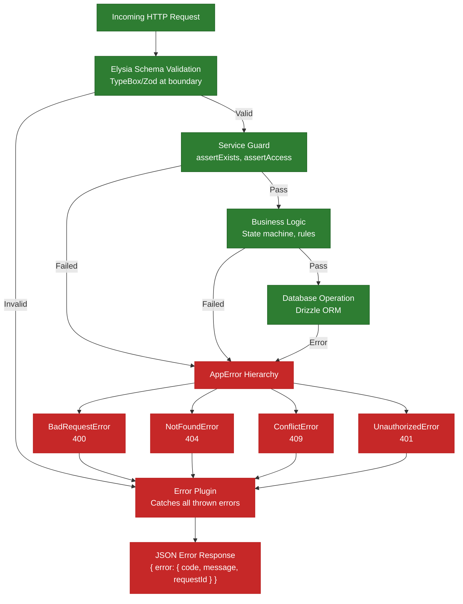

### 6.3 Thiết Kế Bảo Mật

| Mối quan tâm | Triển khai |
|---------|---------------|
| **Lưu trữ mật khẩu** | Argon2id qua `Bun.password.hash()` — không lưu trữ dạng plaintext |
| **Lưu trữ token** | Refresh token lưu dưới dạng SHA-256 hash — không bao giờ lưu plaintext trong DB |
| **Vòng đời token** | Access token ngắn hạn + refresh token dài hạn với rotation. Phát hiện tái sử dụng sẽ thu hồi toàn bộ. |
| **Giới hạn thiết bị** | Tối đa 3 refresh token hoạt động mỗi người dùng. FIFO — token cũ nhất bị thu hồi khi tạo token thứ 4. |
| **RBAC** | Ba vai trò: `learner`, `instructor` (kế thừa learner), `admin` (kế thừa tất cả). Thực thi trên mọi endpoint qua auth plugin. |
| **Kiểm soát truy cập cấp hàng** | Người dùng không phải admin chỉ có thể truy cập bài nộp, tiến trình và phiên thi của chính mình. Thực thi trong tầng service qua `assertAccess`. |
| **Xác thực đầu vào** | Tất cả đầu vào được xác thực tại biên API qua TypeBox schema. Code nội bộ mặc định dữ liệu hợp lệ. |
| **Không lưu bí mật trong code** | Biến môi trường qua file `.env` (git-ignored). Xác thực khi khởi động qua `t3-oss/env-core`. |
| **Tương quan yêu cầu** | Header `X-Request-Id` trên tất cả phản hồi cho chuỗi kiểm toán. |
| **Nhận bài đánh giá** | Sử dụng atomic conditional UPDATE trong PostgreSQL với cửa sổ hết hạn 15 phút để ngăn đánh giá đồng thời cùng một bài nộp. |

---

## 8. Tổng Hợp Sản Phẩm & Công Nghệ

### 8.1 Dịch Vụ Bên Thứ Ba

| Dịch vụ | Nhà cung cấp | Mục đích | Tích hợp |
|---------|----------|---------|-------------|
| Chấm điểm LLM | OpenAI (GPT-4o) + Cloudflare (Llama 3.3 70B) | Đánh giá Writing/Speaking bằng AI theo rubric VSTEP | HTTPS REST qua httpx + Cloudflare SDK |
| Chuyển giọng nói thành văn bản | Cloudflare Workers AI (Deepgram Nova 3) | Phiên âm audio cho bài nộp Speaking | HTTPS REST qua httpx |
| Lưu trữ đối tượng | MinIO (tương thích S3) | Lưu trữ file audio (bản ghi Speaking), avatar người dùng | S3 API qua Bun S3Client |
| Xác thực | Tự triển khai (JWT) | Cặp access/refresh token với rotation, phát hiện tái sử dụng | Thư viện Jose (HS256) |
| Băm mật khẩu | Bun tích hợp sẵn | Băm mật khẩu Argon2id | Bun.password API |

### 8.2 Công Nghệ Phát Triển

| Tầng | Công nghệ | Phiên bản | Ngôn ngữ | Mục đích |
|-------|-----------|---------|----------|---------|
| **Frontend** | React | 19 | TypeScript | Thư viện thành phần UI (SPA) |
| | Vite | 7 | — | Công cụ build, dev server, HMR |
| | TanStack Router | latest | TypeScript | Routing dựa trên file với an toàn kiểu |
| | TanStack Query | latest | TypeScript | Quản lý trạng thái server, caching |
| | Tailwind CSS | 4 | — | Framework CSS tiện ích |
| | shadcn/ui | — | TypeScript | Thành phần UI cơ bản |
| | Recharts | latest | TypeScript | Biểu đồ (Spider Chart, Activity Heatmap) |
| **Backend** | Bun | latest | TypeScript | Runtime JS/TS hiệu năng cao |
| | Elysia | 1.x | TypeScript | Framework REST API an toàn kiểu với OpenAPI |
| | Drizzle ORM | latest | TypeScript | Trình xây dựng truy vấn SQL an toàn kiểu với migration |
| | Jose | latest | TypeScript | Ký và xác minh JWT |
| | TypeBox / Zod | latest | TypeScript | Xác thực schema tại biên API |
| **Mobile** | React Native | latest | TypeScript | Đa nền tảng di động (ưu tiên Android) |
| **AI/Chấm điểm** | Python | 3.11+ | Python | Runtime dịch vụ chấm điểm |
| | FastAPI | latest | Python | Health check và API quản trị |
| | httpx + Cloudflare SDK | latest | Python | HTTP client cho AI provider APIs |
| | Redis (Streams) | — | — | Consumer hàng đợi tác vụ |
| **Cơ sở dữ liệu** | PostgreSQL | 17 | SQL | Kho dữ liệu quan hệ chính (JSONB) |
| | Redis | 7.2+ | — | Hàng đợi, cache, khóa phân tán |
| **Linting** | Biome | latest | — | Định dạng code và thực thi lint |
| **Kiểm thử** | bun:test | — | TypeScript | Kiểm thử đơn vị + tích hợp Backend |
| | pytest | — | Python | Kiểm thử dịch vụ chấm điểm |

### 8.3 Quản Lý Mã Nguồn & DevOps

| Công cụ | Mục đích | Chi tiết |
|------|---------|---------|
| GitHub | Lưu trữ mã nguồn | Monorepo đơn (`VSTEP/`) chứa cả 3 ứng dụng |
| Git | Quản lý phiên bản | Feature branch, review qua PR, conventional commits |
| GitHub Issues | Theo dõi tác vụ | Sprint backlog, theo dõi lỗi |
| GitHub Projects | Quản lý dự án | Bảng Kanban cho lập kế hoạch sprint |
| Docker / Docker Compose | Container hóa | Phát triển cục bộ: PostgreSQL, Redis, MinIO. Production: tất cả dịch vụ |
| Biome CI | Cổng chất lượng code | `bun run check` trên tất cả PR (lint + format) |

### 8.4 Môi Trường Triển Khai

| Môi trường | Mục đích | Hạ tầng | URL |
|-------------|---------|---------------|-----|
| **Phát triển cục bộ** | Thiết lập cho từng lập trình viên | Docker Compose (PostgreSQL, Redis, MinIO) + Bun dev server + Vite dev server | `localhost:3001` (API), `localhost:5173` (Web) |
| **Docker Compose (Đầy đủ)** | Kiểm thử tích hợp, demo | Tất cả dịch vụ container hóa: Backend, Grading, PostgreSQL, Redis, MinIO | `localhost:4000` (API), `localhost:8000` (Grading) |
| **Production** | Triển khai chính thức (dự kiến) | VM đám mây hoặc container orchestration (sẽ xác định sau capstone) | TBD |

*Ghi chú: Hạ tầng triển khai production sẽ được hoàn thiện dựa trên yêu cầu mở rộng sau giai đoạn pilot capstone.*

---

## 9. Tài Liệu Tham Khảo

| # | Tài liệu | Mô tả |
|---|----------|-------------|
| 1 | Report 1 — Giới Thiệu Dự Án | Bối cảnh dự án, hệ thống hiện có, cơ hội kinh doanh, tầm nhìn |
| 2 | Report 2 — Kế Hoạch Quản Lý Dự Án | WBS, ước lượng, sổ rủi ro, ma trận trách nhiệm |
| 3 | Report 3 — Đặc Tả Yêu Cầu Phần Mềm | Yêu cầu chức năng và phi chức năng, use case, ERD, biểu đồ hoạt động |
| 4 | `apps/backend/src/` | Mã nguồn Backend — Bun + Elysia + Drizzle ORM |
| 5 | `apps/grading/app/` | Mã nguồn dịch vụ chấm điểm — Python + FastAPI + Redis worker |
| 6 | `apps/backend/drizzle/` | Database migration (Drizzle Kit) |
| 7 | `docs/specs/` | Đặc tả kỹ thuật (5 file tổng hợp bao gồm architecture, domain, API contracts, database, README) |

---

*Phiên bản tài liệu: 1.0 — Cập nhật lần cuối: SP26SE145*
