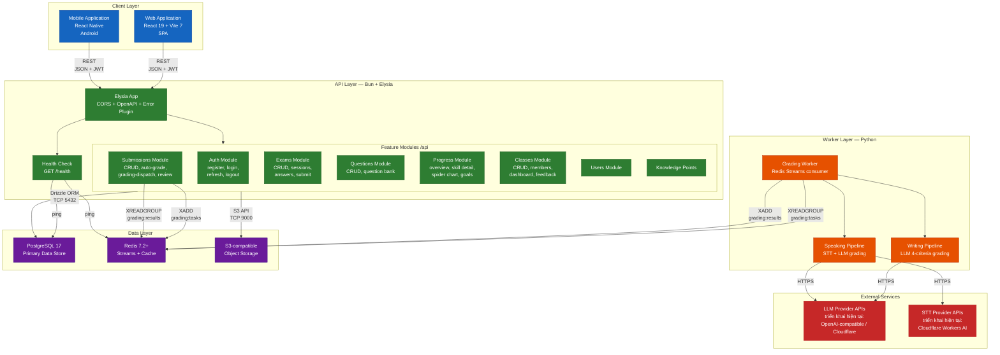
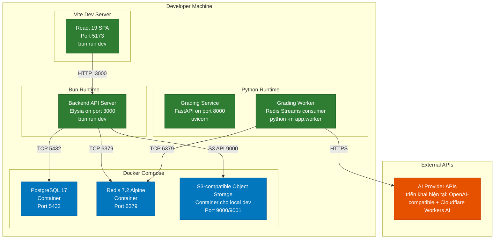
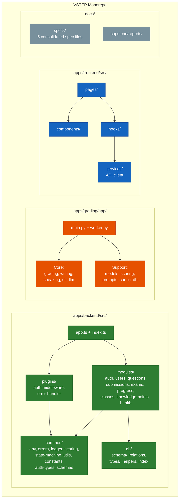
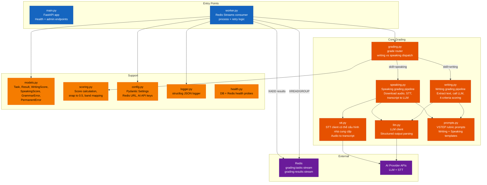
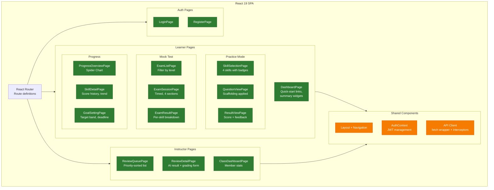
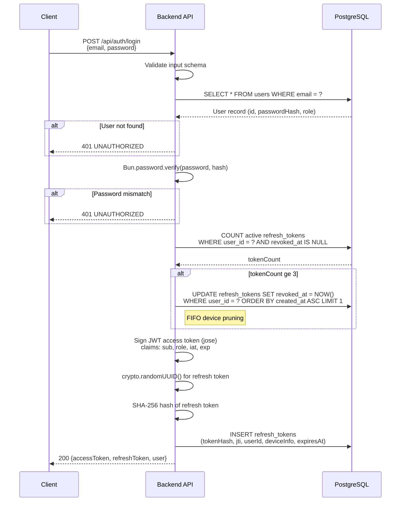
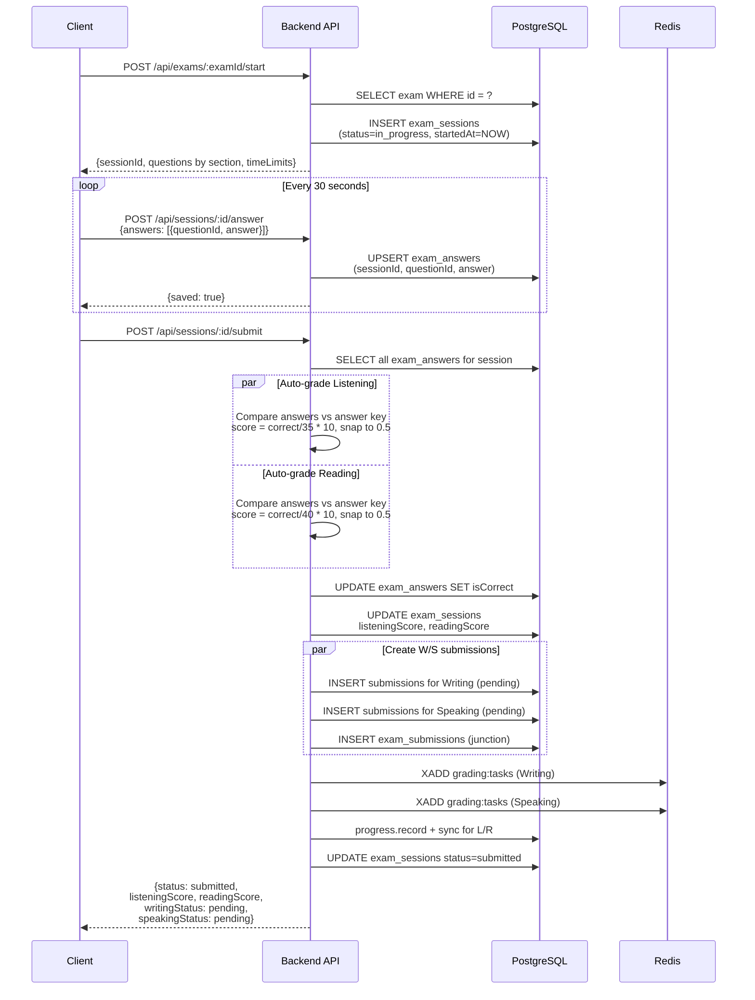
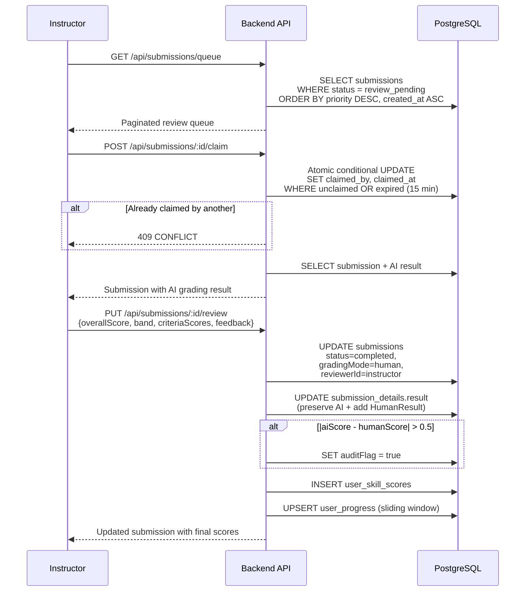
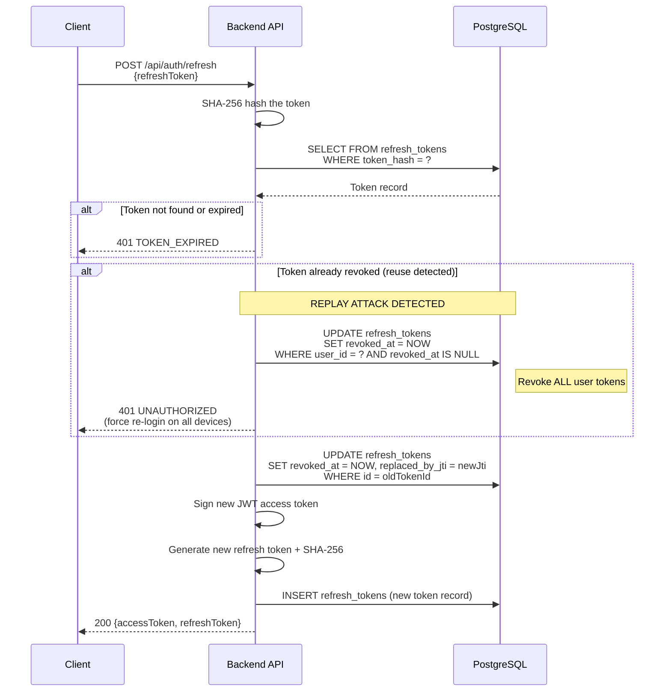
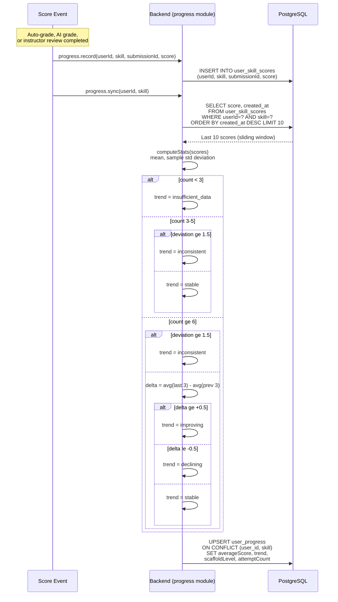

# I. Lịch Sử Thay Đổi

*A — Thêm mới · M — Chỉnh sửa · D — Xóa

| Ngày | A/M/D | Người phụ trách | Mô tả thay đổi |
|------|-------|-----------|-------------------|
| 02/03/2026 | A | Nghĩa (Trưởng nhóm) | SDD ban đầu — thiết kế kiến trúc, biểu đồ thành phần, biểu đồ tuần tự, thiết kế cơ sở dữ liệu, thiết kế giao diện |

---
# II. Tài Liệu Thiết Kế Phần Mềm

## 1. Thiết Kế Hệ Thống

### 1.1 Kiến Trúc Hệ Thống

Hệ thống Luyện thi VSTEP Thích ứng tuân theo kiến trúc **monorepo dạng module** với ba ứng dụng triển khai độc lập dùng chung một Git repository:

| Ứng dụng | Runtime | Vai trò |
|-------------|---------|------|
| **Backend** (API chính) | Bun + Elysia | Máy chủ REST API xử lý tất cả yêu cầu từ client, xác thực, logic nghiệp vụ, và chấm điểm tự động cho các kỹ năng trắc nghiệm |
| **Grading** (Worker AI) | Python + FastAPI | Worker bất đồng bộ tiêu thụ tác vụ từ Redis Streams cho việc chấm Writing/Speaking bằng AI thông qua LLM và STT |
| **Frontend** (Web SPA) | React 19 + Vite 7 | Ứng dụng trang đơn phục vụ giao diện cho người học, giảng viên và quản trị viên |

**Các quyết định kiến trúc chính:**

- **Mô hình Shared-DB**: Backend kết nối tới PostgreSQL qua Drizzle ORM. Grading Worker chỉ giao tiếp qua Redis Streams — không kết nối trực tiếp tới PostgreSQL. Backend grading consumer đọc kết quả từ stream `grading:results` và thực hiện tất cả các thao tác ghi DB.
- **Redis Streams**: Redis Streams với `XADD`/`XREADGROUP` và consumer group cho việc dispatch tác vụ và tiêu thụ kết quả đáng tin cậy.
- **JWT Auth**: Cặp access/refresh token với rotation và phát hiện tái sử dụng.
- **Parse, Don't Validate**: Tất cả đầu vào được xác thực tại biên API qua Zod/TypeBox schema. Code nội bộ mặc định dữ liệu hợp lệ.
- **Throw, Don't Return**: Tất cả ứng dụng sử dụng hệ thống phân cấp lỗi có kiểu. Lỗi được throw, không bao giờ trả về dưới dạng giá trị.

### 1.2 Biểu Đồ Gói (Package Diagram)

| # | Gói | Mô tả |
|---|-----|-------|
| 1 | `apps/backend/src/common/` | Tiện ích dùng chung: biến môi trường (`env.ts`), phân cấp lỗi (`errors.ts`), logging JSON (`logger.ts`), tính điểm và band (`scoring.ts`), máy trạng thái bài nộp, hàm tiện ích (`assertExists`, `assertAccess`), hằng số, kiểu xác thực và schema dùng chung |
| 2 | `apps/backend/src/db/` | Tầng cơ sở dữ liệu: định nghĩa schema Drizzle ORM cho tất cả bảng, quan hệ giữa các bảng, kiểu TypeBox cho cột JSONB (câu trả lời, kết quả chấm điểm, nội dung câu hỏi, blueprint đề thi), instance kết nối DB và helper phân trang |
| 3 | `apps/backend/src/modules/` | Các module chức năng theo nghiệp vụ: auth (đăng ký, đăng nhập, refresh, logout), users, questions (ngân hàng câu hỏi), submissions (CRUD, chấm tự động, dispatch chấm AI, quy trình đánh giá), exams (CRUD, phiên thi, nộp bài), progress (tổng quan, chi tiết kỹ năng, biểu đồ radar, mục tiêu), classes (CRUD, thành viên, dashboard, phản hồi), knowledge-points, health |
| 4 | `apps/backend/src/plugins/` | Plugin Elysia xuyên suốt: middleware xác thực JWT (`auth.ts`), xử lý lỗi toàn cục (`error.ts`) chuyển AppError thành HTTP response |
| 5 | `apps/backend/src/app.ts`, `index.ts` | Điểm khởi chạy: `app.ts` tạo Elysia root app và gắn plugin + module; `index.ts` khởi động server trên port 3000 |
| 6 | `apps/grading/app/` (Core) | Pipeline chấm điểm AI: router điều phối theo skill (`grading.py`), pipeline Writing 4 tiêu chí qua LLM, pipeline Speaking (STT + LLM), client LLM và STT có thể cấu hình nhà cung cấp, prompt template theo rubric VSTEP |
| 7 | `apps/grading/app/` (Support) | Hỗ trợ dịch vụ chấm điểm: model dữ liệu (`models.py`), tính điểm và band (`scoring.py`), cấu hình Pydantic Settings, structured logging, health probe |
| 8 | `apps/grading/app/main.py`, `worker.py` | Điểm khởi chạy: `main.py` chạy FastAPI (health + admin endpoint); `worker.py` consumer Redis Streams xử lý và retry tác vụ chấm điểm |
| 9 | `apps/frontend/src/` | SPA React 19: pages (theo vai trò learner/instructor/admin), components dùng chung, hooks, services (API client với fetch wrapper + interceptors) |
| 10 | `docs/` | Tài liệu dự án: đặc tả kỹ thuật (`specs/`), báo cáo capstone (`capstone/reports/`) |

---

## 2. Thiết Kế Cơ Sở Dữ Liệu

### 2.1 ERD Khái Niệm (Conceptual ERD)

> Source: [`docs/capstone/diagrams/erd/conceptual-erd.d2`](../../diagrams/erd/conceptual-erd.d2) — render bằng `d2 --layout=elk`

### 2.2 ERD Vật Lý (Physical ERD)

> Source: [`docs/capstone/diagrams/erd/physical-erd.d2`](../../diagrams/erd/physical-erd.d2) — render bằng `d2 --layout=elk`

| # | Bảng | Mô tả |
|---|------|-------|
| 1 | `users` | Tài khoản người dùng: email, mật khẩu hash (Argon2id), vai trò (`learner`/`instructor`/`admin`), thông tin hồ sơ |
| 2 | `refresh_tokens` | Refresh token (lưu SHA-256 hash): JTI duy nhất, thông tin thiết bị, thời hạn, trạng thái thu hồi, liên kết token thay thế |
| 3 | `questions` | Ngân hàng câu hỏi: kỹ năng, cấp độ, phần thi, nội dung JSONB (discriminated union theo skill+part), đáp án JSONB |
| 4 | `submissions` | Bài nộp luyện tập: liên kết người dùng + câu hỏi, trạng thái (state machine), điểm, band, chế độ chấm, ưu tiên đánh giá |
| 5 | `submission_details` | Chi tiết bài nộp: câu trả lời JSONB (objective/writing/speaking), kết quả chấm điểm JSONB (auto/AI/human) |
| 6 | `exams` | Đề thi: loại (practice/placement/mock), cấp độ, kỹ năng, blueprint JSONB chứa danh sách questionId theo section, thời gian |
| 7 | `exam_sessions` | Phiên thi: liên kết người dùng + đề thi, trạng thái, thời gian bắt đầu/kết thúc, điểm từng kỹ năng, band tổng |
| 8 | `exam_answers` | Câu trả lời trong phiên thi: liên kết session + question, câu trả lời JSONB, kết quả đúng/sai |
| 9 | `exam_submissions` | Bảng nối phiên thi — bài nộp: liên kết exam_session với submission cho Writing/Speaking |
| 10 | `user_progress` | Tiến trình tổng hợp: một dòng mỗi (user, skill), điểm trung bình, xu hướng, cấp độ hiện tại/mục tiêu, số lần làm bài |
| 11 | `user_skill_scores` | Lịch sử điểm từng lần: liên kết user + skill + submission, điểm, dùng cho tính toán cửa sổ trượt |
| 12 | `user_goals` | Mục tiêu học tập: band mục tiêu, hạn chót, band ước lượng hiện tại, ngày đạt được |
| 13 | `user_placements` | Kết quả xếp lớp đầu vào: cấp độ từng kỹ năng, trạng thái, nguồn (tự đánh giá/placement test), độ tin cậy |
| 14 | `user_knowledge_progress` | Tiến trình knowledge point: liên kết user + knowledge_point, mức thành thạo, số lần đúng/tổng |
| 15 | `classes` | Lớp học: tên, mô tả, giảng viên, mã mời, trạng thái hoạt động |
| 16 | `class_members` | Thành viên lớp: liên kết class + user, ngày tham gia |
| 17 | `instructor_feedback` | Phản hồi giảng viên: liên kết class + giảng viên + người học, kỹ năng, nội dung phản hồi |
| 18 | `knowledge_points` | Điểm kiến thức: tên, danh mục (grammar/vocabulary/strategy/topic), mô tả |
| 19 | `question_knowledge_points` | Bảng nối câu hỏi — knowledge point |
| 20 | `notifications` | Thông báo: liên kết user, loại, tiêu đề, nội dung, trạng thái đã đọc |
| 21 | `device_tokens` | Token thiết bị: liên kết user, token cho push notification, nền tảng |
| 22 | `vocabulary_topics` | Chủ đề từ vựng: tên, mô tả, cấp độ |
| 23 | `vocabulary_words` | Từ vựng: liên kết topic, từ, nghĩa, ví dụ, phát âm |
| 24 | `user_vocabulary_progress` | Tiến trình từ vựng: liên kết user + word, mức thành thạo, lần ôn tập tiếp theo |

---
## 3. Thiết Kế Chi Tiết

### 3.1 Biểu Đồ Thành Phần

#### 3.1.1 Biểu Đồ Thành Phần Backend

#### 3.1.2 Biểu Đồ Thành Phần Dịch Vụ Chấm Điểm

#### 3.1.3 Cấu Trúc Thành Phần Frontend

### 3.2 Biểu Đồ Tuần Tự

#### 3.2.1 Xác Thực Người Dùng (Đăng Nhập)

#### 3.2.2 Nộp Bài Luyện Tập Writing

#### 3.2.3 Luồng Phiên Thi

#### 3.2.4 Quy Trình Đánh Giá Của Giảng Viên

#### 3.2.5 Làm Mới Token

#### 3.2.6 Theo Dõi Tiến Trình

---

*Phiên bản tài liệu: 1.0 — Cập nhật lần cuối: SP26SE145*
