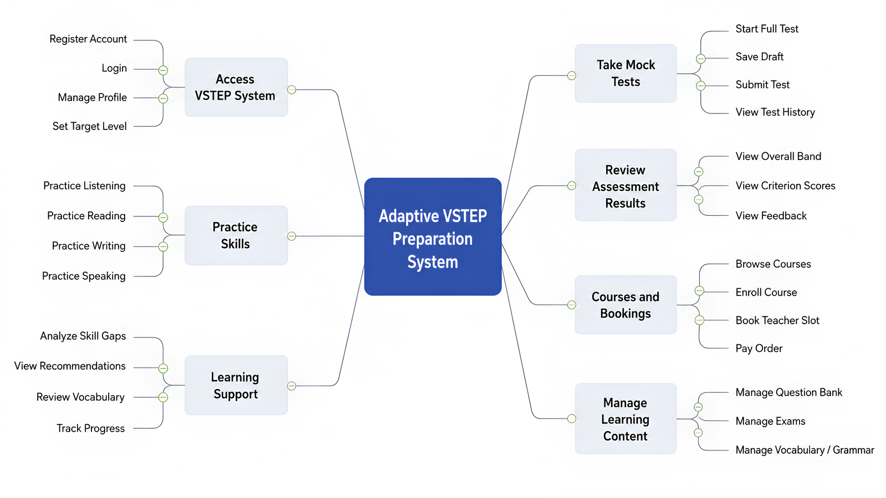

# I. Record of Changes

| Date | A/M/D | In charge | Change Description |
|------|-------|-----------|-------------------|
| 10/03/2026 | A | Hoàng Văn Anh Nghĩa | Initial version |
| 29/05/2026 | M | Hoàng Văn Anh Nghĩa | Updated project scope and limitations based on implementation review |
| 29/05/2026 | M | Hoàng Văn Anh Nghĩa | Revised Writing and Speaking assessment scope |
| 29/05/2026 | M | Hoàng Văn Anh Nghĩa | Added limitation about onboarding and baseline assessment |
| 30/05/2026 | M | Hoàng Văn Anh Nghĩa | Clarified assessment validation approach for rubric-based scoring |

*A - Added   M - Modified   D - Deleted

# II. Project Introduction

## 1. Overview

### 1.1 Project Information

- Project name: An Adaptive VSTEP Preparation System with Comprehensive Skill Assessment and Personalized Learning Support
- Project name (VN): Hệ Thống Luyện Thi VSTEP Thích Ứng Với Đánh Giá Toàn Diện Kỹ Năng Và Hỗ Trợ Học Tập Cá Nhân Hóa
- Project code: SP26SE145
- Group name: GSP26SE63
- Software type: Web Application + Mobile App
- Duration: 01/01/2026 – 30/04/2026
- Academic Supervisor: Lâm Hữu Khánh Phương
- Industry Supervisor: Trần Trọng Huỳnh

### 1.2 Project Team

| Full Name | Student ID | Role | Email |
|-----------|------------|------|-------|
| Hoàng Văn Anh Nghĩa | SE172605 | Team Leader | nghiahvase172605@fpt.edu.vn |
| Nguyễn Minh Khôi | SE172625 | Developer | khoinmse172625@fpt.edu.vn |
| Nguyễn Nhật Phát | SE172607 | Developer | phatnnse172607@fpt.edu.vn |
| Nguyễn Trần Tấn Phát | SE173198 | Developer | phatnttse173198@fpt.edu.vn |

## 2. Product Background

The Vietnamese Standardized Test of English Proficiency (VSTEP) is widely used for graduation, certification, and professional purposes in Vietnam. Learners preparing for VSTEP have different proficiency levels across listening, reading, writing, and speaking. Traditional preparation methods rely on uniform materials and fixed-level mock tests, which do not adapt to individual needs, making it hard to track progress or focus on weak skills. A level-oriented digital system with comprehensive skill assessment and personalized learning recommendations is needed to support efficient and targeted exam preparation. In the current capstone scope, adaptive learning support is implemented through skill-gap-based recommendations and spaced repetition for vocabulary review, while dynamic difficulty adjustment for all exercises is planned as future work.

Problems identified:
- Learners cannot accurately identify their proficiency level and skill gaps.
- Study materials are not personalized or adaptive.
- Progress tracking across skills is inefficient.
- Instructors lack tools for monitoring performance and giving data-driven feedback.
- Generic study plans lead to uneven skill development and suboptimal exam readiness.

## 3. Existing Systems

### 3.1 Traditional VSTEP Training Centers

Training centers offer in-person classes and static textbooks following a fixed curriculum for all students.

- Pros: Content aligns with the official exam structure; direct interaction with instructors.
- Cons: No personalization; no individual skill progress tracking; fixed schedules unsuitable for busy learners.

### 3.2 General English Learning Applications (Duolingo, ELSA)

These apps provide interactive, gamified learning experiences at low cost.

- Pros: High interactivity with gamification; easy access, low cost.
- Cons: Content not designed for VSTEP format; ELSA focuses only on pronunciation; Duolingo lacks academic writing at B2-C1 levels and does not cover all four skills.

### 3.3 VSTEP Mock Test Websites

Vietnamese platforms such as luyenthivstep.vn and vstepmaster.edu.vn offer large question banks with computer-based test simulation.

- Pros: Interface simulates computer-based testing; instant results for Listening and Reading; large question banks.
- Cons: No automated rubric-based assessment for Writing and Speaking; no personalized learning paths; scores displayed without detailed analysis.

### 3.4 AI Writing and Speaking Tools (Grammarly, Write & Improve)

These tools provide instant AI feedback for grammar and pronunciation using advanced technology.

- Pros: Instant AI feedback for grammar and pronunciation; advanced technology, good UX.
- Cons: Not based on VSTEP scoring rubric; focus on only one or two skills; no mock test functionality in VSTEP format.

### 3.5 IELTS/TOEFL Preparation Platforms (Magoosh, British Council)

Established platforms with proven adaptive learning models and complete ecosystems.

- Pros: Proven adaptive learning models; complete ecosystem.
- Cons: Format and scoring rubrics differ entirely from VSTEP; high costs (USD 100-200/year); do not serve Vietnamese certification goals.

## 4. Business Opportunity

The EdTech market in Vietnam is growing rapidly, projected to reach USD 1.1 billion in 2025 and USD 3.2 billion by 2034. The Digital English Learning segment alone is valued at USD 43 million (2025), expected to grow to USD 120.6 million by 2033. Key drivers include high Internet penetration (79.1%), household education spending at 20-24% of total expenditure (highest in ASEAN), and government digital transformation policies.

Within this landscape, the VSTEP preparation market shows a clear gap. Traditional classes and textbooks use static materials without flexible feedback. VSTEP mock test websites primarily offer MCQ question banks, leaving Writing and Speaking assessment unaddressed. International apps like Duolingo or Grammarly do not align with VSTEP structure and do not serve Vietnamese certification goals.

The proposed system differentiates through: (1) rubric-based scoring for Writing and Speaking, where AI helps extract task evidence and generate feedback, (2) adaptive learning support through skill-gap-based recommendations and spaced repetition for vocabulary review, (3) comprehensive progress visualization, and (4) controlled usage of AI services to support sustainable operation.

For assessment reliability, the scoring module is checked using two validation groups. The first group contains referenced Writing samples with independent scoring comments, used to compare the system's predicted proficiency level with a reference level. The second group contains VSTEP-style risk cases, such as off-topic, too-short, copied-prompt, repeated, or non-English responses, used to verify that abnormal submissions are not scored highly. These validation groups are separated so that benchmark results and risk-handling checks do not distort each other.

## 5. Software Product Vision

For university students who need to meet graduation requirements and working professionals who need certification for career advancement in Vietnam, who struggle with VSTEP preparation methods that lack personalization and provide slow feedback, the Adaptive VSTEP Preparation System is a web and mobile platform that provides personalized learning paths, 4-skill assessment with rapid evidence-based feedback, vocabulary review support, and visual progress tracking. Unlike static mock test websites that only offer questions and answer keys, or general English apps that do not align with VSTEP, this product combines rubric-based scoring, AI-supported evidence extraction, skill-gap recommendations, spaced repetition, and analytics to effectively close skill gaps.

## 6. Project Scope and Limitations

### 6.1 Major Features

The major features of the system are grouped around learner access, VSTEP practice, mock testing, assessment, personalized learning support, course support, administration, and learner engagement.

- FE-01: User Authentication — Register, login, and profile management for the main user roles.
- FE-02: Practice Mode — Listening — Listening exercises with audio playback, transcript support, and instant auto-grading.
- FE-03: Practice Mode — Reading — Reading exercises with MCQ format and instant auto-grading.
- FE-04: Practice Mode — Writing — Writing exercises scored by rubric-based formulas, with AI used to extract task evidence and support feedback.
- FE-05: Practice Mode — Speaking — Speaking exercises scored by rubric-based formulas using transcript, fluency, pronunciation, and content-relevance signals.
- FE-06: Mock Test Mode — Full simulated VSTEP exam across all 4 skills with session saving, timer, auto-grading for objective skills, and rubric-based scoring for Writing and Speaking.
- FE-07: AI-supported Scoring Engine — Automated support for Writing and Speaking assessment using scoring formulas, rubric parameters, language metrics, and AI-extracted evidence.
- FE-08: Progress Tracking — Dashboard for skill performance, learning activity, score trends, and level progress.
- FE-09: Learning Path — Skill gap analysis from mock exam results with personalized practice recommendations and spaced repetition support for vocabulary review.
- FE-10: Course Management — Course creation, teacher assignment, schedule management, and session booking between learners and teachers.
- FE-11: Content Management — Admin tools for question banks, exams, grammar, vocabulary, speaking practice content, and system configuration.
- FE-12: Notification System — In-app notifications for grading completion, course activities, payment events, rewards, and study reminders.
- FE-13: Exercise Feedback — Learners can submit ratings and comments on exercises and practice materials.

*Figure 1.1. Functional Decomposition Diagram*

### 6.2 Limitations and Exclusions

- LI-01: The system only supports the VSTEP format (B1–C1 levels). Other exams such as IELTS, TOEFL, and TOEIC are not supported.
- LI-02: Automated scoring for Writing and Speaking is a supplementary practice tool. Official scores require instructor verification.
- LI-03: The current capstone version supports only Vietnamese as the interface language.
- LI-04: The current capstone version supports only the selected payment flow. Additional payment gateways are excluded from the current scope.
- LI-05: Development timeline: 17 weeks (4 months), team of 4 members.
- LI-06: The system depends on external AI and speech-processing services for evidence extraction, feedback support, transcription, and pronunciation signals.
- LI-07: Reading exercises use 100% MCQ format (4 options, single correct answer), matching the official VSTEP Reading structure. Other question types (True/False/Not Given, Matching Headings, Gap Fill) are not part of the VSTEP format and are not implemented.
- LI-08: Dynamic adaptive difficulty adjustment for all exercises is not included. In the current capstone scope, adaptive learning support is implemented through skill-gap-based recommendations and spaced repetition for vocabulary review.
- LI-09: Instructor monitoring and guidance are supported. Direct assignment of individual exercises or learning modules is outside the current scope and planned for future expansion.
- LI-10: Learner progress and risk insights are rule-based in the current capstone scope. Machine-learning predictive analytics is planned as future work.
- LI-11: No separate onboarding placement test is included. Users self-select their target level, and the first mock test serves as the initial performance baseline. Ongoing assessment is collected from practice and mock test results.
- LI-12: Assessment validation in the current capstone scope demonstrates consistency on selected referenced samples and VSTEP-style risk cases. It is not a replacement for official examiner certification or large-scale psychometric validation.
