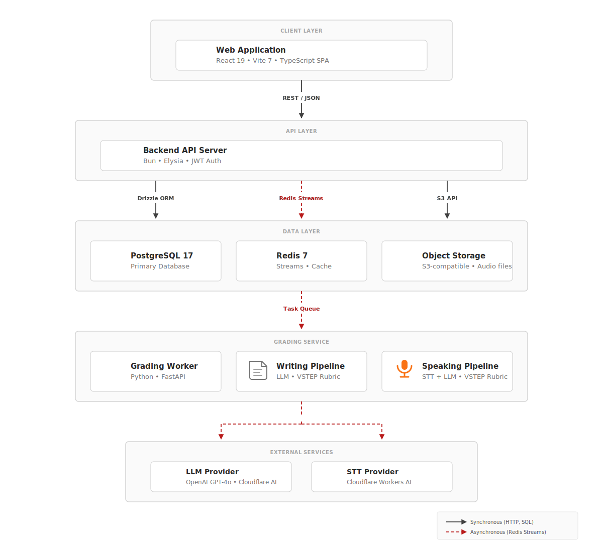
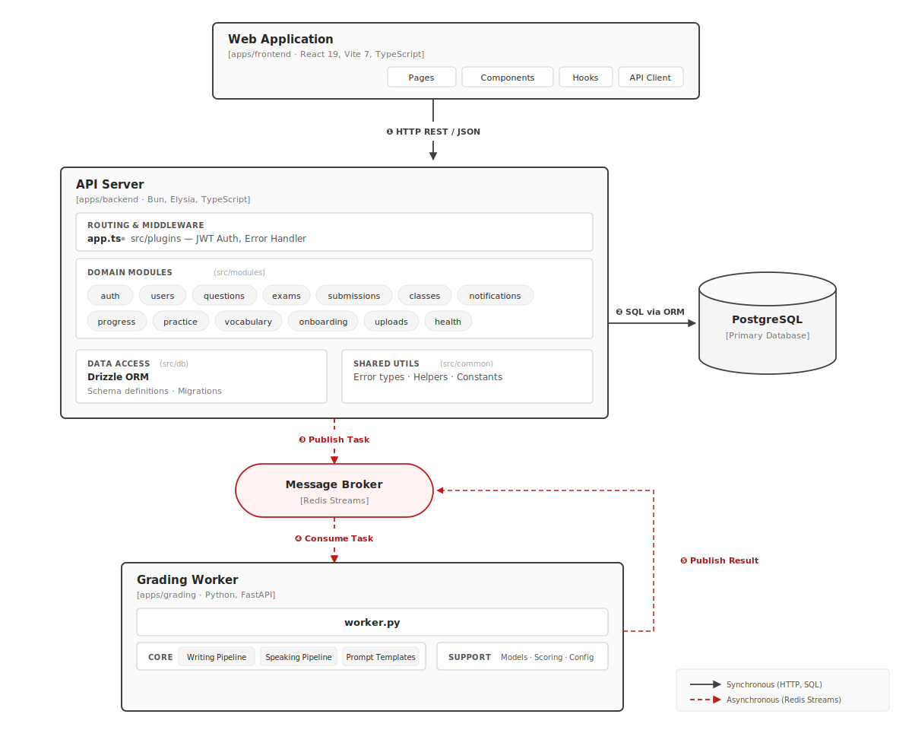

# I. Record of Changes

*A — Added · M — Modified · D — Deleted*

| Date | A/M/D | Author | Description |
|------|-------|--------|-------------|
| 02/03/2026 | A | Nghĩa (Leader) | Initial SDD — system architecture, database design, sequence diagrams |

---
# II. Software Design Document

## 1. System Design

### 1.1 System Architecture

Hệ thống gồm ba ứng dụng triển khai độc lập trong một monorepo:

| Application | Runtime | Role |
|-------------|---------|------|
| **Backend** (API Server) | Bun + Elysia | REST API xử lý toàn bộ logic nghiệp vụ, xác thực, chấm điểm tự động Listening/Reading |
| **Grading** (AI Worker) | Python + FastAPI | Worker chấm Writing/Speaking bằng AI, giao tiếp qua Redis Streams |
| **Frontend** (Web SPA) | React 19 + Vite 7 | Giao diện cho Learner, Instructor và Admin |

**Kiến trúc chính:**

- **Shared-DB model:** Backend kết nối PostgreSQL qua Drizzle ORM. Grading Worker chỉ giao tiếp qua Redis Streams — không truy cập DB trực tiếp.
- **Redis Streams:** Dispatch task chấm điểm (`grading:tasks`) và nhận kết quả (`grading:results`) với consumer group.
- **JWT Auth:** Access/refresh token pair với rotation và phát hiện tái sử dụng.

### 1.2 Package Diagram

| # | Package | Description |
|---|---------|-------------|
| 1 | `apps/backend/src/common/` | Utility dùng chung: env, error hierarchy, logger, scoring, state machine, auth types |
| 2 | `apps/backend/src/db/` | Database layer: Drizzle ORM schema, relations, JSONB types, connection + pagination |
| 3 | `apps/backend/src/modules/` | Feature modules: auth, users, questions, submissions, exams, progress, classes, knowledge-points, practice, vocabulary, onboarding, notifications, uploads, health |
| 4 | `apps/backend/src/plugins/` | Elysia plugins: JWT auth middleware, global error handler |
| 5 | `apps/backend/src/app.ts` | Entry point: tạo Elysia app, gắn plugins + modules |
| 6 | `apps/grading/app/` (Core) | AI grading pipeline: writing (LLM 4 criteria), speaking (STT + LLM), prompt templates |
| 7 | `apps/grading/app/` (Support) | Models, scoring, Pydantic config, structured logging |
| 8 | `apps/grading/app/worker.py` | Redis Streams consumer: process + retry logic |
| 9 | `apps/frontend/src/` | React SPA: pages (learner/instructor/admin), components, hooks, API client |

---

## 2. Database Design

### 2.1 Conceptual ERD

Hệ thống gồm 8 domain chính: Auth (users, tokens), Questions (question bank, knowledge points), Exams (exam sessions, answers), Submissions (grading lifecycle), Progress (scores, goals, placements), Classes (members, feedback), Vocabulary (topics, words), và Notifications.

### 2.2 Physical ERD

Chi tiết các bảng trong cơ sở dữ liệu:

<!-- PLACEHOLDER: Physical ERD tables sẽ được bổ sung ở Bước 2 với đầy đủ cột PK/FK/Type từ actual schema -->

| # | Table | Description |
|---|-------|-------------|
| 1 | `users` | Tài khoản: email, password hash, role (learner/instructor/admin), profile |
| 2 | `refresh_tokens` | Refresh token: SHA-256 hash, JTI, device info, expiry, revocation chain |
| 3 | `questions` | Question bank: skill, level, part, JSONB content + answers |
| 4 | `knowledge_points` | Knowledge point taxonomy: category, name, description |
| 5 | `question_knowledge_points` | Junction: question ↔ knowledge point |
| 6 | `submissions` | Bài nộp: user, question, status (state machine), score, band, grading mode |
| 7 | `submission_details` | Chi tiết: answer JSONB, grading result JSONB |
| 8 | `exams` | Đề thi: type, level, skills, blueprint JSONB, duration |
| 9 | `exam_sessions` | Phiên thi: user, exam, status, timestamps, per-skill scores |
| 10 | `exam_answers` | Câu trả lời: session, question, answer JSONB, isCorrect |
| 11 | `exam_submissions` | Junction: exam_session ↔ submission (Writing/Speaking) |
| 12 | `user_progress` | Tiến trình tổng hợp: (user, skill), average score, trend, level |
| 13 | `user_skill_scores` | Lịch sử điểm: user, skill, submission, score (sliding window) |
| 14 | `user_goals` | Mục tiêu: target band, deadline, estimated band, achieved date |
| 15 | `user_placements` | Placement: per-skill level, source (self-assess/test), confidence |
| 16 | `user_knowledge_progress` | KP progress: user, knowledge point, mastery, correct/total |
| 17 | `classes` | Lớp học: name, instructor, invite code, status |
| 18 | `class_members` | Thành viên: class, user, joined date |
| 19 | `instructor_feedback` | Phản hồi: class, instructor, learner, skill, content |
| 20 | `notifications` | Thông báo: user, type, title, body, read status |
| 21 | `device_tokens` | Push tokens: user, token, platform |
| 22 | `vocabulary_topics` | Chủ đề từ vựng: name, description, level |
| 23 | `vocabulary_words` | Từ vựng: topic, word, meaning, example, pronunciation |
| 24 | `user_vocabulary_progress` | Tiến trình từ vựng: user, word, mastery, next review |

---

## 3. Detailed Design

Mỗi feature trình bày Class Diagram (cấu trúc module) và Sequence Diagram (luồng xử lý chính).

### 3.1 Authentication

#### 3.1.1 Class Diagram

Module Auth gồm các handler: `register`, `login`, `refresh`, `logout`, `me`. Sử dụng bảng `users` và `refresh_tokens`. JWT access token ký bằng jose, refresh token lưu dạng SHA-256 hash với rotation và phát hiện tái sử dụng.

#### 3.1.2 Sequence Diagram

**Login flow:** Client gửi email/password → Backend xác thực → Tạo access + refresh token pair → Trả về client. Nếu số refresh token vượt giới hạn, thu hồi token cũ nhất (FIFO).

**Token refresh:** Client gửi refresh token → Backend verify hash → Nếu token đã revoke → phát hiện replay attack, revoke toàn bộ token của user → Nếu hợp lệ → rotate: revoke cũ, tạo mới.

### 3.2 Practice & Submission

#### 3.2.1 Class Diagram

Module Submissions quản lý lifecycle bài nộp qua state machine: `pending` → `processing` → `completed` hoặc `review_pending` → `completed`. Hỗ trợ auto-grade (Listening/Reading), AI grade (Writing/Speaking) qua Redis Streams dispatch, và human review.

#### 3.2.2 Sequence Diagram

**Writing submission flow:** Client nộp bài → Backend tạo submission (pending) → Dispatch task qua Redis Streams → Grading Worker chấm bằng LLM (4 criteria) → Trả kết quả qua stream → Backend cập nhật score. Nếu confidence thấp → chuyển sang review queue cho Instructor.

### 3.3 Exam

#### 3.3.1 Class Diagram

Module Exams quản lý đề thi (blueprint), phiên thi (session), và câu trả lời. Hỗ trợ auto-save mỗi 30 giây, tự động chấm Listening/Reading khi submit, và tạo submission cho Writing/Speaking để chấm AI.

Trong current implementation, backend áp dụng guard cứng khi create/update exam để từ chối blueprint sai chuẩn VSTEP trước khi persist: Listening 35 items (8/12/15), Reading 40 items (10/10/10/10), Writing đúng 2 task với minWords 120/250, Speaking đủ 3 phần (mỗi phần 1 câu hỏi).

#### 3.3.2 Sequence Diagram

**Exam session flow:** Start exam → Tạo session → Auto-save answers định kỳ → Submit → Auto-grade L/R (so đáp án) → Tạo submission cho W/S → Dispatch AI grading → Cập nhật progress.

### 3.4 AI Grading

#### 3.4.1 Class Diagram

Grading Service gồm hai pipeline: Writing (LLM chấm 4 tiêu chí) và Speaking (STT chuyển audio → transcript → LLM chấm 4 tiêu chí). Hỗ trợ retry với exponential backoff, PermanentError không retry.

#### 3.4.2 Sequence Diagram

**Writing pipeline:** Worker nhận task → Build prompt theo VSTEP rubric → Gọi LLM → Parse score 4 criteria → Snap to 0.5 → Tính band → Publish kết quả.

**Speaking pipeline:** Worker nhận task → Download audio → STT transcribe → Build prompt → Gọi LLM → Parse score → Publish kết quả.

### 3.5 Progress & Goals

#### 3.5.1 Class Diagram

Module Progress tính điểm trung bình theo sliding window (10 lần gần nhất), xác định trend (improving/stable/declining/inconsistent), và quản lý learning goals với target band + deadline.

#### 3.5.2 Sequence Diagram

**Score recording flow:** Sau khi chấm xong (auto/AI/human) → Ghi score vào `user_skill_scores` → Lấy 10 điểm gần nhất (sliding window) → Tính mean + std deviation → Xác định trend → UPSERT `user_progress`.

### 3.6 Class Management

#### 3.6.1 Class Diagram

Module Classes cho phép Instructor tạo lớp, quản lý thành viên qua invite code, xem dashboard (at-risk learners, skill summary), và gửi feedback cá nhân.

#### 3.6.2 Sequence Diagram

**Join class flow:** Learner nhập invite code → Backend verify code + class active → Thêm vào `class_members` → Instructor xem dashboard tổng quan tiến trình lớp.

---

*Document version: 1.0 — Last updated: SP26SE145*
