# I. Record of Changes

| Date | A/M/D | In charge | Change Description |
|------|-------|-----------|-------------------|
| 31/05/2026 | A | Hoàng Văn Anh Nghĩa | Initial Software Design Document with system architecture, package diagram, and database design references |
| 31/05/2026 | M | Hoàng Văn Anh Nghĩa | Added rendered system architecture and database relationship diagrams; aligned terminology with Assessment Engine implementation |

*A - Added   M - Modified   D - Deleted

# II. Software Design Document

## 1. System Design

### 1.1 System Architecture

The VSTEP Platform is designed as a multi-client learning system consisting of learner-facing web and mobile applications, an admin application, a Laravel backend API, relational database storage, media storage, and external services for identity verification, payment processing, grammar checking, speech processing, and AI-supported assessment.

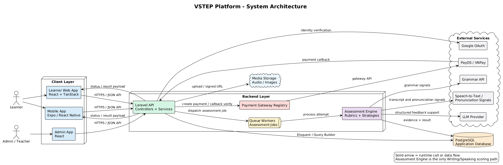

*Figure 4.1. System Architecture Diagram*

Main components:

| No | Component | Description |
|----|-----------|-------------|
| 01 | Learner Web App | Browser-based application for learners to practice skills, take mock exams, view feedback, manage course bookings, and track progress. |
| 02 | Mobile App | Mobile learning application that provides practice, exam, vocabulary review, speaking, and profile features for learners. |
| 03 | Admin App | Administration interface for managing users, learning content, exams, rubrics, courses, bookings, payments, notifications, and analytics. |
| 04 | Backend API | Central Laravel API that implements authentication, business rules, validation, persistence, background processing, and integration orchestration. |
| 05 | Database | Stores users, profiles, learning content, practice attempts, exam sessions, assessment results, course data, wallet transactions, and notifications. |
| 06 | External Services | Third-party or infrastructure services used for Google identity verification, payment callbacks, media storage, grammar checking, speech-to-text, pronunciation signals, and AI feedback support. |

### 1.2 Package Diagram

The package diagrams below describe the main packages and namespace-level dependencies inside each software sub-system. A package represents a source-code module or namespace. A dashed dependency arrow means that one package imports, calls, or uses types/services from another package.

#### Backend API Package Diagram

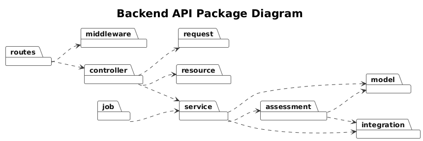

*Figure 4.2. Backend API Package Diagram*

#### Learner Web App Package Diagram

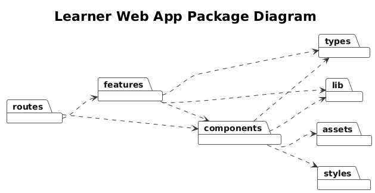

*Figure 4.3. Learner Web App Package Diagram*

#### Admin App Package Diagram

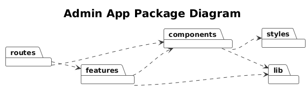

*Figure 4.4. Admin App Package Diagram*

#### Mobile App Package Diagram

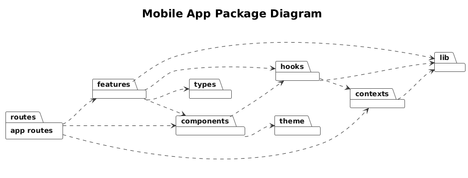

*Figure 4.5. Mobile App Package Diagram*

#### Package Descriptions

| No | Package | Description |
|----|---------|-------------|
| 01 | Backend API — `routes` | Defines API endpoints and maps HTTP routes to middleware and controllers. |
| 02 | Backend API — `middleware` | Handles HTTP pipeline concerns such as authentication, authorization checks, and request preprocessing. |
| 03 | Backend API — `controller` | Receives validated API requests and delegates business workflows to service packages. |
| 04 | Backend API — `request` | Validates request input and authorization rules before controller logic executes. |
| 05 | Backend API — `resource` | Formats model and service results into consistent API response payloads. |
| 06 | Backend API — `service` | Contains application service workflows for authentication, practice, exams, course booking, wallet, progress, and notifications. |
| 07 | Backend API — `assessment` | Contains rubric-based assessment logic, scoring strategies, evidence extraction support, and feedback processing. |
| 08 | Backend API — `job` | Contains asynchronous background tasks such as assessment processing and notification-related work. |
| 09 | Backend API — `model` | Contains Eloquent models and relationships for persistent domain entities. |
| 10 | Backend API — `integration` | Encapsulates communication with external providers such as AI, speech, grammar, payment, identity, and media storage services. |
| 11 | Learner Web — `routes` | Defines browser routes and connects learner pages to feature modules. |
| 12 | Learner Web — `features` | Contains learner-facing modules such as authentication, onboarding, profile, practice, exam, assessment result display, vocabulary, grammar, dashboard, course, booking, wallet, and notifications. |
| 13 | Learner Web — `components` | Contains reusable UI components used by learner pages and feature modules. |
| 14 | Learner Web — `lib` | Contains API clients, authentication helpers, query configuration, utility functions, and shared frontend helpers. |
| 15 | Learner Web — `types` | Contains shared TypeScript types used by learner features and components. |
| 16 | Learner Web — `assets` and `styles` | Contains static assets and styling resources for the learner web application. |
| 17 | Admin App — `routes` | Defines admin routes and maps administration screens to feature modules. |
| 18 | Admin App — `features` | Contains administration modules for users, courses, exams, practice content, assessment operations, grammar, vocabulary, promos, top-up, and teacher workflows. |
| 19 | Admin App — `components` | Contains reusable UI components for admin pages. |
| 20 | Admin App — `lib` | Contains admin API client, authentication helper, and utility functions. |
| 21 | Admin App — `styles` | Contains styling resources for the admin interface. |
| 22 | Mobile App — `app routes` | Defines Expo Router screens and navigation groups for the mobile learner application. |
| 23 | Mobile App — `features` | Contains mobile feature modules for profile, onboarding, practice, shadowing, vocabulary, course, wallet, coin, streak, and notifications. |
| 24 | Mobile App — `components` | Contains reusable mobile UI components used by screens and feature modules. |
| 25 | Mobile App — `hooks` | Contains reusable stateful logic for API calls, audio recording, playback, speech-to-text, practice, and other mobile flows. |
| 26 | Mobile App — `contexts` | Contains app-wide state providers such as authentication/session context. |
| 27 | Mobile App — `lib` | Contains API clients, authentication helpers, asset utilities, audio upload helpers, and shared utilities. |
| 28 | Mobile App — `theme` and `types` | Contains mobile design tokens and shared TypeScript types. |

## 2. Database Design

The database is designed around the main operational areas of the VSTEP Platform: identity and learner profiles, wallet and payment, course booking, practice submissions, exam sessions, assessment processing, progress tracking, and notifications.

For readability, the database relationship is presented as four subject-area ERDs. This keeps the diagram format close to the required table-and-relationship style while avoiding a single oversized diagram with unreadable crossing lines. The table descriptions after the diagrams provide the complete table inventory.

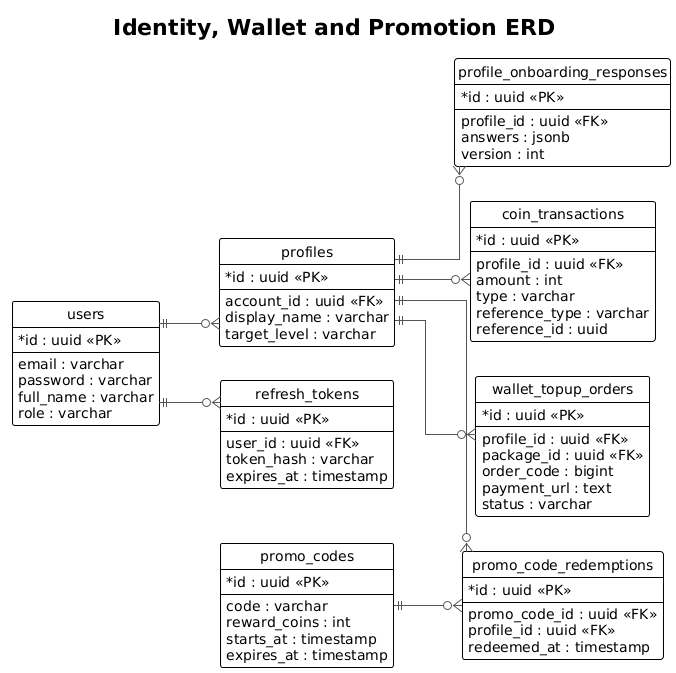

*Figure 4.6. Identity, Wallet and Promotion ERD*

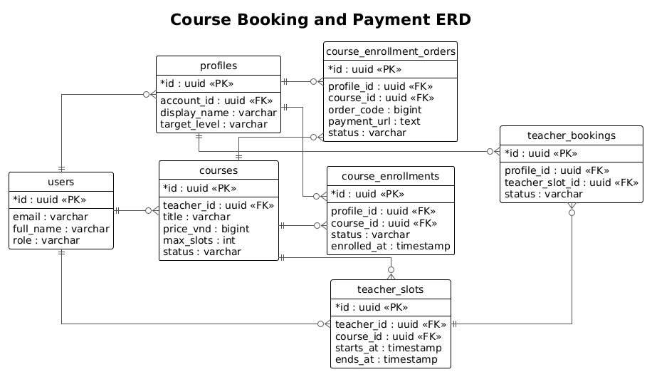

*Figure 4.7. Course Booking and Payment ERD*

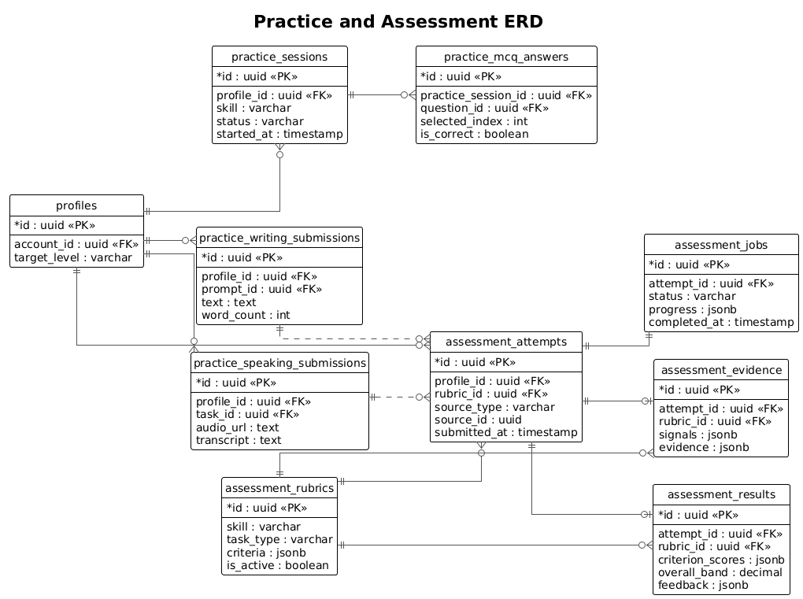

*Figure 4.8. Practice and Assessment ERD*

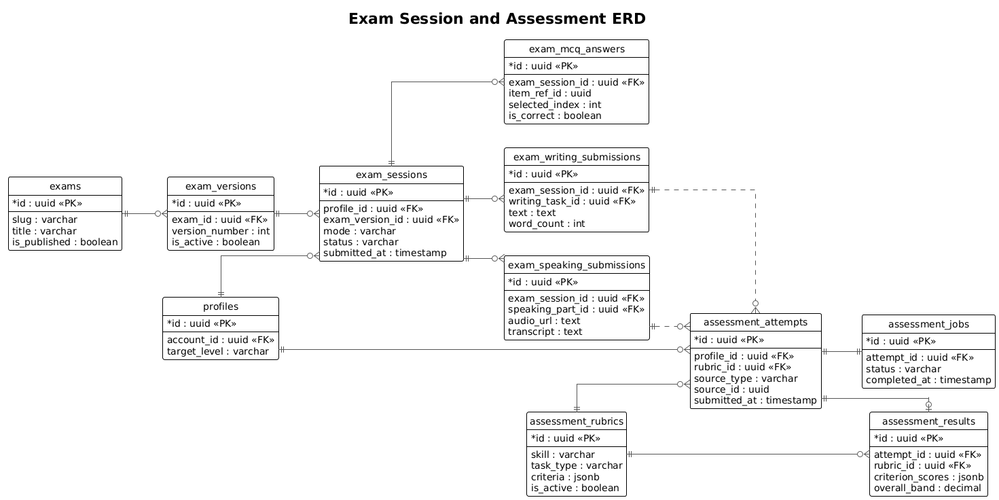

*Figure 4.9. Exam Session and Assessment ERD*

### Table Descriptions

| No | Table | Description |
|----|-------|-------------|
| 01 | `users` | Stores accounts for learners, teachers, and administrators. Primary keys: `id` Foreign keys: none |
| 02 | `profiles` | Stores learner profile and target-level information. Primary keys: `id` Foreign keys: `account_id` |
| 03 | `refresh_tokens` | Stores refresh-token records for authenticated sessions. Primary keys: `id` Foreign keys: `user_id` |
| 04 | `profile_onboarding_responses` | Stores learner onboarding answers and onboarding version. Primary keys: `id` Foreign keys: `profile_id` |
| 05 | `coin_transactions` | Stores wallet credit and debit ledger entries. Primary keys: `id` Foreign keys: `profile_id` |
| 06 | `wallet_topup_orders` | Stores wallet top-up payment orders and gateway status. Primary keys: `id` Foreign keys: `profile_id`, `package_id` |
| 07 | `promo_codes` | Stores promotional code rules and reward configuration. Primary keys: `id` Foreign keys: none |
| 08 | `promo_code_redemptions` | Stores promo-code redemption history by learner profile. Primary keys: `id` Foreign keys: `promo_code_id`, `profile_id` |
| 09 | `courses` | Stores teacher-led course definitions and enrollment constraints. Primary keys: `id` Foreign keys: `teacher_id` |
| 10 | `course_enrollment_orders` | Stores course enrollment payment orders and gateway callback state. Primary keys: `id` Foreign keys: `profile_id`, `course_id` |
| 11 | `course_enrollments` | Stores confirmed learner enrollments for courses. Primary keys: `id` Foreign keys: `profile_id`, `course_id` |
| 12 | `teacher_slots` | Stores teacher availability slots for course booking. Primary keys: `id` Foreign keys: `teacher_id`, `course_id` |
| 13 | `teacher_bookings` | Stores learner bookings against teacher slots. Primary keys: `id` Foreign keys: `profile_id`, `teacher_slot_id` |
| 14 | `practice_sessions` | Stores listening/reading practice session state. Primary keys: `id` Foreign keys: `profile_id` |
| 15 | `practice_mcq_answers` | Stores selected answers for objective practice questions. Primary keys: `id` Foreign keys: `practice_session_id` |
| 16 | `practice_writing_submissions` | Stores learner writing practice submissions. Primary keys: `id` Foreign keys: `profile_id`, `prompt_id` |
| 17 | `practice_speaking_submissions` | Stores learner speaking practice audio and transcript data. Primary keys: `id` Foreign keys: `profile_id`, `task_id` |
| 18 | `exams` | Stores mock exam definitions. Primary keys: `id` Foreign keys: none |
| 19 | `exam_versions` | Stores versioned content sets for mock exams. Primary keys: `id` Foreign keys: `exam_id` |
| 20 | `exam_sessions` | Stores learner mock exam attempts, timing, and status. Primary keys: `id` Foreign keys: `profile_id`, `exam_version_id` |
| 21 | `exam_mcq_answers` | Stores listening/reading answers in mock exam sessions. Primary keys: `id` Foreign keys: `exam_session_id` |
| 22 | `exam_writing_submissions` | Stores writing responses in mock exam sessions. Primary keys: `id` Foreign keys: `exam_session_id`, `writing_task_id` |
| 23 | `exam_speaking_submissions` | Stores speaking responses in mock exam sessions. Primary keys: `id` Foreign keys: `exam_session_id`, `speaking_part_id` |
| 24 | `assessment_rubrics` | Stores rubric criteria, evidence schema, and scoring policy. Primary keys: `id` Foreign keys: none |
| 25 | `assessment_attempts` | Stores normalized assessment attempts from practice or exam submissions. Primary keys: `id` Foreign keys: `profile_id`, `rubric_id` |
| 26 | `assessment_jobs` | Stores asynchronous assessment processing state. Primary keys: `id` Foreign keys: `attempt_id` |
| 27 | `assessment_evidence` | Stores extracted signals, evidence, and validation details. Primary keys: `id` Foreign keys: `attempt_id`, `rubric_id` |
| 28 | `assessment_results` | Stores final criterion scores, overall band, trace, and feedback. Primary keys: `id` Foreign keys: `attempt_id`, `rubric_id` |
| 29 | `profile_daily_activity` | Stores daily learning activity aggregates. Primary keys: `id` Foreign keys: `profile_id` |
| 30 | `profile_streak_state` | Stores learner streak status and milestone progress. Primary keys: `id` Foreign keys: `profile_id` |
| 31 | `notifications` | Stores learner-facing notification records. Primary keys: `id` Foreign keys: `profile_id` |

## 3. Detailed Design

The following detailed designs cover representative functions of the system. Features with similar controller-service-model structure follow the same design pattern.

### 3.1 Authentication & Profile Management

This function handles login, Google authentication, token issuing, refresh tokens, and learner profile ownership.

#### 3.1.1 Class Diagram

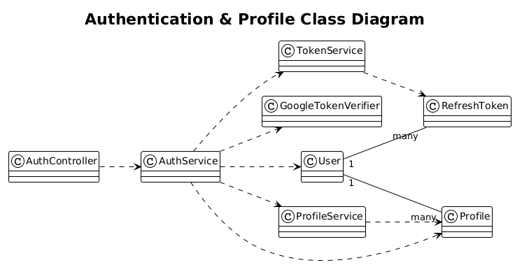

*Figure 4.10. Authentication & Profile Class Diagram*

#### 3.1.2 Login Sequence

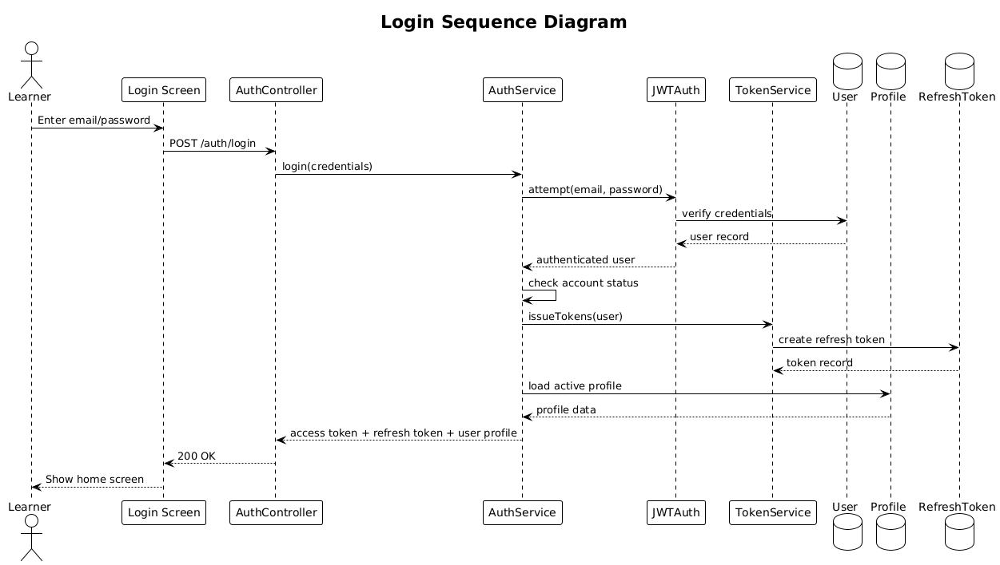

*Figure 4.11. Login Sequence Diagram*

### 3.2 Practice & Assessment Processing

This function handles learner writing/speaking practice submissions, paid feedback requests, assessment attempt creation, queued processing, and assessment result storage.

#### 3.2.1 Class Diagram

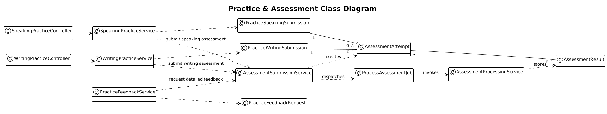

*Figure 4.12. Practice & Assessment Class Diagram*

#### 3.2.2 Practice Feedback Sequence

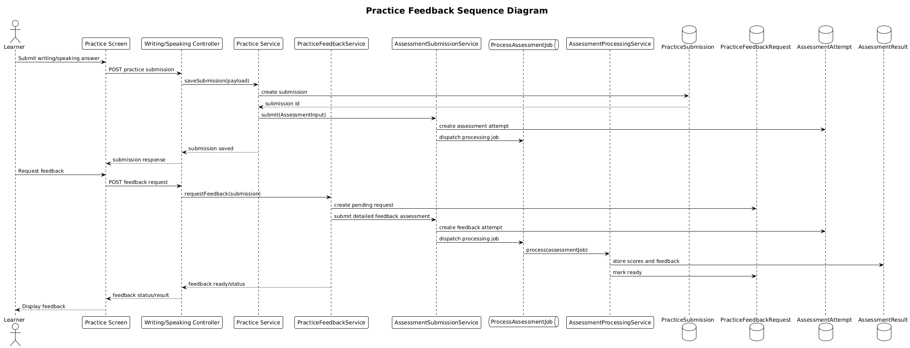

*Figure 4.13. Practice Feedback Sequence Diagram*

### 3.3 Mock Exam Session

This function handles VSTEP mock exam session creation, answer saving, draft persistence, and productive-skill assessment submission.

#### 3.3.1 Class Diagram

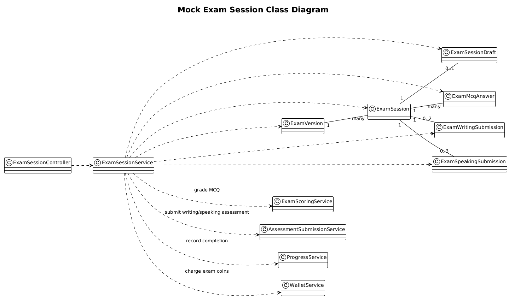

*Figure 4.14. Mock Exam Session Class Diagram*

#### 3.3.2 Exam Submission Sequence

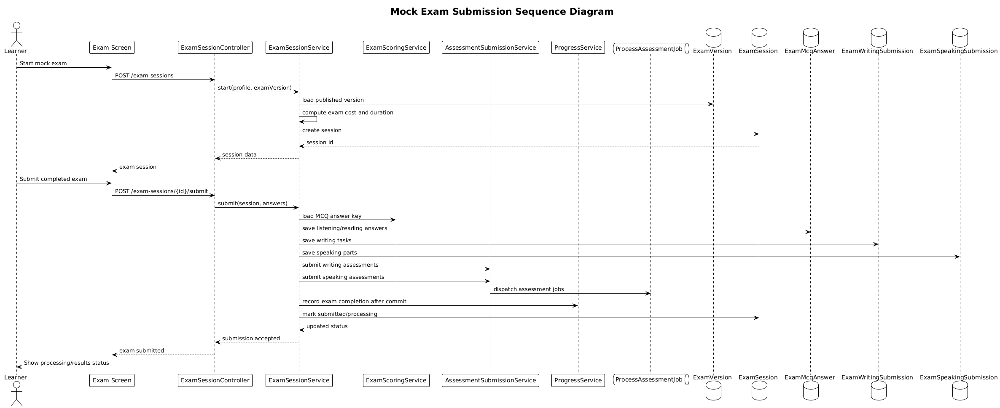

*Figure 4.15. Mock Exam Submission Sequence Diagram*

### 3.4 Course Booking & Payment

This function handles course enrollment orders, teacher slot booking, payment gateway interaction, coin transactions, and operational notifications.

#### 3.4.1 Class Diagram

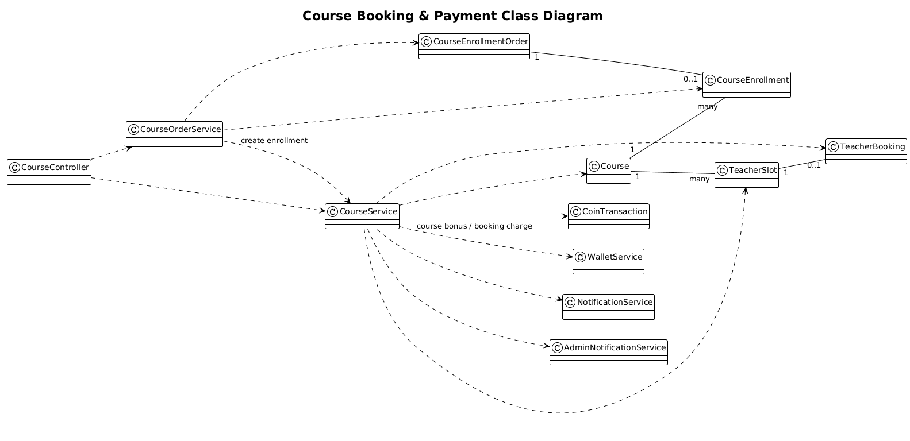

*Figure 4.16. Course Booking & Payment Class Diagram*

#### 3.4.2 Course Enrollment Payment Sequence

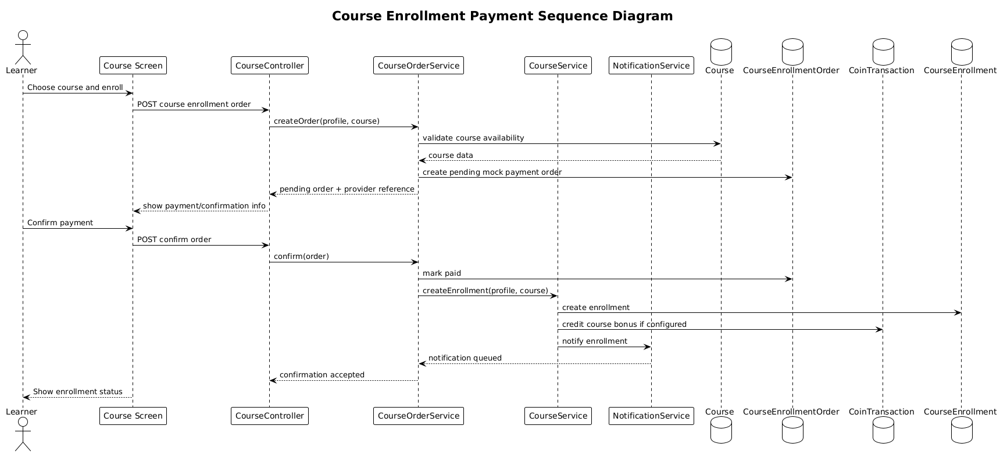

*Figure 4.17. Course Enrollment Payment Sequence Diagram*
