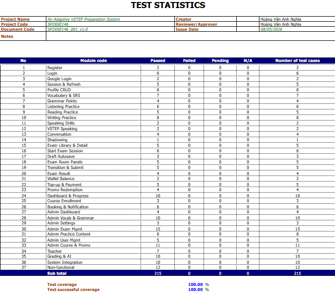

# I. Record of Changes

| Date | A/M/D | In charge | Change Description |
| --- | --- | --- | --- |
| 8-May-26 | A |  | Create test document for VSTEP project |
| 30-May-26 | M |  | Filter to 215 test cases, align scope and testers with repository |

*A - Added   M - Modified   D - Deleted*

# II. Testing Documentation

## 1. Scope of Testing

| Feature | Function | Vendor/In-house | Description |
| --- | --- | --- | --- |
| Register | Register | Guest | Register learner with email, onboarding data |
| Login | Login | Learner | Login with email/password, session, redirect |
| Google Auth | Google Login | Learner | Google Sign-In integration |
| Session | Session & Refresh | Learner | Token refresh, logout, lifecycle |
| Profile | Profile CRUD | Learner | List, create, switch, update, onboarding |
| Vocabulary | Vocabulary & SRS | Learner | Topic list, detail, exercises, SRS review |
| Grammar | Grammar Points | Learner | Point list, detail, exercise flow |
| Listening | Listening Practice | Learner | Exercise list, audio, answer, results |
| Reading | Reading Practice | Learner | Exercise list, passage, questions, results |
| Writing | Writing Practice | Learner | Prompt, editor, submit, AI feedback, SSE |
| Speaking Drills | Speaking Drills | Learner | Pronunciation drill, recording, feedback |
| VSTEP Speaking | VSTEP Speaking | Learner | VSTEP session, submit, grading |
| Conversation AI | Conversation | Learner | Scenario start, turns, review, feedback |
| Shadowing | Shadowing | Learner | Shadowing session, playback, recording |
| Exam Library | Exam Library & Detail | Learner | List, status cards, detail, skill selector |
| Exam Start | Start Exam Session | Learner | Full/custom start, coin, insufficient balance |
| Exam Draft | Draft Autosave | Learner | Save, autosave debounce, resume from draft |
| Exam Panels | Exam Room Panels | Learner | L/R/W/S panels, device check |
| Exam Submit | Transition & Submit | Learner | Next skill, confirm, submit, auto-submit, scoring |
| Exam Result | Exam Result | Learner | Result summary, feedback, polling, detail page |
| Wallet Balance | Wallet Balance | Learner | Balance endpoint, header display |
| Top-up | Top-up & Payment | Learner | Package list, order, confirm, redirect |
| Promo Redeem | Promo Redemption | Learner | Valid/invalid redeem, frontend, error |
| Dashboard | Dashboard & Progress | Learner | Overview, spider chart, streak, learning path |
| Course Enroll | Course Enrollment | Learner | List, enrollment order, frontend flow |
| Booking | Booking & Notification | Learner | Book slot, coin, limit, commitment, notifications |
| Admin Dashboard | Admin Dashboard | Admin | Stats, alerts, role enforcement, frontend |
| Admin Vocab Grammar | Admin Vocab & Grammar | Admin | Vocab/grammar CRUD, publish/unpublish, frontend |
| Admin Settings | Admin Settings | Admin | System config, update, role enforcement |
| Admin Exams | Admin Exam Mgmt | Admin | Exam CRUD, import, version, content editors |
| Admin Practice | Admin Practice Content | Admin | L/R/W/S exercise CRUD, editors |
| Admin Users | Admin User Mgmt | Admin | User CRUD, deactivate, role enforcement, frontend |
| Admin Courses | Admin Course & Promo | Admin | Course CRUD, enrollments, bookings, promo, top-up |
| Teacher | Teacher | Teacher | Dashboard, schedule, bookings, leave requests |
| Grading AI | Grading & AI | Backend/System | Result lookup, SSE, scoring formulas, pipeline |
| System | System Integration | Backend/System | Role hierarchy, health, config, cross-module |
| Non-functional | Non-functional | Non-functional | Security, performance, compatibility, usability, reliability |

## 2. Test Strategy

### 2.1 Testing Types

| Objective | Technique | Completion criteria |
| --- | --- | --- |
| To test the application’s behavior under real-world conditions | End-to-End Testing | Covers interactions with databases, third-party services, payment systems, etc. |
| To assess how well integrated modules work together | Integration testing | Modules communicate and operate correctly as a combined unit |
| To check the accuracy of data exchange and control flow between systems or components | Interface testing | Ensures requests and responses function correctly between interfaces |

### 2.2 Test Levels

| Type of Tests | Test Level Unit | Integration | System | Acceptance |
| --- | --- | --- | --- | --- |
| Functional Testing |  | X | X | X |
| Interface testing |  | X | X |  |
| Performance Testing |  | X | X |  |
| Usability Testing |  |  | X | X |
| Security/RBAC Testing |  | X | X | X |
| Regression Testing | X | X | X |  |
| AI/Grading Validation | X | X | X | X |

### 2.3 Supporting Tools

| Purpose | Tool | Vendor/In-house | Version |
| --- | --- | --- | --- |
| Backend API Testing | Laravel Feature/Unit Tests | In-house/Open Source | Current |
| API Manual Testing | Postman/Swagger | Open Source | Latest |
| Web UI Testing | Agent Browser/Playwright | Open Source | Current |
| Frontend Verification | bun run lint/build | Open Source | Current |
| Mobile Verification | Expo/Android Emulator | Open Source/Google | Current |
| Performance Testing | k6/JMeter | Open Source | Latest |

## 3. Test Plan

### 3.1 Human Resources

| Worker/Doer | Role | Specific Responsibilities/Comments |
| --- | --- | --- |
| Hoàng Văn Anh Nghĩa | Leader / Backend & QA Lead | Prepare test plans and verify the progress of tests Verified backend API, grading, wallet, notification, and integration test scope |
| Nguyễn Nhật Phát | Frontend Tester | Do learner web auth, profile, grammar, writing, and admin form test cases as planned |
| Nguyễn Trần Tấn Phát | Frontend Tester | Do dashboard, exam room/result, vocabulary, admin dashboard, and exam management test cases as planned |
| Nguyễn Minh Khôi | Mobile & Speaking Tester | Do mobile-related, speaking, teacher schedule, and booking test cases as planned |

### 3.2 Test Environment

| Purpose | Tool | Provider | Version |
| --- | --- | --- | --- |
| Backend API | Laravel 13 / PHP 8.4 | Project | Current backend-v2 |
| Database | PostgreSQL staging DB | Project | Current |
| Learner Web | React 19 / Vite / TanStack Router | Project | Current frontend-v3 |
| Admin Web | React 19 / Vite / TanStack Router | Project | Current admin app |
| Mobile | Expo React Native | Project | Current mobile-v2 |
| Browser | Chrome / Edge | Google/Microsoft | Latest stable |
| AI/Grading | LLM/STT Gateway | Project/Provider | Staging |

### 3.3 Test Milestones

| Milestone Task | Start Date | End Date |
| --- | --- | --- |
| Scope audit and test case filtering | 2026-05-29 | 2026-05-30 |
| Bug Fix Verification & Regression | 2026-04-15 | 2026-04-25 |
| Final Test Report Submission | 2026-04-25 | 2026-04-30 |

## 4. Test Cases

Other test case : Report5_VSTEP_Test_Report.xlsx

## 5. Test Reports

