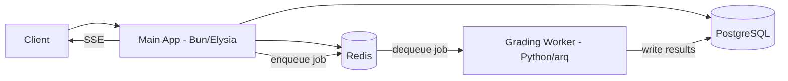

# Chốt Phương Án Kiến Trúc

## Purpose

Tài liệu này chốt các quyết định kiến trúc/boundary để backend implement nhanh, ít vênh giữa Bun Main App và Python Grading Worker.

## Architecture Overview

- Client (Web/Mobile) gọi Main App.
- Main App lưu PostgreSQL, dùng Redis cho cache/rate limit/grading queue.
- Writing/Speaking: enqueue job vào Redis list → arq worker xử lý → ghi kết quả trực tiếp vào PostgreSQL.
- Main App poll hoặc SSE để thông báo kết quả cho client.

## Scope

- Main App: Bun + Elysia (TypeScript)
- Grading Worker: Python + arq (async Redis-based task queue)
- Queue: Redis list (arq protocol)
- DB: PostgreSQL (shared — cả Main App và Grading Worker connect cùng DB)
- Cache/rate limit: Redis (`import { redis } from "bun"` — built-in, no extra deps)
- Real-time: SSE (default)
- Auth: JWT access/refresh (jose + Bun.password Argon2id)

> **Shared-DB**: Grading Worker ghi kết quả trực tiếp vào PostgreSQL. Không cần callback queue hay outbox pattern.

## Decisions

### Tech stack (final)

| Component | Decision | Rationale |
|----------|----------|-----------|
| Main App | Bun + Elysia | Fast runtime, TypeScript native |
| Grading Worker | Python + arq | arq is lightweight Redis-based queue, simpler than Celery |
| Task Queue | Redis list (arq) | Fewer moving parts than RabbitMQ, arq handles retry internally |
| Database | PostgreSQL (single, shared) | Shared-DB eliminates need for callback queue/outbox |
| Cache/Rate limit | Redis (Bun built-in) | `import { redis } from "bun"`, zero deps, 7.9x faster than ioredis |
| Real-time | SSE | Elysia built-in `sse()`, sufficient for unidirectional updates |
| Auth | JWT access + refresh | jose + Bun.password (Argon2id), web/mobile compatible |

### Library stack (Bun Main App)

| Concern | Library | Rationale |
|---------|---------|-----------|
| Redis client | `Bun.redis` (native) | Built-in Bun 1.3+, zero deps, auto-pipelining, auto-reconnect. Requires Redis 7.2+ (RESP3). |
| SSE | Elysia built-in `sse()` | Tích hợp sẵn core Elysia (v1.3.4+), async generator + `yield sse({id, event, data, retry})`. |
| Scores | Drizzle `numeric({ precision: 3, scale: 1, mode: 'number' })` | Exact decimal precision cho academic scores (0-10, step 0.5). |
| ORM | Drizzle ORM | SQL-first, PostgreSQL-native features (partial indexes, JSONB, FOR UPDATE SKIP LOCKED). |

### Key architectural decisions

| Decision | Choice | Why |
|----------|--------|-----|
| Delete strategy | Hard delete + ON DELETE CASCADE | Simpler for capstone scope. No `deleted_at` columns, no soft-delete cleanup jobs. |
| Grading pipeline | Shared-DB (worker writes directly to PostgreSQL) | Eliminates outbox pattern, callback queue, processed_callbacks table. |
| Task queue | Redis + arq (not RabbitMQ + Celery) | Fewer moving parts. arq handles retry/backoff internally (max 3 retries). |
| Submission states | 5-state machine (pending/processing/completed/review_pending/failed) | arq handles retry internally, no need for queued/retrying/error states. |
| Review priority | 3 levels (low/medium/high) | Sufficient granularity for capstone. |
| Grading mode | 3 values (auto/human/hybrid) | Covers all grading scenarios. |
| Password hashing | Argon2id (`Bun.password`) | Built-in, more secure than bcrypt. |

## Contracts

- Reliability rules: `../40-platform/reliability.md`
- Auth rules: `../40-platform/authentication.md`
- Deployment env: `../50-ops/deployment.md`

## Failure modes

| Area | Risk | Mitigation |
|------|------|------------|
| Grading worker | job failure | arq retry (max 3, exponential backoff) |
| Provider (LLM/STT) | 429/timeout | retry/backoff within arq worker |
| Provider | cascading failure | circuit breaker (open at >50% failure rate, cooldown 30s) |
| Auth | refresh token theft | rotation + reuse detection + revoke store |
| Redis | unavailable | graceful degradation (skip rate limiting, log warning) |

## Acceptance criteria

- Grading worker reads from Redis queue, writes results to PostgreSQL.
- Retry/backoff handled by arq (max 3 retries, exponential backoff).
- Auth baseline là JWT access/refresh, rotation + reuse detection.
- 5-state submission lifecycle enforced by state machine.

## Business rules defaults (Chốt)

- Retry/backoff: `max_retries=3`, exponential + jitter (arq handles internally).
- Review priority: 3 levels (low/medium/high).

---

*Document version: 2.0 - Last updated: SP26SE145*
