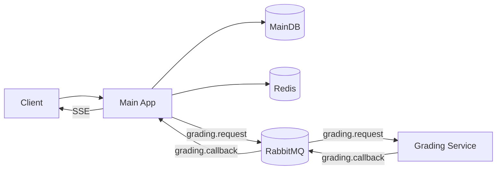

# Chốt Phương Án Kiến Trúc

## Purpose

Tài liệu này chốt các quyết định kiến trúc/boundary để backend implement nhanh, ít vênh giữa Bun Main App và Python Grading Service.

## Architecture Overview

- Client (Web/Mobile) gọi Main App.
- Main App lưu MainDB, dùng Redis cho cache/rate limit.
- Writing/Speaking: publish `grading.request` → Grading Service xử lý → publish `grading.callback`.
- Main App consume callback, update MainDB, push SSE.

## Scope

- Main App: Bun + Elysia (TypeScript)
- Grading Service: Python + Celery
- Queue cross-service: RabbitMQ
- DB: PostgreSQL tách MainDB/GradingDB (**Main App chỉ connect MainDB**)
- Cache/rate limit: Redis
- Real-time: SSE (default)
- Auth: JWT access/refresh (baseline)

> **Quan trọng**: Main App (Bun) **không bao giờ** connect trực tiếp đến GradingDB. Giao tiếp duy nhất giữa 2 service là qua RabbitMQ.

## Decisions

### Tech stack (final)

| Component | Decision | Alternatives |
|----------|----------|--------------|
| Main App | Bun + Elysia | Node.js + Express, Deno |
| Grading Service | Python + Celery | Rust, Go |
| Message Queue | RabbitMQ (AMQP) | Redis Streams, Kafka |
| Database | PostgreSQL (MainDB + GradingDB) | MySQL, CockroachDB |
| Cache/Rate limit | Redis | Postgres-only |
| Real-time | SSE | WebSocket |
| Auth | JWT access + refresh | Server session |

### Library stack (Bun Main App)

| Concern | Library | Rationale |
|---------|---------|-----------|
| AMQP client | `@cloudamqp/amqp-client` | Zero deps, TypeScript native, dùng `DataView` (Web API) thay vì `node:stream` — tránh Bun frame corruption bug. Maintained bởi CloudAMQP. **Không dùng amqplib** — có lỗi IPv6 (Bun #4791) và frame corruption (Bun #5627) do phụ thuộc `node:stream`. |
| Redis client | `Bun.redis` (native) | Built-in Bun 1.3+, nhanh 7.9x so với ioredis, zero deps, auto-pipelining, auto-reconnect. Đủ cho rate limiting, cache, pub/sub, circuit breaker state. **Không dùng ioredis** — chỉ cần khi cluster mode hoặc Lua scripting phức tạp. |
| SSE | Elysia built-in `sse()` | Tích hợp sẵn core Elysia (v1.3.4+), async generator + `yield sse({id, event, data, retry})`. Tự set `Content-Type: text/event-stream`, abort detection qua `request.signal`. **Không dùng @elysiajs/stream** — đã deprecated từ Elysia 1.1. |
| Scores | Drizzle `numeric({ precision: 3, scale: 1, mode: 'number' })` | Exact decimal precision cho academic scores (0-10, step 0.5). **Không dùng `real()`** — PostgreSQL REAL (4-byte float) có floating-point errors. |

### Rationale (ngắn)

- RabbitMQ + Celery: mature, có DLQ/retry tốt, dễ scale worker.
- JWT access/refresh: dùng được cho web/mobile, không cần session state server.
- Tách DB: giảm coupling, dễ audit.
- Library chọn theo tiêu chí "tốt nhất cho Bun runtime", không phải "compatible".

## Contracts

- Message contracts: `../10-contracts/queue-contracts.md`
- Reliability rules: `../40-platform/reliability.md`
- Auth rules: `../40-platform/authentication.md`
- Deployment env: `../50-ops/deployment.md`

## Failure modes

| Area | Risk | Mitigation |
|------|------|------------|
| Queue | duplicate deliveries | `requestId` idempotency |
| Provider | 429/timeout | retry/backoff + cap + DLQ |
| Outbox | publish fail | relay + retry |
| Provider | cascading failure | circuit breaker (open at >50% failure rate, cooldown 30s) |
| Auth | refresh token theft | rotation + revoke store |

## Acceptance criteria

- Tất cả service boundary (Main/Grading) giao tiếp qua queue contracts.
- Quy tắc retry/timeout/late-result áp dụng nhất quán.
- Auth baseline là JWT access/refresh, không còn session cookie baseline.

## Business rules defaults (Chốt)

- Grading SLA: Writing 20 phút; Speaking 60 phút.
- Timeout: quá `deadline` → `failed`; callback muộn lưu `isLate=true`, giữ `failed`.
- Retry/backoff: `max_retries=3`, exponential + jitter, cap 5 phút, tôn trọng `Retry-After`.

---

*Document version: 1.3 - Last updated: SP26SE145*
