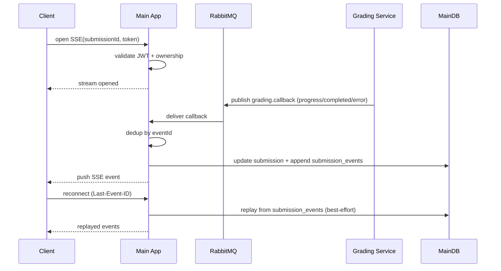

# Server-Sent Events (SSE) Specification

> **Phiên bản**: 1.3 · SP26SE145

## 1. Mục đích

Định nghĩa cơ chế SSE để push real-time grading status về cho client. SSE được chọn thay vì WebSocket vì tính đơn giản (one-way, auto-reconnect native), phù hợp với use case "server push status updates" mà không cần bidirectional communication.

---

## 2. Phạm vi

- SSE endpoint trên Bun Main App cho từng submission
- Các event chính: grading.progress, grading.review_pending, grading.completed, grading.failed, ping
- Authentication qua query parameter (SSE/EventSource API không hỗ trợ custom headers từ browser)
- Reconnection tự động với `Last-Event-ID` để replay events bị miss

---

## 3. Luồng hoạt động (tóm tắt)

- Client mở SSE stream theo submission (kèm token); server validate token + ownership.
- Grading Service publish callback messages lên `grading.callback`.
- Main App consume callback, dedup theo `eventId`, update MainDB, append `submission_events`, push SSE nếu có connection.
- Client reconnect dùng `Last-Event-ID`; server replay best-effort từ `submission_events` hoặc fallback polling.



---

## 4. SSE Endpoint

Một endpoint duy nhất, mỗi submission một stream riêng. Client mở EventSource connection với submission ID và access token.

### Authentication

Token truyền qua query parameter vì EventSource API (browser) không cho phép custom headers. Server validate JWT signature, kiểm tra expiration, và xác nhận user là owner của submission (submission.userId == token.sub).

### Response Headers

- Content-Type: `text/event-stream`
- Cache-Control: `no-cache`
- Connection: `keep-alive`
- X-Accel-Buffering: `no` (tắt nginx buffering nếu có reverse proxy)

---

## 5. Các loại Event

### grading.progress
Gửi khi grading đang xử lý. Data tối thiểu: submissionId, status (`processing`). Có thể kèm progress (0..1) và message (best-effort).

### grading.review_pending
Gửi khi AI grading hoàn tất nhưng `reviewPending=true`. UI phải hiển thị trạng thái "đang chờ chấm thủ công" và không coi đây là kết quả cuối cùng.

### grading.completed
Gửi khi có kết quả cuối cùng sẵn sàng cho learner (auto-grade hoặc sau human review). Client nên đóng connection sau khi nhận event này.

### grading.failed
Gửi khi grading thất bại (hết retry hoặc timeout). Data tối thiểu: submissionId, reason, errorCode.

### ping
Heartbeat event gửi mỗi 30 giây để giữ connection alive. Data rỗng.

---

## 6. Cầu nối AMQP → SSE (Callback Consumer)

Main App chạy một AMQP consumer lắng nghe `grading.callback` queue. Đây là cầu nối giữa async grading và real-time SSE push.

Khi nhận callback message:

1. **Idempotency check**: Kiểm tra `eventId` đã có trong bảng `processed_callbacks` chưa. Nếu đã xử lý → skip.
2. **Update MainDB**: Cập nhật submission status và result/error dựa trên callback.
3. **Record processed**: Ghi `eventId` vào `processed_callbacks` để ngăn duplicate.
4. **Append event log**: Ghi event vào `submission_events` để phục vụ SSE replay theo `Last-Event-ID`.
5. **Push SSE**: Publish event vào in-memory pub/sub channel của submission. Nếu có client đang subscribe → event được push qua SSE stream.

In-memory pub/sub là một map đơn giản: `submissionId → Set<SSE connections>`. Khi SSE connection đóng, connection được unsubscribe khỏi channel.

---

## 7. Reconnection & Replay

- Server gửi `retry: 5000` (5 giây) trong stream để browser biết thời gian chờ trước khi reconnect.
- Mỗi event có `id` field = `eventId` (từ callback message).
- Khi client reconnect, browser tự động gửi header `Last-Event-ID` với ID của event cuối cùng nhận được.
- Server replay best-effort bằng cách đọc từ event log theo submission (xem `../30-data/database-schema.md` mục `submission_events`).
- Nếu không tìm thấy event tương ứng (do retention cleanup hoặc client gửi ID quá cũ), server không fail; thay vào đó client nên gọi polling fallback để sync trạng thái hiện tại.

---

## 8. Timeouts

- **Heartbeat**: Ping mỗi 30 giây để giữ connection và phát hiện client disconnect.
- **Idle timeout**: Connection tự đóng sau 30 phút không có event thực (chỉ có ping).
- **SLA alignment**: SSE connection thường sẽ kết thúc trước SLA timeout (writing 20 phút, speaking 60 phút) khi nhận completed/failed event.

---

## 9. Failure Modes

| Tình huống | Hành vi |
|-----------|---------|
| Token không hợp lệ hoặc hết hạn | Trả về 401, không mở stream |
| Submission không tồn tại | Trả về 404 |
| User không phải owner | Trả về 403 |
| AMQP consumer mất kết nối | Auto-reconnect. Events queue trong RabbitMQ cho đến khi consumer reconnect |
| Không có client nào đang subscribe | Event từ pub/sub bị drop — chấp nhận được vì không ai đang listen |
| Client disconnect | SSE stream đóng, connection bị unsubscribe khỏi pub/sub |
| Worker crash | Events tiếp tục queue trong RabbitMQ, được deliver khi consumer reconnect |
| Bun process restart | In-memory pub/sub bị reset. Clients auto-reconnect với Last-Event-ID, replay từ DB |

---

## 10. Acceptance Criteria

- Client mở SSE connection và nhận events real-time khi grading status thay đổi
- Khi grading hoàn thành, client nhận event completed với score và band
- Sau disconnect + reconnect, client nhận lại events bị miss qua Last-Event-ID replay
- SSE stream không bị buffering bởi reverse proxy (nginx/Caddy)
- Health endpoint không bị ảnh hưởng bởi số lượng SSE connections mở

---

## 11. Implementation Notes (Elysia + Bun)

### SSE Transport

Dùng Elysia built-in `sse()` (import từ `elysia`) + `async function*` generator:

```typescript
import { sse, t } from "elysia";

app.get("/sse/submissions/:id", async function* ({ params, query, set, request }) {
  // Auth via query.token (EventSource không hỗ trợ custom headers)
  // Verify JWT + ownership TRƯỚC first yield

  // Set headers TRƯỚC first yield (sau đó frozen)
  set.headers["Cache-Control"] = "no-cache, no-transform";
  set.headers["Connection"] = "keep-alive";
  set.headers["X-Accel-Buffering"] = "no";
  // KHÔNG set Content-Type — Elysia tự set text/event-stream

  // First event: retry directive
  yield sse({ id: "1", retry: 5000, event: "grading.progress",
    data: { submissionId: params.id, status: "connected" } });

  // Subscribe to SSEHub → yield events → cleanup in finally block
}, { query: t.Object({ token: t.String() }) });
```

**Gotchas quan trọng**:
- Elysia tự set `Content-Type: text/event-stream` — set thủ công sẽ gây duplicate header
- Headers frozen sau first `yield` — tất cả custom headers phải đặt trước
- `request.signal` abort → Elysia tự stop generator → dùng `finally` block để cleanup
- Performance fix trong Elysia ≥1.4.19 (10,000 events: 12s → 18ms)

### SSE Hub (In-memory Pub/Sub)

Singleton `SSEHub`: `Map<submissionId, Set<Subscriber>>`

- `subscribe(id)` → bounded buffer (max 100 events), drop oldest khi overflow
- `publish(id, event)` → fan-out tới tất cả subscribers
- `closeChannel(id)` → close tất cả subscribers sau terminal event
- Map entry tự xóa khi last subscriber disconnect → ngăn memory leak
- **Horizontal scaling**: SSEHub là per-process. Multi-process cần Redis pub/sub bridge.

### Last-Event-ID Replay

```typescript
const lastEventId = request.headers.get("Last-Event-ID");
if (lastEventId) {
  // Query submission_events WHERE submissionId = ? AND occurred_at > lastEvent.occurred_at
  // yield sse() cho mỗi missed event
}
```

Browser `EventSource` tự gửi `Last-Event-ID` khi reconnect.

---

## 12. Cross-references

| Chủ đề | Tài liệu |
|--------|-----------|
| Queue callback format | `queue-contracts.md` |
| Submission states | `../20-domain/submission-lifecycle.md` |
| Processed callbacks table | `../30-data/database-schema.md` Section 2.5 |
| Real-time flow diagram | `../../diagrams/flow-diagrams.vi.md` Section 4 |
| Library stack decisions | `../00-overview/solution-decisions.md` §Library stack |
