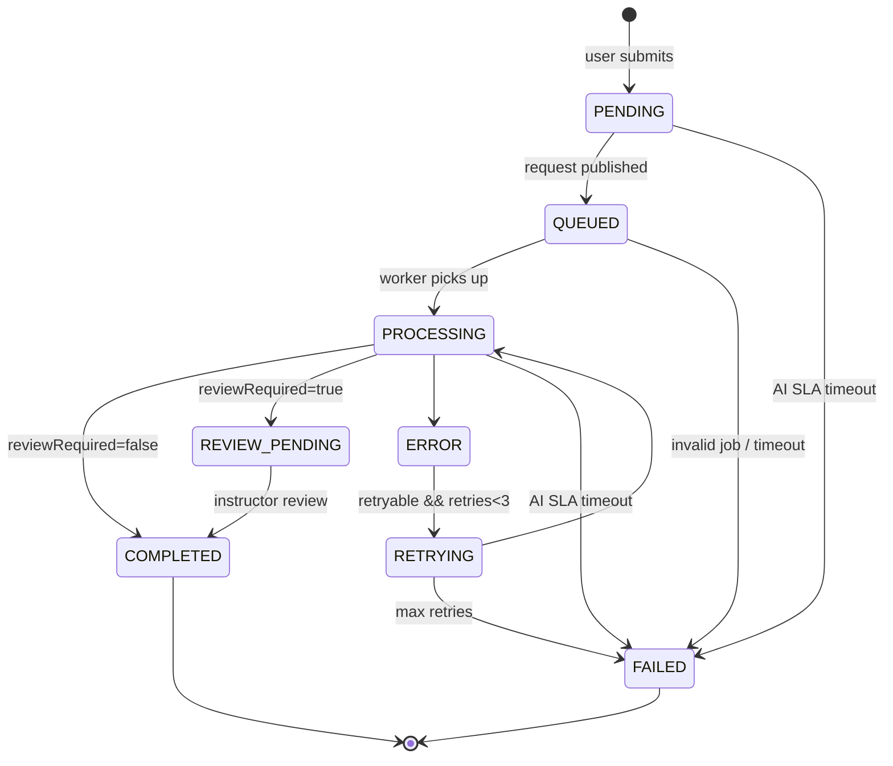

# Submission Lifecycle Specification

> **Phiên bản**: 1.1 · SP26SE145

## 1. Tổng quan

Submission là entity trung tâm kết nối Main App và Grading Service. Spec này định nghĩa vòng đời của một submission từ khi user nộp bài đến khi nhận kết quả, bao gồm state machine, ownership rules, và xử lý edge cases.

---

## 2. State Machine

Notes:

- AI SLA timeout chi ap dung cho pha AI (khong ap dung cho REVIEW_PENDING).
- REVIEW_PENDING la trang thai "AI done" nhung chua co ket qua cuoi cung cho learner.

---

## 3. Định nghĩa trạng thái

| Status | Ai quản lý | Ý nghĩa | Thời gian dự kiến |
|--------|------------|---------|-------------------|
| **PENDING** | Main App | User đã submit, job chưa được đưa vào queue | Vài giây |
| **QUEUED** | Main App | Job đã trong RabbitMQ, đang chờ worker nhận | Vài giây |
| **PROCESSING** | Grading Service | Worker đã nhận job, đang xử lý toàn bộ AI pipeline (LLM/STT + scoring) | 10 giây - 5 phút |
| **REVIEW_PENDING** | Main App | AI đã chấm xong nhưng bắt buộc human review; learner chỉ thấy trạng thái chờ review | Chờ instructor |
| **COMPLETED** | Main App | Kết quả cuối cùng sẵn sàng cho learner (auto-grade hoặc sau human review) | Terminal state |
| **ERROR** | Grading Service | Xử lý gặp lỗi, có thể retry tự động | Transient state |
| **RETRYING** | Grading Service | Đang chờ retry (countdown với exponential backoff) | 2^n giây + jitter |
| **FAILED** | Cả hai | Timeout SLA hoặc max retries exceeded, message vào DLQ | Terminal state |

---

## 4. Luồng chuyển trạng thái

### 4.1 Happy Path (Auto-grade)

PENDING → QUEUED → PROCESSING → COMPLETED

1. **User Submit → PENDING**: Main App tạo submission record (atomic với cơ chế publish reliable - xem `../40-platform/reliability.md`).
2. **PENDING → QUEUED**: Grading request được publish sang `grading.request` theo `../10-contracts/queue-contracts.md`.
3. **QUEUED → PROCESSING**: Grading worker consume message, tạo grading_job trong Grading DB, gửi progress callback qua `grading.callback`.
4. **PROCESSING → COMPLETED**: Worker chạy toàn bộ AI pipeline (LLM/STT + scoring), AI callback `kind=completed` với `reviewRequired=false`.

### 4.2 Happy Path (Review required)

PENDING → QUEUED → PROCESSING → REVIEW_PENDING → COMPLETED

4. **PROCESSING → REVIEW_PENDING**: Worker chạy toàn bộ AI pipeline (LLM/STT + scoring), AI callback `kind=completed` với `reviewRequired=true`.
5. **REVIEW_PENDING → COMPLETED**: Instructor submit review, Main App tạo final result.

### 4.3 Error & Retry Path

1. Khi gặp lỗi (LLM timeout, STT failure, processing exception) → chuyển ERROR.
2. Worker auto-retry nếu retry_count < 3. Backoff: exponential (2^attempt) + random jitter. Cap tối đa 5 phút.
3. Nếu vượt max retries → message vào Dead Letter Queue, callback error gửi về Main App → FAILED.

Chi tiết retry strategy: xem `../40-platform/reliability.md`.

### 4.4 Timeout Path

Main App chạy timeout scheduler định kỳ. Nếu `now > deadline` và submission vẫn đang ở pha AI (PENDING/QUEUED/PROCESSING/ERROR/RETRYING) → update thành FAILED (TIMEOUT).

`REVIEW_PENDING` không bị timeout theo SLA AI (đây là pha chờ human review).

### 4.5 Late Callback

Khi grading callback đến cho submission đã FAILED (do timeout):
- Giữ nguyên status FAILED, không rollback
- Lưu result với đánh dấu `is_late = true`
- Không tính vào progress/analytics
- UI cho phép user xem kết quả muộn ở chế độ read-only
- Log để phân tích và tối ưu SLA/capacity

---

## 5. Ownership Rules — Ai update gì

| Chuyển trạng thái | Trigger bởi | Update Main DB | Update Grading DB | Gửi callback |
|-------------------|------------|----------------|-------------------|---------------|
| Tạo submission (→ PENDING) | Main App API | Có (tạo mới) | Không | Không |
| PENDING → QUEUED | Main App publisher | Có (status) | Không | Không |
| QUEUED → PROCESSING | Grading worker | Không | Có (tạo job) | Có (progress) |
| PROCESSING → REVIEW_PENDING | AMQP Consumer (Main App) | Có (status) | Không | Không |
| PROCESSING → COMPLETED | AMQP Consumer (Main App) | Có (status + result) | Không | Không |
| REVIEW_PENDING → COMPLETED | Instructor action (Main App) | Có (final result) | Không | Không |
| → ERROR | Grading worker | Không | Có (error log) | Có (nếu hết retry) |
| ERROR → RETRYING | Grading worker | Không | Có (status) | Không |
| → FAILED (timeout) | Main App Scheduler | Có (status) | Không | Không |
| Nhận callback (AMQP) | AMQP Consumer (Main App) | Có (status + result) | Không | Không (push SSE) |

**Nguyên tắc bất biến**: Main DB chỉ được ghi bởi Main App. Grading DB chỉ được ghi bởi Grading Service. Giao tiếp qua AMQP queue.

---

## 6. Phân loại theo skill

| Skill | Grading method | Đi qua queue | SLA |
|-------|---------------|--------------|-----|
| Writing | AI (LLM) + optional human review | Có | 20 phút |
| Speaking | STT + AI (LLM) + optional human review | Có | 60 phút |
| Listening | Auto-grade bởi Main App (so sánh answer_key) | Không | Instant |
| Reading | Auto-grade bởi Main App (so sánh answer_key) | Không | Instant |

Listening/Reading submissions không đi qua state machine phức tạp — chúng được chấm ngay khi submit và chuyển thẳng sang COMPLETED.

---

## 7. Nội dung submission theo skill

### Writing
User gửi: nội dung bài viết (text), số từ, loại task (email hoặc essay). Grading Service đánh giá theo rubric VSTEP (task achievement, coherence & cohesion, lexical resource, grammatical range).

### Speaking
User gửi: file audio (URL), thời lượng, part number (1/2/3). Grading Service: STT transcribe → LLM grading (fluency, pronunciation, content, vocabulary).

### Listening/Reading
User gửi: map câu trả lời (question ID → answer). Main App so sánh với answer_key trong bảng questions để tính điểm ngay.

---

## 8. Kết quả chấm điểm (result schema)

Khi grading hoàn thành:

- Nếu auto-grade: submission chuyển COMPLETED và có final result.
- Nếu review required: submission chuyển REVIEW_PENDING và lưu AI result; final result chỉ có sau human review.

Result (AI hoặc final) bao gồm tối thiểu:
- **Overall score**: Thang điểm 0-10
- **VSTEP band**: A1, A2, B1, B2, C1
- **Confidence**: 0-100%, quyết định auto-grade hay cần human review
- **Criteria scores**: Điểm theo từng tiêu chí VSTEP với feedback riêng
- **Feedback**: Strengths, weaknesses, suggestions cho cải thiện
- **reviewRequired + reviewPriority**: dùng cho routing và hàng chờ instructor
- **gradingMode**: auto/human/hybrid

Confidence threshold và routing logic: xem `hybrid-grading.md`.

---

## 9. Cross-references

| Chủ đề | Tài liệu |
|--------|-----------|
| Queue message format | `../10-contracts/queue-contracts.md` |
| Error handling & retry | `../40-platform/reliability.md` |
| SSE status push | `../10-contracts/sse.md` |
| Database tables | `../30-data/database-schema.md` |
| API endpoints | `../10-contracts/api-endpoints.md` |
| Confidence score & hybrid grading | `../../diagrams/flow-diagrams.vi.md` Section 5 |
