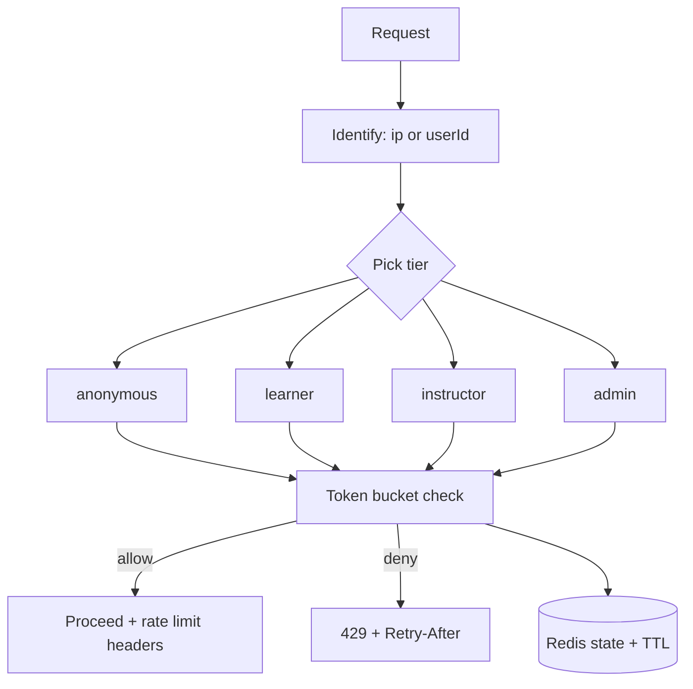

# Rate Limiting

## Purpose

Chốt quy tắc rate limiting để bảo vệ API khỏi abuse, brute-force attacks, và đảm bảo fair usage giữa các users.

## Rate Limiting Flow (tóm tắt)

- Identify client: anonymous theo IP, authenticated theo userId.
- Xác định tier theo role: anonymous/learner/instructor/admin.
- Áp dụng token bucket (cho burst nhỏ, chặn sustained abuse).
- Lưu state trong Redis với TTL để tự cleanup.

## Scope

- Rate limiting cho Bun Main App (Elysia).
- Storage: Redis (cho distributed rate limiting).
- Các tier: anonymous, learner, instructor, admin.
- Endpoint-specific rules cho auth và grading.

## Decisions

| Area | Decision |
|------|----------|
| Storage | Redis (distributed, fast, TTL support) |
| Algorithm | Token bucket (cho burst flexibility) |
| Key strategy | IP cho anonymous; `userId` cho authenticated |
| Headers | `X-RateLimit-Limit`, `X-RateLimit-Remaining`, `X-RateLimit-Reset`, `Retry-After` khi 429 |
| Response | 429 Too Many Requests với JSON error body |

### Rate Limits by Tier

| Tier | Limit | Window | Burst |
|------|-------|--------|-------|
| Anonymous | 30 requests | 1 minute | 5 |
| Learner | 100 requests | 1 minute | 20 |
| Instructor | 500 requests | 1 minute | 100 |
| Admin | 500 requests | 1 minute | 100 |

### Endpoint-Specific Rules

| Endpoint Pattern | Limit | Window | Notes |
|------------------|-------|--------|-------|
| `POST /api/auth/login` | 5 requests | 1 minute | Chống brute-force login/register |
| `POST /api/auth/register` | 5 requests | 1 minute | Chống brute-force register |
| `POST /api/auth/refresh` | 10 requests | 1 minute | Refresh token |
| `POST /api/submissions` | 10 requests | 1 minute | Tạo submission mới |
| `GET /api/*` (read) | Tier default | Tier window | Standard read operations |

## Contracts

### Rate Limit Headers

Tất cả responses (cả thành công và 429) phải include:

| Header | Value |
|--------|-------|
| `X-RateLimit-Limit` | Maximum requests allowed trong window |
| `X-RateLimit-Remaining` | Số requests còn lại trong current window |
| `X-RateLimit-Reset` | Unix timestamp khi window reset |

Khi 429, thêm:

| Header | Value |
|--------|-------|
| `Retry-After` | Seconds to wait before retry |

### Error Response (429)

Response body (conceptual) phải có đủ thông tin để client hiển thị và retry an toàn:

- error code ổn định
- message ngắn
- retryAfter (seconds)
- limit + window

### Redis Key Structure

| Key Pattern | Purpose | TTL |
|-------------|---------|-----|
| `ratelimit:ip:{ip}` | Anonymous limiting | 1m |
| `ratelimit:user:{userId}` | Authenticated limiting | 1m |
| `ratelimit:endpoint:{userId}:{endpoint}` | Endpoint-specific | 1m |

### Whitelist/Exceptions

- Health endpoints (`/health`, `/ready`) không rate limit.
- Internal service-to-service calls (nếu có) bypass rate limit.

## Failure modes

| Failure | Expected behavior |
|---------|-------------------|
| Redis down | Graceful degradation: cho phép requests (log warning) hoặc fallback to local memory limit |
| Clock skew | Use Redis server time hoặc allow small leeway (5s) |
| Burst abuse | Token bucket cho phép burst nhỏ nhưng sustained rate vẫn bị giới hạn |
| Key collision | Include scope trong key (ip vs user vs endpoint) |

## Acceptance criteria

- 429 responses có đầy đủ headers và JSON body.
- Rate limits khác nhau cho anonymous vs learner vs instructor vs admin.
- Auth endpoints (`/api/auth/*`) có limit riêng biệt thấp hơn.
- Redis key có TTL để tự động cleanup.
- Health endpoints không bị rate limit.

---

*Document version: 1.2 - Last updated: SP26SE145*
