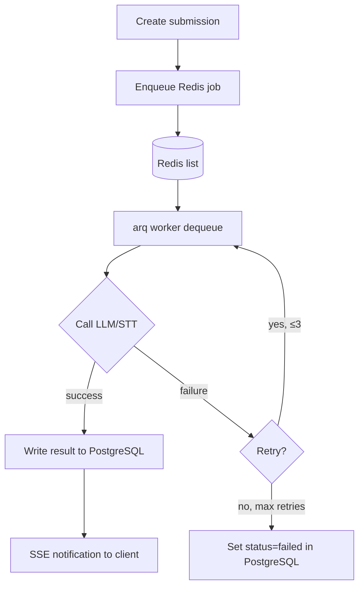

# Reliability & Error Handling

> **Phiên bản**: 2.0 · SP26SE145

## Purpose

Chốt các quy tắc reliability để hệ thống chấm chạy ổn định: không mất job, chống duplicate, có retry, và xử lý failure nhất quán.

## Reliability Flow (tóm tắt)

- Main App tạo submission, enqueues grading job vào Redis list (arq protocol).
- arq worker (Python) dequeues job, calls LLM/STT, writes result directly to PostgreSQL (shared-DB).
- Main App detects completion and pushes SSE notification to client.
- arq handles retry internally (max 3 retries, exponential backoff).



## Scope

- Redis queue (arq) for grading jobs.
- Retry/backoff policy (arq handles internally).
- Circuit breaker for LLM/STT providers.
- Shared-DB architecture (worker writes directly to PostgreSQL).

## Decisions

| Area | Decision |
|------|----------|
| Delivery | at-least-once (arq may redeliver on worker crash) |
| Queue | Redis list (arq protocol) — no RabbitMQ |
| DB architecture | Shared-DB — worker writes results directly to PostgreSQL |
| Retry | max 3 retries (arq handles internally, exponential backoff) |
| Circuit breaker | open when failure rate > 50% over 20 requests, cooldown 30s, trial 3 requests |

## Contracts

### Grading job format (Redis queue)

Job enqueued by Main App:

| Field | Purpose |
|------|---------|
| `submissionId` | Which submission to grade |
| `skill` | writing or speaking |
| `questionId` | Reference to question for context |

### Retry classification (within arq worker)

| Failure type | Retry? | Notes |
|--------------|--------|------|
| 429 / 5xx from provider | Yes | honor `Retry-After` if present |
| Network timeout | Yes | bounded retries (max 3) |
| Worker crash | Yes | arq redelivers job |
| Invalid schema | No | mark submission as `failed` immediately |
| Audio decode error | No | mark submission as `failed` |

### Worker result writing (shared-DB)

When grading completes, worker writes directly to PostgreSQL:

```sql
-- In a single transaction:
UPDATE submissions SET status = 'completed', score = $score, band = $band, 
  grading_mode = 'auto', completed_at = NOW(), updated_at = NOW()
WHERE id = $submissionId AND status IN ('pending', 'processing');

UPDATE submission_details SET result = $result, feedback = $feedback, 
  updated_at = NOW()
WHERE submission_id = $submissionId;
```

Worker checks `status` before writing — if already `completed` or `failed`, skip (idempotent).

## Circuit breaker behavior

When circuit OPEN:
- Worker does not call LLM/STT API.
- Job is requeued with delay (arq defer) for retry after cooldown.
- After cooldown: half-open state, trial 3 requests.
- If trials succeed: close circuit.
- If trials fail: re-open circuit.

## Failure modes

| Failure | Expected behavior |
|---------|-------------------|
| Redis unavailable | Submission created but job not enqueued; retry enqueue on Redis recovery |
| Duplicate job (arq redelivery) | Worker checks submission status; skip if already completed |
| Provider outage | arq retry with backoff; circuit breaker prevents cascading |
| Worker crash mid-job | arq redelivers after timeout; worker re-checks status (idempotent) |
| Max retries exhausted | Worker sets submission status to `failed` |

## Acceptance criteria

- Kill grading worker mid-job: job is redelivered but does not produce duplicate final result.
- Provider returns 429: backoff respects Retry-After within arq retry policy.
- Max retries exhausted: submission becomes `failed`.
- Circuit breaker opens at >50% failure, closes after successful trial requests.

---

*Document version: 2.0 - Last updated: SP26SE145*
