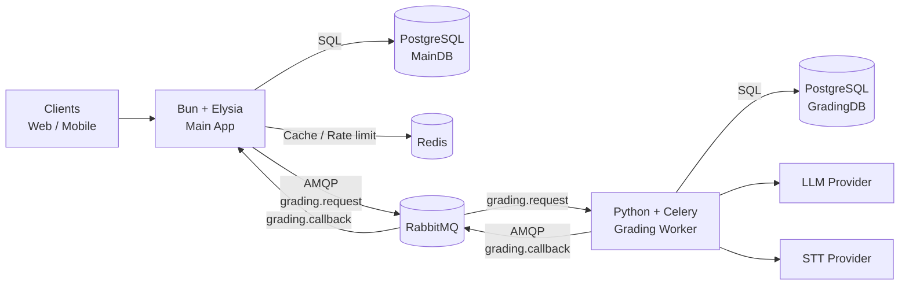

# Technical Specifications Index

## VSTEP Adaptive Learning System - Technical Design Documents

This folder contains implementation-oriented technical specs for the VSTEP Adaptive Learning System.

Writing rule: specs focus on decisions, contracts, and business rules; large code snippets belong in the codebase (or separate examples), not in these documents.

Template rule (applies to all specs): Purpose / Scope / Decisions / Contracts / Failure modes / Acceptance criteria.

## 📁 Specifications

| File | Description |
|------|-------------|
| [solution-decisions.vi.md](./solution-decisions.vi.md) | Architectural decisions, chosen technologies, rationale, and scope boundaries |
| [queue-contracts.vi.md](./queue-contracts.vi.md) | RabbitMQ topology, message schemas, and idempotency rules |
| [reliability.vi.md](./reliability.vi.md) | Outbox pattern, retry policies, DLQ handling, and circuit breakers |
| [authentication.vi.md](./authentication.vi.md) | JWT access/refresh, RBAC, refresh token rotation, and device limits |
| [rate-limiting.vi.md](./rate-limiting.vi.md) | Rate limiting rules, tiers, Redis storage, and endpoint-specific limits |
| [deployment.vi.md](./deployment.vi.md) | Docker Compose configuration, environment variables, and deployment commands |
| [sse.vi.md](./sse.vi.md) | SSE real-time events, grading progress/result push, reconnection |

## 📖 Related Documentation

- **Flow Diagrams**: [../diagrams/flow-diagrams.vi.md](../diagrams/flow-diagrams.vi.md) - System architecture and process flows
- **Flow Diagrams (English)**: [../diagrams/flow-diagrams.md](../diagrams/flow-diagrams.md) - English version of flow diagrams
- **Reports**: [../reports/VI/report1-project-introduction.md](../reports/VI/report1-project-introduction.md) - Project introduction and requirements

## 🔗 Quick Reference

### Architecture Overview

### Key Technologies

| Component | Technology |
|-----------|------------|
| Main App | Bun + Elysia (TypeScript) |
| Grading Service | Python + Celery |
| Message Queue | RabbitMQ (AMQP) |
| Cache / Rate limit | Redis |
| Database | PostgreSQL (separate MainDB/GradingDB) |
| Real-time | SSE (Server-Sent Events) |
| Auth | JWT (Access + Refresh) |

---

*Document version: 1.1 - Last updated: SP26SE145*
