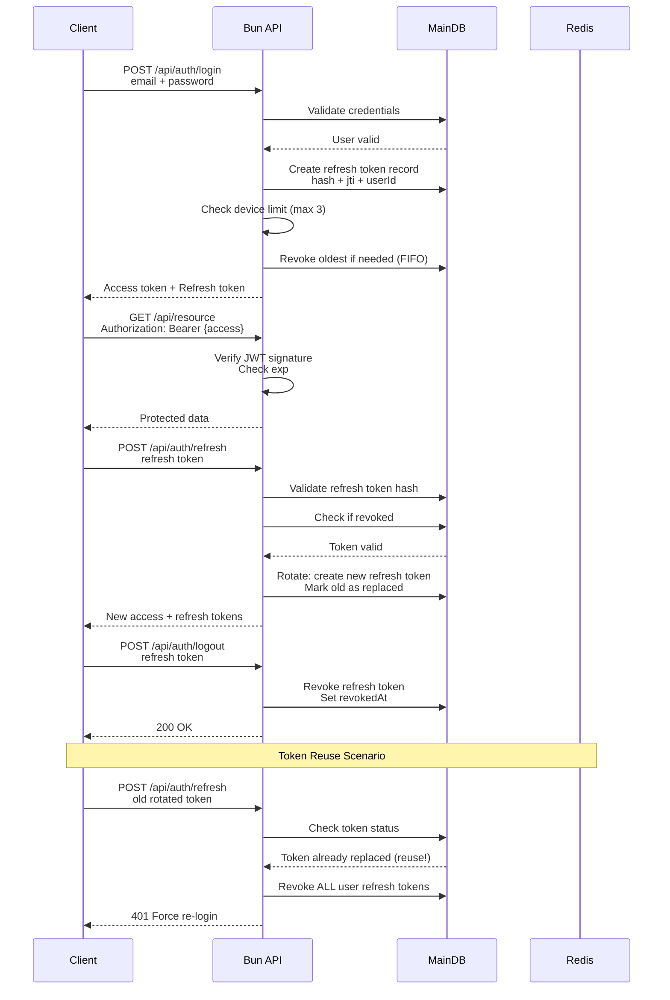

# Authentication & Authorization (JWT)

## Purpose

Chốt cơ chế xác thực cho Main App theo mô hình JWT (access/refresh) để dùng được cho web + mobile, triển khai nhanh, và không phụ thuộc session state ở server.

## JWT Flow

## Scope

- Main App (Bun + Elysia): login/register, issue token, refresh, logout, RBAC.
- Token format: JWT (signed), có access token và refresh token.
- OAuth: optional (future), không phải baseline.

## Decisions

### Token model

| Item | Decision |
|------|----------|
| Access token | JWT, short-lived |
| Refresh token | JWT, long-lived |
| Rotation | Refresh token rotate on every refresh |
| Storage | Refresh token phải có record server-side (hash) để revoke + enforce device limit |
| Transport (baseline) | Backend tự quyết định. Khuyến nghị: access token qua `Authorization: Bearer`; refresh token qua body hoặc HttpOnly cookie |

### Claims (tối thiểu)

| Claim | Required | Notes |
|-------|----------|------|
| `sub` | Yes | `userId` |
| `role` | Yes | `learner`/`instructor`/`admin` |
| `jti` | Yes | unique token id (để revoke/rotate) |
| `iat` / `exp` | Yes | issued-at / expiry |

### Device/session limit

- Baseline: tối đa 3 refresh tokens active per user (coi như 3 devices).
- **Counting rule**: Sắp xếp theo `issuedAt`, revoke token có `issuedAt` cũ nhất (FIFO).
- Trigger: Khi login tạo refresh token mới và vượt giới hạn 3.

## Contracts

### API operations (baseline)

API routes/paths do backend tự quyết định. Hệ thống phải hỗ trợ các operations sau:

| Operation | Auth | Endpoint | Output |
|-----------|------|----------|--------|
| Register | Public | `POST /api/auth/register` | user created |
| Login | Public | `POST /api/auth/login` | access token + refresh token |
| Refresh | Refresh token | `POST /api/auth/refresh` | rotated refresh token + new access token |
| Logout | Refresh token | `POST /api/auth/logout` | revoke current refresh token |
| Get current user context | Access token | `GET /api/auth/me` | `userId`, `role` |

### Refresh token store (requirements)

Refresh token phải có store server-side (MainDB hoặc Redis). Baseline khuyến nghị MainDB.

| Field | Purpose |
|------|---------|
| `userId` | owner |
| `jti` | unique id |
| `tokenHash` | hash của refresh token (không lưu plaintext) |
| `issuedAt` / `expiresAt` | lifecycle |
| `revokedAt` | revoke support |
| `replacedByJti` | rotation chain (optional) |
| `deviceId` | device tracking (optional) |

## Failure modes

| Failure | Expected behavior |
|--------|-------------------|
| Access token expired | 401; client calls refresh |
| Refresh token expired | 401; require login |
| Refresh token reuse (rotated token reused) | Revoke **toàn bộ token family của user** (tất cả active refresh tokens của user), force login |
| Token signature invalid | 401 |
| Clock skew | allow small leeway (e.g., 30s) |

## Acceptance criteria

- Login returns access/refresh and access-protected endpoints require Bearer token.
- Refresh rotates refresh token and old refresh token becomes invalid.
- Logout revokes current refresh token.
- Max 3 active refresh tokens per user enforced.
- RBAC gate works for instructor/admin routes.

---

*Document version: 1.2 - Last updated: SP26SE145*
