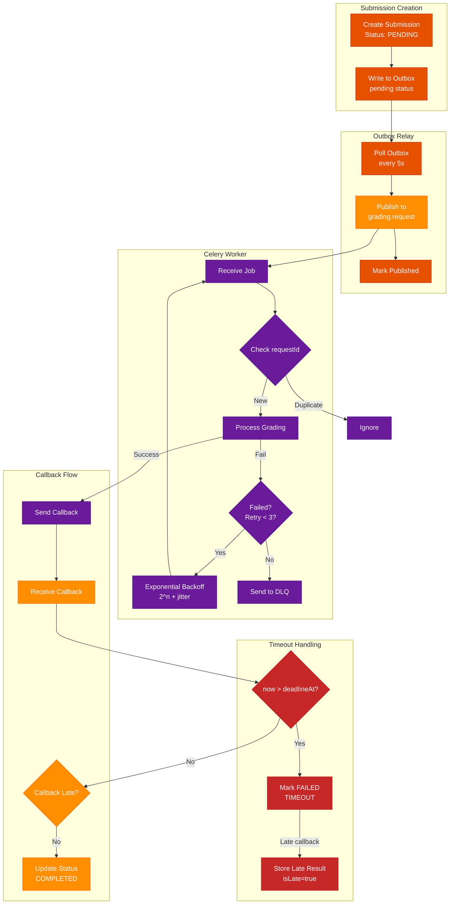

# Reliability & Error Handling

## Purpose

Chốt các quy tắc reliability để hệ thống chấm (Bun <-> RabbitMQ <-> Python/Celery) chạy ổn định: không mất job, chống duplicate, có retry/DLQ, và xử lý timeout/late-result nhất quán.

## Reliability Flow

## Scope

- Outbox pattern ở MainDB (publish `grading.request` reliable).
- Retry/backoff policy ở grading worker.
- DLQ policy và manual recovery.
- Timeout + late callback rule (business rule).
- Circuit breaker note cho LLM/STT.

## Decisions

| Area | Decision |
|------|----------|
| Delivery | at-least-once (duplicate possible) |
| Publish reliability | Outbox + relay worker (Main App side) |
| Outbox poll interval | 5s (configurable via OUTBOX_POLL_INTERVAL_MS) |
| Outbox batch size | 50 records/poll (configurable) |
| Retry | `max_retries = 3` (Celery) |
| Backoff | exponential + jitter, cap 300s, honor `Retry-After` for 429 |
| DLQ | `grading.dlq` for non-retryable or max retry |
| SLA | writing 20m, speaking 60m |
| Late callback | keep `FAILED(TIMEOUT)`, store result with `isLate=true` |
| Circuit breaker | open when failure rate > 50% over 20 requests, cooldown 30s, trial 3 requests |
| Timeout check interval | 60s via cron/scheduler (configurable) |

## Contracts

### Outbox (MainDB) requirements

Outbox record can be stored in MainDB with minimum fields:

| Field | Purpose |
|------|---------|
| `id` | identifier |
| `aggregate_id` | `submissionId` |
| `message_type` | `grading.request` |
| `payload` | JSON body |
| `status` | `pending` -> `published` / `failed` |
| `created_at` / `processed_at` | FIFO + audit |
| `retry_count` / `error_message` | relay retry + debug |

Relay behavior:
- Relay pulls `pending` by `created_at`.
- Batch size: 50 records per poll (configurable via OUTBOX_BATCH_SIZE).
- Publish to RabbitMQ.
- Mark `published` on success.
- On publish fail: retry with bounded backoff; do not block new writes.
- Monitoring: log warning if record older than 60s (configurable via OUTBOX_STALE_THRESHOLD_MS).

### Retry classification

| Failure type | Retry? | Notes |
|--------------|--------|------|
| 429 / 5xx from provider | Yes | honor `Retry-After` if present |
| Network timeout | Yes | bounded retries |
| Worker lost / crash | Yes | message redelivery may occur |
| Invalid schema | No | DLQ immediately |
| Audio decode error | No | DLQ + mark attempt failed |

### DLQ payload requirements

DLQ record must retain at least:

| Field | Required |
|------|----------|
| `requestId` | Yes |
| `submissionId` | Yes |
| `failureReason` | Yes |
| `attemptsMade` | Yes |
| `lastError` | Yes |
| `timestamp` | Yes |

### Timeout & late-result rule (business)

- Main App computes `deadlineAt = createdAt + SLA(skill)` at attempt creation.
- When `now > deadlineAt` and attempt not `COMPLETED`: set `FAILED` with `failureReason=TIMEOUT`.
- When callback arrives after timeout:
  - Store grading result with `isLate=true` (audit).
  - Do not change attempt status.
  - Do not update progress/analytics automatically.

### Timeout Scheduler

Proactive timeout detection via periodic scheduler:

| Parameter | Value | Env Variable |
|-----------|-------|--------------|
| Check interval | 60s | TIMEOUT_CHECK_INTERVAL_MS=60000 |
| Query | `status='PROCESSING' AND deadline_at < NOW()` | - |
| Action | `UPDATE status='FAILED', reason='TIMEOUT'` + SSE notification | - |

Implementation options:
- Bun App: `setInterval` (simple, single instance recommended)
- Multiple instances: use Redis lock to prevent duplicate processing
- Production: `pg_cron` for higher reliability

## Circuit breaker behavior

When circuit OPEN:
- Worker does not call LLM/STT API.
- Publish callback with `status=error`, `error.code=CIRCUIT_OPEN`.
- Message is requeued with delay (backoff) for retry after cooldown.

## Failure modes

| Failure | Expected behavior |
|---------|-------------------|
| Outbox relay down | submissions still saved; relay catches up when restarted |
| Duplicate request | grading dedup by `requestId`, no double-charge |
| Provider outage | retry/backoff; then DLQ; circuit breaker prevents cascading |
| Callback lost | bounded retry publish; alert if persist |
| Timeout near-deadline race | deterministic compare using `deadlineAt` and callback received time |
| Circuit breaker open | requests queued with error, retry after cooldown |

## Acceptance criteria

- Kill grading worker mid-job: job is redelivered but does not produce duplicate final result.
- Broker restart: outbox ensures requests are eventually published.
- Provider returns 429: backoff respects Retry-After and stays within cap.
- Timeout happens: attempt becomes `FAILED(TIMEOUT)` and does not flip to COMPLETED after late callback.
- DLQ receives poison message and does not auto-loop.
- Circuit breaker opens at >50% failure, closes after successful trial requests.

---

*Document version: 1.2 - Last updated: SP26SE145*
