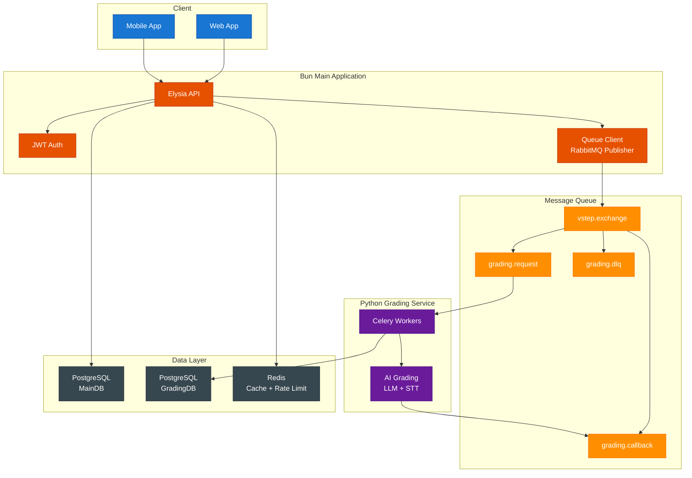

# Chốt Phương Án Kiến Trúc

## Purpose

Tài liệu này chốt các quyết định kiến trúc/boundary để backend implement nhanh, ít vênh giữa Bun Main App và Python Grading Service.

## Architecture Overview

## Scope

- Main App: Bun + Elysia (TypeScript)
- Grading Service: Python + Celery
- Queue cross-service: RabbitMQ
- DB: PostgreSQL tách MainDB/GradingDB
- Cache/rate limit: Redis
- Real-time: SSE (default)
- Auth: JWT access/refresh (baseline)

## Decisions

### Tech stack (final)

| Component | Decision | Alternatives |
|----------|----------|--------------|
| Main App | Bun + Elysia | Node.js + Express, Deno |
| Grading Service | Python + Celery | Rust, Go |
| Message Queue | RabbitMQ (AMQP) | Redis Streams, Kafka |
| Database | PostgreSQL (MainDB + GradingDB) | MySQL, CockroachDB |
| Cache/Rate limit | Redis | Postgres-only |
| Real-time | SSE | WebSocket |
| Auth | JWT access + refresh | Server session |

### Rationale (ngắn)

- RabbitMQ + Celery: mature, có DLQ/retry tốt, dễ scale worker.
- JWT access/refresh: dùng được cho web/mobile, không cần session state server.
- Tách DB: giảm coupling, dễ audit.

## Contracts

- Message contracts: `docs/capstone/specs/queue-contracts.vi.md`
- Reliability rules: `docs/capstone/specs/reliability.vi.md`
- Auth rules: `docs/capstone/specs/authentication.vi.md`
- Deployment env: `docs/capstone/specs/deployment.vi.md`

## Failure modes

| Area | Risk | Mitigation |
|------|------|------------|
| Queue | duplicate deliveries | `requestId` idempotency |
| Provider | 429/timeout | retry/backoff + cap + DLQ |
| Outbox | publish fail | relay + retry |
| Provider | cascading failure | circuit breaker (open at >50% failure rate, cooldown 30s) |
| Auth | refresh token theft | rotation + revoke store |

## Acceptance criteria

- Tất cả service boundary (Main/Grading) giao tiếp qua queue contracts.
- Quy tắc retry/timeout/late-result áp dụng nhất quán.
- Auth baseline là JWT access/refresh, không còn session cookie baseline.

## Business rules defaults (Chốt)

- Grading SLA: Writing 20 phút; Speaking 60 phút.
- Timeout: quá `deadlineAt` → `FAILED(TIMEOUT)`; callback muộn lưu `isLate=true`, giữ `FAILED`.
- Retry/backoff: `max_retries=3`, exponential + jitter, cap 5 phút, tôn trọng `Retry-After`.

---

*Document version: 1.2 - Last updated: SP26SE145*
