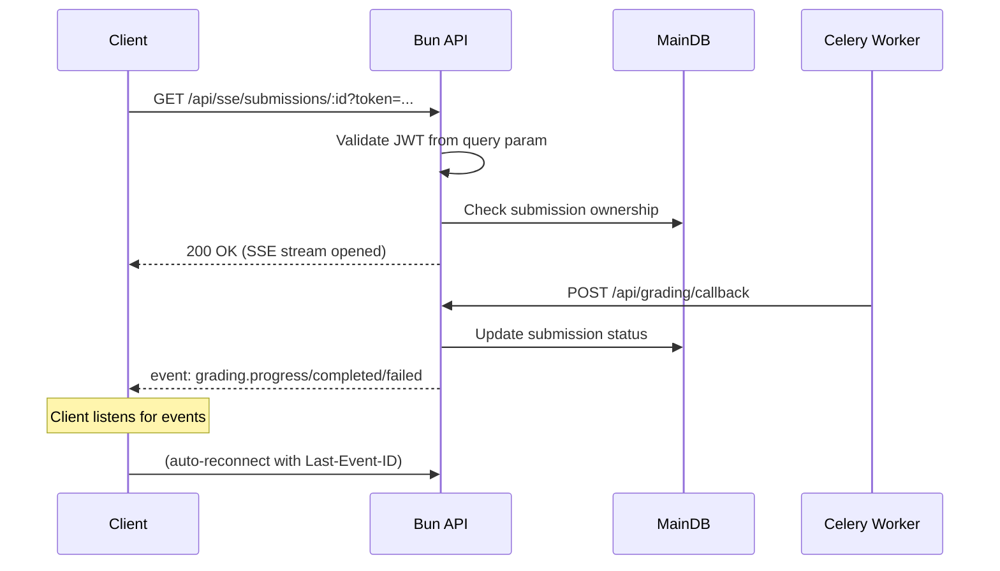

# Server-Sent Events (SSE) Specification

## Purpose

Chốt cơ chế SSE để push real-time grading progress và result về cho client.

## Scope

- SSE endpoint trên Bun Main App.
- Events: grading progress, completed, failed.
- Authentication via query parameter.
- Reconnection với `Last-Event-ID`.

## SSE Flow



## Contracts

### Endpoint

```
GET /api/sse/submissions/:submissionId?token=<access_token>
```

### Authentication

- Token passed via query parameter (SSE không hỗ trợ custom headers từ browser).
- Validate JWT signature, expiration.
- Verify user owns the submission (submission.userId == token.sub).

### Event Format

```typescript
// Progress event
event: grading.progress
data: {
  "submissionId": "uuid",
  "status": "processing",
  "step": "transcribing" | "analyzing" | "scoring",
  "progress": 0.75,
  "message": "Đang phân tích nội dung..."
}

// Completed event
event: grading.completed
data: {
  "submissionId": "uuid",
  "status": "completed",
  "score": 7.5,
  "band": "7.0-7.5",
  "resultUrl": "/api/results/..."
}

// Failed event
event: grading.failed
data: {
  "submissionId": "uuid",
  "status": "failed",
  "reason": "timeout" | "error",
  "errorCode": "CIRCUIT_OPEN" | "PROVIDER_ERROR"
}

// Ping/Heartbeat (keep-alive)
event: ping
data: null
```

### Headers

| Header | Value |
|--------|-------|
| `Content-Type` | `text/event-stream` |
| `Cache-Control` | `no-cache` |
| `Connection` | `keep-alive` |
| `X-Accel-Buffering` | `no` (disable nginx buffering) |

### Reconnection

- Server gửi `retry: 5000` (5 giây) trong mỗi event.
- Client gửi `Last-Event-ID` header khi reconnect.
- Server replay event cuối cùng dựa trên `requestId`.

### Timeout

- Connection tự đóng sau 30 phút idle.
- Server gửi heartbeat mỗi 30 giây để giữ connection.

## Implementation

### Bun/Elysia Handler

```typescript
app.get('/api/sse/submissions/:id', async (c) => {
  const token = c.query.token
  const submissionId = c.params.id
  
  // Validate JWT
  const payload = verifyJWT(token)
  if (!payload) return c.status(401)
  
  // Check ownership
  const submission = await db.submissions.find(submissionId)
  if (submission.userId !== payload.sub) return c.status(403)
  
  // Return SSE stream
  return c.sse({
    open({ send }) {
      // Subscribe to channel
      const channel = pubsub.subscribe(submissionId, send)
    },
    close({ send }) {
      pubsub.unsubscribe(submissionId)
    }
  })
})
```

### Publishing Events

Khi Bun app nhận callback từ RabbitMQ:

```typescript
// grading/callback handler
app.post('/api/grading/callback', async (c) => {
  const { submissionId, status, result } = await c.req.json()
  
  // Update DB
  await db.submissions.update(submissionId, { status, result })
  
  // Push SSE event
  pubsub.publish(submissionId, {
    event: `grading.${status}`,
    data: { submissionId, ...result }
  })
  
  return c.status(200)
})
```

## Failure Modes

| Failure | Behavior |
|---------|----------|
| Token invalid/expired | 401 Unauthorized |
| Submission not found | 404 Not Found |
| User not owner | 403 Forbidden |
| Redis/PubSub down | SSE không hoạt động, client reconnect |
| Worker crash | Last-Event-ID replay khi reconnect |

## Client SDK Example

```typescript
class GradingSSE {
  private es: EventSource | null = null
  
  connect(submissionId: string, token: string) {
    this.es = new EventSource(
      `/api/sse/submissions/${submissionId}?token=${token}`
    )
    
    this.es.addEventListener('grading.progress', (e) => {
      const data = JSON.parse(e.data)
      console.log('Progress:', data.step, data.progress)
    })
    
    this.es.addEventListener('grading.completed', (e) => {
      const data = JSON.parse(e.data)
      console.log('Score:', data.score)
      this.es?.close()
    })
    
    this.es.addEventListener('grading.failed', (e) => {
      const data = JSON.parse(e.data)
      console.error('Failed:', data.reason)
      this.es?.close()
    })
  }
  
  reconnect(lastEventId: string) {
    // Implement với Last-Event-ID header
  }
}
```

## Acceptance Criteria

- Client mở SSE connection và nhận events real-time.
- Khi grading hoàn thành, client nhận event với score/result.
- Khi reconnect sau disconnect, client gửi Last-Event-ID và nhận event bị miss.
- SSE không bị buffering bởi nginx/proxy.
- Health endpoint không bị ảnh hưởng bởi SSE connections.

---

*Document version: 1.0 - Last updated: SP26SE145*
