# VSTEP Mobile — Sơ đồ luồng

Tài liệu mô tả các luồng hoạt động chính của ứng dụng di động VSTEP, sử dụng sơ đồ Mermaid.

## Mục lục

- [1. Luồng xác thực](#1-luồng-xác-thực)
- [2. Luồng Onboarding](#2-luồng-onboarding)
- [3. Luồng luyện tập](#3-luồng-luyện-tập)
- [4. Luồng bài thi](#4-luồng-bài-thi)
- [5. Luồng lớp học](#5-luồng-lớp-học)
- [6. Luồng điều hướng tổng quan](#6-luồng-điều-hướng-tổng-quan)
- [7. Luồng token tự động làm mới](#7-luồng-token-tự-động-làm-mới)
- [8. Luồng dữ liệu](#8-luồng-dữ-liệu)

---

## 1. Luồng xác thực

Khi ứng dụng khởi động, hệ thống kiểm tra token trong SecureStore để xác định trạng thái đăng nhập. Nếu token hợp lệ, người dùng được chuyển thẳng vào ứng dụng; nếu không, chuyển về màn hình đăng nhập.

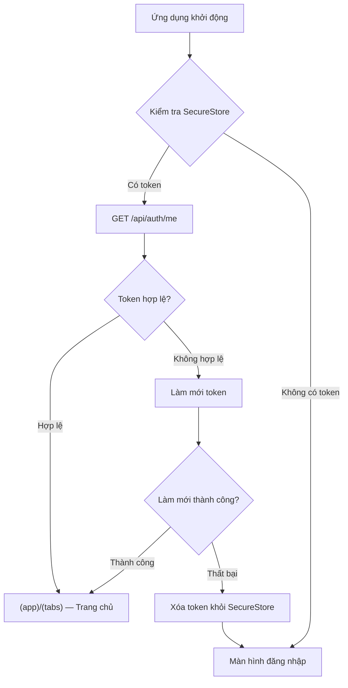

### Đăng nhập

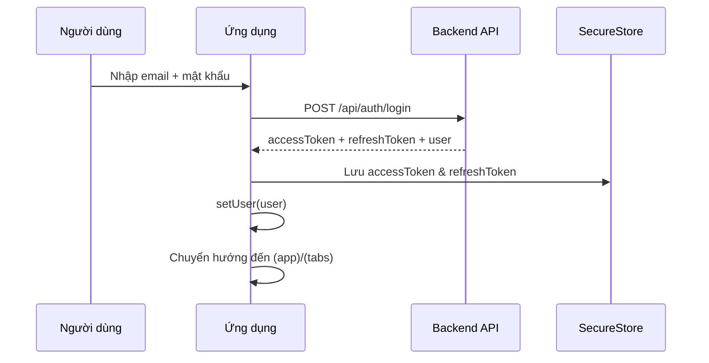

### Đăng ký

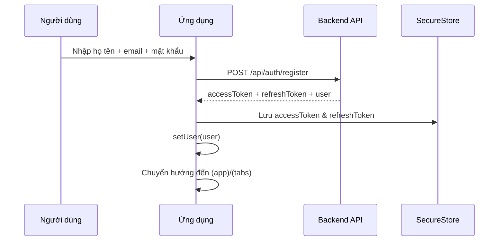

### Đăng xuất

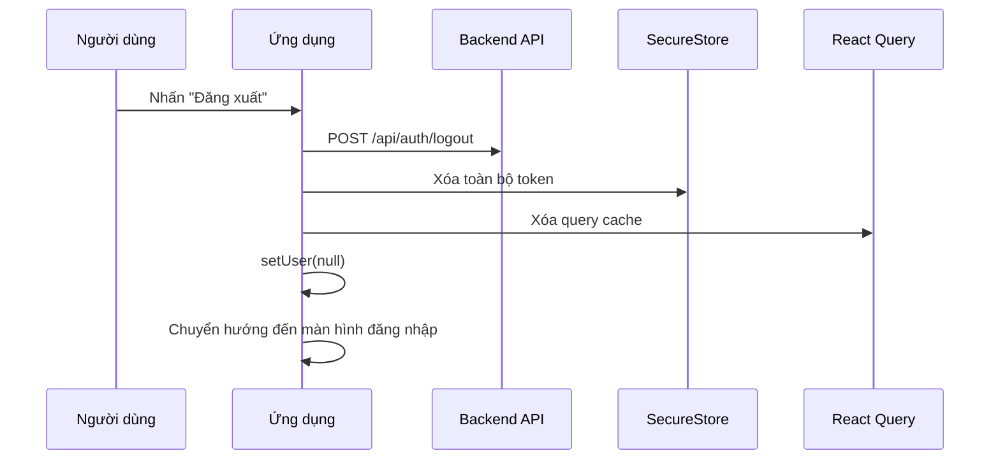

---

## 2. Luồng Onboarding

Khi người dùng mới chưa thiết lập mục tiêu học tập, ứng dụng tự động chuyển đến màn hình onboarding dạng wizard gồm 4 bước. Người dùng có thể truy cập lại wizard từ trang Hồ sơ để cập nhật mục tiêu.

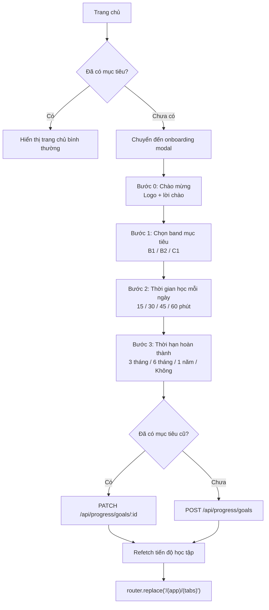

> **Chống spam điều hướng:** Sử dụng `isTransitioning` ref để chặn thao tác điều hướng trong lúc chuyển cảnh (~500ms).

> **Truy cập lại:** Hồ sơ → "Mục tiêu học tập" → cùng wizard (cập nhật mục tiêu hiện tại).

---

## 3. Luồng luyện tập

Người dùng chọn kỹ năng muốn luyện tập, hệ thống tải câu hỏi tương ứng. Bài Nghe/Đọc được chấm điểm ngay lập tức, còn bài Viết/Nói được chấm bất đồng bộ qua AI (Groq LLM).

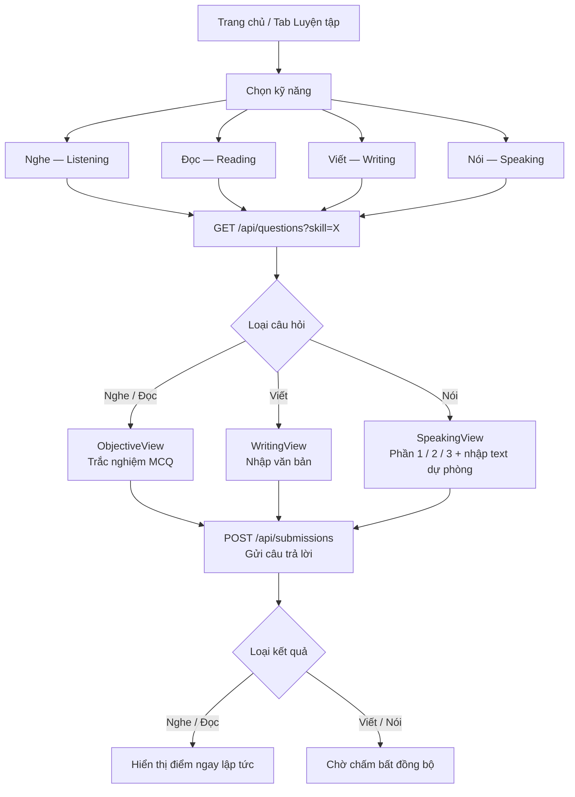

### Chi tiết chấm điểm bất đồng bộ (Viết / Nói)

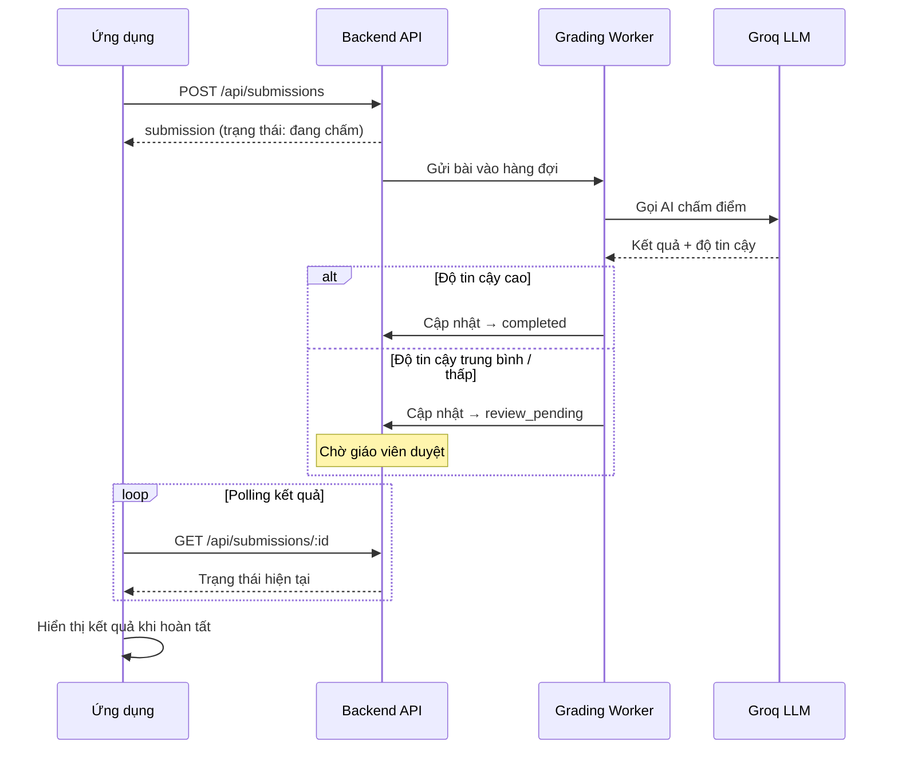

---

## 4. Luồng bài thi

Người dùng chọn bài thi từ danh sách, bắt đầu phiên thi, trả lời câu hỏi theo từng phần kỹ năng. Hệ thống tự động lưu bài mỗi 30 giây và hiển thị đồng hồ đếm ngược.

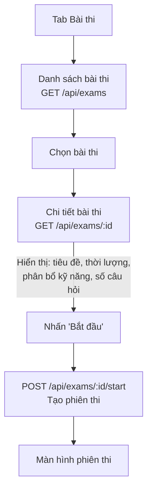

### Chi tiết phiên thi

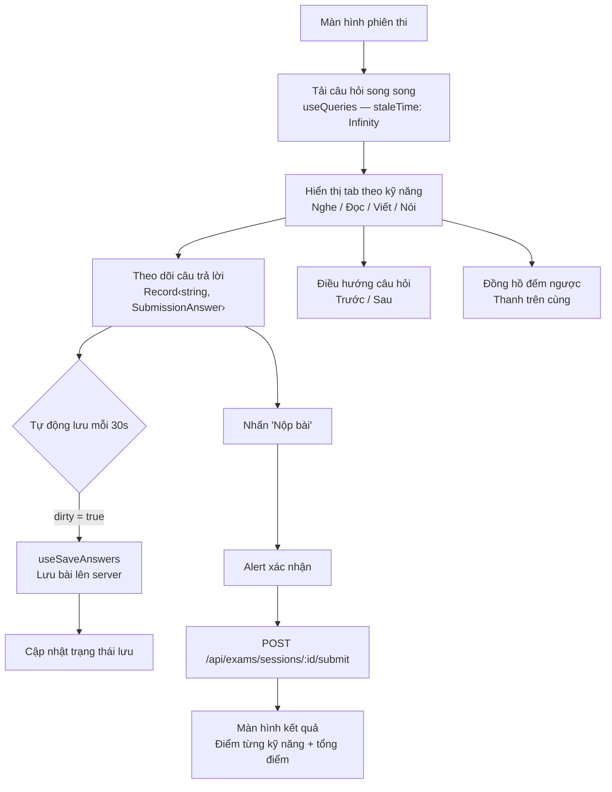

---

## 5. Luồng lớp học

Người dùng có thể xem danh sách lớp đã tham gia, tham gia lớp mới bằng mã mời, xem chi tiết lớp với danh sách thành viên và phản hồi từ giáo viên.

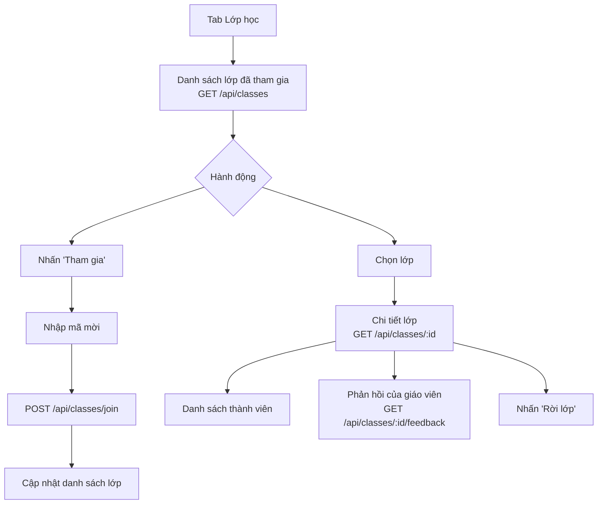

---

## 6. Luồng điều hướng tổng quan

Cấu trúc điều hướng của ứng dụng sử dụng Expo Router với các stack lồng nhau. Thanh tab dưới cùng có hiệu ứng spring animation, nút Bài thi ở giữa có biểu tượng hình tròn nổi bật.

```mermaid
graph TD
    ROOT[Root Stack] --> IDX[index<br/>Chuyển hướng theo trạng thái xác thực]

    ROOT --> AUTH["(auth) Stack<br/>Chưa đăng nhập"]
    AUTH --> LOGIN[login — Đăng nhập]
    AUTH --> REG[register — Đăng ký]

    ROOT --> APP["(app) Stack<br/>Đã đăng nhập"]

    APP --> TABS["(tabs) — 5 tab<br/>CustomTabBar với spring animation"]
    TABS --> TAB1["🏠 Trang chủ<br/>Hero, lưới kỹ năng, thống kê, thẻ mục tiêu"]
    TABS --> TAB2["📊 Tiến độ<br/>Thanh kỹ năng, biểu đồ mạng nhện, xu hướng"]
    TABS --> TAB3["📝 Bài thi<br/>Nút tròn ở giữa, danh sách bài thi"]
    TABS --> TAB4["👥 Lớp học<br/>Danh sách lớp + tham gia"]
    TABS --> TAB5["👤 Hồ sơ<br/>Thông tin, mật khẩu, bài nộp, mục tiêu, đăng xuất"]

    APP --> OB[onboarding — Modal]
    APP --> EXAM["exam/[id] — Chi tiết bài thi"]
    APP --> SESSION["session/[id] — Phiên thi"]
    APP --> PRAC[practice/index — Chọn kỹ năng]
    APP --> PRACSKILL["practice/[skill] — Luyện tập"]
    APP --> PRACRES["practice/result/[id] — Kết quả"]
    APP --> CLS[classes/index — Danh sách lớp]
    APP --> CLSDET["classes/[id] — Chi tiết lớp"]
    APP --> SKILL["skill/[name] — Chi tiết kỹ năng"]
    APP --> SUBS[submissions/index — Danh sách bài nộp]
    APP --> SUBSDET["submissions/[id] — Chi tiết bài nộp"]
```

---

## 7. Luồng token tự động làm mới

Khi một yêu cầu API trả về lỗi 401, hệ thống tự động thử làm mới token. Cơ chế sử dụng một promise duy nhất (`refreshPromise`) để tránh nhiều yêu cầu làm mới chạy đồng thời.

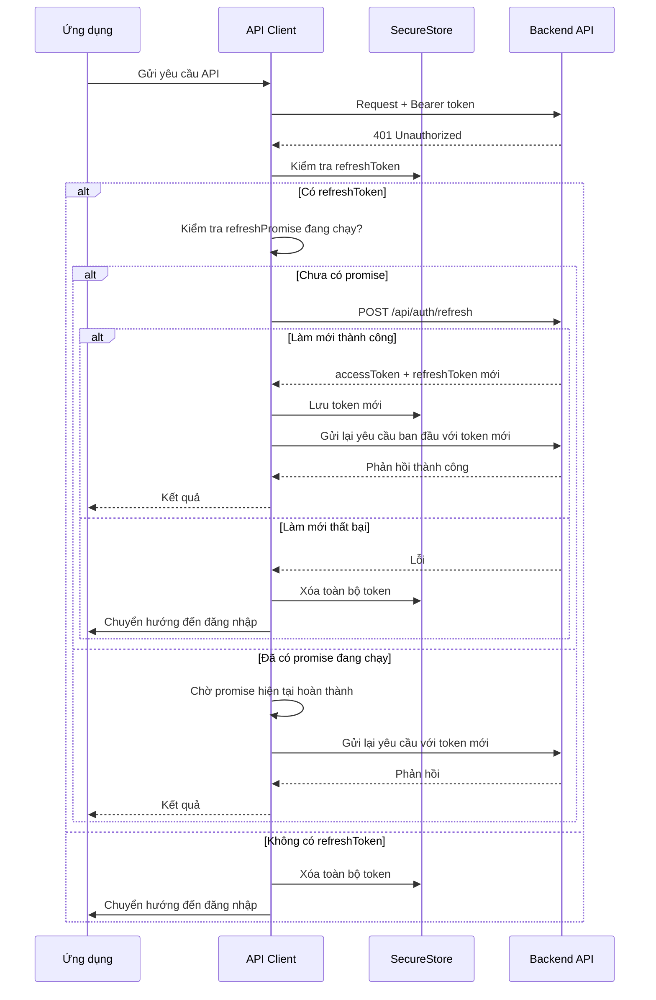

> **Lưu ý:** Biến `refreshPromise` đảm bảo chỉ có một yêu cầu làm mới token tại một thời điểm. Các yêu cầu 401 đồng thời sẽ chờ cùng một promise thay vì tạo nhiều yêu cầu làm mới.

---

## 8. Luồng dữ liệu

Kiến trúc luồng dữ liệu trong ứng dụng tuân theo mô hình một chiều: component gọi custom hook, hook sử dụng React Query để quản lý cache và đồng bộ, API Client xử lý giao tiếp HTTP với backend.

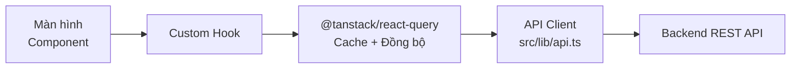

### Chi tiết API Client

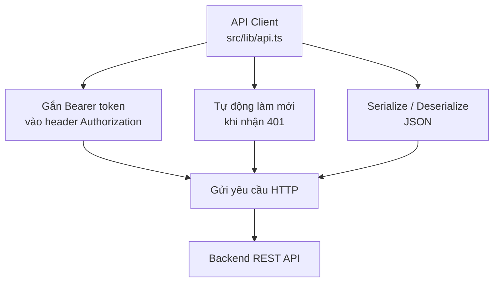

### Luồng dữ liệu chi tiết

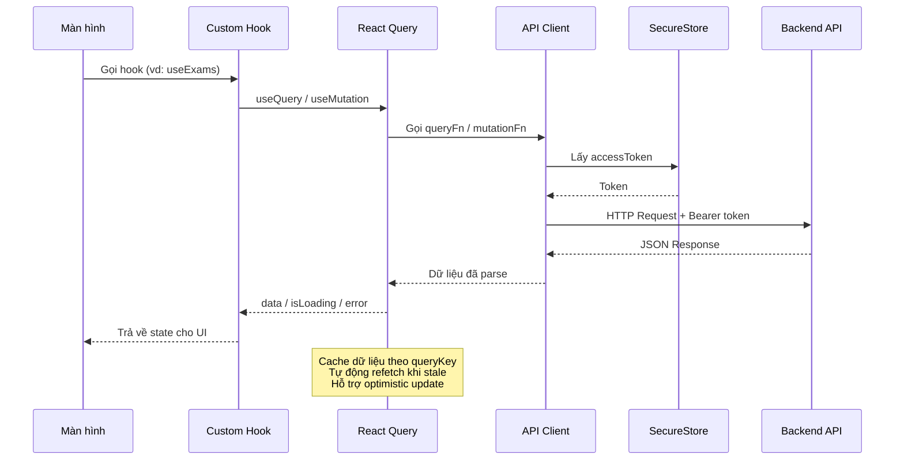
